# Fresha Partner Dashboard: final map

Product: Fresha Partner Dashboard (https://partners.fresha.com)
Mapped: 2026-10-04, against the staging workspace "Test Salon" (location id 3216614, currency KWD, app version 2.8.11390)
Produced by: the council (Cartographer page inventory, Linker relationship map, Verifier live re-check). All Verifier corrections are applied below. Claims the council could not confirm by exercising them are labeled UNVERIFIED and nothing more is claimed for them.

---

## 1. Executive summary

The Fresha Partner Dashboard is the business-side application a salon or spa uses to run its day: schedule appointments, take payments, manage clients and staff, sell services and retail products, market to clients, publish online booking channels, and read reports.

The left sidebar holds eleven areas: Dashboard, Calendar, Sales, Clients, Catalogue, Fresha (online bookings), Marketing, Team, Reports, Add-ons, and Setup. A global top bar adds Continue setup, Search, Performance insights, News, Notifications (unread badge), the Fresha Connect messaging app, and the user menu (referral, My profile, Personal settings, Help and support, Log out). The Fresha logo links to /calendar, not /dashboard.

The core entities the whole product revolves around are:

- Appointments: created on the Calendar, viewed in dashboard feeds and the appointment drawer, listed under Sales, reported on in Reports, and used as triggers by Marketing automations.
- Clients: managed in the Clients list, grouped into segments, contacted through Connect and marketing messages, reviewed under Online reputation.
- Services, packages, and products: the sellable catalogue, defined under Catalogue and consumed by booking, POS, and online booking channels.
- Payments and sales: money movement, tracked across Sales pages and finance reports.
- Team members: staff records that act as bookable resources on the Calendar and feed shifts, timesheets, and pay runs.
- Locations and online presence: the marketplace profile plus booking channels (Google, Facebook/Instagram, links, Smart Website).

Many features in this workspace sit behind activation screens ("Start now", "Included in your plan", "Set up now") because the test account has not enabled those add-ons. In those cases the council mapped the entry page, not the activated workflow. Roughly 41 distinct pages and overlays were catalogued: 35 canonical routes plus the appointment drawer, six top-bar overlays, and two user-account pages. One screenshot per page is stored in /Users/fahad/council/output/screenshots/.

---

## 2. Page map

### Global navigation

Sidebar (icon accordion, top to bottom): Dashboard, Calendar | Sales | Clients | Catalogue | Fresha (Online bookings) | Marketing | Team | Reports, Add-ons, Setup. Section labels only exist in aria-label attributes on the buttons; sub-navigation appears when a section is expanded.

Top bar overlays (not separate URLs): Continue setup (onboarding checklist), Search (global), Performance insights (Insights add-on overlay), News, Notifications (4 unread at mapping time), Fresha Connect, user menu.

### Home and calendar

| Page | URL | Purpose | Features |
|---|---|---|---|
| Dashboard | /dashboard | Business at a glance | "Recent sales" KPI card with filters (sales vs appointments, last 7 days); "Upcoming appointments" KPI card with filters (confirmed vs canceled, next 7 days); "Appointments activity" feed and "Today's next appointments" feed, each row opening the appointment drawer; "Top services" table (Service / This month / Last month); "Top team member" table (Team member / This month / Last month). Data from reports.fresha.com dashboard endpoints. |
| Calendar | /calendar?date&view&location_id | Day/week booking calendar | Date navigation (Today, prev/next month, date picker); "Scheduled team" toggle; reset default view; Day view switch; "Add" button to create an appointment; one resource column per team member; clickable appointment blocks opening the drawer. Data from partners-calendar-api.fresha.com. |

### Sales module

| Page | URL | Purpose | Features |
|---|---|---|---|
| Daily sales summary | /sales/daily-sales | Per-day sales breakdown | Export; "Add new"; prev/next day navigation; sales table (Item type, Sales qty, Refund qty, Gross total); payments table (Payment type, Payments collected, Refunds paid). |
| Register | /sales/register | Point-of-sale register | Activation page in this workspace ("Included in your plan", Start now). POS behavior not exercised. |
| Appointments | /sales/appointments-list | Tabular list of all appointments | Export; date-range presets ("Month to date"); Filters; sort by Scheduled Date; columns Ref #, Client, Service, Created by, Created Date, Scheduled Date, Duration, Team member, Price, Status. |
| Sales | /sales/sales-list | Completed sales | Options; Add new; Sales/Drafts tabs; Filters; Sort by; columns Sale #, Client, Status, Sale date, Tips, Gross total. |
| Payments | /sales/payment-transactions | All payment transactions | Options; date-range picker; Filters; sortable columns Payment date, Location, Ref #, Client, Team member, Type, Method, amount. |
| Gift cards sold | /sales/gift-cards | Gift card sales list | Options menu; Learn more link; empty in this workspace. |
| Packages sold | /sales/packages-sold | Packages purchased by clients | Options; "All statuses" filter; "Set up now" enablement. |
| Memberships sold | /sales/paid-plans (redirects to /sales/memberships) | Memberships purchased by clients | Export; filters. |

### Clients module

| Page | URL | Purpose | Features |
|---|---|---|---|
| Clients list | /clients/list | View, add, edit, delete client profiles | Client count badge; Options; Add; "Import your client list" banner (Start import); search by name/email/phone; Filters; sort by Created at; table with select-all, Client name (avatar, email), Mobile number, Reviews, Sales, Created at; pagination; row click opens the client profile. 3 clients present (John, Jack, Jane Doe). |
| Client segments | /clients/segments | Standard and custom segments for marketing | Options; Add (custom segment); Standard/Custom tabs; standard segments New clients, Recent clients, First visit, Loyal clients, Lapsed clients, each with an Actions menu. |
| Client loyalty | /clients/loyalty | Loyalty program add-on | Trial enablement page ("Try it FREE for 7 days", Start now, Learn more). |
| Online reputation | /clients/online-reputation (Reviews nav uses ?tab=all) | Ratings and reviews | Onboarding modal (Watch now / Dismiss); Overview and All reviews tabs; Connect button for review sources. Also reachable from the Marketing menu as "Reviews". |

### Catalogue module

| Page | URL | Purpose | Features |
|---|---|---|---|
| Service menu | /catalogue/services | Manage bookable services | Services table with categories; add/edit service (page rendered but data rows were not captured, so feature detail is UNVERIFIED). Known services from calendar data: Haircut, Blow Dry, Hair Color. |
| Packages | /catalogue/packages | Sellable service packages | "Included in your plan" + Start now; example package cards (Spa Package, 6 sessions, KWD 120; Full body massage, 5 sessions). |
| Products | /catalogue/products | Retail product catalogue | "Import many at once" link; Start now enablement; Learn more. |
| Stocktakes | /catalogue/stocktakes | Inventory stock counts | Start now; Learn more. |
| Stock orders | /catalogue/orders | Purchase orders | Options; Learn more; empty state. |
| Suppliers | /catalogue/suppliers | Supplier directory | Add supplier; "Click here" CTA; Learn more. |

### Fresha module (online bookings)

| Page | URL | Purpose | Features |
|---|---|---|---|
| Marketplace profile | /fresha/online-booking/locations | Fresha marketplace listing per location | "Start now" enablement; Learn more; location profile editor. |
| Reserve with Google | /fresha/online-booking/google-reserve | Bookings from Google Search and Maps | Setup/connect flow. On a repeat visit the route redirected to /add-ons, so content beyond the first screenshot is UNVERIFIED. |
| Facebook and Instagram bookings | /fresha/online-booking/facebook-setup | Book Now button on social pages | "Included in your plan"; Set up now; Learn more; promote-on-social-posts panel. |
| Link builder | /fresha/online-booking/buttons-and-links | Shareable booking links and QR codes | "Create link"; confirmed card types "Link to everything" and "Link to services"; a help-center Learn more link. Further link types beyond these two were not visible in the verified viewport. |
| Smart Website | /fresha/online-booking/smart-website | Fresha-hosted website add-on | Setup wizard (Continue); Learn more. |

### Marketing module (Messaging / Promotion / Engage groups)

| Page | URL | Purpose | Features |
|---|---|---|---|
| Blast campaigns | /marketing/blast-campaigns/home | Email/SMS blast marketing | Activation state ("Start now", Learn more); no campaigns existed in this workspace. |
| Automations | /marketing/automated-messages | Automated client messaging | Communication balance (KWD 0 at mapping time) with "Show balance management actions" and an automatic top-up panel with "Set up now"; horizontally scrollable tabs: Reminders, Appointment updates, Waitlist updates, Increase bookings, Celebrate milestones, Client messages, Client loyalty; twelve automation cards (3-day / 24-hour / 1-hour appointment reminders, New / Rescheduled / Canceled appointment, Did not show up, Thank you for visiting, Joined the waitlist, Time slot available, Reminder to rebook, Celebrate birthdays), each with Enable. |
| Messages history | /marketing/notifications | Log of all sent email/text/push messages | "Set up now" enablement; link to automations; Learn more. |
| Deals | /marketing/deals | Discount codes, flash sales, promotions | Start now; Learn more. |
| Smart pricing | /marketing/peak-pricing | Prices for busy/quiet hours | Start now; Learn more. |
| Reviews (menu entry) | navigates to /clients/online-reputation?tab=all | Cross-link into Clients | Not a separate page; the Marketing "Engage" group links to the Clients Online reputation page. |

### Team module

| Page | URL | Purpose | Features |
|---|---|---|---|
| Team members | /team/team-members | Staff management | Options; Add; "Activate plan" banner; Search; Filters; Custom order sort; member cards. 1 member: Fahad Asad ("FA"). |
| Scheduled shifts | /team/scheduled-shifts?date&locationId | Weekly shift scheduling | Options; Add; This week / prev-next week navigation; schedule grid by team member. |
| Timesheets | /team/timesheets | Worked-hours tracking add-on | Start now; Learn more. |
| Pay runs | /team/payrun/overview | Payroll add-on | "Included in your plan"; Start now; Learn more. |

### Global pages

| Page | URL | Purpose | Features |
|---|---|---|---|
| Reports | /reports (lands on /reports/report-group/1?category=all) | Report catalog | Category tabs All reports, Sales, Finance, Appointments, Team, Clients, Inventory, Other; Add; a card per report. The Cartographer counted 58 report cards (full list in pages.json); the Verifier confirmed the catalog and tabs but could not independently recount the cards, so treat 58 as approximate. External link to the help-center reports knowledge base. |
| Add-ons | /add-ons | Add-on and integration marketplace | Add-on cards: Payments, Premium Support, Insights, Google Rating Boost, Client Loyalty, Data Connector, Client Connect, Smart Website, Team Connect, Bookable Resources. Integrations group: Xero, QuickBooks, Facebook and Instagram bookings, Meta Pixel Ads, Google Analytics, Google Ads. |
| Setup | /setup | Workspace settings hub ("Workspace settings, Test Salon") | Verified tab labels: Settings, Online presence, Marketing, Other. Settings links: Business setup (/setup/business-setup), Scheduling (/setup/scheduling), Sales (/setup/sales), Clients (/setup/clients), Billing (/legal-entities), Team (/setup/team), Forms (/setup/forms-and-notes), Payments (/setup/payments). Cross-link groups: Online presence (Marketplace profile, Reserve with Google, Facebook and Instagram, Link builder), Marketing (Blast marketing, Automations, Deals, Smart pricing, Sent messages, Ratings and reviews), Other (Add-ons, Integrations). |
| Fresha Connect | /connect (entry point; the app landed at /connect/customers/conversations/onboarding-<id>) | Two-way client and team messaging | Verified live: Client Connect and Team Connect modes; Search; Settings; New message; Open (1) and Closed conversation filters; conversation list with per-conversation options; Close conversation; contact-information prompt with Add details; the message box stays disabled until contact details are supplied. An onboarding panel ("Just added: accept general inquiry messages via your own public Contact Page", Step 1 of 3, Next / Close) overlays the inbox. The earlier description of Connect as "only a modal with an unverified inbox" was wrong and is corrected here. |

### Drawer and account pages

| Page | URL | Purpose | Features |
|---|---|---|---|
| Appointment drawer | /dashboard/drawer/appointment/:id, resolving to /dashboard/drawer/view-appointment/:id?focusedBookingId=:id | View/edit one appointment | Opened by clicking any appointment on the dashboard feeds or calendar. Close drawer; Focus appointment; client header with name, email button, Actions, View profile; created date; date picker; status (Booked); time; repeat setting; services list with per-item Edit/Remove and Add service; Total and To-pay (KWD 40 in the observed appointment); Options; Checkout (POS). |
| My profile | /user-account/profile | Public personal profile | Share profile (fresha.com/p/... URL); edit personal details; Portfolio; Interests; Social links; languages. |
| Personal settings | /user-account/personal-settings | Account settings | Tabs: Personal info, Login & security, Appearance. |

---

## 3. Feature relationship map

### Edge table

Link types: navigates-to (a UI link), shares-entity (both features read/write the same record type), creates-data-for (one feature's output appears in the other), filters/scopes, depends-on, shares-api (observed network calls only). Edges the council did not exercise with real clicks or created data keep their UNVERIFIED label, per the gate conditions.

| From | To | Link type | Evidence |
|---|---|---|---|
| Calendar | Dashboard | navigates-to | Confirmed. Sidebar links both ways; dashboard feeds show calendar appointments. |
| Calendar | Sales > Appointments list | creates-data-for | Inferred from shared appointment entity and page columns; no test appointment was traced. UNVERIFIED. |
| Calendar | Sales > Daily sales summary | creates-data-for | Inferred (appointment revenue); not traced. UNVERIFIED. |
| Calendar | Team members | shares-entity | Confirmed. Calendar resource columns are team members (Fahad Asad shown). |
| Calendar | Clients list | shares-entity | Confirmed. Appointments carry a client (John, Jack, Jane Doe observed). |
| Calendar | Service menu | shares-entity | Confirmed. Appointments reference services (Haircut, Blow Dry, Hair Color observed). |
| Dashboard feeds / Calendar blocks | Appointment drawer | navigates-to | Confirmed. Clicking an appointment opens /dashboard/drawer/... |
| Appointment drawer | Client profile | navigates-to | Confirmed. "View profile" in the drawer's client header. |
| Appointment drawer | POS checkout | navigates-to | Confirmed as a control ("Checkout" button); the POS flow itself was not exercised. |
| Fresha logo | Calendar | navigates-to | Confirmed live (href /calendar). |
| Marketing menu "Reviews" | Clients > Online reputation | navigates-to | Confirmed live; exact href /clients/online-reputation?tab=all. |
| Blast campaigns | Clients / segments | filters/scopes | Campaigns target all clients, segments, or individuals (observed on the blast campaigns page). |
| Automations | Clients | shares-entity | Confirmed as intent from card copy (messages go to clients). |
| Automations | Calendar | depends-on | Semantically likely (reminder cards key off appointment events) but no message trace was run. UNVERIFIED. |
| Messages history | Automations | navigates-to | Confirmed link on the page. |
| Register (POS) | Calendar / Payments / Daily sales | creates-data-for | Register was an activation page in this workspace; no POS sale was made. UNVERIFIED. |
| Clients list rows | Client profile | navigates-to | Confirmed by the Cartographer (row click opens profile). |
| Client profile | Calendar / Sales history | navigates-to | Not drilled through live. UNVERIFIED. |
| Client loyalty | Clients | product/data relationship | The loyalty add-on consumes client data. The earlier "depends-on having clients" edge was removed as unsupported. |
| Products | Stocktakes / Stock orders | shares-entity | Reasonable inventory workflow; not exercised. UNVERIFIED. |
| Stock orders | Suppliers | shares-entity | Not exercised. UNVERIFIED. |
| Team members | Scheduled shifts | depends-on | Shifts are assigned to team members; not exercised. UNVERIFIED. |
| Scheduled shifts | Timesheets | depends-on | Not exercised. UNVERIFIED. |
| Timesheets | Pay runs | creates-data-for | Not exercised. UNVERIFIED. |
| Team members | Calendar "Scheduled team" filter | filters/scopes | Confirmed (filter control observed). |
| Reports | All sections | shares-api | Report catalog spans sales, finance, appointments, team, clients, inventory; per-report aggregation not independently verified. PARTIAL. |
| Setup | Online presence / Marketing / Add-ons pages | navigates-to | Confirmed cross-link tabs and destination links. |
| Fresha Connect | Clients | shares-entity | Confirmed: conversation list, contact details prompt, Client Connect mode. |
| Fresha Connect | Calendar | shares-entity | Messaging context including appointment info was not observed. UNVERIFIED. |
| All pages | Wallet / finance-accounts / credits APIs | shares-api | Observed network calls (wallets-summary, finance-accounts-summary, credits-campaign) on multiple pages. Recorded as API observations with timestamp, not proven functional links. |
| Top bar Search | All pages | navigates-to | Control visible; no click-through performed. UNVERIFIED. |
| Top bar Performance insights | Reports / Insights | navigates-to | Control visible; no click-through. UNVERIFIED. |
| Top bar Notifications | Messages history / activity log | navigates-to | Badge (4 unread) observed; no click-through. UNVERIFIED. |
| Top bar Continue setup | Setup / onboarding checklist | navigates-to | Control visible, backed by onboarding-api calls; no click-through. UNVERIFIED. |

Two edges from the original Linker map were removed on the Verifier's ruling: "Dashboard top team member table may reference client count" (the table's columns are Team member / This month / Last month; no client-count evidence) and "Client loyalty depends-on Clients list" (relabeled above as a product/data relationship).

### Mermaid flowchart

Solid arrows were confirmed live or are direct UI links. Dashed arrows are UNVERIFIED workflow hypotheses.

```mermaid
flowchart TD
    subgraph Global["Global"]
        Logo["Fresha logo"]
        TopBar["Top bar: Search / Insights / News / Notifications / Continue setup"]
        Connect["Fresha Connect"]
        UserMenu["User menu: My profile, Personal settings"]
    end

    subgraph Home["Home"]
        Dashboard["Dashboard"]
        Calendar["Calendar"]
        Drawer["Appointment drawer"]
    end

    subgraph SalesM["Sales"]
        DailySales["Daily sales summary"]
        Register["Register (POS, not activated)"]
        ApptList["Appointments list"]
        SalesList["Sales list"]
        Payments["Payments"]
        GiftCards["Gift cards sold"]
        PackagesSold["Packages sold"]
        Memberships["Memberships sold"]
    end

    subgraph ClientsM["Clients"]
        ClientList["Clients list"]
        ClientProfile["Client profile"]
        Segments["Client segments"]
        Loyalty["Client loyalty (add-on)"]
        OnlineRep["Online reputation / Reviews"]
    end

    subgraph CatalogueM["Catalogue"]
        ServiceMenu["Service menu"]
        Packages["Packages"]
        Products["Products"]
        Stocktakes["Stocktakes"]
        StockOrders["Stock orders"]
        Suppliers["Suppliers"]
    end

    subgraph OnlineM["Fresha / Online bookings"]
        Marketplace["Marketplace profile"]
        GoogleReserve["Reserve with Google"]
        FBInsta["Facebook & Instagram"]
        LinkBuilder["Link builder"]
        SmartWebsite["Smart Website"]
    end

    subgraph MarketingM["Marketing"]
        Blast["Blast campaigns"]
        Automations["Automations"]
        MsgHistory["Messages history"]
        Deals["Deals"]
        SmartPricing["Smart pricing"]
    end

    subgraph TeamM["Team"]
        TeamMembers["Team members"]
        Shifts["Scheduled shifts"]
        Timesheets["Timesheets"]
        PayRuns["Pay runs"]
    end

    subgraph GlobalPages["Global pages"]
        Reports["Reports"]
        AddOns["Add-ons"]
        Setup["Setup"]
    end

    Logo --> Calendar
    Dashboard -->|"feed row click"| Drawer
    Calendar -->|"appointment block click"| Drawer
    Drawer -->|"View profile"| ClientProfile
    Calendar -->|"shares clients"| ClientList
    Calendar -->|"shares services"| ServiceMenu
    Calendar -->|"resource columns"| TeamMembers
    TeamMembers -->|"Scheduled team filter"| Calendar
    Calendar -.->|"revenue UNVERIFIED"| DailySales
    Calendar -.->|"appointments UNVERIFIED"| ApptList
    Register -.->|"POS sales UNVERIFIED"| Payments
    Register -.->|"POS sales UNVERIFIED"| DailySales
    ClientList -->|"row click"| ClientProfile
    ClientProfile -.->|"history drill-through UNVERIFIED"| Calendar
    Segments -->|"marketing targets"| Blast
    ClientList -->|"targets"| Blast
    Connect -->|"conversations with"| ClientList
    Automations -.->|"appointment triggers UNVERIFIED"| Calendar
    Automations --> MsgHistory
    MsgHistory -->|"link"| Automations
    MarketingM -->|"Reviews cross-link"| OnlineRep
    ServiceMenu -->|"listed on"| Marketplace
    ServiceMenu -->|"listed on"| SmartWebsite
    Products -.->|"counted in UNVERIFIED"| Stocktakes
    Products -.->|"restocked via UNVERIFIED"| StockOrders
    StockOrders -.->|"ordered from UNVERIFIED"| Suppliers
    Shifts -.->|"constrains UNVERIFIED"| Calendar
    Shifts -.->|"feeds UNVERIFIED"| Timesheets
    Timesheets -.->|"feeds payroll UNVERIFIED"| PayRuns
    Reports -.->|"aggregates all PARTIAL"| SalesM
    Setup -->|"Online presence tab"| OnlineM
    Setup -->|"Marketing tab"| MarketingM
    Setup -->|"Other tab"| AddOns
    TopBar -.->|"click-throughs UNVERIFIED"| Setup
```

---

## 4. Entity lifecycles

For each core entity: where it is created, displayed, modified, reported on, and exported. Entries based on unexercised flows carry the same caveat as the edge table.

### Appointments
- Created: Calendar "Add" button; POS checkout (UNVERIFIED, Register not activated); online booking channels (Marketplace, Google, Facebook/Instagram, Link builder links, Smart Website) once enabled.
- Displayed: Calendar blocks; Dashboard "Appointments activity" and "Today's next appointments" feeds; appointment drawer; Sales > Appointments list.
- Modified: appointment drawer (date, time, status, repeat, services via Edit/Remove/Add service); Calendar (drag/reschedule observed as capability, not exercised).
- Reported on: Reports (Appointments summary, Appointments list, Appointments cancellations & no-show, Waitlist detail/summary, Performance reports); Dashboard KPI cards.
- Exported: Sales > Appointments list Export button; report exports.

### Clients
- Created: Clients list "Add"; import banner ("Import your client list" > Start import); quick-create during booking or POS (UNVERIFIED for POS).
- Displayed: Clients list (3 in this workspace); client profile; appointment drawer header; segments; Connect conversation list.
- Modified: client profile; Clients list (edit/delete per its purpose); Connect "Add details" for contact information.
- Reported on: Client insights, Client list, Client summary reports; Clients list "Reviews" and "Sales" columns.
- Exported: Client list report; segment actions (UNVERIFIED).

### Services
- Created: Catalogue > Service menu (add/edit detail UNVERIFIED, rows not captured).
- Displayed: Service menu; appointment drawer services list; Calendar bookings; marketplace/Smart Website listings once enabled; Dashboard "Top services".
- Modified: Service menu; per-appointment via drawer Edit/Remove/Add service.
- Reported on: Sales by service, Performance summary, Top services; daily sales "Item type" rows.
- Exported: via report exports.

### Products and stock
- Created: Catalogue > Products (Start now enablement in this workspace; bulk import link present).
- Displayed: Products; Stock on hand; Stock orders; Suppliers.
- Modified: Products; Stocktakes (counts, UNVERIFIED); Stock orders (receiving, UNVERIFIED).
- Reported on: Product list, Stock movement log/summary, Stock on hand, Ordered stock reports.
- Exported: report exports.

### Packages and memberships
- Created: Catalogue > Packages.
- Displayed: Packages; Packages sold; Memberships sold (/sales/memberships); appointment drawer (paid-plan-instances API call observed).
- Modified: Packages page; "Set up now" on Packages sold.
- Reported on: Packages list/summary, Packages benefits consumption, Memberships list/summary, Memberships benefits consumption, Prepayment list, Prepayments by time period.
- Exported: Memberships sold Export button; report exports.

### Payments and sales
- Created: POS checkout from the drawer or Register (Register not activated here); appointment completion.
- Displayed: Sales list; Payments transactions; Daily sales summary; Gift cards sold.
- Modified: refunds visible as columns (Refund qty, Refunds paid); Options menus on list pages.
- Reported on: Sales summary/list/by time period/log detail, Payments summary, Payment transactions, Cash flow statement/summary, Taxes list/summary, Tips detail/summary, Finance summary, Discount summary, Fee deduction activity/summary, Liability activity/summary.
- Exported: Daily sales summary Export; Payments/Sales list Options; report exports.

### Team members
- Created: Team > Team members "Add".
- Displayed: Team members cards; Calendar resource columns; Scheduled shifts grid; Dashboard "Top team member".
- Modified: Team members page; Setup > Team (permissions, compensation, time off); Scheduled shifts.
- Reported on: Performance reports, Commission activity/summary, Attendance summary, Break activity, Working hours activity/summary, Wages detail/summary, Pay summary, Team time off, Scheduled shifts report.
- Exported: report exports.

### Marketing messages and campaigns
- Created: Blast campaigns (activation state here); Automations (per-card Enable); Deals; Smart pricing.
- Displayed: Automations tabs/cards; Messages history; Communication balance (KWD 0).
- Modified: automation Enable toggles; balance management / automatic top-ups panel.
- Reported on: Messages history; Online presence dashboard (partially).
- Exported: none observed.

### Locations and online presence
- Created/modified: Setup > Business setup (locations); Marketplace profile editor; channel setup pages (Google, Facebook, Link builder, Smart Website).
- Displayed: Marketplace profile; Add-ons; Setup Online presence tab.
- Reported on: Online presence dashboard report.

---

## 5. Key user journeys

Steps marked (inferred) come from the Linker's workflow reconstruction and were not exercised end to end; the Verifier's gate requires them to stay labeled this way.

### Journey 1: book and serve a client
1. Open Calendar (/calendar) from the sidebar or the Fresha logo.
2. Click "Add" to open the create-appointment form.
3. Pick an existing client or create one (the Clients entity attaches to the booking).
4. Pick a service from the service menu (Haircut, Blow Dry, Hair Color exist in this workspace).
5. Pick a team member and a time slot; the appointment appears on the calendar.
6. Click the appointment block to open the drawer; adjust services, time, or status there.
7. Take payment via the drawer's Checkout (POS). (inferred: Register itself was an activation page here.)
8. The payment shows up in Sales > Payments and the day's revenue in Sales > Daily sales summary. (inferred)

### Journey 2: run a marketing campaign
1. Open Marketing > Blast campaigns. In this workspace it shows "Start now" because the feature is not enabled; enable it first.
2. Choose the audience: all clients, a segment from Clients > Client segments, or individuals.
3. Compose the email/SMS message and send. (inferred beyond the activation page)
4. Check delivered messages under Marketing > Messages history.
5. Automations can send event-driven messages instead (appointment reminders, no-show follow-ups, birthdays); enable cards individually and manage the communication balance on the same page.
6. Reviews generated by visits land in Clients > Online reputation, also reachable as Marketing > Reviews.

### Journey 3: manage inventory
1. Enable and populate Catalogue > Products (bulk import link available).
2. Order stock via Catalogue > Stock orders from Catalogue > Suppliers. (inferred)
3. Count stock with Catalogue > Stocktakes. (inferred)
4. Sell products at the POS. (inferred; Register not activated)
5. Track product revenue in Sales > Sales list and the Product list / Stock on hand reports.

### Journey 4: staff and payroll
1. Add staff under Team > Team members; they appear as Calendar resource columns.
2. Plan weeks in Team > Scheduled shifts. (inferred link to calendar availability)
3. Track worked hours in Team > Timesheets (add-on). (inferred)
4. Run payroll in Team > Pay runs (add-on). (inferred)

### Journey 5: review business performance
1. Open /dashboard for the sales and appointment KPIs, today's feed, Top services, Top team member.
2. Click any feed row to open the appointment drawer for detail.
3. Go to Sales > Daily sales summary for the day's money, with Export.
4. Open Reports (/reports) and filter by category (Sales, Finance, Appointments, Team, Clients, Inventory, Other).
5. Use the top bar's Performance insights overlay for deeper analytics (Insights add-on). (inferred; no click-through)

### Journey 6: set up online presence
1. Configure the listing under Fresha > Marketplace profile.
2. Enable booking channels: Reserve with Google, Facebook and Instagram bookings.
3. Generate shareable booking links and QR codes in Link builder ("Link to everything" or "Link to services").
4. Optionally set up the Smart Website add-on.
5. Cross-check everything from Setup > Online presence tab, which links to all four channel pages.

### Journey 7: message a client (added after verification)
1. Click Fresha Connect in the top bar; the Connect app opens (observed landing at /connect/customers/conversations/onboarding-<id>).
2. Dismiss or complete the onboarding panel (Step 1 of 3, Contact Page feature).
3. Pick Client Connect or Team Connect mode; filter conversations by Open/Closed.
4. Open a conversation, supply contact details via "Add details" (the message box is disabled until then), then send messages.

---

## 6. Findings

### Dead ends and orphan routes
- The legacy URLs /services, /inventory, /products, /online-booking, /payments, and /messages all redirect to /not-found. The live pages sit under /catalogue/*, /fresha/online-booking/*, and /sales/payment-transactions; messaging lives in Connect, not /messages.
- Several feature pages are dead ends in this workspace by design: they are activation screens (Register, Timesheets, Pay runs, Blast campaigns, Deals, Smart pricing, Client loyalty, Products, Stocktakes, Marketplace profile, Smart Website). A user who has not bought or enabled the add-on cannot go further than "Start now" / "Learn more".
- /fresha/online-booking/google-reserve redirected to /add-ons on a repeat visit, making the page's post-first-visit behavior unpredictable from a user's point of view. UNVERIFIED whether this is state-dependent routing or a defect.

### Duplicated functionality and cross-links
- "Reviews" appears in both the Marketing (Engage group) and Clients menus. The Marketing entry is a cross-link to /clients/online-reputation?tab=all, so one page has two homes. The Verifier confirmed both members were right once phrased as source menu vs destination page.
- Online presence management appears both as its own sidebar section and as a Setup tab (Setup > Online presence links to the same four channel pages). Same pattern for Marketing and Add-ons/Integrations.
- The appointment drawer exists at two URL shapes (/dashboard/drawer/appointment/:id and /dashboard/drawer/view-appointment/:id?focusedBookingId=:id), with the first resolving into the second.

### Broken or environment-sensitive links
- The Cartographer observed HTTP 403 on hard navigation to /fresha/online-booking/buttons-and-links, /fresha/online-booking/smart-website, and all /marketing/* routes, which only loaded through in-app client-side routing. The Verifier's authenticated session then loaded Link builder directly without a 403. Conclusion: the 403 behavior is real but session, timing, or deployment dependent. Do not treat it as a stable route invariant; if it reproduces for users with bookmarked links, it is worth an engineering look.
- /sales/paid-plans redirects to /sales/memberships. Harmless, but any documentation or bookmark using the old path depends on the redirect.

### Inconsistencies
- Page counts differed between members (41 inventory entries vs 40 sub-pages) because of different inclusion rules for overlays, drawers, and account pages. The Verifier ruled this a definitional gap, not a contradiction; the page map above separates canonical routes from overlays/drawers/account pages.
- Sidebar section labels exist only in aria-label attributes, not visible text. That is fine for screen readers but makes the nav harder to introspect from snapshots; the council had to rely on aria labels for the taxonomy.
- The "Continue setup" button persists in the top bar, indicating the test workspace never finished onboarding. Some observed empty states may be onboarding artifacts rather than the steady-state product.

### Coverage gaps
Not exercised by anyone: global Search, Performance insights, Continue setup, News (listed by the Cartographer but not exposed in the Verifier's snapshots), user-menu referral/help/logout actions, permission-gated settings subpages, list-page bulk actions, and every data-creation edge (POS, automation triggers, inventory, payroll). These are the UNVERIFIED items in sections 3 and 5.

---

## 7. Council notes

### Where members disagreed and how it was resolved
1. Fresha Connect. The Cartographer described /connect as a new-feature modal with the inbox unverified behind it. The Verifier loaded the page live and found a real, interactive Connect application (conversation list, Open/Closed filters, New message, Client/Team Connect modes, contact-details gating, onboarding panel). Ruling: the Cartographer's account was WRONG/incomplete; this report uses the verified description. Confidence 0.90 for the visible UI, 0.65 for the full onboarding flow.
2. Link builder 403 on hard navigation. Observed by the Cartographer, not reproduced by the Verifier in an authenticated session. Ruling: PARTIAL, kept in Findings as session-qualified rather than universal.
3. Two Linker edges. "Dashboard top team member may reference client count" contradicted the Cartographer's column list and had no evidence; removed. "Client loyalty depends on having clients" was a product dependency claim with no support; relabeled as "the loyalty add-on consumes client data".
4. Marketing Reviews placement. Linker treated it as a Marketing page, Cartographer filed Online reputation under Clients. Live navigation showed a Marketing menu cross-link to the Clients URL; both descriptions are correct in their own frame, and the page map lists it once with the cross-link noted.
5. Page counts (41 vs 40). Different inclusion rules for overlays and account pages; resolved by structuring the page map into canonical routes, overlays, drawer, and account pages.
6. Reports card count. Cartographer counted 58; the Verifier confirmed the catalog and category tabs but could not independently recover the exact count from the accessibility snapshot. Reported as approximately 58, confidence 0.75 on the exact number.

### Remaining UNVERIFIED items
- All creates-data-for edges out of Register/POS (Register was never activated).
- Client profile drill-through to calendar/sales history.
- Automations triggering on live appointment events (no message trace).
- Inventory chain (products to stocktakes to stock orders to suppliers) and payroll chain (shifts to timesheets to pay runs).
- Top-bar click-throughs: Search, Performance insights, Notifications, Continue setup.
- Wallet/finance-accounts/credits API calls: recorded as observed network traffic with timestamp, not as proven functional links.
- Service menu add/edit detail; Reserve with Google content beyond the first visit; Link builder card types beyond the two confirmed ones.

### Confidence per section (Verifier's scores)
- Global navigation and top bar: 0.95
- Setup hub and account/user-menu routes: 0.90
- Online bookings routes and Link builder visible UI: 0.88
- Marketing navigation and Automations UI: 0.92
- Reports route and categories: 0.90 (exact 58 count: 0.75)
- Fresha Connect: 0.90 visible UI, 0.65 full onboarding flow
- Core page inventory: 0.86
- Entity/page relationships: 0.72 overall (0.95 for UI-evidenced shared-entity links, 0.45 for unexercised workflow edges)
- API-host observations: 0.78 as observations, 0.55 as proof of functional links
- Empty states, permission-gated areas, modals, bulk actions: 0.45

### How to read this report
Anything without a label was confirmed live by at least one council member, most items by both plus the Verifier's re-check. "UNVERIFIED" means plausible and consistent with the UI, but never exercised with real clicks or created data. "Inferred" in the journeys carries the same meaning. No inferred relationship should be treated as a tested fact.

---

## 8. Cleanup list

COUNCIL-TEST records created in the staging workspace: none.

The council deliberately ran read-only. The Verifier's gate confirms no COUNCIL-TEST client, appointment, or sale was created, the POS was never activated, and no automation was enabled, so there is nothing to delete in "Test Salon". The Linker's report recommended creating a COUNCIL-TEST client to trace the UNVERIFIED edges; that recommendation was never executed, and it stands as the natural follow-up if someone wants those edges promoted to confirmed.

Local artifacts produced by the council (safe to keep or archive, none affect the product):
- /Users/fahad/council/output/FINAL_REPORT.md (this file)
- /Users/fahad/council/output/pages.md, pages.json (Cartographer inventory)
- /Users/fahad/council/output/links.md (Linker relationship map; superseded by sections 3-5 above where corrections applied)
- /Users/fahad/council/output/review.md (Verifier gate review)
- /Users/fahad/council/output/screenshots/ (42 page screenshots)
- /Users/fahad/.hermes/kanban/workspaces/t_d5aeef71 (Cartographer raw snapshots s-*.yml, network logs net-*.txt, images p-*.png)
