# Fresha Partner Dashboard: Technical report (deep pass)

Date: 2026-10-04
Environment: staging, Test Salon workspace, provider id 3110536, location 3216614, currency KWD, app version 2.8.11390, authenticated web session.
Prepared by: council chair, synthesizing the verified member outputs in /Users/fahad/council/output/technical/ (architecture.md, settings.md, reports.md, gaps.md, flows.md, seed.md, test-records.md, review.md).
Baseline: the first survey in /Users/fahad/council/output/ (FINAL_REPORT.md, pages.json, pages.md, links.md, review.md), which stays unchanged and read-only.
Gate: the verifier's final review (technical/review.md) is PASS. Where the verifier's findings conflict with a member report, the verifier's version is what appears below.

## 1. Scope and method

### 1.1 What this pass covered

This is the second, deeper pass over https://partners.fresha.com. The first survey mapped the product: 11 sidebar modules, about 41 routes and overlays. This pass added the technical layer: the frontend stack and API hosts, the GraphQL operations and REST endpoints behind each page, the domain model with observed field names and IDs, the full 59-report catalogue with filters and metrics, every settings page under /setup, the create and edit flows exercised end to end with COUNCIL-TEST data, and the propagation of a real sale through every destination that displays it.

Work was split across council members: architecture and API mapping (linker), settings, reports, and gap resolution (cartographer), create/edit flows and seed data (linker), independent verification (verifier), synthesis (chair). All observations come from live Playwright sessions on 2026-10-04 with network capture (browser_network_requests / browser_network_request), page snapshots, and screenshots. Safety rules applied throughout: every created record is named COUNCIL-TEST, no paid add-on was activated, nothing was deleted or refunded, and no message was sent to any client.

### 1.2 What changed versus FINAL_REPORT.md

- The top bar controls that were UNVERIFIED in the first survey are now confirmed with routes and APIs: Search opens a global palette backed by the `partnerSearch` GraphQL operation on partners-search-gql.fresha.com; Performance insights, Notifications, and Continue setup open drawers under /dashboard/drawer/; Help, News, and Guides are tabs of the same drawer rail.
- Fresha Connect (/connect) is a full application (Client Connect, Team Connect, conversations, search, settings, onboarding), not a modal. Its UI is CONFIRMED; its API surface remains unverified.
- The report catalogue count is 59 (3 dashboards, 49 standard, 10 premium, 0 custom). Any "58" wording in older files is historical and wrong.
- Mutations are now documented from real captures: `services_createServiceMutation`, `notes_createNote`, and the sale pipeline `initializeOrder` -> `setTipAmount` -> `addOrderIntendedTransaction` -> `capturePayments`. Product create/edit and supplier create/edit mutations remain inferred from navigation, not captured.
- New routes absent from the first survey: the drawer routes (performance-insights, notifications, resources/{news,support,onboarding-guides}), /user-account/workspaces/:workspaceId/settings (with calendar-sync and the notification preferences modal), client/appointment/invoice/team-member/service/product/supplier drawer and edit routes, /clients/list/add, /catalogue/suppliers/new, /add-ons/add-on/loyalty/intro.
- The Clients list state is settled: an earlier verifier run saw 0 rows due to load timing. The authoritative live count is 15 (12 COUNCIL-TEST + 3 existing: John, Jack, Jane Doe).
- Data propagation of the two test sales is CONFIRMED across six destinations: Sales list, Payment transactions, Daily sales, client history, Dashboard, and the refreshed Sales summary report (with a freshness caveat, see 8.4).

### 1.3 Confidence summary (verifier's final numbers)

| Section | Confidence | Notes |
|---|---:|---|
| Platform, authentication, global API catalogue | 0.90 | Consistent SPA and app version; some host purposes inferred |
| Reports | 0.92 | Live routes/schemas and refreshed Sales summary (KWD 240) confirmed; freshness delayed; some backend features unverified |
| Settings | 0.92 | Cancellation-reasons create captured; billing-sensitive areas not exercised |
| Global top bar, drawers, user account | 0.90 | Controls and routes repeatedly visible; some drawer APIs unverified |
| Create/edit flows | 0.86 | Service, appointment, checkout, quick sale exercised; product/supplier mutations inferred |
| Data propagation | 0.90 | Six destinations confirmed; report freshness is a caveat |
| Data model and workflow edges | 0.70 | Core entities grounded; inventory, payroll, POS, automation triggers unexercised |
| Mermaid diagrams | 1.00 syntactic / 0.78 evidentiary | All member diagrams parse; some conceptual edges are explicitly unverified |

### 1.4 Disagreements and how they were resolved

1. Report count: architecture notes said 58, reports.md and the live catalogue say 59. Ruling: 59 is canonical.
2. Client list state: an early verifier run saw 0 rows; seed and gaps passes saw populated data. Ruling: the latest waited live session is authoritative, 15 rows. The zero was a load-timing artifact.
3. Propagation scope: flows.md originally left downstream destinations UNVERIFIED. Ruling: Sales, Payments, Daily sales, client history, Dashboard, and the refreshed Sales summary are CONFIRMED from the final live session; report freshness delay is a caveat, not a failure.
4. Connect scope: full UI app CONFIRMED; Connect API stays unverified.
5. Mutation certainty: the service create mutation is captured; product and supplier mutation details stay inferred.
6. Global wallet/finance/credits calls are recurring background traffic on every page. They are not evidence of user-facing feature links.

## 2. System architecture

### 2.1 Frontend stack

- React single-page app with client-side routing (React Router inferred from chunk names and behavior). Scripts served from cdn-partners.fresha.com/assets-v2/static/js/ with hashed chunk filenames (for example lib-react.31e5d425f9.js, runtime.7bdcfc9ef8.js).
- No service worker and no service-worker caching. localStorage keys observed: languagesCacheV2, trackingData, appTheme, __active_pid__, B2B_APP_UPDATE_CLIENT_PARAMS, unleash:repository:repo.
- URL query params carry page state: ?date, ?view, ?location_id, ?tab, ?calendar_selected_resources.
- Direct (hard) navigation to some routes can return 403 when the SPA was not entered through client-side navigation. This is session/environment dependent, not an invariant (verifier ruling; earlier passes saw both outcomes on /fresha/online-booking/buttons-and-links).
- Every page load fires roughly 45+ API calls (session, localization, feature flags, GraphQL bootstrap, wallet/credits summaries, notification types, onboarding checklists) plus 3-5 page-specific calls.

### 2.2 Component diagram

```mermaid
flowchart TD
    subgraph Browser["Browser (React SPA)"]
        Router["React Router (client-side)"]
        StateMgmt["State Management\n(localStorage, React state)"]
        UI["UI Components\n(Calendar, Tables, Forms, Drawers)"]
        UnleashClient["Unleash Client\n(feature flags)"]
    end

    subgraph CDN["CDN (cdn-partners.fresha.com)"]
        Assets["Static Assets\n(JS chunks, CSS, images)"]
    end

    subgraph APILayer["API Layer (HTTPS)"]
        GraphQLGW["GraphQL Gateway\npartners-api-gateway.fresha.com/graphql"]
        PartnerREST["Partner REST API\npartners-api.fresha.com"]
        ReportsAPI["Reports API\nreports.fresha.com"]
        CustomersAPI["Customers API\ncustomers-api.fresha.com"]
        NotifierAPI["Notifier API\ncustomer-notifier-api.fresha.com"]
        StaffAPI["Staff Notifications\nstaff-notifications.fresha.com"]
        OnboardingAPI["Onboarding API\nonboarding-api.fresha.com"]
        TimesheetsGQL["Timesheets GraphQL\ntimesheets-api.fresha.com"]
        WorkingHoursGQL["Working Hours GraphQL\nstaff-working-hours-api.fresha.com"]
        ShopkeeperAPI["Shopkeeper API\nshopkeeper-api.fresha.com"]
        InventoryAPI["Inventory API\ninventory-api.fresha.com"]
        DealsAPI["Deals API\ndeals-api.fresha.com"]
        GiftCardsAPI["Gift Cards API\ngift-cards-api.fresha.com"]
        GoogleReserveAPI["Google Reserve API\ngoogle-appt-redirection-api.fresha.com"]
        WalletAPI["Wallet API\npartners-app.fresha.com"]
        AuthAPI["Auth API\nauth-api.fresha.com"]
        UnleashProxy["Unleash Proxy\nunleash-proxy.fresha.com"]
    end

    subgraph ThirdParty["Third-Party Services"]
        Sentry["Sentry\n(error tracking)"]
        Amplitude["Amplitude\n(product analytics)"]
        GA["Google Analytics / Ads\n(tag manager, conversions)"]
        Bing["Microsoft Bing Ads"]
        TikTok["TikTok Pixel"]
        HueHue["HueHue\n(custom analytics pipeline)"]
    end

    Browser --> CDN
    Router --> UI
    UI --> StateMgmt
    UI --> UnleashClient
    UnleashClient --> UnleashProxy

    UI --> GraphQLGW
    UI --> PartnerREST
    UI --> ReportsAPI
    UI --> CustomersAPI
    UI --> NotifierAPI
    UI --> StaffAPI
    UI --> OnboardingAPI
    UI --> TimesheetsGQL
    UI --> WorkingHoursGQL
    UI --> ShopkeeperAPI
    UI --> InventoryAPI
    UI --> DealsAPI
    UI --> GiftCardsAPI
    UI --> GoogleReserveAPI
    UI --> WalletAPI
    UI --> AuthAPI

    UI --> Sentry
    UI --> Amplitude
    UI --> GA
    UI --> Bing
    UI --> TikTok
    UI --> HueHue

    AuthAPI -- "session cookie" --> Browser
```

Hosts added later in the pass and not drawn above: partners-search-gql.fresha.com (global search GraphQL), partners-reporting-api.fresha.com (reports GraphQL), partners-calendar-api.fresha.com (calendar alpha-graphql), refresh.fresha.com (geolocation), www.fresha.com/plumbus/2/httpapi (telemetry, purpose unverified).

### 2.3 API hosts

| Host | Style | Purpose |
|---|---|---|
| partners-api-gateway.fresha.com/graphql | GraphQL | Primary data gateway; most feature queries and all captured mutations |
| partners-api.fresha.com | REST | Session, employees, locations, profile, onboarding, config, cancellation reasons, sale transaction history |
| partners-app.fresha.com | REST | Wallet (/api/wallet/*), credits (/api/credits/*) |
| reports.fresha.com | REST | Dashboard widgets (/api/json_api_dashboard/*) and list pages (/api/reports/*) |
| partners-reporting-api.fresha.com | GraphQL | Reports engine (getReportGroup, getInsightData, getDashboard, calculateComparisonPeriod, getPermissions) |
| partners-search-gql.fresha.com | GraphQL | Global search (partnerSearch) |
| partners-calendar-api.fresha.com | GraphQL | Calendar queries (alpha-graphql) |
| auth-api.fresha.com | REST | PIN switching, session heartbeat |
| customers-api.fresha.com | REST | Customer search, avatars, duplicates, merge, customer create (POST /v2/customers) |
| customer-notifier-api.fresha.com | REST | Notification types (/v3/notification-types), messages, provider channels |
| staff-notifications.fresha.com | REST | Activity log unread count, settings |
| onboarding-api.fresha.com | REST | Onboarding checklists (provider, employee) |
| timesheets-api.fresha.com | GraphQL | Timesheets data |
| staff-working-hours-api.fresha.com | GraphQL | Working hours, shift data |
| shopkeeper-api.fresha.com | REST | Marketplace/shop backoffice |
| inventory-api.fresha.com | REST | Inventory, suppliers |
| deals-api.fresha.com | REST | Deals, smart pricing |
| gift-cards-api.fresha.com | REST | Gift card config |
| google-appt-redirection-api.fresha.com | REST | Google Reserve settings |
| unleash-proxy.fresha.com | REST | Feature flag proxy (app name partners-spa) |
| refresh.fresha.com | REST | Geolocation |

API conventions: no explicit version header; the client passes `_client_version=2.8.11390`, `_client_platform=web`, `__pid=3110536` (tenant), and often `location-id=3216614` as query params. GraphQL operations are named through the URL param `_query=<operationName>` for queries and `_mutation=<operationName>` for mutations, a persisted-query style; no schema introspection was performed. Some REST endpoints are versioned in the path (/v2/employees, /v2/customers, /v3/notification-types).

### 2.4 Authentication and session

Cookie-based session. Session endpoints: partners-api.fresha.com/session and auth-api.fresha.com/pin-switching/session/heartbeat; a GraphQL `emptyQuery` acts as a connectivity/heartbeat check; PIN switching configuration comes from `pinAuthorization_pinSwitchingConfiguration`. No tokens, cookies, or auth header values were recorded in any council file.

### 2.5 Feature flags and gating

Unleash (unleash-proxy.fresha.com/proxy, app partners-spa) with context properties namespace, countryCode, appVersion, platform, providerId, financeAccountId, userId. Feature gating also uses GraphQL feature queries (`HasProviderEverHadVouchers`, `memberships_membershipsEnabledQuery`, `connectShared_customerConnectFeature`, `cashRegisters_activeCashRegisters`, `hasSalesOrders`). The full permission model behind role visibility is UNVERIFIED; permission roles are configured under /setup/team/permissions (section 6).

### 2.6 Realtime

No WebSocket or SSE connections were observed during any page load. staff-notifications.fresha.com/activity-log-unread-count is polled. Whether the calendar or the Connect inbox use polling or another channel is UNVERIFIED.

### 2.7 Error tracking and third parties

| Service | Purpose | Domains observed |
|---|---|---|
| Sentry | Error/exception tracking | sentry.io/api/1884388/envelope/ |
| HueHue | Fresha's custom analytics/error pipeline | huehue.fresha.com |
| Amplitude | Product analytics | sr-client-cfg.eu.amplitude.com |
| Google Analytics 4 | Page views, events | analytics.google.com, www.google.com/ccm/collect, /rmkt/collect |
| Google Tag Manager / Ads | Tag orchestration, conversions | www.googleadservices.com, ad.doubleclick.net, 16977977.fls.doubleclick.net |
| Microsoft Bing Ads | Ad conversion tracking | bat.bing.com |
| TikTok Pixel | Ad attribution | analytics.tiktok.com (failed to load in the headless browser) |
| Unleash | Feature flags | unleash-proxy.fresha.com |
| www.fresha.com/plumbus/2/httpapi | Telemetry, purpose unclear | UNVERIFIED purpose |

## 3. Domain model

Cardinality note (verifier ruling): relationships below are conceptual unless backed by an observed payload. Do not read them as database facts.

### 3.1 Class diagram

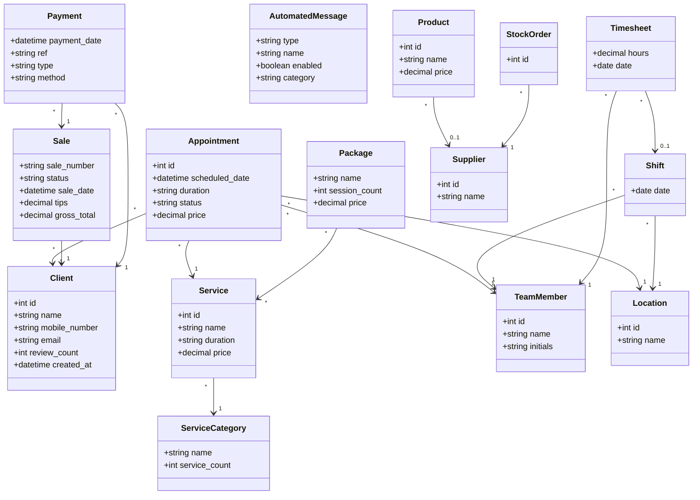

### 3.2 ER diagram (conceptual)

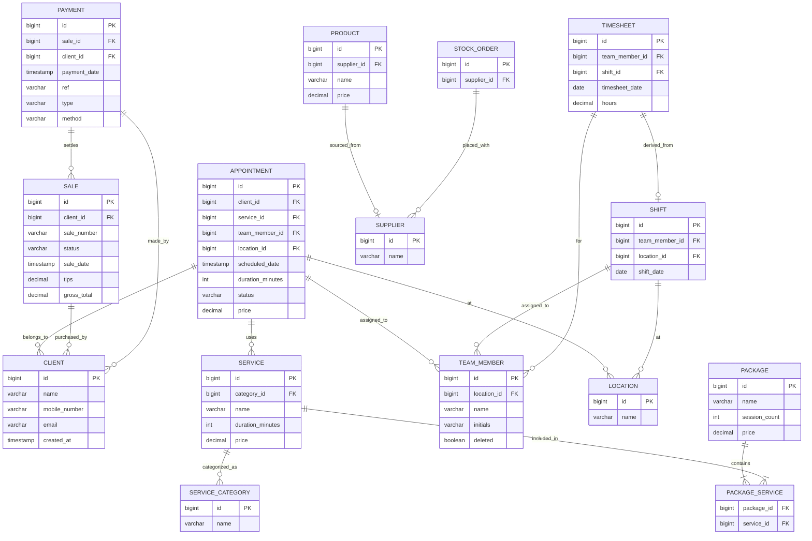

### 3.3 Entity reference

Fields come from UI tables, form dialogs, and captured payloads. "Observed IDs" are from the COUNCIL-TEST records this pass created.

| Entity | Key fields observed | Observed IDs / values |
|---|---|---|
| Appointment | id, client, service, team member, scheduled_date, duration, status (Booked, Confirmed, Arrived, Started, Completed, Canceled, No-show), price, location_id, ref number, created by, channel | COUNCIL-TEST appointment id 1319614874, booking id 1782628367 (Mon Oct 5, 10:00-11:00, KWD 25) |
| Client | id, first/last name, email, phone (country code +965 default), birthday, gender, pronouns, source, referred by, preferred language, occupation, country, tags, segments, blocked flag, wallet balance, ratings, sales total, created_at | COUNCIL-TEST Client1 id 301303785; seeded clients 301304885-301305253 (section 12) |
| Service | id, name (0/255), menu category, treatment type, description (0/1000), price type (Fixed default), price, duration, extra time, team member assignment, resources, add-ons, online booking, portfolio, forms, commissions | COUNCIL-TEST Service1, KWD 25, 1 hr, category Hair & styling |
| ServiceCategory | name, service count | COUNCIL-TEST Category (0 services); existing: Hair & styling (5), Eyebrows & eyelashes (1) |
| Product | id, name, barcode (UPC/EAN/GTIN), brand, measure (ml/l/fl oz/g/kg/gal/oz/lb/cm/ft/in/whole), amount, short description (0/100), description (0/1000), category, supply price, retail sales toggle, retail price, markup, tax, team commission toggle, SKU, supplier, stock tracking toggle, current stock, low stock level, reorder quantity, photos | COUNCIL-TEST Product1 id 13279305; Products 2-4 (supply KWD 3/4/5, retail KWD 8/10/12) |
| Supplier | id, name, description, contact first/last name, mobile, telephone, email, website, street, suburb, city, state, zip, country, "same as postal address" checkbox | COUNCIL-TEST Supplier1 id 1353761 |
| Sale (invoice) | invoice id, sale number, status (Completed, Unpaid, Part paid; 6 status filter options), client or Walk-In, sale date, line items, subtotal, tips, gross total, discounts, taxes, service charges, amount due, channel | Sale #2 invoice 567896865 (order 1091450803); Sale #3 invoice 567897371 (order 1091452695); prior Sale #1 Walk-In KWD 190 |
| Payment | payment date, location, ref (sale ref), client, team member, type (Sale, Refund, Prepayment), method (Cash, Other; 3 method options), amount | Ref #2 and Ref #3, Cash KWD 25 each |
| TeamMember | id, name, initials, job title, contact (mailto/tel), permission role, location_id, compensation add-ons, deleted flag | Fahad Asad, employee 5621666, Workspace owner |
| Location | id, name, address, business types, opening hours, receipt sequencing, tax defaults, tipping defaults, receipt details | location 3216614 "Test Salon" |
| Shift | date, team member, location, expected start/end | route /team/scheduled-shifts; fields via reports |
| Timesheet | team member, hours, date, clock in/out types, breaks | fields via working-hours reports (UNVERIFIED direct) |
| Package / Membership | name, client, status, sale/start/end dates, benefits included/redeemed/reserved/unused, sale value, discount % | fields via packages/memberships reports |
| GiftCard | code, sale no, purchaser, status (8 options), issue/expiry dates, issued value, redemptions, expirations, closing balance | fields via gift-card reports; gift cards inactive in this workspace |
| AutomatedMessage | type (e.g. appointment-reminder-1), name, description, enabled toggle, category tab | 12 automation cards observed; 22-26 notification types from /v3/notification-types |
| Wallet / FinanceAccount | balance, finance_account_id (UUID) | wallets-summary and finance-accounts-summary called on every page |
| Notification | unread count, tabs (Appointments, Reviews, Tips, Online sales, Actions) | badge 4 at capture time; feed API UNVERIFIED |
| Report | id/slug, name, description, isFavourite, isPremium, category, updatedAt, createdBy | 59 reports (section 7) |

## 4. Module technical reference

Format per page: route, purpose, UI structure and actions, page-specific API calls (global calls from section 2.3 are not repeated), links in and out. Status tags: CONFIRMED (live capture this pass), pages.json (first-survey capture), INFERRED (navigation evidence only), UNVERIFIED (never captured).

### 4.1 Global chrome (every page)

Top bar, left to right: Fresha logo (link to /calendar), Continue setup button, Search button, Performance insights button, Notifications button (unread badge), Fresha Connect link (/connect), user menu (avatar). Sidebar modules: Dashboard, Calendar, Sales, Clients, Catalog, Fresha, Marketing, Team, Reports, Add-ons, Setup.

- Global search: overlay dialog (data-qa="global-search-palette"), no URL change. Placeholder "Search anything in Test Salon". Results grouped by category with counts; 14 filter categories (Clients, Appointments, Sales, Team, Service menu, Products, Stock orders, Gift cards, Packages, Client packages, Navigation, Actions, Settings). Footer offers help-center search and support chat. API: POST partners-search-gql.fresha.com/graphql, operation `partnerSearch` {query, first:30, include:[...]}, returns typed hits (CustomerHit, TeamMemberHit, AppointmentHit, SaleHit, ServiceHit, BundleHit, ProductHit, StockOrderHit, GiftCardHit, PackageHit, PackageOwnedHit). CONFIRMED. Result links: client hit -> /dashboard/drawer/clients/:clientId; appointment hit -> /dashboard/drawer/view-appointment/:id?resetAppointmentState=true.
- Performance insights: drawer /dashboard/drawer/performance-insights/. Time-range buttons Yesterday/Today/Week/Month. Sections: Today's summary (total sales with sparkline, sales by channel, KPI row Appointments / Avg. sale / New clients / Returning clients), Team (errored at capture time with a Retry button), Clients, Fresha Marketplace, Next 7 days. Every section has a View link into /reports/table/* with pre-filled params (for example sales-summary?navigationSource=insights-drawer&dateFrom=...&shortcut=custom, sales-summary?groupBy=employee_name, client-summary, online-presence, appointment-summary). APIs: reports.fresha.com/api/json_api_dashboard/* plus wallet/credits background calls. CONFIRMED.
- Notifications: drawer /dashboard/drawer/notifications/ with tabs Appointments (badge 4), Reviews, Tips, Online sales, Actions; rows show actor, event title, relative time, detail, per-row options. "Notification settings" button -> /user-account/workspaces/:workspaceId/settings/edit-workspace-notifications-modal/ which opens the Notification preferences modal (Email/Push/In-app checkboxes across Appointments, Sales, Reviews, Messaging, Inventory, Insights sections; 23 settings on). Feed API UNVERIFIED.
- Continue setup / Guides / News / Help: drawer /dashboard/drawer/resources/onboarding-guides/ ("Setup Superstar" checklist, tracks BASICS / ESSENTIALS / BOOKING_BOSS). Drawer rail tabs: News (/dashboard/drawer/resources/news/), Help (/dashboard/drawer/resources/support/), Guides. Help drawer offers Email (2 days), Live chat (2 minutes), a premium support trial banner, and an external Help Center link. CONFIRMED.
- User menu: header with avatar, name, "No reviews yet", referral banner ("Invite a business to Fresha, and you both get up to KWD 60", no dedicated referral route observed); links My profile (/user-account/profile), Personal settings (/user-account/personal-settings), Help and support (Help drawer), language item "English (US)", Log out (not clicked, safety). CONFIRMED.
- Background calls on every page (CONFIRMED, observed traffic only, not feature links): GET partners-app.fresha.com/api/wallet/wallets-summary, /api/wallet/finance-accounts-summary, /api/credits/credits-campaign; GraphQL appInitializationQuery, emptyQuery, users_profileDetails and the global operation set in section 10.1; GET partners-api.fresha.com/unread-alerts-count; CustomerConnect_unreadConversationsCount.

### 4.2 Dashboard

- /dashboard. Purpose: business snapshot. Widgets: Recent sales (7-day KPI + chart), Upcoming appointments, Appointments activity feed (paginated), Today's next appointments, Top services, Top team member (columns Team member / This month / Last month; the first survey's guess that it references client count was WRONG). At final verification it showed Recent sales KWD 240, 3 appointments, activity for COUNCIL-TEST Client1/Service1, and Top services COUNCIL-TEST Service1 count 1.
- APIs (CONFIRMED live): GET reports.fresha.com/api/json_api_dashboard/recent_sales?days-range=7&location-id=:locationId, /upcoming_appointments?days-range=7&location-id=:locationId, /bookings_activity?page=1, /todays_bookings, /top_services, /top_employees.
- Out: appointment cards -> /dashboard/drawer/appointment/:id?resetAppointmentState=true&focusedBookingId=:bookingId; top bar drawers. The appointment drawer loads (pages.json): GET partners-api.fresha.com/customers/:id/recently-booked-appointments, /customers/:id/paid-plan-instances, /customers/:id/ncf-events, /location-tip-settings/:locationId.

### 4.3 Calendar

- /calendar?date=YYYY-MM-DD&view=day&location_id=:locationId&calendar_selected_resources=e-working. Day view, hourly slots 00:00-23:00, team member columns. Add button menu: Appointment, Group appointment, Blocked time, Sale, Quick payment. Drawers: Visibility Filters (/calendar/drawer/visibility-filters), Calendar Settings (/calendar/drawer/settings), Waitlist (/calendar/drawer/waitlist), new appointment (/calendar/drawer/new-appointment/?appt_startDate=...&appt_employeeId=:employeeId&appt_locationId=:locationId&appt_flow=pickFromCalendar).
- APIs (CONFIRMED live): GET partners-api.fresha.com/v2/employees?location-id=:locationId&with-deleted=false&includes=compensation-addons; GET /closed-dates?location-id&date-from&date-to; GET /employees/with-deleted?employee-ids=:id; GraphQL calendar_dailyCalendarEvents, calendar_dailyCalendarEventsPrefetch, calendar_serviceAddOnDurations, calendar_offerCatalogItems, resourcesSettings, resources_resourceTypes, resources_getResourceTypesWithResources, waitlistButtonCounts, waitlistProviderSettings, hasSalesOrders, cashRegisters_activeCashRegisters; POST staff-working-hours-api.fresha.com/graphql (3 calls).
- Booking flow specifics (exercised): 15-minute slot increments 10:00-18:00; "Next available date" auto-jump; grayed-out dates without availability; appointments auto-create as Walk-in without a client, then a client can be attached. Appointment create mutation endpoint UNVERIFIED (POST /appointments inferred).
- Out: appointment drawer (section 4.10), quick sale drawer, checkout.

### 4.4 Sales module

- /sales/daily-sales. Daily summary: services sales quantity, total sales, payments collected by method, day navigation, export. API: GET reports.fresha.com/api/reports/daily_sales (pages.json). Verified state for Sun Oct 4: services sales qty 4, Total Sales KWD 240.000, Cash collected KWD 240.000 (CONFIRMED).
- /sales/register. POS activation page ("Included in your plan", Start now). No POS APIs; gated. Data flow UNVERIFIED.
- /sales/appointments-list. Appointments table: Ref # (link -> appointment drawer), Client (link -> client drawer), Service, Created by, Created Date, Scheduled Date, Duration, Team member, Price, Status. Export button; "Month to date" preset; filters modal (route variant /sales/appointments-list/filters-report): Team member, Channel (10 options incl. Marketplace - Fresha, Book now link, Facebook, Instagram, Marketplace - Google Reserve, Marketing - Automations, Marketing - Blast messages, Offline), Status (Booked, Confirmed, Arrived, Started, Completed, Canceled, No-show). APIs: GET reports.fresha.com/api/reports/appointments_list?limit=100&offset=0&sort-by=scheduled-on&sort-order=desc&date-from&date-to&use-appt-id=1 (CONFIRMED live); cashRegisters_activeCashRegisters; resources_getResourceTypesWithResources; GET partners-api.fresha.com/employees.
- /sales/sales-list. Tabs Sales / Drafts; search "Search by Sale or Client"; "Today" shortcut; columns Sale # (link -> invoice drawer), Client, Status, Sale date, Tips, Gross total. Options menu: Sales settings, Export PDF/CSV/Excel. API: GET reports.fresha.com/api/reports/sales_list?limit=100&offset=0&date-from&date-to (CONFIRMED live). Verified rows: Sale #2 COUNCIL-TEST Client1 Completed KWD 25.000 (invoice route /sales/sales-list/drawer/invoice/567896865), Sale #3 Walk-In Completed KWD 25.000 (/sales/sales-list/drawer/invoice/567897371).
- /sales/payment-transactions. Columns: Payment date, Location, Ref # (link -> /sales/payment-transactions/drawer/invoice/:invoiceId), Client, Team member (link -> /sales/payment-transactions/drawer/team-member/:teamMemberId/), Type, Method, Amount; totals row; date-range button; per-row Actions: View Sale, Refund. Page-specific API UNVERIFIED in the live pass; the report endpoint reports.fresha.com/api/reports/payment_transactions is confirmed in reports.md; per-sale history via GET partners-api.fresha.com/sales/:invoiceId/transactions-history (CONFIRMED). Verified rows: Ref #3 Walk-In Cash KWD 25.000, Ref #2 COUNCIL-TEST Client1 Cash KWD 25.000, page total KWD 240.000.
- /sales/gift-cards. APIs: GET reports.fresha.com/api/reports/gift_cards, GET gift-cards-api.fresha.com/config (pages.json). Gift cards are inactive in this workspace.
- /sales/packages-sold. APIs UNVERIFIED; report endpoints exist in the reports engine.
- /sales/paid-plans -> always redirects to /sales/memberships (CONFIRMED). API: GET partners-api.fresha.com/paid-plan-management (pages.json).

### 4.5 Clients module

- /clients/list. Header with count badge, Options (Import clients, Merge clients, Export Excel/CSV), Add. Import banner ("prevents new client fees for existing clients who book online"). Search "Name, email or phone"; Filters; sort "Created at (newest first)"; sortable columns Client name / Reviews / Sales / Created at; row select; bulk bar (Bulk edit: Block clients, Add tags; Delete); pagination footer. Add dialog route /clients/list/add?data= with left rail Profile / Addresses / Emergency contacts / Settings; Profile fields: First name (required, 0/255, "This field is required"), Last name, Email, Phone (+965), Birthday (month/day/year), Gender (Female/Male/Non-binary/Prefer not to say), Pronouns (She/He/They/Prefer not to say); additional info: Client source (Walk-In default), Referred by, Preferred language, Occupation (0/255), Country, Additional email/phone, Tags; Settings section: client notification and marketing message channels (email/text/WhatsApp). APIs (CONFIRMED live): GET customers-api.fresha.com/v2/customer-search?offset&query&genders&customer-type&blocked&verified&tag-ids&segment-ids&sort-order&sort-by=created-at&limit=30&include-customers-count=true; GET /customer-avatars?customer-ids=...; GET /customer-duplicates/existence-check; GET /customers-merge/auto-status; GraphQL WorkspaceTagDefinitions, WorkspaceSegmentDefinitions. Authoritative state at verification: 15 rows (12 COUNCIL-TEST + John, Jack, Jane Doe).
- Client detail drawer: /clients/list/drawer/clients/:clientId. Also reachable from global search (/dashboard/drawer/clients/:clientId) and from the appointments list client links. Header: avatar, name, email button, "First visit" chip, "Add tag" chip, Actions, "Book now"; inline "Add pronouns" (/clients/list/:id/edit?focus=pronoun) and "Add date of birth" (?focus=birthday). Tabs: Overview (wallet card, summary totals, upcoming appointment card with Checkout button), Appointments (status sub-tabs, Upcoming/month groups, card -> /clients/list/drawer/view-appointment/:appointmentId?focusedBookingId=:bookingId), Sales, Client details, Items, Records (Notes, Allergies, Patch tests, Client forms, Files), Wallet, Loyalty, Reviews. Actions menu: Messages, Sell, Add staff alert, Add simple note, Add allergy, Add patch test, Add tag, Add reward, Edit client details, Merge profiles, Block client, Delete client. Drawer data API: GraphQL CustomerLeftDrawer; note create: GraphQL notes_createNote (both CONFIRMED). Verified state for client 301303785: Appointments 1, Sales 1, Total sales KWD 25, upcoming Mon Oct 5 COUNCIL-TEST Service1 appointment with Checkout.
- /clients/segments. APIs UNVERIFIED; segment definitions come from WorkspaceSegmentDefinitions on the clients list.
- /clients/loyalty. Add-on activation page (no APIs). Gate screen at /add-ons/add-on/loyalty/intro shows "KWD 32.95 per location, per month" with a 7-day trial; Continue was never clicked (safety). Pricing is cartographer-observed, not re-verified in the final run; treat as UNVERIFIED.
- /clients/online-reputation. Tabs Overview / All reviews, Connect button. APIs UNVERIFIED. Also reached from Marketing > Engage > Reviews as /clients/online-reputation?tab=all.

### 4.6 Catalogue module

- /catalogue/services (Service menu). Options, Add (Single service / Bundle / Category), search, filters, "Manage order". Category sidebar with counts and per-category Actions; service cards with name, duration, price, kebab. Add dialog route /catalogue/services/service/add/new; edit route /catalogue/services/service/edit/:serviceId with tabs Basic details, Team members, Resources, Service add-ons and settings group Online booking, Portfolio images, Forms, Commissions, Settings. Basic details fields: Service name (required, 0/255), Menu category (required combobox), Treatment type ("Used to help clients find your service on the Fresha marketplace", 869 options noted by the seed pass), Description (0/1000, "Generate with AI" button); pricing: Price type (Fixed), Price (KWD), Duration, Add extra time, Options. APIs (CONFIRMED live): GraphQL services_getCatalogItems, services_getTeamMemberLocations, services_treatmentCategoriesQuery, services_treatmentSuggestionsQuery, services_getTeamMembers, and the captured mutation services_createServiceMutation (200). Existing services: Haircut 45 min KWD 40, Hair Color 1 hr 15 min KWD 57, Blow Dry 35 min KWD 35, Balayage 2 hr 30 min KWD 150, Classic Fill 1 hr KWD 60, plus COUNCIL-TEST Service1.
- /catalogue/services/categories/add: category create form (COUNCIL-TEST Category created here). API UNVERIFIED.
- /catalogue/packages. Activation page ("Included in your plan", Start now). APIs UNVERIFIED.
- /catalogue/products. First visit shows onboarding ("Free to use", Start now) -> product-add dialog at /catalogue/products/product-add. Full field list in section 3.3 (Product). Validation: Retail price required when "Enable retail sales" is on ("This field is required"). Row click -> product detail drawer; Edit -> /catalogue/products/:productId/edit. APIs: GraphQL products_getProductBrands, products_getProductCategories (CONFIRMED); products_createProduct and products_updateProduct are INFERRED from redirects (verifier ruling: keep inferred). List API GET inventory-api.fresha.com/inventory (pages.json). Verified state: 4 products (COUNCIL-TEST Product1-4) with supplier and pricing.
- /catalogue/stocktakes. Activation page ("Start now"). APIs UNVERIFIED.
- /catalogue/orders (Stock orders). Empty state with Options and Learn more. Supplier must exist before ordering (UNVERIFIED, not exercised). APIs UNVERIFIED.
- /catalogue/suppliers. Count badge, Add -> "Add a new supplier" dialog at /catalogue/suppliers/new (fields in section 3.3 Supplier). Table columns Supplier name, Phone, Email, Products, Updated at; search by name; sort "Updated (newest first)". Row click -> supplier drawer; Edit -> /catalogue/suppliers/:supplierId/edit. Create API INFERRED as POST partners-api.fresha.com/suppliers (capture missed; verifier ruling: keep inferred). Edit mutation INFERRED (POST/PUT /suppliers/:id). List API GET inventory-api.fresha.com/suppliers (pages.json).

### 4.7 Fresha (online bookings)

- /fresha/online-booking/locations (Marketplace profile). APIs: GET shopkeeper-api.fresha.com/backoffice/shop, GET partners-api.fresha.com/published-location-profiles-check (pages.json).
- /fresha/online-booking/google-reserve. API: GET google-appt-redirection-api.fresha.com/reserve-with-google-settings (pages.json). Post-first-visit content UNVERIFIED.
- /fresha/online-booking/facebook-setup. API: GET partners-api.fresha.com/facebook-fbe/provider-settings (pages.json).
- /fresha/online-booking/buttons-and-links (Link builder). API: GET partners-api.fresha.com/user-account/profile (pages.json). Hard-nav 403 is session-dependent, not universal.
- /fresha/online-booking/smart-website. Setup wizard page; add-on gated. No APIs captured.

### 4.8 Marketing module

- /marketing/blast-campaigns/home. Activation page ("Start now"); API GET partners-api.fresha.com/blast-marketing/campaigns (pages.json). Not exercised (safety: no outbound campaigns).
- /marketing/automated-messages (Automations). Header shows Communication balance KWD 0 with automatic top-up "Set up now". Tabs: Reminders, Appointment updates, Waitlist updates, Increase bookings, Celebrate milestones, Client messages, Client loyalty. 12 automation cards observed (3-day/24-hour/1-hour reminders, new/rescheduled/canceled appointment, did not show up, thank you for visiting, joined the waitlist, time slot available, reminder to rebook, celebrate birthdays), each with an Enable toggle. No toggle was switched (safety). APIs (CONFIRMED): GET customer-notifier-api.fresha.com/v3/notification-types?supported-notification-types=... (22-26 types), GET /v3/notification-types/:type, GraphQL automatedMessages_overview_messageAccountingAccount, automatedMessages_contactFormSetting, automatedMessages_balanceWidget_messageAccountingAccount, legalEntities. Trigger execution on appointment events: UNVERIFIED.
- /marketing/notifications (Messages history). API GET customer-notifier-api.fresha.com/messages (pages.json).
- /marketing/deals. Activation page. API GET deals-api.fresha.com/deals (pages.json).
- /marketing/peak-pricing (Smart pricing). Activation page. API GET deals-api.fresha.com/smart-pricing/migration-result (pages.json).

### 4.9 Team module

- /team/team-members. Count badge (1), Options, Add, "Activate plan" banner (free trial ends in 7 days; not clicked, billing-gated), search, filters, "Custom order" sort. Columns: select, Name, Contact (mailto/tel), Permission role ("Workspace owner"), Actions. API GET partners-api.fresha.com/employees (pages.json); /v2/employees confirmed live on Calendar. Team member create form not submitted (safety). Row -> team member drawer /team/team-members/drawer/team-member/:teamMemberId/ with tabs Overview, Personal, Workspace, Pay; Overview has a performance card with "View full dashboard" -> /reports/table/performance?employee_id=:id&shortcut=week_to_date; Actions: Edit, View calendar, View scheduled shifts, Add time off.
- /team/scheduled-shifts?date&locationId. API GET partners-api.fresha.com/employees (pages.json); shift data via staff-working-hours-api GraphQL.
- /team/timesheets. Activation-gated. API POST timesheets-api.fresha.com/graphql (pages.json).
- /team/payrun/overview. Activation-gated. API POST staff-working-hours-api.fresha.com/graphql (pages.json). Payroll chain UNVERIFIED.

### 4.10 Shared drawers and dialogs

- Appointment drawer: routes /dashboard/drawer/appointment/:id, /calendar/drawer/... contexts, /clients/list/drawer/view-appointment/:appointmentId?focusedBookingId=:bookingId, /sales/appointments-list/filters-report/drawer/view-appointment/:id?resetAppointmentState=true. Content: client header with "View profile", date, status, time, repeat, services list with per-service Edit/Remove and "Add service", total duration, Total, Payments, Sale total toggle, Options, View sale, Complete now / Checkout. Options menu: Add a note, Add a form, View appointment activity, Set as repeating, Add to group appointment, Rebook, Reschedule, No-show, Cancel. Cancellation dialog uses the reasons configured at /setup/scheduling/cancellation-reasons (path observed, not executed).
- Invoice (sale) drawer: /sales/sales-list/drawer/invoice/:invoiceId/details, also /sales/payment-transactions/drawer/invoice/:invoiceId. Tabs Summary, Notes, Activity. Summary: status, client or Walk-In, sale number and date, item lines (service, time, duration, team member, price), Subtotal/Total, Payment (method, timestamp, amount). Header: Rebook, options menu (Refund sale, Edit sale details, Add a note, Email, Print, Download PDF, Void sale). None of the destructive options were executed. APIs: GET partners-api.fresha.com/sales/:invoiceId/transactions-history (CONFIRMED), GraphQL orderTransactions (CONFIRMED).

### 4.11 Reports, Add-ons, Setup, Connect, User account

- /reports -> /reports/report-group/1?category=all; every report at /reports/table/:slug. Full technical reference in section 7. APIs (CONFIRMED live): POST partners-reporting-api.fresha.com/ with operations getReportGroup, getInsightData, getDashboard, calculateComparisonPeriod, getPermissions.
- /add-ons. Tabs Add-ons / Integrations. Add-ons: Payments, Premium Support ("On free trial"), Insights, Google Rating Boost, Client Loyalty, Data Connector, Client Connect ("Active"), Smart Website, Team Connect, Bookable Resources. Integrations: Xero, QuickBooks, Facebook and Instagram bookings, Meta Pixel Ads, Google Analytics, Google Ads. Card "View" buttons open intro gates such as /add-ons/add-on/loyalty/intro and /add-ons/add-on/fresha-insights/intro (Insights: "KWD 27 per location, per month", 7-day trial; Continue never clicked). API: GraphQL addOnsGateway / singleAddOnGateway (global).
- /setup and all sub-pages: section 6.
- /connect -> /connect/customers/conversations/onboarding-:id. Full Connect application: Client Connect and Team Connect modes, conversations list, search, settings, new message, onboarding Step 1 of 3. UI CONFIRMED (verifier); API surface UNVERIFIED.
- /user-account/profile (My profile), /user-account/personal-settings with sub-routes /personal-info (contact card with masked mobile/email, Hide profile, non-editable identity verification), /login-security (password change, Google/Apple connect, trusted devices with Revoke, active sessions with Sign Out, Delete account button never triggered), /appearance (theme Light/Dark/System, System checked). /user-account/workspaces/:workspaceId/settings: Linked calendars (-> /settings/calendar-sync?wz-src=settings) and Workspace notifications (Manage -> preferences modal, section 4.1). APIs UNVERIFIED.

## 5. Page connectivity

### 5.1 Adjacency table

Sidebar edges (available from any page):

| From | To | Trigger | Type |
|---|---|---|---|
| Any page | /dashboard | Sidebar | navigate |
| Any page | /calendar | Sidebar or Fresha logo | navigate |
| Any page | /sales/daily-sales | Sidebar > Sales | navigate |
| Any page | /sales/register | Sidebar > Sales | navigate |
| Any page | /sales/appointments-list | Sidebar > Sales | navigate |
| Any page | /sales/sales-list | Sidebar > Sales | navigate |
| Any page | /sales/payment-transactions | Sidebar > Sales | navigate |
| Any page | /sales/gift-cards | Sidebar > Sales > Sold items | navigate |
| Any page | /sales/packages-sold | Sidebar > Sales > Sold items | navigate |
| Any page | /sales/memberships | Sidebar > Sales > Sold items (via /sales/paid-plans redirect) | navigate |
| Any page | /clients/list | Sidebar > Clients | navigate |
| Any page | /clients/segments | Sidebar > Clients | navigate |
| Any page | /clients/loyalty | Sidebar > Clients > Engage | navigate |
| Any page | /clients/online-reputation | Sidebar > Clients > Engage, or Marketing > Engage > Reviews (?tab=all) | navigate |
| Any page | /catalogue/services | Sidebar > Catalog | navigate |
| Any page | /catalogue/packages | Sidebar > Catalog | navigate |
| Any page | /catalogue/products | Sidebar > Catalog | navigate |
| Any page | /catalogue/stocktakes | Sidebar > Catalog > Inventory | navigate |
| Any page | /catalogue/orders | Sidebar > Catalog > Inventory | navigate |
| Any page | /catalogue/suppliers | Sidebar > Catalog > Inventory | navigate |
| Any page | /fresha/online-booking/locations | Sidebar > Fresha | navigate |
| Any page | /fresha/online-booking/google-reserve | Sidebar > Fresha | navigate |
| Any page | /fresha/online-booking/facebook-setup | Sidebar > Fresha | navigate |
| Any page | /fresha/online-booking/buttons-and-links | Sidebar > Fresha | navigate |
| Any page | /fresha/online-booking/smart-website | Sidebar > Fresha > Your websites | navigate |
| Any page | /marketing/blast-campaigns/home | Sidebar > Marketing > Messaging | navigate |
| Any page | /marketing/automated-messages | Sidebar > Marketing > Messaging | navigate |
| Any page | /marketing/notifications | Sidebar > Marketing > Messaging | navigate |
| Any page | /marketing/deals | Sidebar > Marketing > Promotion | navigate |
| Any page | /marketing/peak-pricing | Sidebar > Marketing > Promotion | navigate |
| Any page | /team/team-members | Sidebar > Team | navigate |
| Any page | /team/scheduled-shifts | Sidebar > Team | navigate |
| Any page | /team/timesheets | Sidebar > Team | navigate |
| Any page | /team/payrun/overview | Sidebar > Team | navigate |
| Any page | /reports (-> /reports/report-group/1?category=all) | Sidebar | navigate |
| Any page | /add-ons | Sidebar | navigate |
| Any page | /setup | Sidebar | navigate |
| Any page | /connect | Top bar Fresha Connect | navigate |
| Any page | /user-account/profile | User menu > My profile | navigate |
| Any page | /user-account/personal-settings | User menu > Personal settings | navigate |

Top bar and drawer edges:

| From | To | Trigger | Type |
|---|---|---|---|
| Any page | search palette overlay | Top bar Search | modal (no URL change) |
| Search palette | /dashboard/drawer/clients/:clientId | Client hit | drawer |
| Search palette | /dashboard/drawer/view-appointment/:id?resetAppointmentState=true | Appointment hit | drawer |
| Any page | /dashboard/drawer/performance-insights/ | Top bar Performance insights | drawer |
| Performance insights drawer | /reports/table/sales-summary, /reports/table/client-summary, /reports/table/online-presence, /reports/table/appointment-summary | Section "View" links | navigate |
| Any page | /dashboard/drawer/notifications/ | Top bar Notifications | drawer |
| Notifications drawer | /user-account/workspaces/:workspaceId/settings/edit-workspace-notifications-modal/ | Notification settings | modal |
| Any page | /dashboard/drawer/resources/onboarding-guides/ | Top bar Continue setup | drawer |
| Guides drawer | /dashboard/drawer/resources/news/ and /dashboard/drawer/resources/support/ | Rail tabs | drawer |
| User menu | /dashboard/drawer/resources/support/ | Help and support | drawer |

Page-level edges:

| From | To | Trigger | Type |
|---|---|---|---|
| /dashboard | /dashboard/drawer/appointment/:id | Click appointment card | drawer |
| /calendar | /calendar/drawer/visibility-filters, /calendar/drawer/settings, /calendar/drawer/waitlist | Drawer buttons | drawer |
| /calendar | /calendar/drawer/new-appointment/ | Add > Appointment > View available times | drawer |
| /calendar | quick sale drawer | Add > Sale | drawer |
| Appointment drawer | checkout -> invoice drawer | Checkout button | flow |
| /clients/list | /clients/list/add | Add button | dialog route |
| /clients/list | /clients/list/drawer/clients/:clientId | Click client row | drawer (CONFIRMED) |
| Client drawer Appointments tab | /clients/list/drawer/view-appointment/:appointmentId?focusedBookingId=:bookingId | Click appointment card | drawer (CONFIRMED) |
| Client drawer Overview | /clients/list/drawer/clients/:id/wallet | "View wallet" | drawer |
| /clients/list/:id/edit?focus=pronoun or ?focus=birthday | inline edit focus | Drawer links | dialog |
| /sales/sales-list | /sales/sales-list/drawer/invoice/:invoiceId | Sale # link | drawer |
| /sales/payment-transactions | /sales/payment-transactions/drawer/invoice/:invoiceId | Ref # link | drawer |
| /sales/payment-transactions | /sales/payment-transactions/drawer/team-member/:teamMemberId/ | Team member link | drawer |
| /sales/appointments-list | appointment drawer / client drawer | Ref # and Client links | drawer |
| Invoice drawer | /reports and sale actions (Rebook, Refund, Void, Email, Print, PDF) | Header and options | actions |
| /catalogue/services | /catalogue/services/service/edit/:serviceId | Service card | dialog (CONFIRMED) |
| /catalogue/services | /catalogue/services/service/add/new | Add > Single service | dialog |
| /catalogue/services | /catalogue/services/categories/add | Add > Category | dialog |
| /catalogue/products | /catalogue/products/product-add, /catalogue/products/:productId/edit | Start now / Edit | dialog |
| /catalogue/suppliers | /catalogue/suppliers/new, /catalogue/suppliers/:supplierId/edit | Add / Edit | dialog |
| /team/team-members | /team/team-members/drawer/team-member/:teamMemberId/ | Row click | drawer (CONFIRMED) |
| Team member drawer | /reports/table/performance?employee_id=:id&shortcut=week_to_date | "View full dashboard" | navigate |
| /reports/report-group/1 | /reports/table/:slug | Report card | navigate |
| /reports/table/:slug | invoice / appointment / team member / client / membership / package drawers | Row interlinks (INVOICE_DRAWER, APPOINTMENT_DRAWER, TEAM_MEMBER_DRAWER, CUSTOMER_DRAWER, MEMBERSHIP_DRAWER, PACKAGE_DRAWER) and REPORT cross-drills | drawer/navigate |
| /add-ons | /add-ons/add-on/loyalty/intro, /add-ons/add-on/fresha-insights/intro | Card View | gate modal |
| /setup | 8 settings hubs (section 6) | Settings tab cards | navigate |
| /setup/scheduling/cancellation-reasons | /setup/scheduling/cancellation-reasons/edit/ | Add | dialog route |
| /setup/location/:locationId | /business-details, /business-location, /opening-hours, /sales and their /edit/ routes | Sub-nav and Edit links | navigate |
| /setup/clients/messages | /connect/customers | "View inbox" | navigate |
| /setup/sales/pay-now and /setup/payments/* | /fresha/card-processing/payment-processing | Fresha payments promo | navigate |

Conceptual data edges (not navigation): Register -> Payments and Clients (UNVERIFIED, POS not activated); Clients list -> Blast campaigns targeting (UNVERIFIED); Service menu -> Marketplace profile / Smart Website listing (UNVERIFIED, via Shopkeeper API); Products -> Stocktakes and Stock orders -> Suppliers (UNVERIFIED, not exercised); Timesheets -> Pay runs (UNVERIFIED); Reports aggregate Calendar, Sales, Clients, Team (partially confirmed via propagation in section 8.4).

### 5.2 Navigation flowchart

```mermaid
flowchart TD
    L["Fresha logo"] -->|"href /calendar"| CAL["Calendar"]
    TB["Top bar"]
    TB --> CS["Continue setup"]
    TB --> SE["Search"]
    TB --> PI["Performance insights"]
    TB --> NO["Notifications"]
    TB --> CO["Fresha Connect"]
    TB --> UM["User menu"]
    SB["Sidebar"]
    SB --> D["Dashboard"]
    SB --> CAL
    SB --> SA["Sales"]
    SB --> CL["Clients"]
    SB --> CA["Catalogue"]
    SB --> FR["Fresha / Online bookings"]
    SB --> MK["Marketing"]
    SB --> TE["Team"]
    SB --> RE["Reports"]
    SB --> AD["Add-ons"]
    SB --> ST["Setup"]
    CS -->|"drawer"| OG["Guides drawer onboarding-guides"]
    OG --> NW["News drawer"]
    OG --> HE["Help drawer"]
    SE -->|"palette"| SEP["partnerSearch results"]
    SEP -->|"client hit"| CD["Client drawer"]
    SEP -->|"appointment hit"| APD["Appointment drawer"]
    PI -->|"drawer"| PID["performance-insights drawer"]
    PID -->|"View links"| RT["/reports/table/* reports"]
    NO -->|"drawer"| NOD["notifications drawer"]
    NOD -->|"Notification settings"| NS["user-account workspace settings + preferences modal"]
    CO -->|"href /connect"| CON["Connect app"]
    UM --> PR["My profile /user-account/profile"]
    UM --> PS["Personal settings /user-account/personal-settings"]
    UM --> HS["Help and support -> Help drawer"]
    UM --> LA["Language English (US)"]
    UM --> LO["Log out"]
    UM --> REF["Referral banner KWD 60"]
```

### 5.3 Detail views (drawers, tabs, actions)

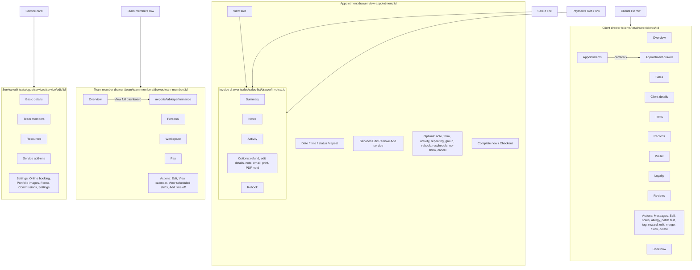

## 6. Setup and settings reference

### 6.1 Hub and tree

/setup is the "Workspace settings" hub with tabs Settings, Online presence, Marketing, Other. Settings tab cards link to: Business setup (/setup/business-setup), Scheduling (/setup/scheduling), Sales (/setup/sales), Clients (/setup/clients), Billing (/legal-entities), Team (/setup/team), Forms (/setup/forms-and-notes), Payments (/setup/payments). Online presence cards: Marketplace profile, Reserve with Google, Book with Facebook and Instagram, Link builder. Marketing cards: Blast marketing, Automations, Deals, Smart pricing, Sent messages, Ratings and reviews. Other: Add-ons, Integrations. Every /setup page also fires the global app-wide call set (session, provider, locations, onboarding checklist, staff notifications, customer-notifier types and channels, wallet/credits, appInitializationQuery, feature flags).

```mermaid
flowchart TD
  H["/setup Workspace settings hub"] --> BS["/setup/business-setup"]
  H --> SC["/setup/scheduling"]
  H --> SA["/setup/sales"]
  H --> CL["/setup/clients"]
  H --> LE["/legal-entities Billing"]
  H --> TM["/setup/team"]
  H --> FO["/setup/forms-and-notes"]
  H --> PA["/setup/payments"]
  H --> OP["Online presence cards"]
  H --> MK["Marketing cards"]
  H --> OT["Other: Add-ons, Integrations"]
  BS --> BSD["Business details"]
  BS --> LOC["Locations list"]
  LOC --> LD["/setup/location/:id"]
  LD --> LDB["Business details"]
  LD --> LBL["Business location + map"]
  LD --> LOH["Opening hours"]
  LD --> LDS["Location sales"]
  SC --> TAC["Time and calendar"]
  SC --> WL["Waitlist"]
  SC --> BTT["Blocked time types"]
  SC --> RES["Resources gated"]
  SC --> CR["Cancellation reasons"]
  SC --> AS["Appointment statuses"]
  SC --> CP["Closed periods"]
  SC --> DA["Dynamic assignment"]
  SC --> AV["Availability"]
  SC --> BO["Booking options"]
  SA --> PN["Pay now"]
  SA --> TR["Tax rates"]
  SA --> RC["Receipts"]
  SA --> RG["Registers gated"]
  SA --> TP["Tipping"]
  SA --> SVC["Service charges"]
  SA --> GC["Gift cards gated"]
  SA --> CCM["Custom checkout methods"]
  CL --> CS["Client sources"]
  CL --> CT["Client tags"]
  CL --> CC["Client Connect"]
  TM --> PR["Permission roles"]
  TM --> TO["Time off, Timesheets, Shifts, Pay runs, Commissions, PIN switching"]
  FO --> FT["Form templates"]
  PA --> PP["Payment policy gated"]
  PA --> PM["Payment methods gated"]
  U["/user-account/personal-settings"] --> PI["Personal info"]
  U --> LS["Login and security"]
  U --> AP["Appearance"]
```

### 6.2 Settings pages

| Route | Purpose | Observed state / values | Edit routes and APIs |
|---|---|---|---|
| /setup/business-setup/business-details | Business name, tax/language, external links | Test Salon, Kuwait, KWD, "Retail prices include tax", English US defaults; Facebook/X/Instagram add links, Website set | Edit view; /edit/?field=facebookPage or twitterPage or instagramPage |
| /setup/business-setup/location-details | Manage locations | Row per location with name, review count, address, Actions; toolbar Options/Add; row -> /setup/location/:locationId | |
| /setup/location/:locationId | Location hub (redirects to /business-details) | Sub-nav Business details, Business location, Opening hours, Sales; buttons Marketplace profile settings, Manage billing profiles | |
| .../business-details | Location contact + business types | Name/Email/Phone; Main type Hair Salon; Additional: Nails, Beauty Salon, Eyebrows & Lashes | /basic-info/edit/, /business-types/edit/ |
| .../business-location | Address + embedded Google Map | "Open this area in Google Maps" external link | /address/edit/ |
| .../opening-hours | Per-day hours | Sat 10:00-17:00, Sun Closed, Mon-Thu 10:00-19:00, Fri 10:00-19:00; links to closed-periods | /opening-hours/edit/ |
| .../sales | Location sales defaults | Receipt sequencing (prefix "-", next 2), tax defaults ("No tax", workspace defaults), tipping (all options enabled, 10/18/25%, all items included), receipt details | /sales/receipt-sequencing/edit/, /sales/tax-defaults/edit/, /sales/edit-tipping/, /sales/edit-receipt-details/ |
| /setup/scheduling/time-and-calendar | Date/time and calendar display | GMT+03 Kuwait, 24-hour, week starts Saturday; appointment color by Category; processing time and blocked time shown | Edit dialogs |
| /setup/scheduling/waitlist | Waitlist behavior | Automatically book, First in line priority, online waitlist active ("Request any preferred time"); links to automated messages | Edit dialogs |
| /setup/scheduling/blocked-time-types | Blocked time cards | Lunch 30 min Unpaid, Training 1 hr Paid, Meeting 1 hr Paid; Add; per-card Actions (contents UNVERIFIED) | |
| /setup/scheduling/resources | Rooms/equipment | Gated activation card ("Included in your plan", Start now). API: GraphQL resourcesSettings (200, CONFIRMED) | |
| /setup/scheduling/cancellation-reasons | Cancel-dialog reasons | Defaults: Duplicate appointment, Appointment made by mistake, Client not available; plus COUNCIL-TEST cancellation reason. Add dialog: single required Name field | GET/POST partners-api.fresha.com/cancellation-reasons (JSON:API, create payload captured, 200) |
| /setup/scheduling/appointment-statuses | Status list | System: Booked, Confirmed, Arrived, Started, Completed, Canceled, No-show; Add custom | |
| /setup/scheduling/closed-periods | Holiday closures | Empty state + Add | |
| /setup/scheduling/dynamic-assignment | Auto assignment | Assign team member with most availability; online-booked appointments reassignable up to 15 min before start | |
| /setup/scheduling/availability | Booking window | Book from 12 months ahead until immediately before start; cancel/reschedule anytime; 15-minute increments | |
| /setup/scheduling/booking-options | Online booking widget | Book specific team members, profiles/portfolio/ratings, no gender booking; service menu display options; group booking; upselling disabled until online bookings enabled (Set up -> /fresha/online-booking/locations); important info; email notifications on book/reschedule/cancel | |
| /setup/sales/pay-now | One-tap payment | Toggle + Fresha payments promo -> /fresha/card-processing/payment-processing | |
| /setup/sales/tax-rates | Tax rates | Empty ("No tax rates"); Add dialog: Tax name, Tax rate % (route /create/) | |
| /setup/sales/receipts | Receipt design | Client mobile/email and address shown; title "Sale"; custom lines and footer via /edit/?field=saleCustomHeader1, saleCustomHeader2, receiptMessage; receipt sequencing Manage | |
| /setup/sales/registers | Cash registers | Gated ("Set up now") | |
| /setup/sales/tipping | Tip screen | Display tip option at POS (checked); defaults 10/18/25%; calculation "All items included"; Advanced options expander (UNVERIFIED) | |
| /setup/sales/service-charges | Extra charges | Empty + Add | |
| /setup/sales/gift-cards | Gift cards | Inactive ("Set up") | |
| /setup/sales/payment-methods | Custom checkout methods | Cash (Active), Other (Active with Actions); Add | |
| /setup/clients/client-sources | Client source list | Contact page, Referral Link, Walk-In, Instagram, Imported, Google, Fresha Marketplace, Facebook, Book Now Link (all Active) | |
| /setup/clients/client-tags | Tags | Empty state + Add | |
| /setup/clients/messages | Client Connect settings | Banner "Included in your plan" with View inbox -> /connect/customers; messaging enabled, clients can start conversations, read receipts and typing indicators on; instant replies off; contact page enabled with public link fresha.com/q/:slug, Copy link / Generate QR / Preview | |
| /legal-entities | Billing | Empty ("Add your billing details", Set up now); sidebar Billing, Payment methods, Communication balance, Invoices and fees, Subscriptions, Locations. Billing-sensitive dialogs not opened (safety, UNVERIFIED) | |
| /setup/team/permissions | Permission roles | Basic/Low/Medium/High with partial-to-full area access; Workspace owner (full, current user); No access. Role Actions menus not opened (safety) | |
| /setup/team/* others | time-off, timesheets, shifts, pay-runs, comissions (Fresha's own misspelling), pin-switching | Routes recorded; depth UNVERIFIED | |
| /setup/forms-and-notes | Form templates | "COVID 19" (Inactive) with Actions; Add | |
| /setup/payments/payment-policy and /payment-methods | Prepay, no-show/late fees, methods | Gated behind Fresha card processing activation; only promo cards shown | |
| /user-account/personal-settings/* | Personal info, login & security, appearance | See section 4.11 | |

### 6.3 Setting -> affected features

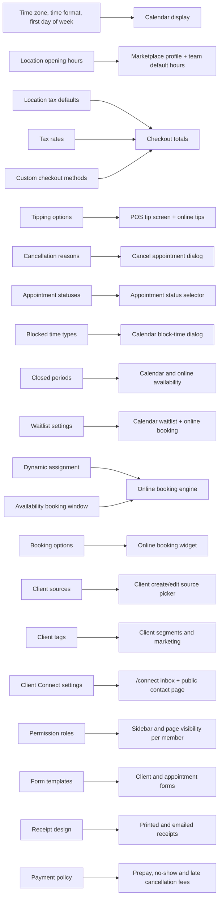

The cancellation-reasons edge is the one the council exercised end to end: the COUNCIL-TEST reason created here appears in the appointment cancellation dialog's reason list (dialog observed, cancellation not executed).

### 6.4 Gated settings in this workspace

Resources (Start now), Cash registers (Set up now), Gift cards (Set up), Billing details (Set up now), Payment policy and Payment methods (behind Fresha card processing), Upselling (until online bookings enabled). Fresha payments promos appear on /setup/sales/pay-now and both /setup/payments pages.

## 7. Reports reference

### 7.1 Area mechanics

- Home /reports redirects to /reports/report-group/1?category=all. Left rail: All reports (59), Favourites (0), Dashboards (3), Standard (49), Premium (10), Custom (0), Folders (Add folder), Data connector (did not navigate when clicked; possibly inert without Insights, UNVERIFIED).
- Every report lives at /reports/table/:slug; the slug equals the catalogue id.
- Shared chrome on every report page: breadcrumb (Back > All reports > category > report), "Add to favorites", Options menu (Duplicate, Add to favorites, Export CSV/Excel/PDF), Type date picker (shortcuts like Month to date, Last 30 days; per-report default from customisationOptions.datePicker; Stock on hand is singleDate=today, disabled), Filters (multi-selects), Advanced filters (rule/predicate tree), Customize (show/hide columns via columnsV2, groupings, chart toggle), freshness label "Data from X mins ago" with refreshRate 30s (tables) / 80s (dashboards), pagination "Viewing 1 - N of M results" (limit/offset).
- No email/scheduling option exists anywhere in the report UI; whether it exists behind the Insights add-on is UNVERIFIED.
- Gating: 10 reports are isPremium, and some filters are premium (for example Appointments list "Cancellation reason", Sales summary client gender/retention/supplier/brand/category filters). Custom reports and premium features are sold as the Insights add-on at /add-ons/add-on/fresha-insights/intro ("KWD 27 per location, per month", 7-day trial; not activated). Premium report pages still rendered data on this account (likely trial access); whether production gating blocks data is UNVERIFIED. Every report page issues getPermissions (resourceType fresha/reports_report, resourceId = slug).

### 7.2 Reporting API

Single GraphQL endpoint: POST https://partners-reporting-api.fresha.com/?__pid=:accountId&_client_version=2.8.11390&_client_platform=web (session cookies; no tokens recorded). Operations:

| Operation | Variables (key ones) | Returns (key fields) |
|---|---|---|
| getReportGroup | groupId=1, searchInput, sort, category, createdBy, performanceOverTimeEnabled, appVersion | report cards: id, name, description, isFavourite, isPremium, category, updatedAt, createdBy |
| getInsightData | id (slug), filters, limit, offset, sort, dimensions, groupBy, dateRange, predefinedReportCustomisation, advancedFiltersCode | config.sections.columns (id, title, type, url), rows, summaryRow, count, lastUpdated, refreshRate, widgets, filters (incl. isPremium), customisationOptions (columnsV2, groupingsV2, chart, datePicker), advancedFilters (FilterRule/FilterPredicate nodes). Rows carry `interlinks` for drill-downs: target types REPORT, INVOICE_DRAWER, TEAM_MEMBER_DRAWER, APPOINTMENT_DRAWER, CUSTOMER_DRAWER, MEMBERSHIP_DRAWER, PACKAGE_DRAWER |
| getDashboard | id, filters, dateRange, compareTo, useUpdatedVersion, useNewGraphTimeRanges | title, data (statboxes + *_breakdown series with 30 buckets + *_metadata), compareToFilter (Previous period / Previous year / No comparison) |
| calculateComparisonPeriod | compareTo, dateRange{dateFrom dateTo shortcut} | resolved comparison period |
| getPermissions | resourceId (slug), resourceType | per-report access check |

Known issue: getDashboard id=loyalty_dashboard returns GraphQL INTERNAL_SERVER_ERROR ("Cannot read properties of undefined (reading '0')") on this account because no loyalty program exists. Loyalty dashboard content is UNVERIFIED.

Freshness caveat (verifier): after the test sales, Sales summary initially lagged. One reload/re-query later it showed "Data from 16 mins ago" with Total sales KWD 240.000, Sales qty 3, Items sold 4, matching every other destination. Report data can lag recent mutations.

### 7.3 Catalogue (59 reports)

| # | Report | Slug / route | Category | Premium | Source entities | Date default |
|---|---|---|---|---|---|---|
| 1 | Performance dashboard | /reports/table/performance | Dashboards | no | bookings, sales, clients, channels, reviews | last 30 days |
| 2 | Online presence dashboard | /reports/table/online-presence | Dashboards | no | marketplace, book-now link, social/Google, reviews, clients | last 30 days |
| 3 | Loyalty dashboard | /reports/table/loyalty_dashboard | Dashboards | no | loyalty program (errors without one) | n/a |
| 4 | Performance summary | /reports/table/performance-summary | Performance | yes | bookings, sales, clients, reviews (78 metrics, group by employee/location) | month to date |
| 5 | Performance over time | /reports/table/performance-over-time | Performance | yes | key metrics over time, bar chart | month to date |
| 6 | Sales summary | /reports/table/sales-summary | Sales | no | invoices and line items (sales qty, items sold, gross, discounts, refunds, net, taxes, total; 20 group-bys; 15 filters) | month to date |
| 7 | Sales by time period | /reports/table/sales-by-time-period | Sales | yes | invoices bucketed by hour/day/month/quarter/year, bar chart | month to date |
| 8 | Sales list | /reports/table/sales-list | Sales | no | invoices (61 columns; interlinks INVOICE_DRAWER, TEAM_MEMBER_DRAWER) | month to date |
| 9 | Sales log detail | /reports/table/sales-log-detail | Sales | no | invoice line items incl. discounts/taxes (51 columns; APPOINTMENT/INVOICE/TEAM_MEMBER drawers) | month to date |
| 10 | Gift card by time period | /reports/table/gift-card-by-time-period | Sales | yes | gift card sales/redemptions, bar chart | month to date |
| 11 | Gift card list | /reports/table/gift-card-list | Sales | no | issued/outstanding gift cards | month to date |
| 12 | Memberships list | /reports/table/membership-list-v2 | Sales | no | memberships and benefits (57 columns) | all time |
| 13 | Memberships summary | /reports/table/membership-summary-v2 | Sales | no | membership performance (34 metrics) | all time |
| 14 | Memberships benefits consumption | /reports/table/memberships-benefits-consumption | Sales | yes | benefit redemptions, recognized/deferred revenue (INVOICE, MEMBERSHIP drawers) | all time |
| 15 | Packages list | /reports/table/packages-list | Sales | no | packages sold (30 columns) | all time |
| 16 | Packages summary | /reports/table/packages-summary | Sales | no | package performance (23 columns) | all time |
| 17 | Packages benefits consumption | /reports/table/packages-benefits-consumption | Sales | yes | package redemptions, revenue recognition (INVOICE, PACKAGE drawers) | all time |
| 18 | Cash register summary | /reports/table/cash-register-summary | Sales | no | register open/close, cash movements (25 columns) | month to date |
| 19 | Discount summary | /reports/table/discount-summary | Sales | no | checkout discounts (27 columns) | month to date |
| 20 | Taxes summary | /reports/table/taxes-summary | Sales | no | taxes on sales and service charges | month to date |
| 21 | Finance summary | /reports/table/finance-summary | Finance | no | sales, payments, liabilities (30 metrics) | last 6 months |
| 22 | Payments summary | /reports/table/payments-summary | Finance | no | payments by method | month to date |
| 23 | Payment transactions | /reports/table/payment-transactions | Finance | no | payment log (25 columns; APPOINTMENT/INVOICE/TEAM_MEMBER drawers) | month to date |
| 24 | Cash flow summary | /reports/table/cash-flow-summary | Finance | no | wallet inflows/outflows | month to date |
| 25 | Cash flow statement | /reports/table/cash-flow-statement | Finance | no | wallet ledger (40 transaction types) | month to date |
| 26 | Service charges | /reports/table/service-charges | Finance | no | service charge revenue | month to date |
| 27 | Liability summary | /reports/table/liability-summary | Finance | no | gift card/deposit/membership/package liabilities | month to date |
| 28 | Liability activity | /reports/table/liability-activity | Finance | no | liability transactions | month to date |
| 29 | Prepayments by time period | /reports/table/deposits-by-time-period | Finance | yes | deposits over time, bar chart | month to date |
| 30 | Prepayment list | /reports/table/deposit-list | Finance | no | prepayment records | month to date |
| 31 | Taxes list | /reports/table/taxes-list | Finance | no | tax transactions (33 columns) | month to date |
| 32 | Appointments summary | /reports/table/appointment-summary | Appointments | no | appointments incl. cancellations/no-shows (53 columns, 12 group-bys) | month to date |
| 33 | Appointments list | /reports/table/appointment-list | Appointments | no | appointment log (43 columns; premium cancellation-reason filter) | last 30 days |
| 34 | Appointments cancellations & no-show summary | /reports/table/appointment-cns-ns-summary | Appointments | no | cancellations/no-shows by reason and fees | last 30 days |
| 35 | Waitlist detail | /reports/table/waitlist-detail | Appointments | no | waitlist entries (22 columns) | month to date |
| 36 | Waitlist summary | /reports/table/waitlist-summary | Appointments | yes | waitlist trends (20 columns) | month to date |
| 37 | Working hours activity | /reports/table/working-hours-activity | Team | no | clock in/out detail (20 columns) | month to date |
| 38 | Break activity | /reports/table/break-activity | Team | no | breaks (14 columns) | month to date |
| 39 | Attendance summary | /reports/table/attendance-summary | Team | no | punctuality/attendance | month to date |
| 40 | Wages detail | /reports/table/wages-detail | Team | no | wages per member | month to date |
| 41 | Wages summary | /reports/table/wages-summary | Team | no | wages overview | month to date |
| 42 | Fee deduction activity | /reports/table/fee-deduction-activity | Team | no | earnings fee deductions (19 detailed fee types) | month to date |
| 43 | Fee deduction summary | /reports/table/fee-deduction-summary | Team | no | fee deductions overview | month to date |
| 44 | Pay summary | /reports/table/pay-summary | Team | no | total compensation incl. commission breakdowns per item type (60+ metrics) | month to date |
| 45 | Scheduled shifts | /reports/table/scheduled-shifts | Team | no | shift schedule | month to date |
| 46 | Working hours summary | /reports/table/working-hours-summary | Team | no | occupancy and productivity (scheduled/time off/blocked/available/booked) | last 30 days |
| 47 | Team time off report | /reports/table/team-time-off-report | Team | no | time off records | last 30 days |
| 48 | Tips summary | /reports/table/tips-summary | Team | no | tips by member/channel | month to date |
| 49 | Tips detail | /reports/table/tips-detail | Team | no | tips per transaction (21 columns) | month to date |
| 50 | Commission activity | /reports/table/advanced-commission-activity | Team | no | sales with commissions (16 columns) | month to date |
| 51 | Commission summary | /reports/table/advanced-commission-summary | Team | no | commission overview | month to date |
| 52 | Client summary | /reports/table/client-summary | Clients | yes | new/returning/walk-in clients | last 30 days |
| 53 | Client list | /reports/table/client-list | Clients | no | active client records (21 columns) | last 30 days |
| 54 | Client insights | /reports/table/client-insights | Clients | yes | per-client behavior (CUSTOMER_DRAWER interlink) | last 30 days |
| 55 | Stock on hand | /reports/table/stock-on-hand | Inventory | no | current stock (16 columns; singleDate=today, disabled) | today |
| 56 | Stock movement summary | /reports/table/stock-movement-summary | Inventory | no | stock in/out summary | last 30 days |
| 57 | Stock movement log | /reports/table/stock-movement | Inventory | no | movement log (20 adjustment reasons) | last 30 days |
| 58 | Product list | /reports/table/product-list | Inventory | no | catalogue products | last 30 days |
| 59 | Ordered stock | /reports/table/ordered-stock | Inventory | no | stock orders (statuses incl. Draft, Cancelled; ordered/expected/received dates and quantities) | last 30 days |

Export (CSV, Excel, PDF) was directly observed on Sales summary; for the other reports it is inferred from the shared chrome and marked UNVERIFIED per report. Full filter lists, group-by options, and every column with its field id are in technical/reports.md sections 5-6 (captured from live getInsightData payloads).

### 7.4 Data lineage (feature -> reports)

| Source feature | Reports fed |
|---|---|
| Checkout / sales (invoices, payments, discounts, taxes, service charges, tips) | sales-summary, sales-by-time-period, sales-list, sales-log-detail, discount-summary, taxes-summary, taxes-list, payments-summary, payment-transactions, cash-register-summary, service-charges, tips-summary, tips-detail, cash-flow-summary, cash-flow-statement, finance-summary, performance, performance-summary, performance-over-time |
| Gift cards | gift-card-by-time-period, gift-card-list, liability-summary, liability-activity |
| Memberships (paid plans) | membership-list-v2, membership-summary-v2, memberships-benefits-consumption, liability-summary, liability-activity |
| Packages | packages-list, packages-summary, packages-benefits-consumption, liability-summary, liability-activity |
| Deposits / prepayments | deposits-by-time-period, deposit-list, liability-summary, liability-activity |
| Calendar (appointments, waitlist, cancellations/no-shows) | appointment-summary, appointment-list, appointment-cns-ns-summary, waitlist-detail, waitlist-summary, performance, performance-summary, client-summary |
| Team (shifts, timesheets, wages, commissions, time off, breaks) | working-hours-activity, working-hours-summary, break-activity, attendance-summary, scheduled-shifts, team-time-off-report, wages-detail, wages-summary, fee-deduction-activity, fee-deduction-summary, pay-summary, advanced-commission-activity, advanced-commission-summary |
| Clients (records, tags, segments, reviews, referrals) | client-summary, client-list, client-insights, loyalty_dashboard |
| Inventory (products, stock, orders) | stock-on-hand, stock-movement-summary, stock-movement, product-list, ordered-stock |
| Online channels (marketplace, book-now, social, Google) | online-presence, performance |

Lineage for the sales chain is confirmed by the live propagation test (section 8.4). The remaining lineage rows are inferred from report descriptions and column schemas, not traced end to end (verifier ruling: aggregation edges stay UNVERIFIED unless directly traced).

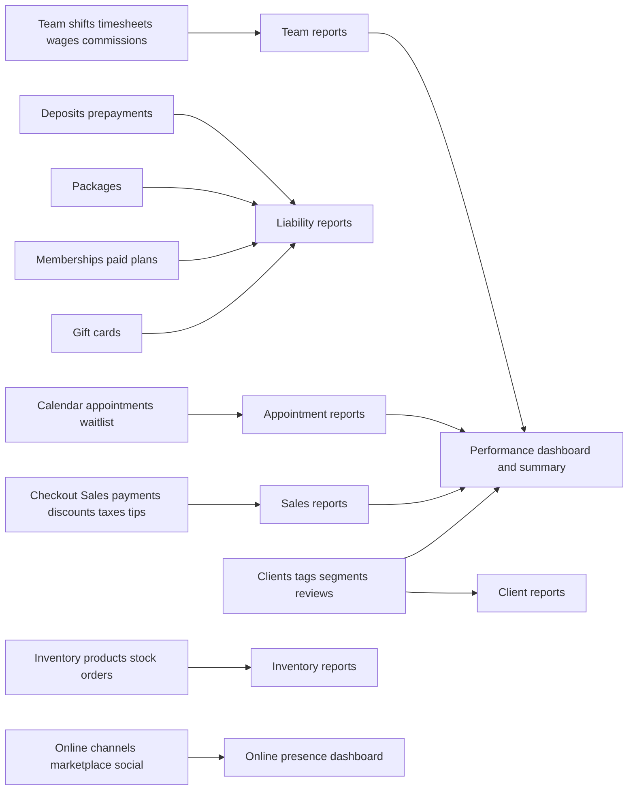

### 7.5 Reports engine model

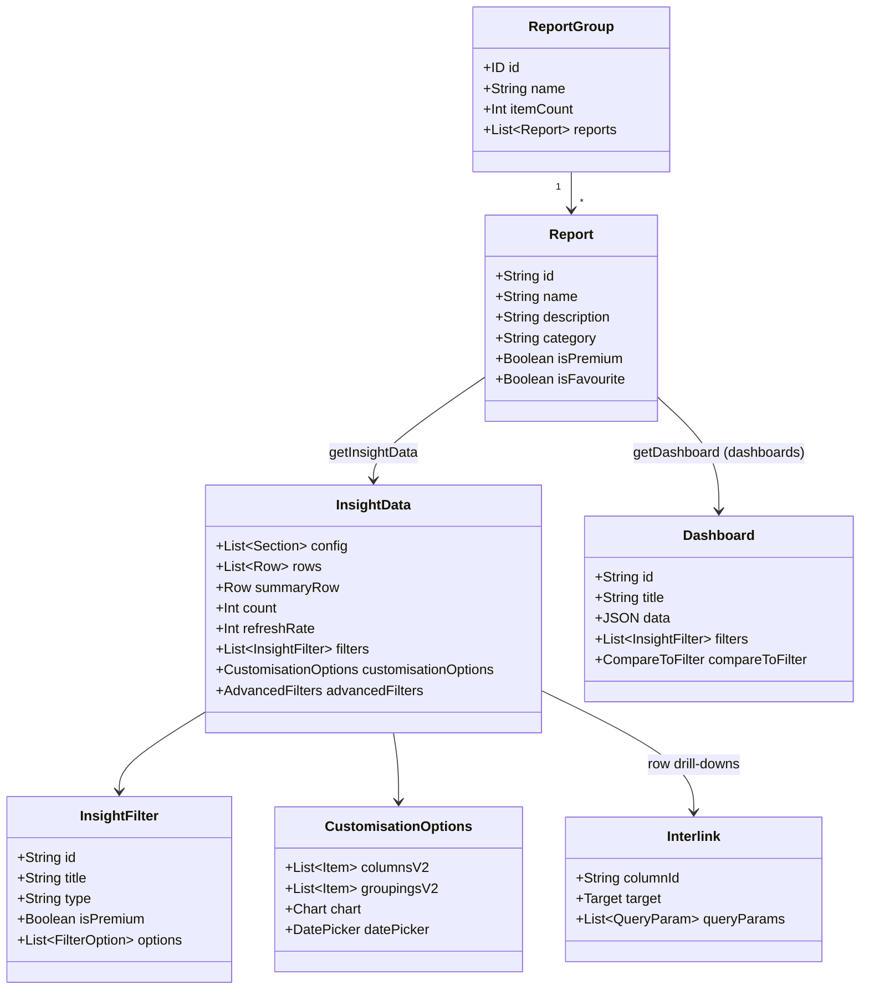

## 8. Create and edit flows

All flows were exercised with COUNCIL-TEST data on 2026-10-04. Validation was captured by submitting empty forms first. Mutation status follows the verifier's rulings: the service create mutation and the whole sale pipeline are captured; product and supplier mutations are inferred from navigation.

### 8.1 Client create + note

Steps: /clients/list -> Add -> dialog at /clients/list/add -> fill Profile -> Save -> row appears -> click row -> drawer -> Records -> Notes -> Add note -> Save.
Observed API order: GET /customer-duplicates/closest-duplicates-check?email&contact-number (200) -> POST customers-api.fresha.com/v2/customers (200, creates client) -> GET /customer-avatars?customer-ids=:id -> GET /customers/:id -> GraphQL CustomerTags -> GraphQL CustomerLeftDrawer (drawer data). Note: GraphQL notes_createNote (200).
Created: COUNCIL-TEST Client1 (301303785) with one note.

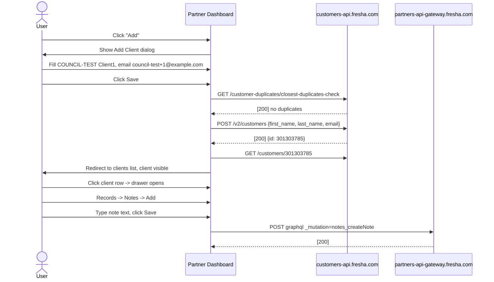

### 8.2 Service create

Steps: /catalogue/services -> Add -> Single service -> dialog at /catalogue/services/service/add/new -> name, category, price, duration -> Save.
Observed API order: services_getCatalogItems -> services_getTeamMemberLocations -> services_treatmentCategoriesQuery -> services_treatmentSuggestionsQuery -> services_getTeamMembers -> services_createServiceMutation (200, captured) -> services_getCatalogItems (refresh).
Created: COUNCIL-TEST Service1 (Hair & styling, KWD 25, 1 hr).

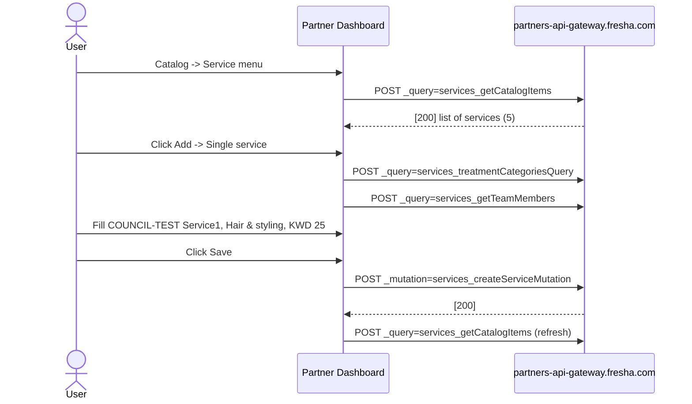

### 8.3 Product and supplier create/edit (mutations inferred)

Steps: /catalogue/products -> "Start now" -> product-add dialog -> fill -> Save -> list; row click -> detail drawer -> Edit -> /catalogue/products/:productId/edit -> change description -> Save. Supplier mirrors this at /catalogue/suppliers with /catalogue/suppliers/new and /:supplierId/edit.
Captured queries: products_getProductBrands, products_getProductCategories. The create mutation (products_createProduct), the update mutation (products_updateProduct), and supplier create/edit (POST /suppliers, POST/PUT /suppliers/:id) are INFERRED from redirects; the network capture missed them. Verifier ruling: keep them inferred until request/status evidence exists.
Created/edited: COUNCIL-TEST Product1 (13279305, description edit verified), COUNCIL-TEST Supplier1 (1353761, description edit verified), seeded Products 2-4.

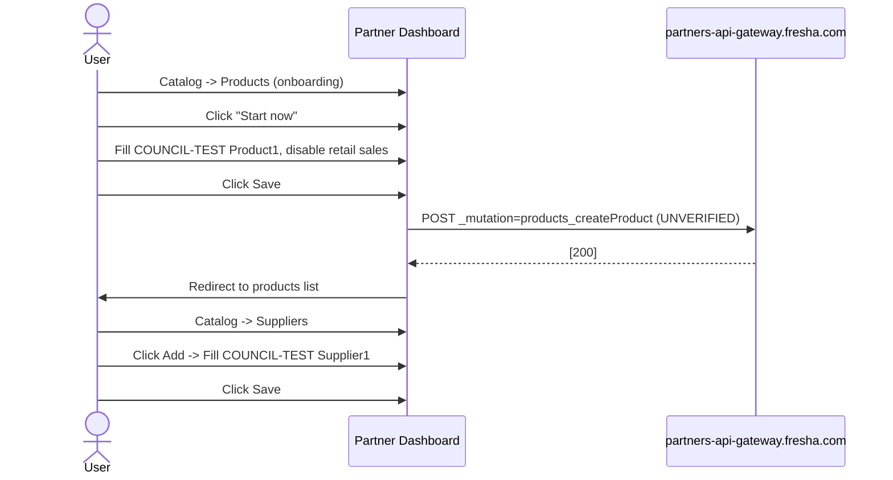

### 8.4 Appointment create

Steps: Calendar -> Add -> Appointment -> pick-time mode -> "View available times" -> drawer /calendar/drawer/new-appointment/ -> Services -> Time -> Client -> Confirm. The appointment auto-creates as Walk-in without a client; a client is then attached via "Add client". 15-minute slots; "Next available date" jumps to the first open day. Create endpoint UNVERIFIED (POST partners-calendar-api /appointments inferred).
Created: appointment 1319614874 (booking 1782628367), COUNCIL-TEST Client1 + Service1 + Fahad Asad, Mon Oct 5 10:00-11:00, KWD 25.

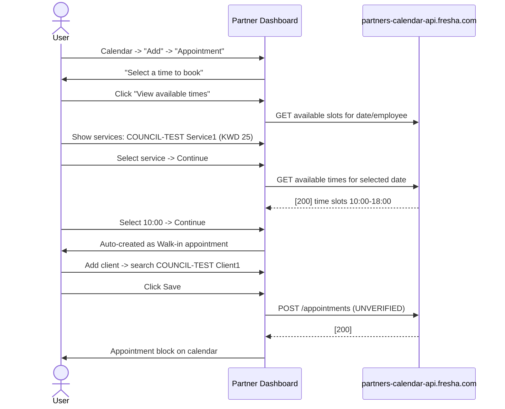

### 8.5 Checkout (appointment -> paid sale)

Steps: appointment drawer -> Checkout -> cart (COUNCIL-TEST Service1, KWD 25) -> tip "No tip" -> payment Cash -> amount dialog pre-filled -> Add ("Full payment added") -> Pay now -> invoice drawer (Sale #2, Completed).
Key IDs: order 1091450803, invoice/sale 567896865, payment Cash KWD 25 received by Fahad Asad.
Observed API order (all 200): initializeOrder (mutation, creates order) -> order -> orderSelfCheckoutSession -> checkout_fullyPaidOrderCheckoutSettings -> CheckoutCustomerLoyaltyData -> setTipAmount (mutation, 0) -> addOrderIntendedTransaction (mutation, cash 25) -> capturePayments (mutation) -> orderTransactions -> GET reports.fresha.com/api/reports/sales_list -> GET partners-api.fresha.com/sales/567896865/transactions-history.

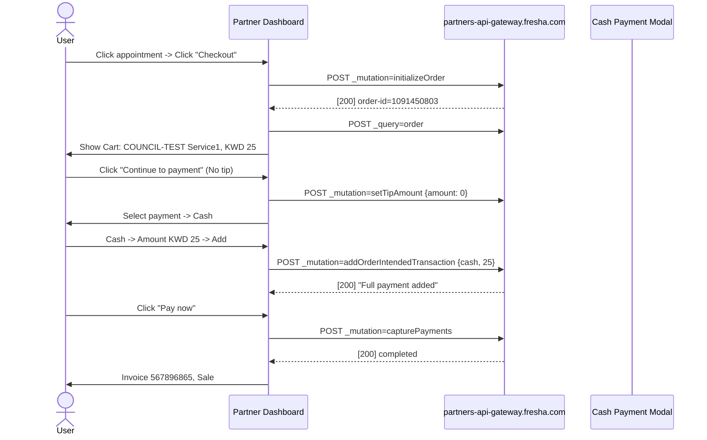

### 8.6 Quick sale (clientless)

Steps: Calendar -> Add -> Sale -> quick sale drawer (order auto-created) -> tabs Appointments, Services, Products, Packages, Gift cards -> search "COUNCIL" -> add Service1 -> No tip -> Cash KWD 25 -> Add -> Pay now -> invoice drawer (Sale #3, Walk-In, Completed).
Key IDs: order 1091452695, invoice/sale 567897371.
API sequence mirrors checkout: initializeOrder -> offerCatalogItems -> setTipAmount -> addOrderIntendedTransaction -> capturePayments -> orderTransactions -> GET reports.fresha.com/api/reports/sales_list.
Notable: COUNCIL-TEST Product1 did not appear in the Products tab because "Enable retail sales" is off for it. Products only appear in quick sale when retail sales are enabled.

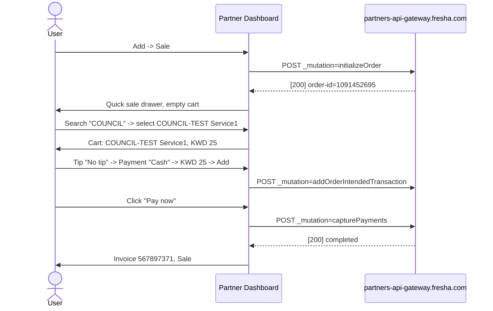

Global sale pipeline (both flows): initializeOrder -> (setTipAmount) -> addOrderIntendedTransaction -> capturePayments, then orderTransactions, reports sales_list refresh, and per-sale transactions-history.

### 8.7 Cancellation reason create (settings)

/setup/scheduling/cancellation-reasons -> Add -> Name -> Add. Captured: POST partners-api.fresha.com/cancellation-reasons with JSON:API body {"data":{"attributes":{"name":"COUNCIL-TEST cancellation reason"},"type":"cancellation-reasons"}} -> 200, toast "Cancellation reason added". The reason then appears in the appointment cancellation dialog (Actions -> Cancel appointment -> reason list); the cancellation itself was not executed.

### 8.8 Flows not exercised (safety or gating)

Team member create (form reached, not submitted; "Activate plan" banner is billing-sensitive). Register/POS (activation page). Deals, Blast campaigns (activation pages; sending is forbidden by safety rules). Automation enable toggles (would send client messages). Appointment cancellation confirm, refunds, voids, deletions, bulk delete, loyalty and Insights trial activation, payment provider changes, logout: all observed at dialog level at most, never confirmed.

### 8.9 Validation rules

| Flow | Field | Rule | Message |
|---|---|---|---|
| Client | First name | required (0/255) | "This field is required" |
| Service | Service name | required (0/255) | required indicator |
| Service | Menu category | required | must select from list |
| Product | Retail price | required when "Enable retail sales" is on | "This field is required" |
| Supplier | Supplier name | required | required indicator |
| Cancellation reason | Name | required | placeholder "e.g. Local promotion" |
| Tax rate | Tax name, Tax rate | dialog fields (not submitted) | UNVERIFIED |

### 8.10 Propagation matrix (final, verifier-confirmed)

The earlier flows.md matrix left most destinations UNVERIFIED. The verifier's final live session supersedes it:

| Record | Sales list | Payments | Daily sales | Client history | Dashboard | Reports (Sales summary) | Result |
|---|---|---|---|---|---|---|---|
| Checkout Sale #2 (COUNCIL-TEST Client1, Service1, Oct 5 appointment) | YES: Sale #2, Completed, KWD 25 | YES: Ref #2, Cash, KWD 25 | YES: in total KWD 240 | YES: Sales 1, total KWD 25; Appointments 1 | YES: sales KWD 240, appointment activity | YES: total KWD 240.000, qty 3, items 4 | CONFIRMED |
| Quick Sale #3 (Walk-In, Service1) | YES: Sale #3, Completed, KWD 25 | YES: Ref #3, Cash, KWD 25 | YES: in total KWD 240 | N/A (intentionally clientless) | YES: sales KWD 240 | YES: total KWD 240.000, qty 3, items 4 | CONFIRMED |

Supporting evidence: reports sales_list API returned both sales; partners-api /sales/:id/transactions-history returned Cash KWD 25 for each; Daily sales for Sun Oct 4 showed services qty 4 and KWD 240 total with KWD 240 cash collected; the client drawer for 301303785 showed the appointment and sale. Sales summary required one reload/re-query and displayed "Data from 16 mins ago": report freshness lags recent mutations, which is an operational caveat, not a propagation failure. Products, suppliers, appointments-list, and stock-related destinations were not re-checked in the final run and remain UNVERIFIED.

## 9. Lifecycles

### 9.1 Appointment

Statuses are configured at /setup/scheduling/appointment-statuses (system set: Booked, Confirmed, Arrived, Started, Completed, Canceled, No-show; custom statuses can be added). Transitions below come from automation trigger names and observed drawer actions; the Arrived/Started transitions were not exercised.

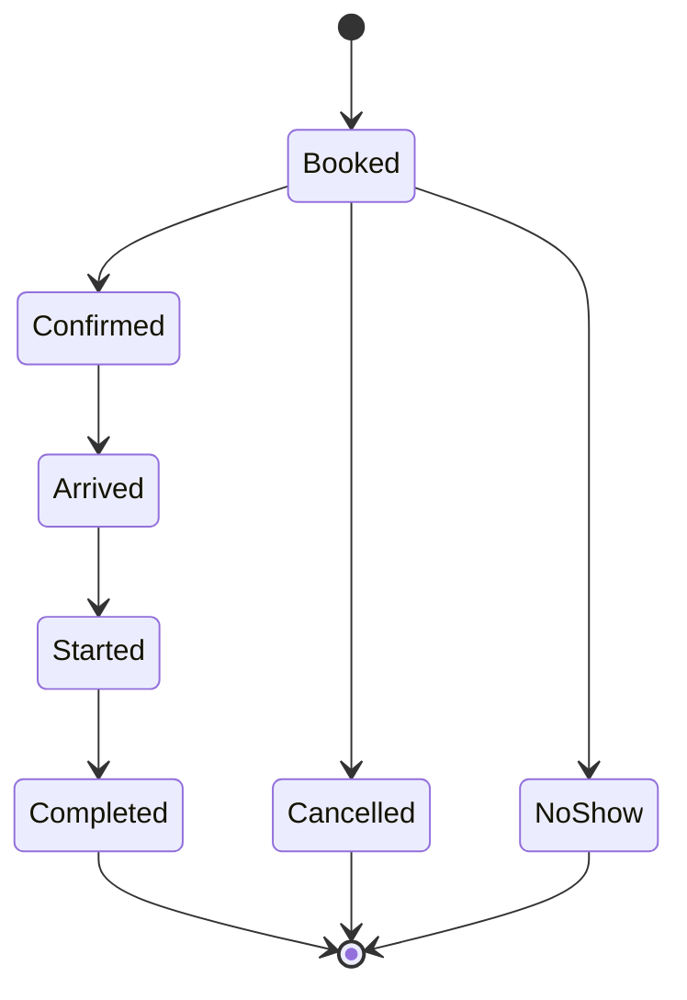

Observed entry paths: calendar Add > Appointment (walk-in auto-create, client attached after), online booking channels, client drawer "Book now". Cancellation runs through the appointment drawer Actions -> Cancel appointment with a reason from settings. Checkout moves a completed appointment's services into a Sale.

### 9.2 Sale and payment

States observed in the checkout flow and report filters: cart -> tip -> payment method -> paid -> completed; sale status filter offers 6 values including Unpaid, Part paid, Completed. Post-completion actions exist (Refund sale, Void sale, Edit sale details) but were not executed.

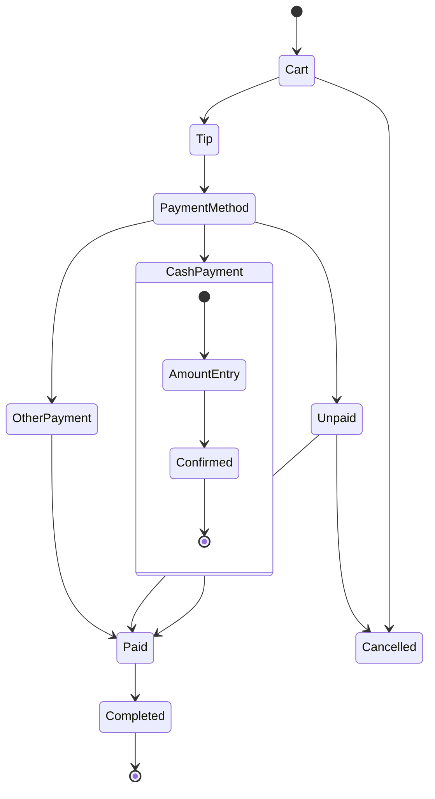

### 9.3 Stock order (inferred, UNVERIFIED)

Not exercised (no order was placed). The ordered-stock report exposes statuses (6 options including Draft and Cancelled) and the date/quantity triple ordered / expected / received with a pending quantity, which implies the lifecycle below. Treat as inferred from the report schema, not from observed transitions.

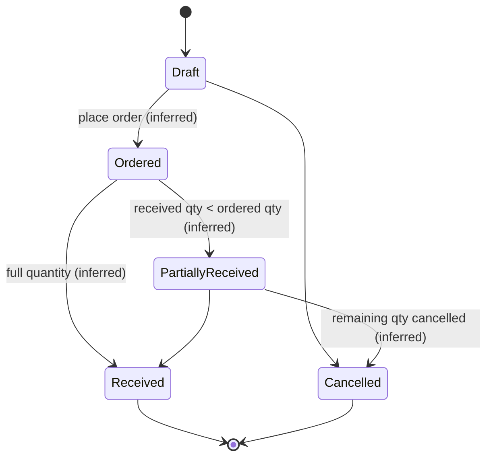

### 9.4 Other status enums observed (report filters, not lifecycles)

- Gift cards: 8 statuses (including Active, Unpaid).
- Memberships: 10 statuses (including Pending, Trialing, Active, cancelled/pending-cancellation states).
- Packages: 6 statuses (including Active, Pending, Expired).
- Waitlist entries: 5 statuses (including Waiting, Booked, expired).
- Payment transactions: types Sale, Refund, Prepayment (+ All); methods Cash, Other (+ All).
- Sale invoice statuses: 6 options (including Unpaid, Part paid, Completed).

## 10. API endpoint catalogue

Status key: LIVE = captured in this pass's live sessions; PJ = from the first survey's pages.json captures; INF = inferred from navigation/redirects; UNV = unverified.

### 10.1 Global GraphQL operations (partners-api-gateway.fresha.com, every page)

| Operation | Purpose | Status |
|---|---|---|
| emptyQuery | Connectivity/heartbeat | LIVE |
| appInitializationQuery | App bootstrap | LIVE |
| users_profileDetails | Current user profile | LIVE |
| pinAuthorization_pinSwitchingConfiguration | PIN auth config | LIVE |
| getPersistedCookieConsent | Cookie consent | LIVE |
| HasProviderEverHadVouchers | Voucher gate | LIVE |
| addOnsGateway / singleAddOnGateway / addOns_addOnsPaymentFailureStatus | Add-ons marketplace | LIVE |
| memberships_membershipsEnabledQuery | Membership gate | LIVE |
| onboardingShared_getOnboardingGuides / onboarding_getDealAgreementProviderSoftLock | Onboarding | LIVE |
| FreshaAwards_AnnualPartnerAward | Award banner | LIVE |
| connectShared_customerConnectFeature / connectShared_inAppNotificationSettings / CustomerConnect_customerConnectFeature / CustomerConnect_unreadConversationsCount | Connect gates and unread count | LIVE |
| automatedMessages_messageAccountingZeroBalanceWarning | Message balance warning | LIVE |
| professionalProfileBannerStatus | Profile banner | LIVE |
| referrals_referralEntry | Referral program | LIVE |
| appointmentStatusLabels | Status enum | LIVE |

### 10.2 Global REST (every page)

| Method | Endpoint | Purpose | Status |
|---|---|---|---|
| GET | partners-app.fresha.com/api/wallet/wallets-summary | Wallet balance | LIVE |
| GET | partners-app.fresha.com/api/wallet/finance-accounts-summary | Finance accounts | LIVE |
| GET | partners-app.fresha.com/api/credits/credits-campaign | Credits campaign | LIVE |
| GET | partners-api.fresha.com/unread-alerts-count | Alert badge | LIVE |
| GET | partners-api.fresha.com/session | Session | LIVE |
| POST | auth-api.fresha.com/pin-switching/session/heartbeat | Session heartbeat | LIVE |
| GET | staff-notifications.fresha.com/activity-log-unread-count (+ settings) | Notification badge (polled) | LIVE |
| GET | onboarding-api.fresha.com onboarding checklists (provider, employee) | Continue-setup state | LIVE |
| GET | customer-notifier-api.fresha.com/v3/notification-types + provider-available-channels | Messaging config | LIVE |
| GET | partners-api.fresha.com/localization-languages, /provider/languages-configuration, /countries/KW | Localization | LIVE |
| POST | unleash-proxy.fresha.com/proxy | Feature flags | LIVE |
| POST | www.fresha.com/plumbus/2/httpapi | Telemetry, purpose unclear | LIVE / purpose UNV |

### 10.3 Search

| Method | Endpoint | Purpose | Status |
|---|---|---|---|
| POST | partners-search-gql.fresha.com/graphql, operation partnerSearch {query, first:30, include} | Global search palette; typed hits per entity | LIVE |

### 10.4 Customers / clients

| Method | Endpoint | Purpose | Status |
|---|---|---|---|
| GET | customers-api.fresha.com/v2/customer-search?offset&query&genders&customer-type&blocked&verified&tag-ids&segment-ids&sort-order&sort-by&limit&include-customers-count | Clients list data | LIVE |
| GET | customers-api.fresha.com/customer-avatars?customer-ids=... | Batch avatars | LIVE |
| GET | customers-api.fresha.com/customer-duplicates/existence-check | Duplicate detection | LIVE |
| GET | customers-api.fresha.com/customer-duplicates/closest-duplicates-check?email&contact-number | Pre-create duplicate check | LIVE |
| GET | customers-api.fresha.com/customers-merge/auto-status | Merge status | LIVE |
| POST | customers-api.fresha.com/v2/customers | Create client | LIVE |
| GET | customers-api.fresha.com/customers/:id | Client detail | LIVE |
| GET | partners-api.fresha.com/customers/:id/recently-booked-appointments, /paid-plan-instances, /ncf-events | Appointment drawer client data | PJ |
| POST | gateway GraphQL CustomerLeftDrawer | Client drawer data | LIVE |
| POST | gateway GraphQL CustomerTags | Client tags | LIVE |
| POST | gateway GraphQL notes_createNote | Create client note | LIVE |
| POST | gateway GraphQL WorkspaceTagDefinitions / WorkspaceSegmentDefinitions | Tag/segment config | LIVE |

### 10.5 Calendar / appointments

| Method | Endpoint | Purpose | Status |
|---|---|---|---|
| POST | gateway GraphQL calendar_dailyCalendarEvents (+ Prefetch) | Day events | LIVE |
| POST | gateway GraphQL calendar_serviceAddOnDurations / calendar_offerCatalogItems | Booking form data | LIVE |
| POST | partners-calendar-api.fresha.com/alpha-graphql | Calendar queries | PJ (operations LIVE) |
| GET | partners-api.fresha.com/closed-dates?location-id&date-from&date-to | Closures | LIVE |
| GET | partners-api.fresha.com/v2/employees?location-id&with-deleted&includes=compensation-addons | Team columns | LIVE |
| GET | partners-api.fresha.com/employees/with-deleted?employee-ids=... | Employee detail | LIVE |
| GET | partners-api.fresha.com/employees | Team filter lists | LIVE |
| POST | staff-working-hours-api.fresha.com/graphql (3 calls) | Shifts/working hours | LIVE |
| POST | gateway GraphQL resourcesSettings / resources_resourceTypes / resources_getResourceTypesWithResources | Resources | LIVE |
| POST | gateway GraphQL waitlistButtonCounts / waitlistProviderSettings | Waitlist | LIVE |
| POST | gateway GraphQL hasSalesOrders / cashRegisters_activeCashRegisters | POS gating | LIVE |
| POST | calendar appointments create (POST /appointments) | Appointment create | INF |

### 10.6 Sales / checkout

| Method | Endpoint | Purpose | Status |
|---|---|---|---|
| POST | gateway GraphQL initializeOrder (mutation) | Create checkout/quick-sale order | LIVE |
| POST | gateway GraphQL order / orderSelfCheckoutSession / checkout_fullyPaidOrderCheckoutSettings / CheckoutCustomerLoyaltyData | Checkout context | LIVE |
| POST | gateway GraphQL setTipAmount (mutation) | Tip | LIVE |
| POST | gateway GraphQL addOrderIntendedTransaction (mutation) | Payment intent | LIVE |
| POST | gateway GraphQL capturePayments (mutation) | Capture/finalize | LIVE |
| POST | gateway GraphQL orderTransactions | Transaction history | LIVE |
| POST | gateway GraphQL offerCatalogItems | Quick-sale catalog | LIVE |
| GET | partners-api.fresha.com/sales/:invoiceId/transactions-history | Invoice transactions | LIVE |
| GET | reports.fresha.com/api/reports/sales_list?limit&offset&date-from&date-to | Sales list | LIVE |
| GET | reports.fresha.com/api/reports/appointments_list?limit&offset&sort-by&sort-order&date-from&date-to&use-appt-id | Appointments list | LIVE |
| GET | reports.fresha.com/api/reports/daily_sales | Daily sales | PJ |
| GET | reports.fresha.com/api/reports/payment_transactions | Payments page | reports.md |
| GET | reports.fresha.com/api/reports/gift_cards + gift-cards-api.fresha.com/config | Gift cards sold | PJ |
| GET | partners-api.fresha.com/paid-plan-management | Memberships sold | PJ |
| GET | partners-api.fresha.com/location-tip-settings/:locationId | Tip settings | PJ |

### 10.7 Dashboard and insights

| Method | Endpoint | Purpose | Status |
|---|---|---|---|
| GET | reports.fresha.com/api/json_api_dashboard/recent_sales?days-range&location-id | Recent sales widget | LIVE |
| GET | .../upcoming_appointments?days-range&location-id | Upcoming appointments | LIVE |
| GET | .../bookings_activity?page=1 | Activity feed | LIVE |
| GET | .../todays_bookings | Today's bookings | LIVE |
| GET | .../top_services | Top services | LIVE |
| GET | .../top_employees | Top team member | LIVE |

### 10.8 Reports engine

| Method | Endpoint | Purpose | Status |
|---|---|---|---|
| POST | partners-reporting-api.fresha.com/ getReportGroup | Catalogue (59) | LIVE |
| POST | partners-reporting-api.fresha.com/ getInsightData | Table data, filters, columns, interlinks | LIVE |
| POST | partners-reporting-api.fresha.com/ getDashboard | Dashboard data (loyalty_dashboard errors on this account) | LIVE |
| POST | partners-reporting-api.fresha.com/ calculateComparisonPeriod | Compare-to resolution | LIVE |
| POST | partners-reporting-api.fresha.com/ getPermissions | Per-report access | LIVE |

### 10.9 Catalogue (services, products, suppliers)

| Method | Endpoint | Purpose | Status |
|---|---|---|---|
| POST | gateway GraphQL services_getCatalogItems / services_getTeamMemberLocations / services_treatmentCategoriesQuery / services_treatmentSuggestionsQuery / services_getTeamMembers | Service menu data | LIVE |
| POST | gateway GraphQL services_createServiceMutation | Create service | LIVE |
| POST | gateway GraphQL products_getProductBrands / products_getProductCategories | Product form data | LIVE |
| POST | gateway GraphQL products_createProduct | Create product | INF |
| POST | gateway GraphQL products_updateProduct | Edit product | INF |
| POST | partners-api.fresha.com/suppliers | Create supplier | INF |
| POST/PUT | partners-api.fresha.com/suppliers/:id | Edit supplier | INF |
| GET | inventory-api.fresha.com/inventory | Products list | PJ |
| GET | inventory-api.fresha.com/suppliers | Suppliers list | PJ |

### 10.10 Settings and misc

| Method | Endpoint | Purpose | Status |
|---|---|---|---|
| GET/POST | partners-api.fresha.com/cancellation-reasons | Cancellation reasons list/create (JSON:API body, 200 captured) | LIVE |
| GET | shopkeeper-api.fresha.com/backoffice/shop + partners-api.fresha.com/published-location-profiles-check | Marketplace profile | PJ |
| GET | google-appt-redirection-api.fresha.com/reserve-with-google-settings | Google Reserve | PJ |
| GET | partners-api.fresha.com/facebook-fbe/provider-settings | Facebook/Instagram, Add-ons page | PJ |
| GET | partners-api.fresha.com/user-account/profile | Link builder / user profile | PJ |
| GET | partners-api.fresha.com/blast-marketing/campaigns | Blast campaigns | PJ |
| GET | customer-notifier-api.fresha.com/v3/notification-types (+ /:type), /messages | Automations, messages history | LIVE / PJ |
| POST | gateway GraphQL automatedMessages_overview_messageAccountingAccount / automatedMessages_contactFormSetting / automatedMessages_balanceWidget_messageAccountingAccount / legalEntities | Automations page | LIVE |
| GET | deals-api.fresha.com/deals, /smart-pricing/migration-result | Deals, smart pricing | PJ |
| POST | timesheets-api.fresha.com/graphql | Timesheets | PJ |
| POST | staff-working-hours-api.fresha.com/graphql | Pay runs | PJ |
| n/a | /connect application APIs | Fresha Connect | UNV |
| n/a | /clients/segments, /clients/online-reputation, /catalogue/packages, /catalogue/orders, /catalogue/stocktakes, /sales/packages-sold, /sales/payment-transactions page-specific, user-account pages | Various | UNV |

## 11. Items missed by the first survey, and remaining unknowns

### 11.1 Resolved this pass

| First-survey item | Resolution |
|---|---|
| Top-bar Search / Performance insights / Notifications / Continue setup click-throughs (UNVERIFIED) | CONFIRMED: search palette (partnerSearch), /dashboard/drawer/performance-insights/, /dashboard/drawer/notifications/, /dashboard/drawer/resources/onboarding-guides/ |
| "News" control location | Tab inside the resources drawer rail (/dashboard/drawer/resources/news/), with Help (/support/) and Guides |
| User-menu referral, help, logout, language (UNVERIFIED) | CONFIRMED: referral is a banner (KWD 60, no dedicated route); Help -> support drawer; Log out and English (US) present, not clicked |
| Client profile tabs (UNVERIFIED) | CONFIRMED: 9 tabs plus full Actions menu (section 4.5) |
| Appointment drawer content | EXPANDED: full body, Options menu, checkout path (sections 4.10, 8.5) |
| Sale/invoice drawer (undocumented) | CONFIRMED: routes, tabs, options menu |
| Team member drawer (UNVERIFIED) | CONFIRMED: tabs, actions, performance report link |
| Service detail/edit dialog (UNVERIFIED) | CONFIRMED: tabs and fields |
| Fresha Connect "modal only" claim | WRONG: full application; UI confirmed, API unverified |
| "Top team member references client count" | WRONG: columns are Team member / This month / Last month |
| "Client loyalty depends-on clients list" | WRONG as a dependency edge: it is a gated add-on page |
| Link builder hard-nav 403 "universal" | PARTIAL: session-dependent, not an invariant |
| Report count 58 vs 59 | 59 canonical |
| Customer search API unknown | CONFIRMED: customers-api /v2/customer-search with full filter params |
| GraphQL mutation pattern unknown | CONFIRMED: `_mutation=<operationName>`; service create and the 4-mutation sale pipeline captured |
| Reports engine unknown | CONFIRMED: partners-reporting-api GraphQL with 5 operations |
| Setup sub-pages (UNVERIFIED in architecture pass) | CONFIRMED for the full settings tree by the settings pass; billing-sensitive dialogs deliberately not opened |
| /sales/paid-plans redirect | CONFIRMED: -> /sales/memberships |
| Wallet/credits calls as "feature links" | Ruled: background traffic on every page, not user-facing links |
| New this pass | calendar_offerCatalogItems and cashRegisters_activeCashRegisters operations; partners-search-gql and plumbus hosts; /user-account/workspaces/:workspaceId/settings area; notification preferences modal; global search payload schema |

### 11.2 Remaining unknowns (UNVERIFIED)

- Product create/update and supplier create/update request payloads and status codes (mutations inferred from redirects only).
- Appointment create mutation endpoint and payload.
- Notification drawer feed API; notification click-through targets.
- Realtime mechanism for calendar and Connect inbox (no WebSocket/SSE seen; polling confirmed only for the unread-count badge).
- Fresha Connect API surface and onboarding steps 2-3.
- POS/register data flow, cash register open/close, inventory chain (products -> stocktakes -> stock orders -> suppliers), automation trigger execution, payroll chain (timesheets -> pay runs -> wages), report email/scheduling, Data connector behavior, loyalty dashboard content (API errors on this account), permission edge cases per role.
- Whether premium report data is hard-gated in production (this account returned premium data, likely trial).
- Export availability per report beyond Sales summary.
- Loyalty add-on pricing (KWD 32.95/location/month) and Insights pricing (KWD 27/location/month) were each observed once on gate screens but not re-verified in the final run.
- Full ER cardinalities (conceptual unless payload-backed) and the purpose of www.fresha.com/plumbus/2/httpapi.

## 12. Test records and cleanup checklist

Every record the council created is named COUNCIL-TEST and uses fake contact details (council-test+N@example.com). None was reverted; all still exist in the Test Salon workspace (pid 3110536, location 3216614). The seed task created 11 clients, 1 service category, and 3 products; it did not create the planned appointments or checkouts (the service form's treatment-type step made bulk seeding impractical). The appointment and the two sales come from the flow pass, not the seed task.

### 12.1 Cleanup checklist

| # | Record | Type | ID / key values | Where it lives | Created by | Cleanup route | Reverted |
|---|---|---|---|---|---|---|---|
| 1 | COUNCIL-TEST Client1 | Client | 301303785, council-test+1@example.com | /clients/list | linker (flow pass) | Client drawer Actions -> Delete client | No |
| 2 | COUNCIL-TEST note on Client1 | Client note | "COUNCIL-TEST note: This is a test note for the council link mapping exercise." | Client drawer -> Records -> Notes | linker | Delete via note actions (UNVERIFIED menu) | No |
| 3 | COUNCIL-TEST Alice Johnson | Client (seed) | 301304885, council-test+2@example.com, Oct 15 1990, Female | /clients/list | linker (seed) | Delete client | No |
| 4 | COUNCIL-TEST Bob Smith | Client (seed) | 301305013, council-test+3@example.com | /clients/list | linker (seed) | Delete client | No |
| 5 | COUNCIL-TEST Carol Davis | Client (seed) | 301305069, council-test+4@example.com | /clients/list | linker (seed) | Delete client | No |
| 6 | COUNCIL-TEST David Wilson | Client (seed) | 301305107, council-test+5@example.com | /clients/list | linker (seed) | Delete client | No |
| 7 | COUNCIL-TEST Emma Brown | Client (seed) | 301305133, council-test+6@example.com | /clients/list | linker (seed) | Delete client | No |
| 8 | COUNCIL-TEST Frank Taylor | Client (seed) | 301305152, council-test+7@example.com | /clients/list | linker (seed) | Delete client | No |
| 9 | COUNCIL-TEST Grace Anderson | Client (seed) | 301305173, council-test+8@example.com | /clients/list | linker (seed) | Delete client | No |
| 10 | COUNCIL-TEST Henry Thomas | Client (seed) | 301305195, council-test+9@example.com | /clients/list | linker (seed) | Delete client | No |
| 11 | COUNCIL-TEST Iris Martinez | Client (seed) | 301305214, council-test+10@example.com | /clients/list | linker (seed) | Delete client | No |
| 12 | COUNCIL-TEST James Garcia | Client (seed) | 301305231, council-test+11@example.com | /clients/list | linker (seed) | Delete client | No |
| 13 | COUNCIL-TEST Kate Robinson | Client (seed) | 301305253, council-test+12@example.com | /clients/list | linker (seed) | Delete client | No |
| 14 | COUNCIL-TEST Service1 | Service | Hair & styling, KWD 25, 1 hr | /catalogue/services | linker (flow pass) | Service card kebab -> delete (UNVERIFIED menu) | No |
| 15 | COUNCIL-TEST Category | Service category | "Test category for council verification", 0 services | /catalogue/services sidebar (between Hair & styling and Eyebrows & eyelashes) | linker (seed) | Category Actions -> delete (UNVERIFIED menu) | No |
| 16 | COUNCIL-TEST Product1 | Product | 13279305, description edited to "COUNCIL-TEST: verified edit for link mapping" | /catalogue/products | linker (flow pass; edit in pass 2) | Product row -> delete (UNVERIFIED menu) | No |
| 17 | COUNCIL-TEST Product2 | Product (seed) | Supplier1, supply KWD 3, retail KWD 8 | /catalogue/products | linker (seed) | Delete product | No |
| 18 | COUNCIL-TEST Product3 | Product (seed) | Supplier1, supply KWD 4, retail KWD 10 | /catalogue/products | linker (seed) | Delete product | No |
| 19 | COUNCIL-TEST Product4 | Product (seed) | Supplier1, supply KWD 5, retail KWD 12 | /catalogue/products | linker (seed) | Delete product | No |
| 20 | COUNCIL-TEST Supplier1 | Supplier | 1353761, description edited to "COUNCIL-TEST: verified edit for link mapping" | /catalogue/suppliers | linker (flow pass; edit in pass 2) | Supplier row Actions -> delete (UNVERIFIED menu) | No |
| 21 | COUNCIL-TEST appointment | Appointment | 1319614874 (booking 1782628367), Mon Oct 5 10:00-11:00, Client1 + Service1 + Fahad Asad, KWD 25; checked out as Sale #2 | /calendar Oct 5, appointments list | linker (flow pass) | Already completed and sold; remaining appointment record cannot be deleted, only cancelled (not executed to preserve propagation evidence) | No |
| 22 | Sale #2 (checkout of the appointment) | Sale/invoice | Invoice 567896865, order 1091450803, Cash KWD 25, Completed | /sales/sales-list, payments, daily sales, reports, client history | linker (flow pass) | Financial record: not deletable. Options are Void sale or Refund (never executed; would change financial totals) | No |
| 23 | Sale #3 (quick sale) | Sale/invoice | Invoice 567897371, order 1091452695, Walk-In, Cash KWD 25, Completed | same destinations as Sale #2 | linker (flow pass) | Same as Sale #2 | No |
| 24 | COUNCIL-TEST cancellation reason | Setting (additive) | name "COUNCIL-TEST cancellation reason" | /setup/scheduling/cancellation-reasons | cartographer (settings pass) | Row Actions menu -> delete | No |

Cleanup notes: nothing was deleted, refunded, voided, or reverted during any pass, by design (safety rules). Records 22 and 23 are completed financial transactions; voiding or refunding them would alter Sales, Payments, Daily sales, Dashboard, and report totals (currently KWD 240 across the workspace), so decide before cleaning. No settings were flipped; the only setting change is the additive cancellation reason (24). No paid add-on, billing, payment-provider, logout, or outbound-message action was triggered by any member, including the verifier.

### 12.2 Seed data description

The seed task (linker, t_060a443e) prepared the workspace for this pass. It created 11 clients with birthdays and genders (plus the pre-existing COUNCIL-TEST Client1, total 12), one service category, and three products attached to COUNCIL-TEST Supplier1 with supply/retail pricing. Planned but not created: 4 more services, ~15 appointments across the surrounding two weeks, 8 checkouts, 2 cancellations, 1 no-show, 3 quick sales, 1 gift card, and client notes. The blocker was the service creation form's treatment-type step (869 options), which made bulk seeding too slow. The appointment and sales used for propagation testing were created separately in the flow pass. Seed evidence: Clients list count 15 and Product list count 4 by browser snapshot, 08:10 UTC Oct 4.

## Appendix: Evidence index

### A.1 First-survey screenshots (/Users/fahad/council/output/screenshots/, read-only baseline)

p-dashboard, p-calendar, p-sales-daily-sales, p-sales-register, p-sales-appointments-list, p-sales-sales-list, p-sales-payment-transactions, p-sales-gift-cards, p-sales-packages-sold, p-sales-paid-plans, p-clients-list, p-clients-segments, p-clients-loyalty, p-clients-online-reputation, p-catalogue-services, p-catalogue-packages, p-catalogue-products, p-catalogue-stocktakes, p-catalogue-orders, p-catalogue-suppliers, p-fresha-marketplace, p-fresha-google-reserve, p-fresha-facebook, p-fresha-link-builder, p-fresha-smart-website, p-marketing-blast-campaigns, p-marketing-automations, p-marketing-notifications, p-marketing-deals, p-marketing-peak-pricing, p-team-team-members, p-team-scheduled-shifts, p-team-timesheets, p-team-payrun, p-reports, p-add-ons, p-setup, p-connect, p-user-menu, p-user-profile, p-personal-settings, p-appointment-drawer (all .png).

### A.2 Deep-pass screenshots (/Users/fahad/council/output/technical/screenshots/)

Reports pass: r-reports-catalog.png, r-performance-dashboard.png, r-performance-summary.png. Settings pass: s-business-setup.png, s-locations.png, s-location-detail.png, s-opening-hours.png, s-location-sales.png, s-scheduling.png, s-sales-hub.png, s-legal.png.

### A.3 Gaps pass evidence (cartographer workspace /Users/fahad/.hermes/kanban/workspaces/t_98a9f324)

Snapshots g-s01..g-s37 (top bar, search palette, insights, notifications, guides, news, help, user menu, clients list and add dialog, client drawer and tabs, appointment drawer and options, sales list and options, invoice drawer and options, payments and row actions, team members and drawer, service menu rows and edit dialog, suppliers and add dialog, add-ons, loyalty gate), screenshots g-p01-search.png, g-p02-insights.png, g-p03-notifications.png, g-p04-continue-setup.png, g-p05-news.png, g-p07-invoice.png, g-p08-teammember.png, g-p09-loyalty-gate.png, network captures g-net-search.txt, g-net-insights2.txt.

### A.4 Other evidence

- Flows pass: live network captures per flow (checkout, quick sale, service create, client create, product/supplier edits) in the linker workspaces; IDs recorded in technical/test-records.md.
- Settings pass: snap-business-setup.yml, snap-business-location.yml, net-resources.txt and the captured cancellation-reasons POST payload (quoted in section 8.7).
- Reports pass: getInsightData/getDashboard payloads for all 59 report ids captured in-session (full column and filter detail in technical/reports.md).
- Verifier pass: live re-checks of Clients (15 rows), Sales, Payments, Daily sales, client drawer 301303785, Dashboard, and Sales summary ("Data from 16 mins ago", KWD 240.000, qty 3, items 4); Mermaid validation of every technical file (18 diagrams, all parse).
- Member reports: technical/architecture.md, technical/settings.md, technical/reports.md, technical/gaps.md, technical/flows.md, technical/seed.md, technical/test-records.md, technical/review.md.

End of report.
