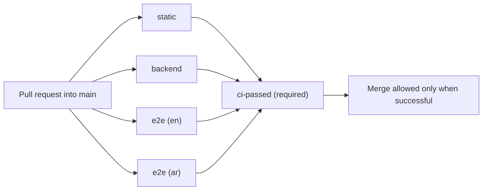

# GlowDesk CI merge gates report

## 1. Verdict: NOT READY

The verifier's current verdict is NOT READY. The draft defines three parallel pull-request jobs and a fail-closed `ci-passed` aggregator, and the main ruleset requires that aggregator with no administrator bypass. However, two built-plan guarantees are still not proven by accepted tests: the `/my-day` journey (G-8) and axe-core accessibility coverage (G-10). The proposed `/my-day` test was rejected because it uses invalid `region` landmarks; axe-core is not installed. The projected pull-request wait is about seven minutes wall-clock, but that is an estimate rather than a full workflow measurement. The accepted rerun found no confirmed product-code defect; it did find an invalid test locator and confirmed missing accessibility coverage. Do not install this as a ready-to-merge gate or authorize release until G-8 and G-10 are closed.

The owner explicitly excluded deployment from this round. G-2 is therefore a future gate, not part of this verdict. The report does not treat the absence of a deploy workflow as an accepted deployment guarantee.

## 2. What was analysed

- Product: `/Users/fahad/GlowDesk`, target branch `main`, plan/baseline commit `07e2a10526bfb5d9f17ebac82bb47d4a5376c4bb`.
- Built scope: Phase 0 (0.1 is partial; 0.2–0.5 built), Phases 1–4 built. Phases 5–17 are not built for this gate. Traceability records these statuses at `traceability.md:11-75, 546-580`; the delivery plan defines subphase criteria in `plan/parts/11-delivery-plan.md:190-929`.
- Date: 2026-10-05.
- The baseline and first verifier pass used the pinned target commit in the verifier sandbox. The final changed-item rerun records `/Users/fahad/GlowDesk` at `9efb74bf24303ed3a7302d6fa0f5da871b5720d`, with an empty working tree after stack restoration. Unchanged results were carried forward from the earlier pinned-clone run; the final rerun did not repeat every check at the target commit (`adjudication.md:7, 19-31, 55-60`). The product repository remained read-only.
- Binding order is ADRs, plan, then conventions (`common.md:21-25`; `plan/decisions.md:1-13`). The traceability document contains stale claims about missing Sentry; the adjudication checked the code and accepts local Sentry transport/test evidence, while keeping staged/hosted acceptance distinct (`adjudication.md:109, 121-124`).

### Built subphase acceptance-criterion status

The counts below are delivery-plan acceptance-criterion groups, not individual assertions. “Existing” means the existing test/evidence is recorded as covering the criterion; “new” counts accepted new tests in this draft. A workflow definition or static validator pass is not evidence that GitHub has run a real PR. The full pre-existing Playwright suite was not rerun in the final changed-item replay.

| Built subphase | Existing proven | New accepted | Open / reason |
|---|---:|---:|---|
| 0.1 Repository and environments | 1 of 4: clean-migration gate passes | 0 | 3: no observed green PR run; staging-to-production deploy excluded by owner; staged Sentry/uptime acceptance not demonstrated. Phase 0.1 remains partial. Plan criteria: `11-delivery-plan.md:226-232`; current scope: `adjudication.md:7, 35-39`. |
| 0.2 Tenancy and security skeleton | 2 of 2 | 0 | None recorded for its pgTAP and login/shell criteria. Coverage: `traceability.md:17-18, 81-89`; test inventory: `baseline/BASELINE.md:188-212, 267-283`. |
| 0.3 Edge Function platform | 1 of 3: Deno validation import/contract | 0 | 2 staged criteria remain unverified: deployed health response and staged Sentry capture. The local Sentry receiver test is accepted, not proof of hosted capture. `11-delivery-plan.md:314-319`; `adjudication.md:109, 122`. |
| 0.4 Frontend platform | 3 of 3 covered by existing formatter, type/build, i18n and smoke coverage | 0 | No named traceability gap. Full existing Playwright suite was not rerun in the final changed-item pass. `11-delivery-plan.md:353-358`; `traceability.md:19-20, 104-117`. |
| 0.5 Calendar-library spike | 3 of 3 by recorded ADR-41 spike evidence | 0 | None for the selected fallback; no premium license was evaluated. `11-delivery-plan.md:372-385`; `traceability.md:21`. |
| 1.1 Provisioning | 3 of 3 by onboarding Deno and database coverage | 0 | No assigned gap remains. Test inventory and suite results: `baseline/BASELINE.md:99-105, 214-233`; route map `traceability.md:208-210`. |
| 1.2 Settings hub | 2 of 4 fully covered by existing tests; one more has unit-only currency-lock coverage | 1 partial criterion group via the accepted closure/cancellation spec | Direct journeys for invoicing, payment methods and tips are still missing; the settings-in-both-locales criterion is only partly covered. Database currency enforcement belongs with the later sales phase. `11-delivery-plan.md:480-486`; `traceability.md:248-254`; `adjudication.md:16, 38`. |
| 1.3 Roles and memberships | 4 of 4 by pgTAP, Deno and existing member/switcher journeys | 0 | No assigned gap remains. `11-delivery-plan.md:523-529`; test inventory `baseline/BASELINE.md:99-111, 214-233, 267-283`. |
| 2.1 Staff records | 2 of 3 by existing database, Deno and normalization tests | 0 | G-8 remains: no accepted `/my-day` Playwright journey. `11-delivery-plan.md:586-591`; `adjudication.md:17, 37`. |
| 2.2 Shifts | 2 of 2 by existing pgTAP, Deno, Vitest and Playwright coverage | 0 | No assigned gap remains. `11-delivery-plan.md:624-628`; `traceability.md:39-43`. |
| 2.3 Blocked time | 4 of 4 by role, exclusion, conflict and Deno coverage | 0 | No assigned gap remains. `11-delivery-plan.md:663-669`; `traceability.md:39-43`. |
| 3.1 Catalogue data | 2 of 2 by pgTAP and Vitest coverage | 0 | No assigned gap remains. `11-delivery-plan.md:722-726`; `traceability.md:45-53`. |
| 3.2 Catalogue function | 2 of 2 by Deno contract and scope tests | 0 | No assigned gap remains. `11-delivery-plan.md:756-760`; `traceability.md:49-53`. |
| 3.3 Catalogue UI | 3 of 3 by existing en/ar catalogue journeys | 0 | No assigned gap remains. `11-delivery-plan.md:788-793`; `traceability.md:51-53`. |
| 4.1 Client data | 2 of 2 by pgTAP and Vitest coverage | 0 | No assigned gap remains. `11-delivery-plan.md:845-849`; `traceability.md:55-65`. |
| 4.2 Client function | 3 of 3 by Deno import, idempotency and role-denial coverage | 0 | No assigned gap remains. `11-delivery-plan.md:883-888`; `traceability.md:59-65`. |
| 4.3 Client UI | 4 of 4 by existing CRUD/import journey and dual-locale fixture | 0 | G-21 is already covered by `clients.spec.ts`; no duplicate test is needed. G-24 is accepted as the dual-locale mechanism, not proof that every screen is visited. `tests-frontend.md:15-33`; `adjudication.md:112-113`. |

G-10 remains open across the built main flows: the required `@axe-core/playwright` dependency and axe assertions are absent. G-9 is only partly closed: accepted coverage exercises closures and the cancellation-reasons page, not invoicing, methods and tips. The verifier explicitly calls these out as remaining screen-coverage work (`adjudication.md:16-18, 37-39`).

## 3. What blocks a merge into main

Once the draft is corrected and installed, the ruleset requires the single `ci-passed` check. The aggregator runs with `always()` and fails unless `static`, `backend` and both matrix instances of `e2e` succeed (`draft/.github/workflows/ci.yml:275-282, 349-391`). The active ruleset targets only `refs/heads/main`, requires strict/up-to-date status checks, blocks branch deletion and force pushes, requires a pull request, and has no bypass actors. It requires zero approvals, matching the single-committer rationale (`draft/.github/rulesets/main.json:1-43`; `pipeline.md:76-80`).

| Job | What it proves | Plan and conventions | Duration |
|---|---|---|---|
| `static` | Frozen pnpm install; Conventional Commit PR title; skill-copy equality; strict i18n compile; TypeScript typecheck; ESLint; CSS logical-property lint; Vitest; back-office build; size budgets. | Phase 0.4; CONVENTIONS §§7–8. Workflow: `draft/.github/workflows/ci.yml:78-141`. | About 30 seconds estimated in `pipeline.md:32-35`; baseline `pnpm verify` measured 22.26 s (`baseline/BASELINE.md:105-113`). The verifier's earlier full `pnpm verify` replay was 85.42 s (`adjudication.md:79-81`). |
| `backend` | Starts the reduced local Supabase stack; applies migrations from empty; checks committed secrets/local-only files and quarantined SQL references; schema lint; pgTAP; generated type drift; Edge Function typecheck and Deno tests. | Phase 0.1 clean-migration criterion; CONVENTIONS §7; ADR-20 rule 10; G-13. Workflow: `ci.yml:145-268`. | About 60 seconds estimated (`pipeline.md:32-36`). Baseline measured reset 26.34 s, schema lint 0.92 s, pgTAP 4.41 s, function check 4.13 s and Deno rerun 10.90 s (`baseline/BASELINE.md:97-105, 135-142`). Final rerun pgTAP: 4.84 s, 23 files / 1,018 tests (`adjudication.md:21-30`). |
| `e2e (en)` and `e2e (ar)` | Runs Playwright journeys against the local seeded stack in both locales; uploads failure artifacts. | Built Phase 0–4 screens; ADR-40; CONVENTIONS §7. Workflow: `ci.yml:275-344`. | About 5 minutes estimated; baseline could not run the full suite due port 5173 already being occupied (`pipeline.md:32-36`; `baseline/BASELINE.md:114, 267-290`). The changed specs took about 1.4 minutes; six `/my-day` instances failed due the rejected locator, while 12 settings instances passed (`adjudication.md:29`). |
| `ci-passed` | Fails closed unless static, backend and E2E all return `success`; the ruleset requires this stable non-matrix name. | Main ruleset integration. Workflow: `ci.yml:346-391`. | Under 5 seconds estimated (`pipeline.md:37`). |

Expected wall time is about 7 minutes, with about 15 billed runner-minutes because jobs run in parallel (`pipeline.md:49-55`). No end-to-end hosted PR run has measured that estimate. The ruleset is only enforceable on a private repository with an eligible paid GitHub plan; check visibility and plan with the owner before applying it. The pipeline worker brief explicitly requires this check, but no visibility result is recorded (`briefs/pipeline.md:52`).



The final draft contains the CI workflow and ruleset; the deployment workflow was moved to `output/ci/rejected/.github/workflows/deploy.yml` per the owner's scope instruction. The static validator passed with `ci-passed` as the required check (`adjudication.md:23, 41-45, 62-64`). A passing validator checks draft structure; it does not establish G-8/G-10 coverage or prove a GitHub PR run.

## 4. Traceability and guard tests

The status table above covers each built subphase. The main structural guards that protect future PRs are:

- RLS enabled on every public table; role and tenant/branch access matrices; no public/anonymous access where prohibited (`022_guard_checks.test.sql`, accepted G-5/G-14/G-25 guards; `adjudication.md:35, 91, 105`).
- `SECURITY DEFINER` functions use a fixed search path and are not callable by anon/public; views retain `security_invoker`; money remains `bigint` minor units; audit triggers, composite foreign keys, direct-write allowlist and sentinel-UUID absence are checked (`022_guard_checks.test.sql`; `tests-database.md:55-61`).
- `idempotency_keys` stays client-inaccessible (021); cancellation reasons retain RLS (020); appointments and appointment items enforce actual row visibility by tenant and branch (019). The verifier accepted G-4 after the revised test seeded four real appointment-item rows and both policy mutations failed (`adjudication.md:13, 35`).
- Built Edge Function route tables are covered for unauthenticated rejection, health, envelope, CORS, request ID and unknown routes by `route_guard_test.ts`; existing tests cover idempotency replay and server envelopes (`tests-backend.md:11-39, 47-71`; `adjudication.md:87-89, 106-108`).
- Strict i18n compile, dual-locale E2E projects, and the committed-file scanner are wired. The verifier's harmless canaries for `.env`, AWS key, non-demo JWT and long `api_key` values failed the scan without printing values; the clean tree passed (`ci.yml:196-229`; `adjudication.md:14, 27-28`). This closes G-13 for the specified canaries and tracked test/spec files, not a claim that every possible secret format is detectable.
- G-21 is already proven by the existing client CSV import journey. G-24 is the two-project mechanism for tests that exist, not blanket screen coverage (`adjudication.md:112-113`).

The code has a Sentry implementation and local receiver test; do not repeat the stale traceability claim that Sentry is absent. Staged error capture and an uptime monitor firing on simulated downtime remain operational acceptance checks, not proven by the local test (`adjudication.md:109, 122`).

## 5. New tests accepted by the verifier

### Database

- `draft/supabase/tests/019_appointments_matrix.test.sql`: closes G-4. Tests actual appointment-item visibility for owners, branch managers, receptionists, staff, outsiders and anon across two tenants/branches. It passes 40/40; replacing the SELECT policy with `USING (false)` failed six assertions, and a tenant-only policy failed four (`adjudication.md:13`; file lines 22-30, 193-235). The earlier revision without item fixtures was rejected; this corrected revision is accepted.
- `draft/supabase/tests/020_cancellation_reasons.test.sql`: closes G-7 with tenant/role RLS coverage. The worker recorded eight failures when RLS was disabled (`tests-database.md:37-43`).
- `draft/supabase/tests/021_idempotency_keys.test.sql`: closes G-6; tests client denial and RLS. The worker's RLS-off mutation caused two assertions to fail (`tests-database.md:46-52`).
- `draft/supabase/tests/022_guard_checks.test.sql`: closes G-5, G-14 and G-25 structural gaps. The verifier independently confirmed that removing `search_path` from `current_tenant_ids()` fails assertion 3 (`adjudication.md:91, 105`).

The final full pgTAP replay passed 23 files / 1,018 tests in 4.84 seconds (`adjudication.md:21-26`).

### Edge Functions

- `draft/supabase/functions/_shared/route_guard_test.ts`: checks route auth rejection, health, response envelope, request ID, CORS and unknown-route handling across the built functions. The verifier records the test as accepted; the earlier replay passed 9/9 three times (`adjudication.md:87-88, 106`).
- Existing `_shared/idempotency_test.ts` proves ADR-31 replay: disabling the completed-replay branch caused two tests to fail, then the restored suite passed 8/8 (`adjudication.md:89, 107`).
- Existing `_shared/server_test.ts` proves ADR-29 envelope shape: changing the envelope caused 12/16 tests to fail (`adjudication.md:108`; `tests-backend.md:58-65`).

### Frontend

- `draft/apps/back-office/e2e/settings-additional.spec.ts` and `draft/apps/back-office/e2e/strings.ts`: accepted for the closure and cancellation-reasons portions of G-9. Both locales across three repeats passed 12/12. Disabling the closure dialog handler made the closure assertion fail; restoring it passed (`adjudication.md:16, 30`). This does not cover invoicing, methods or tips.

## 6. Defects found

No accepted test is recorded as KNOWN-FAILING on product code in the final rerun. G-4's corrected test passes against the target behavior and detects the policy weakenings. The six failing `/my-day` runs are failures of the rejected test's invalid locator assumption, not evidence of a product defect. They must not be described as a confirmed product bug (`adjudication.md:13, 17, 29, 35-39`).

## 7. Rejected tests and files

- `output/ci/rejected/apps/back-office/e2e/my-day.spec.ts`: rejected because it expects `region` landmarks where the page exposes tables with captions; all six positive staff journey runs failed. G-8 remains open until locators use the accessible table captions and both locales pass three repeats (`adjudication.md:17`).
- The earlier version of `019_appointments_matrix.test.sql` was rejected because it seeded no appointment-item rows and passed even when the item SELECT policy was changed to `USING (false)`. The revised file now in `draft/` adds four rows and is accepted (`adjudication.md:13`; initial ruling at `adjudication.md:90, 102`, superseded by the Rerun section).

`deploy.yml` is outside this round's merge-gate scope, not a test rejection. It remains outside `draft/` at `output/ci/rejected/.github/workflows/deploy.yml` by owner instruction.

## 8. Future gates and unresolved work

- G-8: repair the `/my-day` test to use its accessible table captions, then run both locales three times in a clean runner.
- G-10: add `@axe-core/playwright` to the back-office test dependencies and add axe assertions on the main built flows. It is not in the current draft (`traceability.md:418-423`; `adjudication.md:38`).
- G-9: add direct journeys for branch invoicing, payment methods and tips; keep the accepted closures and cancellation-reasons coverage.
- Phase 0.1 deployment is excluded by the owner this round. When reinstated, implement staging then production-only-from-main deployment of migrations, functions and frontend from the same commit, and fail visibly when protected project configuration is missing. Do not use the local `supabase status` check to silently skip remote deployment. The prior deploy draft did not meet the plan (`adjudication.md:7, 36; earlier ruling: 118-120`).
- Staged Sentry capture and uptime monitoring remain Phase 0 operational acceptance checks. The local Sentry receiver test does not prove hosted delivery (`11-delivery-plan.md:226-232, 314-319`; `adjudication.md:109, 122`).
- G-17 (`booking_overrides`) and G-26 (Realtime channel authorization) are deferred until those Phase 5 features/tables are built; the database worker found no `booking_overrides` table and an empty Realtime publication (`tests-database.md:16-18`). G-27 interaction performance budgets remain a future pre-release/performance gate (`pipeline.md:133`).
- Phases 5–17 are not built and must not be gated as if implemented. When they land, add booking/conflict and Realtime tests, money/idempotency and register tests, reports/exports/accessibility/performance tests, and go-live migration/import checks as detailed in `traceability.md:571-581`.
- Before applying the ruleset, verify repository visibility and that the GitHub plan supports rulesets on a private repository (`briefs/pipeline.md:52`).

## 9. Plan amendments

1. In `plan/CONVENTIONS.md` §7, replace “E2E nightly and pre-release” with: “E2E runs on every pull request into `main` and nightly. Every pull request into `main` is a pre-release and must pass the English and Arabic Playwright projects.” This makes the required-check interpretation explicit (`CONVENTIONS.md:193`; `pipeline.md:70-71`).
2. In `plan/CONVENTIONS.md` §8 PR checklist, add: “Playwright E2E passes in `en` and `ar`; axe-core assertions pass on the main flows.” This records the required accessibility test rather than leaving “a11y considered” as a discretionary checklist item (`CONVENTIONS.md:201-212`).
3. In the delivery plan's Phase 0.1/0.3 acceptance language, distinguish local SDK tests from hosted acceptance: require a staged health-route request with request ID, a deliberately-triggered staged function error observed by Sentry, and an uptime alert on simulated downtime. The current plan already requires the last two outcomes; this amendment clarifies they cannot be inferred from local tests (`11-delivery-plan.md:226-232, 314-319`).

## 10. Install sequence

Do not proceed as a ready gate until G-8 and G-10 are closed and the verifier reruns the gate.

1. `/Users/fahad/council/install-ci.sh /Users/fahad/GlowDesk` copies the validated draft into the repository.
2. Create a branch using CONVENTIONS §8 naming, commit with a Conventional Commit, push, and open a PR into `main`.
3. Wait for `ci-passed` to pass on that PR. A PR touching a function and a component also provides the Phase 0 CI exit-criterion evidence, but the separate staging/deployment exit criteria remain out of this round.
4. Merge the PR.
5. Only after merge, apply the ruleset: `gh api --method POST repos/<owner>/<repo>/rulesets --input .github/rulesets/main.json`, filling `<owner>/<repo>` from `origin` (`ibefehdi/GlowDesk`, recorded in `baseline/BASELINE.md:21`).
6. Confirm it with `gh api repos/<owner>/<repo>/rulesets`.

The ruleset will require an eligible paid GitHub plan if this repository is private; check repository visibility and plan eligibility before step 5 (`briefs/pipeline.md:52`). No GitHub changes were made during this audit.

## 11. Fix prompt for Cursor

```text
Install the CI merge gates and close the confirmed coverage gaps in /Users/fahad/GlowDesk.
The gate files are copied by install-ci.sh: .github/workflows/ci.yml, .github/rulesets/main.json, supabase/tests/019_appointments_matrix.test.sql, supabase/tests/020_cancellation_reasons.test.sql, supabase/tests/021_idempotency_keys.test.sql, supabase/tests/022_guard_checks.test.sql, supabase/functions/_shared/route_guard_test.ts, apps/back-office/e2e/settings-additional.spec.ts, and apps/back-office/e2e/strings.ts.
Context: @plan/parts/11-delivery-plan.md @plan/decisions.md @plan/CONVENTIONS.md
Skills: /feature-delivery /spa-domain-glossary /spa-platform-architecture, plus the relevant database, Edge Function, and frontend skills.

1. G-8: Repair the rejected /my-day journey to use the page's accessible table captions instead of nonexistent region landmarks. Run the English and Arabic Playwright projects three times each.
2. G-10: Add @axe-core/playwright as a pinned back-office test dependency and add axe assertions on the main built flows in both locales.
3. G-9: Add direct journeys for the invoicing, payment-methods, and tips settings tabs; retain the accepted closures and cancellation-reasons coverage.
4. Keep G-4's real appointment_items fixtures and policy-mutation coverage intact. Do not restore the rejected test revision.
5. Update traceability for the existing Sentry implementation and local receiver test, while leaving staged Sentry and uptime acceptance as operational checks.

Rules: never edit an applied migration (add a new one); do not weaken or delete tests to make them pass; keep both skill copies identical; use Conventional Commits. Do not add a deployment workflow in this round. Done = all jobs in .github/workflows pass locally as described in pipeline.md, the verifier confirms G-8 and G-10, and the PR's ci-passed check is green.
```
