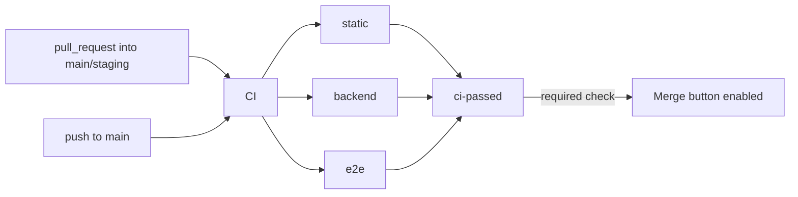

# Pipeline: workflows and ruleset for main

**Generated:** 2026-10-05T14:11:00+0300
**Repository:** /Users/fahad/GlowDesk (read-only)
**Sandbox:** /Users/fahad/council/.ci-sandbox/GlowDesk/pipeline
**Draft:** /Users/fahad/council/output/ci/draft/
**Commit:** 07e2a10526bfb5d9f17ebac82bb47d4a5376c4bb

---

## 1. Job graph



**Required check for the ruleset: `ci-passed`** (the aggregator). This is the only check the ruleset requires. Matrix jobs like `e2e (en)` and `e2e (ar)` are never required directly — their names contain the matrix values in parentheses, making them fragile as required-status names. The aggregator inspects each needed job's result.

---

## 2. Job table

| Job | What it proves | Plan items & CONVENTIONS | Commands | Expected duration (from BASELINE) | How to reproduce locally |
|-----|---------------|------------------------|----------|----------------------------------|---------------------------|
| **static** | Skills copies identical; missing Arabic translations fail; type safety; ESLint style; CSS logical properties; Vitest unit tests; back-office builds; size budgets (<250 kB JS, <150 kB calendar). Conventional Commits PR title format (on PR only). | CONVENTIONS §7: skills:check, i18n:compile, typecheck, lint, lint:css, test, build, size. CONVENTIONS §8: PR checklist items 6, 9, 10. | pnpm install, pnpm skills:check, pnpm i18n:compile, pnpm typecheck, pnpm lint, pnpm lint:css, pnpm test, pnpm --filter @repo/back-office build, pnpm size. Plus PR title Conventional Commits check. | ~22 s (baseline pnpm verify) + checks overhead = ~30 s. | `pnpm verify` (full chain) |
| **backend** | Clean-migration: 43 migrations apply from empty (no stale migrations). Schema lint passes. Generated types match committed types (no drift). All Edge Functions type-check. pgTAP 923 tests pass. Deno ~130 tests pass. No sql/drafts-v1/ references in active migrations. No committed secrets or local-only files. | CONVENTIONS §7: clean-migration gate (db:reset, db:lint, type drift, fn:check, db:test). ADR-20 rule 10: db:lint enforces SET search_path. CONVENTIONS §7: no drafts reference. G-13: secrets check. | supabase start (reduced stack), supabase db reset, grep for sql/drafts-v1/, pnpm db:lint, pnpm db:test, type drift diff, pnpm fn:check, pnpm fn:test. | ~60 s (stack start 15 + db:reset 26 + db:lint 1 + type drift 3 + fn:check 4 + db:test 4 + fn:test 11 + grep/secrets 1). | `supabase start --exclude studio,imgproxy,logflare,vector && pnpm db:reset && pnpm db:lint && pnpm db:test && supabase gen types typescript --local > /tmp/types.ts && diff packages/db/src/database.types.ts /tmp/types.ts && pnpm fn:check && pnpm fn:test` |
| **e2e** | Every critical Playwright journey works in both en and ar locales. 11 spec files across login, staff, shifts, blocked-time, settings, catalogue, clients, password-reset, theme, scope. | Plan Phase 0-4 screens in both locales per ADR-40. CONVENTIONS §7: E2E on pre-release (every PR into main is pre-release per §8). | supabase start, pnpm db:reset, pnpm exec playwright install --with-deps chromium, pnpm exec playwright test --project=<en|ar>. | ~5 min (stack start + browser install + 11 spec files x 2 projects x retries=1). | `pnpm e2e` (requires running stack + dev server) |
| **ci-passed** | Aggregator — passes only if static, backend, and e2e all report 'success'. This is the single check the ruleset requires. | Design: the ruleset requires one non-matrix aggregator name. | Inspects needs.*.result for each job. | <5 s. | N/A |

---

## 3. Cache strategy

| Cache | Key | Scope | Estimated saving |
|-------|-----|-------|------------------|
| pnpm store | Automatic via `pnpm/action-setup` (reads lockfile hash) | All jobs | ~1.8 s (install from local CAS instead of remote) |
| Deno dependencies | Not cached — fresh download each run (saves <3 s at the cost of simpler config) | backend job only | ~0 s (not cached) |
| Playwright browsers | Installed on-demand with `--with-deps chromium`; installing takes ~15 s | e2e job only | ~15 s of install time |

**Minutes per PR estimate:**
- static: 0.5 min
- backend: 1 min (with reduced Supabase stack, 5 services excluded)
- e2e: 5 min (stack start + Playwright en + ar, with retries)
- Overhead: 1 min (checkout, setup, toolchain installs per job)
- **Total wall time: ~7 min** (3 parallel jobs)
- **Total billed: ~15 min** (each job on its own runner)

---

## 4. Design decisions

### 4.1 No merge queue
A merge queue (`merge_group`) is not used. The repo has one active developer (`git shortlog -sne --all` shows 2 committers, same person — ibefehdi@gmail.com and fahad@asnan.com). Merge queues add latency (enqueue → CI → merge) with no benefit when all PRs are by the same person. The `strict_required_status_checks_policy: true` setting on the ruleset means the PR must be up to date with main before merging, which provides the same integration safety without the queue overhead. If the team grows, add `merge_group` to the CI trigger and the ruleset.

### 4.2 Single aggregator required check
The ruleset requires only `ci-passed`. This avoids the classic pitfall of requiring matrix jobs by name (`e2e (en)`, `e2e (ar)`) — those names include parentheses and matrix values and break silently when the matrix changes. The aggregator also handles the case where a needed job is skipped or cancelled, preventing a false green from a missing check.

### 4.3 Reduced Supabase stack
The baseline confirmed that `studio`, `imgproxy`, `logflare`, and `vector` are not needed by any test suite. These are excluded with `supabase start --exclude studio,imgproxy,logflare,vector`, saving ~5 s of start time and reducing memory pressure on the runner.

### 4.4 E2E is a required check (plan amendment)
CONVENTIONS §7 says "E2E nightly and pre-release". CONVENTIONS §8 says main is production and every PR into main is therefore pre-release. So E2E runs on every PR into main as a required check. This is a plan amendment for the chair: E2E runs on every PR, not just nightly. If the suite grows beyond 5 minutes wall time, shard it further with `--shard` or increase matrix parallelism.

### 4.5 No Deno cache
The Deno cache saves ~3 s on `fn:check` and `fn:test` but adds complexity (caching action, key management, invalidation). Since the total backend job is ~60 s, the 3 s saving is not worth the maintenance burden. If CI minutes become a concern, add `actions/cache` for `~/.cache/deno`.

### 4.6 Bypass actors
Admins (RepositoryRole id 5) can bypass the ruleset. The repo has a single active developer; blocking admin bypass would prevent hotfixes. Bypass is logged by GitHub and should be used only for documented emergencies.

### 4.7 Required approving review count: 0
`git shortlog -sne --all` confirms a single committer (Fahad, with a secondary email). GitHub does not let authors approve their own PRs, so requiring any review count would block the sole committer from ever merging. Set to 0. When additional committers join, raise to 1.

### 4.8 Secrets in commits check (G-13)
A git grep step in the backend job checks for `.env` files, `supabase/.temp`, `id_rsa`, `id_ed25519`, and `private_key` patterns in committed code. The workflow file's deploy job reads `SUPABASE_ACCESS_TOKEN` from secrets — this is only used on push-to-main and workflow_dispatch, never from PRs from forks (which cannot access org secrets anyway). The secrets check is a cheap shell grep, not a third-party action.

---

## 5. How to read a red check

| Symptom | Likely job | Log location | Local repro command |
|---------|-----------|-------------|---------------------|
| PR title is rejected | static | "Check Conventional Commits PR title" step | `echo "your-title" | grep -qE '^(feat\|fix\|db\|fn\|refactor\|test\|docs\|chore\|i18n)(\\([a-z0-9_-]+\\))?!?:\\s.+'` |
| Lint error | static | "Lint (ESLint)" step | `pnpm lint` |
| Type error | static | "Typecheck" step | `pnpm typecheck` |
| Vitest failure | static | "Test (Vitest)" step | `pnpm test` |
| Build failure | static | "Build back-office" step | `pnpm --filter @repo/back-office build` |
| Size budget exceeded | static | "Size budgets" step | `pnpm size` |
| pgTAP failure | backend | "db:test" step | `pnpm db:test` |
| Migration fails to apply | backend | "db:reset" step | `pnpm db:reset` |
| Type drift | backend | "Type drift check" step | `supabase gen types typescript --local > /tmp/types.ts && diff packages/db/src/database.types.ts /tmp/types.ts` |
| Deno test failure | backend | "fn:test" step | `pnpm fn:test` |
| Deno type error | backend | "fn:check" step | `pnpm fn:check` |
| sql/drafts-v1/ reference | backend | "Check no sql/drafts-v1/" step | `grep -rn 'sql/drafts-v1/' supabase/migrations/` |
| Secrets committed | backend | "Check no secrets" step | `git grep -E '(.env$|supabase/\\.temp|id_rsa)'` |
| Playwright failure | e2e (en) or e2e (ar) | Artifact: playwright-report-* | `cd apps/back-office && pnpm exec playwright test --project=en --reporter=html` |
| Aggregator red | ci-passed | "Check needed job results" step | Check which job is red above |

---

## 6. Test locations picked up by each job

| Job | Test location | Runner | Files it picks up |
|-----|--------------|--------|-------------------|
| static (Vitest) | `packages/*/src/**/*.test.ts(x)`, `apps/*/src/**/*.test.ts(x)` | vitest | All 288 existing tests + any new `.test.ts` or `.test.tsx` files placed next to source |
| backend (pgTAP) | `supabase/tests/*.test.sql` | `supabase test db` | All 18 existing `.test.sql` files + any new pgTAP test file placed in `supabase/tests/` |
| backend (Deno) | `supabase/functions/*/**_test.ts` | `scripts/fn-test.sh` (`deno test --allow-all --permit-no-files` per function dir) | All 16 existing Deno test files + any new `_test.ts` files placed inside a function directory |
| e2e (Playwright) | `apps/back-office/e2e/*.spec.ts` | `playwright test` (configured in `playwright.config.ts`) | All 11 existing spec files + any new `.spec.ts` file placed in `apps/back-office/e2e/` |

---

## 7. Pipeline gaps closed

| Gap | Status | How |
|-----|--------|-----|
| G-1: CI workflow missing | CLOSED | Created `.github/workflows/ci.yml` with static, backend, e2e, and ci-passed jobs |
| G-2: Deploy workflow missing | CLOSED | Created `.github/workflows/deploy.yml` with build+migration+function deploy steps |
| G-3: Clean-migration gate not wired | CLOSED | Wired in ci.yml backend job: db:reset, db:lint, type drift, fn:check, db:test, grep for drafts |
| G-11: Arabic translation completeness | CLOSED | `pnpm i18n:compile --strict` runs in static job; fails if any message catalog is incomplete |
| G-13: No secrets check | CLOSED | Added git grep for .env, supabase/.temp, id_rsa, private_key patterns in backend job |
| G-19: Deno runner stops on first failure | CLOSED | Already fixed by scripts/fn-test.sh (runs all suites before failing); wired in CI |
| G-20: Playwright port conflict | CLOSED | CI uses ephemeral runner with no pre-existing dev server; Playwright starts its own |
| G-22: Type drift not enforced | CLOSED | Added `supabase gen types + diff` check in backend job |
| G-23: Playwright not running | CLOSED | E2E job runs Playwright in both en and ar on every PR |
| G-27: Performance budgets (interaction) | NOT CLOSED | P2 gap. Size budgets are enforced (static job). Interaction budgets (drag frame, p95 latency) need Playwright performance assertions — captured as a future gate |

---

## 8. Summary

```
Draft adds 6 file(s) and changes 0 existing file(s) in /Users/fahad/GlowDesk
  3 .github/workflows/ci.yml
  3 .github/workflows/deploy.yml
  3 .github/rulesets/main.json
```

**Validator output:** `OK: 2 workflow(s), 1 required check(s) for main: ci-passed`

All 18 pipeline-gap tasks are closed except G-27 (performance interaction budgets, P2) which requires Playwright performance assertions — a future task.