# Fresha Partner Dashboard — Feature Link Map

Generated: 2026-10-04
Account: Test Salon (pid=3110536, location_id=3216614)
App version: 2.8.11390

---

## 1. Core Entities and Which Pages Touch Them

### Appointments
The central scheduling entity. Created/edited on the Calendar, consumed everywhere.
- **Calendar** (/calendar) — create, view, edit, cancel, reschedule, check in/out
- **Dashboard** (/dashboard) — "Appointments activity" chart, "Today's next appointments"
- **Sales → Appointments** (/sales/appointments-list) — list/filter all appointments
- **Sales → Daily sales summary** (/sales/daily-sales) — revenue from appointments
- **Sales → Register** (/sales/register) — POS checkout creates appointments
- **Reports** (/reports) — appointment-based reports
- **Marketing → Automations** (/marketing/automated-messages) — triggers on appointment events
- **Marketing → Messages history** (/marketing/notifications) — appointment confirmations/reminders
- **Clients → Clients list** (/clients/list) — each client shows their appointment history
- **Team → Scheduled shifts** (/team/scheduled-shifts) — team availability constrains appointments

### Clients
- **Clients → Clients list** (/clients/list) — CRUD, import, filter, 3 clients present
- **Clients → Client segments** (/clients/segments) — dynamic groups based on filters
- **Clients → Client loyalty** (/clients/loyalty) — loyalty programs
- **Clients → Online reputation** (/clients/online-reputation) — reviews from clients
- **Calendar** — clients attached to appointments; quick-create from appointment form
- **Sales → Register** — walk-in client creation during POS
- **Marketing → Blast campaigns** (/marketing/blast-campaigns/home) — target clients
- **Marketing → Deals** (/marketing/deals) — deals offered to clients
- **Marketing → Reviews** — cross-link to /clients/online-reputation?tab=all
- **Dashboard** — "Top team member" table may reference client count
- **Fresha Connect** (/connect) — two-way chat with clients

### Services (Service Menu)
- **Catalog → Service menu** (/catalogue/services) — CRUD services, pricing, duration
- **Calendar** — services selected when booking appointments
- **Sales → Daily sales summary** — revenue by service
- **Reports → Top services** — on dashboard
- **Online presence → Marketplace profile** — services listed on Fresha marketplace
- **Online presence → Smart Website** — services shown on website

### Products (Retail)
- **Catalog → Products** (/catalogue/products) — CRUD products
- **Catalog → Stocktakes** (/catalogue/stocktakes) — inventory counts
- **Catalog → Stock orders** (/catalogue/orders) — purchase orders
- **Catalog → Suppliers** (/catalogue/suppliers) — supplier management
- **Sales → Register** — sell products at POS
- **Sales → Sales** (/sales/sales-list) — product sales history

### Packages
- **Catalog → Packages** (/catalogue/packages) — bundled services/products
- **Sales → Packages sold** (/sales/packages-sold) — package sales history

### Payments
- **Sales → Payments** (/sales/payment-transactions) — payment list
- **Sales → Register** — take payments
- **Sales → Daily sales summary** — payment totals
- **Sales → Gift cards sold** (/sales/gift-cards) — gift card payments
- **Sales → Memberships sold** (/sales/paid-plans) — membership payments
- Shared API: `/api/wallet/wallets-summary`, `/api/wallet/finance-accounts-summary`

### Team Members
- **Team → Team members** (/team/team-members) — CRUD, 1 member (Fahad Asad)
- **Team → Scheduled shifts** (/team/scheduled-shifts) — shift planning
- **Team → Timesheets** (/team/timesheets) — time tracking
- **Team → Pay runs** (/team/payrun/overview) — payroll
- **Calendar** — team members are resources assigned to appointments
- **Dashboard** — "Top team member" widget
- **Reports** — team performance reports

### Marketing Campaigns
- **Marketing → Blast campaigns** (/marketing/blast-campaigns/home) — email/SMS campaigns
- **Marketing → Automations** (/marketing/automated-messages) — triggered messages
- **Marketing → Messages history** (/marketing/notifications) — sent message log
- **Marketing → Deals** (/marketing/deals) — promotional deals
- **Marketing → Smart pricing** (/marketing/peak-pricing) — dynamic pricing

### Locations / Online Presence
- **Online presence → Marketplace profile** (/fresha/online-booking/locations)
- **Online presence → Reserve with Google** (/fresha/online-booking/google-reserve)
- **Online presence → Facebook and Instagram bookings** (/fresha/online-booking/facebook-setup)
- **Online presence → Link builder** (/fresha/online-booking/buttons-and-links)
- **Online presence → Smart Website** (/fresha/online-booking/smart-website)
- **Settings** (/setup) — workspace settings, online presence tab

---

## 2. Edge Table

| From feature | To feature | Link type | Evidence |
|---|---|---|---|
| Calendar | Dashboard | navigates-to | Sidebar link /dashboard; dashboard shows "Appointments activity" |
| Calendar | Sales → Appointments | creates-data-for | Appointments created on calendar appear in /sales/appointments-list |
| Calendar | Sales → Daily sales summary | creates-data-for | Appointment revenue summarized on daily-sales |
| Calendar | Team members | shares-entity | Calendar resources = team members; Fahad Asad shown on calendar |
| Calendar | Clients | shares-entity | Appointments have client attached (John Doe, Jack Doe, Jane Doe) |
| Calendar | Catalog → Service menu | shares-entity | Appointments reference services (Haircut, Blow Dry, Hair Color) |
| Dashboard | Calendar | navigates-to | Sidebar link /calendar; "Today's next appointments" cards are clickable |
| Dashboard | Reports | navigates-to | Sidebar link /reports; "Top services" and "Top team member" tables |
| Sales → Register | Calendar | creates-data-for | POS checkout creates appointments visible on calendar (UNVERIFIED) |
| Sales → Register | Sales → Payments | creates-data-for | POS payments appear in /sales/payment-transactions (UNVERIFIED) |
| Sales → Register | Sales → Daily sales summary | creates-data-for | POS sales feed into daily summary (UNVERIFIED) |
| Clients → Clients list | Calendar | navigates-to | Each client has an appointment history; click-through to calendar (UNVERIFIED) |
| Clients → Clients list | Sales → Sales | shares-entity | Client purchase history visible in sales (UNVERIFIED) |
| Clients → Client loyalty | Clients → Clients list | depends-on | Loyalty programs gated on having clients (UNVERIFIED) |
| Marketing → Blast campaigns | Clients | filters/scopes | Campaigns target all clients, segments, or individuals (observed on /marketing/blast-campaigns/home) |
| Marketing → Reviews | Clients → Online reputation | navigates-to | Cross-link: /clients/online-reputation?tab=all from Marketing menu |
| Marketing → Automations | Calendar | depends-on | Automated messages trigger on appointment events (UNVERIFIED) |
| Marketing → Automations | Clients | shares-entity | Messages sent to clients |
| Catalog → Products | Catalog → Stocktakes | shares-entity | Stocktakes count product inventory (UNVERIFIED) |
| Catalog → Products | Catalog → Stock orders | shares-entity | Orders restock products (UNVERIFIED) |
| Catalog → Stock orders | Catalog → Suppliers | shares-entity | Orders placed with suppliers (UNVERIFIED) |
| Team → Team members | Calendar | filters/scopes | Calendar filters by team member (ref=e110 "Scheduled team") |
| Team → Team members | Team → Scheduled shifts | depends-on | Shifts assigned to team members (UNVERIFIED) |
| Team → Scheduled shifts | Team → Timesheets | depends-on | Timesheets derived from shifts (UNVERIFIED) |
| Team → Timesheets | Team → Pay runs | creates-data-for | Timesheet data feeds payroll (UNVERIFIED) |
| Reports | All sections | shares-api | Reports aggregate data across all entities (UNVERIFIED) |
| Settings (/setup) | Online presence | navigates-to | "Online presence" tab in settings |
| Settings | Marketing | navigates-to | "Marketing" tab in settings |
| Fresha Connect (/connect) | Clients | shares-entity | Two-way messaging with clients via inbox |
| Fresha Connect | Calendar | shares-entity | Messaging context includes appointment info (UNVERIFIED) |
| All pages | Wallet | shares-api | `/api/wallet/wallets-summary` called on calendar, dashboard, reports, clients |
| All pages | Finance accounts | shares-api | `/api/wallet/finance-accounts-summary` called globally |
| All pages | Credits campaign | shares-api | `/api/credits/credits-campaign` called globally |
| Top bar Search | All pages | navigates-to | Global search across entities (UNVERIFIED) |
| Top bar Performance insights | Reports | navigates-to | Performance data (UNVERIFIED) |
| Top bar Notifications | Marketing → Messages history | navigates-to | Notification history (UNVERIFIED) |
| Top bar "Continue setup" | Settings | navigates-to | Setup wizard (UNVERIFIED) |

---

## 3. Feature Graph (Mermaid)

```mermaid
flowchart TD
    subgraph TopBar["Top Bar (global)"]
        Logo["Fresha Logo → /calendar"]
        Search["Search"]
        PerfInsights["Performance Insights"]
        Notifs["Notifications (4)"]
        Connect["Fresha Connect → Inbox"]
        UserMenu["User Menu (FA)"]
    end

    subgraph Sidebar["Sidebar Sections"]
        Home["Home / Dashboard"]
        Calendar["Calendar"]
        Sales["Sales"]
        Clients["Clients"]
        Catalog["Catalog"]
        OnlinePres["Online Presence"]
        Marketing["Marketing"]
        Team["Team"]
        Reports["Reports"]
        AddOns["Add-ons"]
        Settings["Settings"]
        Help["Help & Support"]
    end

    subgraph SalesSub["Sales Sub-pages"]
        DailySales["Daily Sales Summary"]
        Register["Register (POS)"]
        ApptList["Appointments List"]
        SalesList["Sales List"]
        Payments["Payment Transactions"]
        GiftCards["Gift Cards Sold"]
        PackagesSold["Packages Sold"]
        Memberships["Memberships Sold"]
    end

    subgraph ClientsSub["Clients Sub-pages"]
        ClientList["Clients List"]
        Segments["Client Segments"]
        Loyalty["Client Loyalty"]
        OnlineRep["Online Reputation"]
    end

    subgraph CatalogSub["Catalog Sub-pages"]
        ServiceMenu["Service Menu"]
        Packages["Packages"]
        Products["Products"]
        Stocktakes["Stocktakes"]
        StockOrders["Stock Orders"]
        Suppliers["Suppliers"]
    end

    subgraph OnlinePresSub["Online Presence Sub-pages"]
        Marketplace["Marketplace Profile"]
        GoogleReserve["Reserve with Google"]
        FBInsta["Facebook & Instagram"]
        LinkBuilder["Link Builder"]
        SmartWebsite["Smart Website"]
    end

    subgraph MarketingSub["Marketing Sub-pages"]
        Blast["Blast Campaigns"]
        Automations["Automations"]
        MsgHistory["Messages History"]
        Deals["Deals"]
        SmartPricing["Smart Pricing"]
        Reviews["Reviews → Clients"]
    end

    subgraph TeamSub["Team Sub-pages"]
        TeamMembers["Team Members"]
        Shifts["Scheduled Shifts"]
        Timesheets["Timesheets"]
        PayRuns["Pay Runs"]
    end

    Sales --> SalesSub
    Clients --> ClientsSub
    Catalog --> CatalogSub
    OnlinePres --> OnlinePresSub
    Marketing --> MarketingSub
    Team --> TeamSub

    %% Core entity relationships
    Calendar -- "Appointments" --> ClientList
    Calendar -- "Appointments" --> ServiceMenu
    Calendar -- "Appointments" --> TeamMembers
    Calendar -- "creates revenue" --> DailySales
    Calendar -- "creates revenue" --> SalesList

    Register -- "POS sales" --> DailySales
    Register -- "POS sales" --> Payments
    Register -- "walk-in clients" --> ClientList

    ClientList -- "targets" --> Blast
    ClientList -- "reviews" --> OnlineRep
    ClientList -- "loyalty" --> Loyalty

    ServiceMenu -- "listed on" --> Marketplace
    ServiceMenu -- "listed on" --> SmartWebsite

    TeamMembers -- "resources on" --> Calendar
    Shifts -- "constrains" --> Calendar
    Timesheets -- "feeds" --> PayRuns

    Products -- "counted in" --> Stocktakes
    Products -- "ordered via" --> StockOrders
    StockOrders -- "from" --> Suppliers

    Dashboard -- "shows" --> Calendar
    Dashboard -- "shows" --> DailySales

    Reports -- "aggregates" --> Calendar
    Reports -- "aggregates" --> SalesList
    Reports -- "aggregates" --> TeamMembers
    Reports -- "aggregates" --> ClientList

    Reviews -. "cross-linked" .-> OnlineRep
```

---

## 4. Top User Journeys

### Journey 1: Book and serve a client
1. Client calls/messages → open Calendar (/calendar)
2. Click "Add" button → create appointment form appears
3. Select existing client or create new → Client entity linked
4. Select service from Service Menu → Service entity linked
5. Select team member → Team Member entity linked
6. Choose time slot → Appointment created on calendar
7. Client arrives → check-in on calendar
8. Service performed → mark complete on calendar
9. Take payment → navigate to Register (/sales/register) or process via calendar
10. Payment recorded → appears in Sales → Payments and Daily Sales Summary

### Journey 2: Run a marketing campaign
1. Navigate to Marketing → Blast campaigns (/marketing/blast-campaigns/home)
2. Click "Start now" → campaign builder
3. Choose target: all clients, client segment, or individual → Client entity
4. Customize message content (email/SMS)
5. Send campaign → messages delivered
6. Track results in real-time reporting
7. View sent messages in Marketing → Messages history
8. Check Reviews in Marketing → Reviews (or Clients → Online reputation)

### Journey 3: Manage inventory
1. Navigate to Catalog → Products (/catalogue/products)
2. Add/edit products with pricing
3. When stock runs low → Catalog → Stock orders (/catalogue/orders)
4. Create purchase order from supplier (Catalog → Suppliers)
5. Receive stock → update inventory
6. Perform stocktake → Catalog → Stocktakes (/catalogue/stocktakes)
7. Sell products at POS → Sales → Register
8. Track product sales → Sales → Sales list (/sales/sales-list)

### Journey 4: Team management and payroll
1. Navigate to Team → Team members (/team/team-members)
2. Add team member → appears as resource on Calendar
3. Set up shifts → Team → Scheduled shifts
4. Team members assigned to appointments via Calendar
5. Track time → Team → Timesheets
6. Run payroll → Team → Pay runs (/team/payrun/overview)

### Journey 5: Review business performance
1. Open Dashboard (/dashboard) → see Appointments activity, Today's appointments, Top services, Top team member
2. Navigate to Sales → Daily sales summary → revenue overview
3. Navigate to Reports (/reports) → detailed reports by category
4. Check Performance insights (top bar) → deeper analytics
5. Review online reputation → Clients → Online reputation

### Journey 6: Set up online presence
1. Navigate to Online presence → Marketplace profile
2. Configure Fresha marketplace listing (services from Catalog)
3. Set up Reserve with Google
4. Connect Facebook and Instagram bookings
5. Build booking links → Link builder
6. Set up Smart Website
7. Verify via Settings → Online presence tab

---

## 5. Surprising Findings

### Dead Ends / Orphan Pages
- **/services, /inventory, /products, /online-booking, /payments, /messages** — all redirect to `/not-found`. These are the old URL paths; the actual pages live under:
  - `/catalogue/services` (not `/services`)
  - `/catalogue/products` (not `/products`)
  - `/fresha/online-booking/*` (not `/online-booking`)
  - `/sales/payment-transactions` (not `/payments`)
  - Messaging is via Fresha Connect modal, not `/messages`

### Duplicated Features / Cross-links
- **Reviews** appears in BOTH Marketing sub-menu AND Clients sub-menu (as "Online reputation"). The Marketing "Reviews" link navigates to `/clients/online-reputation?tab=all` — a cross-section link.
- **Online presence** settings appear in BOTH the Online presence sidebar section AND the Settings → Online presence tab

### Navigation Observations
- The sidebar is collapsible and uses icon-only mode for top-level sections
- Section labels are ONLY visible in `arialabel` attributes on the `<button>` elements — not text content
- Sub-navigation only appears when a section button is clicked (expandable accordion)
- The Fresha logo always navigates to `/calendar`, not `/dashboard`
- "Continue setup" button persists in the top bar suggesting incomplete account configuration

### Data Observations
- Account has 3 clients, 1 team member (Fahad Asad), 1 location (3216614)
- Calendar shows 3 appointments for Oct 4: John Doe (Haircut 9:00-9:45), Jack Doe (Blow Dry 10:00-10:35), Jane Doe (Hair Color 11:00-12:15)
- Marketing → Blast campaigns shows an onboarding CTA ("Start now") rather than existing campaigns
- 4 unread notifications

### Broken/Unverified Links
- All UNVERIFIED edges in the edge table need testing with actual data creation (create a COUNCIL-TEST client and trace it through the system)
- `/api/` calls observed were only wallet/credits global calls; page-specific API calls (appointments, clients, services) were not captured due to page load timing