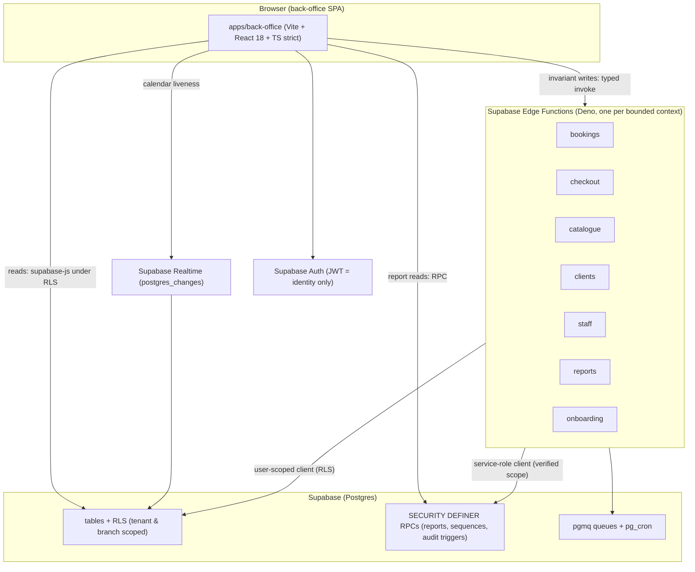

# Conventions: the GlowDesk design language in one place

This is the single reference for how we build the multi-tenant spa/salon SaaS. It follows `decisions.md` (ADRs are cited inline); where a member draft and this file disagree, this file and `decisions.md` win. The companion skills in `plan/skills/` carry the operational detail for each area; this document is the map.

**Visual design is not defined here.** Colours, typography, spacing, radii, shadows, and component look come from the owner's separate **Airbnb design skill**. `packages/ui` is the only layer allowed to import that skill's primitives and tokens (ADR-36). Everything below is architecture, structure, naming, data access, testing, and workflow.

## 1. Architecture overview



Three rules define the whole system:

1. **The database is the security boundary.** Tenant and branch isolation is enforced by Row Level Security and constraints, not by application code (ADR-20). Frontend route guards are UX only.
2. **The JWT carries identity, never authorization.** `auth.uid()` is the only trusted identity input; tenant, role, and branch scope are looked up live from `memberships` on every request (ADR-19).
3. **Functions are isolated per bounded context.** A failing or redeploying function never takes down another domain (ADR-27, NFR-2).

## 2. Repository layout

pnpm workspaces monorepo (ADR-36). Frontend and backend deploy from the same commit.

```
repo/
  apps/
    back-office/            # MVP staff/manager/owner SPA (Vite + React 18)
    booking/                # Phase 2 client-facing booking app (scaffold only in MVP)
  packages/
    ui/                     # wraps the Airbnb design skill; only layer touching tokens
    db/                     # generated database.types.ts + createTypedClient
    api/                    # typed Edge Function invoke wrappers + ApiError + useRealtime
    validation/             # Zod schemas shared with Edge Functions (Deno-compatible)
    i18n/                   # Lingui catalogs (en, ar) + useFormat + search normalization
    core/                   # pure domain logic: time math, price math, booking rules (no React)
  supabase/
    migrations/             # SQL migration files (Supabase CLI)
    functions/
      _shared/              # auth, errors, logging, cors, idempotency, server wrapper
      bookings/ checkout/ catalogue/ clients/ staff/ reports/ onboarding/
    tests/                  # pgTAP RLS tests + fixtures
    seed.sql                # local dev seed (SpaCorner demo tenant)
    config.toml
  .github/workflows/        # ci.yml, deploy.yml
```

Import boundaries (enforced by `eslint-plugin-boundaries`; cycles fail lint):

- Apps import from `@repo/{ui,api,db,i18n,validation,core}` and from a feature's `index.ts` only, never a feature's internals.
- `packages/api` and `packages/core` may import `packages/validation`. `packages/validation` imports nothing internal and stays pure JS so Deno can import it unchanged (ADR-32, ADR-39).
- Edge Functions import `_shared/` by relative path and `packages/validation` via a Deno-compatible export; they never import from `apps/` or other `packages/` (ADR-32).

## 3. Naming

### 3.1 Domain vocabulary
The `spa-domain-glossary` skill is the naming authority (ADR-15). Never invent synonyms. Banned in code: `location` (use `branch`), `employee`/`team_member` (use `staff_member`), `customer` (use `client`), `booking` as a noun for the stored record (use `appointment`; `booking` names the act/flow only).

### 3.2 Database
- Tables: plural `snake_case` (`clients`, `appointment_items`, `service_branch_overrides`). Junction tables: `{a}_{b}` (`staff_branch_assignments`, `service_staff`).
- Columns: `snake_case`, no table prefix (`name_en`, not `service_name_en`), except the FK-id and money conventions below.
- Primary keys: `id uuid PRIMARY KEY DEFAULT gen_random_uuid()` (ADR-44).
- Foreign keys: `{entity}_id uuid REFERENCES {entities}(id)`. Denormalized parents expose `UNIQUE (id, tenant_id)`; children reference the pair to keep tenant consistency (ADR-20 rule 5).
- Tenant key: `tenant_id uuid NOT NULL REFERENCES tenants(id)` on every tenant-scoped table.
- Branch key: `branch_id uuid` on branch-scoped tables; sentinel `00000000-0000-0000-0000-000000000000` means "all branches"/"tenant-wide" (never NULL in a unique constraint — ADR-20 rule 6).
- Money: `bigint` counting minor units, column name ends `_minor` (`total_minor`, `amount_minor`, `price_minor`). Never `float`/`numeric` (ADR-17).
- Timestamps: `created_at`/`updated_at` `timestamptz NOT NULL DEFAULT now()`; audit `created_by`/`updated_by uuid REFERENCES auth.users(id)`.
- Bilingual text: `name_en` + `name_ar` for operator-facing entities; people use `*_en`/`*_ar` or `*`/`*_alt` (ADR-16).
- Enums: fixed `CHECK` constraints listing the canonical values (appointment status uses `in_progress`, ADR-7). No status strings outside the enum.
- Migration files: `supabase migration new <snake_case_description>` → `<YYYYMMDDHHMMSS>_<description>.sql`. One logical change group per file. Never edit an applied migration. Seed data only in `supabase/seed.sql`.

### 3.3 Edge Functions
- Function slug = bounded-context name, `kebab-case` if ever multi-word (`bookings`, `checkout`, `onboarding`). Folder name equals slug.
- Internal actions are `kebab-case` path segments: `POST /functions/v1/bookings/reschedule` (ADR-30).
- Shared modules in `_shared/` are `kebab-case.ts` (`errors.ts`, `idempotency.ts`).
- Secrets: `PROVIDER_API_KEY`, `PROVIDER_WEBHOOK_SECRET`, grouped `PROVIDER_*`; bundle related config as one JSON secret when it exceeds a handful of values.

### 3.4 TypeScript
- Types/interfaces: `PascalCase` (`StaffMember`, `AppointmentItem`). Row types derive from generated `Database['public']['Tables'][...]`.
- Variables/functions: `camelCase`. Constants: `UPPER_SNAKE`. React components: `PascalCase`, one per file, filename matches component.
- Hooks: `useX` in `useX.ts`. Zod schemas: `xSchema` (`bookingCreateSchema`). DTO types: `z.infer<typeof xSchema>`.
- Money and duration values are integers (minor units / minutes) in types, state, and cache; formatting happens only at render (ADR-40). `any` fails lint (`@typescript-eslint/no-explicit-any: error`); `strict`, `noUncheckedIndexedAccess`, `exactOptionalPropertyTypes` in packages.
- Files: components `PascalCase.tsx`; everything else `kebab-case.ts`. Features colocate `routes/ components/ queries.ts mutations.ts mappers.ts validation.ts index.ts`.

### 3.5 i18n keys
Lingui auto-generates ids from source text; add an explicit `id` only when a stable programmatic reference is needed (ADR-40). Keys use dotted namespaces matching the feature (`booking.conflict.title`). Never concatenate translated fragments; always pass full sentences with ICU interpolation so translators can reorder.

## 4. API and error conventions

### 4.1 The envelope (ADR-29)
Every Edge Function response uses one versioned envelope:
- success: `{ "ok": true, "data": ... }`
- failure: `{ "ok": false, "error": { "code", "message", "fieldErrors"?, "details"? } }`

`message` is an English developer string; user-facing copy is keyed off `code` (+ `details.reason`) on the frontend and translated there. `fieldErrors` maps field name → message key for forms.

### 4.2 Error code catalogue (one list, defined in `packages/validation`, mirrored in `_shared/errors.ts`)

| Code | HTTP | Meaning |
|---|---|---|
| `VALIDATION` | 400 | Input failed a Zod schema; `fieldErrors` populated |
| `UNAUTHENTICATED` | 401 | Missing/invalid/expired session |
| `FORBIDDEN` | 403 | Authenticated but not allowed (role/branch/tenant scope) |
| `NOT_FOUND` | 404 | Entity does not exist or is out of scope |
| `CONFLICT` | 409 | Double-booking, duplicate, or idempotency `processing` collision |
| `IDEMPOTENCY_MISMATCH` | 422 | Same idempotency key, different payload |
| `RATE_LIMITED` | 429 | Too many requests; `Retry-After` set |
| `INTERNAL` | 500 | Unhandled error (reported to Sentry) |
| `UNAVAILABLE` | 503 | Downstream/DB unavailable |

`NETWORK` is client-side only (the fetch itself failed) and is not returned by a function. The frontend `ApiError` maps on this catalogue: toast for transient (`INTERNAL`, `UNAVAILABLE`, `RATE_LIMITED`, `NETWORK`), redirect for `UNAUTHENTICATED`, inline field errors for `VALIDATION`, explanatory toast for `CONFLICT`.

### 4.3 Request conventions
- Invariant-bearing writes call typed wrappers in `packages/api` (`bookingApi.create`, `checkoutApi.createSale`); the function slug/path never appears in feature code (ADR-30).
- Money-moving mutations send an `Idempotency-Key` header (client-generated UUID), threaded by `packages/api` per attempt (ADR-31).
- The active tenant and branch travel as verified context, never as trusted authorization; the server re-derives scope from `memberships` (ADR-19, ADR-37).
- Breaking changes to a function's API use a versioned path (`/bookings/v2/create`) deployed alongside `v1`; frontend and backend change in the same PR (ADR-30).

## 5. Tenancy rules

- Tenant = company; branch = physical location. A tenant has many branches; a branch belongs to exactly one tenant.
- `memberships(user_id, tenant_id, role, branch_id, is_active)` is the authorization source. `branch_id = sentinel` means all branches; a specific branch scopes the role to it. A user may hold different roles at different branches; the union of capabilities applies, scoped per branch (requirements §3 matrix).
- Roles: `tenant_owner`, `branch_manager`, `receptionist`, `staff`. Platform admin is an ops path, never a standing data role; impersonation is explicit, time-boxed, audit-logged, and visible to the tenant owner (NFR-1).
- Isolation invariants (requirements §2.5), each with a pgTAP test:
  1. No query path returns another tenant's rows — enforced by RLS.
  2. Branch-scoped roles never read/write another branch's appointments, shifts, sales, payments, or financial reports, even by guessing IDs.
  3. Client records read tenant-wide; their financial aggregates respect the caller's branch scope (ADR-11).
  4. Archiving a branch never deletes its history (ADR-46).
- Clients are tenant-scoped and shared across branches; appointments and sales always record their branch (ADR-11).
- Staff are single tenant records with per-branch assignments; conflict checks span all branches (ADR-12, ADR-24).

## 6. Data access rules (what the frontend may do directly)

Default reads and simple writes go through supabase-js under RLS; invariant-bearing writes go through an Edge Function (ADR-28). The direct-write allowlist:

| Path | Allowed directly (supabase-js under RLS) | Must use Edge Function / RPC |
|---|---|---|
| Reads | Lists, details, calendar reads, own profile, report views (`security_invoker`), report RPCs | Heavy aggregation not expressible as a view/RPC |
| Writes | `profiles` (self), `client_notes`, `clients` (non-financial fields), `settings` (role-gated), `blocked_times` (own branch), `shifts` (manager-gated) | `appointments`, `appointment_items`, `booking_overrides`, `sales`, `sale_items`, `payments`, `register_sessions`, `invoice_counters`, `tips`, `memberships`, `tenants`, `branches`, `service_branch_overrides`/`services` when pricing changes, `audit_log` |

Rules of thumb:
- If a write touches money, a conflict/constraint, a cross-table transaction, a side effect (notification, external API), or a secret → Edge Function.
- If RLS + check constraints fully express the authorization on a single table and nothing else must stay consistent → direct write is fine.
- Direct writes still produce audit rows (triggers fire regardless of path — ADR-22).
- Adding a table to the direct-write allowlist requires a PR showing the RLS policies and constraints that make it safe.
- The service role is never used for per-user requests; privileged functions derive and verify scope live and scope every statement (ADR-20 rule 7).

## 7. Testing standards

- **RLS / tenancy (pgTAP)**: every policy tested per table, per operation (SELECT/INSERT/UPDATE/DELETE), per role, plus cross-tenant, cross-branch, and anon cases; Realtime channel authorization tested for tenant/branch leakage (ADR-20, ADR-38). Runs in CI on every migration.
- **Database integrity**: concurrency tests are acceptance tests for booking — two simultaneous bookings of the same staff/slot, booking into a blocked span, reschedule into an occupied slot must all fail closed (ADR-24). Money rounding and invoice-sequence races covered. Time-zone/DST and overnight-span conversion tests for the availability engine and report grouping (ADR-26, ADR-45).
- **Backend (Deno)**: `deno test --allow-all supabase/functions/`; per-handler tests against a local Supabase with seeded fixtures; envelope and error-code contract tests; idempotency replay tests.
- **Frontend (Vitest + Testing Library)**: `packages/core` (time/price/booking math) ≥ 95% coverage; feature logic (queries/mutations/mappers) ≥ 70%; no snapshot tests except design-skill wrappers.
- **E2E (Playwright)**: one suite per critical journey — login, create booking (drag + form), reschedule-drag with conflict rollback, cash checkout, refund/void, client CRUD, register open/close, branch switch, a report reconciliation. Critical journeys run in both `en`/LTR and `ar`/RTL (ADR-40). Missing Arabic translations fail CI.
- **Accessibility**: axe-core assertions on main flows; keyboard-complete calendar and checkout (WCAG 2.1 AA, NFR-13).
- **Performance budgets** (size-limit + interaction budgets in CI): back-office initial JS ≤ 250 kB gzip; calendar chunk ≤ 150 kB; drag frame ≤ 16 ms; day view of a busy branch ≤ 2 s p95; slot computation ≤ 300 ms p95; booking round-trip ≤ 1 s p95 (NFR-4).
- `pnpm verify` = typecheck + lint + unit + build; it must pass locally before a PR and runs in CI on the diff graph. E2E nightly and pre-release.

## 8. Git workflow

- **Branches**: `main` (production, protected), `staging` (preview branch, protected), short-lived feature branches `feat/<area>-<slug>`, fixes `fix/<slug>`, migrations `db/<slug>`. Supabase preview branches back `staging`.
- **Commits**: Conventional Commits — `type(scope): subject`, imperative, ≤ 72 chars. Types: `feat`, `fix`, `db`, `fn` (Edge Function), `refactor`, `test`, `docs`, `chore`, `i18n`. Scope is the bounded context or package (`bookings`, `checkout`, `clients`, `ui`, `api`). Example: `db(bookings): add exclusion constraint on appointment_items busy_range`.
- **PRs**: one PR per backlog task (small enough to review in one sitting). A PR that changes a function's API includes the frontend change (same monorepo). PR checklist below; reviewers enforce the allowlist (section 6), the naming authority (ADR-15), and money-as-integers (ADR-17).
- **PR checklist**:
  - [ ] Migration is new (not an edit of an applied one); `supabase db reset` passes locally.
  - [ ] RLS policies present and pgTAP tests added for every new/changed table and policy (tenant + branch + role + cross-scope + anon).
  - [ ] Money columns are `bigint _minor`; no floats; totals derived from lines.
  - [ ] Names match the glossary; no banned synonyms.
  - [ ] Bilingual columns and Arabic search normalization handled where operators see names.
  - [ ] Direct writes stay within the allowlist; anything money/conflict/cross-table goes through a function.
  - [ ] Shared Zod schema updated in `packages/validation` and imported (not duplicated) by the function.
  - [ ] Envelope + error codes used; `Idempotency-Key` on money mutations.
  - [ ] i18n: no hardcoded strings; `pnpm i18n:extract && pnpm i18n:compile` run; both locales pass.
  - [ ] `pnpm verify` green; tests added per section 7; a11y and RTL considered.
  - [ ] Audit trigger covers the mutation; NFR references noted where relevant.

## 9. Definition of done

A backlog task is done when:
1. Code is merged to `staging` behind its policies and passes `pnpm verify` plus the relevant pgTAP/Deno/Vitest suites.
2. Every new/changed table has RLS and a pgTAP test proving tenant and branch isolation and the role matrix; Realtime-affecting tables pass the channel-authorization test.
3. Money is integer minor units end to end; a report/receipt touching the change reconciles to the fils.
4. All user-facing strings are in both `en` and `ar` catalogs; the screen works in RTL with logical properties only; formatting uses the branch time zone.
5. Audit records are written for the mutation; NFRs the task touches (isolation, performance, accessibility) have a passing test.
6. The change deploys without affecting other functions (isolation, NFR-2); any `_shared` change redeploys all functions and is called out in the PR.
7. Documentation/skills updated if a convention changed; the glossary is updated before any new term is used.
8. Acceptance criteria from the user story are demonstrably met (Playwright journey or manual QA note attached), in both locales where user-facing.
