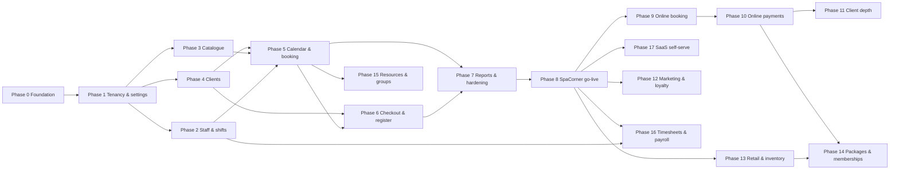
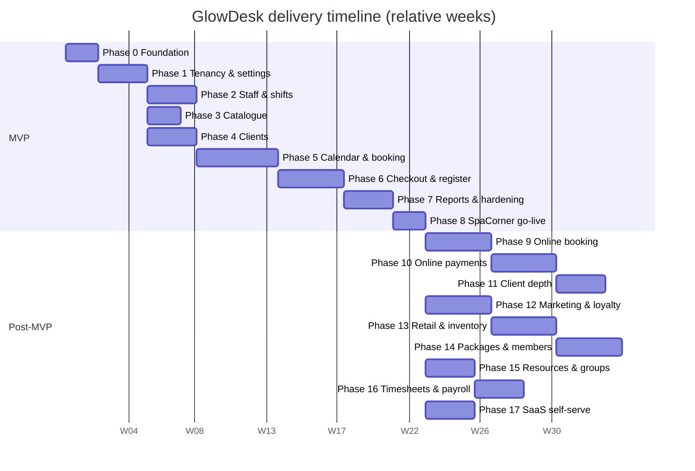

# Implementation plan: empty repository → SpaCorner live → sellable SaaS

This plan follows `decisions.md` (ADR references inline) and `CONVENTIONS.md`. It is phase-based: Phase 0 foundation, Phases 1–7 the MVP in dependency order, Phase 8 SpaCorner go-live, Phases 9+ post-MVP toward a sellable multi-tenant product.

**Team assumption for all estimates**: 3 engineers (2 full-stack, 1 frontend-leaning), a part-time QA engineer from Phase 5, the owner as product/design decision-maker, and the Airbnb design skill as the visual source. Estimates are in engineer-weeks (ew) at productive pace including code review and tests; add ~20% calendar buffer for meetings, onboarding, and unknowns. MVP total: **72 ew ≈ 24 calendar weeks (~6 months)** with this team. Post-MVP phases assume the same team unless noted.

## Phase overview

| Phase | Name | Size | Goal in one line |
|---|---|---|---|
| 0 | Foundation | 6 ew | Repo, environments, CI/CD, auth, tenancy+RLS skeleton, i18n/RTL baseline, design-skill integration, observability |
| 1 | Tenancy, onboarding & settings | 8 ew | Tenant/branch setup, roles, settings hub, audit backbone |
| 2 | Staff & shifts | 7 ew | Staff records, branch assignments, shift grid, blocked time |
| 3 | Service catalogue | 6 ew | Categories, services, branch overrides, staff eligibility |
| 4 | Clients | 7 ew | Client CRUD, notes/allergies/tags, search, duplicate warning, CSV import |
| 5 | Calendar & booking | 14 ew | Slot engine, conflict engine, booking lifecycle, calendar UI, realtime |
| 6 | Checkout, sales & register | 12 ew | POS checkout, discounts/tips, manual payments, refunds/void, register, receipts, invoice numbers |
| 7 | Reports, exports & hardening | 8 ew | Six reports, CSV exports, audit viewer, global search, performance, security test completion |
| 8 | SpaCorner go-live | 4 ew | Data migration, training, pilot, cutover, rollback readiness |
| 9 | Online booking & notifications | 12 ew | Public booking page, links/QR, reminders |
| 10 | Online payments & deposits | 10 ew | MyFatoorah integration, webhooks, deposits, fees |
| 11 | Client experience depth | 8 ew | Client portal, merge tool, repeating series, waitlist |
| 12 | Marketing & loyalty | 10 ew | Segments, campaigns, deals/promo codes, loyalty points |
| 13 | Retail & inventory | 10 ew | Products, stock, suppliers, stock takes/orders |
| 14 | Packages, gift cards, memberships | 10 ew | Prepaid products and recurring membership billing |
| 15 | Resources & group appointments | 6 ew | Rooms/equipment conflict dimension, group bookings |
| 16 | Timesheets & payroll | 8 ew | Clock in/out, pay runs, commissions |
| 17 | SaaS self-serve & billing | 8 ew | Self-serve tenant signup, subscription billing, multi-currency |

## Phase dependency diagram

MVP phases 2, 3, 4 are parallelizable after Phase 1 (different bounded contexts); with a 3-engineer team the calendar below overlaps them.

## Timeline (relative durations, weeks)

Note: post-MVP phases 12–17 assume sequencing by a team that has grown beyond 3 engineers; with the MVP team alone they serialize after Phase 11 in the listed order.

---

# MVP phases

## Phase 0: Foundation (6 ew)

**Goal**: everything every later phase stands on: repositories, environments, CI/CD, auth, the tenancy/RLS skeleton with its test harness, the i18n/RTL baseline, design-skill integration, and observability. No user-visible features except login.

**Scope**
- pnpm monorepo scaffold (ADR-36): `apps/back-office`, `apps/booking` (empty scaffold), six packages, `supabase/`.
- Supabase projects: `dev` (local via CLI), `staging`, `production`; preview branches wired (backend §6.2). Paid plan for production (wall-clock limits, ADR-27).
- CI/CD: `ci.yml` (typecheck Deno + TS, lint, `supabase db lint`, pgTAP via `supabase test db`, Deno tests, Vitest, build, size-limit, generated-types drift check) and `deploy.yml` (migrations then functions `--use-api`, frontend build/deploy from the same commit).
- Auth: Supabase email+password sign-in, session persistence, `onAuthStateChange`, password reset; login screen; route guards skeleton (UX only, ADR-42).
- Tenancy/RLS skeleton: migrations for `tenants, profiles, memberships, settings, currencies, audit_log, idempotency_keys`; helper functions `current_tenant_ids()`, `current_branch_scope()`, `has_tenant_role()` (ADR-19); the four-policy pattern + branch-scoped pattern (ADR-20); sentinel branch UUID convention; audit trigger machinery (ADR-22); pgTAP harness with role-switching fixtures (this is the security regression harness every later phase extends).
- Edge Function skeleton: `_shared/` (our own thin server wrapper per ADR-35, errors/envelope per ADR-29, logging, cors, idempotency per ADR-31), a `ping`-style health route in every future function's template, Sentry wiring, structured logs.
- i18n/RTL baseline: Lingui setup, `en`/`ar` catalogs, `I18nProvider` setting `dir`/`lang`, stylelint logical-properties rule, `useFormat()` with money (minor units + currency exponent) and branch-tz date helpers (ADR-40).
- Design-skill integration: `packages/ui` wrapping the Airbnb design skill primitives (Button, Field, Drawer, DataTable, AsyncBoundary, Toast); token import boundary enforced by lint.
- Observability: Sentry (frontend + Deno), external uptime monitor pinging `/health`, log-drain decision recorded.
- **schedule-x spike (ADR-41 go/no-go)**: one week, timeboxed — premium resource scheduler evaluated against NFR-4 render budget, keyboard operation, RTL mirroring, ≥8 staff columns. Outcome recorded by updating ADR-41; fallback path scoped if no-go.

**Database work**: migrations `000001` extensions (`btree_gist`, `pgcrypto`, `pg_trgm`, `pg_cron`, `pgmq`) → core tenancy tables listed above, all with RLS per ADR-20; `profiles` trigger on `auth.users`; audit triggers on `memberships`/`settings`; pgTAP suite v1 (tenant isolation, branch sentinel, role helper, profiles self-only, tenants no-direct-insert, revocation-immediate test).

**Edge Functions**: `onboarding` (skeleton: platform-admin service-role tenant provisioning path, ADR-20 rule 3) — full features land in Phase 1.

**Frontend screens**: login, password reset, empty app shell (sidebar/topbar from design skill, branch+tenant switcher placeholders), 403/404 pages, language switcher.

**Acceptance criteria**
- A user with a membership can log in and see the shell in EN and AR with correct `dir`; with no membership they see a "no access" state.
- pgTAP suite proves: cross-tenant reads empty; `profiles` not world-readable; `tenants` not insertable by `authenticated`; revoking a membership cuts access immediately (no token refresh).
- CI is green on a trivial PR touching both a function and a component; deploy pipeline promotes `staging` → `production` with functions and migrations.
- Money helper formats 12500 minor units as `KWD 12.500` (en) and the AR equivalent; date helper renders a UTC timestamp in `Asia/Kuwait`.
- Spike verdict recorded in ADR-41 with evidence (screenshots, perf trace).

**Test plan**: pgTAP v1 in CI; Vitest for `packages/i18n` formatters and `packages/ui` wrappers; Playwright smoke (login → shell → language switch → logout); CI drift check on `database.types.ts`.

**Dependencies**: none (this is the root). **Risks**: Supabase preview-branch quirks (mitigate: pin CLI version, document reset procedure); schedule-x premium not meeting RTL/perf needs (mitigate: fallback scoped in the spike itself, ADR-41); `_shared` wrapper churn (mitigate: keep surface minimal, ADR-32).

**Exit criteria / what SpaCorner can do**: nothing user-visible yet; the team can ship a migration + function + screen through CI to staging in one PR.

**Backlog**

Epic 0.1 Repository & environments (Ops)
- [Ops] Init pnpm monorepo, workspace graph, `pnpm verify` script
- [Ops] Supabase projects (staging/production) + preview branches; pin CLI version
- [Ops] `ci.yml`: typecheck/lint/unit/build/size-limit/gen-types drift
- [Ops] `deploy.yml`: migrations, functions (`--use-api`), frontend, same-commit rule
- [Ops] Sentry + uptime monitor + log drain wiring
- [Ops] Secrets bootstrap (`supabase secrets set`) and naming per CONVENTIONS §3.3

Epic 0.2 Tenancy & security skeleton (DB)
- [DB] Migration: extensions
- [DB] Migration: `tenants`, `currencies`, `profiles` (+ trigger), `memberships` (sentinel branch, composite uniques)
- [DB] Migration: helpers `current_tenant_ids`, `current_branch_scope`, `has_tenant_role` (+ branch param)
- [DB] Migration: `settings` (sentinel branch unique), `audit_log` + trigger machinery + revoked DML
- [DB] Migration: `idempotency_keys`
- [DB] pgTAP harness: role fixtures + suite v1 (isolation, profiles, tenants, revocation)
- [DB] RLS policy template docs in `supabase-database` skill validated against real migrations

Epic 0.3 Edge Function platform (Edge Function)
- [Edge Function] `_shared/server.ts` wrapper (auth modes user/secret/none), envelope, error catalogue
- [Edge Function] `_shared/`: logging (request IDs), cors, idempotency helper
- [Edge Function] `packages/validation` Deno-compatible export path + contract test importing it from Deno
- [Edge Function] Function template + `/health` route + external monitor config

Epic 0.4 Frontend platform (Frontend)
- [Frontend] App shell: router, `SessionContext` (memberships load), tenant/branch switcher (locked states)
- [Frontend] Login/reset screens via Supabase Auth; deep-link restore
- [Frontend] `packages/ui` design-skill wrapper primitives + `AsyncBoundary`
- [Frontend] `packages/i18n`: Lingui setup, catalogs, `useFormat()`, stylelint rule
- [Frontend] `packages/db`: `createTypedClient`; `packages/api`: `invoke()` + `ApiError`
- [Frontend] Playwright smoke suite (en + ar)

Epic 0.5 Calendar library spike (Frontend)
- [Frontend] schedule-x premium resource scheduler spike vs acceptance criteria; record ADR-41 verdict
- [Frontend] Fallback prototype (core + custom resource columns) if no-go

## Phase 1: Tenancy, onboarding & settings (8 ew)

**Goal**: the platform can create a tenant, and the tenant owner can set up the business: branches, hours, roles, cancellation reasons, block types, checkout-method and tip configuration, receipt text — the full settings hub (US-ON-1..6), with the setup checklist experience.

**Scope**
- Platform onboarding flow: `onboarding` function provisions tenant + owner user + default branch + currency + plan row + seeded defaults (cancellation reasons, block types) — service role, platform-admin-only, audit-logged (ADR-20 rule 3, ADR-18).
- Tenant settings: business details, currency lock after first sale (US-ON-2), default language.
- Branch CRUD: create/archive (never delete with history, invariant §2.5.4), address/phone/timezone, opening hours per weekday incl. overnight + split intervals (ADR-26), closed periods, invoice prefix + starting number (ADR-14), receipt header/footer EN+AR, tip defaults, checkout-method enablement (ADR-34).
- Roles & memberships UI: owner assigns roles with branch scope (US-T-4); membership changes take effect immediately (ADR-19); all changes audited (ADR-22).
- Cancellation reasons and blocked-time types management (bilingual, ADR-16).
- Setup checklist landing for new owners (US-ON-1).

**Database work**: migrations for `branches` (bilingual names, `invoice_prefix`, timezone), `branch_opening_hours` (overnight/split per ADR-26), `closed_periods`, `cancellation_reasons`, `blocked_time_types`, `invoice_counters`, `plan_features` + `tenants.plan`; RLS per ADR-20 (branches: owner-write; settings: role-gated); branch-scoped policies on hours/closures; audit triggers on all settings tables; pgTAP suite extension (role matrix rows for settings, branch manager cannot touch tenant settings, receptionist cannot write settings).

**Edge Functions**: `onboarding` (provision tenant, provision branch, seed defaults); `settings` actions live in `catalogue`/`staff`? No — settings mutations that are single-table and role-gated go direct (ADR-28 allowlist); provisioning and anything transactional (branch + hours + counter + seeds) go through `onboarding`.

**Frontend screens**: setup checklist; tenant settings; branches list + branch editor (tabs: details, hours, closures, invoicing, receipt, tips & methods); members & roles screen; reasons/block-types editors; branch switcher fully wired (persist default branch).

**Acceptance criteria**
- Platform ops script provisions SpaCorner: owner logs in, sees checklist, creates a second branch with overnight hours (e.g. 18:00→02:00) and a split-interval day, both render correctly in branch-local time.
- A branch manager sees only their branches in the switcher and cannot read tenant settings (pgTAP + UI); a receptionist cannot write any settings.
- Archiving a branch hides it from operations and keeps its rows (invariant 4).
- Changing currency is blocked once any sale exists (test with seeded sale in staging).
- Role change is effective on the target user's next request without re-login (ADR-19 test).
- All of the above work in EN and AR/RTL.

**Test plan**: pgTAP for every new table's matrix rows; Playwright journey "owner sets up branch end-to-end" in both locales; Deno tests for `onboarding` provisioning (idempotent re-run safety); concurrency test on `invoice_counters` increment.

**Dependencies**: Phase 0. **Risks**: settings sprawl (mitigate: one settings hub IA decided upfront, `settings` key-value only for genuinely dynamic keys, typed columns otherwise); onboarding function holding too much power (mitigate: platform-admin secret + audit + no public route).

**Exit / SpaCorner can**: define its company, branches, hours, holidays, who works there in which role, and how receipts/invoices look. No operational data yet.

**Backlog**

Epic 1.1 Provisioning (DB + Edge Function + Ops)
- [DB] Migration: `branches`, `branch_opening_hours`, `closed_periods`, `invoice_counters` (+ RLS, audit triggers)
- [DB] Migration: `plan_features`, `tenants.plan`, `tenant_has_feature()`
- [Edge Function] `onboarding/provision-tenant` (tenant + owner + default branch + seeds, idempotent)
- [Edge Function] `onboarding/provision-branch` (branch + hours + counter + seeds, transactional)
- [Ops] Platform-admin ops path (documented CLI runbook, secret rotation)

Epic 1.2 Settings hub (DB + Frontend)
- [DB] Migration: `cancellation_reasons`, `blocked_time_types` (bilingual, RLS, audit)
- [Frontend] Tenant settings screen (business details, currency lock, default language)
- [Frontend] Branch editor: details / hours (overnight + split UI) / closures
- [Frontend] Branch editor: invoicing, receipt text EN+AR, tips, checkout methods
- [Frontend] Reasons & block-types editors
- [Frontend] Setup checklist screen

Epic 1.3 Roles & memberships (DB + Frontend)
- [DB] pgTAP: settings/branches matrix rows; immediate-revocation extension
- [Frontend] Members & roles screen (assign role + branch scope, invite user flow)
- [Frontend] Branch/tenant switcher final behavior (locked states, persistence)
- [Edge Function] Invite flow: create auth user + membership atomically (staff function or onboarding — decided: `onboarding/invite-user`)

## Phase 2: Staff & shifts (7 ew)

**Goal**: staff records with branch assignments, the weekly shift grid, and blocked time — everything the booking engine will constrain against (US-T-1..4).

**Scope**
- Staff CRUD: bilingual names, contact, job title, bookable flag, branch assignments with default-branch flag and per-branch bookable toggle (ADR-12); optional login (nullable `user_id`) with invitation when a login is wanted.
- Shift grid: per branch, per week, per staff member; draw/edit/delete dated shift rows; copy-previous-week (ADR-26); overnight shifts.
- Blocked time: block a staff member's time with a type from the configurable list; branch-scoped blocks and all-branches time off via sentinel (ADR-26); manager-created in MVP (requirements §3).
- Staff list/search per branch; "my day" data endpoints for staff logins (own assignments across branches, labelled).

**Database work**: `staff_members` (nullable `user_id`, bilingual names, search normalization column ADR-40), `staff_branch_assignments` (composite FKs, ADR-20 rule 5), `shifts` (dated timestamptz rows), `blocked_times` (+ exclusion constraint on `(staff_id, blocked_range)` per ADR-24, `btree_gist`); RLS: staff/assignments owner+manager(branch)-write, receptionist read (branch), staff self-read; shifts manager-write branch-scoped, receptionist read, staff self-read; blocked_times per allowlist direct-write (own branch, constraint-protected) + manager writes; audit triggers; pgTAP matrix rows + cross-branch invisibility tests (manager A cannot read shifts/blocks of branch B).

**Edge Functions**: `staff` function: create/update staff with assignments (transactional), invite-login (create auth user + link + membership), bulk shift-week materialization (copy-previous-week), staff import stub (CSV via queue, reused in Phase 4 pattern).

**Frontend screens**: staff list (branch filter), staff editor (details, assignments, login), shift grid (week view per branch, drag-to-draw, copy week), blocked-time editor (calendar-less form + type picker), my-day view for staff logins.

**Acceptance criteria**
- A staff member assigned to two branches appears in both branches' staff lists and both shift grids; a branch manager of A cannot see branch B's shifts (pgTAP + UI).
- Non-login staff can be created and scheduled; login staff get an invitation and can sign in to see only their own day across their branches.
- Copy-previous-week materializes dated rows correctly across an overnight shift and a DST-free Kuwait week (plus a synthetic DST-zone branch test, ADR-45).
- Blocked time with a type is created and shows in the (upcoming) calendar data endpoint; overlapping blocks for one staff member are rejected by the exclusion constraint (concurrency test).
- Arabic staff names are searchable with normalization (alef variants, diacritics).

**Test plan**: pgTAP matrix + cross-branch; Deno tests for shift materialization and invite; Vitest for shift-grid mappers (week ↔ rows, overnight); Playwright staff CRUD + shift drawing in both locales; concurrency test on blocked_times exclusion.

**Dependencies**: Phase 1 (branches, roles, block types). **Risks**: shift grid UX complexity (mitigate: form-based editing is the acceptance bar, drag-to-draw is enhancement); exclusion-constraint surprises with `btree_gist` (mitigate: Phase 0 extension migration + spike test early).

**Exit / SpaCorner can**: record its whole team, who works where, weekly rosters, and time off. Booking can now be constrained by real data.

**Backlog**

Epic 2.1 Staff records (DB + Edge Function + Frontend)
- [DB] Migration: `staff_members`, `staff_branch_assignments` (composite FKs, search normalization, RLS, audit)
- [Edge Function] `staff/upsert` (staff + assignments transactional)
- [Edge Function] `staff/invite-login` (auth user + link + membership)
- [Frontend] Staff list + editor screens
- [Frontend] My-day view (staff login)

Epic 2.2 Shifts (DB + Edge Function + Frontend)
- [DB] Migration: `shifts` (RLS branch-scoped, audit)
- [Edge Function] `staff/shifts-materialize` (week copy)
- [Frontend] Shift grid screen (week per branch, form edit first, drag second)
- [Frontend] Copy-previous-week action

Epic 2.3 Blocked time (DB + Frontend)
- [DB] Migration: `blocked_times` + exclusion constraint + sentinel branch for all-branches time off
- [DB] Concurrency pgTAP: overlapping blocks rejected
- [Frontend] Block-time form + list (per staff, per branch)

## Phase 3: Service catalogue (6 ew)

**Goal**: the tenant-level catalogue with branch overrides and staff eligibility — the second input to booking (US-CAT-1..4).

**Scope**
- Categories and services CRUD: bilingual names, description, duration (5-min steps), buffers before/after (ADR-25), default price in minor units, display order.
- Branch overrides: price/duration/enabled per branch with fallback-to-default semantics; "which branches deviate" view (ADR-13).
- Staff eligibility per service per branch (`service_staff`); "any eligible staff" resolution for the booking picker.
- Effective-values resolution view/RPC (`resolve_service(branch_id, service_id) → price_minor, duration_minutes, buffers, enabled`) used by booking and checkout later; snapshot contract defined here.

**Database work**: `service_categories`, `services` (buffers, `_minor` price, bilingual + search normalization), `service_branch_overrides` (composite FKs; unique `(service_id, branch_id)`), `service_staff`; RLS: definitions owner-write (branch manager read), overrides owner + branch-manager(branch)-write, eligibility same as overrides; effective-values view `WITH (security_invoker = true)` (ADR-21); audit triggers; pgTAP: manager A cannot write overrides for branch B; receptionist read-only.

**Edge Functions**: `catalogue` function: service create/update with overrides and eligibility (transactional, keeps audit + snapshots consistent — direct writes disallowed for pricing changes, ADR-28); reorder action.

**Frontend screens**: catalogue hub (categories column + services list, branch filter showing effective values), service editor (definition tab, per-branch overrides tab, eligible-staff tab), category editor, reorder UX.

**Acceptance criteria**
- Creating a service with EN+AR names, buffers, and a default price makes it bookable-by-default at every branch; disabling it at one branch hides it there only (US-CAT-2).
- Effective values resolve correctly with and without overrides (unit-tested resolver); the UI always shows which branches deviate.
- Only eligible staff appear for a service at a branch; "any" resolves round-robin among eligible (pure function in `packages/core`, tested).
- Duration enforces 5-minute steps; price stored/edited as fils, displayed with 3 decimals in both locales.

**Test plan**: pgTAP matrix; Deno tests for `catalogue` transactions; Vitest for resolver + round-robin; Playwright catalogue journey both locales.

**Dependencies**: Phase 1. **Risks**: override UX confusion (mitigate: explicit "inherits default / overrides" badges per branch).

**Exit / SpaCorner can**: publish its full service menu per branch with correct prices, durations, buffers, and who performs what.

**Backlog**

Epic 3.1 Catalogue data (DB)
- [DB] Migration: `service_categories`, `services` (buffers, minor-unit price, normalization, RLS, audit)
- [DB] Migration: `service_branch_overrides`, `service_staff` (composite FKs, RLS)
- [DB] `resolve_service` RPC + effective-values view (`security_invoker`)
- [DB] pgTAP matrix rows (owner/manager/receptionist × catalogue tables)

Epic 3.2 Catalogue function (Edge Function)
- [Edge Function] `catalogue/upsert-service` (definition + overrides + eligibility transactional)
- [Edge Function] `catalogue/reorder`
- [Edge Function] Contract tests (envelope, validation, scope denial)

Epic 3.3 Catalogue UI (Frontend)
- [Frontend] Catalogue hub screen (branch-aware effective values)
- [Frontend] Service editor (definition / overrides / eligibility tabs)
- [Frontend] Category editor + reorder
- [Frontend] Deviation badges ("overrides at 2 branches")

## Phase 4: Clients (7 ew)

**Goal**: the client book: CRUD, notes, allergies, tags, search, duplicate warning, block, and CSV import (US-CL-1..8).

**Scope**
- Client CRUD with duplicate warning on create (tenant-wide name/phone/email match; proceed-and-record choice, ADR-9); `merged_into` column present but merge tool is Phase 11.
- Profile: contact, birthday, gender, preferred language, tags, notes (timestamped, author), allergies/alerts with visible flagging contract for the appointment drawer (Phase 5 consumes it), block/unblock (manager, audited), cross-branch visit history placeholder wired to real data in Phases 5–7.
- Search: tenant-wide, EN+AR normalization, partial phone (ADR-40); global search entry point (narrow MVP scope: clients here, appointments/sales added in their phases).
- CSV import (US-CL-7): template download, dry-run validation report (row + reason), duplicate policy choice (skip/merge-later-mark/create), queued processing via pgmq (ADR-33), audit-logged, owner-run.
- Privacy groundwork: anonymize-on-request procedure defined (NFR-11) — implemented as an RPC that replaces personal fields, keeps financial rows.

**Database work**: `clients` (bilingual name columns + `*_alt`, `merged_into`, `is_blocked`, `is_deleted`, tags jsonb, normalized `search_text` generated column + GIN/trigram index), `client_notes`; partial unique indexes (ADR-46); RLS: tenant-wide read for client-facing roles per matrix, financial aggregates NOT on this table (ADR-11); notes direct-write per allowlist; audit triggers (client + notes); pgTAP: staff role sees only basic profile fields policy (column grants or view), receptionist full tenant read, cross-tenant empty.

**Edge Functions**: `clients` function: duplicate-check RPC/action, block/unblock (audit + role), CSV import (queue producer + consumer, idempotent per batch), anonymize RPC.

**Frontend screens**: client list (filters: tag, blocked, search), client editor, profile page (history sections stubbed with real client data), duplicate-warning dialog, import wizard (upload → dry-run report → policy → progress → result), block dialog.

**Acceptance criteria**
- Creating a client whose phone matches an existing one shows the warning with a link; proceeding records the choice (audit).
- Arabic name search matches regardless of diacritics/alef variants; partial phone matches; EN and AR both work (US-CL-6).
- Importing 1,000-row CSV with 5% bad rows: valid rows import, report lists every bad row with a reason, duplicates handled per chosen policy, whole batch audited; re-running the same batch (same idempotency key) does not duplicate.
- Blocked client flag persists and is exposed to the (upcoming) booking path; blocking is manager-only (pgTAP).
- Allergies render with the flagging contract the calendar drawer will consume.

**Test plan**: pgTAP matrix + column-visibility for staff role; Deno import consumer tests (chunking, idempotency, failure retry); Vitest duplicate-check + normalization; Playwright import journey + client CRUD both locales.

**Dependencies**: Phase 1. **Risks**: import edge cases (encoding, phone formats — mitigate: strict template + normalization on import, BOM-tolerant parsing); duplicate-warning false positives on shared family phones (mitigate: proceed-and-record is a first-class outcome, not an error).

**Exit / SpaCorner can**: manage its client book, migrate its existing clients from CSV, and control who can be booked.

**Backlog**

Epic 4.1 Client data (DB)
- [DB] Migration: `clients` (+ `merged_into`, normalization column/index, partial uniques, RLS, audit)
- [DB] Migration: `client_notes` (allowlist direct-write, RLS, audit)
- [DB] Anonymize RPC (NFR-11)
- [DB] pgTAP: role/column visibility, cross-tenant

Epic 4.2 Client function (Edge Function)
- [Edge Function] `clients/duplicate-check`
- [Edge Function] `clients/block` (role + audit)
- [Edge Function] `clients/import` (producer + pgmq consumer, idempotent batches)
- [Edge Function] Import validation rules module (shared with dry-run)

Epic 4.3 Client UI (Frontend)
- [Frontend] Client list + filters + search
- [Frontend] Client editor + profile page (history stubs)
- [Frontend] Duplicate-warning dialog
- [Frontend] Import wizard (upload/dry-run/policy/progress/result)
- [Frontend] Block/unblock + allergies flag component (contract for Phase 5)

## Phase 5: Calendar & booking (14 ew)

**Goal**: the heart of the product: the slot engine, the race-free conflict engine, the appointment lifecycle, and the calendar UI with realtime (US-CAL-1..11). The highest-risk phase; sized with 30% contingency inside the 14 ew.

**Scope**
- Slot engine: availability = opening hours ∩ shifts ∩ (duration + buffers) − appointments − blocked time − closed periods, in branch-local time, 5/10/15/30-min steps per branch config (US-CAL-3); computed, never stored; ≤300ms p95 (NFR-4).
- Booking RPC + `bookings` function: create appointment (client or walk-in), multi-item visits with per-item staff and spans, sequential or parallel (ADR-23); resolved price/duration/buffer snapshots from `resolve_service` (ADR-13/25); soft-rule overrides (outside shift/hours) manager-confirmed and recorded in `booking_overrides` (US-CAL-9); blocked-client rejection (US-CL-8).
- Conflict engine: exclusion constraints on `appointment_items.busy_range` + per-staff advisory locks in the transaction + pre-check for friendly `CONFLICT` errors (ADR-24); cross-branch by construction (constraint has no branch dimension).
- Lifecycle: reschedule (same locked path), cancel with reason, mark no-show, status transitions with the legal-transition state machine (ADR-7); original times kept in audit history.
- Calendar UI: day view (per-staff columns), week view, my-day; date navigation; staff/category filters; branch switcher driving everything; new-booking drawer (client picker with duplicate/walk-in paths, service pre-filtered by eligibility, slot picker); appointment drawer (items, statuses, allergies flag, notes, reschedule/cancel, later checkout hook); drag-to-reschedule with optimistic update + `CONFLICT` rollback (ADR-41).
- Realtime: `postgres_changes` on appointments/items scoped to branch → cache patches (ADR-38); ≤5s staleness (NFR-5); channel-authorization tests.

**Database work**: `appointments` (envelope, `ref_number`, status enum with `in_progress`, branch-scoped RLS, audit trigger), `appointment_items` (staff, `effective_start/end`, generated `busy_range`, `status_active` flag for the partial exclusion, snapshots incl. bilingual service names, `created_at/updated_at`), `booking_overrides`; **no direct writes to any of them** (ADR-28) — RLS select-only for branch-scoped reads, all mutations via the locked RPC; booking RPC (`book_appointment`, `reschedule_appointment`, `cancel_appointment`, `set_appointment_status`) as `SECURITY DEFINER` with internal scope verification + advisory locking + audit writes; indexes: items `(staff_id, effective_start)`, appointments `(tenant_id, branch_id, scheduled_start)`, status partials; pgTAP: branch isolation on reads, mutation paths denied direct, constraint behavior.

**Edge Functions**: `bookings`: `create`, `reschedule`, `cancel`, `no-show` (status action), `set-status`, `slots` (availability query for a staff/service/date window), `day`/`week` (calendar reads — may also be direct RLS reads; decision: direct reads for lists, function `slots` for computed availability).

**Frontend screens**: calendar (day/week/my-day), new-booking drawer + slot picker, appointment drawer, cancel-with-reason dialog, override-confirm dialog, no-show action; global search adds appointments.

**Acceptance criteria**
- US-CAL-2 hard guarantee: two simultaneous `create` calls for the same staff/overlapping slot — one succeeds, one gets `CONFLICT` with the conflicting appointment (automated concurrency test, run in CI).
- Cross-branch: staff booked 10:00–11:00 at branch A cannot be booked 10:30 at branch B (test); shift at branch A produces a soft warning for a branch B booking, overridable by a manager and recorded (US-CAL-9).
- Buffers block adjacent slots correctly (service 60min + 15min after → next start ≥ +75min).
- Multi-service visit: two items, different staff, sequential spans; each staff conflict-checked on their own span (US-CAL-8); total = sum of item snapshots.
- Reschedule into an occupied slot fails closed; reschedule keeps original time in audit (US-CAL-4).
- Cancel requires a reason; slot frees immediately for others (constraint + realtime).
- Status machine rejects illegal transitions (e.g. `completed → booked` without manager override).
- Walk-in booking works and can attach a client later (US-CAL-11); blocked client rejected with clear message.
- Day view, busy branch fixture (30 staff, 200 appointments, 8h): ≤2s p95 render; two browser sessions see each other's changes ≤5s (NFR-4/5).
- Full RTL: calendar mirrors, drag works in RTL, Arabic service/client names render and search.
- Realtime channel authorization: branch B session receives no branch A payloads (CI test).

**Test plan**: the concurrency suite above is the phase gate; pgTAP for read isolation and denied direct writes; `packages/core` unit tests for slot engine (≥95% coverage, DST + overnight + closed-period cases); Deno tests for each RPC path incl. advisory-lock behavior under parallel requests; Playwright journeys: create (form + drag), reschedule with conflict rollback, cancel, no-show, override; performance fixture benchmark in CI.

**Dependencies**: Phases 2, 3, 4. **Risks**: conflict-engine correctness under concurrency (mitigate: constraints are the guard, tests are the gate, advisory locks serialize); slot-engine performance (mitigate: SQL-side computation, index tuning, budget in CI); calendar library gaps (mitigate: ADR-41 spike verdict + fallback); realtime leakage (mitigate: channel-auth tests before exit).

**Exit / SpaCorner can**: run the floor — see the whole branch day, book/reschedule/cancel with ironclad double-booking protection, and watch colleagues' changes live.

**Backlog**

Epic 5.1 Booking data layer (DB)
- [DB] Migration: `appointments`, `appointment_items` (spans, busy_range, snapshots, status_active)
- [DB] Migration: `booking_overrides`
- [DB] Exclusion constraints + indexes + audit triggers
- [DB] RPC `book_appointment` (advisory lock, scope verify, snapshots, override recording, audit)
- [DB] RPC `reschedule_appointment`, `cancel_appointment`, `set_appointment_status` (state machine)
- [DB] pgTAP: isolation, denied direct writes, constraint behavior
- [DB] Concurrency test suite (same-slot races, block races, reschedule races)

Epic 5.2 Slot & conflict engine (Edge Function + core)
- [Frontend/core] `packages/core` slot engine pure functions (+ exhaustive unit tests)
- [Edge Function] `bookings/slots` availability endpoint
- [Edge Function] `bookings/create|reschedule|cancel|set-status|no-show` wrappers over RPCs
- [Edge Function] Conflict pre-check + `CONFLICT` details (conflicting appointment, suggestions)

Epic 5.3 Calendar UI (Frontend)
- [Frontend] `BookingCalendar` wrapper (library per ADR-41 verdict) + mappers (UTC ↔ branch-local)
- [Frontend] Day/week/my-day views, filters, branch-driven keys
- [Frontend] New-booking drawer: client picker (duplicate warning, walk-in), service (eligibility-filtered), slot picker
- [Frontend] Appointment drawer: items, allergies flag, statuses, actions
- [Frontend] Drag-to-reschedule (optimistic + rollback)
- [Frontend] Override-confirm + cancel-with-reason dialogs

Epic 5.4 Realtime & performance (Frontend + Ops)
- [Frontend] `useRealtime('appointments', branchId)` cache patching
- [DB] Realtime publication config + channel authorization tests
- [Ops] Performance fixture + CI benchmark (30 staff/200 appts)
- [Frontend] Global search adds appointments

## Phase 6: Checkout, sales & register (12 ew)

**Goal**: money in: checkout with discounts/tips/manual payments, register open/close, refunds/voids, receipts, invoice numbers, sales & payments lists (US-CO-1..8, US-SAL-1..3).

**Scope**
- Checkout flow from an appointment or walk-in/quick sale: cart from appointment items (or manual service lines), `manual_item` lines (ADR-2), line/sale discounts with reason, tips per staff (ADR-15 `tips` table), tax (tenant rates, Kuwait zero-rated today — model ready, ADR-15 table `tax_rates`), split payments across enabled manual methods (ADR-34), part-paid/unpaid completion (US-CO-6).
- Sale creation RPC: transactional — invoice number from `invoice_counters` (ADR-14), totals derived from lines + reconciliation checks (verifier finding), status machine (`unpaid/part_paid/completed/voided`), links appointment → sale, all audited, idempotent via `Idempotency-Key` (ADR-31).
- Settle-balance flow for part-paid sales (later payment rows).
- Refund (full, manager-only, cap-enforced trigger) and same-day void with reason (ADR-10, ADR-34).
- Register: open with starting cash, close with counted cash, difference recorded; payments during a session link to it; one open session per branch (ADR-6).
- Receipt: print-ready, branch-branded, EN/AR per client language, sequential number, lines/discounts/tips/payments/tax, configurable header/footer (US-CO-8).
- Sales list (filters, search by client/number), sale detail (lines, payments, history), payments list with per-method totals (US-SAL-1/2), daily sales summary screen matching sales-list figures exactly (US-SAL-3 reconciliation).

**Database work**: `sales` (`invoice_seq`, unique `(branch_id, invoice_seq)`, `_minor` totals + `due_minor` generated, status enum, branch-scoped RLS select-only, audit), `sale_items` (item_type `service|manual_item`, snapshots, discount/tax columns `_minor`), `payments` (canonical ledger: `payment_type payment|refund`, `refunds_payment_id`, cap trigger, `register_session_id`, method enum, branch RLS select-only), `tips`, `register_sessions`, `tax_rates`; checkout/settle/refund/void RPCs (`SECURITY DEFINER`, scope-verified, idempotent); pgTAP: branch isolation, refund cap, invoice-sequence race, direct-write denial.

**Edge Functions**: `checkout`: `create-sale`, `settle`, `refund`, `void`, `register/open`, `register/close`, `receipt` (print data assembly).

**Frontend screens**: checkout drawer/page (cart, discounts, tips, payments split, methods from branch config), register bar (open/close prompts, session state), refund/void dialogs (manager-gated), receipt print view, sales list + detail, payments list, daily summary screen.

**Acceptance criteria**
- Checkout of an appointment with 2 items, 1 line discount, a tip for each of 2 staff, split cash+KNET-terminal payment: sale completes with `PREFIX-SEQ`, totals reconcile to the fils against lines+payments (automated reconciliation test), appointment marked `completed`.
- Double-clicking complete (same idempotency key) creates exactly one sale (CI test).
- Invoice numbers: 20 parallel checkouts on one branch produce 20 unique sequential numbers, gaps only from failed transactions (concurrency test).
- Refund of a cash payment: manager-only (receptionist gets `FORBIDDEN`), original untouched, refund row linked, total refunded ≤ paid enforced (trigger test), daily summary nets it.
- Void same-day with reason keeps the record with status `voided`.
- Register: open 50 KWD → take cash sales → close counted 180 KWD → difference recorded and shown; cash payments outside a session are rejected or flagged (decision: rejected while a session is required per branch config — documented in branch settings).
- Part-paid sale shows balance on the client profile (branch-scoped aggregate RPC, ADR-11) and settles later.
- Receipt prints correctly in EN and AR with all mandated elements.
- Daily summary equals sales-list totals for identical filters (US-SAL-3 reconciliation gate).

**Test plan**: pgTAP incl. all races above; Deno tests per checkout action (envelope, idempotency replay, scope denial); Vitest money math in `packages/core` (rounding half-up at line level, discount/tax/tip combinations) at ≥95%; Playwright: full checkout journey, refund, void, register day, receipt print — both locales; reconciliation fixture comparing summary vs list.

**Dependencies**: Phases 4, 5. **Risks**: money-math bugs (mitigate: integer-only arithmetic, one rounding rule, property-based tests on totals); register-session semantics edge cases (mitigate: explicit branch config + tests); receipt layout in RTL print (mitigate: print-CSS tests early).

**Exit / SpaCorner can**: take money at the desk — the full daily cycle from appointment to paid invoice to closed register.

**Backlog**

Epic 6.1 Money data layer (DB)
- [DB] Migration: `tax_rates`, `sales`, `sale_items` (manual_item, `_minor`, RLS select-only, audit)
- [DB] Migration: `payments` (ledger model, refund cap trigger, method enum, register link), `tips`
- [DB] Migration: `register_sessions`, `invoice_counters` wiring
- [DB] RPC `create_sale` (transactional: number, lines, totals reconcile, payments, tips, status, audit, idempotent)
- [DB] RPCs `settle_balance`, `refund_payment`, `void_sale`, `open_register`, `close_register`
- [DB] pgTAP: isolation, caps, sequence race, write denial

Epic 6.2 Checkout function (Edge Function)
- [Edge Function] `checkout/create-sale|settle|refund|void` (+ idempotency)
- [Edge Function] `checkout/register-open|register-close`
- [Edge Function] `checkout/receipt` data assembly
- [Edge Function] Contract + replay tests

Epic 6.3 Checkout UI (Frontend)
- [Frontend] Checkout cart (appointment items, manual lines, add service)
- [Frontend] Discounts (line/sale, reason) + tips (per staff) + tax display
- [Frontend] Payment split across enabled methods; part-paid/unpaid completion
- [Frontend] Refund/void dialogs (role-gated)
- [Frontend] Receipt print view (EN/AR)

Epic 6.4 Sales & register UI (Frontend)
- [Frontend] Register bar + open/close flow
- [Frontend] Sales list + sale detail (lines, payments, history)
- [Frontend] Payments list + per-method totals
- [Frontend] Daily sales summary + reconciliation test fixture
- [Frontend] Client profile balance section (branch-scoped RPC)

## Phase 7: Reports, exports & hardening (8 ew)

**Goal**: the six MVP reports, CSV exports, the audit-log viewer, global search completion, and the security/performance hardening pass that makes the MVP shippable (US-RPT-1..6, US-SAL-2/3 exports, US-SEC-1..4).

**Scope**
- Report framework: date presets, branch filter (role-scoped), CSV export, EN/AR labels, RTL, generic filter bar; six reports per ADR-5 with requirements §4.8 metric definitions.
- Report data: `security_invoker` views + secured `report_*` RPCs, branch-local date grouping (ADR-21); branch-scoped client financial aggregates (ADR-11).
- Exports: every core entity CSV (UTF-8 BOM), role-scoped (owner tenant-wide incl. contacts; manager own-branch operational only; client-contact export owner-only), streamed from `reports`, queued for large jobs (ADR-43), audited.
- Audit log viewer: owner tenant-wide, manager branch-scoped (US-SEC-2).
- Global search: clients + appointments + sales (narrow MVP scope, requirements §1.1).
- Hardening: complete the pgTAP matrix across every table (no gaps), Realtime authorization sweep, NFR performance benchmarks on production-like data, WCAG 2.1 AA audit (axe + manual keyboard passes) on all MVP screens, rate limiting review, dependency audit in CI, backup/restore drill (NFR-14).

**Database work**: report views/RPCs (`report_daily_sales`, `report_sales_summary`, `report_payments_summary`, `report_appointments_summary`, `report_client_list`, `report_staff_performance`, `report_shifts`) with timezone-correct grouping and indexes per data-model §7.2 (rewritten for `_minor` and branch scope); export RPCs; pgTAP completion; CI check that every view has `security_invoker` (ADR-21).

**Edge Functions**: `reports`: report queries orchestration (thin — SQL does the work), `export` (queued CSV generation, streaming download), audit-log read endpoint (or direct RLS read — decision: direct read under a branch-scoped view).

**Frontend screens**: reports hub + six report screens (table + chart where the design skill provides one, filters, export button), audit log screen, global search palette, export progress/downloads UX.

**Acceptance criteria**
- Each report matches hand-computed fixtures to the fils on a seeded branch dataset, in both locales, with correct branch-local day boundaries (a 23:30 UTC sale lands on the right Kuwait day).
- Branch manager sees only their branches' numbers everywhere; receptionist sees only the daily summary (matrix rows tested per report).
- Exports: BOM-prefixed CSV opens correctly in Excel with Arabic; owner full-tenant export of the 100k-client/1M-appointment fixture completes ≤10 min (NFR-10 benchmark); every export writes an audit record; manager attempting a contacts export gets `FORBIDDEN`.
- Audit viewer shows actor/action/entity/branch/time; rows immutable (no UI path, revoked DML).
- Global search finds a client by Arabic name, an appointment by ref, a sale by invoice number.
- Accessibility audit: zero serious axe violations on MVP screens; keyboard-complete calendar and checkout.
- pgTAP matrix has no uncovered table/operation/role cells; CI enforces.

**Test plan**: fixture-based report reconciliation tests (SQL + Vitest); benchmark suite (export volume, report latency, NFR-4/5 re-run); axe Playwright integration; full-matrix pgTAP; load test on checkout+booking paths.

**Dependencies**: Phases 5, 6 (data exists to report on); Phase 4 (client report). **Risks**: report metric disputes (mitigate: requirements §4.8 definitions are the contract, fixtures are the referee); export volume (mitigate: queue + streaming from day one).

**Exit / SpaCorner can**: close the day and the month with numbers it trusts, export anything, and answer "who changed what when".

**Backlog**

Epic 7.1 Report data (DB)
- [DB] Migrations: report views (`security_invoker`) + `report_*` RPCs + indexes
- [DB] Branch-local grouping conversions + fixture reconciliation tests
- [DB] CI view-audit (security_invoker presence)
- [DB] pgTAP: per-report scope rows for every role

Epic 7.2 Reports UI (Frontend)
- [Frontend] Report framework (filters, presets, branch scope, export button)
- [Frontend] Six report screens
- [Frontend] Audit log viewer
- [Frontend] Global search palette (clients/appointments/sales)

Epic 7.3 Exports (Edge Function + Frontend)
- [Edge Function] `reports/export` queued CSV generation (BOM, streaming, audit)
- [Edge Function] Full-tenant export job (≤10 min benchmark)
- [Frontend] Export progress + download UX

Epic 7.4 Hardening (Ops + DB + Frontend)
- [Ops] NFR benchmark suite in CI (perf fixtures)
- [Ops] Backup/restore drill + runbook (NFR-14)
- [DB] pgTAP matrix completion sweep
- [Frontend] WCAG audit + fixes; RTL visual sweep
- [Ops] Dependency audit + rate-limit review (NFR-12)

## Phase 8: SpaCorner go-live (4 ew)

**Goal**: real data, real staff, real clients — live operation with a rollback path.

**Scope & plan**
1. **Data migration** (requirements §6): collect CSVs (branches, staff, services + overrides, clients; skip historical sales/appointments for cleanliness); dry-run imports in staging with the validation report; owner sign-off on row counts and spot checks; production import in a scheduled freeze window (sequence: tenant → branches → staff → services → clients → shift grid); all imports audit-logged and idempotent (ADR-31/33).
2. **Training**: role-based sessions (owner: settings/roles/reports; manager: shifts/overrides/refunds/reports; receptionist: calendar/checkout/clients/register) in Arabic-first material; printed quick-reference for checkout and register; superuser list for the pilot branch.
3. **Pilot**: one branch runs one full business week on GlowDesk in parallel with the old process; daily reconciliation of sales totals and register differences; issue triage each evening; exit pilot when two consecutive days show zero reconciliation deltas and no P1 issues.
4. **Cutover**: remaining branches onboarded one at a time (import + training + 2-day parallel run each); old system moves to read-only archive.
5. **Rollback plan**: cutover is per branch; rolling back = branch stops using GlowDesk and resumes the old process (its data stays intact — nothing is deleted, ADR-46); production DB snapshots taken before each branch import; worst case restore-from-snapshot drill rehearsed in Phase 7.

**Go-live checklist (all must be green before each branch cutover)**
- [ ] Production migrations applied and verified; `supabase db diff` clean.
- [ ] pgTAP full matrix green against a production-schema clone.
- [ ] Restore drill completed on a production snapshot (timed).
- [ ] Uptime monitoring + Sentry alerting live; on-call rotation named.
- [ ] Branch data imported, dry-run report signed off by the owner.
- [ ] Test booking → test checkout → test refund → **voided**; receipt printed in EN+AR.
- [ ] Register opened/closed with zero delta on test data.
- [ ] All six reports reconcile against the pilot week's hand-kept numbers.
- [ ] Every staff member trained; reception shifts covered by trained users.
- [ ] Rollback path rehearsed once in staging.
- [ ] Owner has export of all imported data (portability check, NFR-10/11).

**Acceptance criteria / exit**: all SpaCorner branches operating one full week with: zero reconciliation deltas, no P1 issues, NFR-4/5 observed under real load, owner signs the go-live report. **What SpaCorner can do**: run its entire daily operation — roster, book, serve, charge, refund, close the register, report, export — in Arabic or English.

**Risks**: data quality in source CSVs (mitigate: dry-run reports + owner sign-off gate); user adoption at the desk (mitigate: pilot branch first, Arabic-first training, quick-reference cards); live-load surprises (mitigate: Phase 7 benchmarks + monitoring + on-call).

**Backlog**

Epic 8.1 Migration & cutover (Ops + Edge Function)
- [Ops] CSV collection + template validation with owner
- [Ops] Staging dry-run + sign-off record
- [Edge Function] Production import runbook (freeze window, sequence, idempotent re-run)
- [Ops] Snapshot + restore drill (timed, documented)
- [Ops] Per-branch cutover checklist execution

Epic 8.2 Training & pilot (Frontend + Ops)
- [Frontend] In-app setup checklist polish from pilot feedback
- [Ops] Training material (AR-first) + sessions
- [Ops] Pilot week: daily reconciliation + triage log
- [Ops] Go-live report + owner sign-off

---

# Post-MVP phases (sellable multi-tenant product)

Post-MVP phases are specified to decision level here; each gets its own detailed plan when scheduled, following the same template. Dependencies from the diagram above apply.

## Phase 9: Online booking & notifications (12 ew)
- Goal: clients book themselves; reminders reduce no-shows.
- Scope: `apps/booking` public page per branch (service → staff → time → confirm, no account), booking links/QR, `online-booking` function reusing the MVP slot/conflict engine as a service (ADR-1 consequence); public-booking threat model: rate limiting per branch/IP, abuse prevention, no PII enumeration (verifier requirement on PD-scope-1); `notifications` function + pgmq (ADR-33) with email (Resend/SendGrid) and SMS/WhatsApp (Twilio/WATI — provider decision re-verified at discovery); reminder scheduling via pg_cron; notification history; email receipts; client self-service data access (privacy right, NFR-11).
- Key deps: Phase 8. Storage introduced here if avatars/assets are needed — with the tenant/branch path + bucket policy design from ADR-43 first.
- Size: 12 ew. Risks: public traffic hardening (mitigate: threat-model review gate before launch).

## Phase 10: Online payments & deposits (10 ew)
- Goal: KNET + cards online at booking and checkout; deposits and no-show fees.
- Scope: provider abstraction (intent → redirect/webhook → capture → refund) with MyFatoorah first, Tap adapter interface defined (ADR-34); **gateway facts re-verified against official provider docs at discovery (binding)**; `webhooks` function (signature verification, idempotent processing keyed by gateway reference, amount/currency reconciliation); online payment at booking (deposit or full), settle-online for part-paid sales; partial refunds (unlocked by the ledger model, ADR-10); no-show/late-cancellation fees; merchant onboarding (CR, IBAN) started before code freeze.
- Key deps: Phase 9 for booking-time payment; Phase 6 ledger. Size: 10 ew + merchant KYC lead time. Risks: gateway sandbox quirks (mitigate: contract tests against recorded fixtures).

## Phase 11: Client experience depth (8 ew)
- Scope: client portal (history, rebook, data management); interactive client merge tool (re-point appointments/sales/notes, tombstone via `merged_into`, ADR-9); repeating appointment series (`appointment_series` + per-occurrence edit/cancel, ADR-8); waitlist (auto-offer freed slots via notifications).
- Key deps: Phases 9–10 for notifications/payments context. Size: 8 ew.

## Phase 12: Marketing & loyalty (10 ew)
- Scope: client segments (saved filters on tags + behavior), blast campaigns (email/SMS via Phase 9 providers, consent-gated per NFR-11), deals/promo codes at checkout, loyalty points (earn/redeem, liability-aware accounting).
- Key deps: Phase 8 (data), Phase 9 (messaging). Size: 10 ew. Note: messaging costs are pass-through per ADR-18 (no wallet).

## Phase 13: Retail & inventory (10 ew)
- Scope: `products` catalogue (SKU, brand, retail price `_minor`), `sale_items.item_type += product`, stock levels per branch, stock takes, stock orders, suppliers; checkout sells products with stock decrement in the sale RPC.
- Key deps: Phase 6 checkout. Size: 10 ew.

## Phase 14: Packages, gift cards, memberships (10 ew)
- Scope: packages (prepaid session bundles, redemption at checkout, liability tracking), gift cards (code + balance `_minor`, redeem/tender as payment method), memberships (recurring plans on tokenized cards — never KNET recurring, ADR-3/34); `sale_items.item_type += package|gift_card`; revenue-recognition rules documented per product.
- Key deps: Phase 10 (tokenization), Phase 13 ordering optional. Size: 10 ew. Highest accounting-care phase; liability tests mandatory.

## Phase 15: Resources & group appointments (6 ew)
- Scope: `resources` (rooms/equipment, returns from ADR-4 deferral), resource conflict dimension added to the busy-source interface (ADR-4 consequence) + resource columns in calendar; group appointments (one service, several clients).
- Key deps: Phase 5 engine interfaces. Size: 6 ew.

## Phase 16: Timesheets & payroll (8 ew)
- Scope: clock in/out, worked-hours vs shifts, pay runs, per-service commissions; staff-facing mobile-usable views (requirements §7 responsive note).
- Key deps: Phases 2, 6. Size: 8 ew.

## Phase 17: SaaS self-serve & subscription billing (8 ew)
- Goal: sellable to other companies without us in the loop.
- Scope: public marketing/pricing surface; self-serve tenant signup (owner creates tenant via a hardened public onboarding path — replaces the platform-admin-only MVP path, keeping provisioning internals from ADR-20 rule 3); plan management + entitlement enforcement via `plan_features` (ADR-18); subscription billing for tenants (card tokenization reuse from Phase 14 machinery or a billing provider — decide at plan time); multi-currency activation (the `currencies` exponent table already supports it, ADR-17); tenant offboarding export (NFR-10/11 already shipped).
- Key deps: Phase 8 (single-tenant proof), Phase 10 (payment machinery patterns). Size: 8 ew.

---

# Risk register (program-level)

| # | Risk | Phase(s) | Likelihood | Impact | Mitigation | Owner signal |
|---|---|---|---|---|---|---|
| R1 | Branch-scoped RLS gaps leak data across branches | all | Medium | Critical | ADR-20 binding rules; pgTAP full-matrix gate in CI; no phase exits with uncovered cells; verifier-style review of every migration PR | pgTAP matrix coverage report |
| R2 | Double-booking race survives to production | 5 | Medium | Critical | Constraints + advisory locks (ADR-24); concurrency suite is a phase gate; load test pre-GA | CI concurrency suite |
| R3 | Money bugs (rounding, reconciliation) | 6, 7 | Medium | High | Integer minor units only (ADR-17); one rounding rule; property tests; daily-summary reconciliation gate | Reconciliation fixture results |
| R4 | schedule-x premium fails RTL/perf needs | 0, 5 | Medium | Medium | Phase 0 spike with go/no-go and scoped fallback (ADR-41) | Spike verdict in ADR-41 |
| R5 | Arabic UX quality lags English | all | Medium | High | RTL is a release gate (ADR-40); both-locale Playwright; missing translations fail CI; AR-first training material | Locale-parity E2E run |
| R6 | Gateway assumptions wrong (fees, recurring, APIs) | 10, 14 | Medium | High | ADR-34 binding re-verification at discovery; provider abstraction; KNET-no-recurring already designed around | Phase 10 discovery doc |
| R7 | SpaCorner data quality blocks go-live | 8 | High | Medium | Dry-run reports + owner sign-off gate; import idempotent; skip historical sales | Dry-run validation report |
| R8 | Realtime channel leakage | 5 | Low | Critical | Channel-authorization tests in CI before Phase 5 exit (ADR-38); polling fallback ready | Realtime auth test suite |
| R9 | `_shared` change breaks all functions at once | all | Medium | Medium | All-functions redeploy in one CI run + stricter review of `_shared` (ADR-32); per-function rollback via `--slug` | Deploy logs |
| R10 | Scope creep into Phase 2/3 features during MVP | 1–8 | High | Medium | ADR-1..10 phase placements are contractual; backlog tasks reference ADRs; chair re-rules if a task challenges placement | Plan review each phase exit |
| R11 | Key-person dependency (small team) | all | Medium | Medium | Skills + CONVENTIONS make context portable; PR reviews cross-pollinate; runbooks for ops paths | Skill/doc coverage in PRs |
| R12 | Supabase platform limits/behavior changes | all | Low | Medium | Pinned CLI/package versions; limits documented in ADR-27; CI smoke tests against real platform | Dependency audit job |
