# GlowDesk: the complete build plan

Multi-tenant spa/salon SaaS — from an empty repository to a sellable product. Final plan, assembled and verified by the council on 2026-10-04.

## Overview and how to read this document

### Executive summary

GlowDesk is a multi-tenant SaaS for spas and salons. A tenant is a company; the first tenant is SpaCorner, which runs several branches, and each branch has its own staff, opening hours, and service prices and durations. The stack is Supabase (Postgres with Row Level Security as the security boundary), seven isolated Deno Edge Functions for all server logic that carries an invariant, and a React + TypeScript single-page app. English and Arabic ship together from day one, with full RTL support. Money is Kuwaiti dinar stored as integer fils (`bigint` minor-unit columns), and every branch carries its own IANA time zone that drives all day boundaries.

The build is organized as plan Phases 0-17. Phases 0-8 are the binding MVP: foundation, tenancy and settings, staff and shifts, the service catalogue, clients, calendar and booking, checkout with cash/manual payments and register sessions, seven reports with exports, and the SpaCorner go-live with real data migration. That is 72 engineer-weeks of work for a three-engineer team, a 22-week critical path, and about 27 weeks with a 20% buffer. Online booking (Phase 9) and an online payment gateway (Phase 10) come after go-live; Phases 11-17 add client depth, marketing and loyalty, retail inventory, packages/gift cards/memberships, resources and group appointments, timesheets and payroll, and self-serve SaaS billing. Visual design is deliberately not defined here — it comes from the owner's external design skill.

The plan was produced by a council over three rounds: an initial design round, an adversarial review round that applied 60 accepted findings (5 of them blockers), and a final round in which an independent verifier re-executed the evidence — the SQL validation set (12 migrations, 33 tables, RLS on all of them, three passing isolation and constraint tests) and all 40 Mermaid diagrams — before this document was assembled. Every decision is recorded as one of 53 ADRs with its reasoning, alternatives, and the comparison to Fresha, the market leader. A parity matrix maps GlowDesk's coverage of Fresha's back-office feature by feature, and a separate list covers the features that go beyond Fresha (WhatsApp notifications, inter-branch stock transfers, self-serve onboarding and billing, and candidates like corporate accounts).

Confidence is highest on product scope and sequencing (0.94) and the decision record (0.93), and lowest on post-MVP detail (0.80), which is labeled illustrative by design. The known unknowns are listed honestly: the active production migration set does not exist yet (it is Phase 0/1 work behind a CI gate), the Fresha report count has a recorded 58-vs-59 discrepancy that was never individually verified, the eu-central-1 region choice is an assumption pending a legal gate, and the schedule-x calendar license decision waits on a Phase 0 spike.

### How to read this document

This document is self-contained: someone who reads only PLAN.md should be able to understand what is being built, why each decision was made, how it compares to Fresha, and in what order to build it. An AI agent or team starting in a fresh repository should read sections in order, then work phase by phase from the Delivery plan.

A few conventions used throughout:

- Phases always mean canonical plan Phases 0-17. Subphases are written `<phase>.<n>` (for example 5.2). Old "release bucket" numbering from round-1 documents is superseded and never used here.
- ADR references (ADR-1 … ADR-53) point to the decision records digested in the Decisions and reasoning section; the binding full text lives in `decisions.md`.
- Fresha claims cite the reverse-engineering evidence corpus (for example `technical/flows.md § Flow 1` or `pages.md §11`). The council compared behaviour only; nothing copies Fresha's UI, text, branding, or API shapes.
- Entity names follow the domain glossary in the Appendix: branch (never location), staff member (never employee), client (never customer), appointment (the record; booking is the act).
- Where documents disagreed during assembly, the precedence was: `decisions.md` (revised) > `REVISION_LOG.md` / round-2 adjudication > `IMPLEMENTATION_PLAN.md` / `CONVENTIONS.md` > round-1 member files. This PLAN.md and the ADRs are now the top of that chain for implementation.
- Validation status: the SQL v2 set under `sql/v2/` is a validation set, not yet the active `supabase/migrations/`. The checker result is recorded in the Domain model section. Diagrams are canonical intent until the active migrations exist and are re-checked against them (finding F-final-arch-1).

### Table of contents

1. Overview and how to read this document (this section)
2. Product — vision, tenants and branches, roles, MVP scope, what is out of scope and why
3. Fresha parity matrix — feature-by-feature coverage with evidence citations and coverage numbers
4. Beyond Fresha — the extra features, the problem each solves, and its phase
5. User journeys — step-by-step per role
6. Architecture — system context, containers, deployment, environments, Edge Function isolation
7. Domain model — class and ER diagrams per area, the validated SQL v2 migrations, and the checker result
8. Key flows — sequence and state diagrams
9. Security and multi-tenancy — roles x actions x enforcement, isolation attack paths and defences, data access map
10. Decisions and reasoning — every ADR in plain language: why, alternatives, Fresha comparison
11. Delivery plan: phases and subphases — goals, features, DB, functions, screens, i18n/RTL, acceptance criteria, tests, backlogs, dependencies, gantt
12. Go-live checklist and risk register
13. What the council found — the narrative across all three rounds, findings tables, final-round rulings, confidence scores
14. Open questions for the owner — with recommended answers
15. Appendix — conventions summary, skills index, glossary, source documents
## Product

### Vision

Give spa and salon companies in Kuwait (and the wider Gulf) one back-office system that runs the whole operation: the calendar, the desk, the money, the team, and the reports — in English and Arabic, with the dinar handled to the fil, and with per-branch reality (different staff, different hours, different prices at each location) modeled honestly instead of flattened. GlowDesk is built as multi-tenant SaaS from the first migration: SpaCorner is the design partner and first tenant, and everything learned operating its branches feeds the self-serve product that arrives in Phase 17.

The benchmark is Fresha, the category leader the council reverse-engineered as an evidence corpus. The parity matrix (next section) states feature by feature what GlowDesk matches, what it defers to a named phase, and what it will not build. Where GlowDesk differs from Fresha, the difference is deliberate and carries an ADR.

### Tenants and branches

- Tenant = the buying company. It owns branches, staff records, clients, the service catalogue, and all money configuration. Tenants never see each other's data; isolation is enforced by Postgres Row Level Security with composite foreign keys, not by application code (ADR-20).
- Branch = one physical location. A branch has its own staff assignments, opening hours (including overnight and split intervals), closed periods, service price/duration overrides, register sessions, invoice prefix and sequence, and IANA time zone that drives every daily boundary (ADR-45).
- SpaCorner runs multiple branches. Clients belong to the tenant, not to a branch: someone who gets a treatment at branch A shows up at branch B with their history and allergies visible, because safety beats tidiness (ADR-11). Financial aggregates (lifetime value, balances, reports) still respect the viewer's branch scope.
- Staff members are single tenant records with per-branch assignments; a therapist working at two branches is one person, and the double-booking engine checks their busy time across all branches (ADR-12, ADR-24).
- "All branches" entities (a holiday for everyone, a tenant-wide price) use a nullable `branch_id` plus an `all_branches` flag with partial unique indexes. The round-1 sentinel UUID is withdrawn — it could never satisfy the composite FKs (ADR-20 rule 6).

### Roles

Four membership roles, and nothing else in the enum (ADR-20):

| Role | Scope | Core capabilities |
|---|---|---|
| `tenant_owner` | All branches | Everything, including tenant settings, memberships, currency, client CSV import/export (owner-only), refunds and voids |
| `branch_manager` | One or more branches, or all | Branch operations, shifts and rosters, blocked time, refunds and voids, reports for their scope, grants receptionist/staff in own branch |
| `receptionist` | One branch (or all) | Calendar, booking, check-in, checkout with discounts and tips, client records. Forbidden: refunds and voids (ADR-10, server-enforced) |
| `staff` | Assigned branches | Own schedule, own appointments, read-only basic client fields (name, phone, allergy flags) via a column-restricted view, own sales via an RPC |

Platform operations are not a fifth role. `platform_admin` was removed from the enum in round 2; platform staff act through explicit, time-boxed, audit-logged impersonation with a banner the tenant owner can see (ADR-20 rule 9). A user may hold different roles at different branches and memberships in multiple tenants; the active tenant is client context, and the server re-derives membership and scope on every request (ADR-19, ADR-37).

### MVP scope (Phases 0-8)

The MVP is the complete back office for running SpaCorner's branches, with cash and manual payments:

- Tenancy, onboarding, settings hub, roles and memberships (Phase 1)
- Staff records, weekly shift grids materialized to dated rows, blocked time with a locked write path (Phase 2)
- Service catalogue: tenant-level services with branch overrides and staff eligibility, resolved and snapshotted at booking time (Phase 3)
- Clients: tenant-wide records, allergies and notes, duplicate warning, CSV import, soft delete (Phase 4)
- Calendar and booking: the slot and conflict engine (staff + time dimensions), multi-item appointments, double-booking prevention by exclusion constraint plus advisory locks, cross-branch reschedule with price re-resolution, realtime calendar (Phase 5)
- Checkout, sales and register: the deterministic money calculation (ADR-51), split manual payments, tips, discounts, tax, full refunds and same-day void (owner/manager only), cash register sessions with daily reconciliation (Phase 6)
- Reports and exports: seven branch-local reports (sales, payments, taxes, appointments, client list, staff performance, shifts) plus the home/today screen, streamed CSV exports, and the hardening pass (Phase 7)
- SpaCorner go-live: real import software, migration and cutover per branch, training and a pilot week (Phase 8)

Everything user-facing ships in English and Arabic with RTL from day one; missing Arabic translations fail CI (ADR-40).

### Out of scope, and why

| Not in MVP | Where it lands | Why |
|---|---|---|
| Public online booking, shareable links, reminders | Phase 9 | The back-office engine must be proven at real scale before it faces public traffic; MVP has zero external attack surface (ADR-1) |
| Online payment gateway (MyFatoorah, Tap as alternative) | Phase 10 | Merchant KYC lead time and webhook machinery are not MVP work; MVP is cash/manual behind a provider abstraction (ADR-34) |
| Partial refunds | Phase 10 | They need the gateway's refund primitives (ADR-10) |
| Products, stock, suppliers, inter-branch transfers | Phase 13 | SpaCorner is services-first; incidental retail uses a manual item line at the desk (ADR-2) |
| Packages, gift cards, memberships (subscriptions) | Phase 14, in that order | Prepaid-liability accounting and recurring card billing; KNET cannot do merchant-initiated recurring charges (ADR-3) |
| Resources/rooms, group appointments | Phase 15 | A second conflict dimension doubles the engine and the calendar UI; the engine is designed around a "busy sources" list so this plugs in later (ADR-4) |
| Repeating appointment series, waitlist, client merge tool, client portal | Phase 11 | Single appointments cover the MVP desk; not even a nullable `series_id` is reserved (ADR-8, ADR-9) |
| Marketing: segments, campaigns, deals, loyalty points | Phase 12 | Needs a real client base and notifications first |
| Timesheets, commissions, payroll | Phase 16 | Needs go-live data and the sales ledger |
| Self-serve signup, subscription billing, offboarding automation | Phase 17 | The platform becomes a product after SpaCorner proves it (ADR-18) |
| WhatsApp notifications | Phase 9.3 | A beyond-Fresha differentiator; needs the notification platform |
| Staff in-app time-off request/approval | Post-MVP candidate | MVP is manager-created blocks (ADR-53); a request state would be dead weight until staff ask for it |
| Corporate/house accounts | Uncommitted candidate, no phase | Needs an account entity, balance accumulation, monthly statements; requires a new ADR before scheduling |
| Sale drafts (parked carts) | Not planned | Sale creation is atomic and idempotent; `unpaid`/`part_paid` express "not settled yet". Revisit only on pilot evidence |
| Service charges | Not planned | Tips and manual items cover the desk need; ADR-51 has the percentage machinery if ever demanded |
| Reviews, two-way messaging inbox | Not planned (revisit trigger recorded) | WhatsApp integration is the realistic path; the trigger fires with Phase 9 learnings |
| Rich KPI dashboards, comparison-period reports | Deferred non-committed | A separate analytics workstream after Phase 12 data exists (ADR-5) |
| Custom appointment statuses | Deferred non-committed | The fixed enum covers observed operations; a Phase 12 automations candidate (ADR-7) |
| Runtime feature flags | Not in MVP | Entitlements via `plan_features` gate features; introducing flags requires a new ADR |
| In-product wallet | Rejected | A marketplace mechanic that does not fit a back-office SaaS (ADR-18) |

Two round-1 proposals were rejected outright and must never resurface without a new ADR: money as `numeric`/float (ADR-17 binds integer minor units) and authorization from JWT claims (ADR-19 binds live membership lookup — a revoked role must die on the next request, not at token expiry).
## Fresha parity matrix

How to read this section: each row compares observed Fresha behaviour (with its evidence citation) against the GlowDesk plan, using canonical plan Phase 0-17 numbering. Clean-room rule: we compare behaviour only, never copy UI, text, branding, or API shapes.

Evidence keys used in this section (all under `/Users/fahad/council/output/`):
- `pages.md` — page/feature inventory of the Fresha partner dashboard (§number = section).
- `technical/flows.md` — create/edit flows (§Flow N).
- `technical/settings.md` — settings tree deep pass (§Settings name).
- `technical/reports.md` — reports deep pass (§5 catalogue, §6 families).
- `technical/gaps.md` — resolved UNVERIFIED items, top bar, list-page chrome.
- `TECHNICAL_REPORT.md` — consolidated deep pass (§number).

Phase references use the canonical Phase 0–17 numbering from the revised `IMPLEMENTATION_PLAN.md`. Where round-1 documents say "release Phase 2/3" (the old release-bucket scheme), this draft always restates the canonical number: release "Phase 2" = plan Phases 9–11, release "Phase 3" = plan Phases 12–17 (IMPLEMENTATION_PLAN.md §Phase numbering). Money is KWD minor units (fils), 3 decimals (ADR-17). Names follow the spa-domain glossary ("branch", "staff member", "client", "appointment", "sale" — never location/employee/customer).

---

One row per Fresha feature, grouped by area. "Our equivalent" gives the module and phase.subphase from `IMPLEMENTATION_PLAN.md` (epic numbering). "Difference" explains how ours differs or improves, and why — or the row says **not planned** with the reason. Coverage numbers close each area.

Fresha's own model is single-tenant-first with paid add-ons and a consumer marketplace (TECHNICAL_REPORT.md §2.5, §2.3). Ours is multi-tenant B2B SaaS with branch-level isolation (ADR-20), no add-on storefront (plan tiers instead, ADR-18), and no consumer marketplace. Several Fresha features therefore have no equivalent by design, and several of our features (branch scoping, cross-branch conflict, audit log, tenant portability) have no Fresha equivalent — those appear in §2.

### Calendar & booking

| Fresha feature | What it does for the business | Evidence | Our equivalent | Difference / why |
|---|---|---|---|---|
| Calendar, day view, per-staff columns | The floor view reception works from | pages.md §2; TECHNICAL_REPORT.md §4.3 | Calendar day view, per-staff columns — 5.3 | Same concept; our conflict engine is cross-branch by construction (ADR-24: the exclusion constraint has no branch dimension), so a staff member booked at branch A cannot be double-booked at branch B. Fresha's per-location workspaces do not give this guarantee across locations. |
| Calendar view modes (day; week via view switch) | Plan the week per branch | pages.md §2 | Week view — 5.3 | Same. Resources/room columns are plan Phase 15 (ADR-4). |
| Date navigation (Today, prev/next, picker) | Move around the calendar | pages.md §2 | 5.3 (calendar UI) | Same; first-day-of-week and 12/24h are per-branch preferences (ADR-52, built 1.2). Arabic-first default Saturday. |
| "Scheduled team" toggle | Filter which staff show as columns | pages.md §2 | Staff filters — 5.3 | Same behaviour; branch switcher drives the column set (ADR-37). |
| Add appointment from calendar | Book a walk-in or phone booking fast | pages.md §2; flows.md §Flow 5 | New-booking drawer: client picker (search, duplicate warning, walk-in), service (eligibility-filtered), slot picker — 5.3 | Walk-in is a first-class flag, never a fake client record (glossary). Blocked clients are rejected (US-CL-8). |
| Appointment drawer (view/edit items, statuses, checkout link) | The single place staff manage a visit | pages.md §39; TECHNICAL_REPORT.md §5.3 | Appointment drawer: items with per-item staff, allergy flags, notes, actions — 5.3 | Ours shows per-item staff and effective spans (ADR-23), not just a service list. Allergy flagging contract defined in 4.3, consumed in 5.3. |
| Reschedule (move/drag) | Change time without re-entering data | TECHNICAL_REPORT.md §4.3 | Drag-to-reschedule with optimistic update + CONFLICT rollback — 5.3 | Cross-branch reschedule re-prices via `resolve_service(target_branch)` with old/new values audited (ADR-13, round-2 F-walk-1). |
| Cancel with reason | Track why appointments die | flows.md §Flow 5 (lifecycle states) | Cancel requires a configurable bilingual reason — 5 (reasons built 1.2) | Reasons are tenant-configurable and bilingual (ADR-16); reason feeds reports. |
| Mark no-show | Feed no-show counts and fees | TECHNICAL_REPORT.md §8.4 | No-show status action — 5.2 | Feeds client no-show count on the profile (5.3) and today's no-show count (US-DASH-1, 7.2). No-show fees are plan Phase 10. |
| Appointment statuses (Booked/Confirmed/…/Completed/Cancelled) | Communicate visit state | flows.md §Flow 5 | Fixed enum incl. `in_progress` — 5.1 (ADR-7) | Same lifecycle shape; legal-transition state machine enforced server-side. Custom statuses: non-committed Phase 12 candidate (F-cov-5). |
| Conflict prevention, buffers, working hours | Never double-book; prep/cleanup time | TECHNICAL_REPORT.md §4.3 | Slot engine + exclusion constraints + advisory locks — 5.1/5.2 (ADR-24/25/26) | Buffers are first-class and snapshotted into the busy range (ADR-25). Hard guarantee is DB-level, race-tested in CI — stronger than a UI-level check. |
| Blocked time (types: lunch, training…) | Keep staff calendars realistic | settings.md §Scheduling (blocked-time-types); TECHNICAL_REPORT.md §6.2 | Blocked time with configurable types — 2.3; types built 1.2 | Ours adds all-branches time off (`all_branches` representation, ADR-20 rule 6) and creation rights: receptionist own-branch; staff time off is created by a manager on the staff member's behalf in MVP (ADR-53; an in-app request/approval flow is a post-MVP candidate). |
| Closed periods / holidays | Remove availability on holidays | settings.md §Scheduling (closed-periods) | `closed_periods` per branch — 1.2; slot engine subtracts — 5.2 | Per-branch closures, overnight-aware. |
| Repeat / series appointments | "Every Tuesday at 4" | pages.md §39 (repeat field) | Plan Phase 11 — 11 (ADR-8) | Deferred to keep MVP conflict logic simple; per-occurrence edit/cancel when built. |
| Waitlist | Fill cancelled slots | settings.md §Scheduling (waitlist); reports (waitlist detail/summary) | Plan Phase 11 — 11 | Auto-offer freed slots via Phase 9 notifications. |
| Group appointments (several clients, one service) | Bridal parties, couples | TECHNICAL_REPORT.md §3.1 | Plan Phase 15 — 15 | Needs the resource/group machinery; MVP conflicts are staff+time only (ADR-4). |
| Dynamic assignment (auto-assign staff) | Route online bookings automatically | settings.md §Scheduling (dynamic-assignment) | Not planned for MVP; candidate Phase 9 (see F-final-parity-6) | Our "any eligible staff" round-robin (3.3) makes auto-assignment small once online booking exists (9). |
| Appointment reference number | Human-readable number on receipts/lists | pages.md §5 (Ref # column) | Per-branch `ref_number` from the booking RPC counter, `UNIQUE(branch_id, ref_number)` — 5.1 (ADR-14, F-DB-7) | Per-branch like Fresha; concurrency-tested. |
| Resources / bookable resources columns | Rooms and equipment limit capacity | settings.md §Scheduling (resources) | Plan Phase 15 — 15 (ADR-4) | Deliberate MVP deferral; busy-source interface designed for it (ADR-4 consequence). |
| Custom appointment statuses | Tenant-specific statuses | settings.md §Scheduling (appointment-statuses) | Not planned in MVP; non-committed Phase 12 candidate (F-cov-5, ADR-7) | Fixed enum keeps the state machine and reports honest; revisit only if automations need it. |

Coverage: 20 rows — MVP 14, later phases 4 (11: ×2, 15: ×2), candidate-only 2 (dynamic assignment 9, custom statuses 12), not planned 0.

### Sales & checkout

| Fresha feature | What it does for the business | Evidence | Our equivalent | Difference / why |
|---|---|---|---|---|
| Checkout (POS) from appointment or walk-in | Take money for the visit | pages.md §39 (Checkout button); TECHNICAL_REPORT.md §8.5 | Checkout drawer: cart from appointment items or manual lines, discounts, tips, split manual payments — 6.3 | Cash + manual/terminal methods only in MVP (ADR-34); online methods land Phase 10 behind a provider abstraction. Part-paid completion supported (US-CO-6). |
| Sale creation | The invoice record | pages.md §6 | Transactional `create_sale` RPC: invoice number, derived totals, idempotency key — 6.1 (ADR-14/31/51) | Totals derive from lines and reconcile at write time; client-supplied totals that disagree are rejected. Calculation order + half-up rounding fixed by ADR-51 golden fixtures. |
| Sales list (Sale #, client, status, tips, gross) | Find any invoice | pages.md §6 | Sales list + sale detail — 6.4 | Same; filters and search by client/number. |
| Sales "Drafts" tab | Park an unfinished cart | pages.md §6 | **Not planned** (see F-final-parity-2) | Sale creation is atomic and idempotent; unpaid/part_paid statuses cover "started but not settled". A draft-cart state adds reconciliation risk at a Kuwait front desk for little value. Revisit if pilots demand it. |
| Appointments list (report-style, exportable) | Tabular list of all appointments | pages.md §5 | Appointments summary report — 7.1 (US-RPT) | Report framework with date presets, branch filter, CSV export (US-SAL-2). |
| Payments transactions list | Audit every money movement | pages.md §7 | Payments list with per-method totals — 6.4 (US-SAL-1) | Ours is a ledger: refunds are positive `payment_type='refund'` rows linked to the original (ADR-34), never mutations of history. |
| Refunds | Give money back | TECHNICAL_REPORT.md §4.4 | Full refund — 6.1/6.3 (ADR-10) | Owner/manager-only (receptionist forbidden, F-perm-1), cap-enforced (total refunds ≤ paid, DB trigger). Out-of-session cash refunds allowed, unlinked, manager-approved, flagged (F-walk-2). Partial refunds Phase 10. |
| Void | Undo an erroneous same-day sale | TECHNICAL_REPORT.md §4.4 | Same-day void with reason, record kept `voided` — 6.1/6.3 (ADR-10) | Same rule. |
| Discounts (line/sale, fixed/percent) | Price flexibility at the desk | TECHNICAL_REPORT.md §4.4 | Line and sale discounts with reason — 6.3 | Reason is recorded; ADR-51 defines discount-then-tax-then-tip order. Promo codes are Phase 12. |
| Tips (per staff) | Kuwait salon reality | settings.md §Sales (tipping) | Tips per staff at checkout — 6.3 (ADR-15) | Feed staff reports (Phase 16 commissions). |
| Register (cash drawer open/close) | Reconcile cash daily | pages.md §4; settings.md §Sales (registers) | Register sessions: open with starting cash, close counted, difference recorded — 6.1/6.4 (ADR-6) | Included in our MVP plan (it is how a salon reconciles cash), one open session per branch. |
| Daily sales summary | Close the day | pages.md §3 | Daily sales summary screen + `report_daily_sales` — 6.4 / 7.1 | Must equal sales-list totals for identical filters (US-SAL-3 reconciliation gate). |
| Receipts (print) | Client-facing proof | settings.md §Sales (receipts) | Print-ready receipt, EN/AR per client language, configurable header/footer — 6.3 | Email receipts Phase 9 (messaging provider needed). |
| Invoice numbering | Sequential invoice numbers | settings.md §Business (location settings) | Per-branch sequential `invoice_seq` from `invoice_counters` — 1.1 / 6.1 (ADR-14) | Per branch, gap-tolerant, unique `(branch_id, invoice_seq)`, concurrency-tested. |
| Taxes (rates, tax-inclusive option) | VAT-ready accounting | settings.md §Sales (tax-rates) | `tax_rates` tenant-level, basis points, ADR-51 extraction rules — 6.1; taxes summary report — 7.1 (F-cov-3) | Kuwait is zero-rated today; the model ships in MVP so a GCC VAT turn-on needs no migration. |
| Service charges | Percentage surcharge at checkout | settings.md §Sales (service-charges) | **Not planned** (see F-final-parity-3) | Tips and manual items cover the desk need; tax machinery (ADR-51) covers percentage math if a tenant ever demands it. |
| Gift cards sold (list) | Track prepaid liabilities | pages.md §8 | Plan Phase 14 — 14 (ADR-3) | Liability-aware accounting required; deliberately after payments/retail. |
| Packages sold (list) | Track session bundles | pages.md §9 | Plan Phase 14 — 14 (ADR-3) | Redemption at checkout; liability tracking; revenue-recognition rules documented. |
| Memberships sold (paid plans) | Recurring revenue | pages.md §10 | Plan Phase 14 — 14 (ADR-3/34) | Recurring billing on tokenized cards only — never KNET recurring (ADR-34); gateway facts re-verified at Phase 10 discovery (binding). |
| Prepayments | Pay ahead of the visit | reports.md §6.4 (prepayment list) | Deposits/prepayments — 10 | Needs online payments. |
| Custom checkout methods | Label the ways a branch takes money | settings.md §Sales (payment-methods) | Checkout-method enablement per branch — 1.2 (ADR-34) | Same idea; methods feed the payments ledger enum. |
| Checkout "pay now" link / online payment at checkout | Card payment from the desk | settings.md §Sales (pay-now) | Plan Phase 10 — settle-online for part-paid sales | MyFatoorah first, Tap adapter interface (ADR-34). |

Coverage: 22 rows — MVP 15, later phases 5 (10: ×2, 14: ×3), not planned 2 (drafts, service charges).

### Clients

| Fresha feature | What it does for the business | Evidence | Our equivalent | Difference / why |
|---|---|---|---|---|
| Clients list (CRUD, search, count badge) | The client book | pages.md §11 | Client list + filters + search — 4.3 | Clients belong to the tenant, shared across branches (ADR-11) — a client is one record across all SpaCorner branches, not per-location. |
| Client profile drawer (overview, appointments, sales, details, records, wallet, loyalty, reviews) | 360° client view | flows.md §Flow 1 (detail drawer tabs) | Client profile page — 4.3; appointment history wired 5.3; sales history + balance wired 6.4 | Wallet/loyalty/reviews tabs map to Phases 12/14 and out-of-scope reviews respectively. Records tab: notes + allergies are MVP; forms/files later (see below). |
| Client create dialog (contact, source, referred-by, language, tags, addresses, emergency contacts) | Rich intake | flows.md §Flow 1 | Client editor — 4.3 | Ours keeps the MVP intake lean (US-CL-1..4) but includes `source` (ADR-52), preferred language, tags. Referred-by is not planned (no referral network). |
| Duplicate detection on create | Stop the same person twice | flows.md §Flow 1 (closest-duplicates check API) | Duplicate warning + proceed-and-record — 4.2/4.3 (ADR-9) | Same UX; merge tool is Phase 11. |
| Client merge | Fix accumulated duplicates | pages.md §11 (customers-merge API) | Interactive merge tool, re-points appointments/sales/notes, tombstone — 11 (ADR-9) | MVP warns; merging waits for Phase 11. |
| Notes (rich text, attach files) | Record preferences and history | flows.md §Flow 1 | Timestamped notes with author — 4.3 | Plain notes MVP; file attachments wait for Storage (Phase 9, ADR-43; F-PLAN-16). |
| Allergies / patch tests | Safety flags at the chair | flows.md §Flow 1 (Records tab) | Allergies/alerts with visible flagging contract — 4.3 | MVP covers the safety flag; client forms (consent/intake) are a Phase 11 candidate (F-cov-6). |
| Tags | Cheap segmentation | settings.md §Clients (client-tags) | Client tags — 4.3 (US-CL-3) | Same; segments (saved filters on tags + behaviour) are Phase 12. |
| Client import (CSV) | Migrate the book | pages.md §11 (import banner) | CSV import: template, dry-run validation report, duplicate policy, queued, idempotent — 4.2 (ADR-33); branch/staff/service/shift import software — 8.0 | Ours imports more entity types for go-live and is idempotent per batch (ADR-31). |
| Block a client | Refuse service | TECHNICAL_REPORT.md §3.3 | Block/unblock, manager-only, audited, exposed to booking — 4.2/4.3 | Booking path rejects blocked clients (US-CL-8). |
| Client segments (standard + custom) | Marketing audiences | pages.md §12 | Segments — 12 | Fresha's five standard segments (new, recent, first visit, loyal, lapsed) become seeded saved filters. |
| Client loyalty | Points program | pages.md §13 | Loyalty points — 12 | Liability-aware accounting required. |
| Online reputation / reviews | Collect and respond to reviews | pages.md §14 | **Not planned** | Tied to consumer-marketplace traffic we do not have (requirements §1.3). Revisit only if we build a discovery layer. |
| Two-way client messaging (Fresha Connect) | Chat with clients | pages.md §38 | **Not planned** as a built inbox | WhatsApp is the realistic Kuwait path — reminders are Phase 9; conversational booking is a candidate beyond-Fresha item (§2.2), not a Fresha-clone inbox. |
| Client sources setting | Attribution | settings.md §Clients (client-sources) | `clients.source` nullable with import defaults — 1/4 (ADR-52) | Source segmentation reporting deferred non-committed (ADR-52). |
| Client wallet / prepaid balance | Store credit | flows.md §Flow 1 (wallet tab) | Not planned as a wallet; nearest equivalents: part-paid balance (6.4) and gift cards (14) | A wallet is a marketplace monetization mechanic; we bill by subscription (PD-billing-1). |

Coverage: 16 rows — MVP 10, later phases 3 (11, 12: ×2), not planned 3.

### Catalogue & inventory

| Fresha feature | What it does for the business | Evidence | Our equivalent | Difference / why |
|---|---|---|---|---|
| Service menu (categories, services) | What the business sells | pages.md §15; flows.md §Flow 2 | Catalogue hub: categories + services, bilingual, reorder — 3.3 | Same; EN+AR names are first-class (ADR-16). |
| Service pricing & duration (per location) | Prices differ by place | flows.md §Flow 2 (pricing/duration); TECHNICAL_REPORT.md §4.6 | Branch override rows with fallback-to-default + effective-values RPC `resolve_service` — 3.1/3.3 (ADR-13) | Override rows, not per-branch copies: one catalogue, per-branch deviations, snapshots at booking/checkout. Fresha's multi-location pricing exists but our deviation badges make it visible. |
| Service buffers (prep/cleanup) | Realistic scheduling | TECHNICAL_REPORT.md §3.3 | Buffers before/after per service (overridable), snapshotted — 3.1 (ADR-25) | Part of the busy range; hard constraint. |
| Per-service staff assignment | Who can perform what | flows.md §Flow 2 (service tabs) | `service_staff` eligibility per branch + "any eligible staff" round-robin — 3.1/3.3 | Eligibility feeds the booking picker and slot engine. |
| Service extras | Add-ons at booking | TECHNICAL_REPORT.md §3.3 (extras) | **Not planned** | MVP keeps the line model simple (one service = one line); manual item lines (ADR-2) cover ad-hoc add-ons at checkout. Revisit with packages (Phase 14) if demanded. |
| Products (retail catalogue) | Sell retail | pages.md §17; flows.md §Flow 3 | Plan Phase 13 — 13 (ADR-2) | MVP checkout supports a manual item line so retail can be rung up in a pinch (US-CO-5). |
| Stocktakes | Count stock | pages.md §18 | Plan Phase 13 — 13 | With stock levels per branch. |
| Stock orders | Reorder from suppliers | pages.md §19 | Plan Phase 13 — 13 | — |
| Suppliers | Supplier directory | pages.md §20; flows.md §Flow 3 | Plan Phase 13 — 13 | — |

Coverage: 9 rows — MVP 4, later phases 4, not planned 1.

### Team

| Fresha feature | What it does for the business | Evidence | Our equivalent | Difference / why |
|---|---|---|---|---|
| Team members (profiles, bookable on/off) | Manage staff | pages.md §31; flows.md §Flow 4 (UNVERIFIED alert) | Staff records: bilingual names, contact, bookable flag, optional login — 2.1 (ADR-12) | One tenant record with per-branch assignments and a per-branch bookable toggle — a person working at two branches appears in both lists. Fresha's team model is per-workspace. |
| Scheduled shifts (weekly grid) | Rostering | pages.md §32 | Shift grid per branch per week, copy-previous-week, overnight shifts — 2.2 (ADR-26) | Shifts are soft constraints: booking outside a shift warns and needs a manager override, recorded (US-CAL-9). |
| Blocked time / time off | Absence and leave | settings.md §Team (time-off types) | Blocked time + all-branches time off; manager-created blocks in MVP (ADR-26, ADR-53) — 2.3 | Dated rows, exclusion-constraint protected, cross-branch aware. |
| Timesheets / clock in-out | Worked hours | pages.md §33 | Plan Phase 16 — 16 | — |
| Pay runs | Payroll | pages.md §34 | Plan Phase 16 — 16 | — |
| Commissions (per service) | Compensate performers | settings.md §Team (commissions) | Plan Phase 16 — 16 | Tips are captured from MVP (6.3) and feed Phase 16. |
| Permission roles | Who can do what | settings.md §Team (permissions) | Memberships & roles: `tenant_owner`, `branch_manager`, `receptionist`, `staff` with branch scope — 1.3 (ADR-19/20) | Authorization by live membership lookup per request; roles are branch-scoped, revocation immediate. Fresha roles are workspace-scoped; ours must be branch-precise for multi-branch tenants. |
| Team PIN (quick switch / POS PIN) | Fast checkout auth | settings.md §Team (PIN switching) | **Not planned** | Single-tenant, low-headcount desks; login + role gating covers it. Revisit with Phase 16 if payroll demands clock-in identity. |

Coverage: 8 rows — MVP 4, later phases 3, not planned 1.

### Reports & analytics

Fresha ships a catalogue of 59 reports (technical/reports.md §5; pages.md §35 lists 58 cards — count discrepancy noted in F-final-parity-5), many gated behind the Premium/Insights add-on (technical/reports.md §3). Our principle (ADR-5, PD-scope-5): the six MVP reports are the desk's daily/monthly contract; every later feature brings its own reports with it; rich comparison dashboards are deferred non-committed (round-2 F-cov-2).

| Fresha report family (member reports) | Evidence | Our equivalent | Difference / why |
|---|---|---|---|
| Dashboards & performance (Performance dashboard/over time/summary, Online presence dashboard, Loyalty dashboard) | reports.md §6.1–6.2 | Home "today at a glance" (today's appointments, sales total/count, no-show count) — 7.2 (US-DASH-1, default post-login route). Rich KPI dashboards: deferred non-committed, separate "dashboards & analytics" workstream after Phase 12 data exists (F-cov-2). | Fresha's dashboards are premium-gated. Our MVP home answers the three questions a Kuwait desk asks daily; branch-comparison KPIs come with the analytics workstream, not ad hoc. |
| Sales (Sales by time period/list/log detail/summary, Daily sales, Discount summary, Service charges, Taxes list/summary, Tips detail/summary) | reports.md §6.3 | `report_sales_summary`, `report_daily_sales`, `report_payments_summary`, taxes summary — 7.1 (ADR-5, F-cov-3); tips detail Phase 16 companion | Metric definitions are the contract (requirements §4.8); fixtures referee every number; branch-local day boundaries (ADR-45). |
| Finance (Cash flow statement/summary, Cash register summary, Finance summary, Liability activity/summary, Prepayment list / by time period, Gift card reports) | reports.md §6.4 | Cash register summary = daily summary + register difference — 6.4/7.1. Liability/prepayment/gift-card reports ship with Phase 14. Full finance/cash-flow statements: deferred analytics workstream (F-cov-2). | Liability reporting is only honest once the liability tables exist (ADR-3). |
| Appointments (Appointments summary/list, cancellations & no-show, Waitlist detail/summary, Attendance summary, Break activity) | reports.md §6.5 | `report_appointments_summary` — 7.1; waitlist reports — 11; attendance/break — 16 | Cancellation reasons and no-shows are first-class MVP metrics. |
| Team (Scheduled shifts, Team time off, Working hours activity/summary, Commission activity/summary, Wages detail/summary, Pay summary) | reports.md §6.6 | `report_shifts`, `report_staff_performance` — 7.1; working-hours/commission/wages/pay — 16 | — |
| Clients (Client list, Client summary, Client insights) | reports.md §6.7 | `report_client_list` — 7.1 (client-contact export owner-only, allergy detail redacted from aggregates — F-verifier-3). Client summary/insights: deferred analytics workstream (F-cov-2) or Phase 11/12 companion. | Fresha's client insights is premium-gated; ours starts with the list and grows with the client-depth phases. |
| Inventory (Stock on hand, Stock movement log/summary, Product list, Ordered stock) | reports.md §6.8 | Ship with Phase 13 — 13 | Reports arrive with their feature (PD-scope-5). |
| Memberships / packages benefits consumption, Loyalty dashboard | reports.md §5 | Ship with Phases 12/14 — 12, 14 | — |
| Export (CSV/Excel/PDF per report) | reports.md §2 (chrome), §5 (formats) | CSV export on every report + entity exports — 7.3 (ADR-43) | CSV (UTF-8 BOM) in MVP; Excel/PDF not planned — CSV opens in Excel; print path is the receipt. Queued + streamed for large jobs. |
| Premium/Insights gating | reports.md §3 | Plan tiers via `plan_features` (ADR-18) | No add-on storefront; higher plan tiers carry the richer analytics when they exist. |

Coverage: 10 rows — MVP 6, later phases 4 (13, 12/14, 17 plan tiers), not planned 0. Two sub-decisions inside rows: Excel/PDF export formats are rejected within the export row (CSV is MVP), and Premium gating is replaced by plan tiers (ADR-18), not omitted.

### Marketing & messaging

| Fresha feature | What it does for the business | Evidence | Our equivalent | Difference / why |
|---|---|---|---|---|
| Automated messages (reminders 3d/24h/1h, updates, no-show, thank-you, rebook, birthday, waitlist) | Reduce no-shows, drive rebooking | pages.md §27 | Notification templates + reminder scheduling via pg_cron + pgmq — 9 (ADR-33); broader automation catalog — 12 | Phase 9 ships the reminder/confirmation core (the no-show killers); the full trigger catalog grows in 12. Consent-gated per NFR-11. |
| Blast campaigns (email/SMS) | Reach segments with offers | pages.md §26 | Segments + campaigns — 12 | Built on Phase 9 providers; messaging costs pass through (ADR-18, no wallet). |
| Messages history | Log of everything sent | pages.md §28 | Notification history — 9 | Same. |
| Deals / promo codes | Discount codes, flash sales | pages.md §29 | Deals/promo codes at checkout — 12 | MVP has free-form discounts with reason (6.3); codes come with marketing. |
| Smart/dynamic pricing | Raise/lower prices by demand | pages.md §30 | **Not planned** | Optimization feature; low priority for a single-tenant first release (requirements §1.4). |
| Celebrate milestones (birthday automations) | Delight clients | pages.md §27 (automation cards) | Candidate in 12 (with campaigns) | Needs birthday on the client (MVP field, US-CL) + messaging. Not committed. |

Coverage: 6 rows — MVP 0, later phases 4, candidates 1, not planned 1.

### Online booking & presence

| Fresha feature | What it does for the business | Evidence | Our equivalent | Difference / why |
|---|---|---|---|---|
| Online booking (client-facing page) | Let clients self-book | TECHNICAL_REPORT.md §4.7 | Public booking page per branch: service → staff → time → confirm, no account — 9 (ADR-1) | Reuses the MVP slot/conflict engine as a service; public threat model (rate limiting per branch/IP, no PII enumeration) owns the per-tenant limiter design (ADR-47). |
| Booking links / QR builder | Share booking entry points | pages.md §24 | Booking links + QR — 9 | Ships with online booking. |
| Marketplace profile | Discovery traffic | pages.md §21 | **Not planned** | We are not building a consumer marketplace (requirements §1.4); our discovery story is the tenant's own page. |
| Reserve with Google | Channel integration | pages.md §22 | **Not planned** | Marketplace channel; revisit only with embeddable widgets (Phase 15+, non-committed). |
| Facebook/Instagram bookings | Channel integration | pages.md §23 | **Not planned** | Same ruling. |
| Smart Website (hosted site) | Website builder | pages.md §25 | **Not planned** | Separate product; our booking page is embeddable by link/iframe from Phase 9. White-label domain is a beyond-Fresha candidate (§2.2). |
| Client self-service portal | History, rebook, data rights | pages.md §13 area; requirements §1.2 | Client portal — 11 | Privacy right (NFR-11) makes some client-facing surface necessary eventually. |

Coverage: 7 rows — later phases 3 (9: ×2, 11), not planned 4.

### Payments & billing

| Fresha feature | What it does for the business | Evidence | Our equivalent | Difference / why |
|---|---|---|---|---|
| Fresha Payments (card processing, terminals) | Card revenue | pages.md §36 (Add-ons: Payments); settings.md §Payments | Online payments via MyFatoorah first (KNET + cards), Tap adapter interface — 10 (ADR-34) | Kuwait-first gateway choice over Fresha's global processors. Gateway facts re-verified against official provider docs at discovery (binding, ADR-34 round 2 / F-DB-12). Physical terminals: not committed. |
| Payment policy (deposits, cancellation fees) | No-show protection | settings.md §Payments (payment-policy) | Deposits, no-show/late-cancellation fees — 10 | Needs online payments. |
| Payment methods configuration | Which methods a branch accepts | settings.md §Payments | Manual methods per branch — 1.2/6.1 (ADR-34); online methods — 10 | — |
| Fresha billing (plans, legal entities, message wallet, add-on invoices) | Fresha's own monetization | settings.md §Billing | Tenant subscription billing + plans via `plan_features` — 17 (ADR-18) | We are the SaaS vendor: subscription per tenant, entitlements by plan, messaging costs pass through (no wallet — PD-billing-1). |

Coverage: 4 rows — MVP 1, later phases 3.

### Settings & platform

| Fresha feature | What it does for the business | Evidence | Our equivalent | Difference / why |
|---|---|---|---|---|
| Setup hub / workspace settings | Everything configurable in one place | pages.md §37; settings.md §Settings tree | Settings hub: tenant settings, branch editor (details/hours/closures/invoicing/receipt/tips & methods), reasons & block types, members & roles — 1.2 | One hub IA decided upfront; bilingual text everywhere; per-branch time zone and calendar defaults (ADR-45/52). |
| Business setup, locations management | Identity and places | settings.md §Business | Tenant settings + branch CRUD (archive, never delete) — 1.1/1.2 | "Branch", not "location" (glossary); archive keeps history (invariant §2.5.4). |
| Scheduling settings (availability, booking options, waitlist, resources, statuses, closed periods, reasons, blocked types, dynamic assignment) | Booking behaviour | settings.md §Scheduling | Hours/closures/reasons/block types — 1.2/2.3; booking options — 9; waitlist — 11; resources — 15; custom statuses — candidate 12; dynamic assignment — candidate 9 | See area tables above; each lands with its feature. |
| Onboarding checklist ("Continue setup") | Guide new businesses to value | gaps.md §2 (top bar) | Setup checklist for new owners — 1.2 (US-ON-1) | Same pattern. |
| Global search | Find anything from anywhere | gaps.md §2 | Global search palette: clients + appointments + sales — 7.2 | Narrow MVP scope by decision (requirements §1.1). |
| Notifications / News / help-center drawer | In-product comms | gaps.md §2 | **Not planned** | Standard docs site + in-app help later; not a requirements-level module (requirements §1.4). |
| Add-ons marketplace | Upsell surface | pages.md §36 | **Not planned** | Single product, plan tiers via `plan_features` (ADR-18). |
| Integrations (Xero, QuickBooks, Meta Pixel, Google Ads/Analytics, Data Connector) | Accounting & ad hooks | pages.md §36 | **Not planned** | Post-MVP candidates at best; accounting export (CSV, Phase 7) is the MVP bridge. |
| Referral program ("Invite a business") | Growth loop | pages.md (user menu) | **Not planned** | No consumer network to leverage. |
| Personal profile (public page, portfolio) | Staff public presence | pages.md §40 | **Not planned** | Marketplace mechanic; staff records are internal (Phase 2). |
| Personal settings (personal info, login & security, appearance) | Account management | pages.md §41 | Login/security via Supabase Auth, language switcher — 0.4 | Same essentials; appearance beyond language not planned. |
| Audit log (not Fresha-visible) | Trust for a multi-tenant B2B product | — (absence noted in requirements §1.1) | Append-only audit log, DB-written, viewer — 0.2/1.2 machinery, viewer 7.2 (ADR-22) | Ours exceeds Fresha here: every mutation audited, tenant/branch-scoped viewer, revoked DML. |
| Data export / portability | Leave with your data | reports.md §2 (per-report export) | Full entity CSV exports + tenant offboarding contract (export → soft-archive → anonymize) — 7.3 / 17 (ADR-43/50) | Exceeds Fresha: owner-requested full export is a stated right, not a report-by-report download. |

Coverage: 13 rows — MVP 7, later phases 1 (scheduling pieces land with their features), not planned 5.

### Coverage summary

| Area | Rows | MVP | Later phases | Candidates | Not planned |
|---|---|---|---|---|---|
| Calendar & booking | 20 | 14 | 4 | 2 | 0 |
| Sales & checkout | 22 | 15 | 5 | 0 | 2 |
| Clients | 16 | 10 | 3 | 0 | 3 |
| Catalogue & inventory | 9 | 4 | 4 | 0 | 1 |
| Team | 8 | 4 | 3 | 0 | 1 |
| Reports & analytics | 10 | 6 | 4 | 0 | 0 |
| Marketing & messaging | 6 | 0 | 4 | 1 | 1 |
| Online booking & presence | 7 | 0 | 3 | 0 | 4 |
| Payments & billing | 4 | 1 | 3 | 0 | 0 |
| Settings & platform | 13 | 7 | 1 | 0 | 5 |
| **Total** | **115** | **61** | **34** | **3** | **17** |

Reading: every feature a desk needs to run the floor and close the day is MVP (the round-1 guiding rule, requirements §1 placement summary). The 17 "not planned" rows are marketplace mechanics (7), separate products (2: Smart Website, integrations bundle), premature optimizations (dynamic pricing), or deliberate simplifications with recorded reasons (drafts, service charges, extras, PIN, wallet, Excel/PDF, reviews, inbox, referrals, personal profiles, notifications drawer). None blocks SpaCorner go-live. The 3 candidates (dynamic assignment, custom statuses, milestone automations) are recorded with their triggers rather than left silent.

---

## Beyond Fresha

Features Fresha does not have (or does not have in a Kuwait/GCC-usable form) that would make the product better here and more sellable. Sizes are rough engineer-weeks (ew) for the same team as IMPLEMENTATION_PLAN.md. **The MVP scope is unchanged by this section** — nothing below is added to Phases 0–8; items marked "go-live need" would be the only exceptions, and there are none.

### Already decided (post-MVP phases carry these) — listed for completeness

These appear in the parity matrix but are worth calling out as beyond-Fresha-in-execution because our target market differs:

| Feature | Problem it solves | Users | Size / deps | Phase |
|---|---|---|---|---|
| Cross-branch staff conflict & scheduling | Fresha's per-workspace model cannot guarantee a staff member is not double-booked across two locations; Kuwait spa chains move staff between branches weekly | Reception, managers | Already in MVP (ADR-12/24) — 0 cost beyond plan | 2/5 |
| Per-branch time zone, Hijri-aware i18n, KWD 3-decimal money | Fresha's GCC localization is thinner; fils math and branch-local day boundaries are accounting-correct in ours | All | Already in MVP (ADR-17/40/45) | 0/1/5 |
| Audit log + tenant offboarding contract | Multi-tenant B2B trust: who changed what, and exit-with-your-data | Owner, platform | Already in MVP (ADR-22/43) + 17 (ADR-50) | 0/1/7/17 |
| KNET + local gateways (MyFatoorah first) | Fresha Payments' local coverage and pricing fit Western markets; Kuwait desks need KNET | Clients paying online | 10 ew + KYC lead time; deps Phase 9 (ADR-34, binding re-verification at discovery) | 10 |
| WhatsApp-first reminders | SMS is ignored in Kuwait; WhatsApp is the default channel. Meta bills per delivered template message, utility category (reminders) is the cheapest tier, and replies inside the 24-hour customer window are free — so reminders are cheap and two-way replies are free (https://business.whatsapp.com / Meta rate card; see also https://setsmart.io/blog/whatsapp-business-api-pricing for the per-message model since July 2025) | Clients | Within Phase 9's 12 ew (provider decision Twilio/WATI re-verified at discovery, IMPLEMENTATION_PLAN Phase 9) | 9 |
| Arabic-first experience | RTL-everything, Arabic search normalization, AR-first training material — a differentiator Fresha cannot retrofit cheaply | All users | Already in MVP (ADR-40); keep as release gate | 0–8 |

### New proposals

| # | Feature | Problem it solves | Who uses it | Size | Dependencies | Proposed phase.subphase |
|---|---|---|---|---|---|---|
| B1 | Hijri date display + Kuwait/GCC holiday presets | Arabic-first clients read dates in Hijri (e.g. "14 Ramadan"); national/religious closures are Hijri-determined and drift against the Gregorian calendar every year | Reception (optional display), clients on the booking page (9) | 1–2 ew (Intl `islamic-ua` calendar formatting + a toggle in branch calendar preferences, ADR-52 fields already exist) | ADR-40 formatters; none else | Toggle + internal display: candidate during Phase 8 Arabic review (explicitly optional); client-facing: 9.x with the booking page. **Not a go-live need.** |
| B2 | WhatsApp booking deep links + "book via WhatsApp" entry | Most Kuwait salon bookings start in a WhatsApp chat; a deep link that opens the pre-filled booking page (or the staff's calendar) shortens the path | Clients, staff who share links | 1 ew (link builder extension) | Phase 9 link builder + messaging | 9 (same epic as link builder) |
| B3 | Gender-specific staff & sections | GCC spas commonly run ladies-only sections/days and clients expect gender-matched therapists; Fresha has no notion of this | Reception (filter), clients (online booking filter) | 2–3 ew: `gender` attribute on staff + client preference + filter in pickers; "female-only day" can be modeled as closed-period + booking-option rules | Catalogue (Phase 3 data shape decision — the attribute should be added to `staff_members` before go-live data import even if unused, to avoid a migration) | Data field: decide before Phase 8 import (1-line column, no behavior); behavior: 9 with online booking filters. **Recommend SpaCorner confirm the requirement; not committed.** |
| B4 | Stock transfers between branches | Fresha's inventory is per-location with no inter-branch transfer flow; multi-branch chains leak stock accountability | Managers | 1–2 ew (transfer order + two-sided stock movement rows) | Phase 13 stock ledger | 13 (added epic) |
| B5 | Branch comparison dashboards | Owners of chains want branch-vs-branch performance, not per-branch reports opened side by side | Owner | 3–4 ew | Deferred "dashboards & analytics" workstream (F-cov-2) | Analytics workstream after Phase 12 data exists (non-committed) |
| B6 | Couples / group bookings | Gulf spas take couples massages and bridal-party groups; Fresha's group appointments cover the case thinly | Reception | In Phase 15 scope already | Phase 15 | 15 |
| B7 | Packages & session bundles (spa framing) | GCC spas sell 6-session packages upfront; already planned (ADR-3) — called out because it is a stronger revenue lever here than in Fresha's core markets | Owner, reception | Phase 14 scope | 13/10 | 14 |
| B8 | Corporate / house accounts | Hotels and companies book for employees and want monthly invoicing against a house account instead of per-visit payment | Owner, reception, corporate clients | 3–4 ew (account entity + part-paid balance accumulation + monthly statement) | Phase 6 part-paid machinery (6.1); statement needs Phase 9 email | Candidate 14.x after gift cards; **not committed, no phase placement** — requires a new ADR before any team schedules it (final round, R-final-phases-4) |
| B9 | White-label booking site per tenant | Chains want booking on their own domain with their brand; Fresha only offers the marketplace page or the Smart Website add-on | Tenants (selling point) | 2 ew (custom domain + logo/colors on the 9 booking page) | Phase 9 booking page | 17 (with self-serve) |
| B10 | Client mobile app | Clients expect an app; but a native app is a separate product line | Clients | Recommendation: do NOT build native. Ship the booking page + portal (9/11) as installable PWA (responsive, requirements §7) and revisit only with market evidence | Phase 9 responsive | Post-17 candidate only |
| B11 | Platform admin console | MVP platform ops is a documented CLI runbook (ADR-20 rule 3); as tenant count grows, provisioning/impersonation/health need a UI | Platform admin | 3–4 ew | Audit log (7), onboarding RPCs (1.1) | 17 (before opening self-serve signup) |
| B12 | Tenant self-serve onboarding + subscription billing | Selling to many companies without us in the loop; already planned | New tenants | Phase 17 scope (8 ew) | 8 (single-tenant proof), 10 (payment patterns) | 17 |
| B13 | Client consent & treatment records (patch tests) | GCC regulations and spa practice need recorded consent and patch-test outcomes, not just an allergy flag; Fresha's client forms cover it, ours defers | Staff, managers | 2–3 ew (simple structured record per appointment + retention rules) | Client forms candidate (F-cov-6), retention policy Phase 8 legal gate | 11 candidate (with client portal); consent-specific requirement must come from SpaCorner/legal first |
| B14 | Prayer-time & Ramadan-aware hours | Ramadan operating hours shift wholesale; prayer times affect peak flow | Owner (setup), reception | 0 ew new code — split-interval opening hours (ADR-26) + closed periods already model it; ship a Ramadan hours preset template in the branch editor | None | 1.2 template (content, not code); document in training material for Phase 8 |
| B15 | Waitlist with auto-offer | Already planned — listed because no-show economy in a hot market makes it high-value | Reception, clients | Phase 11 scope | 9 notifications | 11 |
| B16 | Deposits & no-show protection | Deep-link deposits are standard practice for GCC premium spas | Owner, clients | Phase 10 scope | 10 gateway | 10 |
| B17 | Loyalty & gift cards | Already planned (12/14) — listed as beyond-Fresha-in-emphasis: gift cards are a Diwaniya/Eid gift norm in Kuwait | Owner, clients | In-phase | 12/14 | 12 / 14 |

Explicit statement: **none of the above is required for SpaCorner go-live**; Phases 0–8 are unchanged. B3 (gender data field) is the only item with a pre-go-live decision point — adding a nullable column before the Phase 8 data import avoids a later migration; the behavior itself remains post-MVP.

---

## User journeys

Roles per requirements §3: platform admin (ops path), tenant owner, branch manager, receptionist, staff member, and the end client (from Phase 9). Screens are named per the IMPLEMENTATION_PLAN frontend backlogs; each step carries its phase.subphase.

### Platform admin

1. Provision SpaCorner (and later tenants) via the ops runbook + `onboarding/provision-tenant` — tenant, owner user, default branch, currency, plan row, seeded defaults (1.1; ADR-20 rule 3).
2. Watch health: uptime monitor + Sentry (0.1); audit log available per tenant on request (0.2 machinery, 7.2 viewer).
3. Support an owner request: grant/repair a membership through `onboarding/invite-user` (1.3); every grant is audit-logged and role-grant rules enforced (ADR-20 rule 9).
4. Phase 17: tenant self-serve signup replaces manual provisioning; admin manages plans/entitlements (`plan_features`), subscription billing, and tenant offboarding (export → 28-day soft-archive → anonymize → financial retention, ADR-50) — 17; platform admin console (B11) — 17.

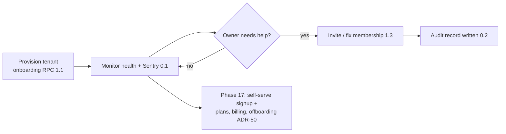

### Tenant owner

1. Log in → setup checklist (1.2; US-ON-1); create branches with hours, closures, receipt text, invoice prefix (1.2).
2. Invite the manager and receptionists with branch-scoped roles (1.3; US-T-4).
3. Build the catalogue with per-branch prices (3.3), import clients via CSV dry-run (4.3; US-CL-7).
4. Watch operations tenant-wide: home "today at a glance" (7.2), reports with branch filter (7.2), audit log viewer (7.2; US-SEC-2).
5. Change money rules: refunds are theirs alone with managers (6.3; ADR-10), currency locked after first sale (1.2/6.1; US-ON-2).
6. Leave with their data: full-tenant CSV export (7.3; ADR-43), and Phase 17 offboarding contract if they ever cancel (ADR-50).

```mermaid
flowchart LR
    A["Setup checklist 1.2"] --> B["Branches, hours,<br/>receipts, invoice prefix 1.2"]
    B --> C["Invite team with<br/>branch-scoped roles 1.3"]
    C --> D["Catalogue + branch<br/>price overrides 3.3"]
    D --> E["CSV client import<br/>dry-run + sign-off 4.3"]
    E --> F["Run the business:<br/>home, reports, audit 7.2"]
    F --> G["Own the money rules:<br/>refunds, currency lock 6.3"]
    G --> H["Export everything 7.3"]
```

### Branch manager

1. Open the branch (switcher locks to own branches, 0.4/1.3) → shift grid for the week, copy previous week (2.2).
2. Create time-off blocks on behalf of staff (MVP has no in-app request flow, ADR-53): the block becomes all-branches blocked time (2.3).
3. Run the floor: see the calendar, confirm over-shift bookings with recorded overrides (5.3; US-CAL-9).
4. Approve exception money: refunds and voids are manager-gated (6.3; ADR-10); out-of-session cash refund flagged (F-walk-2).
5. Close the day: daily sales summary equals the sales list to the fils (6.4; US-SAL-3); register difference reviewed.
6. Own-branch reports only — tenant settings and other branches are invisible (7.2 scope tests; ADR-11).

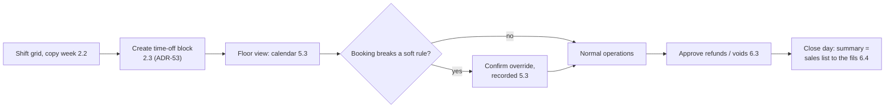

### Receptionist

1. Log in → home "today at a glance" (7.2, default route).
2. Client calls: search (Arabic or English, partial phone, 4.3) → duplicate warning honored → new-booking drawer with slot picker (5.3; US-CAL-1).
3. Walk-in arrives: book as walk-in, attach the client later (5.3; US-CAL-11).
4. Client at the chair: appointment drawer shows allergy flags (5.3) → checkout: discounts, tips, split manual payments (6.3) → receipt prints in the client's language (6.3).
5. Cash cycle: open register at start, close counted at end (6.4; ADR-6). Refunds are not theirs — the button is absent (ADR-10).
6. End of day: today's numbers already reconciled on the daily summary (6.4).

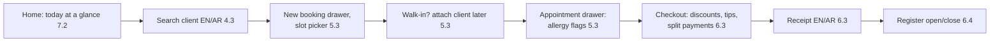

### Staff member

1. Receive invitation → log in → "my day" view: own assignments across branches, branch-labelled (2.1; ADR-12).
2. Ask the manager for time off (in person or by phone); the manager creates the block and it appears on every branch calendar (2.3, ADR-53 — an in-app request flow is a post-MVP candidate).
3. See the day update live as reception books (realtime, 5.4; ADR-38) — no stale printouts.
4. After checkout, see own sales only via `report_own_sales` (6.1; F-DB-5) — colleagues' and totals are invisible.
5. Phase 16: clock in/out on mobile, view worked hours vs shifts and commissions (16).

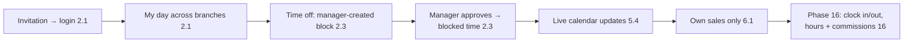

### End client (from Phase 9)

1. Opens the branch booking link/QR (9) → picks service → staff ("any" resolves round-robin, 3.3/9) → time (live slot engine, 5.2 reused) → confirms. No account (9).
2. Receives a WhatsApp/SMS/email reminder before the visit (9; ADR-33) — no-show protection begins here.
3. Pays a deposit online at booking (10; KNET/card via MyFatoorah, ADR-34).
4. If the slot is taken: joins the waitlist, gets an automatic offer when a slot frees (11).
5. Rebooks and manages their data in the client portal (11; NFR-11 privacy right).

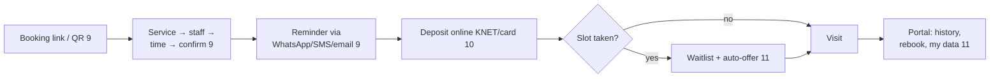

---

## Architecture

This section covers the system context, the containers, deployment and environments, the CI/CD pipeline, and Edge Function isolation.

### C4 Level 1: System context

Who uses GlowDesk and what external systems does it connect to.

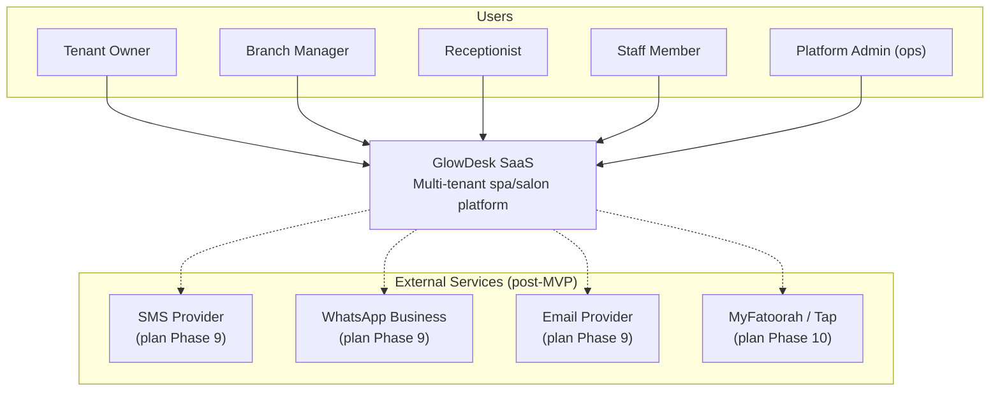

Context explanation: The system has four in-app roles (`tenant_owner`, `branch_manager`, `receptionist`, `staff`) plus a platform operations path (`platform_admin` via audited impersonation — never a membership role, per ADR-20 rule 9). All notification and payment integrations are post-MVP (plan Phases 9-10); the MVP is back-office only with manual/cash payments (ADR-1, ADR-34). External services are connected through Edge Functions behind provider abstractions so no provider-specific code leaks into the domain model (ADR-34).

### C4 Level 2: Container diagram

The runtime containers and their communication paths.

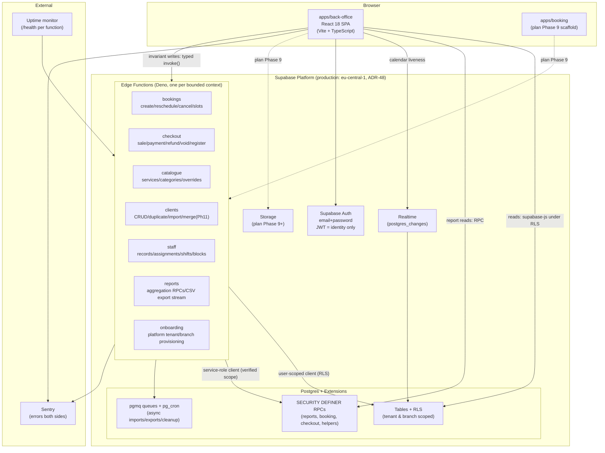

Container explanation: Three rules define the system (per CONVENTIONS §1): (1) The database is the security boundary — RLS enforces tenant and branch isolation, never application code (ADR-20). (2) The JWT carries identity only — `auth.uid()` is the only trusted input; tenant, role, and branch scope are looked up live from `memberships` on every request (ADR-19). (3) Edge Functions are isolated per bounded context — a failing or redeploying function never takes down another domain (ADR-27, NFR-2). The MVP has seven functions (`bookings`, `checkout`, `catalogue`, `clients`, `staff`, `reports`, `onboarding`); Storage and `apps/booking` are plan Phase 9 (ADR-43). The `_shared/` directory holds shared modules imported by relative path (ADR-32). Async work uses `pg_cron` + `pgmq` with idempotent consumers (ADR-33).

---

### Deployment and environments

### Environment topology

```mermaid
flowchart LR
  subgraph local["Local Development"]
    LCLI["Supabase CLI\n(supabase start)"]
    LSERVE["supabase functions serve"]
    LVITE["Vite dev server"]
  end

  subgraph staging["Staging\n(Supabase preview branch)"]
    SDB["Preview-branch Postgres"]
    SEF["Edge Functions"]
    SFE["Frontend deploy"]
  end

  subgraph prod["Production\n(paid plan, ADR-48 region)"]
    PDB["Postgres + PITR\n(daily backups, ADR-49)"]
    PEF["Edge Functions"]
    PFE["Frontend deploy"]
  end

  DEV["Feature branch\n(ephemeral preview DB)"] -->|"PR merge"| staging
  staging -->|"merge to main"| prod

  local -.->|"supabase db push"| DEV
```

Environment explanation: Local development uses the Supabase CLI stack (`supabase start`, `supabase functions serve`, Vite). Feature branches get ephemeral preview-branch databases for migration testing. CI deploys migrations, functions, and the frontend to staging on merges to `staging`, and to production only from `main` (CONVENTIONS §8). Production runs on a paid-plan Supabase project with managed daily backups and PITR (ADR-49). The region defaults to `eu-central-1` as an assumption, with a legal verification gate before Phase 8 go-live (ADR-48).

### CI/CD pipeline

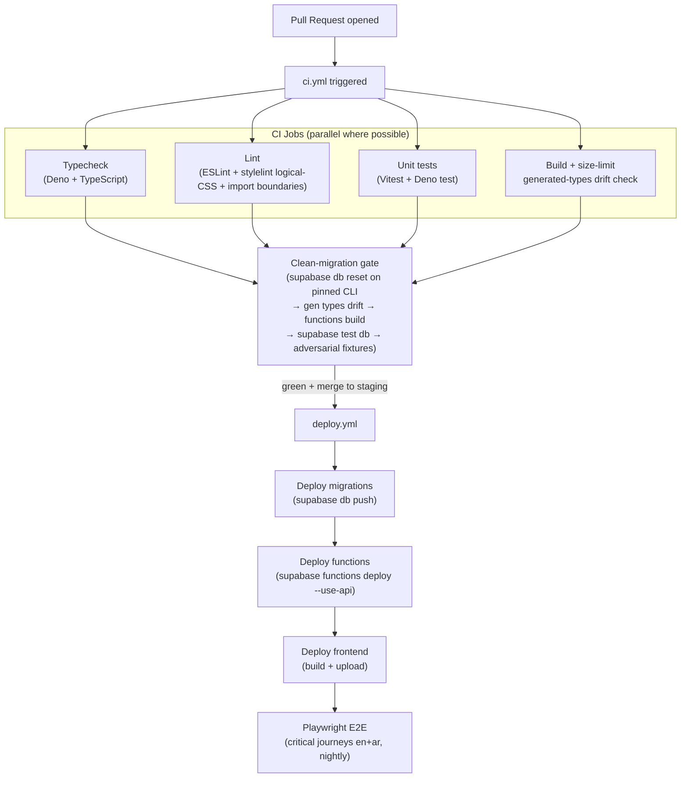

Pipeline explanation: CI gates every PR on typecheck, lint, unit tests, and build. The clean-migration gate (`F-verifier-2`) applies the full active migration set to an empty database on the pinned CLI version, regenerates types (drift fails CI), typechecks/builds every function, runs `supabase test db` (pgTAP), and executes the adversarial fixture suite (cross-tenant, cross-branch, money, and booking negatives). The gate fails if anything under `sql/drafts-v1/` is referenced by the active migration path. Frontend and backend deploy from the same commit (monorepo rule, ADR-30). E2E tests run nightly and pre-release.

### Edge Function isolation

Each Edge Function is an independent Deno deployable. A failing or redeploying function never takes down another domain because:

- Each function is a separate Supabase Edge Function slug with its own deployment lifecycle (`supabase functions deploy --slug <name>`).
- Internal routing within a function (`/<function>/<action>`, ADR-30) means most code changes touch one function.
- Shared code lives in `_shared/` — a change to `_shared` redeploys all functions in the same CI run (documented blast radius, ADR-32).
- Per-function cold starts (~50-200ms) amortize across actions in the same function; Supabase limits apply per-request (256MB memory, wall-clock CPU caps per ADR-27).
- Each function exposes `/health` for external uptime monitoring.

---

## Domain model

### Tenancy and branches

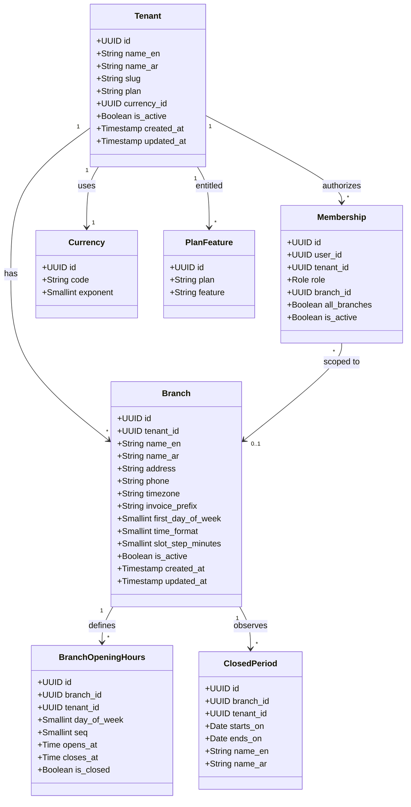

Tenancy ER diagram:

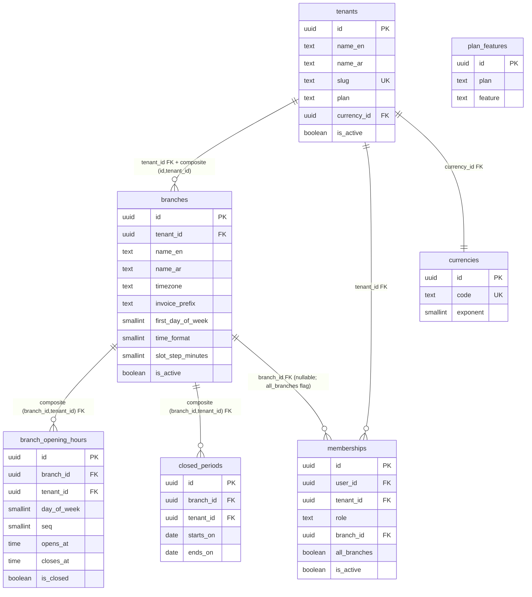

Tenancy explanation: The tenant is the root entity; every other table belongs to a tenant via `tenant_id` and composite foreign keys (ADR-20 rule 5). Branch-scoped roles use `memberships.branch_id` or the `all_branches` flag (nullable `branch_id` + boolean, ADR-20 rule 6 — the sentinel UUID is withdrawn). `platform_admin` is not a membership role; platform ops use audited impersonation (ADR-20 rule 9). Branch calendar preferences (`first_day_of_week`, `time_format`, `slot_step_minutes`) live on `branches` as typed columns, not `settings` keys (ADR-52). Opening hours support overnight (`closes_at < opens_at`) and split intervals via `seq`; `opens_at = closes_at` is rejected by the `boh_nonzero_length` check unless the row is `is_closed` — a zero-length interval is meaningless, a closed day is `is_closed = true`, and a 24-hour day is expressed as 00:00-23:59 (ADR-26, revised in the final round per F-final-db-5).

### Staff and shifts

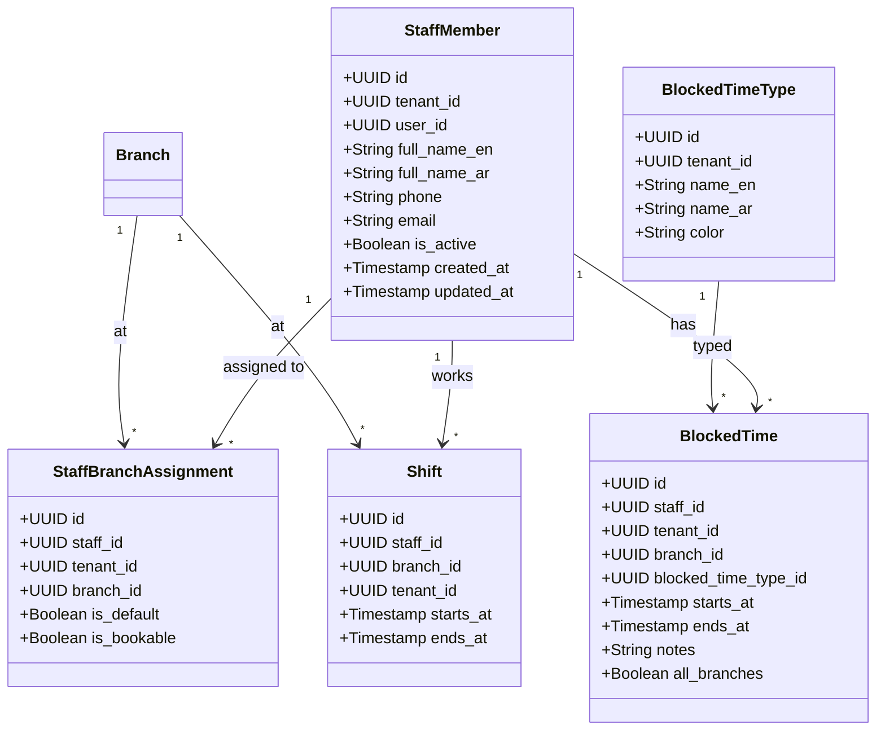

Staff ER diagram:

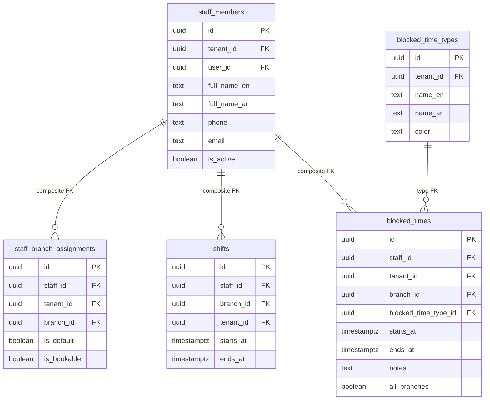

Staff explanation: One `staff_members` row per person per tenant; login is optional (`user_id` nullable, ADR-12). A partial unique index `(tenant_id, user_id) WHERE user_id IS NOT NULL` enforces one identity per tenant (ADR-12, F-DB-9). Staff are assigned to branches via `staff_branch_assignments` with a default-branch and bookable flag. The conflict engine checks busy time across all branches a staff member is assigned to (ADR-12, ADR-24). `blocked_times` is not a direct-write table — every write goes through the locked `staff`/blocked-time RPC (advisory lock + cross-entity appointment check, ADR-26, F-DB-6). Time off spanning branches uses `all_branches = true` with `branch_id IS NULL` (ADR-20 rule 6, ADR-26). `shifts` are dated rows (`timestamptz` ranges), not weekly templates; the shift grid materializes a week of rows and supports copy-previous-week.

### Service catalogue

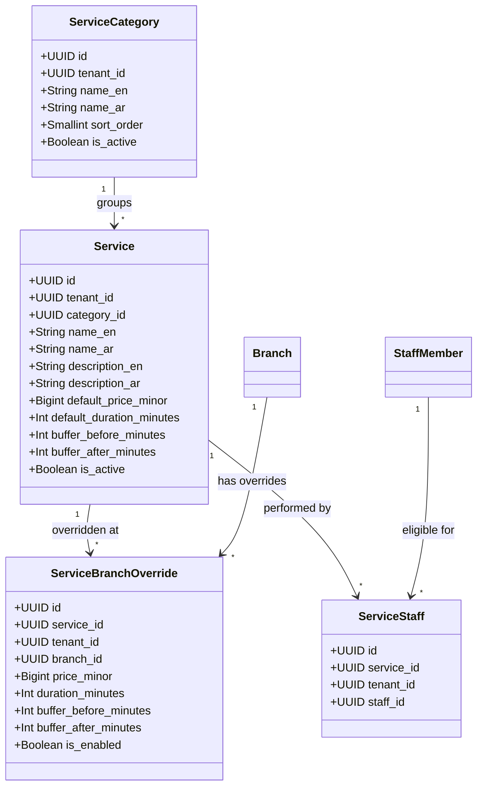

Catalogue explanation: Services are defined at tenant level with default price (in minor units, ADR-17), duration, and buffers. `service_branch_overrides` provides per-branch deviations (price, duration, enabled) that fall back to tenant defaults when absent (ADR-13). The effective price/duration is resolved by `resolve_service(branch_id, service_id)` and snapshotted onto `appointment_items` and `sale_items` at booking/checkout time for historical accuracy. Buffers are first-class and included in the busy range but not billable (ADR-25). Staff eligibility per service per branch lives in `service_staff`. A cross-branch reschedule must re-resolve price/duration/buffers via the target branch and re-snapshot (ADR-13 round 2, F-walk-1).

### Clients

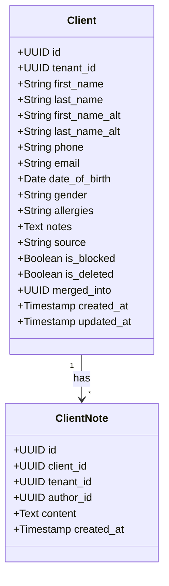

Clients explanation: Clients are tenant-scoped (shared across all branches for safety — a therapist at any branch must see allergies, ADR-11). Client financial aggregates are branch-scoped via secured RPCs, never raw client columns (ADR-11). The staff role reads only basic client fields (name, phone, allergy flags) through a column-restricted secured view limited to clients with appointments at their assigned branches, and has no writes to client master data (ADR-11, F-DB-5/F-perm-2). `is_blocked`, `is_deleted`, and `merged_into` are carved out of direct writes — they route through the `clients` Edge Function with role checks and audit (ADR-28, F-4). Duplicate warning on create (name/phone/email match, tenant-wide) with explicit proceed-and-record choice (ADR-9). `clients.source` defaults to `walk-in` or `imported`; source reporting is deferred non-committed (ADR-52).

### Appointments and booking

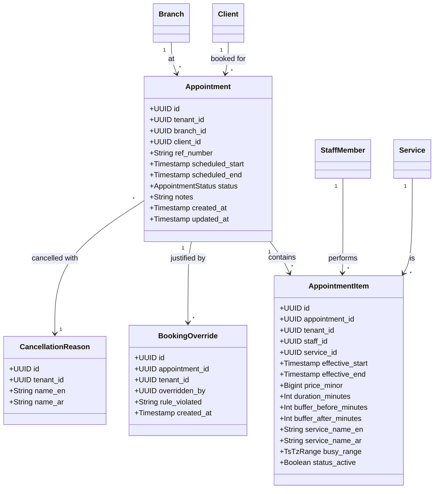

Appointment ER diagram:

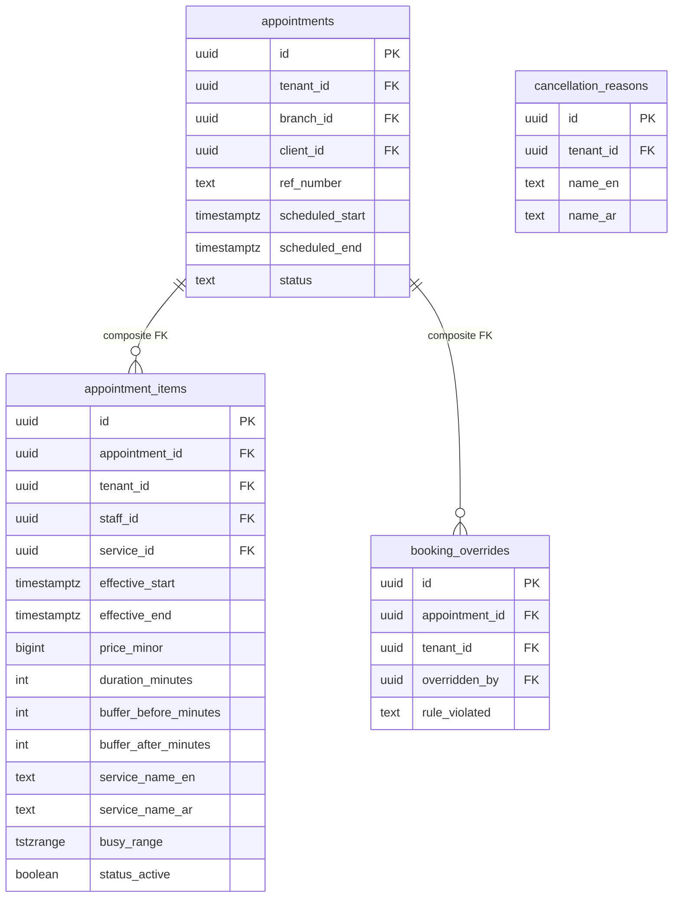

Appointments explanation: An appointment belongs to exactly one branch. `appointment_items` carry their own staff member and time span, enabling multi-service visits (sequential or parallel) inside the appointment envelope (ADR-23). Each item snapshots the resolved price, duration, buffers, and service names at booking time. `busy_range` is a trigger-maintained `tstzrange` column including buffers (BEFORE INSERT/UPDATE triggers in the validated v2 set — PGlite rejects the buffer arithmetic in a generated-column expression; on real Postgres `appointments.during` could return to `GENERATED ALWAYS`, `busy_range` stays trigger-maintained. Final round, F-final-sql-1) (`[effective_start - buffer_before, effective_end + buffer_after)`), protected by an exclusion constraint `EXCLUDE USING gist (staff_id WITH =, busy_range WITH &&) WHERE status_active` (ADR-24). The `status_active` flag is maintained by the appointment state machine — cancelled/no_show items drop out of the constraint. `ref_number` is generated by the booking RPC as `<branch invoice_prefix>-A<seq>` with `UNIQUE (branch_id, ref_number)` (ADR-14, F-DB-7). All appointment/booking_item writes go through the `bookings` Edge Function — never direct supabase-js (ADR-28).

### Sales, payments and register

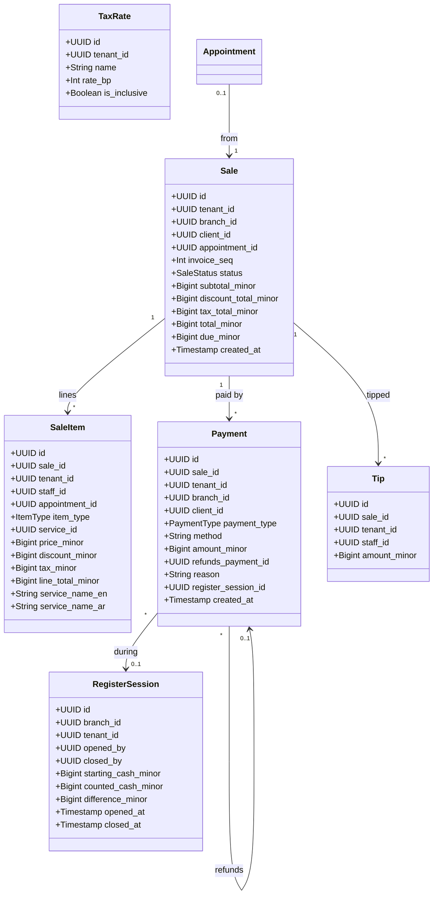

Sales ER diagram:

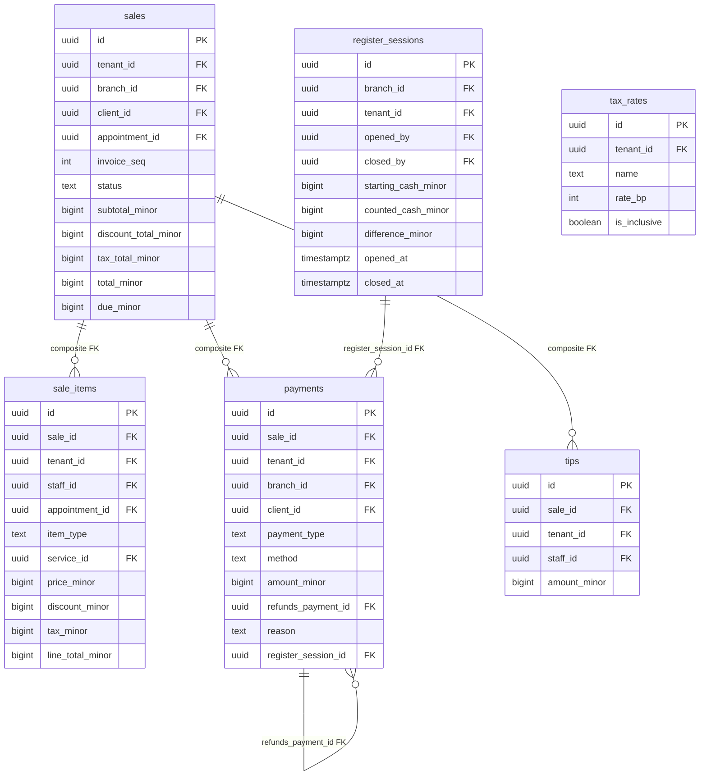

Sales explanation: Every sale belongs to exactly one branch and records its per-branch `invoice_seq` (ADR-14). Totals are derived from line items by the checkout RPC per the deterministic calculation order bound in ADR-51 (line base → line discounts → invoice-level pro-rata allocation → tax → tips → sale total). `due_minor` is derived from lines and payments (`total - sum(payments)`) and never hand-edited; whether it is stored generated or computed at read time is decided by the active migration set (final round, F-final-arch-1). All sale-related writes go through the `checkout` Edge Function — never direct supabase-js (ADR-28). Payments use a single `payments` table with `payment_type ∈ {payment, refund}`; refunds are positive `amount_minor` rows referencing `refunds_payment_id` (ADR-34 — no separate refunds table, no negative amounts). A trigger enforces `sum(refund amounts) ≤ original payment amount`. Refunds and voids are owner/manager-only (ADR-10 round 2, F-perm-1). Register sessions link cash payments and support daily reconciliation (ADR-6). Money is `bigint` minor units (fils for KWD, ADR-17) everywhere.

### Settings and audit

```mermaid
classDiagram
  class Setting {
    +UUID id
    +UUID tenant_id
    +UUID branch_id
    +Boolean all_branches
    +String key
    +Jsonb value
  }

  class AuditLog {
    +UUID id
    +UUID tenant_id
    +UUID branch_id
    +UUID actor_id
    +String action
    +String entity_type
    +UUID entity_id
    +Jsonb changes
    +Timestamp performed_at
  }

  class IdempotencyKey {
    +UUID id
    +UUID tenant_id
    +String key
    +String function
    +String status
    +Int response_status
    +Jsonb response_body
    +Timestamp created_at
  }

  Branch "1" --> "*" Setting : configured
  Tenant "1" --> "*" Setting : configured
  Tenant "1" --> "*" AuditLog : audited
```

Settings explanation: Settings use the same `all_branches` representation: `branch_id NULL` + `all_branches boolean` for tenant-wide rows, with a partial unique index `WHERE branch_id IS NULL` (ADR-20 rule 6). Audit rows are written only by `SECURITY DEFINER` triggers on audited tables and by Edge Function code paths; direct DML is revoked from `anon` and `authenticated` (ADR-22). `idempotency_keys` are unique on `(tenant_id, key)`; money mutations require an `Idempotency-Key` header; replay returns the cached response; 30-day expiry via `pg_cron` (ADR-31).

### Full entity-relationship overview

```mermaid
erDiagram
  tenants ||--o{ branches : "has"
  tenants ||--o{ memberships : "authorizes"
  tenants ||--|| currencies : "uses"
  branches ||--o{ branch_opening_hours : "defines"
  branches ||--o{ closed_periods : "observes"
  branches ||--o{ staff_branch_assignments : "staff at"
  branches ||--o{ service_branch_overrides : "overrides"
  branches ||--o{ appointments : "at"
  branches ||--o{ sales : "at"
  branches ||--o{ register_sessions : "at"
  branches ||--o{ settings : "configured"
  
  staff_members ||--o{ staff_branch_assignments : "assigned"
  staff_members ||--o{ shifts : "works"
  staff_members ||--o{ blocked_times : "blocked"
  staff_members ||--o{ appointment_items : "performs"
  staff_members ||--o{ service_staff : "eligible"
  
  service_categories ||--o{ services : "groups"
  services ||--o{ service_branch_overrides : "overridden"
  services ||--o{ service_staff : "staff for"
  services ||--o{ appointment_items : "snapshotted in"
  
  clients ||--o{ appointments : "books"
  clients ||--o{ sales : "buys"
  clients ||--o{ client_notes : "noted"
  
  appointments ||--o{ appointment_items : "contains"
  appointments ||--o{ booking_overrides : "justified"
  appointments ||--o{ sales : "results in"
  
  sales ||--o{ sale_items : "lines"
  sales ||--o{ payments : "paid"
  sales ||--o{ tips : "tipped"
  
  payments ||--o{ payments : "refunds"
  register_sessions ||--o{ payments : "cash during"
  
  blocked_time_types ||--o{ blocked_times : "types"
  cancellation_reasons ||--o{ appointments : "cancelled with"
```

Full ER explanation: Every tenant-owned table carries `tenant_id`, and every foreign key to another tenant-owned table is composite on `(parent_id, tenant_id)` to enforce tenant consistency at the database level (ADR-20 rule 5). Branch-scoped tables add `branch_id`. The `all_branches` representation (`branch_id NULL` + `all_branches boolean` + `CHECK (all_branches = (branch_id IS NULL))`) applies to `memberships`, `settings`, and `blocked_times` (ADR-20 rule 6). Soft deletes: `clients.is_deleted` + `merged_into`; `is_active` on services/staff/branches; status-based retention on appointments/sales; immutable financial rows (ADR-46). All timestamps are `timestamptz` (UTC storage); each branch has an IANA timezone for rendering and day-boundary grouping (ADR-45).

---

### The validated SQL v2 migration set

The schema in the diagrams above is proven by a validation migration set under `sql/v2/` (12 migrations plus 3 test files). It is not yet the active `supabase/migrations/` set — writing that from the ADRs is Phase 0/1 work behind the clean-migration CI gate, and the diagrams must be re-checked against it afterwards (F-final-arch-1). What the validation set contains:

| Migration | Contents |
|---|---|
| `000001_enable_extensions.sql` | `btree_gist`, `pgcrypto`, `citext`, `uuid-ossp`; hosted-form `pg_cron`, `pgmq`, and `pg_net` (added in the final round, F-final-db-1) inside the checker skip block; base grants and schemas |
| `000002_create_tenants.sql` | `tenants`, `currencies`, `plan_features`, `profiles`, and the `handle_new_user` auth trigger (skip-blocked for PGlite, F-final-sql-5) |
| `000003_create_branches.sql` | `branches` (bilingual names, `invoice_prefix`, IANA timezone, calendar preferences per ADR-52), `branch_opening_hours` (seq, overnight, `is_closed`, plus the final-round `boh_nonzero_length` check), `closed_periods` |
| `000004_create_memberships.sql` | `memberships` with the four-role enum, nullable `branch_id` + `all_branches` flag (ADR-20 rules 4/6) |
| `000005_create_staff.sql` | `staff_members` (nullable `user_id`, partial unique per ADR-12), `staff_branch_assignments`, `shifts`, `blocked_time_types`, `blocked_times` (exclusion-constrained range) |
| `000006_create_services.sql` | `service_categories`, `services`, `service_branch_overrides`, `service_staff`, and the `resolve_service` RPC (returns `record` in v2; convert to `RETURNS TABLE` before production, F-final-sql-4) |
| `000007_create_clients.sql` | `clients` (tenant-scoped, soft delete, `merged_into`, `source`, normalized `search_text`), `client_notes` |
| `000008_create_appointments.sql` | `cancellation_reasons`, `appointments`, `appointment_items` (snapshots, trigger-maintained `busy_range`, `status_active`), `booking_overrides`, the partial exclusion constraint (F-final-sql-2/3) |
| `000009_create_sales.sql` | `invoice_counters` (`kind`-discriminated, `UNIQUE (branch_id, kind)`), `tax_rates`, `register_sessions` (one-open-per-branch partial unique index `idx_rs_one_open`), `sales`, `sale_items`, `tips`, `payments` (refund-cap trigger), `idempotency_keys` (`UNIQUE (tenant_id, key, function_name)` since the final round, F-final-db-3) |
| `000010_create_settings.sql` | `settings` (role-gated), `audit_log` (append-only, ADR-22) |
| `000011_create_views.sql` | `security_invoker` report views with explicit grants (ADR-21) |
| `000012_enable_rls.sql` | RLS on every table plus policies, helper functions, and role grants |

Tests: `001_tenant_isolation.sql` (cross-tenant reads/FK attacks/role checks), `002_branch_isolation.sql` (branch scope, payment restrictions, money and sequence races), `003_final_round_fixes.sql` (zero-length opening-hours rejection, overnight acceptance, per-function idempotency scope).

Checker result (`check-sql.mjs`, PGlite): 12 migrations apply cleanly; 33 public tables, 33 with RLS enabled; all three test files pass. One warning is intentional: `public.idempotency_keys` has RLS with no policies (deny-all) because it is a client-inaccessible mutation table with a select-only grant — the replay protocol runs inside Edge Functions under the service role.

Remaining production-validation gates carried from the final round: the partial exclusion constraint syntax and the `handle_new_user` trigger must be re-validated on real Supabase Postgres with the pinned CLI (F-final-sql-2/5); `resolve_service` converts to `RETURNS TABLE` (F-final-sql-4); trigger-maintained ranges need bypass/update coverage tests (F-final-sql-1); cancellation and no-show must flip `status_active` inside the booking RPC contract, with concurrent cancellation/reschedule tests in Phase 5 (F-final-sql-3).

## Key flows

Sequence and state diagrams for the journeys that carry the product's invariants: sign-in and scope selection, booking with the double-booking guard, cross-branch reschedule, checkout, refund, cash-up, onboarding, and the Edge Function call anatomy; then the appointment, sale, payment, shift, and tenant state machines.

### Sign-in and tenant/branch selection

```mermaid
sequenceDiagram
  actor U as User
  participant FE as React SPA
  participant Auth as Supabase Auth
  participant DB as Postgres (RLS)
  participant EF as Edge Function

  U->>FE: Enter email + password
  FE->>Auth: signInWithPassword()
  Auth-->>FE: session (JWT)
  
  FE->>DB: SELECT memberships WHERE user_id = auth.uid() AND is_active = true
  DB-->>FE: [{tenant_id, role, branch_id, all_branches}]

  alt Single tenant, single branch
    FE->>FE: Set active tenant + branch (skip switcher)
  else Multi-tenant user
    FE->>U: Show tenant switcher
    U->>FE: Select tenant
    FE->>FE: Set active tenant context
  end

  alt Multiple branches (manager/receptionist)
    FE->>U: Show branch switcher
    U->>FE: Select branch
    FE->>FE: Set active branch (URL search param ?branch=uuid)
  end

  FE->>FE: Render app shell with tenant + branch context
  Note over FE: Every subsequent query key carries tenant+branch scope (ADR-38)
```

Sign-in explanation: `auth.uid()` from the JWT is the only trusted identity input (ADR-19). Authorization (tenant membership, role, branch scope) is derived on every request from the `memberships` table via `STABLE SECURITY DEFINER` helpers (`current_tenant_ids()`, `current_branch_scope()`, `has_tenant_role()`). The JWT carries no tenant or role claims. Memberships are filtered `is_active = true` — revoking a membership takes effect immediately without waiting for token expiry (ADR-19). A user may hold memberships in multiple tenants and different roles at different branches; the active tenant is application context persisted per user (ADR-37, F-fe-1). Branch context lives in the URL as a search param (`?branch=<uuid>|all`); RLS remains the real security boundary either way (ADR-37).

### Creating a booking (double-booking guard)

```mermaid
sequenceDiagram
  actor R as Receptionist
  participant FE as React SPA
  participant EF as Edge Function (bookings)
  participant DB as Postgres
  participant Lock as Advisory Lock
  R->>FE: Select client, services, staff, time
  FE->>FE: Client-side slot computation (packages/core)
  Note over FE: Slot engine computes from opening hours shift duration buffers minus appointments blocked time closures
  R->>FE: Confirm booking
  FE->>EF: POST /bookings/create {clientId, branchId, items[{serviceId, staffId, start}], Idempotency-Key}
  Note over FE,EF: JWT sent via Authorization header EF verifies membership live
  EF->>DB: has_tenant_role(tenantId roles branchId)
  DB-->>EF: true
  EF->>DB: SELECT membership branch scope validation
  EF->>DB: SELECT resolve_service per item snapshot price duration buffers
  loop For each staff member in items
    EF->>Lock: pg_advisory_xact_lock(hashtextextended(staffId 0))
    Note over Lock: Serializes concurrent bookings per staff member
    EF->>DB: Check blocked_times overlap for this staff
    EF->>DB: Check appointment_items busy_range overlap for this staff
  end
  alt Conflict found
    EF-->>FE: {ok: false error: {code: CONFLICT details: {conflictingAppointmentId}}}
    FE->>R: Show conflict toast with details
  else No conflict
    EF->>DB: INSERT appointment branchId clientId refNumber status=booked
    EF->>DB: INSERT appointment_items staffId effectiveStartEnd snapshots busyRange
    EF->>DB: UPDATE invoice_counters SET next_number = next_number + 1 kind=appointment_ref
    Note over DB: Exclusion constraint is the final guard advisory lock prevents races
    EF-->>FE: {ok: true data: {appointment}}
    FE->>FE: Optimistic cache update via TanStack Query
    FE->>FE: Realtime subscription updates calendar
  end
```

Booking explanation: The double-booking prevention uses three layers (ADR-24): (1) A database exclusion constraint `EXCLUDE USING gist (staff_id WITH =, busy_range WITH &&) WHERE status_active` on `appointment_items` is the final guard. (2) The booking RPC takes `pg_advisory_xact_lock` per staff member, serializing concurrent bookings and making the check-then-insert race impossible. (3) An RPC pre-check computes conflicts first for good error messages. Cross-entity conflicts (appointment vs blocked time) are checked inside the same locked transaction (ADR-26). The conflict engine checks busy time across all branches the staff member is assigned to (ADR-12). Buffers are included in `busy_range` (ADR-25). All appointment writes go through the `bookings` Edge Function — never direct supabase-js (ADR-28). The `Idempotency-Key` header prevents double-booking on retry (ADR-31).

### Rescheduling across branches (price re-resolution)

```mermaid
sequenceDiagram
  actor R as Receptionist
  participant FE as React SPA
  participant EF as Edge Function (bookings)
  participant DB as Postgres

  R->>FE: Drag appointment item to different branch/time
  FE->>FE: Optimistic UI update (drag to new slot)
  FE->>EF: POST /bookings/reschedule {appointment_item_id, new_branch_id, new_start, Idempotency-Key}

  EF->>DB: Verify membership + branch scope for BOTH old and new branches
  DB-->>EF: Authorized

  alt New branch != old branch
    EF->>DB: resolve_service(new_branch_id, service_id)
    Note over DB: Re-resolve price/duration/buffers at target branch (ADR-13, F-walk-1)
    DB-->>EF: {price_minor: new_price, duration_minutes: new_dur, buffers: new_bufs}
  else Same branch
    EF->>DB: Reuse existing resolved values
  end

  EF->>DB: Take advisory lock for the staff member
  EF->>DB: Check conflicts at new time/branch
  alt Conflict
    EF-->>FE: {ok: false, error: {code: "CONFLICT", ...}}
    FE->>FE: Rollback optimistic update, show conflict
  else Available
    EF->>DB: UPDATE appointment_item SET effective_start/end, price_minor, buffer_*, busy_range, branch_id (if changed)
    EF->>DB: INSERT audit_log (old values + new values, cross-branch flag)
    EF-->>FE: {ok: true, data: {updated_item}}
    FE->>FE: Confirm optimistic update, invalidate calendar cache
  end
```

Reschedule explanation: A cross-branch reschedule must re-resolve price, duration, and buffers via `resolve_service(target_branch_id, service_id)` — reusing the old branch's snapshot is a billing error (ADR-13, F-walk-1). The audit record carries both old and new resolved values. Direct updates of `scheduled_start/end` or item spans are prohibited — reschedule goes through the same locked RPC path as creation, closing the "reschedule bypasses the trigger" hole (ADR-24).

### Check-in and checkout with cash payment

```mermaid
sequenceDiagram
  actor R as Receptionist
  participant FE as React SPA
  participant EF as Edge Function (checkout)
  participant DB as Postgres

  Note over R,DB: Check-in
  R->>FE: Client arrives tap Check In
  FE->>EF: POST /bookings/status {appointmentId status: arrived}
  EF->>DB: Verify role and branch scope
  EF->>DB: UPDATE appointments SET status = arrived legal transition check
  EF->>DB: INSERT audit_log
  EF-->>FE: {ok: true}
  Note over FE: Appointment moves to In Progress when service starts
  Note over R,DB: Service completes then checkout
  R->>FE: Open checkout screen for appointment
  FE->>FE: Load resolved items compute totals per ADR-51
  R->>FE: Apply discount line or sale-level confirm
  R->>FE: Select payment method cash
  R->>FE: Confirm sale
  FE->>EF: POST /checkout/sale {appointmentId items discounts tips payments cash amountMinor Idempotency-Key}
  EF->>DB: idempotency check tenantId key
  alt Replay
    EF-->>FE: Cached response
  else New
    EF->>DB: has_tenant_role(tenantId roles branchId)
    EF->>DB: Verify register session is OPEN cash payment requires open register
    EF->>DB: Take invoice counter lock UPDATE invoice_counters SET next = next + 1 RETURNING next - 1
    EF->>DB: Recompute totals server-side per ADR-51 order reject client-supplied mismatches
    EF->>DB: INSERT sale invoiceSeq totals status
    EF->>DB: INSERT sale_items snapshotted from appointment_items
    EF->>DB: INSERT payments method=cash amountMinor registerSessionId
    EF->>DB: INSERT tips per staff outside taxable base
    EF->>DB: UPDATE appointments SET status = completed
    EF->>DB: INSERT audit_log entries
    EF-->>FE: {ok: true data: {sale receiptData}}
  end
  FE->>R: Show receipt choice to print or email
```

Checkout explanation: The checkout RPC implements the deterministic calculation order from ADR-51: line base → line discounts (fixed then percent) → invoice-level pro-rata allocation → tax extraction → tips (separate) → sale total. Client-supplied totals that differ from the server recomputation are rejected (tampered-total negative test). Cash payments require an open register session (ADR-6). The invoice number is assigned inside the sale transaction via row-locked `UPDATE ... RETURNING` on `invoice_counters` (ADR-14). All money mutations carry an `Idempotency-Key` (ADR-31). All checkout writes go through the `checkout` Edge Function — never direct supabase-js (ADR-28). Receptionists keep checkout, discounts, and tips; refunds and voids are owner/manager-only (ADR-10 round 2, F-perm-1).

### Refund by a manager

```mermaid
sequenceDiagram
  actor M as Branch Manager
  participant FE as React SPA
  participant EF as Edge Function (checkout)
  participant DB as Postgres

  M->>FE: Open sale detail tap Refund Payment
  M->>FE: Select payment to refund enter reason
  FE->>EF: POST /checkout/refund {paymentId amountMinor reason Idempotency-Key}
  EF->>DB: has_tenant_role(tenantId managerRoles branchId)
  Note over DB: Receptionist is FORBIDDEN per ADR-10 round 2
  EF->>DB: SELECT payment verify exists branch scope type=payment
  EF->>DB: SELECT sum refunded amounts for this payment
  alt Refund exceeds original
    EF-->>FE: {ok: false error: {code: VALIDATION message: Refund exceeds payment amount}}
  else Valid
    EF->>DB: INSERT payments type=refund refundsPaymentId positive amountMinor reason registerSessionId=NULL if no open session
    Note over DB: Trigger enforces sum refunds <= original out-of-session refunds flagged in audit
    EF->>DB: UPDATE sale SET status and due_minor recalculated
    EF->>DB: INSERT audit_log refund action manager id
    EF-->>FE: {ok: true data: {refund}}
  end
  FE->>M: Refund confirmed daily summary flags out-of-session refunds
```

Refund explanation: Refunds are a `payments` row with `payment_type = 'refund'` and a **positive** `amount_minor` referencing `refunds_payment_id` (ADR-34 round 2, F-PLAN-2). No separate refunds table exists; no negative ledger amounts exist. A trigger enforces `sum(refund amounts) ≤ original payment amount`. Refunds are owner/branch-manager only — receptionists are forbidden (ADR-10 round 2, F-perm-1). Cash refunds executed when the branch has no open register session are allowed (manager-approved) and recorded with `register_session_id IS NULL`, flagged in the daily summary and audit (ADR-6, F-walk-2). The original payment record is never mutated.

### End-of-day cash-up

```mermaid
sequenceDiagram
  actor M as Branch Manager
  participant FE as React SPA
  participant EF as Edge Function (checkout)
  participant DB as Postgres

  M->>FE: Open register tap Close Register
  M->>FE: Enter counted cash amount
  FE->>EF: POST /checkout/close-register {registerSessionId countedCashMinor}
  EF->>DB: has_tenant_role(tenantId managerRoles branchId)
  EF->>DB: Verify session is OPEN and belongs to this branch
  EF->>DB: SELECT sum cash payments for this session
  EF->>DB: UPDATE register_sessions SET countedCashMinor differenceMinor closedBy closedAt status=closed
  alt Difference != 0
    EF->>DB: INSERT audit_log cash difference flagged
  end
  EF-->>FE: {ok: true data: {sessionSummary expected counted difference}}
  FE->>M: Show cash-up summary discrepancies flagged
```

Cash-up explanation: One register session per branch at a time (ADR-6). Daily reconciliation: expected = `starting_cash_minor + sum(cash payments during session) − sum(cash refunds)`. Difference = `counted − expected`. Out-of-session cash refunds (with `register_session_id IS NULL`) are flagged in the daily summary and audit (ADR-6, F-walk-2). Register sessions and their close go through the `checkout` Edge Function.

### Tenant onboarding

```mermaid
sequenceDiagram
  actor P as Platform Admin
  participant OPS as Ops Script / UI
  participant EF as Edge Function (onboarding)
  participant DB as Postgres (service role)

  P->>OPS: Create tenant: company name, owner email, plan, currency, default branch details
  OPS->>EF: POST /onboarding/provision {tenant, owner_user, branch, plan} (service_role auth)

  EF->>DB: CREATE tenant row (service role — no authenticated insert policy)
  EF->>DB: CREATE or find auth user for owner
  EF->>DB: INSERT profile (trigger on auth.users)
  EF->>DB: INSERT membership (tenant_owner, all_branches=true)
  EF->>DB: INSERT branch (default, timezone='Asia/Kuwait')
  EF->>DB: INSERT branch_opening_hours (default business hours)
  EF->>DB: INSERT invoice_counters (invoice + appointment_ref, starting at 1)
  EF->>DB: INSERT plan_features row
  EF->>DB: INSERT currency or link existing (KWD, exponent=3)
  EF->>DB: SEED cancellation_reasons, blocked_time_types (bilingual defaults)
  EF->>DB: INSERT audit_log entries

  EF-->>OPS: {ok: true, data: {tenant, owner_user_id, branch}}
  OPS->>P: Done. Owner receives credentials.
```

Onboarding explanation: Tenant creation is platform-admin-only through the `onboarding` Edge Function under the service role (ADR-20 rule 3). No `authenticated` insert policy exists on `tenants` (open question 7 ruled). Provisioning is idempotent (re-run safe, ADR-31 pattern). The owner gets `tenant_owner` role with `all_branches = true`. Default seeded data includes bilingual cancellation reasons and blocked time types (ADR-16). Branch defaults use `Asia/Kuwait` timezone, Saturday as first day of week for Arabic-first tenants (ADR-52).

### Edge Function call: JWT verification, tenant checks, idempotency, error format

```mermaid
sequenceDiagram
  participant FE as React SPA (packages/api)
  participant EF as Edge Function (_shared/server.ts)
  participant Auth as Supabase Auth
  participant DB as Postgres

  FE->>EF: POST /functions/v1/bookings/create\nAuthorization: Bearer <JWT>\nIdempotency-Key: <UUID>\nBody: {tenant_id, branch_id, ...}

  Note over EF: _shared/server.ts wrapper extracts auth mode = 'user'

  EF->>Auth: supabase.auth.getUser(jwt)
  Auth-->>EF: {user: {id}, session} or error
  alt Invalid/expired JWT
    EF-->>FE: {ok: false, error: {code: "UNAUTHENTICATED", message: "..."}}
  end

  EF->>DB: SELECT memberships WHERE user_id = $1 AND tenant_id = $2 AND is_active = true
  DB-->>EF: [{role, branch_id, all_branches}]
  alt No active membership
    EF-->>FE: {ok: false, error: {code: "FORBIDDEN", message: "..."}}
  end

  EF->>DB: has_tenant_role(tenant_id, required_roles, branch_id)
  DB-->>EF: false
  alt Insufficient role for branch
    EF-->>FE: {ok: false, error: {code: "FORBIDDEN", message: "..."}}
  end

  EF->>DB: idempotency_keys check (tenant_id, key)
  alt status = 'completed'
    EF-->>FE: Cached response (200 with prior body)
  else status = 'processing'
    EF-->>FE: {ok: false, error: {code: "CONFLICT", message: "Request in progress"}}
  else new key
    EF->>DB: INSERT idempotency_keys (status='processing')
    EF->>DB: Execute business logic (book appointment, create sale, etc.)
    alt Success
      EF->>DB: UPDATE idempotency_keys SET status='completed', response_body
      EF-->>FE: {ok: true, data: {...}}
    else Validation error
      EF-->>FE: {ok: false, error: {code: "VALIDATION", message: "...", fieldErrors: {...}}}
    else Internal error
      EF->>DB: UPDATE idempotency_keys SET status='failed'
      EF-->>FE: {ok: false, error: {code: "INTERNAL", message: "..."}}
    end
  end
```

Edge Function explanation: Every function uses the shared `_shared/server.ts` wrapper (ADR-35), which handles JWT verification via `supabase.auth.getUser()`, assembles context (tenant, branch, role from live membership lookup), and emits the versioned envelope `{ok, data}` / `{ok, error: {code, message, fieldErrors?, details?}}` (ADR-29). Authorization is never derived from JWT claims (ADR-19). The `Idempotency-Key` header is required on money mutations; the `idempotency_keys` table caches responses and detects `processing` collisions (ADR-31). The error code catalogue is defined once in `packages/validation` (TS) and mirrored in `_shared/errors.ts` (Deno): `VALIDATION(400)`, `UNAUTHENTICATED(401)`, `FORBIDDEN(403)`, `NOT_FOUND(404)`, `CONFLICT(409)`, `IDEMPOTENCY_MISMATCH(422)`, `RATE_LIMITED(429)`, `INTERNAL(500)`, `UNAVAILABLE(503)` (ADR-29).

---

### State diagrams

### Appointment state machine

```mermaid
stateDiagram-v2
  [*] --> booked : Receptionist/Manager\ncreates booking
  booked --> confirmed : Receptionist/Manager\nconfirms (opt)
  confirmed --> arrived : Client arrives\nCheck-in
  booked --> arrived : Client arrives\nCheck-in (skip confirm)
  arrived --> in_progress : Service begins
  in_progress --> completed : Service completes\n→ Checkout flow
  booked --> cancelled : Cancelled with reason\n(any state before completed)
  confirmed --> cancelled : Cancelled with reason
  arrived --> cancelled : Cancelled with reason
  booked --> no_show : Client does not arrive\n(manager action or cron)
  confirmed --> no_show : Client does not arrive
  completed --> [*]
  cancelled --> [*]
  no_show --> [*]

  note right of booked
    Status enum (ADR-7):
    booked, confirmed, arrived,
    in_progress, completed,
    cancelled, no_show
  end note

  note right of cancelled
    appointment_items.status_active
    = false on cancel/no_show
    (drops out of exclusion constraint)
  end note
```

Appointment state explanation: The appointment status enum is fixed: `booked, confirmed, arrived, in_progress, completed, cancelled, no_show` (ADR-7). `in_progress` is the canonical value — `started` is banned. Only legal transitions are allowed; backward moves require manager override and are audit-logged (ADR-7). Custom statuses are deferred non-committed (ADR-7, F-cov-5). When an appointment is cancelled or marked no_show, `appointment_items.status_active` is set to `false`, dropping the item out of the exclusion constraint and freeing the slot (ADR-24). The checkout flow transitions the appointment to `completed` as part of the sale transaction.

### Sale state machine

```mermaid
stateDiagram-v2
  [*] --> unpaid : Checkout creates sale
  unpaid --> part_paid : First payment received\n(total > 0, due > 0)
  part_paid --> completed : Final payment\n(due = 0)
  unpaid --> completed : Full payment\nin single transaction
  unpaid --> voided : Manager voids\nsame-day only, reason required
  part_paid --> voided : Manager voids\nsame-day only
  completed --> [*]
  voided --> [*]

  note right of unpaid
    Status enum (ADR-7):
    unpaid, part_paid,
    completed, voided
  end note

  note left of voided
    Void: same-day only,
    reason required,
    sale preserved with
    status = 'voided',
    never deleted (ADR-10)
  end note
```

Sale state explanation: The sale status enum is fixed: `unpaid, part_paid, completed, voided` (ADR-7). `completed` means fully paid and closed. Voids are same-day only with a required reason; the sale record is preserved with status `voided` — never deleted (ADR-10, ADR-46). Refunds do not change the sale status — they are separate `payments` rows of type `refund` (ADR-34). The derived `due_minor` value (`total - sum(payments)`, never hand-edited) drives the `unpaid → part_paid → completed` transitions.

### Payment and refund state

```mermaid
stateDiagram-v2
  [*] --> payment_recorded : Cash/manual payment\nrecorded at checkout
  
  state payment_recorded {
    [*] --> active : Payment row created\n(type = 'payment')
    active --> fully_refunded : Refund(s) sum = amount
    active --> partially_refunded : Refund(s) sum < amount
  }

  payment_recorded --> [*] : Payment exists in immutable ledger

  note right of payment_recorded
    Payments table (ADR-34):
    - payment_type: payment | refund
    - All amounts positive (bigint _minor)
    - Trigger: sum(refunds) <= original
    - Never mutated or deleted
  end note
```

Payment state explanation: There is no separate refunds table — all money movements are `payments` rows (ADR-34). A refund is a `payments` row with `payment_type = 'refund'` and a **positive** `amount_minor` referencing `refunds_payment_id`. All amounts are `CHECK (amount_minor >= 0)` — no signed ledger columns. A trigger enforces `sum(refund amounts) <= original payment amount`. Financial rows are immutable (ADR-46); corrections are new rows (refunds). Full refunds are in MVP; partial refunds arrive in plan Phase 10 with online payments (ADR-34).

### Staff shift lifecycle

```mermaid
stateDiagram-v2
  [*] --> scheduled : Manager creates shift\n(starts_at, ends_at)
  scheduled --> in_progress : Current time >= starts_at
  in_progress --> completed : Current time >= ends_at
  scheduled --> cancelled : Manager cancels shift
  scheduled --> [*]
  in_progress --> [*]
  completed --> [*]
  cancelled --> [*]
```

Shift explanation: Shifts are dated rows (`timestamptz` ranges), not weekly templates (ADR-26). The shift grid materializes a week of rows and supports copy-previous-week. Overnight shifts (`ends_at` next day) are natural with `timestamptz`. Shifts are a soft constraint on booking — booking outside a shift produces a warning with manager override recorded in `booking_overrides` (ADR-26).

### Tenant lifecycle

```mermaid
stateDiagram-v2
  [*] --> trial : Platform admin provisions\n(onboarding function)
  trial --> active : Owner completes setup\n(checklist done)
  active --> suspended : Platform admin suspends\n(payment or TOS)
  suspended --> active : Platform admin reactivates
  active --> offboarding : Owner requests offboarding\n(ADR-50)
  
  state offboarding {
    [*] --> export : Full tenant export\n(ADR-43)
    export --> soft_archive : Marked inactive\nmemberships deactivated\n28-day read-only
    soft_archive --> anonymize : Personal fields\nreplaced via RPC
    anonymize --> financial_retention : Financial records\nretained 10 years
    financial_retention --> deleted : Hard delete\nafter retention period
  }

  offboarding --> [*]
```

Tenant lifecycle explanation: Tenants begin as `trial` when provisioned by platform operations (the audited impersonation path, ADR-20 rule 9 — not an in-app role) via the `onboarding` Edge Function (ADR-18, ADR-20 rule 3). Setup checklist completion transitions to `active`. The offboarding contract follows ADR-50: export -> 28-day soft archive -> anonymize personal data via the NFR-11 RPC -> retain financials for the Kuwaiti commercial period (default 10 years, legal confirmed at plan Phase 17 scheduling, ADR-50) -> hard delete. The anonymize RPC built in plan Phase 4 is the same machinery used for offboarding. Subscription billing and self-serve signup arrive in plan Phase 17 (ADR-18).

---

## Security and multi-tenancy

The roles-by-actions-by-enforcement-point matrix, every tenant/branch isolation attack path with its defence, and the data access map (what the frontend may do directly versus what must go through a function or RPC).

### Roles x actions x enforcement point

| Action | tenant_owner | branch_manager | receptionist | staff | Enforcement point |
|---|---|---|---|---|---|
| View own branch schedule | Yes | Yes | Yes | Yes | RLS (branch-scoped SELECT) |
| View all branches schedule | Yes | Yes (assigned) | No | No | RLS (all_branches + branch scope) |
| Create booking | Yes | Yes | Yes | No | `bookings` Edge Function + RLS roles |
| Reschedule/cancel booking | Yes | Yes | Yes | No | `bookings` Edge Function + RLS roles |
| Check-in + checkout | Yes | Yes | Yes | No | `checkout` Edge Function + RLS roles |
| Apply discounts | Yes | Yes | Yes | No | `checkout` Edge Function + RLS roles |
| Add tips | Yes | Yes | Yes | Yes (own) | `checkout` Edge Function + RLS roles |
| Full refund | Yes | Yes | **FORBIDDEN** | **FORBIDDEN** | `checkout` Edge Function (server-side role check, ADR-10) |
| Void sale | Yes | Yes | **FORBIDDEN** | **FORBIDDEN** | `checkout` Edge Function (server-side role check, ADR-10) |
| Close register | Yes | Yes | No | No | `checkout` Edge Function + RLS roles |
| Create/edit client contact | Yes | Yes | Yes | No | `clients` Edge Function (contact fields) |
| Edit client notes/allergies | Yes | Yes | Yes | No | Direct or `clients` Edge Function |
| View client allergies | Yes | Yes | Yes | **view only** (own-branch clients) | Column-restricted view (ADR-11, F-DB-5) |
| Block/merge/delete client | Yes | Yes | No | No | `clients` Edge Function (carved out, F-4) |
| Import clients CSV | Yes | **FORBIDDEN** | **FORBIDDEN** | **FORBIDDEN** | `clients` Edge Function (owner-only, F-perm-3) |
| Edit service catalogue | Yes | Yes | No | No | Direct supabase-js or `catalogue` Edge Function |
| Edit service pricing | Yes | Yes | No | No | `catalogue` Edge Function (snapshot+audit consistency) |
| Edit staff records | Yes | Yes (own branch) | No | No | `staff` Edge Function |
| Manage shifts | Yes | Yes (own branch) | No | No | Direct supabase-js (manager-gated RLS, ADR-28 allowlist) |
| Create blocked time | Yes | Yes (own branch) | Yes (own branch) | request->approval | `staff` Edge Function (locked RPC, F-DB-6) |
| Edit tenant settings | Yes | No | No | No | Direct supabase-js (role-gated RLS) |
| Edit branch settings | Yes | Yes (own branch) | No | No | Direct supabase-js (role-gated RLS) |
| Manage roles/memberships | Yes | Yes (grant receptionist/staff in own branch) | No | No | `onboarding`/`staff` Edge Function (ADR-20 rule 9) |
| View reports (own branch) | Yes | Yes | Yes | No | `security_invoker` views / `report_*` RPCs |
| View reports (all branches) | Yes | No | No | No | `report_*` RPCs (tenant-wide scope) |
| View own sales (staff) | - | - | - | Yes | `report_own_sales` secured RPC (F-DB-5) |
| Export client contacts | Yes | **FORBIDDEN** | **FORBIDDEN** | **FORBIDDEN** | `reports` Edge Function (owner-only, F-verifier-3) |
| Provision new tenant | No | No | No | No | `onboarding` Edge Function (service role, platform ops, ADR-20 rule 3) |

### Tenant isolation attack paths and defences

```mermaid
flowchart TB
  subgraph attacks["Attack paths identified (round 2)"]
    A1["Cross-tenant reads\n(guess UUID of another tenant's row)"]
    A2["Cross-branch reads\n(manager of branch A reads branch B)"]
    A3["Cross-tenant FK injection\n(use tenant A's client_id in tenant B's appointment)"]
    A4["Stale membership\n(revoked user still has valid JWT)"]
    A5["Direct money table writes\n(receptionist inserts refund bypassing role check)"]
    A6["Realtime eavesdropping\n(subscribe to another tenant's postgres_changes)"]
    A7["Service-role escalation\n(function uses service role without scope check)"]
    A8["Composite FK bypass\n(plain UUID FK skips tenant consistency)"]
  end

  subgraph defences["Defences"]
    D1["RLS on every table\n(tenant-scoped USING clause)"]
    D2["Branch-scoped RLS + has_tenant_role()\nwith explicit branch parameter"]
    D3["Composite FKs on every\ntenant-owned parent-child pair"]
    D4["Live membership lookup per request\n(STABLE SECURITY DEFINER, is_active=true)"]
    D5["Direct-write allowlist (ADR-28)\nmoney tables = Edge Function only"]
    D6["Realtime channel authorization tested\nper-table, per-role, per-branch"]
    D7["Every SECURITY DEFINER function\nverifies scope live + SET search_path=public"]
    D8["UNIQUE(id, tenant_id) on every parent\n+ CROSS-TENANT FK attack pgTAP test"]
  end

  A1 --> D1
  A2 --> D2
  A3 --> D3
  A4 --> D4
  A5 --> D5
  A6 --> D6
  A7 --> D7
  A8 --> D8
```

Security explanation: The database is the security boundary — RLS enforces tenant and branch isolation, never application code (ADR-20). Every attack path identified in round 2 has a specific defence tested in CI. The pgTAP harness covers per-table x per-role x per-operation x cross-tenant x cross-branch x anon, plus: revocation-immediacy (deactivating a membership mid-session must block the next request), cross-tenant FK attack inserts must fail, manager of branch A must fail a role check for branch B, and Realtime channel authorization must not leak another tenant's or branch's payloads. `platform_admin` is not a membership role — platform operations use explicit, time-boxed, audit-logged impersonation visible to the tenant owner (ADR-20 rule 9). Every `SECURITY DEFINER` function declares `SET search_path = public` (ADR-20 rule 10); `supabase db lint` enforces this in CI.

---

### Data access map

For every MVP write path: whether it goes through supabase-js (RLS), an SECURITY DEFINER RPC, or an Edge Function, and why.

### Direct supabase-js writes (ADR-28 allowlist)

| Entity | Operations allowed directly | Roles | Why direct is safe |
|---|---|---|---|
| `profiles` | UPDATE | Self only | RLS `id = auth.uid()` fully expresses authorization |
| `client_notes` | INSERT, UPDATE, DELETE | receptionist, branch_manager, tenant_owner | Single-table; RLS + role CHECK sufficient |
| `clients` (contact/profile fields only) | INSERT, UPDATE | receptionist, branch_manager, tenant_owner | RLS tenant-scoped; `is_blocked`, `is_deleted`, `merged_into` carved out (F-4); staff role has NO client writes (F-perm-2) |
| `settings` | INSERT, UPDATE, DELETE | tenant_owner (tenant-wide), branch_manager (own branch) | Role-gated RLS; single-key mutations |
| `shifts` | INSERT, UPDATE, DELETE | branch_manager (own branch), tenant_owner | Branch-scoped RLS; dated rows, no cross-entity invariants |

### Edge Function / RPC only writes

| Entity | Path | Why Edge Function / RPC is required |
|---|---|---|
| `appointments` + `appointment_items` + `booking_overrides` | `bookings` Edge Function | Conflict engine (exclusion constraint + advisory lock); cross-entity checks (blocked_times); idempotency; ref_number generation; multi-table transaction (ADR-24, ADR-28) |
| `sales` + `sale_items` + `payments` + `tips` | `checkout` Edge Function | Money (ADR-17, ADR-51); invoice number assignment (row-locked counter, ADR-14); tax calculation; register session linking; server-side total recomputation; multi-table transaction; idempotency (ADR-31) |
| `refunds` (payments type=refund) | `checkout` Edge Function | Money; role restriction (owner/manager only, server-side enforced, ADR-10); refund-cap trigger; original payment verification |
| `voids` (sale status=voided) | `checkout` Edge Function | Money; role restriction; same-day validation |
| `register_sessions` | `checkout` Edge Function | Cash reconciliation; one-open-per-branch invariant; multi-table |
| `blocked_times` | `staff` Edge Function (locked RPC) | Cross-entity conflict check (must take advisory lock + check appointments, ADR-24/26, F-DB-6); not a direct-write table |
| `memberships` | `onboarding` / `staff` Edge Function | Role grants (owner-only for owner/manager, ADR-20 rule 9); audit; tenant consistency |
| `tenants` | `onboarding` Edge Function (service role) | No authenticated insert policy (ADR-20 rule 3) |
| `branches` | `onboarding` Edge Function | Multi-table provisioning (branch + hours + counters + seeds) |
| `clients.is_blocked/is_deleted/merged_into` | `clients` Edge Function | Requires role checks + audit; carved out from direct writes (F-4) |
| `service_branch_overrides` (pricing changes) | `catalogue` Edge Function | Snapshot and audit consistency (ADR-13) |
| `invoice_counters` | `checkout` / `bookings` RPC | Row-locked `UPDATE ... RETURNING` must run inside the sale/booking transaction (ADR-14) |
| `audit_log` | Triggers + Edge Function code paths | Direct DML revoked from `anon` and `authenticated` (ADR-22) |

### Reads (all direct supabase-js under RLS, except heavy aggregation)

| Entity | Path | Notes |
|---|---|---|
| Lists, details, calendar reads | supabase-js under RLS | Typed via `packages/db`; RLS enforces tenant + branch scope |
| Report views | `security_invoker` views + `GRANT SELECT` | Invoker's RLS applies (ADR-21, F-6) |
| Heavy aggregation reports | `report_*` SECURITY DEFINER RPCs | Internally applies `current_branch_scope()`; staff uses `report_own_sales` only (F-DB-5) |
| Client financial aggregates | Secured RPCs | Branch-scoped per ADR-11; never raw client columns |
| Realtime subscriptions | `useRealtime(entity, tenantId, branchId)` | Channel authorization tested per table/role/branch (ADR-38) |

### Data access flow diagram

```mermaid
flowchart TB
  subgraph frontend["Frontend decision: which path?"]
    Q_READ{"Is it a read?"}
    Q_MONEY{"Does it touch money\nor payments?"}
    Q_CONFLICT{"Does it touch\nconflicts or booking?"}
    Q_MULTI{"Multi-table\ntransaction?"}
    Q_ALLOW{"On the direct-write\nallowlist?"}
  end

  Q_READ -->|yes| PATH_READ["supabase-js under RLS\nor report RPC/view"]
  Q_READ -->|no| Q_MONEY
  Q_MONEY -->|yes| PATH_EF["Edge Function\n(bookings/checkout/reports)"]
  Q_MONEY -->|no| Q_CONFLICT
  Q_CONFLICT -->|yes| PATH_EF
  Q_CONFLICT -->|no| Q_MULTI
  Q_MULTI -->|yes| PATH_EF
  Q_MULTI -->|no| Q_ALLOW
  Q_ALLOW -->|yes| PATH_DIRECT["supabase-js direct write\n(profiles, client_notes,\nclient contact fields,\nsettings, shifts)"]
  Q_ALLOW -->|no| PATH_EF

  style PATH_EF fill:#f96,stroke:#333
  style PATH_DIRECT fill:#9f6,stroke:#333
  style PATH_READ fill:#69f,stroke:#333
```

Data access explanation: The decision tree encodes the rules from ADR-28 and CONVENTIONS Section 6. If a write touches money, conflicts, a cross-table transaction, a side effect, or a secret -> Edge Function. If RLS + check constraints fully express the authorization on a single table and nothing else must stay consistent -> direct write is fine (but the table must be on the allowlist). Direct writes still produce audit rows — triggers fire regardless of path (ADR-22). Adding a table to the direct-write allowlist requires a PR showing the RLS policies and constraints that make it safe (ADR-28).

---

### Intentional deny-all tables

`public.idempotency_keys` has RLS enabled with no policies: every direct client path is denied. The replay protocol lives inside Edge Functions under the verified-scope service-role client (ADR-20 rule 7, ADR-31); the `authenticated` role holds a select-only grant for operational debugging. This is deliberate, and the SQL checker reports it as a warning to keep it visible.

## Decisions and reasoning

### Product scope (ADR-1..10)

**ADR-1 — Online booking is plan Phase 9, not MVP.** We build staff-facing core operations first; the public booking page, shareable links and reminders come in plan Phase 9. The trade-off: the most demanded feature ships later, but MVP has zero external dependencies and no public attack surface. Fresha has online booking at its core, so this is a deliberate sequencing difference, not a product difference — the slot engine and conflict rules built in MVP must be reusable for public traffic (ADR-1's consequence). For builders: do not leak staff-only assumptions into the conflict model; Phase 9 must carry a public-booking threat model (ADR-47).

**ADR-2 — Inventory is Phase 13; MVP checkout has a manual item line.** SpaCorner is services-first; incidental retail is handled at the desk with a free-text `manual_item` line (price + quantity), not a product/SKU/stock model. Fresha has a full products/stock/suppliers area (technical/flows.md § Flow 3) — we consciously defer it. Round 2 rejected a draft `service_charge_total` money column found in the quarantined SQL: service charges are out of scope, non-committed (Fresha has them, technical/settings.md § Sales — Service charges, but they have no requirements home in our plan).

**ADR-3 — Packages, gift cards, memberships are Phase 14, in that order.** All three create prepaid liabilities and (memberships) need recurring card billing. Fresha sells packages and gift cards (technical/settings.md § Sales — Gift cards; technical/architecture.md § Entity: Package); we defer because liability accounting plus a gateway dependency is not MVP work. Packages first (no gateway), then gift cards, then memberships on tokenized cards — KNET cannot do merchant-initiated recurring charges (provider-specific assumption, PayTabs: https://support.paytabs.com/en/support/solutions/articles/60000692059-knet-activation-and-workflow, re-verified at Phase 10 discovery). Builders: `sale_items.item_type` stays extensible; never hardcode "sale = appointment services".

**ADR-4 — MVP conflict dimensions are staff + time only; resources/rooms are Phase 15.** A resource dimension doubles the conflict engine and the calendar UI. Fresha has a resources setup page (technical/settings.md § Scheduling — Resources), so this is a parity gap we accept temporarily. The trade-off is a smaller engine now against a Phase 15 rewrite later — mitigated by designing the conflict engine around a "busy sources" list so resources plug in without a rewrite. Binding: no `resources` table in any MVP migration.

**ADR-5 — MVP report set is six reports (plus a seventh, taxes, added in round 2).** Sales summary, payments summary, appointments summary, client list, staff performance, shifts — on one generic report framework — plus the round-2 taxes summary. Fresha has 59 reports (technical/reports.md); we ship the operator-critical subset with metric definitions fixed in requirements §4.8 (cancellation rate = cancelled ÷ (completed + cancelled + no_show)). Rich KPI dashboards and comparison-period reports are explicitly deferred non-committed (round 2, F-cov-2): if scheduled they are a separate "dashboards & analytics" workstream after Phase 12 data exists. Builders: every report view must be branch-scoped for branch-scoped roles and group dates in the branch's IANA time zone.

**ADR-6 — Register sessions (cash open/close) are in MVP.** One open session per branch, starting cash vs counted cash, difference recorded. Kuwaiti salons reconcile daily; Fresha likewise has cash registers (technical/settings.md § Sales — Registers). No float transfers or multi-register in MVP. Round 2 settled the edge case (F-walk-2): a cash refund when no register session is open is allowed (manager-approved), recorded with `register_session_id IS NULL`, and flagged in the daily summary and audit; cash payments *in* still require an open session per branch config. Builders: ledger and register tests must cover both paths.

**ADR-7 — Fixed appointment status enum, `in_progress`.** `booked, confirmed, arrived, in_progress, completed, cancelled, no_show`, with a code-level state machine; only legal transitions allowed (manager override for backward moves, audit-logged). Fresha's observed lifecycle is Booked/Confirmed/Canceled/No-show/Completed (technical/architecture.md § Entity: Appointment) and it additionally offers *custom* appointment statuses (technical/settings.md § Scheduling — Appointment statuses); we differ: custom statuses are deferred non-committed (candidate for Phase 12 automations, round 2 F-cov-5). Sale status is likewise fixed: `unpaid, part_paid, completed, voided` — the glossary's `draft`/`paid` are dropped as redundant and the draft `refunded` status is rejected (refunds are ledger rows, ADR-34).

**ADR-8 — Repeating series are Phase 11; no series columns in MVP.** Single appointments only. The chair explicitly rejected even a nullable `series_id` reservation: adding a nullable column later is a cheap migration; carrying a dead column through MVP is not. Fresha has waitlist and series-style depth we consciously sequence later (waitlist is Phase 11).

**ADR-9 — Duplicate clients: warn in MVP, merge tool in Phase 11.** Families share phone numbers; imports create duplicates. MVP warns on create (tenant-wide name/phone/email match) with an explicit proceed-and-record choice; import offers skip/merge-later/create. Interactive merge is Phase 11; the `merged_into` pointer column ships in the MVP migration so merges later have something to point with.

**ADR-10 — Full refunds and same-day void in MVP; partial refunds Phase 10.** A refund never mutates or deletes the original record; a void keeps the sale with status `voided` and requires a reason. The database enforces total refunded ≤ original payment. Round 2 elevated this to a blocker fix (F-perm-1): refunds and voids are **owner + branch manager only; receptionists are forbidden** — while keeping checkout, discounts, and tips. The requirements matrix cell that lumped them together is superseded. The `checkout` function enforces the split server-side, never UI-only. Partial refunds wait for gateway machinery in Phase 10.

### Tenancy and domain model (ADR-11..16)

**ADR-11 — Clients belong to the tenant; financial aggregates respect branch scope.** Clients visit any branch, and safety (allergies recorded at branch A must be visible to a therapist at branch B) demands tenant-wide client records — this is by design, not a leak (stated explicitly, round 2 F-walk-3). Financial aggregates (lifetime value, balances) come from secured RPCs filtered by the caller's branch scope. Round 2 hardened the edges: the staff role reads only basic fields (name, phone, allergy flags) through a column-restricted view limited to clients with appointments at their assigned branches, has no writes to client master data, and sees sales only through a `report_own_sales` RPC (F-DB-5/F-perm-2); client contact/allergy CSV exports are owner-only (F-verifier-3). Builders: negative export tests are Phase 7 acceptance criteria.

**ADR-12 — One staff record per person per tenant; branch assignments; optional login.** A therapist working at two branches is one row plus `staff_branch_assignments` (with default-branch and bookable flags); the conflict engine checks busy time across all branches. Non-login staff exist as records (nullable `user_id`); they appear in schedules and reports but never authenticate. Fresha's team-member flow was never safely exercisable in our survey (technical/flows.md § Flow 4 — UNVERIFIED), so this design is our own. Round 2 added the uniqueness guard (F-DB-9): partial unique `(tenant_id, user_id) WHERE user_id IS NOT NULL`, with a Phase 2 test. Builders: composite FKs (ADR-20 rule 5) prevent pairing tenant A's tenant_id with tenant B's staff or branch.

**ADR-13 — Services use branch override rows, snapshotted at booking.** Tenant-level `services` (defaults) plus `service_branch_overrides` (price/duration/enabled) resolved per branch and **snapshotted** onto `appointment_items`/`sale_items` at booking/checkout — history never drifts when prices change. Fresha prices services per location (technical/settings.md § Locations); we match that behaviour. Round 2's money-correctness fix (F-walk-1): a cross-branch reschedule must re-resolve price, duration, and buffers via `resolve_service(target_branch)` and re-snapshot them, with old and new values in the audit record — reusing the old branch's snapshot is a billing error and is acceptance-tested in Phase 5.

**ADR-14 — Invoice numbering is per branch, sequential, gap-tolerant.** Each branch has an `invoice_prefix` and its own row-locked counter; a sale gets `(branch_id, invoice_seq)` unique across the branch; gaps after failed transactions are allowed and documented. Operators think per branch (Fresha sale numbers likewise render per location context, technical/architecture.md § Entity: Sale). Round 2 (F-DB-7) extended the same discipline to appointment `ref_number`: `<prefix>-A<seq>` from a `kind`-discriminated counter, `UNIQUE (branch_id, ref_number)`, generated inside the booking RPC — a naked NOT NULL text column with no generator is prohibited.

**ADR-15 — The domain glossary is the naming authority.** One canonical table list (`staff_members`, `service_branch_overrides`, `branch_opening_hours`, …; `plan_features` added in round 2, F-7); banned synonyms (`location`, `employee`, `team_member`, `customer`) stay banned. The round-1 SQL drafts used conflicting names and are now **quarantined** under `sql/drafts-v1/` with superseded banners, outside the active migration path, with a CI gate that fails on any reference to them (round 2, F-1/F-verifier-2). Builders: the fresh migration set is written from the ADRs under `supabase/migrations/`; never apply a drafts-v1 file.

**ADR-16 — Bilingual name columns where operators see names.** `name_en`/`name_ar` on services, categories, block types, cancellation reasons, branches, tenants; people carry both scripts where available (clients: user's script plus `_alt` columns). Free-text notes stay single-script. Display falls back to the other language when one is missing. Fresha serves KW-specific configuration (technical/architecture.md § Localization); we match the bilingual intent from day one. Builders: every migration, form, and receipt template handles both columns.

### Money, payments and billing (ADR-17, 18, 34, 51)

**ADR-17 — Money is integer minor units (`bigint`), never numeric or float.** The sharpest conflict of round 1: KWD has three decimals, and the drafts split between integer fils and `numeric(12,3)`. Integer won because it keeps one representation across SQL, Deno, and TypeScript — `numeric` is exact but invites float conversion at every JS boundary. A `currencies` table holds the ISO-4217 exponent (KWD = 3); only the presentation layer renders decimals; column names end in `_minor`. Fresha's observed money fields are decimals rendered to the fil (technical/architecture.md § Entity: Sale), which is a rendering choice — our storage choice is the integer. Builders: no decimal.js/Dinero dependency in MVP; JSON stays within Number.MAX_SAFE_INTEGER (any realistic fils total is far below 2^53).

**ADR-18 — Subscription billing per tenant; minimal entitlement model in MVP.** We are a conventional B2B SaaS: `tenants.plan` plus a `plan_features` table and a `tenant_has_feature()` helper — feature gating is data, not code. Fresha uses Unleash feature flags (technical/architecture.md § Feature Flags); we differ: no runtime flags in MVP (round 2 G-5), entitlements only — flags would need a new ADR. Fresha also runs a wallet/FinanceAccount with a balance (technical/architecture.md § Entity: Wallet); we reject in-product wallets as a marketplace mechanic. Self-serve signup and subscription payment collection are Phase 17; until then the platform admin sets the plan during onboarding.

**ADR-34 — Manual payment methods in MVP; MyFatoorah in Phase 10 behind an abstraction.** MVP checkout records cash, card-terminal, KNET-terminal, bank-transfer, or "other" (each branch enables a subset); split payments across methods are allowed. The ledger is one `payments` table: `payment_type ∈ {payment, refund}`, refunds are positive amounts referencing the original payment (`refunds_payment_id`), a trigger caps total refunds ≤ original, no separate refunds table (round 2 blocker F-PLAN-2 — the requirements' "negative payment" phrasing is superseded). Fresha's checkout flow was never exercised in our survey (technical/flows.md § Checkout — NOT EXERCISED), so the checkout design is clean-room. Phase 10 adds MyFatoorah (Tap Payments as documented GCC alternative) behind a provider-neutral interface; all provider fee/settlement claims are integration assumptions re-verified at Phase 10 discovery. Webhook signature verification and idempotency are mandatory; merchant KYC starts before Phase 10 code freeze. Builders: Phase 10 adds rows to the same ledger — it does not introduce a new model.

**ADR-51 — Deterministic checkout calculation order and rounding (round 2).** Integer money was necessary but not sufficient: two valid implementations could still produce different totals. ADR-51 binds one executable order — line base → line discounts (fixed then percentage, capped at the line) → invoice-level discount allocated pro-rata by line (half-up per line, exact remainder to the largest line) → tax per line in basis points (inclusive prices extract `base × rate_bp ÷ (10000 + rate_bp)`) → tips outside the taxable base, never discounted → totals derived and checked server-side. `packages/core` exports this as pure functions with golden fil-level fixtures; tampered client totals are rejected. Builders: the Phase 6 RPC implements the identical order; reports and receipts inherit line-level numbers so the daily-summary reconciliation gate holds to the fil.

### Authorization and security (ADR-19..22)

**ADR-19 — Authorization from live membership lookup; the JWT is identity only.** The central contradiction of round 1: JWT-claim authorization means a revoked membership survives until token expiry. We rule: `auth.uid()` is the only identity input; tenant, role, and branch scope are derived per request from `memberships` via STABLE SECURITY DEFINER helpers; Edge Functions re-verify before privileged writes; a client-sent tenant/branch id is cross-checked against the derived scope, never trusted. A Custom Access Token hook may later cache claims for display only — never as the authorization source. Multi-tenant users keep an active-tenant context client-side (ADR-37), re-verified server-side. Builders: `memberships(user_id, tenant_id)` is the hot path; pgTAP proves revocation takes effect immediately.

**ADR-20 — Branch-scoped RLS is the security boundary.** Ten rules, binding on every migration: branch-scoped policies on every branch table; `profiles` self-only; `tenants` never client-insertable (onboarding function under service role, audit-logged); `has_tenant_role()` takes an **explicit** branch parameter (a forgotten argument must be a compile/SQL error, not a silent tenant-wide check — round 2 F-DB-2); **every** tenant-owned FK is composite on `(parent_id, tenant_id)` with attack-path pgTAP tests (F-DB-3); "all branches" is `branch_id NULL` + `all_branches` flag + partial unique indexes — the sentinel UUID is withdrawn because it cannot satisfy the composite FKs (blocker F-DB-1); role enum is exactly `tenant_owner | branch_manager | receptionist | staff` — no `platform_admin` role; platform operations use explicit, time-boxed, audited impersonation with a visible banner (F-DB-4/F-perm-4); SECURITY DEFINER functions set `search_path` (F-DB-13). Builders: the Phase 0 pgTAP harness (branch-A manager fails branch-B checks; cross-tenant FK inserts fail; nobody can set `platform_admin`) is the security regression suite every later phase extends.

**ADR-21 — Reports via `security_invoker` views and secured RPCs, grouped in branch-local time.** Postgres views bypass underlying-table RLS by default (Supabase: https://supabase.com/docs/guides/database/postgres/row-level-security), so report views are `WITH (security_invoker = true)` and heavy aggregates are SECURITY DEFINER RPCs that internally apply `current_branch_scope()`; day/week/month grouping converts to the branch's IANA zone before truncation. Round 2 (F-6): grants still apply — every view migration ships explicit GRANTs plus a pgTAP read test. Builders: CI checks every view for `security_invoker`.

**ADR-22 — Audit log is append-only, written by the database.** Triggers on audited tables and Edge Function paths write `audit_log`; direct DML is revoked from `anon` and `authenticated`; reads are role-scoped (owner tenant-wide, manager branch-scoped); retention ≥ 2 years. Direct supabase-js writes still produce audit rows because the trigger fires regardless of path; exports of client data are themselves audited. Builders: there is deliberately no client-insert path into the audit log.

### Booking integrity and time (ADR-23..26, ADR-53)

**ADR-23 — Appointment items carry their own staff member and time span.** A multi-service visit is an appointment envelope with items that each have `staff_id` and their own `effective_start/end` inside the window — sequential or parallel, conflict-checked per item over that item's span. The round-1 draft checked every item against the parent's whole range, which cannot represent two therapists working in parallel. Fresha's appointment entity is one service/one team member per card (technical/architecture.md § Entity: Appointment); our item model is richer because real spa workflows need it. Builders: snapshots (price, duration, buffers, bilingual service name) live on the item.

**ADR-24 — Double-booking prevention: exclusion constraints plus per-staff advisory locking.** The round-1 trigger did `SELECT count(*)` before insert — two concurrent transactions both see zero and both commit; the constraint the data model sketched was invalid SQL (cross-table subqueries are not allowed in exclusion constraints). Three layers now, in order of authority: (1) a real `EXCLUDE USING gist (staff_id WITH =, busy_range WITH &&)` on `appointment_items` (with a busy-status flag column, `btree_gist` extension), and an equivalent on `blocked_times`; (2) cross-entity conflicts (appointment vs block) serialize on `pg_advisory_xact_lock` per staff member inside the write transaction; (3) an RPC pre-check for friendly `CONFLICT` errors. Reschedules go through the same locked path — direct updates of time columns are prohibited, closing the "reschedule bypasses the trigger" hole. Concurrency tests (same-slot races) are the Phase 5 phase gate.

**ADR-25 — Buffers are first-class, snapshotted, part of the busy range.** Prep/cleanup minutes resolve per branch at booking time, snapshot onto the item, and extend `busy_range` — not billable, not added to duration. The calendar shows service duration while busy time includes buffers; slot generation subtracts them. Query-time-only buffers were rejected because historical bookings would shift when defaults change.

**ADR-26 — Opening hours, closed periods, blocked time.** *(Revised in final round: F-final-db-5, F-final-product-1.)* `branch_opening_hours` handles overnight (`closes_at < opens_at` = closes after midnight; `opens_at = closes_at` is rejected by the `boh_nonzero_length` check unless the row is `is_closed` — zero-length intervals are meaningless, a 24-hour day is 00:00-23:59, revised in the final round per F-final-db-5) and split intervals (a `seq` discriminator); `closed_periods` removes whole date ranges (Fresha parity: technical/settings.md § Scheduling — Closed periods); `blocked_times` are per-staff with a configurable type list (Fresha parity: technical/settings.md § Scheduling — Blocked time types), branch-scoped or all-branches via the ADR-20 rule-6 representation, and **every write goes through the locked staff RPC** because a direct insert takes no advisory lock and can silently land on a booked slot (round 2 F-DB-6). Creation rights: receptionist/manager create own-branch blocks; all-branches blocks are manager+. **Revised in the final round (ADR-53, F-final-product-1):** in MVP, staff time off is created by a manager on the staff member's behalf (request happens in person or by phone); the MVP data model carries no request/approval state, and an in-app flow is a post-MVP candidate that requires revising this ADR. `shifts` are dated rows (not templates) with copy-previous-week; booking outside a shift is a soft, manager-overridable warning recorded in `booking_overrides`. The availability engine is opening hours ∩ shifts ∩ (duration + buffers) − appointments − blocked time − closed periods, in branch-local time with UTC storage.

**ADR-53 — MVP staff time-off is manager-created blocked time (final round).** The role matrix once said staff *request* time off and a manager approves, but no request state, queue, or approval task existed anywhere in the plan — the requirement as written could not be built (F-final-product-1). The chair chose the simplification: in MVP, managers create blocked-time blocks on behalf of staff (the request itself happens in person or by phone), using the existing `blocked_times` model with zero new state. Staff see their own blocked time read-only. The in-app request/approval flow is deferred as a post-MVP candidate (natural home: Phase 13 scheduling) and requires revising this ADR before it is built. Fresha handles team time off through the same calendar blocked-time mechanics we already build (technical/settings.md § Scheduling — Blocked time types), so MVP parity is unaffected. Builders: no `status` column on `blocked_times`, no request queue, no Phase 2 approval task.

### Database conventions (ADR-44..46)

**ADR-44 — UUID primary keys everywhere.** Human-readable numbers (invoice seq, appointment ref) are separate per-branch sequences, never the PK. Fresha's appointment IDs are integers (technical/architecture.md § Entity: Appointment) — enumerable and merge-hostile; we differ deliberately. Composite `(id, tenant_id)` uniques exist on parent tables to support ADR-20 rule 5.

**ADR-45 — `timestamptz` storage with an IANA zone per branch.** UTC in, branch-local rendering and grouping out. Round 2 (F-verifier-4) bound the daily semantics: **every daily metric is the local calendar date in the selected branch's zone**, converted to UTC for predicates (`[local 00:00, next local 00:00)`); cross-branch reports aggregate each branch in its own day then sum; midnight-boundary and DST fixtures are mandatory Phase 7 tests even though Kuwait has no DST (other tenants might). Builders: a 23:30 UTC sale must land on the correct Kuwait day in dashboard, register, and reports alike.

**ADR-46 — Mixed soft delete and status-based retention.** Clients soft-delete (`is_deleted`/`merged_into`); services/staff/branches deactivate (`is_active`); appointments and sales are status-based and never hard-deleted; financial rows are immutable (corrections are new refund rows); low-impact config rows may hard-delete. Soft-delete-everywhere was rejected as query noise on immutable records. Anonymization for privacy requests replaces personal fields while keeping financial records.

### Platform and operations (round 2: ADR-47..50, 52)

**ADR-47 — Rate limiting: platform limits in MVP; a per-tenant limiter designed in Phase 9.** Supabase rate-limits Auth endpoints at platform level, but there is **no** per-function `rate_limit` key in the Supabase CLI config (documented keys are `verify_jwt`, `import_map`, `entrypoint`, `static_files` — https://supabase.com/docs/guides/cli/config). The round-1 draft's config example was unbuildable and is superseded. MVP relies on platform/Auth limits; the application-level per-tenant limiter (token bucket, documented quotas and failure mode) is designed and owned by the Phase 9 public-booking threat model.

**ADR-48 — Data residency: eu-central-1 as a recorded assumption with a legal gate.** Supabase has no Kuwait region. Production defaults to Frankfurt (GDPR-aligned, near), recorded as a **product/legal assumption, not a compliance claim** — no document may assert the region "satisfies Kuwait PDPA" without legal/provider evidence. Owner: product owner with legal counsel; verification gate before Phase 8 go-live; if legal requires another region, the project migration is scheduled before go-live.

**ADR-49 — Backups, PITR, RPO/RTO, restore drills.** Paid plan with managed daily backups plus PITR; targets RPO ≤ 24 h (practical loss minutes with PITR), RTO ≤ 4 h; retention ≥ 7 days plus a manual snapshot before every Phase 8 cutover import. The drill — restore a production snapshot to a scratch project, run pgTAP smoke, reconcile one daily-sales report, timed — executes in Phase 7 and rehearses before each cutover.

**ADR-50 — Tenant offboarding and data deletion contract.** Four ordered steps: full export (audited) → soft-archive 28 days (memberships deactivated, read-only) → anonymize personal fields (the Phase 4 anonymize RPC) → retain financials for the Kuwaiti commercial period (default assumption 10 years, legal confirms at Phase 17 scheduling), then delete. Audit retention (≥ 2 years) is a floor, not the financial period.

**ADR-52 — Branch calendar preferences and client source.** Branches get typed columns — `first_day_of_week` (default **Saturday**, Gulf weeks; the Intl default would misalign Arabic calendars), `time_format` (default 24), `slot_step_minutes` (5/10/15/30, default 15) — created in Phase 1, consumed by the Phase 5 slot engine and calendar/shift-grid rendering. `clients.source` (nullable; `walk-in` for manual, `imported` for CSV rows without a value) ships in Phase 4: cheap now, costly to backfill; source reporting is deferred non-committed. Fresha has first-class client sources (technical/settings.md § Clients — Client sources); we add the column now and the analytics later.

### Backend architecture (ADR-27..35)

**ADR-27 — One Edge Function per bounded context.** Seven MVP functions (`bookings`, `checkout`, `catalogue`, `clients`, `staff`, `reports`, `onboarding`) with internal action routing; Phase 9 adds `notifications`, `webhooks`, `online-booking`. A failing or redeploying function must never take down the rest (the owner's isolation requirement). Fresha runs a single GraphQL API host (technical/architecture.md § API Hosts and Catalogue); we differ deliberately for blast radius. The round-1 `auth-hook` function is removed (ADR-19), and the fictional per-function rate-limit config is gone (ADR-47). Builders: documented limits respected — 256 MB memory, 2 s CPU/request, 150/400 s wall clock, bundle 20 MB CLI-bundled / 5 MB server-side (https://supabase.com/docs/guides/functions/limits); heavy work goes to SQL or queues.

**ADR-28 — Hybrid data access with an explicit direct-write allowlist.** Reads go direct via supabase-js under RLS (lists, details, report views); single-table writes are allowed only where RLS + check constraints fully express the authorization and no cross-table invariant exists: `profiles` (self), `client_notes` (receptionist+), `clients` contact/profile fields (receptionist+; `is_blocked`/`is_deleted`/`merged_into` carved out through the `clients` function — round 2 F-4), `settings` (role-gated), `shifts` (manager-gated). Everything money-, conflict-, or provisioning-shaped — appointments, items, sales, payments, register, tips, counters, blocked times, memberships, tenants, branches — goes through a function or RPC. The allowlist lives in exactly two mirrored places (CONVENTIONS and the architecture skill) and a PR must show the policies that make any addition safe.

**ADR-29 — One API envelope and one error code catalogue.** `{ok, data}` / `{ok, error:{code, message, fieldErrors?, details?}}` with nine codes (`VALIDATION`…`UNAVAILABLE`), defined once in `packages/validation` and mirrored in `_shared/errors.ts`. Two member drafts proposed two different contracts; drift would have been immediate. `message` is a developer string; user copy is i18n'd on the frontend keyed by code.

**ADR-30 — Public invocation shape `/<function>/<action>`.** Bounded-context functions with kebab-case internal actions (`POST /functions/v1/bookings/reschedule`); the frontend never hand-builds these URLs — `packages/api` typed wrappers are the only place slugs appear. Breaking changes version the path and ship frontend+backend in the same commit. Per-action function slugs were rejected as contradicting ADR-27 granularity.

**ADR-31 — Idempotency keys for money mutations.** *(Revised in final round: F-final-db-3.)* Checkout, refunds, and (Phase 10) webhooks take a client-generated `Idempotency-Key` UUID; the `idempotency_keys` table replays the cached response on retry, `processing` collisions return 409, keys expire after 30 days via pg_cron. The replay boundary is per function: uniqueness is `UNIQUE (tenant_id, key, function_name)`, so one client key cannot collide across two different money mutations, and Phase 6 tests the mismatch case (same key, different function → independent replay; same key, same function → cached response). A double-clicked cash checkout must not double-record a sale. Queue consumers are idempotent by the same discipline (delivery is at-least-once).

**ADR-32 — Shared Edge Function code via `_shared/`, no shared mutable state.** Functions stay independently deployable but share auth/errors/logging/CORS/idempotency helpers. Binding corrections: no mutable module-level state (isolate lifecycles make it unsound anyway); any `_shared` change redeploys **all** functions in the same CI run — documented blast radius, stricter review, small stable surface. Shared Zod schemas come from `packages/validation` via a Deno-compatible export, never duplicated.

**ADR-33 — Async work via pg_cron + pgmq, idempotent consumers.** *(Revised in final round: F-final-db-1 — `pg_net` joins the extension set, created in Phase 0 and listed in the supabase-database skill, because pg_cron invokes Edge Functions through pg_net per https://supabase.com/docs/guides/functions/schedule-functions.)* Scheduling is pg_cron (hosted install form with `pg_catalog` schema and grants, per https://supabase.com/docs/guides/cron/install); queued work is Supabase Queues (pgmq) with visibility timeouts. Delivery is **at-least-once** — the round-1 draft's "exactly-once" was wrong and is superseded. MVP uses queues only for CSV import/export jobs; notifications come in Phase 9. Database Webhooks are not used in MVP.

**ADR-35 — Pin and CI-verify the Supabase server wrapper.** The round-1 examples used a `withSupabase` wrapper from an AI-prompts doc page — a draft snippet, not a tested contract. We build our own thin `_shared/server.ts` on the documented `@supabase/supabase-js` client and Deno.serve; if a Supabase-published wrapper is adopted later, it is version-pinned with a CI smoke test of the exact API surface we use.

### Frontend architecture (ADR-36..43)

**ADR-36 — pnpm monorepo, two apps, six packages.** `apps/back-office` (MVP) and `apps/booking` (Phase 9, scaffold only) over `packages/{ui,db,api,validation,i18n,core}` plus `supabase/` in one repo. Frontend and backend deploy from the same commit. Multi-repo with published packages was rejected as ceremony at this team size. Visual design stays undefined here — it comes from the owner's external design skill, and only `packages/ui` touches it.

**ADR-37 — Branch context in the URL; tenant context in the session.** Branch is a URL search param (shareable deep links persist); tenant is session context loaded from memberships after sign-in, with a switcher for multi-tenant users (round 2 F-fe-1 superseded the "one tenant per user" phrasing). The server re-derives membership and scope on every request regardless of what the client sent (ADR-19). Default branch persists in localStorage; single-branch receptionists get a locked switcher; RLS remains the real boundary.

**ADR-38 — TanStack Query v5 with scope-aware key factories; Realtime authorization tested.** Every cache key carries its entity's scope: tenant-scoped entities (clients) key on the tenant segment; branch-scoped entities (appointments) on `[tenantId, branchId]` — so tenant switches never serve stale caches (round 2 F-PLAN-8/F-fe-2 qualified the round-1 "always branch" rule). Realtime patches caches from `postgres_changes`; channel authorization (tenant A/branch A must never receive tenant/branch B payloads) is a CI test, not just UI key discipline. Fresha's dashboard showed no WebSocket in our survey — polling only (technical/architecture.md § Realtime); we go beyond observed Fresha behaviour, which is why the leakage tests are mandatory. Polling (≤5 s staleness) is the fallback if channel auth proves insufficient.

**ADR-39 — React Hook Form + Zod, schemas shared with Edge Functions.** One Zod schema per operation in `packages/validation`; forms use `zodResolver`; functions import the same schema — one change updates both in one PR. Zod stays pure JS (Deno-importable) and is input defense only: authorization is never delegated to a schema.

**ADR-40 — Lingui (ICU) + logical CSS + Intl; Arabic-capable search.** Full EN/AR with RTL from day one is an MVP gate. Lingui build-time catalogs; `dir`/`lang` from the persisted preference; logical CSS properties only (stylelint-enforced); directional icons mirrored via `@repo/ui` primitives (`flipOnRtl` — raw `scaleX(-1)` advice is superseded); KWD with 3 decimals and branch time zones via centralized `Intl` helpers; missing Arabic translations fail CI. Binding: a normalized `search_text` (diacritics stripped, alef/ya/ta-marbuta unified, latin/arabic digits unified) with a trigram index so Arabic search matches variants (US-CL-6).

**ADR-41 — schedule-x behind a `<BookingCalendar>` wrapper; premium license conditional on a Phase 0 spike.** The calendar is the hardest screen; building from scratch is a multi-month trap. schedule-x is wrapped in a feature-owned component and never leaks. The premium resource-scheduler license is approved **conditionally**: a one-week Phase 0 spike must prove NFR-4 render budget, keyboard operation, RTL mirroring, ≥8 staff columns — go: buy; no-go: schedule-x core with custom resource columns, meeting the same bar before Phase 5 exits. Either way the verdict is recorded by updating the ADR.

**ADR-42 — TanStack Router with typed search params.** Filters, dates, and view state live in URLs (typed `validateSearch` with Zod); role guards in `beforeLoad` are UX only — RLS and function checks are the security boundary; deep links restore after login; Supabase email+password auth (MFA/magic links deferred). React Router lost on search-param typing.

**ADR-43 — Exports stream from Edge Functions; Storage comes in Phase 9.** *(Revised in final round: F-final-backend-1 — the full-tenant export is a chunked, resumable pgmq job: each invocation stays under the Edge Function wall-clock limit, 150 s free / 400 s paid per https://supabase.com/docs/guides/functions/limits, slices are assembled into the final download, and the ≤10-minute benchmark measures the whole end-to-end job, never one invocation.)* MVP CSV exports (UTF-8 BOM for Excel/Arabic) are generated server-side and streamed as downloads, queued for large jobs; export events are audited and role-scoped (owner tenant-wide incl. contacts; manager own-branch operational only; client-contact exports owner-only). Phase 9 introduces Storage with tenant/branch-prefixed paths and bucket policies mirroring RLS — that design task is unconditional and ships before any upload feature (round 2 F-PLAN-16), while the upload capability itself stays conditional. Client-side CSV generation was rejected: it bypasses scope checks and chokes on large data.

## Delivery plan: phases and subphases

Every phase with its subphases (`<phase>.<n>`): goal, features, database work, Edge Functions, screens, i18n/RTL notes, acceptance criteria, tests, backlog tasks, and dependencies — then the dependency diagrams and the gantt chart. Phases 0-8 are the binding MVP plan (72 engineer-weeks; 22-week critical path plus 20% buffer, about 27 weeks). Phases 9-17 carry expanded detail as scheduling input; their backlogs become binding only when each phase is scheduled (convention F-PLAN-17). The SpaCorner go-live checklist and the program-level risk register are in the next section.

### Phase overview

| Phase | Name | Size | Goal in one line |
|---|---|---|---|
| 0 | Foundation | 6 ew | Repo, environments, CI/CD, auth, tenancy+RLS skeleton, i18n/RTL baseline, design-skill integration, observability |
| 1 | Tenancy, onboarding & settings | 8 ew | Tenant/branch setup, roles, settings hub, audit backbone |
| 2 | Staff & shifts | 7 ew | Staff records, branch assignments, shift grid, blocked time |
| 3 | Service catalogue | 6 ew | Categories, services, branch overrides, staff eligibility |
| 4 | Clients | 7 ew | Client CRUD, notes/allergies/tags, search, duplicate warning, CSV import |
| 5 | Calendar & booking | 14 ew | Slot engine, conflict engine, booking lifecycle, calendar UI, realtime |
| 6 | Checkout, sales & register | 12 ew | POS checkout, discounts/tips, manual payments, refunds/void, register, receipts, invoice numbers |
| 7 | Reports, exports & hardening | 8 ew | Six reports (plus taxes summary), CSV exports, audit viewer, global search, home screen, performance, security test completion |
| 8 | SpaCorner go-live | 4 ew | Data migration, training, pilot, cutover, rollback readiness |
| 9 | Online booking & notifications | 12 ew | Public booking page, links/QR, reminders, WhatsApp |
| 10 | Online payments & deposits | 10 ew | MyFatoorah integration, webhooks, deposits, fees |
| 11 | Client experience depth | 8 ew | Client portal, merge tool, repeating series, waitlist |
| 12 | Marketing & loyalty | 10 ew | Segments, campaigns, deals/promo codes, loyalty points |
| 13 | Retail & inventory | 10 ew | Products, stock, suppliers, stock takes/orders, inter-branch transfers |
| 14 | Packages, gift cards, memberships | 10 ew | Prepaid products and recurring membership billing |
| 15 | Resources & group appointments | 6 ew | Rooms/equipment conflict dimension, group bookings |
| 16 | Timesheets & payroll | 8 ew | Clock in/out, pay runs, commissions |
| 17 | SaaS self-serve & billing | 8 ew | Self-serve tenant signup, subscription billing, multi-currency |

---

### Phase dependency diagram (phase level)

```mermaid
flowchart LR
  P0["Phase 0 Foundation"] --> P1["Phase 1 Tenancy & settings"]
  P1 --> P2["Phase 2 Staff & shifts"]
  P1 --> P3["Phase 3 Catalogue"]
  P1 --> P4["Phase 4 Clients"]
  P2 --> P5["Phase 5 Calendar & booking"]
  P3 --> P5
  P4 --> P5
  P5 --> P6["Phase 6 Checkout & register"]
  P4 --> P6
  P6 --> P7["Phase 7 Reports & hardening"]
  P5 --> P7
  P7 --> P8["Phase 8 SpaCorner go-live"]
  P8 --> P9["Phase 9 Online booking"]
  P8 --> P17["Phase 17 SaaS self-serve"]
  P9 --> P10["Phase 10 Online payments"]
  P10 --> P11["Phase 11 Client depth"]
  P8 --> P12["Phase 12 Marketing & loyalty"]
  P9 --> P12
  P8 --> P13["Phase 13 Retail & inventory"]
  P13 --> P14["Phase 14 Packages & memberships"]
  P10 --> P14
  P5 --> P15["Phase 15 Resources & groups"]
  P2 --> P16["Phase 16 Timesheets & payroll"]
  P8 --> P16
  P6 --> P16
```

MVP Phases 2, 3, 4 are parallelizable after Phase 1 (different bounded contexts); with a 3-engineer team the gantt below overlaps them.

---

### Subphase dependency diagram (MVP Phases 0–8)

```mermaid
flowchart LR
  subgraph P0["Phase 0"]
    E0_1["0.1 Repo & envs"] --> E0_2["0.2 Tenancy & security skeleton"]
    E0_1 --> E0_4["0.4 Frontend platform"]
    E0_2 --> E0_3["0.3 Edge Function platform"]
    E0_4 --> E0_5["0.5 Calendar library spike"]
  end
  subgraph P1["Phase 1"]
    E1_1["1.1 Provisioning"] --> E1_2["1.2 Settings hub"]
    E1_1 --> E1_3["1.3 Roles & memberships"]
  end
  subgraph P2["Phase 2"]
    E2_1["2.1 Staff records"] --> E2_2["2.2 Shifts"]
    E2_1 --> E2_3["2.3 Blocked time"]
  end
  subgraph P3["Phase 3"]
    E3_1["3.1 Catalogue data"] --> E3_2["3.2 Catalogue function"]
    E3_2 --> E3_3["3.3 Catalogue UI"]
  end
  subgraph P4["Phase 4"]
    E4_1["4.1 Client data"] --> E4_2["4.2 Client function"]
    E4_2 --> E4_3["4.3 Client UI"]
  end
  subgraph P5["Phase 5"]
    E5_1["5.1 Booking data layer"] --> E5_2["5.2 Slot & conflict engine"]
    E5_2 --> E5_3["5.3 Calendar UI"]
    E5_1 --> E5_4["5.4 Realtime & performance"]
  end
  subgraph P6["Phase 6"]
    E6_1["6.1 Money data layer"] --> E6_2["6.2 Checkout function"]
    E6_2 --> E6_3["6.3 Checkout UI"]
    E6_1 --> E6_4["6.4 Sales & register UI"]
  end
  subgraph P7["Phase 7"]
    E7_1["7.1 Report data"] --> E7_2["7.2 Reports UI"]
    E7_1 --> E7_3["7.3 Exports"]
    E7_1 --> E7_4["7.4 Hardening"]
  end
  subgraph P8["Phase 8"]
    E8_0["8.0 Import software"] --> E8_1["8.1 Migration & cutover"]
    E8_1 --> E8_2["8.2 Training & pilot"]
  end
  E0_5 --> E1_1
  E1_2 --> E2_1
  E1_2 --> E3_1
  E1_2 --> E4_1
  E2_3 --> E5_1
  E3_3 --> E5_1
  E4_3 --> E5_1
  E5_4 --> E6_1
  E4_3 --> E6_1
  E6_4 --> E7_1
  E5_4 --> E7_1
  E7_4 --> E8_0
```

### Gantt chart (subphase level)

```mermaid
gantt
  title GlowDesk delivery timeline
  dateFormat  YYYY-MM-DD
  axisFormat  W%W
  section Phase 0
  0.1 Repo & envs               :e01, 2026-01-05, 1w
  0.2 Tenancy skeleton          :e02, after e01, 2w
  0.3 Edge Function platform    :e03, after e02, 1w
  0.4 Frontend platform         :e04, after e01, 1w
  0.5 Calendar spike            :e05, after e04, 1w
  section Phase 1
  1.1 Provisioning              :e11, after e02, 2w
  1.2 Settings hub              :e12, after e11, 2w
  1.3 Roles & memberships       :e13, after e11, 2w
  section Phase 2
  2.1 Staff records             :e21, after e12, 2w
  2.2 Shifts                    :e22, after e21, 2w
  2.3 Blocked time              :e23, after e21, 2w
  section Phase 3
  3.1 Catalogue data            :e31, after e12, 2w
  3.2 Catalogue function        :e32, after e31, 1w
  3.3 Catalogue UI              :e33, after e32, 1w
  section Phase 4
  4.1 Client data               :e41, after e12, 2w
  4.2 Client function           :e42, after e41, 1w
  4.3 Client UI                 :e43, after e42, 2w
  section Phase 5
  5.1 Booking data layer        :e51, after e23 e33 e43, 3w
  5.2 Slot & conflict engine    :e52, after e51, 2w
  5.3 Calendar UI               :e53, after e52, 3w
  5.4 Realtime & performance    :e54, after e51, 2w
  section Phase 6
  6.1 Money data layer          :e61, after e54, 2w
  6.2 Checkout function         :e62, after e61, 2w
  6.3 Checkout UI               :e63, after e62, 3w
  6.4 Sales & register UI       :e64, after e61, 2w
  section Phase 7
  7.1 Report data               :e71, after e64, 2w
  7.2 Reports UI                :e72, after e71, 2w
  7.3 Exports                   :e73, after e71, 2w
  7.4 Hardening                 :e74, after e72, 2w
  section Phase 8
  8.0 Import software           :e80, after e74, 2w
  8.1 Migration & cutover       :e81, after e80, 2w
  8.2 Training & pilot          :e82, after e81, 2w
  section Post-MVP
  9 Online booking              :p9, after e82, 12w
  10 Online payments            :p10, after p9, 10w
  11 Client depth               :p11, after p10, 8w
  12 Marketing & loyalty        :p12, after p9, 10w
  13 Retail & inventory         :p13, after e82, 10w
  14 Packages & memberships     :p14, after p13 p10, 10w
  15 Resources & groups         :p15, after e82, 6w
  16 Timesheets & payroll       :p16, after e82, 8w
  17 SaaS self-serve            :p17, after e82, 8w
```

Post-MVP phases 12–17 assume sequencing by a team that has grown beyond 3 engineers; with the MVP team alone they serialize after Phase 11 in the listed order. Per the round 2 ruling: marketing (12) depends on notifications (Phase 9), retail (13) depends on go-live data (Phase 8) and can run parallel to marketing, payroll (16) depends on Phases 2/6/8, not on resources (15).

---

## MVP phases (full detail)

### Phase 0: Foundation

**Goal**: everything every later phase stands on: repositories, environments, CI/CD, auth, the tenancy/RLS skeleton with its test harness, the i18n/RTL baseline, design-skill integration, and observability. No user-visible features except login.

**Why here**: this is the root — nothing else can start until the skeleton exists.

**What the business can do at the end**: nothing user-visible yet; the team can ship a migration + function + screen through CI to staging in one PR.

**Fresha equivalent**: Fresha's platform layer is invisible to us; we are building our own foundation with Supabase instead of their custom AWS/GCP stack. No direct parity claim.

**Size**: 6 ew. **Dependencies**: none (this is the root). **Risks**: Supabase preview-branch quirks (mitigate: pin CLI version, document reset procedure); schedule-x premium not meeting RTL/perf needs (mitigate: fallback scoped in the spike itself, ADR-41); `_shared` wrapper churn (mitigate: keep surface minimal, ADR-32).

**Exit criteria**: CI is green on a trivial PR touching both a function and a component; deploy pipeline promotes `staging` → `production` with functions and migrations; the clean-migration gate passes end to end from an empty database on the pinned CLI; the spike verdict is recorded in ADR-41 with evidence.

---

#### Subphase 0.1: Repository & environments (1 ew)

**Goal**: the monorepo, Supabase projects, and CI/CD pipeline exist and work end to end.

**Features delivered**
- pnpm monorepo scaffold (ADR-36): `apps/back-office`, `apps/booking` (empty scaffold), six packages, `supabase/`.
- Supabase projects: `dev` (local via CLI), `staging`, `production`; preview branches wired. Paid plan for production (wall-clock limits, ADR-27). Production region per ADR-48 with the legal verification gate tracked for Phase 8.
- CI/CD: `ci.yml` (typecheck Deno + TS, lint, `supabase db lint`, pgTAP via `supabase test db`, Deno tests, Vitest, build, size-limit, generated-types drift check) and `deploy.yml` (migrations then functions `--use-api`, frontend build/deploy from the same commit).
- Clean-migration acceptance gate (round 2, F-verifier-2): CI carries a gate that applies the full active migration set to an empty database on the pinned CLI (`supabase db reset`), `supabase gen types` (drift fails), typecheck/build every function, `supabase test db`, and runs the adversarial fixture suite (cross-tenant/cross-branch/money/booking negatives); the gate fails if anything under `sql/drafts-v1/` is referenced by the active migration path.
- Sentry (frontend + Deno), external uptime monitor pinging `/health`, log-drain wiring.
- Secrets bootstrap (`supabase secrets set`) and naming per CONVENTIONS.

**Database work**: none (migrations come in 0.2).

**Edge Functions**: none (skeleton in 0.3).

**Screens**: none.

**i18n/RTL**: none (baseline in 0.4).

**Acceptance criteria**
- CI is green on a trivial PR touching both a function and a component.
- Deploy pipeline promotes `staging` → `production` with functions and migrations.
- The clean-migration gate passes end to end and fails on any `sql/drafts-v1/` reference.
- Sentry captures an error from a deliberately-broken function; uptime monitor fires on simulated downtime.

**Tests**: CI workflow self-test (green on trunk); deploy workflow dry-run on staging.

**Dependencies**: none.

**Backlog**
- [Ops] Init pnpm monorepo, workspace graph, `pnpm verify` script
- [Ops] Supabase projects (staging/production) + preview branches; pin CLI version; production region per ADR-48 with the legal verification gate tracked for Phase 8
- [Ops] `ci.yml`: typecheck/lint/unit/build/size-limit/gen-types drift
- [Ops] `ci.yml` clean-migration acceptance gate: `supabase db reset` on pinned CLI → `supabase gen types` drift → functions typecheck/build → `supabase test db` → adversarial fixture suite; fails on any `sql/drafts-v1/` reference
- [Ops] `deploy.yml`: migrations, functions (`--use-api`), frontend, same-commit rule
- [Ops] Sentry + uptime monitor + log drain wiring
- [Ops] Secrets bootstrap and naming per CONVENTIONS

---

#### Subphase 0.2: Tenancy & security skeleton (2 ew)

**Goal**: the RLS and authorization backbone every later table inherits, validated with a pgTAP harness.

**Features delivered**
- Auth: Supabase email+password sign-in, session persistence, `onAuthStateChange`, password reset; login screen; route guards skeleton (UX only, ADR-42).
- Tenancy/RLS skeleton: migrations for `tenants, profiles, memberships, settings, currencies, audit_log, idempotency_keys`.
- Helper functions: `current_tenant_ids()`, `current_branch_scope()`, `has_tenant_role()` (explicit branch parameter, no default) and `has_tenant_role_any_branch()` (ADR-19, ADR-20 rule 4 round 2).
- The four-policy pattern + branch-scoped pattern (ADR-20).
- The all-branches representation: `branch_id NULL` + `all_branches` flag + partial unique indexes — the sentinel UUID is withdrawn (ADR-20 rule 6 round 2).
- Audit trigger machinery (ADR-22).
- pgTAP harness with role-switching fixtures (this is the security regression harness every later phase extends).

**Database work**
- Migration: extensions (`btree_gist`, `pgcrypto`, `pg_trgm` plain; `pg_cron` via `CREATE EXTENSION pg_cron WITH SCHEMA pg_catalog;` plus the cron-schema grants per the official install doc; `pgmq` per the Supabase Queues doc — round 2, F-DB-10; `pg_net` per the scheduling-functions doc — pg_cron invokes Edge Functions through pg_net, final round F-final-db-1, ADR-33 revised).
- Migration: `tenants`, `currencies`, `profiles` (+ trigger), `memberships` (nullable `branch_id` + `all_branches` flag, composite uniques — F-DB-1; role CHECK without `platform_admin` — F-DB-4).
- Migration: helpers `current_tenant_ids`, `current_branch_scope`, `has_tenant_role` (explicit branch param, no default), `has_tenant_role_any_branch` — all `SET search_path = public` (F-DB-2, F-DB-13).
- Migration: `settings` (partial unique index for tenant-wide rows `WHERE branch_id IS NULL`), `audit_log` + trigger machinery + revoked DML.
- Migration: `idempotency_keys`.
- Composite `(id, tenant_id)` uniques on tenant-owned parents + composite child FKs per ADR-20 rule 5 enumeration (F-DB-3).
- pgTAP harness: role fixtures + suite v1 (isolation, profiles, tenants, revocation, all-branches representation, branch-A manager fails branch-B role check, cross-tenant FK attack inserts fail).
- RLS policy template docs in `supabase-database` skill validated against real migrations.

**Edge Functions**: `onboarding` (skeleton: platform-admin service-role tenant provisioning path, ADR-20 rule 3) — full features land in Phase 1.

**Screens**: login, password reset, empty app shell (sidebar/topbar placeholders, language switcher stubs), 403/404 pages.

**Acceptance criteria**
- A user with a membership can log in and see the shell in EN and AR with correct `dir`; with no membership they see a "no access" state.
- pgTAP suite proves: cross-tenant reads empty; `profiles` not world-readable; `tenants` not insertable by `authenticated`; revoking a membership cuts access immediately (no token refresh).

**Tests**: pgTAP v1 in CI; Playwright smoke (login → shell → language switch → logout).

**Dependencies**: 0.1 (repo, CI, Supabase projects).

**Backlog**
- [DB] Migration: extensions
- [DB] Migration: `tenants`, `currencies`, `profiles` (+ trigger), `memberships`
- [DB] Migration: helpers `current_tenant_ids`, `current_branch_scope`, `has_tenant_role`, `has_tenant_role_any_branch` — all `SET search_path = public`
- [DB] Migration: `settings`, `audit_log` + trigger machinery
- [DB] Migration: `idempotency_keys`
- [DB] Composite uniques + composite child FKs per ADR-20 rule 5
- [DB] pgTAP harness v1
- [Frontend] Login + password reset screens
- [Frontend] App shell placeholders + language switcher stub

---

#### Subphase 0.3: Edge Function platform (1 ew)

**Goal**: every future Edge Function has a shared foundation: the server wrapper, error envelope, logging, and idempotency helper.

**Features delivered**
- `_shared/server.ts` wrapper (auth modes user/secret/none), envelope, error catalogue.
- `_shared/`: logging (request IDs), cors, idempotency helper.
- `packages/validation` Deno-compatible export path + contract test importing it from Deno.
- Function template + `/health` route + external monitor config.

**Database work**: none.

**Edge Functions**
- `_shared/server.ts` wrapper
- `_shared/logging`, `_shared/cors`, `_shared/idempotency`
- `/health` route template confirmed reachable and logged

**Screens**: none.

**Acceptance criteria**
- A `ping`-style health route deployed to staging returns 200 with a request ID header.
- Sentry captures an unhandled error from a staged function crash.
- `packages/validation` schemas import successfully from Deno (contract test in CI).

**Tests**: Deno tests for each `_shared/` module; contract test for `packages/validation` Deno import; health-route smoke.

**Dependencies**: 0.2 (tenancy skeleton — auth modes need `memberships` lookup).

**Backlog**
- [Edge Function] `_shared/server.ts` wrapper
- [Edge Function] `_shared/`: logging, cors, idempotency helper
- [Edge Function] `packages/validation` Deno-compatible export + contract test
- [Edge Function] Function template + `/health` route + monitor config

---

#### Subphase 0.4: Frontend platform (1 ew)

**Goal**: the React shell, session context, packages bootstrapped, and i18n/RTL baseline — the foundation every screen imports.

**Features delivered**
- App shell: router (TanStack Router with typed search params, ADR-42), `SessionContext` (memberships load), tenant/branch switcher (locked states).
- Login/reset screens via Supabase Auth; deep-link restore.
- `packages/ui` design-skill wrapper primitives: Button, Field, Drawer, DataTable, AsyncBoundary, Toast; token import boundary enforced by lint.
- `packages/i18n`: Lingui setup, `en`/`ar` catalogs, `I18nProvider` setting `dir`/`lang`, stylelint logical-properties rule (using `property-disallowed-list` or `stylelint-use-logical` per round 2, F-PLAN-9), `useFormat()` with money (minor units + currency exponent) and branch-tz date helpers (ADR-40).
- `packages/db`: `createTypedClient`; `packages/api`: `invoke()` + `ApiError`.
- Playwright smoke suite (en + ar).

**Database work**: none (consumes 0.2 migrations).

**Screens**: app shell (sidebar, topbar, tenant/branch switcher stubs), 403/404, language switcher.

**i18n/RTL**
- Lingui ICU setup with `en` and `ar` catalogs
- `I18nProvider` + `dir`/`lang` on `<html>`
- stylelint rule for logical properties enforced in CI
- `useFormat()`: money formatter (minor units, 3 decimals for KWD), date formatter (UTC → branch tz)

**Acceptance criteria**
- Money helper formats 12500 minor units as `KWD 12.500` (en) and the AR equivalent; date helper renders a UTC timestamp in `Asia/Kuwait`.
- Shell renders in both EN and AR with correct `dir`; login screen is the entry point.
- All five packages (`ui`, `db`, `api`, `validation`, `i18n`, `core`) build and pass their Vitest suites.

**Tests**: Vitest for `packages/i18n` formatters and `packages/ui` wrappers; Playwright smoke (login → shell → language switch → logout); CI drift check on `database.types.ts`.

**Dependencies**: 0.1 (repo, CI); 0.2 (auth available).

**Backlog**
- [Frontend] App shell: router, `SessionContext`, tenant/branch switcher
- [Frontend] Login/reset screens via Supabase Auth; deep-link restore
- [Frontend] `packages/ui` design-skill wrapper primitives + `AsyncBoundary`
- [Frontend] `packages/i18n`: Lingui setup, catalogs, `useFormat()`, stylelint rule
- [Frontend] `packages/db`: `createTypedClient`; `packages/api`: `invoke()` + `ApiError`
- [Frontend] Playwright smoke suite (en + ar)

---

#### Subphase 0.5: Calendar library spike (1 ew)

**Goal**: determine whether schedule-x premium resource scheduler passes our NFR-4 render budget, keyboard operation, RTL mirroring, and ≥8 staff columns. Outcome recorded in ADR-41.

**Features delivered**
- schedule-x premium evaluated against acceptance criteria: render ≤ 2s p95 for 30 staff/200 appointments; keyboard-complete new/reschedule/cancel; RTL mirroring correct; ≥ 8 staff columns with resource views.
- Fallback prototype scoped if no-go (core scheduler + custom resource columns).

**Acceptance criteria**
- Spike verdict recorded in ADR-41 with evidence (screenshots, perf trace).
- If no-go: fallback prototype demonstrates the same API surface for the calendar wrapper, with a documented gap list.
- Verdict filed as an ADR update; the rest of the plan references whichever path won.

**Tests**: spike deliverables (perf trace, screenshots, prototype) are the evidence.

**Dependencies**: 0.4 (React shell, packages).

**Backlog**
- [Frontend] schedule-x premium resource scheduler spike vs acceptance criteria; record ADR-41 verdict
- [Frontend] Fallback prototype (core + custom resource columns) if no-go

---

### Phase 1: Tenancy, onboarding & settings

**Goal**: the platform can create a tenant, and the tenant owner can set up the business: branches, hours, roles, cancellation reasons, block types, checkout-method and tip configuration, receipt text — the full settings hub (US-ON-1..6), with the setup checklist experience.

**Why here**: immediately after the foundation — this is the first domain logic and defines the multi-tenant shape of everything that follows.

**What the business can do at the end**: define its company, branches, hours, holidays, who works there in which role, and how receipts/invoices look. No operational data yet.

**Fresha equivalent**: Fresha's Setup module (`/setup` — FINAL_REPORT.md §Setup module) covers location settings, team roles, and business configuration. Our Phase 1 is the self-hosted equivalent with richer programmatic provisioning.

**Size**: 8 ew. **Dependencies**: Phase 0.

**Risks**: settings sprawl (mitigate: one settings hub IA decided upfront, `settings` key-value only for genuinely dynamic keys, typed columns otherwise); onboarding function holding too much power (mitigate: platform-admin secret + audit + no public route).

**Exit criteria**: platform ops script provisions SpaCorner; owner logs in, sees checklist, creates a second branch with overnight hours (18:00→02:00) and a split-interval day, both render correctly in branch-local time. A branch manager sees only their branches; a receptionist cannot write any settings. Archiving a branch hides it from operations and keeps its rows. Changing currency is blocked in the UI once any sale exists. Role change is effective on the target user's next request without re-login.

---

#### Subphase 1.1: Provisioning (2 ew)

**Goal**: platform-admin can provision a tenant, branches, and seeded defaults via the `onboarding` Edge Function.

**Features delivered**
- `onboarding/provision-tenant`: creates tenant + owner user + default branch + currency + plan row + seeded defaults (cancellation reasons, block types) — service role, platform-admin-only, audit-logged, idempotent (ADR-20 rule 3, ADR-18).
- `onboarding/provision-branch`: creates branch + hours + counter + seeds, transactional.
- Platform-admin ops path: documented CLI runbook, secret rotation.
- `plan_features` table + `tenant_has_feature()` helper.

**Database work**
- Migration: `branches` (bilingual names, `invoice_prefix`, timezone, `first_day_of_week`, `time_format`, `slot_step_minutes` — ADR-52), `branch_opening_hours` (overnight/split per ADR-26), `closed_periods`, `invoice_counters`.
- Migration: `plan_features`, `tenants.plan`, `tenant_has_feature()`.
- RLS per ADR-20 (branches: owner-write; settings: role-gated); branch-scoped policies on hours/closures.
- Audit triggers on all settings tables.

**Edge Functions**
- `onboarding/provision-tenant` (tenant + owner + default branch + seeds, idempotent)
- `onboarding/provision-branch` (branch + hours + counter + seeds, transactional)

**Screens**: none (provisioning is ops-side; UI cockpit comes in 1.2).

**Acceptance criteria**
- Platform ops script provisions SpaCorner: owner logs in, sees the app shell with their tenant.
- Re-running the same provision-tenant call is idempotent (no duplicate tenant creation).
- Provision-branch creates a branch with overnight hours (e.g. 18:00→02:00) and a split-interval day; opening-hours fixtures also cover the zero-length rejection case (`opens_at = closes_at` violates `boh_nonzero_length` unless `is_closed`) and a full day expressed as 00:00-23:59 (final round, F-final-db-5).

**Tests**: Deno tests for both provisioning actions (idempotent re-run safety); concurrency test on `invoice_counters` increment.

**Dependencies**: Phase 0 (all of it).

**Backlog**
- [DB] Migration: `branches`, `branch_opening_hours`, `closed_periods`, `invoice_counters` (+ RLS, audit triggers)
- [DB] Migration: `plan_features`, `tenants.plan`, `tenant_has_feature()`
- [Edge Function] `onboarding/provision-tenant`
- [Edge Function] `onboarding/provision-branch`
- [Ops] Platform-admin ops path (documented CLI runbook, secret rotation)

---

#### Subphase 1.2: Settings hub (2 ew)

**Goal**: the tenant owner can configure every aspect of their business — branches, hours, calendar preferences, cancellation reasons, block types, receipt templates, checkout methods, and tips.

**Features delivered**
- Tenant settings: business details, currency lock after first sale (US-ON-2), default language.
- Branch editor: details / hours (overnight + split UI) / closures / invoicing / receipt text EN+AR / tips / checkout methods.
- Branch calendar defaults: `first_day_of_week` (default Saturday for Arabic-first tenants), `time_format` 12/24 (default 24), `slot_step_minutes` 5/10/15/30 (default 15) — ADR-52 (round 2, F-cov-7/F-PLAN-12) — consumed by the Phase 5 slot engine and calendar/shift-grid locale options.
- Cancellation reasons and blocked-time types management (bilingual, ADR-16).
- Setup checklist landing for new owners (US-ON-1).

**Database work**
- Migration: `cancellation_reasons`, `blocked_time_types` (bilingual, RLS, audit).
- Branch calendar defaults fields on `branches`: `first_day_of_week`, `time_format`, `slot_step_minutes` (ADR-52).
- pgTAP extension: settings matrix rows (branch manager cannot touch tenant settings, receptionist cannot write settings).

**Edge Functions**: settings mutations stay single-table and role-gated and go direct per the ADR-28 allowlist. (Round 2, F-PLAN-14: this replaces the round-1 drafting prose.)

**Screens**
- Setup checklist screen
- Tenant settings screen (business details, currency lock, default language)
- Branch editor: details / hours (overnight + split UI) / closures
- Branch editor: invoicing, receipt text EN+AR, tips, checkout methods
- Reasons & block-types editors

**i18n/RTL**: bilingual forms for cancellation reasons, blocked time types, and receipt text (EN+AR fields paired on every editor).

**Acceptance criteria**
- Owner creates a second branch with overnight hours (18:00→02:00) and a split-interval day, both render correctly in branch-local time. A zero-length hours interval (opens = closes, not marked closed) is rejected with a validation error (final round, F-final-db-5).
- Archiving a branch hides it from operations and keeps its rows (invariant 4).
- Changing currency is blocked in the UI once any sale exists (predicate unit-tested here); the DB enforcement trigger ships with `sales` in Phase 6 — cross-phase reference.
- All settings work in EN and AR/RTL.

**Tests**: pgTAP matrix rows for settings/branches; Playwright journey "owner sets up branch end-to-end" in both locales.

**Dependencies**: 1.1 (branches table, plan features).

**Backlog**
- [DB] Migration: `cancellation_reasons`, `blocked_time_types`
- [DB/Frontend] Branch calendar defaults: `first_day_of_week`, `time_format`, `slot_step_minutes` fields + branch-editor UI
- [Frontend] Tenant settings screen
- [Frontend] Branch editor: details / hours / closures / invoicing / receipt / tips / checkout methods
- [Frontend] Reasons & block-types editors
- [Frontend] Setup checklist screen

---

#### Subphase 1.3: Roles & memberships (2 ew)

**Goal**: owner assigns roles to users with branch scope; memberships take effect immediately; invites flow works end to end.

**Features delivered**
- Members & roles screen: assign role + branch scope, invite user flow.
- Branch/tenant switcher final behavior (locked states, persist default branch).
- `onboarding/invite-user`: creates auth user + membership atomically.
- Role-grant enforcement: manager cannot grant owner/manager; nobody can set `platform_admin` (it is not in the enum); owner-only owner grants; all grants audited (ADR-20 rule 9, F-DB-4).
- Membership changes take effect immediately (ADR-19); all changes audited (ADR-22).

**Database work**
- pgTAP: settings/branches matrix rows; immediate-revocation extension.
- pgTAP: role-grant rules — manager cannot grant owner/manager; platform_admin absent from enum; owner-only owner grants; audit on all grants.

**Edge Functions**
- `onboarding/invite-user` (create auth user + membership atomically)
- Role-grant enforcement in `onboarding`/`staff` membership mutations (granter-role checks per ADR-20 rule 9)

**Screens**
- Members & roles screen (assign role + branch scope, invite user flow)
- Branch/tenant switcher final behavior (locked states, persistence)

**Acceptance criteria**
- A branch manager sees only their branches in the switcher and cannot read tenant settings (pgTAP + UI).
- Role change is effective on the target user's next request without re-login (ADR-19 test).
- Inviting a user creates an auth account and membership, sends an invitation email, and is audited.
- Manager attempting to grant an owner role gets `FORBIDDEN`.

**Tests**: pgTAP for role-grant rules; Deno tests for `invite-user`; Playwright: invite flow + switcher interaction.

**Dependencies**: 1.1 (memberships table), 0.4 (switcher shell).

**Backlog**
- [DB] pgTAP: settings/branches matrix rows; immediate-revocation extension
- [DB] pgTAP: role-grant rules
- [Frontend] Members & roles screen
- [Frontend] Branch/tenant switcher final behavior
- [Edge Function] `onboarding/invite-user`
- [Edge Function] Role-grant enforcement in membership mutations

---

### Phase 2: Staff & shifts

**Goal**: staff records with branch assignments, the weekly shift grid, and blocked time — everything the booking engine will constrain against (US-T-1..4).

**Why here**: staff is the first resource type. The booking engine (Phase 5) needs staff and shifts as input; blocked-time rules are locked down here before money is involved.

**What the business can do at the end**: record its whole team, who works where, weekly rosters, and time off. Booking can now be constrained by real data.

**Fresha equivalent**: Fresha's Team module — Team members (`/team/team-members`), Scheduled shifts (`/team/scheduled-shifts`), and Time off management (FINAL_REPORT.md §Team module). Blocked time in Fresha is managed through the calendar. Our Phase 2 matches this plus adds the locked blocked-time RPC and the all-branches time-off model.

**Size**: 7 ew. **Dependencies**: Phase 1 (branches, roles, block types).

**Risks**: shift grid UX complexity (mitigate: form-based editing is the acceptance bar, drag-to-draw is enhancement); exclusion-constraint surprises with `btree_gist` (mitigate: Phase 0 extension migration + spike test early).

**Exit criteria**: a staff member assigned to two branches appears in both staff lists and shift grids; a branch manager of A cannot see branch B's shifts; non-login staff can be created and scheduled; blocked time with a type appears in the calendar data endpoint; overlapping blocks rejected; a block over an existing appointment rejected.

---

#### Subphase 2.1: Staff records (2 ew)

**Goal**: staff CRUD with branch assignments — the bookable resource catalogue.

**Features delivered**
- Staff CRUD: bilingual names, contact, job title, bookable flag, branch assignments with default-branch flag and per-branch bookable toggle (ADR-12).
- Optional login: nullable `user_id` with invitation when a login is wanted.
- Staff list/search per branch; "my day" data endpoints for staff logins (own assignments across branches, labelled).

**Database work**
- Migration: `staff_members` (nullable `user_id`, bilingual names, search normalization column ADR-40, partial unique `(tenant_id, user_id) WHERE user_id IS NOT NULL` — F-DB-9).
- Migration: `staff_branch_assignments` (composite FKs, ADR-20 rule 5).
- RLS: staff/assignments owner+manager(branch)-write, receptionist read (branch), staff self-read.
- Audit triggers.
- pgTAP: matrix rows + cross-branch invisibility tests (manager A cannot read staff of branch B).

**Edge Functions**
- `staff/upsert` (staff + assignments transactional)
- `staff/invite-login` (auth user + link + membership)

**Screens**
- Staff list (branch filter)
- Staff editor (details, assignments, login)
- My-day view for staff logins

**Acceptance criteria**
- A staff member assigned to two branches appears in both branches' staff lists.
- Non-login staff can be created; login staff get an invitation and sign in to see only their own day across their branches.
- Arabic staff names are searchable with normalization (alef variants, diacritics).

**Tests**: pgTAP matrix + cross-branch; Deno tests for invite; Vitest for normalization mapper; Playwright staff CRUD both locales.

**Dependencies**: 1.3 (roles and invite machinery).

**Backlog**
- [DB] Migration: `staff_members` + partial unique, `staff_branch_assignments` (composite FKs, RLS, audit)
- [Edge Function] `staff/upsert`
- [Edge Function] `staff/invite-login`
- [Frontend] Staff list + editor screens
- [Frontend] My-day view (staff login)

---

#### Subphase 2.2: Shifts (2 ew)

**Goal**: the weekly shift grid per branch — the staff's working plan.

**Features delivered**
- Shift grid: per branch, per week, per staff member; draw/edit/delete dated shift rows.
- Copy-previous-week (ADR-26); overnight shifts.
- Shift data endpoint consumed by the Phase 5 slot engine.

**Database work**
- Migration: `shifts` (dated timestamptz rows, RLS branch-scoped, audit).
- pgTAP: cross-branch invisibility.

**Edge Functions**
- `staff/shifts-materialize` (week copy — materializes dated rows, handles overnight shifts and a DST-free Kuwait week plus a synthetic DST-zone branch test, ADR-45).

**Screens**
- Shift grid screen (week per branch, form edit first, drag-to-draw second)
- Copy-previous-week action

**Acceptance criteria**
- Copy-previous-week materializes dated rows correctly across an overnight shift and a DST-free Kuwait week.
- Branch manager of A cannot see branch B's shifts (pgTAP + UI).

**Tests**: Deno tests for shift materialization; Vitest for shift-grid mappers (week ↔ rows, overnight); Playwright shift drawing in both locales.

**Dependencies**: 2.1 (staff records exist).

**Backlog**
- [DB] Migration: `shifts` (RLS branch-scoped, audit)
- [Edge Function] `staff/shifts-materialize` (week copy)
- [Frontend] Shift grid screen (form edit first, drag second)
- [Frontend] Copy-previous-week action

---

#### Subphase 2.3: Blocked time (2 ew)

**Goal**: blocked time management — staff time off, personal blocks, all-branches holidays — with concurrency protection.

**Features delivered**
- Block a staff member's time with a type from the configurable list.
- Branch-scoped blocks and all-branches time off via the `all_branches` representation (ADR-20 rule 6, ADR-26).
- Creation rights: receptionist and manager create own-branch blocks; all-branches blocks are manager+. In MVP, staff time off is created by a manager on the staff member's behalf — there is no in-app request/approval state (ADR-53, final round F-final-product-1); the request/approval flow is a post-MVP candidate that requires revising ADR-53 before it is built.
- Every write goes through the locked staff/blocked-time RPC (advisory lock + cross-entity appointment check, ADR-24) — `blocked_times` is not a direct-write table.

**Database work**
- Migration: `blocked_times` + exclusion constraint on `(staff_id, blocked_range)` (ADR-24, `btree_gist`, `all_branches` representation).
- Locked blocked-time RPC: advisory lock → check appointments + blocks → insert/move/delete. All writes route through it (F-DB-6).
- RLS: `blocked_times` select-only — all mutations through the locked RPC.
- pgTAP: role rows (receptionist own-branch create allowed via RPC, staff direct insert denied, manager+ all-branches allowed — F-PLAN-18).
- Concurrency pgTAP: overlapping blocks rejected; block over an existing appointment rejected.

**Edge Functions**: blocked-time actions are RPC-only (no Edge Function wrapper — the locked inventory lives in the DB).

**Screens**
- Block-time form + list (per staff, per branch) calling the staff/blocked-time RPC — no direct writes.
- Staff see their own blocked time read-only; managers create and remove time-off blocks (ADR-53 — no in-app request flow in MVP).

**Acceptance criteria**
- Blocked time with a type is created and shows in the (upcoming) calendar data endpoint.
- Overlapping blocks for one staff member are rejected by the exclusion constraint (concurrency test).
- A block overlapping an existing appointment is rejected by the locked RPC's cross-entity check.
- Manager creates a time-off block on behalf of a staff member; it appears on the staff member's own schedule; no request/approval state exists in MVP (ADR-53).

**Tests**: pgTAP matrix + role rows; concurrency test on blocked_times exclusion; Deno RPC tests.

**Dependencies**: 2.1 (staff exist), 1.2 (blocked time types defined).

**Backlog**
- [DB] Migration: `blocked_times` + exclusion constraint + `all_branches` representation
- [DB] Locked blocked-time RPC (advisory lock + cross-entity appointment check)
- [DB] Concurrency pgTAP
- [DB] pgTAP role rows
- [Frontend] Block-time form + list calling staff/blocked-time RPC

---

### Phase 3: Service catalogue

**Goal**: the tenant-level catalogue with branch overrides and staff eligibility — the second input to booking (US-CAT-1..4).

**Why here**: services are the product being booked. The booking engine (Phase 5) needs the catalogue as input; overrides and eligibility are resolved here and consumed by booking/checkout.

**What the business can do at the end**: publish its full service menu per branch with correct prices, durations, buffers, and who performs what.

**Fresha equivalent**: Fresha's Catalogue → Service menu (`/catalogue/services` — FINAL_REPORT.md §Catalogue module) with per-service pricing, duration, and category management. Fresha's override model is implicit (location-based pricing); ours is explicit with deviation badges.

**Size**: 6 ew. **Dependencies**: Phase 1.

**Risks**: override UX confusion (mitigate: explicit "inherits default / overrides" badges per branch).

**Exit criteria**: creating a service with EN+AR names, buffers, and a default price makes it bookable-by-default at every branch; disabling it at one branch hides it there only; effective values resolve correctly; only eligible staff appear for a service at a branch; duration enforces 5-minute steps; price stored/edited as fils, displayed with 3 decimals in both locales.

---

#### Subphase 3.1: Catalogue data (2 ew)

**Goal**: the database layer for the service catalogue with effective-value resolution.

**Features delivered**
- Categories and services tables with bilingual names, description, duration (5-min steps), buffers before/after (ADR-25), default price in minor units, display order.
- Branch overrides: price/duration/enabled per branch with fallback-to-default semantics.
- Staff eligibility per service per branch (`service_staff`).
- Effective-values resolution view/RPC (`resolve_service(branch_id, service_id) → price_minor, duration_minutes, buffers, enabled`) used by booking and checkout later; snapshot contract defined here. The v2 validation function returns `record`; production converts it to `RETURNS TABLE` with typed columns to avoid call-site column definitions (final round, F-final-sql-4).

**Database work**
- Migration: `service_categories`, `services` (buffers, `_minor` price, bilingual + search normalization).
- Migration: `service_branch_overrides` (composite FKs; unique `(service_id, branch_id)`).
- Migration: `service_staff`.
- RLS: definitions owner-write (branch manager read), overrides owner + branch-manager(branch)-write, eligibility same as overrides.
- Effective-values view `WITH (security_invoker = true)` (ADR-21).
- Audit triggers; pgTAP: manager A cannot write overrides for branch B; receptionist read-only.

**Edge Functions**: none (direct writes for category/create via allowlist; overrides/eligibility mutations are transactional in 3.2).

**Screens**: none.

**Acceptance criteria**
- Effective values resolve correctly with and without overrides (unit-tested resolver).
- Only eligible staff appear for a service at a branch; "any" resolves round-robin among eligible (pure function in `packages/core`, tested).

**Tests**: pgTAP matrix; Vitest for resolver + round-robin.

**Dependencies**: 1.2 (branches exist).

**Backlog**
- [DB] Migration: `service_categories`, `services` (buffers, minor-unit price, normalization, RLS, audit)
- [DB] Migration: `service_branch_overrides`, `service_staff` (composite FKs, RLS)
- [DB] `resolve_service` RPC + effective-values view (`security_invoker`)
- [DB] pgTAP matrix rows

---

#### Subphase 3.2: Catalogue function (1 ew)

**Goal**: the `catalogue` Edge Function ships transactional mutations for service definitions with overrides and eligibility.

**Features delivered**
- `catalogue/upsert-service` (definition + overrides + eligibility transactional, keeps audit + snapshots consistent — direct writes disallowed for pricing changes, ADR-28).
- `catalogue/reorder`.
- Contract tests (envelope, validation, scope denial).

**Database work**: none (consumes 3.1 tables).

**Edge Functions**
- `catalogue/upsert-service`
- `catalogue/reorder`
- Contract tests

**Screens**: none.

**Acceptance criteria**
- Creating a service with 3 branch overrides and 5 eligible staff members in one call succeeds atomically.
- Manager of branch A cannot write overrides for branch B (scope denial test).

**Tests**: Deno tests for catalogue transactions; contract tests.

**Dependencies**: 3.1 (tables exist).

**Backlog**
- [Edge Function] `catalogue/upsert-service`
- [Edge Function] `catalogue/reorder`
- [Edge Function] Contract tests

---

#### Subphase 3.3: Catalogue UI (1 ew)

**Goal**: the full catalogue management screens with branch-aware views.

**Features delivered**
- Catalogue hub (categories column + services list, branch filter showing effective values).
- Service editor (definition tab, per-branch overrides tab, eligible-staff tab).
- Category editor + reorder UX.
- Deviation badges ("overrides at 2 branches").

**Screens**
- Catalogue hub screen (branch-aware effective values)
- Service editor (definition / overrides / eligibility tabs)
- Category editor + reorder

**i18n/RTL**: bilingual service names, category names, descriptions; RTL-safe reorder UX.

**Acceptance criteria**
- Creating a service with EN+AR names, buffers, and a default price makes it bookable-by-default at every branch; disabling it at one branch hides it there only.
- The UI always shows which branches deviate with badges.
- Duration enforces 5-minute steps; price displayed with 3 decimals in both locales.

**Tests**: Playwright catalogue journey both locales.

**Dependencies**: 3.2 (function available).

**Backlog**
- [Frontend] Catalogue hub screen
- [Frontend] Service editor (definition / overrides / eligibility tabs)
- [Frontend] Category editor + reorder
- [Frontend] Deviation badges

---

### Phase 4: Clients

**Goal**: the client book: CRUD, notes, allergies, tags, search, duplicate warning, block, and CSV import (US-CL-1..8).

**Why here**: clients are the third input to booking (alongside staff and services). The booking engine needs to find clients and check blocks; the checkout needs client records for sales.

**What the business can do at the end**: manage its client book, migrate its existing clients from CSV, and control who can be booked.

**Fresha equivalent**: Fresha's Clients module — Clients list (`/clients/list`), import, search, and profile views with visit history (FINAL_REPORT.md §Clients module). Fresha includes segments and loyalty in the same module; ours defers those to Phase 12.

**Size**: 7 ew. **Dependencies**: Phase 1.

**Risks**: import edge cases (encoding, phone formats — mitigate: strict template + normalization on import, BOM-tolerant parsing); duplicate-warning false positives on shared family phones (mitigate: proceed-and-record is a first-class outcome, not an error).

**Exit criteria**: creating a client whose phone matches an existing one shows the warning with a link; Arabic name search matches regardless of diacritics; importing 1,000-row CSV with 5% bad rows: valid rows import, report lists every bad row with reason, duplicates handled per policy; blocked client flag persists and is exposed to the booking path; allergies render with the flagging contract for the calendar drawer.

---

#### Subphase 4.1: Client data (2 ew)

**Goal**: the client table, notes, search infrastructure, and the staff-privacy view.

**Features delivered**
- Client CRUD with duplicate-warning infrastructure on create (tenant-wide name/phone/email match).
- Profile fields: contact, birthday, gender, preferred language, tags, notes (timestamped, author), allergies/alerts.
- `merged_into` column present (merge tool is Phase 11), `is_blocked`, `is_deleted` (non-direct-write columns — F-4), `source` (nullable, with walk-in/imported defaults — ADR-52/F-cov-8).
- Search: tenant-wide, EN+AR normalization, partial phone (ADR-40).
- Privacy groundwork: anonymize-on-request RPC (NFR-11; reused by the ADR-50 offboarding contract).

**Database work**
- Migration: `clients` (bilingual name columns + `*_alt`, `merged_into`, `is_blocked`, `is_deleted`, `source`, tags jsonb, normalized `search_text` generated column + GIN/trigram index).
- Migration: `client_notes` (allowlist direct-write for receptionist+, RLS, audit).
- Partial unique indexes (ADR-46).
- RLS: tenant-wide read for client-facing roles per matrix (ADR-11); staff role reads only basic fields (name, phone, allergy flags) through a column-restricted secured view limited to clients with appointments at their assigned branches, and has no client/notes writes (ADR-11 round 2, F-perm-2).
- Audit triggers (client + notes); pgTAP: cross-tenant empty, role/column visibility.

**Edge Functions**: none (data layer only).

**Screens**: none.

**Acceptance criteria**
- Staff role can read name/phone/allergy flags for their own-branch-appointment clients only (pgTAP).
- Receptionist has full tenant read; manager full tenant read/write.

**Tests**: pgTAP matrix + column-visibility for staff role; Vitest for search normalization and duplicate-check.

**Dependencies**: 1.2 (branches for staff-branch filtering).

**Backlog**
- [DB] Migration: `clients` (+ `merged_into`, `source`, normalization column/index, partial uniques, RLS, audit)
- [DB] Migration: `client_notes` (allowlist direct-write for receptionist+, RLS, audit)
- [DB] Column-restricted staff client view + pgTAP
- [DB] Anonymize RPC
- [DB] pgTAP: role/column visibility, cross-tenant

---

#### Subphase 4.2: Client function (1 ew)

**Goal**: the `clients` Edge Function — duplicate check, block, import pipeline, anonymize.

**Features delivered**
- `clients/duplicate-check` (tenant-wide name/phone/email match).
- `clients/block` (manager-only, audit-logged, routed through the function — `is_blocked`/`is_deleted`/`merged_into` are not direct-write).
- `clients/import` (producer + pgmq consumer, idempotent batches, dry-run validation, duplicate policy).
- Import validation rules module (shared with dry-run).
- Anonymize RPC wrapper.

**Database work**: none (consumes 4.1).

**Edge Functions**
- `clients/duplicate-check`
- `clients/block` (role + audit)
- `clients/import` (producer + pgmq consumer, idempotent batches)
- Import validation rules module

**Screens**: none.

**Acceptance criteria**
- Importing 1,000-row CSV with 5% bad rows: valid rows import, report lists every bad row with reason, duplicates handled per chosen policy, whole batch audited.
- Re-running the same batch (same idempotency key) does not duplicate.
- Block is manager-only (Deno test denies receptionist).

**Tests**: Deno import consumer tests (chunking, idempotency, failure retry); Deno block role deny.

**Dependencies**: 4.1 (tables exist).

**Backlog**
- [Edge Function] `clients/duplicate-check`
- [Edge Function] `clients/block` (role + audit)
- [Edge Function] `clients/import` (producer + pgmq consumer)
- [Edge Function] Import validation rules module

---

#### Subphase 4.3: Client UI (2 ew)

**Goal**: the full client-management experience — list, editor, profile, import wizard, block, allergies flag.

**Features delivered**
- Client list (filters: tag, blocked, search, branch filter for role-scoped views).
- Client editor + profile page (history sections stubbed with real client data — real data wired in Phases 5.3 and 6.4, F-PLAN-7).
- Duplicate-warning dialog on create (proceed-and-record choice).
- Import wizard: upload → dry-run report → policy choice (skip/merge-later-mark/create) → progress → result.
- Block/unblock dialog (manager-gated).
- Allergies flag component (consumed by Phase 5 appointment drawer).

**Screens**
- Client list + filters + search
- Client editor + profile page (history stubs)
- Duplicate-warning dialog
- Import wizard
- Block/unblock + allergies flag component

**i18n/RTL**: bilingual client name fields; Arabic search across diacritics/alef variants; import CSV template in EN and AR.

**Acceptance criteria**
- Creating a client whose phone matches an existing one shows the warning with a link; proceeding records the choice (audit).
- Arabic name search matches regardless of diacritics/alef variants; partial phone matches in both locales.
- Blocked client flag persists and is exposed to the (upcoming) booking path.
- Allergies render with the flagging contract the calendar drawer will consume.

**Tests**: Playwright import journey + client CRUD both locales.

**Dependencies**: 4.2 (function available).

**Backlog**
- [Frontend] Client list + filters + search
- [Frontend] Client editor + profile page (history stubs)
- [Frontend] Duplicate-warning dialog
- [Frontend] Import wizard (upload/dry-run/policy/progress/result)
- [Frontend] Block/unblock + allergies flag component

---

### Phase 5: Calendar & booking

**Goal**: the heart of the product: the slot engine, the race-free conflict engine, the appointment lifecycle, and the calendar UI with realtime (US-CAL-1..11). The highest-risk phase; sized with 30% contingency inside the 14 ew.

**Why here**: booking is the core value proposition. It needs staff (Phase 2), services (Phase 3), and clients (Phase 4) as inputs. It produces the appointments that checkout (Phase 6) and reports (Phase 7) consume.

**What the business can do at the end**: run the floor — see the whole branch day, book/reschedule/cancel with ironclad double-booking protection, and watch colleagues' changes live.

**Fresha equivalent**: Fresha Calendar (`/calendar?date&view&location_id` — FINAL_REPORT.md §Home and calendar) with day/week views, per-staff columns, drag-to-reschedule, appointment drawer, and realtime updates. The Fresha calendar is the default landing page (Fresha logo → /calendar). Our calendar lives in the back-office SPA with the home/today screen as the default post-login route (Phase 7).

**Size**: 14 ew. **Dependencies**: Phases 2, 3, 4.

**Risks**: conflict-engine correctness under concurrency (mitigate: constraints are the guard, tests are the gate, advisory locks serialize); slot-engine performance (mitigate: SQL-side computation, index tuning, budget in CI); calendar library gaps (mitigate: ADR-41 spike verdict + fallback); realtime leakage (mitigate: channel-auth tests before exit).

**Exit criteria**: US-CAL-2 hard guarantee: two simultaneous create calls — one succeeds, one gets CONFLICT; cross-branch booking protected; buffers block adjacent slots; multi-service visits with different staff work; reschedule into occupied slot fails closed; appointments have unique per-branch ref_number; cancel requires reason and frees slot immediately; status machine rejects illegal transitions; walk-in booking works; day view renders ≤2s p95 for 30 staff/200 appointments; two browser sessions see changes ≤5s; full RTL; realtime channel authorization isolates branches.

---

#### Subphase 5.1: Booking data layer (3 ew)

**Goal**: the appointments schema, exclusion constraints, and the locked booking RPCs — the transactional core of booking.

**Features delivered**
- Appointments envelope: `appointments` table with `ref_number` (generated by booking RPC from per-branch counter), status enum with `in_progress`, branch-scoped RLS select-only.
- Appointment items: per-item staff, `effective_start/end`, trigger-maintained `busy_range` (v2 triggers, final round F-final-sql-1), `status_active` flag for partial exclusion, snapshots (incl. bilingual service names, resolved price/duration/buffers).
- Booking RPCs: `book_appointment`, `reschedule_appointment`, `cancel_appointment`, `set_appointment_status`.
- Conflict engine: exclusion constraints on `appointment_items.busy_range` + per-staff advisory locks in the transaction + pre-check for friendly `CONFLICT` errors (ADR-24).
- `book_appointment` (advisory lock, scope verify, snapshots, override recording, `ref_number` assignment, audit).
- `reschedule_appointment`: locked path; cross-branch moves re-resolve via `resolve_service(target_branch)` and re-snapshot price/duration/buffers, audit records old+new (F-walk-1).
- `set_appointment_status` with state-machine enforcement.
- `booking_overrides` table (soft-rule override recording).

**Database work**
- Migration: `appointments`, `appointment_items` (spans, busy_range, snapshots, status_active).
- Migration: `booking_overrides`.
- Exclusion constraints + indexes: items `(staff_id, effective_start)`, appointments `(tenant_id, branch_id, scheduled_start)`, status partials.
- Audit triggers; RLS: select-only for branch-scoped reads, all mutations via locked RPCs.
- RPC `book_appointment`, `reschedule_appointment`, `cancel_appointment`, `set_appointment_status` — all `SECURITY DEFINER` with `SET search_path = public` (ADR-20 rule 10).
- pgTAP: branch isolation on reads, mutation paths denied direct, constraint behavior.
- Concurrency test suite (same-slot races, block races, reschedule races, and cancellation/no-show races: the booking RPC must flip `status_active` so cancelled and no-show items clear the busy range and cannot keep blocking a slot — final round, F-final-sql-3).

**Edge Functions**: none (RPCs are the data layer; Edge Function wrappers in 5.2).

**Screens**: none.

**Acceptance criteria**
- Two simultaneous `create` calls — one succeeds, one gets `CONFLICT` with the conflicting appointment (concurrency test in CI).
- `ref_number` values unique per branch under concurrency (counter test).
- Status machine rejects `completed → booked` without manager override.
- Cross-branch reschedule re-prices and snapshots correctly.
- Buffers included in exclusion checks (service 60min + 15min after → next start ≥ +75min).

**Tests**: pgTAP for isolation and denied direct writes; concurrency test suite; Deno RPC tests.

**Dependencies**: 2.3 (blocked time RPC pattern), 3.1 (resolve_service), 4.1 (client blocked flag).

**Backlog**
- [DB] Migration: `appointments`, `appointment_items`
- [DB] Migration: `booking_overrides`
- [DB] Exclusion constraints + indexes + audit triggers
- [DB] RPC `book_appointment`
- [DB] RPC `reschedule_appointment` (cross-branch re-snapshot)
- [DB] RPC `cancel_appointment`, `set_appointment_status`
- [DB] pgTAP: isolation, denied direct writes, constraint behavior
- [DB] Concurrency test suite

---

#### Subphase 5.2: Slot & conflict engine (2 ew)

**Goal**: the availability engine and Edge Function wrappers for the booking RPCs.

**Features delivered**
- `packages/core` slot engine pure functions: availability = opening hours ∩ shifts ∩ (duration + buffers) − appointments − blocked time − closed periods, in branch-local time, 5/10/15/30-min steps from branch's `slot_step_minutes` (ADR-52; US-CAL-3); computed, never stored; ≤300ms p95 (NFR-4).
- Edge Function wrappers: `bookings/slots` availability endpoint, `bookings/create|reschedule|cancel|set-status|no-show` over RPCs.
- Conflict pre-check + `CONFLICT` details (conflicting appointment, suggestions).

**Database work**: none (consumes 5.1 RPCs).

**Edge Functions**
- `bookings/slots`
- `bookings/create|reschedule|cancel|set-status|no-show`

**Screens**: none.

**Acceptance criteria**
- Slot engine returns correct free windows for a service+staff+date including: overnight shifts, DST-transition days (synthetic Kuwait + DST-zone branch test), closed periods, blocked time.
- Availability query ≤ 300ms p95 on a branch-day fixture (30 staff, 200 appointments).
- Edge Function wrappers pass contract tests (envelope, scope denial, concurrency replay).

**Tests**: `packages/core` unit tests for slot engine (≥95% coverage, DST + overnight + closed-period cases); Deno function contract tests.

**Dependencies**: 5.1 (RPCs available), 2.2 (shifts), 2.3 (blocked time).

**Backlog**
- [Frontend/core] `packages/core` slot engine pure functions (+ exhaustive unit tests)
- [Edge Function] `bookings/slots` availability endpoint
- [Edge Function] `bookings/create|reschedule|cancel|set-status|no-show` wrappers over RPCs
- [Edge Function] Conflict pre-check + `CONFLICT` details

---

#### Subphase 5.3: Calendar UI (3 ew)

**Goal**: the calendar screen — day/week/my-day views, booking drawer, appointment drawer, drag-to-reschedule.

**Features delivered**
- `BookingCalendar` wrapper (library per ADR-41 verdict) + mappers (UTC ↔ branch-local).
- Day/week/my-day views, filters (staff, category), branch-driven cache keys (ADR-38).
- New-booking drawer: client picker (duplicate warning, walk-in path), service pre-filtered by eligibility, slot picker.
- Appointment drawer: items, allergies flag, statuses, notes, reschedule/cancel actions, later checkout hook.
- Drag-to-reschedule with optimistic update + `CONFLICT` rollback.
- Override-confirm + cancel-with-reason dialogs.
- Client profile appointment history + no-show count (completes the Phase 4 stub — F-PLAN-7).

**Database work**: none.

**Screens**
- Calendar: day/week/my-day views
- New-booking drawer + slot picker
- Appointment drawer (items, statuses, actions)
- Cancel-with-reason dialog
- Override-confirm dialog
- Client profile: cross-branch appointment history + no-show count

**i18n/RTL**: calendar mirrors in RTL; drag works in RTL; Arabic service/client names render and search; calendar first-day-of-week from branch config (Saturday for Arabic-first tenants).

**Acceptance criteria**
- Day view, busy branch fixture (30 staff, 200 appointments, 8h): ≤2s p95 render.
- Multi-service visit: two items, different staff, sequential spans; each staff conflict-checked on their own span (US-CAL-8).
- Walk-in booking works and can attach a client later (US-CL-8); blocked client rejected with clear message.
- Cancel requires a reason; slot frees immediately for others.
- Full RTL calendar; drag works in RTL.

**Tests**: Playwright journeys: create (form + drag), reschedule with conflict rollback, cancel, no-show, override.

**Dependencies**: 5.2 (slot engine, function wrappers), 0.5 (calendar library verdict).

**Backlog**
- [Frontend] `BookingCalendar` wrapper + mappers
- [Frontend] Day/week/my-day views, filters, branch-driven keys
- [Frontend] New-booking drawer: client picker, service, slot picker
- [Frontend] Appointment drawer: items, allergies flag, statuses, actions
- [Frontend] Drag-to-reschedule (optimistic + rollback)
- [Frontend] Override-confirm + cancel-with-reason dialogs
- [Frontend] Client profile: cross-branch appointment history + no-show count

---

#### Subphase 5.4: Realtime & performance (2 ew)

**Goal**: live calendar updates and the performance benchmarks that prove the booking engine is production-ready.

**Features delivered**
- `useRealtime('appointments', tenantId, branchId)` cache patching (canonical signature — ADR-38 round 2 / F-PLAN-8).
- Realtime publication config + channel authorization tests.
- Performance fixture + CI benchmark (30 staff/200 appointments).
- Global search adds appointments.

**Database work**
- Realtime publication config on `appointments`/`appointment_items`.
- Channel authorization tests (branch B session receives no branch A payloads).

**Screens**: global search palette (appointments added).

**Acceptance criteria**
- Two browser sessions see each other's changes ≤5s (NFR-5).
- Realtime channel authorization: a branch B session receives no branch A payloads (CI test).
- Performance fixture benchmark passes in CI: ≤2s p95 render.

**Tests**: channel-auth tests in CI; performance fixture benchmark.

**Dependencies**: 5.3 (calendar UI exists), 5.1 (realtime on appointments).

**Backlog**
- [Frontend] `useRealtime('appointments', tenantId, branchId)` cache patching
- [DB] Realtime publication config + channel authorization tests
- [Ops] Performance fixture + CI benchmark
- [Frontend] Global search adds appointments

---

### Phase 6: Checkout, sales & register

**Goal**: money in: checkout with discounts/tips/manual payments, register open/close, refunds/voids, receipts, invoice numbers, sales & payments lists (US-CO-1..8, US-SAL-1..3).

**Why here**: checkout depends on appointments (Phase 5) and clients (Phase 4). It produces the sales data that reports (Phase 7) consume. Money is the most correctness-sensitive domain and comes after the booking engine is solid.

**What the business can do at the end**: take money at the desk — the full daily cycle from appointment to paid invoice to closed register.

**Fresha equivalent**: Fresha's Sales module — Daily sales summary, Register, Sales list, Payments, Gift cards, Packages sold, Memberships sold (FINAL_REPORT.md §Sales module). Our Phase 6 covers the register and manual-payment checkout; online payments, gift cards, packages, and memberships are post-MVP.

**Size**: 12 ew. **Dependencies**: Phases 4, 5.

**Risks**: money-math bugs (mitigate: integer-only arithmetic, one rounding rule, ADR-51 property-based tests on totals); register-session semantics edge cases (mitigate: explicit branch config + tests); receipt layout in RTL print (mitigate: print-CSS tests early).

**Exit criteria**: checkout of an appointment with 2 items, discount, tips, split payment completes with PREFIX-SEQ, totals reconcile; double-clicking complete (same idempotency key) creates exactly one sale; 20 parallel checkouts produce 20 unique sequential numbers; refund is manager-only with positive amount_minor; cash refund without open register session is flagged; money math matches ADR-51 golden fixtures; void same-day with reason; register open/close with cash difference recorded; part-paid sale shows balance and settles; receipt prints in EN and AR; daily summary equals sales-list totals.

---

#### Subphase 6.1: Money data layer (2 ew)

**Goal**: the sales, payments, tips, register, and tax tables with the transactional sale-creation RPC.

**Features delivered**
- `sales` table: `invoice_seq`, unique `(branch_id, invoice_seq)`, `_minor` totals + `due_minor` generated, status enum (`unpaid/part_paid/completed/voided`), branch-scoped RLS select-only, audit.
- `sale_items`: item_type `service|manual_item`, snapshots, discount/tax columns `_minor`.
- `payments` (canonical ledger): `payment_type payment|refund`, `refunds_payment_id`, **positive `amount_minor`** with `CHECK (amount_minor >= 0)` — ADR-34 round 2, cap trigger, `register_session_id`, method enum, branch RLS select-only.
- `tips`, `register_sessions`, `tax_rates` tables.
- `report_own_sales` secured RPC/view for staff role + pgTAP (staff see own lines only — F-DB-5).
- `create_sale` RPC: transactional — invoice number from `invoice_counters`, totals derived from lines + reconciliation checks per ADR-51, calculation order and rounding exactly per ADR-51 (client-supplied totals that differ are rejected), status machine, links appointment → sale, all audited, idempotent via `Idempotency-Key` (ADR-31).
- `settle_balance`, `refund_payment`, `void_sale`, `open_register`, `close_register` RPCs (all `SET search_path = public`).
- Trigger blocking `tenants.currency` updates when any sale exists + pgTAP (US-ON-2 cross-phase reference from Phase 1 — F-PLAN-4).
- Refund cap trigger: total refunded ≤ paid enforced.

**Database work**
- Migration: `tax_rates`, `sales`, `sale_items` (manual_item, `_minor`, RLS select-only, audit).
- Migration: `payments` (ledger model — positive refund amounts, refund cap trigger, method enum, register link), `tips`.
- Migration: `register_sessions`, `invoice_counters` wiring.
- Trigger blocking `tenants.currency` updates + pgTAP.
- `report_own_sales` secured RPC/view + pgTAP.
- RPCs: all `SECURITY DEFINER`, `SET search_path = public`, scope-verified, idempotent.
- pgTAP: branch isolation, refund cap, refund sign/enum, invoice-sequence race, write denial, out-of-session cash refund flagging. One-open-register concurrency: two simultaneous opens on one branch — exactly one succeeds (enforced by the v2 `idx_rs_one_open` partial unique index; this named test closes F-final-db-2). Counter races cover both `kind` values under `UNIQUE (branch_id, kind)` (F-final-db-4 doc check).

**Edge Functions**: none (data layer only; wrappers in 6.2).

**Screens**: none.

**Acceptance criteria**
- Cash refund outside a session recorded with `register_session_id IS NULL`, manager-approved, flagged in audit.
- Invoice numbers: 20 parallel checkouts produce 20 unique sequential numbers, gaps only from failed transactions.
- Refund: total refunded ≤ paid enforced (trigger test); receptionist gets `FORBIDDEN` on refunds/voids (ADR-10 round 2, F-perm-1).

**Tests**: pgTAP for all races, caps, sign, enum, sequence, write denial; Deno RPC tests.

**Dependencies**: 5.1 (appointments exist to attach to sales), 4.1 (client records), 1.2 (invoice_counters, currency).

**Backlog**
- [DB] Migration: `tax_rates`, `sales`, `sale_items`, `payments`, `tips`, `register_sessions`, `invoice_counters` wiring
- [DB] Trigger blocking `tenants.currency` updates + pgTAP
- [DB] `report_own_sales` secured RPC/view + pgTAP
- [DB] RPC `create_sale` (transactional, ADR-51, idempotent)
- [DB] RPCs `settle_balance`, `refund_payment`, `void_sale`, `open_register`, `close_register`
- [DB] pgTAP: isolation, caps, refund sign/enum, sequence race, write denial, out-of-session cash refund flagging

---

#### Subphase 6.2: Checkout function (2 ew)

**Goal**: the `checkout` Edge Function wraps the sale/register RPCs with validation, idempotency, and scope enforcement.

**Features delivered**
- `checkout/create-sale|settle|refund|void` (+ idempotency).
- `checkout/register-open|register-close`.
- `checkout/receipt` data assembly.
- Contract + replay tests.

**Edge Functions**
- `checkout/create-sale|settle|refund|void`
- `checkout/register-open|register-close`
- `checkout/receipt` data assembly
- Contract + replay tests

**Acceptance criteria**
- Double-clicking complete (same idempotency key) creates exactly one sale (CI test).
- Idempotency replay boundary is per function (`UNIQUE (tenant_id, key, function_name)`): the same key sent to a different function is an independent replay; the same key on the same function returns the cached response (CI test — final round, F-final-db-3).
- Refund: manager-only (receptionist gets `FORBIDDEN` on both refunds and voids) while keeping checkout/discounts/tips access — ADR-10 round 2.

**Tests**: Deno tests per checkout action (envelope, idempotency replay, scope denial).

**Dependencies**: 6.1 (RPCs available).

**Backlog**
- [Edge Function] `checkout/create-sale|settle|refund|void` (+ idempotency)
- [Edge Function] `checkout/register-open|register-close`
- [Edge Function] `checkout/receipt` data assembly
- [Edge Function] Contract + replay tests

---

#### Subphase 6.3: Checkout UI (3 ew)

**Goal**: the checkout flow — cart, discounts, tips, payments, receipt.

**Features delivered**
- Checkout cart from an appointment or walk-in/quick sale: cart from appointment items (or manual service lines), `manual_item` lines (ADR-2), line/sale discounts with reason, tips per staff (ADR-15), tax (tenant rates), split payments across enabled manual methods (ADR-34), part-paid/unpaid completion (US-CO-6).
- Payment split across enabled methods; part-paid/unpaid completion.
- Refund/void dialogs (role-gated: owner/manager-only).
- Receipt print view (print-ready, branch-branded, EN/AR per client language, sequential number, lines/discounts/tips/payments/tax, configurable header/footer — US-CO-8).

**Screens**
- Checkout cart (appointment items, manual lines, add service)
- Discounts (line/sale, reason) + tips (per staff) + tax display
- Payment split across enabled methods
- Refund/void dialogs (role-gated)
- Receipt print view (EN/AR)

**i18n/RTL**: receipt in EN and AR with configurable header/footer; RTL print-CSS tested.

**Acceptance criteria**
- Checkout of an appointment with 2 items, 1 line discount, a tip for each of 2 staff, split cash+KNET-terminal payment: sale completes with `PREFIX-SEQ`, totals reconcile to the fils.
- Money math: checkout totals match ADR-51 golden fixtures; tampered client-supplied total is rejected (negative test).
- Part-paid sale shows balance and settles later.
- Receipt prints correctly in EN and AR with all mandated elements.

**Tests**: Playwright: full checkout journey, refund, void, register day, receipt print — both locales; Vitest money math in `packages/core` (ADR-51 calculation order, half-up rounding, discount/tax/tip golden fixtures) at ≥95%.

**Dependencies**: 6.2 (function available), 5.3 (appointment drawer checkout hook).

**Backlog**
- [Frontend] Checkout cart (appointment items, manual lines, add service)
- [Frontend] Discounts (line/sale, reason) + tips (per staff) + tax display
- [Frontend] Payment split across enabled methods; part-paid/unpaid completion
- [Frontend] Refund/void dialogs (role-gated)
- [Frontend] Receipt print view (EN/AR)

---

#### Subphase 6.4: Sales & register UI (2 ew)

**Goal**: the post-checkout surfaces — sales list, payments list, register management, daily summary, client balance.

**Features delivered**
- Register bar + open/close flow: open with starting cash, close with counted cash, difference recorded; payments during a session link to it; one open session per branch (ADR-6, enforced by the `idx_rs_one_open` partial unique index and named in the 6.1 concurrency tests).
- Sales list (filters, search by client/number), sale detail (lines, payments, history).
- Payments list with per-method totals.
- Daily sales summary screen matching sales-list figures exactly (US-SAL-3 reconciliation).
- Client profile balance section (branch-scoped RPC).
- Client profile: sales history section (branch-labelled — US-CL-2, completes the Phase 4 stub — F-PLAN-7).

**Screens**
- Register bar + open/close flow
- Sales list + sale detail (lines, payments, history)
- Payments list + per-method totals
- Daily sales summary + reconciliation test fixture
- Client profile balance section
- Client profile: sales history section

**Acceptance criteria**
- Register: open 50 KWD → take cash sales → close counted 180 KWD → difference recorded and shown.
- Cash payments outside a session are rejected while a session is required per branch config.
- Daily summary equals sales-list totals for identical filters (US-SAL-3 reconciliation gate).

**Tests**: Playwright: register day cycle, reconciliation fixture comparing summary vs list.

**Dependencies**: 6.3 (checkout UI works), 6.1 (register sessions).

**Backlog**
- [Frontend] Register bar + open/close flow
- [Frontend] Sales list + sale detail (lines, payments, history)
- [Frontend] Payments list + per-method totals
- [Frontend] Daily sales summary + reconciliation test fixture
- [Frontend] Client profile balance section
- [Frontend] Client profile: sales history section

---

### Phase 7: Reports, exports & hardening

**Goal**: the six MVP reports, CSV exports, the audit-log viewer, global search completion, the home/today screen, and the security/performance hardening pass that makes the MVP shippable (US-RPT-1..6, US-SAL-2/3 exports, US-SEC-1..4).

**Why here**: reports depend on sales data (Phase 6) and appointment data (Phase 5). This is the final MVP phase before go-live — the hardening pass ensures quality.

**What the business can do at the end**: close the day and the month with numbers it trusts, export anything, and answer "who changed what when."

**Fresha equivalent**: Fresha Reports (49 standard + 10 premium reports, FINAL_REPORT.md / TECHNICAL_REPORT.md §Reports) plus Dashboard KPIs. Our MVP report set is 7 reports (6 + taxes summary), deliberately narrow and correctness-verified. Fresha's rich analytics and comparison reports are deferred non-committed (post-Phase 12 workstream).

**Size**: 8 ew. **Dependencies**: Phases 5, 6 (data exists to report on); Phase 4 (client report).

**Risks**: report metric disputes (mitigate: requirements §4.8 definitions are the contract, fixtures are the referee); export volume (mitigate: queue + streaming from day one).

**Exit criteria**: home screen shows correct today's numbers scoped by role with branch-local day boundaries; each report matches hand-computed fixtures to the fils on seeded branch data in both locales; branch manager sees only their branches' numbers; exports are BOM-prefixed CSV with role-scoping; audit viewer shows actor/action/entity/branch/time; global search finds clients/appointments/sales; accessibility audit zero serious axe violations; pgTAP matrix complete across every table; backup/restore drill completed.

---

#### Subphase 7.1: Report data (2 ew)

**Goal**: the report views, RPCs, and data fixtures — SQL that produces correct numbers from the transaction tables.

**Features delivered**
- Seven report views/RPCs with `security_invoker` + explicit grants (F-6):
  1. `report_daily_sales` — per-day branch sales/payments breakdown
  2. `report_sales_summary` — sales by service/staff/period
  3. `report_payments_summary` — payments by method/period
  4. `report_appointments_summary` — appointments by status/staff/period
  5. `report_client_list` — client listing (contact export owner-only, allergy redacted from aggregates — F-verifier-3)
  6. `report_staff_performance` — staff sales + appointment counts + no-shows
  7. `report_taxes_summary` — by rate, by period, collected vs refunded (round 2, F-cov-3)
- Plus `report_own_sales` from Phase 6 (staff self-view).
- Branch-local date grouping per ADR-45 boundary semantics.
- Timezone-correct conversions from UTC timestamps to branch IANA zone.
- F-DB-8 corrections applied: top-services joins `sale_items.item_id = services.id AND sale_items.item_type = 'service'` (no `sale_items.service_id` column); client-summary pre-aggregates sales per client.
- View-audit CI check: every view has `security_invoker` and explicit grants.

**Database work**
- Migrations: report views (`security_invoker` + explicit grants) + `report_*` RPCs + indexes.
- Branch-local grouping conversions + fixture reconciliation tests (incl. multi-sale client, midnight-boundary, DST).
- CI view-audit (security_invoker presence).
- pgTAP: per-report scope rows for every role.

**Edge Functions**: none (data layer only).

**Screens**: none.

**Acceptance criteria**
- Each report matches hand-computed fixtures to the fils on a seeded branch dataset, in both locales, with correct branch-local day boundaries (23:30 UTC sale lands on the right Kuwait day).
- Report fixtures include a multi-sale client and a service sold via sale items; client-summary counts and top-services figures match hand computation (F-DB-8).
- Midnight-boundary and DST fixtures pass for every daily metric (ADR-45 round 2, F-verifier-4).
- Branch manager sees only their branches' numbers; receptionist sees only daily summary.

**Tests**: SQL fixture-based report reconciliation tests.

**Dependencies**: 6.1 (sales/payments data), 5.1 (appointments data).

**Backlog**
- [DB] Migrations: report views (`security_invoker` + explicit grants) + `report_*` RPCs + indexes
- [DB] Taxes summary report view/RPC
- [DB] F-DB-8 corrections: top-services joins, client-summary pre-aggregation
- [DB] Branch-local grouping conversions + fixture reconciliation tests
- [DB] CI view-audit
- [DB] pgTAP: per-report scope rows for every role

---

#### Subphase 7.2: Reports UI (2 ew)

**Goal**: the home/today screen, report framework, and all seven report screens.

**Features delivered**
- Home/today screen (US-DASH-1, requirements §1.1, reduced — added in round 2, F-PLAN-1/F-cov-1): today's appointments (branch-scoped, links to calendar), today's sales total and count, no-show count; role-scoped (receptionist: operational only); branch-local day boundaries per ADR-45. This screen is the **default post-login route** of `apps/back-office`.
- Report framework: date presets, branch filter (role-scoped), CSV export button, EN/AR labels, RTL, generic filter bar.
- Seven report screens: daily sales, sales summary, payments summary, appointments summary, client list, staff performance, taxes summary (table + chart where design skill provides one).
- Audit log viewer: owner tenant-wide, manager branch-scoped (US-SEC-2), searchable by actor/action/entity.
- Global search palette: clients + appointments + sales (narrow MVP scope — requirements §1.1).

**Screens**
- Home/today screen — default post-login route
- Reports hub + seven report screens (+ taxes summary)
- Audit log screen
- Global search palette

**i18n/RTL**: all reports in EN and AR; RTL-safe table/chart layouts; branch-local date formatting.

**Acceptance criteria**
- Home screen shows correct today's numbers for the seeded fixture in both locales; scopes by role; uses branch-local day boundaries.
- Each report screen matches the underlying view data (UI reconciliation test).
- Audit viewer shows actor/action/entity/branch/time; rows immutable (no UI path, revoked DML).
- Global search finds a client by Arabic name, an appointment by ref, a sale by invoice number.

**Tests**: Playwright: home screen role-scoping, each report rendering, audit viewer, global search — all in both locales.

**Dependencies**: 7.1 (report views/RPCs available).

**Backlog**
- [Frontend] Home/today screen — default post-login route
- [Frontend] Report framework (filters, presets, branch scope, export button)
- [Frontend] Six report screens + taxes summary screen
- [Frontend] Audit log viewer
- [Frontend] Global search palette

---

#### Subphase 7.3: Exports (2 ew)

**Goal**: every core entity CSV export, role-scoped and audited.

**Features delivered**
- `reports/export` queued CSV generation (UTF-8 BOM, streaming, audit).
- Full-tenant export as a chunked, resumable queued job (final round, F-final-backend-1): pgmq messages per data slice (e.g. 10k clients each), every invocation well under the Edge Function wall-clock limit (150 s free / 400 s paid), slice files assembled into the final download; the ≤10-minute benchmark for the 100k-client/1M-appointment fixture measures end-to-end job completion, never a single invocation (NFR-10).
- Export progress + download UX.
- Role-scoping: owner tenant-wide incl. contacts; manager own-branch operational only; client-contact export owner-only; allergy detail redacted from aggregate exports (ADR-11/43 round 2, F-verifier-3).
- All exports audited.

**Database work**: none (consumes 7.1 views).

**Edge Functions**
- `reports/export` queued CSV generation (BOM, streaming, audit)
- Full-tenant export job

**Screens**: export progress + download UX.

**Acceptance criteria**
- BOM-prefixed CSV opens correctly in Excel with Arabic.
- Owner full-tenant export of the benchmark fixture completes end-to-end in ≤10 min as a queued chunked job; no single invocation exceeds the wall-clock limit; killing the job mid-run resumes from the last completed chunk (pgmq visibility timeouts + idempotent consumers).
- Every export writes an audit record.
- Manager attempting a contacts export gets `FORBIDDEN`; aggregate reports contain no allergy detail.

**Tests**: benchmark suite (export volume, report latency, NFR-4/5 re-run).

**Dependencies**: 7.1 (report views), 7.2 (export button wiring).

**Backlog**
- [Edge Function] `reports/export` queued CSV generation
- [Edge Function] Full-tenant export job (chunked/resumable via pgmq; ≤10-min end-to-end benchmark)
- [Frontend] Export progress + download UX

---

#### Subphase 7.4: Hardening (2 ew)

**Goal**: the quality sweep — pgTAP completion, accessibility, performance benchmarks, backup drill, security review.

**Features delivered**
- pgTAP matrix completion across every table/operation/role (no uncovered cells).
- Realtime authorization sweep (every channel, every branch).
- NFR performance benchmarks on production-like data (re-run Phase 5/6 fixtures).
- WCAG 2.1 AA audit (axe + manual keyboard passes) on all MVP screens; zero serious axe violations.
- Rate limiting review: verify platform/Auth limits against current Supabase docs; confirm no fictional config keys (ADR-47, round 2 G-1).
- Dependency audit in CI (npm audit + supabase packages).
- Backup/restore drill (NFR-14) with documented runbook; PITR configuration verified on production project per ADR-49 (RPO ≤ 24h, RTO ≤ 4h, retention ≥ 7 days + cutover snapshots).

**Database work**: pgTAP matrix completion sweep.

**Screens**: none (all existing screens get the WCAG pass).

**Acceptance criteria**
- pgTAP matrix has no uncovered table/operation/role cells; CI enforces.
- Accessibility audit: zero serious axe violations on MVP screens; keyboard-complete calendar and checkout.
- Backup/restore drill completed within RTO (≤4h) on a production snapshot (timed).
- Performance benchmarks re-pass NFR-4/5.

**Tests**: full-matrix pgTAP; axe Playwright integration; benchmark suite; load test on checkout+booking paths.

**Dependencies**: 7.1–7.3 (all features exist).

**Backlog**
- [Ops] NFR benchmark suite in CI (perf fixtures)
- [Ops] Backup/restore drill + runbook
- [DB] pgTAP matrix completion sweep
- [Frontend] WCAG audit + fixes; RTL visual sweep
- [Ops] Dependency audit + rate-limit review
- [Ops] Backup/PITR configuration verified on production project

---

### Phase 8: SpaCorner go-live

**Goal**: real data, real staff, real clients — live operation with a rollback path.

**Why here**: the MVP is feature-complete and hardened (Phase 7). This phase moves SpaCorner from theory to live operation with safety nets at every step.

**What the business can do at the end**: run its entire daily operation — roster, book, serve, charge, refund, close the register, report, export — in Arabic or English.

**Fresha equivalent**: Fresha provides an onboarding/activation path per location. Our go-live is the manual equivalent for a single tenant, with a rollout that Fresha's self-serve model doesn't expose.

**Size**: 4 ew. **Dependencies**: Phase 7 (MVP complete).

**Risks**: data quality in source CSVs (mitigate: dry-run reports + owner sign-off gate); user adoption at the desk (mitigate: pilot branch first, Arabic-first training, quick-reference cards); live-load surprises (mitigate: Phase 7 benchmarks + monitoring + on-call).

**Exit criteria**: all SpaCorner branches operating one full week with: zero reconciliation deltas, no P1 issues, NFR-4/5 observed under real load, owner signs the go-live report.

---

#### Subphase 8.0: Import software (2 ew)

**Goal**: the import functions Phase 8 executes — built before go-live, not as a runbook-only plan (round 2, F-PLAN-6).

**Features delivered**
- `onboarding/import-branches`, `import-staff`, `import-services` (incl. per-branch overrides), `import-shifts` (service-role ops path): template validation, dry-run report (row + reason), idempotent batches keyed per ADR-31, audit-logged.
- Staff.csv roles create memberships under the ADR-20 rule 9 grant discipline.
- Import staging/validation RPCs shared with the clients-import pattern (ADR-33 queue).
- Staging rehearsal of all five imports (branches → staff → services → clients → shifts) before the freeze window.

**Database work**: import staging/validation RPCs.

**Edge Functions**
- `onboarding/import-branches`, `import-staff`, `import-services`, `import-shifts`

**Screens**: none (ops-side execution).

**Acceptance criteria**
- All five imports run on staging with the client import dry-run report pattern; owner signs off row counts and spot checks.
- Re-running an import batch with the same idempotency key does not duplicate.
- Staff imports create memberships respecting ADR-20 rule 9 (manager cannot be granted owner).

**Tests**: Deno tests for each import function (validation, idempotency, audit); staging rehearsal with real SpaCorner CSVs.

**Dependencies**: 1.1 (provisioning pattern), 4.2 (client import pattern, pgmq).

**Backlog**
- [Edge Function] `onboarding/import-branches`, `import-staff`, `import-services` (incl. overrides), `import-shifts`
- [DB] Import staging/validation RPCs
- [Ops] Staging rehearsal of all five imports

---

#### Subphase 8.1: Migration & cutover (2 ew)

**Goal**: SpaCorner's real data lands in production; cutover checklist executed per branch.

**Features delivered**
- CSV collection + template validation with owner.
- Staging dry-run + sign-off record.
- Production import runbook (freeze window, sequence: tenant → branches → staff → services → clients → shift grid; idempotent re-run).
- Snapshot + restore drill (timed, documented) on production.
- Legal/privacy sign-off + Arabic content review coordination (F-PLAN-11).
- Per-branch cutover checklist execution.

**Go-live checklist**: the full per-branch cutover checklist is in the "Go-live checklist and risk register" section of this document; every item must be green before each branch cutover.

**Database work**: none.

**Screens**: none.

**Acceptance criteria**: the go-live checklist is fully green before each branch cutover; rollback is per-branch (branch stops using GlowDesk, resumes old process, data stays intact).

**Tests**: restore drill (timed RTO ≤4h); staging rehearsal of every checklist item.

**Dependencies**: 8.0 (import software exists).

**Backlog**
- [Ops] CSV collection + template validation with owner
- [Ops] Staging dry-run + sign-off record
- [Edge Function] Production import runbook execution documentation
- [Ops] Snapshot + restore drill
- [Ops] Legal/privacy sign-off + Arabic content review coordination
- [Ops] Per-branch cutover checklist execution

---

#### Subphase 8.2: Training & pilot (2 ew)

**Goal**: SpaCorner's team is trained; one branch runs a full pilot week with zero reconciliation deltas.

**Features delivered**
- In-app setup checklist polish from pilot feedback.
- Training material (AR-first) + role-based sessions: owner (settings/roles/reports), manager (shifts/overrides/refunds/reports), receptionist (calendar/checkout/clients/register).
- Printed quick-reference for checkout and register; superuser list for the pilot branch.
- Manager training explicitly states that client records/allergies/notes are tenant-visible by design while operational and financial data are branch-scoped (round 2, F-walk-3).
- Pilot week: daily reconciliation of sales totals and register differences; issue triage each evening.
- Go-live report + owner sign-off.

**Acceptance criteria**
- Pilot branch runs one full business week with: two consecutive days of zero reconciliation deltas and no P1 issues.
- All remaining branches onboarded one at a time (import + training + 2-day parallel run).
- Old system moves to read-only archive.
- Owner signs the go-live report.

**Tests**: pilot week daily reconciliation log; triage log; go-live report.

**Dependencies**: 8.1 (data migrated, checklist green).

**Backlog**
- [Frontend] In-app setup checklist polish from pilot feedback
- [Ops] Training material (AR-first) + sessions
- [Ops] Pilot week: daily reconciliation + triage log
- [Ops] Go-live report + owner sign-off

---

## Post-MVP phases (expanded to full detail)

Post-MVP phases are expanded here to match the MVP phase depth. Each phase was previously specified to decision level only in the revised `IMPLEMENTATION_PLAN.md`; this section gives every post-MVP phase the same structure: goal, why here, what the business can do, Fresha equivalent, size, dependencies, risks, exit criteria, subphases with detailed backlog tasks. The team assumption for post-MVP is the same 3-engineer base unless noted; some phases assume team growth.

**Binding status (final round, F-PLAN-17 / R-final-phases-5):** the subphase detail and backlogs in Phases 9-17 below are illustrative, scheduling-ready material — not binding task commitments. Per the recorded convention, binding per-task backlogs are produced when each phase is scheduled. The MVP Phases 0-8 backlogs above ARE binding.

### Phase 9: Online booking & notifications

**Goal**: clients book themselves; reminders reduce no-shows. WhatsApp messaging joins the notification channels.

**Why here**: online booking is the highest-demand post-MVP feature (ADR-1). It follows go-live because the back-office booking engine must be proven at real scale before exposing it to public traffic. Notifications need a real client base and real appointments to be valuable.

**What the business can do at the end**: clients visit a public booking page per branch, select service/staff/time, confirm without an account, and receive confirmations and reminders by email, SMS, and WhatsApp. The business shares booking links and QR codes. Client self-service data access meets the privacy right requirement (NFR-11).

**Fresha equivalent**: Fresha's online booking channels — Marketplace profile, Smart Website, booking links/QR, Google/Facebook/Instagram integrations (FINAL_REPORT.md §Fresha module). Fresha also includes Connect (two-way messaging — FINAL_REPORT.md §Global navigation). Our Phase 9 adds the public booking page and notifications; WhatsApp is a differentiator.

**Size**: 12 ew. **Dependencies**: Phase 8 (SpaCorner live and proven).

**Risks**: public traffic hardening (mitigate: threat-model review gate before launch); Storage design complexity (mitigate: ADR-43 design task ships first, unconditionally — F-PLAN-16); WhatsApp provider reliability (mitigate: provider abstraction, Twilio/WATI discovery).

**Exit criteria**: public booking page serves correct slots from the live slot engine; booking confirmation and reminder emails/SMS arrive within 2 minutes; WhatsApp notifications work end to end; threat model is reviewed and signed off; Storage design is documented and CI-tested.

---

#### Subphase 9.1: Storage & public booking threat model (2 ew)

**Goal**: the Storage design and the public-booking security model — infrastructure that gates all upload and public-booking features.

**Features delivered**
- Storage design task per ADR-43: tenant/branch-prefixed paths, bucket policies mirroring RLS, private buckets. This task is **unconditional** and ships before any upload feature (round 2, F-PLAN-16).
- Public-booking threat model: rate limiting per tenant/branch/IP, abuse prevention, no PII enumeration (ADR-1 verifier requirement). This model **owns the per-tenant application rate-limiter design** (endpoint coverage, quotas, failure mode) per ADR-47 (round 2, G-1).
- Storage bucket config in Supabase; RLS-mirroring policy tests in CI.

**Database work**: none (Storage buckets are infrastructure).

**Edge Functions**: none (Storage is infrastructure).

**Screens**: none.

**Acceptance criteria**
- Storage design document is complete and CI-testable (bucket-policy tests prove RLS mirroring).
- Threat model is reviewed and signed off; rate-limiter design covers all public endpoints with documented quotas.

**Tests**: Storage bucket-policy tests; threat-model review gate.

**Dependencies**: 8.1 (production infrastructure exists).

**Backlog**
- [Ops] Supabase Storage bucket config + RLS-mirroring policies
- [Ops] Storage bucket-policy CI tests
- [Ops] Public-booking threat model document + review gate
- [Ops] Per-tenant rate-limiter design (endpoint coverage, quotas, failure mode)

---

#### Subphase 9.2: Public booking page (4 ew)

**Goal**: the `apps/booking` public SPA — clients can book without an account.

**Features delivered**
- `apps/booking` Vite app: service → staff → time → confirm flow, no account required.
- Reuses the MVP slot/conflict engine as a service (ADR-1 consequence).
- Booking links/QR per branch; shareable.
- Public-booking rate limiting applied (per 9.1 threat model).
- No PII enumeration (cannot probe client data through public booking).

**Database work**: none (consumes Phase 5 engine).

**Edge Functions**
- `online-booking` function: `slots` (public, rate-limited), `public-create` (rate-limited, CAPTCHA/anti-bot), `confirm` (with notification trigger).

**Screens**: `apps/booking` public SPA (per-branch, responsive, EN+AR).

**i18n/RTL**: full RTL booking flow; Arabic service/staff names from catalogue.

**Acceptance criteria**
- Public booking flow completes end to end; appointment appears in the back-office calendar.
- Rate limiting rejects a burst of 100 requests/minute from the same IP (test).
- Cannot enumerate clients or appointments through public endpoints.

**Tests**: Playwright: public booking journey both locales; rate-limit tests; PII-enumeration negative tests.

**Dependencies**: 9.1 (threat model, rate limiter design).

**Backlog**
- [Frontend] `apps/booking` Vite app scaffold + booking flow
- [Frontend] Booking links/QR generation UX
- [Edge Function] `online-booking/slots` (public, rate-limited)
- [Edge Function] `online-booking/public-create` (rate-limited, anti-bot)
- [Edge Function] `online-booking/confirm` (with notification trigger)
- [Ops] CAPTCHA/anti-bot integration
- [Frontend] Full RTL booking flow

---

#### Subphase 9.3: Notifications (4 ew)

**Goal**: email, SMS, and WhatsApp reminders reduce no-shows; notification infrastructure for all post-MVP phases.

**Features delivered**
- `notifications` function + pgmq (ADR-33): email (Resend/SendGrid), SMS (Twilio), WhatsApp (Twilio/WATI — provider decided at discovery).
- Reminder scheduling via pg_cron (configurable X hours before appointment).
- Notification history screen (sent, delivered, failed).
- Email receipts (sent from checkout — Phase 6 integration).
- Client self-service data access (privacy right, NFR-11) — data-export request flow.
- WhatsApp business number verification and template approval (discovery + ops).

**Database work**
- `notification_log` table (type, channel, recipient, status, sent_at).
- pg_cron jobs for reminder scheduling.

**Edge Functions**
- `notifications` function: `send`, `schedule-reminder`, `status-check`, `export-request`.
- WhatsApp provider adapter (behind notification abstraction).
- pgmq consumer for notification dispatch.

**Screens**: notification history; WhatsApp connection/setup screen; client data-export request page.

**Acceptance criteria**
- Appointment confirmation email and SMS arrive within 2 minutes of booking.
- Reminder fires at the configured interval; failure is retried and logged.
- WhatsApp notification sent to a test number through the connected business number.
- Notification history shows sent/delivered/failed with retry info.
- Client data export request generates and emails a CSV within 24 hours (queued).

**Tests**: pg_cron scheduling tests; notification dispatch integration tests (all channels); Deno pgmq consumer tests; WhatsApp sandbox test.

**Dependencies**: 9.2 (appointment creation triggers notifications), 7.3 (export pipeline for client data).

**Backlog**
- [DB] `notification_log` table + pg_cron reminder jobs
- [Edge Function] `notifications`: `send`, `schedule-reminder`, `status-check`
- [Edge Function] WhatsApp provider adapter
- [Edge Function] pgmq consumer for notification dispatch
- [Edge Function] `notifications/export-request`
- [Frontend] Notification history screen
- [Frontend] WhatsApp connection/setup screen
- [Frontend] Client data-export request page
- [Ops] WhatsApp business number verification + template approval
- [Ops] Email/SMS provider configuration (Resend/SendGrid, Twilio)

---

#### Subphase 9.4: Booking-site polish & avatars (2 ew)

**Goal**: upload capabilities (avatars, booking-site assets) land now that Storage is designed and the booking engine is proved.

**Features delivered**
- Staff and client avatars (upload to Storage tenant/branch-prefixed paths, served through Storage).
- Booking-site branding (business logo, cover image).
- Public booking performance tuning (CDN caching, slot-engine cache layer).
- Booking analytics (views, conversion rate) — basic metrics, not the deferred rich dashboards.

**Database work**: avatar/logo URL columns on relevant tables (lightweight).

**Screens**: avatar upload in staff/client editors; booking-site branding editor.

**Acceptance criteria**
- Staff avatar uploads successfully and displays on the calendar and booking site.
- Booking-site logo and cover image are configurable per branch.
- Public booking page serves ≤2s p95 with caching.

**Tests**: Storage upload tests; Playwright booking-site branding journey; performance benchmark.

**Dependencies**: 9.1 (Storage), 9.2 (booking site).

**Backlog**
- [Frontend] Avatar upload in staff/client editors
- [Frontend] Booking-site branding editor (logo, cover image)
- [DB] Avatar/logo URL columns
- [Ops] CDN caching configuration for booking site
- [Frontend] Basic booking analytics dashboard

---

### Phase 10: Online payments & deposits

**Goal**: KNET + cards online at booking and checkout; deposits and no-show fees.

**Why here**: online booking (Phase 9) is live and proven; paying online is the natural next step. The Phase 6 cash/manual payment ledger is the foundation.

**What the business can do at the end**: clients pay online at booking (deposit or full amount); settle remaining balance online at checkout; no-show/late-cancellation fees are charged automatically; partial refunds are processed through the gateway.

**Fresha equivalent**: Fresha's payment processing (TECHNICAL_REPORT.md §Payments/Finance) with wallet, finance accounts, and payment transactions. Fresha uses an integrated payment system with its own wallet abstraction. We use MyFatoorah first with a provider abstraction, keeping wallet concepts out of MVP.

**Size**: 10 ew + merchant KYC lead time. **Dependencies**: Phase 9 (booking-time payment context); Phase 6 (ledger).

**Risks**: gateway sandbox quirks (mitigate: contract tests against recorded fixtures); KNET recurring constraint (mitigate: labeled as provider-specific assumption, re-verified at discovery — ADR-34 round 2, F-DB-12); KYC delays (mitigate: merchant onboarding started before code freeze).

**Exit criteria**: online booking flow accepts KNET payment; webhook handles successful and failed payments; deposit charges and refunds appear in the audit; payment reconciliation passes daily with zero delta.

---

#### Subphase 10.1: Payment gateway discovery & abstraction (2 ew)

**Goal**: confirm MyFatoorah API facts, design the provider abstraction, and start merchant KYC.

**Features delivered**
- **Gateway facts re-verified against official provider docs at discovery (binding)** — including the KNET-no-recurring constraint (ADR-34 round 2, F-DB-12).
- Provider abstraction interface: `createIntent → redirect → webhook → capture → refund` with MyFatoorah as the first adapter; Tap adapter interface defined.
- Tokenized-card storage design (for Phase 14 memberships).
- Merchant onboarding started (CR, IBAN) — KYC pipeline documented.

**Database work**: none.

**Edge Functions**
- `payments/provider-interface` (Deno module — abstraction contract).
- MyFatoorah adapter (intent creation, webhook signature verification, capture, refund).

**Screens**: none (backend work).

**Acceptance criteria**
- MyFatoorah sandbox: create intent → redirect → webhook → capture completes end to end in a CI test.
- Provider interface is documented and tested with MyFatoorah fixtures.

**Tests**: MyFatoorah sandbox contract tests; webhook signature verification tests.

**Dependencies**: 6.1 (payments ledger model).

**Backlog**
- [Ops] Merchant KYC pipeline started (CR, IBAN documentation)
- [Edge Function] `payments/provider-interface` (abstraction contract)
- [Edge Function] MyFatoorah adapter (intent, webhook, capture, refund)
- [Edge Function] Webhook signature verification
- [Ops] MyFatoorah sandbox configuration

---

#### Subphase 10.2: Payment at booking & deposits (3 ew)

**Goal**: online payment flow integrated with the public booking page.

**Features delivered**
- Online payment at booking: deposit (configurable % or fixed amount) or full payment.
- Tokenized card storage for future use (memberships, Phase 14).
- Webhook handler: signature verification, idempotent processing keyed by gateway reference, amount/currency reconciliation.
- No-show/late-cancellation fee charging via the gateway.
- Payment status sync (pending → completed/failed) with retry logic.

**Database work**: tokenized-card storage table (encrypted); webhook event log; payment status transitions.

**Edge Functions**
- `webhooks` function (signature verification, idempotent processing keyed by gateway reference).
- `payments/create-intent`, `payments/capture`, `payments/refund` wrappers.
- Online-payment integration in `online-booking/confirm` (from 9.2).

**Screens**: payment step in public booking flow; payment status display.

**Acceptance criteria**
- Online booking with KNET deposit: redirect to MyFatoorah → payment → webhook → appointment confirmed.
- Failed payment: slot released, user sees error, appointment not created.
- No-show fee charged automatically through the gateway after status change.

**Tests**: Playwright: end-to-end online booking with payment; webhook replay tests; no-show fee charging test.

**Dependencies**: 10.1 (provider abstraction), 9.2 (online booking), 6.2 (checkout settle).

**Backlog**
- [DB] Tokenized-card storage (encrypted)
- [DB] Webhook event log
- [Edge Function] `webhooks` function (signature verification, idempotent)
- [Edge Function] `payments/create-intent`, `payments/capture`, `payments/refund`
- [Edge Function] Online-payment integration in `online-booking/confirm`
- [Frontend] Payment step in public booking flow
- [Frontend] Payment status display

---

#### Subphase 10.3: Checkout online & partial refunds (3 ew)

**Goal**: online payments at the back-office checkout, partial refunds, settle-online.

**Features delivered**
- Settle-online for part-paid sales (back-office checkout accepts online payment methods).
- Partial refunds (unlocked by the ledger model, ADR-10 — discount/tax reallocation per ADR-51 step 7).
- Payment gateway fees tracking (per transaction).
- Merchant settlement reconciliation (daily matching of gateway reports to ledger).

**Database work**: payment fees columns; reconciliation run table.

**Edge Functions**
- `checkout/settle-online` (reuses payment intent machinery from 10.2).
- `payments/partial-refund` (recalculation per ADR-51, gateway refund call).
- Reconciliation job (daily, pg_cron).

**Screens**: online payment option in checkout cart; partial refund dialog; reconciliation report screen.

**Acceptance criteria**
- Part-paid sale settled with KNET online: payment completes, sale status → `completed`.
- Partial refund of KWD 10 on a KWD 40 sale: gateway refunds KWD 10, ledger shows refund row, totals recalculate correctly.
- Daily reconciliation: gateway report totals match ledger totals for the day (zero delta).

**Tests**: Playwright: checkout-online journey, partial refund; reconciliation fixture tests.

**Dependencies**: 10.2 (payment intents), 6.3 (checkout UI).

**Backlog**
- [DB] Payment fees columns + reconciliation run table
- [Edge Function] `checkout/settle-online`
- [Edge Function] `payments/partial-refund` (ADR-51 recalculation)
- [Edge Function] Reconciliation job (pg_cron)
- [Frontend] Online payment option in checkout cart
- [Frontend] Partial refund dialog
- [Frontend] Reconciliation report screen

---

#### Subphase 10.4: Payment hardening (2 ew)

**Goal**: payment resilience — idempotency, retry, monitoring, and go-live transition.

**Features delivered**
- Payment gateway monitoring dashboard (success rate, latency, error breakdown).
- Automated retry for transient gateway failures (exponential backoff, max 3 retries).
- Live gateway switch (MyFatoorah production, not sandbox) with monitored cutover.
- Payment fraud rules (velocity checks, amount thresholds, geo anomalies — Phase 10 scope).

**Database work**: none.

**Acceptance criteria**
- Payment success rate ≥ 99.5% over a 7-day monitoring window.
- Transient failure retry recovers within 60 seconds; 3 unsuccessful retries result in a logged failure + client-facing error.
- Live gateway cutover completes with zero double-charges (idempotency verification).

**Tests**: chaos engineering (simulated gateway failure and retry); cutover replay tests.

**Dependencies**: 10.3 (all payment features live).

**Backlog**
- [Ops] Payment gateway monitoring dashboard
- [Edge Function] Automated retry logic (exponential backoff, max 3)
- [Ops] Live gateway cutover runbook
- [Edge Function] Payment fraud rules (velocity, thresholds, geo)
- [Ops] Payment monitoring runbook

---

### Phase 11: Client experience depth

**Goal**: client portal, interactive merge tool, repeating appointment series, waitlist.

**Why here**: clients have been building up data through online booking (Phase 9) and payments (Phase 10). Now they get a self-service portal, and the business gets tools to manage complex client scenarios.

**What the business can do at the end**: clients view their history and rebook from a portal; the business merges duplicate clients without data loss; repeating appointments are set up once; waitlisted clients are auto-offered freed slots.

**Fresha equivalent**: Fresha's Client management (including client portal/self-service, segments, and loyalty). Fresha includes a client merge feature and waitlist capabilities. Client forms (consent/intake) are a non-committed candidate for this phase (round 2, F-cov-6).

**Size**: 8 ew. **Dependencies**: Phases 9–10 (notifications, payment context for portal).

**Risks**: merge-tool data integrity (mitigate: tombstone pattern via `merged_into`, never hard-delete, full audit trail); waitlist fairness (mitigate: FIFO with explicit time-out).

**Exit criteria**: client portal shows appointment and sales history correctly; merge tool re-points all related records without data loss; repeating series generates occurrences correctly; waitlist auto-offers work within 5 minutes of slot freeing.

---

#### Subphase 11.1: Client portal (3 ew)

**Goal**: clients can see their history, rebook, and manage their data — all self-service.

**Features delivered**
- Client portal (accessible from a link in booking confirmation emails/SMS): appointment history, sales history, upcoming appointments with rebook/cancel, data management (export, anonymize request, communication preferences).
- Client login via magic link (no password — sent to their registered email/phone).
- Rebook flow reuses the public booking engine (Phase 9).

**Database work**: client portal views (same RLS-scoped reads as back-office, filtered to self).

**Edge Functions**
- `clients/portal` function: magic-link auth, history, rebook, data-export-request, communication-prefs.

**Screens**: client portal (responsive, EN+AR); rebook flow; data management page.

**Acceptance criteria**
- Client receives booking confirmation with a link to their portal; clicks through, sees upcoming appointment, rebooks for next week.
- Client requests data export; CSV is generated and emailed within 24 hours.
- Client anonymize request triggers the ADR-50 flow (export → archive → anonymize).

**Tests**: Playwright: client portal journey (magic link, rebook, export request); Deno magic-link tests.

**Dependencies**: 9.3 (notifications), 7.3 (export pipeline), 4.1 (anonymize RPC).

**Backlog**
- [Edge Function] `clients/portal` (magic-link auth, history, rebook, data-export, prefs)
- [Frontend] Client portal (responsive, EN+AR)
- [Frontend] Rebook flow
- [Frontend] Data management page

---

#### Subphase 11.2: Client merge tool (2 ew)

**Goal**: resolve duplicates by merging client records with full referential integrity.

**Features delivered**
- Interactive merge tool: side-by-side comparison of two client profiles, select which fields to keep, merge target preview.
- Tombstone pattern: surviving client's `merged_into` stays NULL; merged client's `merged_into` → surviving client ID; all appointments, sales, notes, and tags re-point to the surviving client.
- Merge is audited and reversible (undo via audit log replay — ops path, not UI).

**Database work**: merge RPC (re-point FKs, set `merged_into`, audit both records).

**Edge Functions**
- `clients/merge` (transactional, idempotent, audit-logged).

**Screens**: merge tool (side-by-side, field selection, preview, confirm).

**Acceptance criteria**
- Merging client A (3 appointments, 2 sales, 4 notes) into client B: all 3 appointments, 2 sales, and 4 notes now belong to B; A has `merged_into = B.id`; both records audited.
- Merge cannot be undone from the UI; ops can reverse via audit log replay.

**Tests**: pgTAP: merge referential integrity; Deno: merge transaction + audit; Playwright: merge journey.

**Dependencies**: 4.1 (clients table, `merged_into` column).

**Backlog**
- [DB] Merge RPC (re-point FKs, `merged_into`, audit)
- [Edge Function] `clients/merge`
- [Frontend] Merge tool: side-by-side, field selection, preview, confirm

---

#### Subphase 11.3: Repeating series & waitlist (3 ew)

**Goal**: recurring appointments and waitlist management.

**Features delivered**
- Repeating appointment series: `appointment_series` table (frequency, interval, end date/occurrences), generate occurrences via pg_cron, per-occurrence edit/cancel with series-update options (this occurrence / this and future / all), ADR-8.
- Waitlist: client requests a slot for a service+staff+date window; when a slot becomes available (cancellation), the system auto-offers it via notification; client has configurable time window (default 2 hours) to accept before it offers to the next person; FIFO ordering.
- Waitlist management screen: view queue, manually offer, remove.

**Database work**
- `appointment_series` table (RRULE parameters, next_generation cursor).
- `waitlist` table (client, service, staff, date range, position, offered_at, expires_at).
- pg_cron jobs: series generation, waitlist offer processor.

**Edge Functions**
- `bookings/series-create|edit|cancel` (with occurrence options).
- `bookings/waitlist-join`, `bookings/waitlist-offer` (triggered by cancellation).

**Screens**: repeating-series setup in booking flow; waitlist management screen; client waitlist status in portal.

**Acceptance criteria**
- "Every Saturday at 10:00 for 12 weeks" generates 12 occurrences; editing the 3rd occurrence only changes that one.
- Client cancels a fully-booked slot; waitlisted client receives an offer within 5 minutes; accepting books it; declining offers to the next in queue.

**Tests**: pg_cron generation tests; Deno series/waitlist tests; Playwright: waitlist journey.

**Dependencies**: 9.3 (notifications for waitlist offers), 5.1 (booking RPCs).

**Backlog**
- [DB] `appointment_series` table + pg_cron generator
- [DB] `waitlist` table + pg_cron offer processor
- [Edge Function] `bookings/series-create|edit|cancel`
- [Edge Function] `bookings/waitlist-join`, `bookings/waitlist-offer`
- [Frontend] Repeating-series setup in booking flow
- [Frontend] Waitlist management screen
- [Frontend] Client waitlist status in portal

---

### Phase 12: Marketing & loyalty

**Goal**: client segments, blast campaigns, deals/promo codes, loyalty points, and basic marketing automation.

**Why here**: the business needs to grow. This phase follows go-live (Phase 8) and notifications (Phase 9) because it needs a real client base and messaging channels. It can run parallel to Phases 10–11 post-Phase 9.

**What the business can do at the end**: create dynamic client segments, run email/SMS blast campaigns, offer deals and promo codes at checkout, run a loyalty points program with earn/redeem rules and liability-aware accounting.

**Fresha equivalent**: Fresha's Marketing module — Blast campaigns, Automations (triggered messages), Deals, Messages history (FINAL_REPORT.md §Marketing module). Fresha also includes Client segments, Loyalty, and Smart pricing. Our Phase 12 matches this scope. Rich KPI/comparison dashboards remain deferred non-committed (post-Phase 12 analytics workstream — F-cov-2).

**Size**: 10 ew. **Dependencies**: Phase 8 (data), Phase 9 (messaging). Note: messaging costs are pass-through per ADR-18.

**Risks**: segment computation cost on large data (mitigate: pg_cron materialization, not live queries); loyalty liability accounting errors (mitigate: ADR-17 integer math, liability-reduction tests); campaign consent violations (mitigate: consent gate per NFR-11, unsubscribe mandatory).

**Exit criteria**: segment filter creates a list that matches hand-counted data; blast campaign sends to all segment members with delivery tracking; deal/promo reduces checkout total correctly and prevents double-use; loyalty points earn on a sale and redeem on the next one with correct liability tracking.

---

#### Subphase 12.1: Client segments (2 ew)

**Goal**: saved filters on client attributes and behavior — the audience for campaigns.

**Features delivered**
- Client segments: standard segments (new clients, recent clients, first visit, loyal clients, lapsed clients) plus custom segments built from filter combinations (tags, visit count, last visit date, total spent, source).
- Segment materialization via pg_cron (computed nightly, not live queries).
- Segment preview (count, sample members) before saving.

**Database work**: `client_segments` table (filter JSON, materialized count, last computed); pg_cron materialization job.

**Screens**: segments list + editor; filter builder UI; segment preview.

**Acceptance criteria**
- "Clients with tag 'VIP', visited in last 30 days, spent ≥ KWD 100" segment produces a count that matches a hand-computed query.
- Segment materializes nightly; count is accurate within 24 hours.

**Tests**: pg_cron materialization tests; Playwright: segment creation + preview.

**Dependencies**: 4.1 (clients, tags), 6.1 (sales for spend filtering).

**Backlog**
- [DB] `client_segments` table + pg_cron materialization
- [Frontend] Segments list + editor + filter builder
- [Frontend] Segment preview

---

#### Subphase 12.2: Blast campaigns (3 ew)

**Goal**: email/SMS campaigns to client segments with delivery tracking.

**Features delivered**
- Campaign builder: subject, body (EN+AR, template variables — client name, business name), select segment(s), schedule or send now.
- Delivery via Phase 9 notification channels (email, SMS, WhatsApp — consent-gated per NFR-11).
- Campaign analytics: sent, delivered, opened, clicked, bounced, unsubscribed.
- Unsubscribe link mandatory in every campaign; auto-exclusion on unsubscribe.
- Campaign history + drafts.

**Database work**: `campaigns` table (subject, body JSON EN+AR, segment refs, scheduled_at, status); `campaign_deliveries` (client, channel, status, tracking events).

**Edge Functions**
- `marketing/campaign-create|schedule|send|cancel`.
- Campaign dispatch via pgmq consumer (chunked sends, rate-limited per provider).

**Screens**: campaign builder (subject, body EN+AR, segment picker, schedule); campaign list + analytics; drafts.

**Acceptance criteria**
- Campaign to "VIP" segment (50 clients): all 50 receive within 5 minutes of schedule; delivery analytics show 50 sent, tracked opens and clicks.
- Unsubscribed client is excluded from all future campaigns; re-subscription requires explicit opt-in.
- Campaign body renders Arabic and English correctly per client preference.

**Tests**: Deno campaign dispatch tests (chunking, rate limiting, failure retry); Playwright: campaign builder journey.

**Dependencies**: 12.1 (segments), 9.3 (notifications channels).

**Backlog**
- [DB] `campaigns`, `campaign_deliveries` tables
- [Edge Function] `marketing/campaign-create|schedule|send|cancel`
- [Edge Function] Campaign dispatch pgmq consumer
- [Frontend] Campaign builder (EN+AR, segment picker, schedule)
- [Frontend] Campaign list + analytics
- [Frontend] Drafts

---

#### Subphase 12.3: Deals & promo codes (3 ew)

**Goal**: promotional offers and promo codes at checkout.

**Features delivered**
- Deals: fixed-amount or percentage discount, per service/category/all, validity dates, usage limit, client eligibility (segments or specific clients).
- Promo codes: unique codes with same parameters as deals, generated in bulk, single-use or multi-use.
- Deal/promo application at checkout: automatic for deals (client-eligible), code entry for promos.
- Double-use prevention: deal applied once per client, promo code validated server-side.
- Deal analytics: redemption count, revenue impact.

**Database work**: `deals` table (type, value, scope, dates, segment ref, usage limit); `promo_codes` (code, deal ref, used_count, max_uses); `sale_deals` (sale, deal, discount _minor).

**Edge Functions**
- `marketing/deal-create|update|deactivate`.
- `marketing/promo-generate|validate`.
- Checkout integration: `checkout/apply-deal`, `checkout/apply-promo` (recalculate totals per ADR-51).

**Screens**: deals list + editor; promo code generator; deal/promo application in checkout cart; deal analytics.

**Acceptance criteria**
- 10% deal on all services for "Lapsed clients" segment: lapsed client at checkout sees automatic 10% discount; non-lapsed client does not.
- Promo code "WELCOME10" (100 single-use codes): client A applies code → 10% off; client B tries same code → "already used" error.
- Deal applied once, not double-applied across two separate checkouts.

**Tests**: ADR-51 checkout recalculation tests with deals; Deno deal validation tests; Playwright: deal + promo checkout journey.

**Dependencies**: 12.1 (segments), 6.3 (checkout UI).

**Backlog**
- [DB] `deals`, `promo_codes`, `sale_deals` tables
- [Edge Function] `marketing/deal-create|update|deactivate`
- [Edge Function] `marketing/promo-generate|validate`
- [Edge Function] Checkout: `apply-deal`, `apply-promo`
- [Frontend] Deals list + editor
- [Frontend] Promo code generator
- [Frontend] Deal/promo application in checkout cart
- [Frontend] Deal analytics

---

#### Subphase 12.4: Loyalty points (2 ew)

**Goal**: earn-and-redeem loyalty program with liability-aware accounting.

**Features delivered**
- Loyalty rules: earn X points per KWD spent (configurable per branch/tenant), redeem Y points = Z KWD discount.
- Points tracking per client: earned, redeemed, expired, current balance.
- Loyalty redemption at checkout (client chooses to use points).
- Liability accounting: points issued → liability recognized; points redeemed → liability reduced; points expired → liability released. All tracked in separate ledger entries.
- Loyalty management screen: rules editor, points ledger, client balances.

**Database work**: `loyalty_rules` table; `client_points` (balance, lifetime earned/redeemed/expired); `points_transactions` (earn/redeem/expire/adjust, _minor liability); liability release job (pg_cron for expired points).

**Edge Functions**
- `marketing/loyalty-rules`, `marketing/loyalty-redeem` (checkout integration).
- Expiry job (pg_cron + pgmq).

**Screens**: loyalty rules editor; client points display (checkout, client profile); liability report.

**Acceptance criteria**
- Rule "1 point per KWD spent, 100 points = KWD 1 off": client spends KWD 50 → earns 50 points; next visit redeems 100 points for KWD 1 discount; points ledger shows correct balances.
- Points set to expire after 12 months: pg_cron job expires them; liability is released.
- Redemption cannot exceed available points (rejected server-side).

**Tests**: liability accounting tests (earn → liability, redeem → reduction, expire → release); Deno rules/redeem tests; Playwright: loyalty redemption journey.

**Dependencies**: 6.1 (sales ledger for earn triggers), 6.3 (checkout UI).

**Backlog**
- [DB] `loyalty_rules`, `client_points`, `points_transactions` (liability columns)
- [DB] Expiry job (pg_cron)
- [Edge Function] `marketing/loyalty-rules`
- [Edge Function] `marketing/loyalty-redeem`
- [Frontend] Loyalty rules editor
- [Frontend] Client points display (checkout, client profile)
- [Frontend] Liability report

---

### Phase 13: Retail & inventory

**Goal**: products catalogue, stock management per branch, suppliers, stock takes, stock orders, and inter-branch transfers.

**Why here**: SpaCorner is services-first, but retail grows naturally. This phase follows go-live (Phase 8) because it needs stable checkout and branch infrastructure. It can run parallel to Phases 9–12.

**What the business can do at the end**: sell products at checkout with automatic stock decrement, manage stock levels per branch, count and adjust stock via takes, order from suppliers, and transfer stock between branches.

**Fresha equivalent**: Fresha's Catalogue module — Products, Stocktakes, Stock orders, Suppliers (FINAL_REPORT.md §Catalogue module). Our Phase 13 matches this scope and adds inter-branch transfers as a differentiator.

**Size**: 10 ew. **Dependencies**: Phase 6 (checkout), Phase 8 (live branch data for stock locations).

**Risks**: stock-counting errors (mitigate: stock-take approval workflow, audit trail, reconciliation); transfer complexity (mitigate: transfer = stock-out at source + stock-in at destination, transactional, audited).

**Exit criteria**: product sale at checkout decrements stock correctly; stock take creates a verified adjustment; stock order received updates stock; inter-branch transfer moves stock atomically between two branches with full audit.

---

#### Subphase 13.1: Products catalogue (3 ew)

**Goal**: the product catalogue — SKUs, brands, retail prices, sale integration.

**Features delivered**
- Products CRUD: SKU, brand, bilingual name, retail price `_minor`, active flag, category/tags.
- `sale_items.item_type += product` — products sellable at checkout.
- Stock decrement in the sale RPC (atomic with sale creation).
- Low-stock alerts per branch (configurable threshold).

**Database work**: `products` table (SKU, brand, `_minor` price, bilingual, active); `product_categories`; `sale_items.item_type` extended to include `product`; sale RPC stock decrement.

**Edge Functions**: `catalogue` function extended with product mutations.

**Screens**: products list + editor; product categories; product selection in checkout cart.

**Acceptance criteria**
- Product "Shampoo" (SKU SH-001, retail KWD 5.500): added to checkout cart, sale completes, stock decrements by 1.
- Low-stock alert fires when stock falls below threshold; notification logged.

**Tests**: Deno product CRUD tests; Playwright: product sale journey; stock decrement concurrency test.

**Dependencies**: 6.1 (sale RPC for stock decrement), 6.3 (checkout UI).

**Backlog**
- [DB] Migration: `products`, `product_categories`
- [DB] Sale RPC stock decrement logic
- [DB] Low-stock alert trigger
- [Edge Function] `catalogue` product mutations
- [Frontend] Products list + editor
- [Frontend] Product categories
- [Frontend] Product selection in checkout cart

---

#### Subphase 13.2: Stock management (3 ew)

**Goal**: per-branch stock levels, stock takes, and adjustments.

**Features delivered**
- Stock levels per branch: `branch_stock` table (product, branch, quantity, last_updated).
- Stock takes: count sheet per branch, submit count, variance report, approve and apply adjustment.
- Stock-take approval workflow (manager approves, audit-logged).
- Manual stock adjustment with reason (for shrinkage, damage, loss).
- Stock history view (every change: sale, transfer, take, adjustment).

**Database work**: `branch_stock`, `stock_adjustments`, `stock_take_sessions` tables; stock-level triggers (sale decrement, transfer, adjustment).

**Edge Functions**
- `inventory/stock-take-start|submit|approve`.
- `inventory/stock-adjust`.

**Screens**: stock levels dashboard per branch; stock-take wizard (count sheet → submit → approve); stock history; adjustment form.

**Acceptance criteria**
- Stock take: count 15 units, system says 18 → variance -3 → manager approves → stock corrected to 15; audit shows the adjustment.
- Manual adjustment "2 damaged" with reason: stock decrements, audit logged.
- Stock history shows the full timeline for a product at a branch.

**Tests**: Deno stock-take lifecycle tests; Playwright: stock-take journey.

**Dependencies**: 13.1 (products, branch_stock).

**Backlog**
- [DB] Migration: `branch_stock`, `stock_adjustments`, `stock_take_sessions`
- [DB] Stock-level triggers
- [Edge Function] `inventory/stock-take-start|submit|approve`
- [Edge Function] `inventory/stock-adjust`
- [Frontend] Stock levels dashboard per branch
- [Frontend] Stock-take wizard
- [Frontend] Stock history
- [Frontend] Adjustment form

---

#### Subphase 13.3: Suppliers & stock orders (2 ew)

**Goal**: supplier directory and purchase orders.

**Features delivered**
- Suppliers CRUD: name, contact, products supplied, lead time.
- Stock orders: create order (supplier, products, quantities, expected cost), send (email/print), receive (stock-in, actual cost, variance).
- Order history and status tracking (draft → sent → partially received → received).
- Supplier performance: on-time delivery %, order accuracy.

**Database work**: `suppliers`, `stock_orders`, `stock_order_items` tables.

**Edge Functions**
- `inventory/order-create|send|receive`.

**Screens**: suppliers list + editor; stock orders list + detail (create, send, receive); supplier performance.

**Acceptance criteria**
- Order 50 units from Supplier X → receive 48 → stock-in 48 at actual cost; variance (2 missing) recorded.
- Supplier on-time delivery % updates after each received order.

**Tests**: Deno order lifecycle tests; Playwright: order journey.

**Dependencies**: 13.1 (products), 13.2 (branch_stock for receive).

**Backlog**
- [DB] Migration: `suppliers`, `stock_orders`, `stock_order_items`
- [Edge Function] `inventory/order-create|send|receive`
- [Frontend] Suppliers list + editor
- [Frontend] Stock orders list + detail
- [Frontend] Supplier performance dashboard

---

#### Subphase 13.4: Inter-branch transfers (2 ew)

**Goal**: move stock between branches with full audit trail.

**Features delivered**
- Transfer request: source branch, destination branch, products, quantities.
- Transfer approval (source manager or owner).
- Transfer execution: stock-out at source, stock-in at destination, transactional.
- Transfer history + audit trail.

**Database work**: `stock_transfers` table; transfer RPC (atomic stock-out/in).

**Edge Functions**
- `inventory/transfer-request|approve|execute`.

**Screens**: transfer request form; transfer list (pending, in-transit, completed); transfer detail.

**Acceptance criteria**
- Transfer 10 units from Branch A to Branch B: execute → Branch A stock -10, Branch B stock +10, transaction atomic; audit records both sides.
- Pending transfer can be rejected by source manager with reason recorded.

**Tests**: Deno transfer atomicity tests (failure at destination = rollback); Playwright: transfer journey.

**Dependencies**: 13.2 (branch_stock).

**Backlog**
- [DB] Migration: `stock_transfers`
- [DB] Transfer RPC (atomic stock-out/in)
- [Edge Function] `inventory/transfer-request|approve|execute`
- [Frontend] Transfer request form + list + detail

---

### Phase 14: Packages, gift cards, memberships

**Goal**: prepaid product bundles (packages), stored-value cards (gift cards), and recurring membership plans.

**Why here**: this is the highest accounting-care phase and requires the online payments tokenization (Phase 10). Packages and gift cards need the sales ledger (Phase 6) and inventory (Phase 13) for product-based packages.

**What the business can do at the end**: sell session bundles that clients redeem over time; issue and redeem gift cards as a payment method; offer recurring membership plans with auto-billing.

**Fresha equivalent**: Fresha's Packages (`/catalogue/packages`), Gift cards (`/sales/gift-cards`), and Memberships (`/sales/memberships`) — FINAL_REPORT.md §Sales and Catalogue modules. Our Phase 14 matches this scope with liability-first accounting.

**Size**: 10 ew. **Dependencies**: Phase 10 (tokenization), Phase 13 (inventory — optional for product-based packages).

**Risks**: liability accounting errors (mitigate: every redemption touches a liability ledger, reconciled daily); gift-card fraud (mitigate: code generation with sufficient entropy, rate-limited redemption); membership billing failures (mitigate: retry with dunning, clear failure communication, never hard-delete membership).

**Exit criteria**: package sale creates liability, each redemption reduces it, unused sessions tracked; gift card purchase funds recorded, redemption reduces balance, zero-balance cards deactivated; membership billing succeeds monthly, failed payments trigger dunning flow.

---

#### Subphase 14.1: Packages (4 ew)

**Goal**: sellable bundles of services/products with session-based redemption.

**Features delivered**
- Package definition: services/products included, session count, total price, validity period, branch applicability.
- Package sale at checkout (`sale_items.item_type += package`): creates liability entry, attaches sessions to client.
- Redemption at booking/checkout: client selects a package session, system decrements remaining sessions.
- Package tracking per client: total purchased, sessions used, sessions remaining, expiry status.
- Liability accounting: package sale → deferred revenue; session redeemed → earned revenue; expired session → revenue recognized.
- `report_deferred_revenue` view.

**Database work**: `packages` table (definition); `client_packages` (sessions_total, sessions_used, expires_at); `package_redemptions` (sale_item ref, liability _minor); liability trigger.

**Edge Functions**
- `catalogue/package-create|update`.
- `checkout/redeem-package` (integrated with sale RPC).

**Screens**: packages list + editor (in catalogue); package selection in checkout; client package dashboard; liability report.

**Acceptance criteria**
- "5-session massage package" sold for KWD 100: KWD 100 deferred revenue; client redeems session 1 → KWD 20 earned revenue, 4 remaining.
- Expired session after package validity period: remaining sessions revenue-recognized, client notified.
- Package prevents redemption beyond purchased sessions (rejected server-side).

**Tests**: liability accounting tests (sale → defer, redeem → earn, expire → recognize); Deno package/redemption tests; Playwright: package sale + redemption journey.

**Dependencies**: 6.1 (sale RPC), 6.3 (checkout UI), 3.1 (services for package composition).

**Backlog**
- [DB] Migration: `packages`, `client_packages`, `package_redemptions`
- [DB] Liability trigger
- [DB] `report_deferred_revenue` view
- [Edge Function] `catalogue/package-create|update`
- [Edge Function] `checkout/redeem-package`
- [Frontend] Packages list + editor (catalogue)
- [Frontend] Package selection in checkout
- [Frontend] Client package dashboard
- [Frontend] Liability report

---

#### Subphase 14.2: Gift cards (3 ew)

**Goal**: stored-value cards redeemable as a payment method.

**Features delivered**
- Gift card issuance: generate unique code, assign value `_minor`, optional expiry, sell at checkout (`sale_items.item_type += gift_card`).
- Gift card redemption: tender as payment method at checkout; balance decrements; zero-balance cards deactivated.
- Gift card balance inquiry (by code, in checkout).
- Gift card sales list (from Phase 6 sales list, filtered by item_type).
- Liability: gift card sold → deferred revenue; redeemed → earned revenue; expired → revenue recognized.
- `report_gift_card_liability` view.

**Database work**: `gift_cards` table (code, value_minor, balance_minor, expires_at, status); redemption trigger; liability view.

**Edge Functions**
- `checkout/issue-gift-card` (generate code with entropy, issue in sale transaction).
- `checkout/redeem-gift-card` (validate code, decrement balance, tender as payment).

**Screens**: gift card issue in checkout; gift card balance inquiry; gift cards sold list; liability report.

**Acceptance criteria**
- KWD 50 gift card purchased: sale includes gift_card item, card created with KWD 50 balance.
- Client redeems KWD 20 of gift card at checkout: payment tender shows KWD 20 from gift card, balance KWD 30 remaining.
- Redemption beyond balance rejected; redemption of expired card rejected.

**Tests**: code-entropy tests; Deno issue/redeem tests (balance, expiry, fraud attempts); Playwright: gift card sale + redemption journey.

**Dependencies**: 6.1 (payment methods), 6.3 (checkout UI).

**Backlog**
- [DB] Migration: `gift_cards` + liability view
- [Edge Function] `checkout/issue-gift-card`
- [Edge Function] `checkout/redeem-gift-card`
- [Frontend] Gift card issue in checkout
- [Frontend] Gift card balance inquiry
- [Frontend] Gift cards sold list
- [Frontend] Liability report

---

#### Subphase 14.3: Memberships (3 ew)

**Goal**: recurring membership plans with auto-billing on tokenized cards.

**Features delivered**
- Membership plan definition: name, price `_minor`, billing interval (monthly, quarterly, annual), benefits (discounts, free services, priority booking).
- Membership sale at checkout: client subscribes, immediate payment, plan attached to client.
- Auto-renewal billing via tokenized card from Phase 10 (never KNET recurring — ADR-3/34).
- Billing lifecycle: upcoming charge notification → charge attempt → success/failure → dunning on failure.
- Membership management: upgrade, downgrade, cancel (scheduled end-of-period), pause.
- Liability + revenue: deferred revenue for paid periods, recognized monthly.
- `report_membership_revenue` view.

**Database work**: `membership_plans` table; `client_memberships` (plan, start, next_billing, status); `membership_billing_log`; liability views.

**Edge Functions**
- `memberships/plan-create|update`.
- `checkout/subscribe-membership` (initial payment + tokenize).
- `memberships/billing-job` (pg_cron: charge tokenized cards, dunning flow).
- `memberships/cancel|upgrade|downgrade`.

**Screens**: membership plans editor; membership selection in checkout; client membership dashboard; billing history; dunning management.

**Acceptance criteria**
- Monthly KWD 30 membership: client subscribes, charged KWD 30 immediately, next billing scheduled 30 days later.
- Auto-renewal succeeds: card charged, membership extended, client notified.
- Payment failure: retry in 3 days, retry in 7 days, then membership paused, client notified.
- Cancel: membership stops at end of current period; no further charges.

**Tests**: billing-cycle simulation tests; Deno dunning flow tests; Playwright: membership subscribe + manage journey.

**Dependencies**: 10.2 (tokenized cards), 6.1 (payment ledger), 9.3 (notifications for billing).

**Backlog**
- [DB] Migration: `membership_plans`, `client_memberships`, `membership_billing_log`
- [DB] Liability views
- [Edge Function] `memberships/plan-create|update`
- [Edge Function] `checkout/subscribe-membership`
- [Edge Function] `memberships/billing-job` (pg_cron)
- [Edge Function] `memberships/cancel|upgrade|downgrade`
- [Frontend] Membership plans editor
- [Frontend] Membership selection in checkout
- [Frontend] Client membership dashboard
- [Frontend] Billing history
- [Frontend] Dunning management

---

### Phase 15: Resources & group appointments

**Goal**: rooms and equipment as bookable resources with their own conflict dimension; group appointments (one service, multiple clients).

**Why here**: the booking engine (Phase 5) was designed with the interface to add resource dimensions later (ADR-4). This phase follows once the core booking engine is proven at scale.

**What the business can do at the end**: book rooms/equipment alongside staff for appointments that need specific spaces; run group classes/workshops with multiple clients in one appointment.

**Fresha equivalent**: Fresha's Calendar supports resource booking and group appointments (TECHNICAL_REPORT.md §Calendar — resource columns and multi-client booking). Our Phase 15 matches this.

**Size**: 6 ew. **Dependencies**: Phase 5 engine interfaces.

**Risks**: resource conflict complexity (mitigate: same exclusion-constraint pattern as staff, proven in Phase 5); group appointment UX (mitigate: reuse the multi-item visit pattern from Phase 5).

**Exit criteria**: booking an appointment requires both a staff member and room to be free — booking fails if either is occupied; group appointment for 10 clients in a workshop room occupies the room and the instructor.

---

#### Subphase 15.1: Resources (3 ew)

**Goal**: rooms and equipment as bookable entities.

**Features delivered**
- Resources CRUD: name, type (room/equipment), per-branch availability, bookable flag.
- Resource assignment at booking: service can require resources; booking checks resource availability alongside staff.
- Resource conflict dimension added to the busy-source interface (ADR-4 consequence).
- Resource columns in calendar (toggle per branch).

**Database work**: `resources` table; `appointment_resource_links`; `busy_resource_ranges`; exclusion constraint on resources; resource availability in slot engine.

**Edge Functions**: `catalogue/resource-create|update`; `bookings/slots` extended for resource dimension.

**Screens**: resources list + editor (in catalogue); resource columns in calendar; resource filter in slot picker.

**Acceptance criteria**
- Massage room booked 10:00–11:00: cannot book another appointment in the same room at 10:30.
- Service "Facial" requires "Facial Room": slot engine only shows times when both a staff member and the room are free.
- Resource columns toggle correctly on the calendar; resource booking appears in the appointment drawer.

**Tests**: resource exclusion constraint tests; slot engine resource-dimension tests; Playwright: resource booking journey.

**Dependencies**: 5.2 (slot engine busy-source interface), 5.3 (calendar UI).

**Backlog**
- [DB] Migration: `resources`, `appointment_resource_links`, `busy_resource_ranges`
- [DB] Resource exclusion constraint
- [Edge Function] `catalogue/resource-create|update`
- [Edge Function] `bookings/slots` extended for resources
- [Frontend] Resources list + editor
- [Frontend] Resource columns in calendar
- [Frontend] Resource filter in slot picker

---

#### Subphase 15.2: Group appointments (3 ew)

**Goal**: one service, multiple clients, one appointment.

**Features delivered**
- Group appointment: one service, one or more staff, one or more rooms, multiple clients.
- Group booking flow: select service → select clients (from segment or individually) → assign staff/resources → confirm.
- Group appointment view: client list, attendance tracking (check-in per client), waitlist for full groups.
- Group capacity: service can define max clients per group.
- Group waitlist: auto-promote when a client cancels.

**Database work**: `appointment_clients` table (appointment, client, status: booked/checked_in/no_show/cancelled); group-capacity on services; group booking RPCs.

**Edge Functions**: `bookings/group-create|add-client|remove-client|check-in`.

**Screens**: group booking wizard; group appointment view (client grid); group check-in.

**Acceptance criteria**
- "Yoga class" (max 15 clients): book 12 clients in one appointment; 3 slots remaining.
- Client cancels from a full class: first waitlisted client auto-promoted.
- Check-in per client: 10 checked in, 2 no-show — each tracked individually.

**Tests**: Deno group booking tests (capacity, waitlist); Playwright: group booking + check-in journey.

**Dependencies**: 15.1 (resources for room-based groups), 5.1 (booking RPCs), 11.3 (waitlist pattern for group waitlist).

**Backlog**
- [DB] Migration: `appointment_clients`, group-capacity on services
- [DB] Group booking RPCs
- [Edge Function] `bookings/group-create|add-client|remove-client|check-in`
- [Frontend] Group booking wizard
- [Frontend] Group appointment view
- [Frontend] Group check-in screen

---

### Phase 16: Timesheets & payroll

**Goal**: clock in/out, worked-hours vs shifts, pay runs, per-service commissions.

**Why here**: staff have been booking and selling (Phases 5, 6) and have shifts (Phase 2). This phase follows go-live (Phase 8) to avoid overloading the team during MVP.

**What the business can do at the end**: staff clock in and out from a mobile-friendly view; managers compare worked hours against shifts; run a pay period that calculates base pay + commissions; export pay-run data.

**Fresha equivalent**: Fresha's Team module — Timesheets (`/team/timesheets`), Pay runs (`/team/payrun/overview`) — FINAL_REPORT.md §Team module. Our Phase 16 matches this with mobile-friendly clock-in views.

**Size**: 8 ew. **Dependencies**: Phases 2 (staff, shifts), 6 (sales, tips, commissions).

**Risks**: clock-in/out accuracy (mitigate: server-timestamped, no client-clock trust); commission disputes (mitigate: per-sale commission tracking, staff-visible breakdown, manager override with reason).

**Exit criteria**: staff clocks in, shift matches, clock out, worked hours calculated; pay run sums base pay + commissions for a pay period; pay-run export produces a CSV the accountant can use.

---

#### Subphase 16.1: Clock in/out (3 ew)

**Goal**: time tracking with shift comparison.

**Features delivered**
- Clock in/out: staff-facing, mobile-responsive, server-timestamped (no client-clock trust).
- Clock-in validation: only when scheduled (shift exists), or override by manager.
- Break tracking (optional, configurable per branch).
- Worked-hours calculation: clock-out − clock-in − breaks.
- Shift comparison: worked vs scheduled, flagged discrepancies (late, early, overtime).
- Clock-in/out history per staff.

**Database work**: `clock_entries` table (staff, branch, clock_in, clock_out, breaks JSON, status); worked-hours view; discrepancy flags.

**Edge Functions**: `timesheets/clock-in|clock-out|start-break|end-break`.

**Screens**: staff clock-in view (responsive, mobile-friendly); clock history; manager timesheet view (discrepancy flags).

**Acceptance criteria**
- Staff clocks in at 08:55, shift is 09:00–17:00: flagged as early, worked hours correct.
- Staff forgets to clock out: manager can correct with reason (audit-logged).
- Break tracking: start break, end break, break duration deducted from worked hours.

**Tests**: Deno clock-entry tests (timestamp trust, discrepancy detection); Playwright: clock-in/out journey (mobile viewport).

**Dependencies**: 2.2 (shifts for comparison), 1.2 (branch config for break tracking).

**Backlog**
- [DB] Migration: `clock_entries`, worked-hours view
- [Edge Function] `timesheets/clock-in|clock-out|start-break|end-break`
- [Frontend] Staff clock-in view (mobile-friendly)
- [Frontend] Clock history
- [Frontend] Manager timesheet view

---

#### Subphase 16.2: Commissions (2 ew)

**Goal**: per-service commissions tracked and visible.

**Features delivered**
- Commission rules: per-staff, per-service, % of service price or flat amount, configurable per branch.
- Commission calculation on sale completion (from `sale_items` with staff assignment).
- `report_commissions` view per staff per period.
- Commission adjustment by manager (with reason, audit-logged).

**Database work**: `commission_rules` table; commission calculation trigger on sale completion; `report_commissions` view.

**Edge Functions**: `timesheets/commission-rules`; commission override RPC.

**Screens**: commission rules editor; staff commission dashboard (my commissions); commissions report.

**Acceptance criteria**
- Staff member with 10% commission on "Haircut (KWD 10)": sale of 2 haircuts → KWD 2 commission recorded.
- Manager adjusts commission for a specific sale: reason required, audit-logged, staff sees adjustment.

**Tests**: Deno commission calculation tests; Playwright: commission visibility journey.

**Dependencies**: 6.1 (sale_items with staff ref), 2.1 (staff records).

**Backlog**
- [DB] Migration: `commission_rules`, `report_commissions` view
- [DB] Commission calculation trigger
- [Edge Function] `timesheets/commission-rules`
- [Edge Function] Commission override RPC
- [Frontend] Commission rules editor
- [Frontend] Staff commission dashboard
- [Frontend] Commissions report

---

#### Subphase 16.3: Pay runs (3 ew)

**Goal**: end-to-end pay period processing.

**Features delivered**
- Pay period: define period (weekly, bi-weekly, monthly), branch scope.
- Pay-run generation: base pay (from staff rate × worked hours) + commissions + tips − adjustments.
- Pay-run review: manager reviews, adjusts (with reason), approves.
- Pay-run export: CSV/PDF with per-staff breakdown, suitable for bank transfer.
- Pay-run history + archive (never delete, ADR-46).
- `report_payroll_summary` view.

**Database work**: `pay_periods`, `pay_runs`, `pay_run_items` tables; pay-run generation RPC; export RPC.

**Edge Functions**: `timesheets/pay-run-generate|review|approve|export`.

**Screens**: pay-run list + period selection; pay-run review screen (per-staff breakdown); pay-run export; payroll summary report.

**Acceptance criteria**
- Pay period Jan 1–15: generates a pay run with worked hours, commissions, tips for each staff member during that period.
- Manager adjusts one staff's pay "overtime correction +KWD 20": adjustment with reason, audit-logged, total recalculated.
- Approved pay run exported to CSV; amounts match the review screen exactly.

**Tests**: Deno pay-run generation tests (period boundaries, timezone-correct); Playwright: pay-run review + export journey.

**Dependencies**: 16.1 (clock entries), 16.2 (commissions), 6.1 (tips).

**Backlog**
- [DB] Migration: `pay_periods`, `pay_runs`, `pay_run_items`, `report_payroll_summary`
- [DB] Pay-run generation RPC
- [Edge Function] `timesheets/pay-run-generate|review|approve|export`
- [Frontend] Pay-run list + period selection
- [Frontend] Pay-run review screen
- [Frontend] Pay-run export
- [Frontend] Payroll summary report

---

### Phase 17: SaaS self-serve & billing

**Goal**: sellable to other companies without us in the loop. Self-serve tenant signup, subscription billing, multi-currency activation, tenant offboarding.

**Why here**: the product is proven at SpaCorner (Phase 8) and has a full feature set (Phases 9–16). Now it becomes a platform anyone can sign up for.

**What the business can do at the end**: a new company finds the marketing site, signs up, provisions their own tenant, picks a plan, pays by card, and is operational without platform-admin involvement. Existing tenants are billed automatically. Offboarded tenants have their data exported, archived, and anonymized per the ADR-50 contract.

**Fresha equivalent**: Fresha's self-serve model (signup, plan selection, payment). Fresha's onboarding is fully automated with activation screens per add-on. Our Phase 17 is the equivalent with the addition of the full tenant lifecycle (offboarding).

**Size**: 8 ew. **Dependencies**: Phase 8 (single-tenant proof), Phase 10 (payment machinery patterns).

**Risks**: public onboarding abuse (mitigate: rate limiting, CAPTCHA, email verification, fraud checks); subscription billing complexity (mitigate: reuse Phase 14 tokenized-card billing pattern); multi-currency errors (mitigate: the `currencies` exponent table was built for this in Phase 0).

**Exit criteria**: a new tenant signs up, pays, and provisions without platform-admin; monthly subscription billing succeeds for all active tenants; offboarding exports data, archives, anonymizes, and retains financial records per ADR-50.

---

#### Subphase 17.1: Public signup & marketing site (3 ew)

**Goal**: a public-facing site where companies learn about the product and sign up.

**Features delivered**
- Public marketing site: features, pricing, FAQ, contact — separate from `apps/back-office` and `apps/booking`.
- Self-serve signup: company name → owner email → password → tenant provisioned automatically (hardened public onboarding path — replaces the platform-admin-only MVP path, keeping provisioning internals from ADR-20 rule 3).
- Email verification + CAPTCHA; fraud checks (velocity, domain reputation).
- Post-signup: owner lands in the setup checklist (Phase 1.2), same experience as SpaCorner.

**Database work**: public-signup RPC (provision tenant + owner + defaults, service-role, rate-limited).

**Edge Functions**
- `onboarding/public-signup` (rate-limited, CAPTCHA-verified, idempotent).
- Public marketing site is a static site (deployed alongside `apps/booking`).

**Screens**: public marketing site; signup page; email verification; post-signup redirect to back-office.

**i18n/RTL**: marketing site in EN and AR; signup flow bilingual.

**Acceptance criteria**
- New company signs up with email "owner@newspa.com": tenant created, owner logs in, sees setup checklist, SpaCorner data is invisible.
- Burst of 100 signups from same IP: rate limiter rejects after threshold.
- Signup with existing tenant name: "already exists" error.

**Tests**: Deno signup tests (rate limit, idempotency, tenant isolation); Playwright: signup journey both locales.

**Dependencies**: 1.1 (provisioning internals), 1.2 (setup checklist).

**Backlog**
- [Frontend] Public marketing site (static, EN+AR)
- [Frontend] Signup page + email verification
- [Edge Function] `onboarding/public-signup` (rate-limited, CAPTCHA, idempotent)
- [Ops] CAPTCHA integration
- [Ops] Fraud checks (velocity, domain reputation)

---

#### Subphase 17.2: Plan management & entitlement (2 ew)

**Goal**: plan tiers, feature gating via `plan_features`, plan upgrade/downgrade.

**Features delivered**
- Plan tiers defined in `plan_features` (already seeded in Phase 1.1): features gated by plan (e.g. "max_branches", "online_booking", "reports_premium", "whatsapp").
- Plan management UI: view current plan, compare plans, upgrade/downgrade.
- Feature gating enforced: plan check on relevant features (server-side, `tenant_has_feature()`).
- Grace period on plan downgrade (features stay until end of billing period).

**Database work**: plan comparison views; grace-period logic.

**Edge Functions**: `billing/plan-upgrade|downgrade` (with grace-period handling).

**Screens**: plan management page (current plan, usage, compare plans, upgrade/downgrade); feature-gated UI elements (hidden/disabled with "upgrade" prompt).

**Acceptance criteria**
- Tenant on "Starter" plan (max 3 branches): adding a 4th branch is blocked with "upgrade to Pro" message.
- Tenant upgrades to "Pro": features unlocked immediately; billing pro-rated.
- Tenant downgrades to "Starter": features remain until end of billing period, then locked.

**Tests**: Deno plan-gating tests (feature toggles, grace period); Playwright: plan upgrade/downgrade journey.

**Dependencies**: 1.1 (plan_features table), 17.1 (new tenants sign up with default plan).

**Backlog**
- [DB] Plan comparison views + grace-period logic
- [Edge Function] `billing/plan-upgrade|downgrade`
- [Frontend] Plan management page
- [Frontend] Feature-gated UI elements

---

#### Subphase 17.3: Subscription billing (2 ew)

**Goal**: automatic monthly billing for all tenants.

**Features delivered**
- Subscription billing: charge tenant's tokenized card monthly (reuse Phase 14 membership billing pattern) or use a billing provider (Stripe/Paddle — decide at plan time).
- Billing lifecycle: invoice generated, payment attempted, success/failure, dunning on failure.
- Billing history per tenant (invoices, payments, credits).
- `report_platform_revenue` view (aggregate across tenants — platform-admin only).
- Multi-currency activation: the `currencies` exponent table already supports it (ADR-17); tenants can choose their billing currency; amounts stored in minor units per currency.

**Database work**: `tenant_billing` table (plan, next_billing, status, invoices); billing job (pg_cron); `report_platform_revenue` view.

**Edge Functions**
- `billing/invoice-generate|charge|dunning`.
- `billing/currency-update`.

**Screens**: tenant billing page (invoices, payment method, history); platform revenue dashboard (platform-admin only).

**Acceptance criteria**
- Monthly billing for "Pro" plan: invoice generated, card charged, payment recorded, tenant notified.
- Failed payment: retry in 3 days, retry in 7 days, then tenant restricted to read-only (data intact).
- Billing in KWD for Kuwait tenants, USD for others: amounts correct per currency exponent.

**Tests**: billing-cycle simulation tests; multi-currency calculation tests; Deno billing/dunning tests.

**Dependencies**: 17.2 (plan tiers), 10.2 (tokenized cards), 14.3 (membership billing pattern).

**Backlog**
- [DB] Migration: `tenant_billing`, `report_platform_revenue` view
- [DB] Billing job (pg_cron)
- [Edge Function] `billing/invoice-generate|charge|dunning`
- [Edge Function] `billing/currency-update`
- [Frontend] Tenant billing page
- [Frontend] Platform revenue dashboard (platform-admin)

---

#### Subphase 17.4: Tenant offboarding (1 ew)

**Goal**: the full ADR-50 contract — export, archive, anonymize, financial retention.

**Features delivered**
- Offboarding trigger (tenant owner requests, or platform-admin initiates for non-payment after dunning).
- Offboarding flow: export all tenant data → 28-day soft-archive (recoverable) → anonymize personal data → retain financial records (10-year default assumption, legal confirms at Phase 17 scheduling — ADR-50).
- Offboarding audit trail + certificate of data destruction.
- Offboarding status page for the tenant and platform-admin.

**Database work**: `tenant_offboarding` table (status, stages, timestamps); anonymize job (pg_cron after 28-day soft-archive); financial retention marker.

**Edge Functions**: `billing/offboard-request|execute-anonymize|generate-certificate`.

**Screens**: offboarding request page (tenant owner); offboarding status tracker; platform-admin offboarding dashboard.

**Acceptance criteria**
- Tenant requests offboarding: export generated and delivered, 28-day countdown starts, tenant data still recoverable.
- After 28 days: personal data anonymized (names, emails, phones replaced with placeholders), financial data retained.
- Certificate of destruction generated with timestamps and audit references.

**Tests**: offboarding lifecycle simulation tests; anonymize verification tests; Deno offboarding job tests.

**Dependencies**: 4.1 (anonymize RPC), 7.3 (export pipeline), 17.3 (billing for final invoice).

**Backlog**
- [DB] Migration: `tenant_offboarding`
- [DB] Anonymize job (pg_cron)
- [Edge Function] `billing/offboard-request|execute-anonymize|generate-certificate`
- [Frontend] Offboarding request page
- [Frontend] Offboarding status tracker
- [Frontend] Platform-admin offboarding dashboard
## Go-live checklist and risk register

Phase 8 executes the SpaCorner rollout. Every checklist item must be green before each branch cutover; rollback is per branch (a branch stops using GlowDesk and resumes its old process; its data stays intact). The risk register is program-level and reviewed at every phase gate.

### SpaCorner go-live checklist

**Go-live checklist (all must be green before each branch cutover)**
- [ ] Production migrations applied and verified; `supabase db diff` clean.
- [ ] pgTAP full matrix green against a production-schema clone.
- [ ] Restore drill completed on a production snapshot (timed).
- [ ] Uptime monitoring + Sentry alerting live; on-call rotation named.
- [ ] Branch data imported, dry-run report signed off by the owner.
- [ ] Test booking → test checkout → test refund → voided; receipt printed in EN+AR.
- [ ] Register opened/closed with zero delta on test data.
- [ ] All seven reports reconcile against the pilot week's hand-kept numbers.
- [ ] Every staff member trained; reception shifts covered by trained users.
- [ ] Rollback path rehearsed once in staging.
- [ ] Owner has export of all imported data (portability check, NFR-10/11).
- [ ] Legal/privacy: client-data privacy notice published (AR+EN) and data-processing terms agreed with SpaCorner (NFR-11); ADR-48 region assumption confirmed by legal; audit-log access and export paths demonstrated to the owner (round 2, F-PLAN-11).
- [ ] Arabic content review: migrated client/service names, receipt header/footer text, and UI copy reviewed by an Arabic-speaking reviewer for every cutover branch (NFR-7; round 2, F-PLAN-11).

#### Program-level risk register

| # | Risk | Phase(s) | Likelihood | Impact | Mitigation | Owner (role) | Owner signal |
|---|---|---|---|---|---|---|---|
| R1 | Branch-scoped RLS gaps leak data across branches | all | Medium | Critical | ADR-20 binding rules; pgTAP full-matrix gate in CI; no phase exits with uncovered cells; verifier-style review of every migration PR | DB lead | pgTAP matrix coverage report |
| R2 | Double-booking race survives to production | 5 | Medium | Critical | Constraints + advisory locks (ADR-24); concurrency suite is a phase gate; load test pre-GA | DB lead | CI concurrency suite |
| R3 | Money bugs (rounding, reconciliation) | 6, 7 | Medium | High | Integer minor units only (ADR-17); ADR-51 calculation order + golden fixtures; property tests; daily-summary reconciliation gate | Checkout owner (full-stack lead) | Reconciliation fixture results |
| R4 | schedule-x premium fails RTL/perf needs | 0, 5 | Medium | Medium | Phase 0 spike with go/no-go and scoped fallback (ADR-41) | Frontend lead | Spike verdict in ADR-41 |
| R5 | Arabic UX quality lags English | all | Medium | High | RTL is a release gate (ADR-40); both-locale Playwright; missing translations fail CI; AR-first training material | Frontend lead | Locale-parity E2E run |
| R6 | Gateway assumptions wrong (fees, recurring, APIs) | 10, 14 | Medium | High | ADR-34 binding re-verification at discovery (incl. KNET-no-recurring assumption); provider abstraction; tokenized-card design avoids KNET recurring | Payments lead (full-stack) | Phase 10 discovery doc |
| R7 | SpaCorner data quality blocks go-live | 8 | High | Medium | Dry-run reports + owner sign-off gate; import idempotent; skip historical sales; Epic 8.0 import software | Ops/owner liaison | Dry-run validation report |
| R8 | Realtime channel leakage | 5 | Low | Critical | Channel-authorization tests in CI before Phase 5 exit (ADR-38); polling fallback ready | DB lead | Realtime auth test suite |
| R9 | `_shared` change breaks all functions at once | all | Medium | Medium | All-functions redeploy in one CI run + stricter review of `_shared` (ADR-32); per-function rollback via `--slug` | Ops | Deploy logs |
| R10 | Scope creep into post-MVP features during MVP | 1–8 | High | Medium | ADR-1..10 phase placements are contractual; backlog tasks reference ADRs; chair re-rules if a task challenges placement | Product owner | Plan review each phase exit |
| R11 | Key-person dependency (small team) | all | Medium | Medium | Skills + CONVENTIONS make context portable; PR reviews cross-pollinate; runbooks for ops paths | Engineering manager | Skill/doc coverage in PRs |
| R12 | Supabase platform limits/behavior changes | all | Low | Medium | Pinned CLI/package versions; limits documented in ADR-27; CI smoke tests against the real platform | Ops | Dependency audit job |
| R13 | WhatsApp provider API changes | 9 | Low | Medium | Provider abstraction with Twilio/WATI adapter; contract tests in CI; fallback to SMS-only operation | Notifications lead | WhatsApp contract test |
| R14 | Liability accounting errors (packages, gift cards, loyalty, memberships) | 12, 14 | Medium | High | Deferred-revenue pattern requires reconciliation tests per phase; liability views reconciled daily against transaction tables; accounting review gate at each phase exit | Full-stack lead | Liability reconciliation report |
| R15 | Self-serve signup fraud/abuse | 17 | Medium | High | Rate limiting, CAPTCHA, email verification, fraud checks; tenant-quarantine mode for suspicious signups | Ops/Security lead | Signup fraud detection dashboard |

Round 2 (F-PLAN-10): the "Owner" column names an accountable role per risk; "Owner signal" remains the monitoring artifact.

---
## What the council found

The plan went through three rounds: an initial member round, an adversarial review round whose 60 accepted findings reshaped the corpus, and this final round, whose verification gate and fixes are recorded below. Nothing was silently dropped: rejected proposals and stale findings stay on record with their reasons.


### The story in brief

Round 1 produced five member drafts (requirements, data model, backend, frontend) plus an adversarial review that ruled on conflicts and open questions; the chair resolved them into 46 ADRs. The round-1 review's biggest catches: **money representation** (integer fils vs `numeric`, ruled integer), **authorization source** (JWT claims vs live lookup, ruled live lookup), **double-booking** (a race-prone `SELECT count(*)` trigger, ruled constraints + advisory locks), **tenant isolation** (tenant-only policies on branch tables, world-readable profiles, unconstrained denormalized `tenant_id` — ruled the ten binding rules of ADR-20), and **buffers/multi-service visits missing from the draft SQL** (ruled ADR-23/25).

Round 2 was a four-way adversarial audit (coverage, data/backend, decisions, plan/skills) adjudicated by a verifier with web fact-checking, then applied by the chair as 60 accepted findings (5 blockers, 20 majors, 26 minors, 5 verifier-sweep majors; 3 rejections honored). The blocker class: **the sentinel UUID for "all branches" could not satisfy the composite tenant FKs** (replaced by nullable `branch_id` + `all_branches` flag + partial unique indexes); **refund semantics were three-way contradictory** (negative amounts vs positive ledger rows vs a separate refunds table — bound to positive `payment_type='refund'` rows); **two phase-numbering schemes made gates ambiguous** (canonicalized to plan Phases 0–17); **the MVP home screen was promised but unbuilt anywhere** (US-DASH-1 added to Phase 7); and **receptionists could issue refunds** because the matrix cell lumped them with checkout (split: owner/manager only, receptionist forbidden, enforced server-side).

The verifier's own sweep added five majors the four auditors had all missed: no document-precedence rule (unsafe drafts stayed actionable — fixed by the precedence rule plus quarantine), no clean-migration CI gate proving schema+functions+types build together, no privacy boundary for tenant-wide client data in reports/exports, no binding definition of "today" for daily metrics across time zones, and no deterministic money-calculation order (ADR-51).

Six new ADRs (47–52) closed decision-level gaps the audits exposed: rate limiting (no fictional config keys), data residency (eu-central-1 as an assumption with a legal gate), backups/RPO/RTO with restore drills, a tenant offboarding contract, the deterministic checkout calculation, and branch calendar preferences + client source. The round also rebuilt Phase 8 on real import software (Epic 8.0) instead of a runbook, added the taxes summary report, and committed to one schedule number (22-week critical path + 20% buffer ≈ 27 weeks).

### Round 2 findings table

Built from `review2/adjudication.md` and `REVISION_LOG.md`. "Lives in" = where the fix is now binding.

| Finding(s) | Severity | Verifier ruling | Resolution — lives in |
|---|---|---|---|
| F-PLAN-1 / F-cov-1 | Blocker | Accept (choose: implement or remove) | US-DASH-1 home/today screen implemented in Phase 7 (scope, Epic 7.2, acceptance, default post-login route); ADR-45 day boundaries |
| F-PLAN-2 | Blocker | Accept | Positive-amount refund ledger; ADR-34 binding clarification + ADR-7 + glossary + Phase 6 work/AC/pgTAP; draft SQL 000010 quarantined |
| F-PLAN-3 / F-3 | Blocker | Accept, merged | Canonical plan Phases 0–17; swept every ADR, CONVENTIONS, and 5 skill files; ADR-41 gate → plan Phase 5; ADR-18 → plan Phase 17 |
| F-DB-1 | Blocker | Accept (nullable+flag) | Sentinel UUID withdrawn; `branch_id NULL` + `all_branches` + CHECK + partial unique indexes; ADR-20 rule 6, ADR-26, CONVENTIONS §3.2/§5, Phase 0/2 |
| F-perm-1 | Blocker | Accept | Refunds/voids owner+manager only, receptionist FORBIDDEN; ADR-10 (supersedes the §3 matrix cell), CONVENTIONS §5/§6, Phase 6 ACL tests |
| F-DB-2 | Major | Accept | `has_tenant_role` explicit branch param (no default) + `has_tenant_role_any_branch`; ADR-20 rule 4; Phase 0 pgTAP |
| F-DB-3 | Major | Accept | Composite `(parent_id, tenant_id)` FKs on every tenant-owned pair + attack-path tests; ADR-20 rule 5; CONVENTIONS §3.2; Phase 0 harness |
| F-DB-4 / F-perm-4 | Major | Accept, merged | `platform_admin` removed from role enum; grant rules + audited impersonation banner; ADR-20 rule 9; Phase 1 Epic 1.3 |
| F-DB-5 / F-perm-2 | Major | Accept | Staff read-only basic client fields via column-restricted view, no writes; `report_own_sales` RPC; ADR-11; Phase 4/6 |
| F-DB-6 / F-PLAN-18 | Major | Accept with change | Blocked-time roles restored; all writes via locked staff RPC; removed from direct-write allowlist; ADR-26/28; Phase 2 Epic 2.3 |
| F-DB-7 | Major | Accept (generate + constrain) | Appointment `ref_number` from `invoice_counters.kind` counter, `UNIQUE (branch_id, ref_number)`; ADR-14; Phase 5 |
| F-DB-8 | Major | Accept | Report SQL joins fixed (`sale_items.item_id/item_type`), pre-aggregated counts, grants; false "tenant_id makes views safe" claim banned; Phase 7 Epic 7.1 |
| F-PLAN-4 | Major | Accept | Currency lock: UI predicate in Phase 1, DB trigger + pgTAP in Phase 6 (one cross-phase reference) |
| F-PLAN-5 | Major | Accept | Diagram `P9 --> P12` added; gantt fixed (p12 after p9, p13 after p8, p16 after p8); Mermaid re-validated |
| F-PLAN-6 | Major | Accept | Epic 8.0 import software (branches/staff/services/shifts functions, staging RPCs, dry-runs, idempotent batches, grant discipline) |
| F-PLAN-7 | Major | Accept | Client-profile history named to Epic 5.3 (appointments + no-show count) and Epic 6.4 (sales history) |
| F-PLAN-8 / F-fe-2 | Major | Accept, merged | Query keys qualified by entity scope (tenant vs tenant+branch); canonical `useRealtime(entity, tenantId, branchId)`; ADR-38; Epic 5.4 |
| F-PLAN-9 | Major | Accept | Stylelint `property-disallowed-list` (or logical-CSS plugin) with citation; physical-property exceptions preserved; i18n-rtl skill |
| F-PLAN-10 | Major | Accept | Risk register gained an accountable Owner (role) column; Owner signal kept separate |
| F-PLAN-11 | Major | Accept | Go-live checklist: bilingual privacy notice, DPA, ADR-48 confirmation, audit/export demo, Arabic content review; Epic 8.1 task |
| F-cov-2 | Major | Accept with change | Rich analytics deferred non-committed; separate "dashboards & analytics" workstream after Phase 12 if scheduled; ADR-5 |
| F-walk-1 | Major | Accept | Cross-branch reschedule re-resolves and re-snapshots price/duration/buffers, old+new audited; ADR-13; Phase 5 AC |
| F-1 | Major | Accept with change (quarantine) | 13 draft SQL files → `sql/drafts-v1/` with banners + `sql/README.md`; CI clean-migration gate fails on any reference; ADR-15 |
| F-2 | Major | Accept with change (banner) | Precedence rule (F-verifier-1) + explicit stale-area list in CONVENTIONS header; member files left unedited per chair brief (deliberately open) |
| F-4 | Major | Accept | `is_blocked`/`is_deleted`/`merged_into` carved out of direct writes via `clients` function; ADR-28; Phase 4 |
| G-1 | Major | Accept | ADR-47 rate limiting; no fictional config key; Phase 9 threat model owns the limiter design |
| F-verifier-1 | Major (sweep) | Accept | Document-precedence rule in decisions.md + CONVENTIONS header |
| F-verifier-2 | Major (sweep) | Accept | CI clean-migration acceptance gate (reset → gen types → build → test db → adversarial fixtures; fails on drafts-v1) |
| F-verifier-3 | Major (sweep) | Accept | Report/export privacy boundary: tenant-wide lookup for safety, branch-scoped aggregates, owner-only contact exports, allergy redaction, negative tests; ADR-11/43 |
| F-verifier-4 | Major (sweep) | Accept | Every daily metric = branch-local calendar date → UTC predicates; midnight/DST fixtures; ADR-45; Phase 7 |
| F-verifier-5 | Major (sweep) | Accept | ADR-51 deterministic checkout order/rounding + golden fixtures; CONVENTIONS §7; Phase 6 |
| F-DB-9 | Minor | Accept | Partial unique `(tenant_id, user_id) WHERE user_id IS NOT NULL`; ADR-12; Phase 2 |
| F-DB-10 | Minor | Accept with verification | pg_cron hosted install form + official citation; ADR-33; Phase 0; validate against pinned CLI |
| F-DB-11 | Minor | Accept with change | Fictional `rate_limit` key removed; corrupted text restored; `supabase test db` pinned-CLI note |
| F-DB-12 | Minor | Accept with change (verification only) | KNET-no-recurring labeled a provider-specific assumption (PayTabs citation); Phase 10 re-verification list; design stands |
| F-cov-3 | Minor | Accept | `report_taxes_summary` added to Phase 7 as the seventh report; ADR-5 |
| F-cov-4 | Minor | Accept with change | Service charges out of scope, non-committed; draft column rejected with the quarantined SQL; ADR-2 |
| F-cov-5 | Minor | Accept | Custom appointment statuses deferred non-committed (Phase 12 candidate); ADR-7 |
| F-cov-6 | Minor | Accept | Client forms (consent/intake) non-committed Phase 11 candidate |
| F-cov-7 | Minor | Accept | ADR-52 branch `first_day_of_week` (Saturday default), `time_format`, editor in Phase 1, threaded to Phase 5 |
| F-cov-8 | Minor | Accept | ADR-52 `clients.source` nullable with walk-in/imported defaults; CSV template column; Phase 4 |
| F-perm-3 | Minor | Accept | Client CSV import owner-only; ADR-20 rule 8 note; Phase 4 |
| F-fe-1 | Minor | Accept | Multi-tenant memberships + switcher; server re-derives every request; ADR-37 |
| F-fe-3 | Minor | Accept | Degraded-network UX (Reconnecting banner, same-key retry, stale indicator); no offline-first writes in MVP; CONVENTIONS §7 |
| F-i18n-1 | Minor | Accept | Bidi isolation (`<bdi>`/`dir=auto`) guidance + mixed-direction test; i18n-rtl skill; CONVENTIONS §7 |
| F-i18n-2 | Minor | Accept | `flipOnRtl` as the only mirroring primitive; raw `scaleX(-1)` superseded via precedence rule |
| F-term-1 | Minor | Accept | `in_progress` canonical everywhere in the editable corpus; requirements' "Started" superseded via ADR-7 |
| F-skill-1 | Minor | Accept | Glossary gained Tax rate, Currency (+ Client source, Appointment reference) entries |
| F-walk-2 | Minor | Accept | Out-of-session cash refunds: manager-approved, unlinked, flagged in daily summary/audit; ADR-6; Phase 6 |
| F-walk-3 | Minor | Accept | Explicit statement: clients/allergies/notes intentionally tenant-visible; operational/financial branch-scoped; CONVENTIONS §5; Phase 8 training |
| F-5 | Minor | Accept | Snapshot-column exception to the no-prefix naming rule; CONVENTIONS §3.2 |
| F-6 | Minor | Accept with change | security_invoker views need explicit grants + pgTAP read test; Supabase grants-and-policies guidance cited; ADR-21 |
| F-7 | Minor | Accept | `plan_features` added to the ADR-15 canonical table list |
| F-BE-1 | Minor | **Rejected as stated** | Both bundle limits stated (20 MB CLI-bundled local / 5 MB server-side) with official citation; the "5 MB is wrong" claim was false in context |
| G-2 | Minor | Accept with change | ADR-48 region assumption (no PDPA claim); Phase 8 legal gate |
| G-3 | Minor | Accept | ADR-49 backups/PITR, RPO ≤ 24 h, RTO ≤ 4 h, restore drill scope, Ops owner |
| G-4 | Minor | Accept | ADR-50 offboarding contract (export → 28-day archive → anonymize → 10-year-default financial retention, legal confirms) |
| G-5 | Minor | **Rejected as a required ADR** | Convention instead: no runtime feature flags in MVP; entitlements gate; a new ADR only if flags are introduced |
| G-6 | Minor | Accept with change | Environment topology normative in CONVENTIONS §8 (local CLI / staging preview branch / production paid plan in ADR-48 region; deploys from `main`) |
| F-PLAN-12 | Minor | Accept | `slot_step_minutes` field/editor in Phase 1, consumed by the Phase 5 slot engine (ADR-52) |
| F-PLAN-13 | Minor | Accept | One schedule commitment: 22-week critical path + 20% buffer ≈ 27 weeks; 72-ew arithmetic explained |
| F-PLAN-14 | Minor | Accept | Drafting prose replaced with the settings/onboarding routing rule (Phase 1) |
| F-PLAN-15 | Minor | Accept | Arabic plural example covers all six categories (i18n-rtl skill) |
| F-PLAN-16 | Minor | Accept with change | Phase 9 Storage design task unconditional, ships before any upload feature; upload capability conditional |
| F-PLAN-17 | Minor | Accept with change | Recorded decision: post-MVP phases decision-level only; backlogs at scheduling time |

### Were all accepted findings actually applied?

I verified the revision rather than trusting it. Checks run against the revised corpus (grep + read, not just the log's claims):

- The five blockers: US-DASH-1 present in Phase 7 scope/Epic 7.2 with default-route behavior; positive refund ledger in ADR-34/Phase 6; canonical 0–17 numbering swept (no bare release-"Phase 2/3" references found); sentinel UUID absent from active docs (grep over `skills/` and `sql/` excluding drafts-v1: zero hits) with the nullable+flag model in ADR-20 rule 6 and CONVENTIONS; refund/void split in ADR-10 and Phase 6 AC.
- Spot-checks of majors and minors across every area: F-DB-2 (`has_tenant_role_any_branch` in the database skill), F-DB-7 (counter `kind` + `UNIQUE (branch_id, ref_number)` in ADR-14 and Phase 5), F-cov-3 (`report_taxes_summary` in Phase 7), F-PLAN-5 (`P9 --> P12` edge present), F-walk-1/2 (ADR-13/ADR-6 amendments + Phase 5/6 tests), F-PLAN-13 (22-week + 20% buffer in the plan header), F-DB-9/10/13 (ADR-12/33/20 rule 10), F-6/F-7 (ADR-21 grant language, `plan_features` in ADR-15), F-PLAN-9 (`property-disallowed-list` in the i18n-rtl reference), F-skill-1 (Tax rate glossary entry), F-PLAN-15 (six Arabic plural categories in the skill), F-1 (banners present in every `sql/drafts-v1` file).
- The three rejections were honored, not quietly dropped: F-BE-1's "5 MB is wrong" correction was rejected and both limits are stated in ADR-27 with the official citation; G-5 became a convention, not an ADR; F-DB-12's severity rationale was superseded with only the re-verification action retained.

**No accepted finding was found unapplied.** The two gaps that remain are recorded deliberately: the round-1 member files (requirements/data-model/backend/frontend) were not edited (chair brief), so their superseded passages are handled by the precedence rule and the stale-area list; and the active migration set is Phase 0/1 build work (drafts are quarantined, not rewritten). Both are in the "deliberately left open" list of REVISION_LOG.md and §4 below.

### The final independent pass over the revised plan

I re-read the revised `decisions.md`, `CONVENTIONS.md`, and `IMPLEMENTATION_PLAN.md` end to end as a fresh reviewer. The corpus is now internally consistent to a degree round 1 never reached: the phase numbering is single-scheme and swept; the money model is one representation bound by one calculation order; the authorization model is one lookup path with one role enum; the all-branches representation is single-model; the ADRs, CONVENTIONS, implementation plan, and skills cross-reference each other correctly (I traced ADR-20's ten rules, the ADR-51 order, and the allowlist in both mirrored locations). Sizes add up: Phases 0–8 sum to the stated 72 engineer-weeks, and the 22-week critical path + 20% ≈ 27 weeks is arithmetically consistent with the gantt's dependencies. The residual defects found are below (§5); none is a contradiction inside the binding documents — they are omissions or under-specifications the rounds did not catch. Two of them (export wall-clock, pg_net) depend on platform facts I verified against current Supabase documentation.

### The final round: what it checked and what changed

The final round re-read the whole revised corpus once more. Five members produced fresh drafts (Fresha parity, architecture and UML, decisions and reasoning, phases, SQL), and an independent verifier re-executed the evidence: the SQL checker over the v2 migration set (12 migrations, 33 tables, RLS on all 33, both isolation tests passing), the Mermaid checker over every diagram (40 diagrams parsed), and spot checks of more than 20 parity rows against the Fresha evidence corpus. The gate passed with ten required fixes. All ten are applied in this document and in the binding corpus:

1. `pg_net` joined the extension set (Phase 0, the database skill, and the validated v2 migrations) so the ADR-33 pg_cron invocation design holds.
2. The Phase 7.3 full-tenant export is now a chunked, resumable pgmq job; the ten-minute benchmark measures the whole job, and every invocation stays under the Edge Function wall-clock limit.
3. `appointments.during` and `appointment_items.busy_range` are documented as trigger-maintained in v2, and cancellation/no-show `status_active` transitions are part of the booking RPC contract with Phase 5 race tests.
4. The stale findings F-final-db-2 and F-final-db-4 are closed: v2 already enforces one open register per branch (`idx_rs_one_open`) and `UNIQUE (branch_id, kind)` on counters; both keep named concurrency tests.
5. Idempotency replay is scoped per function: `UNIQUE (tenant_id, key, function_name)`, applied in v2 and tested in `003_final_round_fixes.sql`, with a Phase 6 mismatch test.
6. Opening-hours equality is defined: `opens_at = closes_at` is rejected by `boh_nonzero_length` unless `is_closed`; zero-length and overnight fixtures are in Phases 1 and 5 and in the v2 test suite.
7. The MVP time-off workflow is decided and recorded as ADR-53: managers create blocks on behalf of staff; no request/approval state in MVP.
8. Corporate/house accounts are marked an uncommitted candidate with no phase placement; scheduling them requires a new ADR.
9. Post-MVP (Phases 9-17) backlogs are labeled illustrative scheduling input, preserving convention F-PLAN-17; MVP backlogs stay binding.
10. Platform operations are consistently described as the audited impersonation path, never a fifth in-app membership role.

The chair also applied three schema changes to the validated v2 set during assembly (pg_net in `000001`, the idempotency unique scope in `000009`, the `boh_nonzero_length` check in `000003`) and added test `003_final_round_fixes.sql`; the checker passes all 12 migrations and all three test files after the change.

### Final-round findings and rulings

Every residual issue raised by the final-round drafts, with the verifier's ruling and where the resolution lives now.

| Finding | Area | Ruling | Resolution |
|---|---|---|---|
| F-final-parity-1 | Parity | Accept | PLAN.md uses canonical Phase 0-17 numbering everywhere; requirements.md's old release buckets stay superseded by the precedence rule |
| F-final-parity-2 | Parity | Accept | Fresha-style sale drafts are not planned: sale creation is atomic and idempotent, `unpaid`/`part_paid` express "not settled yet"; revisit only on pilot evidence |
| F-final-parity-3 | Parity | Accept | Service charges not planned; tips (ADR-26 area) and manual items (ADR-2) cover the desk need; ADR-51 percentage machinery exists if ever demanded |
| F-final-parity-4 | Parity | Accept | Client file uploads land with the first upload feature after the unconditional Phase 9 storage design; patch tests stay a Phase 11 candidate pending a product/legal decision |
| F-final-parity-5 | Parity | Accept as UNVERIFIED | The 59-report catalogue (technical/reports.md §5) is canonical; the 58-card count in pages.md §35 is a listing/naming artifact and the discrepancy stays on record — not every report page was individually opened |
| F-final-parity-6 | Parity | Accept | Dynamic assignment is a Phase 9 candidate, not an MVP promise; the MVP slot engine already supports "any eligible staff" |
| F-final-parity-7 | Parity | Accept | Reviews and two-way inbox stay "not planned (revisit if…)" with the recorded trigger, not an eternal prohibition |
| F-final-arch-1 | Architecture | Accept | No active production migration set exists yet; the UML is ADR-level canonical intent and must be re-checked after the Phase 0/1 migrations are generated (stated in the Domain model section) |
| F-final-arch-2 | Architecture | Accept | The schedule-x premium verdict is a Phase 0 spike gate (ADR-41) |
| F-final-arch-3 | Architecture | Accept | Post-MVP sequence diagrams are intentionally deferred to scheduling time |
| F-final-arch-4 | Architecture | Accept | Storage design is an unconditional Phase 9 task before any upload capability (ADR-43, F-PLAN-16) |
| F-final-arch-5 | Architecture | Accept | eu-central-1 is a recorded assumption with a Phase 8 legal gate, never a compliance claim (ADR-48) |
| F-final-arch-6 | Architecture | Accept | Realtime channel authorization must be specified and tested at the Phase 5 gate (ADR-38) |
| F-final-sql-1 | SQL | Accept as implementation note | v2 uses triggers for `during`/`busy_range` (PGlite compatibility); production may restore `during` as generated on real Postgres; trigger bypass/update coverage is tested |
| F-final-sql-2 | SQL | Accept with test gate | The partial exclusion syntax passes the checker; pinned real Postgres/Supabase validation is still required, with a documented fallback |
| F-final-sql-3 | SQL | Accept with test gate | The booking RPC must set `status_active`/clear busy state for cancelled and no-show items; concurrent cancellation/booking tests are Phase 5 acceptance |
| F-final-sql-4 | SQL | Accept with fix | `resolve_service` converts to `RETURNS TABLE` before production (Phase 3 note); v2 keeps `record` |
| F-final-sql-5 | SQL | Accept | The `handle_new_user` auth trigger is correctly skip-blocked for PGlite and must be tested on real Supabase |
| F-final-backend-1 | Backend | Accept with required plan fix | Export chunking/resumption applied in Phase 7.3 and ADR-43 (chair fix 2 above) |
| F-final-db-1 | Database | Accept with required fix | `pg_net` added (chair fix 1 above) |
| F-final-db-2 | Database | Rejected as stale; retained as doc test | v2 already has `idx_rs_one_open`; Phase 6 gained the named concurrency test (chair fix 4 above) |
| F-final-db-3 | Database | Accept with required fix | Idempotency scoped per function (chair fix 5 above) |
| F-final-db-4 | Database | Rejected as stale; retained as doc check | v2 has `UNIQUE (branch_id, kind)` plus the two-kind CHECK; the constraint is now mentioned in the plan and counter races cover both kinds |
| F-final-db-5 | Database | Accept | Opening-hours equality defined and constrained (chair fix 6 above) |
| F-final-product-1 | Product | Accept | ADR-53 decides the MVP workflow (chair fix 7 above) |
| F-final-plan-1 | Plan | Accept as editorial | The `P6 --> P16` edge is now in the phase dependency diagram |
| R-final-phases-1 | Phases | Resolved | WhatsApp is explicitly in Phase 9.3 scope, screens, and backlog |
| R-final-phases-2 | Phases | Resolved | Inter-branch transfers are Subphase 13.4 with full scope and backlog |
| R-final-phases-3 | Phases | Resolved | Phase 17.1 details the public marketing site and signup; a native client app is noted as beyond current scope |
| R-final-phases-4 | Phases | Chair ruling | Corporate/house accounts stay UNPLACED and uncommitted; a new ADR must decide their home before any scheduling |
| R-final-phases-5 | Phases | Chair ruling | Expanded post-MVP backlogs are labeled illustrative scheduling input; F-PLAN-17 stays binding |

### Confidence by section (final verifier scores)

| Area | Confidence |
|---|---|
| Product scope and phase sequencing | 0.94 |
| Fresha parity matrix and evidence mapping | 0.88 (report-count discrepancy remains UNVERIFIED) |
| ADR reasoning and council findings | 0.93 |
| Domain architecture and UML | 0.86 (active migrations not yet present; diagrams are canonical intent until re-checked) |
| SQL v2 correctness and isolation | 0.90 (checker and all three tests pass; production PostgreSQL validation pending) |
| Security and authorization model | 0.91 (realtime authorization and the full matrix are Phase 5 gates) |
| MVP implementation phases | 0.90 |
| Post-MVP detail | 0.80 (illustrative by design) |
| Overall | 0.89 |

## Open questions for the owner

Each with the council's recommended answer.

1. **Data residency (ADR-48).** Do you accept eu-central-1 (Frankfurt) as the production region — pending legal confirmation of the Kuwait PDPA posture before Phase 8 go-live — or do you want a different region investigated now? *Recommendation: accept eu-central-1 as the working assumption and engage legal counsel early enough that the Phase 8 gate is a confirmation, not a discovery.*
2. **Financial retention period (ADR-50).** The offboarding contract assumes 10 years for sales/payment records. Is that the retention your accountant/lawyer wants? *Recommendation: keep 10 years as the default assumption and have legal confirm it at Phase 17 scheduling (it only binds then).*
3. **schedule-x premium license budget (ADR-41).** The calendar spike runs in Phase 0 week 1; a "go" verdict means buying the license immediately. *Recommendation: pre-approve the budget now so a go verdict doesn't stall Phase 5.*
4. **Merchant onboarding for online payments (Phase 10).** MyFatoorah KYC (commercial registration, IBAN, bank process) has multi-week lead time. *Recommendation: start merchant onboarding before Phase 10 code freeze — ideally around Phase 8 — even though online payments are later.*
5. **Lift the round-1 file edit restriction?** requirements.md, data-model.md, backend.md, frontend.md still contain superseded passages (handled by the precedence rule + stale-area list). *Recommendation: keep the restriction for this round; if anyone will onboard new team members who read those files raw, reconcile them as a small follow-up task.*
6. **Notification providers (Phase 9).** Email (Resend/SendGrid) and SMS/WhatsApp (Twilio/WATI) are named but deferred to Phase 9 discovery. *Recommendation: plan email-first (cheapest, covers receipts/reminders) and WhatsApp for the Kuwait market, and confirm costs/API terms at Phase 9 discovery.*
7. **Staff time-off approval workflow — DECIDED in the final round (ADR-53).** The MVP workflow is manager-created blocked time on behalf of staff (request happens in person or by phone; no in-app request state). What remains for the owner: confirm you want the in-app request/approval flow scheduled post-MVP at all. *Recommendation: revisit at Phase 13 scheduling only if staff ask for it during the SpaCorner pilot.*
8. **Team assumptions.** The plan assumes 3 engineers, a part-time QA engineer from Phase 5, and an Arabic-speaking content reviewer for Phase 8 cutover. Are these committed? *Recommendation: confirm before Phase 5; QA-from-Phase-5 is load-bearing for the calendar/checkout phase gates.*
9. **`supabase test db` command form.** To be re-confirmed against the pinned Supabase CLI at Phase 0 (current Supabase docs use `supabase test db`; the round-1 draft's `supabase db test` is superseded). *Recommendation: treat this as a Phase 0 checklist item, not an open question.*

10. **Corporate/house accounts (final round, R-final-phases-4).** Hotels and companies that book for employees and want monthly invoicing are a plausible Kuwait-market differentiator, but the feature has no designed home: it needs an account entity, balance accumulation on the Phase 6 part-paid machinery, and monthly statements (Phase 9 email). *Recommendation: keep it uncommitted. If SpaCorner pilots well and a corporate client asks, write the ADR and place it after Phase 14 (gift cards/memberships liability work is the closest cousin).*

11. **Client patch-test records and intake forms (final round, F-final-parity-4).** Fresha tracks patch tests on client records; our plan places client forms as a Phase 11 candidate and file uploads after the Phase 9 storage design. Whether patch tests are a legal/insurance requirement for SpaCorner's services is a product/legal question. *Recommendation: ask SpaCorner before Phase 11 scheduling; if required, they ride with the client-forms candidate.*

## Appendix

### Conventions summary

The full binding text is `CONVENTIONS.md`; the skills carry the operational detail. What a builder must not get wrong:

- Repository: pnpm monorepo (ADR-36) — `apps/back-office` (MVP) and `apps/booking` (Phase 9 scaffold) over `packages/{ui,db,api,validation,i18n,core}` plus `supabase/`. Frontend and backend deploy from the same commit. Import boundaries are lint-enforced; `packages/validation` stays pure JS so Deno imports it unchanged.
- Naming: the domain glossary below is the naming authority (ADR-15); banned synonyms are a lint/review matter. Tables plural `snake_case`; columns `snake_case` without table prefix (snapshot columns on item tables are the one exception, `{entity}_name_{locale}`); UUID primary keys everywhere (ADR-44); every tenant-owned FK is composite on `(parent_id, tenant_id)` (ADR-20 rule 5); enums are fixed CHECK constraints.
- Money: `bigint` minor units, column names end in `_minor`, never float or numeric (ADR-17); the calculation order and rounding are bound by ADR-51 (line base, line discounts, invoice discount pro-rata allocation, tax in basis points, tips outside the taxable base, totals derived and recomputed server-side). Formatting happens only at render.
- API: one envelope `{ok, data}` / `{ok, error:{code, message, fieldErrors?, details?}}` with the nine-code catalogue defined once in `packages/validation` (ADR-29); public invocation shape `/<function>/<action>` (ADR-30); invariant-bearing writes call typed wrappers in `packages/api`; money mutations send a client-generated `Idempotency-Key` header, and since the final round the replay boundary is per function (`UNIQUE (tenant_id, key, function_name)`, ADR-31 revised).
- Tenancy: `memberships` is the authorization source, looked up live per request; the JWT is identity only (ADR-19). The four-role enum is closed. Refunds/voids are owner/manager only; client CSV import and client-contact exports are owner-only. Feature gating uses `plan_features` entitlements; no runtime flags in MVP.
- Data access: reads go direct via supabase-js under RLS; the direct-write allowlist is exactly `profiles` (self), `client_notes` (receptionist+), `clients` contact fields (receptionist+, with `is_blocked`/`is_deleted`/`merged_into` carved out through the `clients` function), `settings` (role-gated), `shifts` (manager-gated). Everything money-, conflict-, or provisioning-shaped goes through an Edge Function or RPC (ADR-28). Adding to the allowlist requires a PR showing the policies that make it safe.
- Time: store `timestamptz` UTC; render and group in the branch's IANA zone; every daily metric is the branch-local calendar date converted to UTC predicates (ADR-45). Opening hours support overnight (`closes_at < opens_at`) and split intervals via `seq`; zero-length intervals are rejected unless `is_closed` (ADR-26 revised).
- i18n: Lingui ICU catalogs, logical CSS properties only (stylelint-enforced), `flipOnRtl` as the single icon-mirroring primitive, KWD with 3 decimals via centralized Intl helpers, and normalized Arabic-capable `search_text` with a trigram index (ADR-40). Missing Arabic translations fail CI.
- Testing: pgTAP per table x operation x role plus cross-tenant/cross-branch/anon cases on every migration; concurrency tests are booking acceptance criteria (ADR-24); Deno tests per Edge Function action; `packages/core` money/time math at >=95% coverage against the ADR-51 golden fixtures; Playwright journeys in both locales; the clean-migration CI gate (reset, gen types, build, `supabase test db`, adversarial fixtures, drafts-v1 reference check) is the schema proof (F-verifier-2).
- Git: `main` (production, deploy only from here), `staging` (Supabase preview branch), short-lived `feat/`, `fix/`, `db/` branches; Conventional Commits with the types `feat, fix, db, fn, refactor, test, docs, chore, i18n`; one PR per backlog task; the CONVENTIONS PR checklist is the review script.
- Definition of done: merged behind policies with `pnpm verify` green; RLS + pgTAP for every touched table; integer money end to end with reconciliation to the fil; both locales with RTL working; audit records written; function isolation preserved; docs/skills updated if a convention changed; acceptance criteria demonstrably met in both locales.

### Skills index

Seven skills ship with the plan under `skills/` (identical copies for `.cursor` and `.claude`). They are the operational how-to layer; PLAN.md and the ADRs are the what and why.

| Skill | What it covers | When it triggers |
|---|---|---|
| `spa-domain-glossary` | Canonical terms, table/type names, status enums, EN/AR labels, invariants, banned words | Writing or reviewing any code, migration, API, or UI text touching domain concepts |
| `spa-platform-architecture` | Architecture map: where new code lives, tenancy/branch scoping, data-path choice (supabase-js vs Edge Function vs RPC), monorepo and environments | "New feature — where does this go?", tenant/branch/RLS/data-access questions |
| `supabase-database` | Migration workflow, naming, money as bigint minor units, RLS policy templates with branch scope, authorization helpers, exclusion constraints, audit triggers, secure report views, pgTAP; extension list includes `pg_cron`, `pgmq`, and `pg_net` (final round) | Writing migrations, schemas, RLS, functions/triggers, or database tests |
| `supabase-edge-functions` | Bounded-context function layout, `_shared` server wrapper and auth modes, live-membership tenant context, envelope and error codes, shared Zod validation, idempotency for money mutations, pg_cron/pgmq async work, deno test, deploy commands | Creating, editing, or deploying Edge Functions |
| `react-frontend` | Back-office SPA structure, TanStack Query with scope-aware key factories, data-access rules, React Hook Form + Zod, ApiError handling, realtime cache patching, Vitest/Playwright | Adding or modifying a screen, route, query, mutation, or form |
| `i18n-rtl` | Lingui catalogs and ICU plurals (all six Arabic categories), RTL with logical CSS, mirrored icons, Intl formatting of minor-unit money and branch-zone dates, Arabic search normalization | Adding user-facing text, plurals, formatters, layout rules, or searchable text |
| `feature-delivery` | The end-to-end path for one backlog task: migration → RLS + pgTAP → generated types → Zod schema → function/RPC → UI → tests → merged PR; definition of done, commit format, PR checklist | Picking up any DB / Edge Function / Frontend / Ops backlog task or reviewing such a PR |

### Glossary

The glossary below is copied from the `spa-domain-glossary` skill (the naming authority, ADR-15), with the final-round corrections applied. If a term is missing, add it to the skill first, then use it.


Single source of truth for domain terms (ADR-15). Never invent synonyms; if a term is missing, add it here first. Where an older draft of this glossary disagreed with `decisions.md`, the rulings below already incorporate the fix.

### Domain terms

| Term | Exact meaning | Code naming (table / TS type) | EN label | AR label |
|---|---|---|---|---|
| Tenant | The buying company (e.g. SpaCorner). Owns branches, staff, clients, catalogue. Never shares data with another tenant. | `tenants` / `Tenant` | Company | الشركة |
| Branch | One physical location of a tenant, with its own hours, staff assignments, overrides, register, invoice sequence, and money records. "Location" is banned in code. | `branches` / `Branch` | Branch | الفرع |
| Staff member | A person who performs services; one tenant record with per-branch assignments. Login optional (`user_id` nullable, ADR-12). Not "employee" or "team member". | `staff_members` / `StaffMember`; assignments: `staff_branch_assignments` / `StaffBranchAssignment` | Staff member | موظف |
| Service | A bookable treatment defined at tenant level (names EN/AR, default duration, default price in minor units, buffers). | `services` / `Service` | Service | خدمة |
| Service category | Grouping of services for menus and reports. | `service_categories` / `ServiceCategory` | Category | التصنيف |
| Service branch override | Per-branch deviation (price, duration, enabled) for a service; falls back to tenant defaults when absent. | `service_branch_overrides` / `ServiceBranchOverride` | Branch override | تعديل الفرع |
| Effective price/duration | Resolved value = override if present else default; snapshotted onto the appointment/sale line at booking/checkout time. | RPC `resolve_service(branch_id, service_id)`; snapshot columns on `appointment_items` / `sale_items` | — | — |
| Client | A customer of the tenant, shared across branches (ADR-11). Never "customer" in code. | `clients` / `Client` | Client | العميل / العميلة |
| Walk-in | An appointment or sale with no client attached. `client_id = null`, never a fake client record. | — (flag) | Walk-in | بدون موعد مسبق |
| Appointment | A booked visit at one branch: one client (or walk-in), one or more items, an envelope start/end. Belongs to exactly one branch. | `appointments` / `Appointment` | Appointment | الموعد |
| Appointment item | One service line within an appointment with its own staff member, effective time span (inside the envelope), and snapshotted price/duration/buffers. Sequential or parallel with siblings (ADR-23). | `appointment_items` / `AppointmentItem` | — (shown as service lines) | — |
| Buffer | Prep/cleanup time before/after a service on a staff member's timeline; part of the busy range, not billable (ADR-25). | `buffer_before_minutes`, `buffer_after_minutes` on `services` (+ overrides, + item snapshots) | Buffer time | وقت التحضير |
| Busy range | `[effective_start - buffer_before, effective_end + buffer_after)` per appointment item; protected by an exclusion constraint (ADR-24). | `appointment_items.busy_range tstzrange` (trigger-maintained in the v2 validation set; on real Postgres `during` may return to generated — F-final-sql-1) | — | — |
| Blocked time | Non-appointment busy time on a staff calendar (lunch, training, personal), with a type. Branch-scoped, or all-branches via `all_branches = true` (sentinel UUID withdrawn — ADR-20 rule 6 round 2). Every write goes through the locked staff RPC (ADR-26/28 round 2). | `blocked_times` / `BlockedTime`; types: `blocked_time_types` | Blocked time | وقت محجوب |
| Shift | A staff member's dated working window at one branch (`timestamptz` range; overnight allowed). Constrains bookable slots (soft rule, overridable with audit). Weekly grids materialize dated rows. | `shifts` / `Shift` | Shift | الشيفت |
| Opening hours | Per-weekday branch hours; `closes_at < opens_at` means overnight; `opens_at = closes_at` is rejected unless `is_closed` (zero-length intervals are meaningless, a 24-hour day is 00:00-23:59 — final round, F-final-db-5); split intervals via `seq`. | `branch_opening_hours` / `OpeningHours` | Opening hours | ساعات العمل |
| Closed period | Branch closure (holiday) by date range; removes all availability. | `closed_periods` / `ClosedPeriod` | Closure | إغلاق |
| Slot | A candidate start time from the availability engine (opening hours ∩ shift ∩ duration+buffers − appointments − blocked time − closures). Computed, never stored. | TS: `Slot` (`packages/core`) | Available time | وقت متاح |
| Conflict | A proposed booking overlapping a staff member's busy time (appointments + buffers + blocked time) in ANY branch. Hard constraint (ADR-12, ADR-24). | TS: `ConflictCheck` | Conflict | تعارض |
| Override (booking) | A manager confirming a booking despite a soft-rule violation (outside shift/hours). Stored with who/when/rule. | `booking_overrides` / `BookingOverride` | Override | تجاوز |
| Cancellation reason | Configurable bilingual reason required when cancelling an appointment. | `cancellation_reasons` / `CancellationReason` | Cancellation reason | سبب الإلغاء |
| Sale | The financial record of a checkout: line items, totals (derived, never free-standing), status. Called invoice on receipts; code name is always `sale`. | `sales` / `Sale` | Sale (UI: Invoice on receipt) | الفاتورة |
| Sale line item | One billable line; type-discriminated `service` \| `manual_item` in MVP (`product`, `package`, `gift_card` arrive with their phases, ADR-2). | `sale_items` / `SaleItem` | Item | البند |
| Manual item | Ad-hoc name+price line for incidental retail in MVP. | `sale_items.item_type = 'manual_item'` | Custom item | بند مخصص |
| Discount | Reduction on a line or the whole sale, fixed or percent, with a reason. Stored in `_minor` columns on `sale_items` / `sales`. | `Discount` | Discount | خصم |
| Tip | Gratuity at checkout, attributed per staff member; outside taxable net. | `tips` / `Tip` | Tip | بقشيش |
| Payment | Money-movement ledger row against a sale: method, positive `amount_minor`, actor. Types: `payment` \| `refund` (ADR-34). Online methods land in plan Phase 10 behind the provider abstraction. | `payments` / `Payment` | Payment | الدفعة |
| Refund | A `payments` row of type `refund` referencing `refunds_payment_id`, carrying a **positive** `amount_minor` (ADR-34 round 2 — no negative ledger rows); original never mutated; total refunds ≤ original amount (DB-enforced). Owner/manager only — receptionist forbidden (ADR-10 round 2). No separate refunds table. | `payments` (type `refund`) / `Refund` | Refund | استرداد |
| Void | Same-day cancellation of an erroneous sale; record retained with status `voided` + reason. | `sales.status = 'voided'` | Void | إلغاء الفاتورة |
| Register session | A branch's cash drawer for a day: opened with starting cash, closed with counted cash; difference recorded; cash payments link to it. | `register_sessions` / `RegisterSession` | Register | درج النقدية |
| Invoice number | Per-branch sequential number (`branches.invoice_prefix` + `invoice_counters`), assigned in the sale transaction; unique `(branch_id, invoice_seq)`; gaps allowed, never reused (ADR-14). | `sales.invoice_seq` | Invoice # | رقم الفاتورة |
| Appointment reference | Per-branch human-readable appointment number `<branch invoice_prefix>-A<seq>`, generated by the booking RPC from `invoice_counters (kind = 'appointment_ref')`; unique `(branch_id, ref_number)` (ADR-14 round 2, F-DB-7). | `appointments.ref_number` | Appointment # | رقم الموعد |
| Receipt | Printable record of a sale, branch-branded EN/AR. | TS: `ReceiptData` | Receipt | إيصال |
| Audit record | Append-only who/what/when/branch for every mutation (NFR-3), written by DB triggers / definer writers, never by clients (ADR-22). | `audit_log` / `AuditEntry` | Activity | السجل |
| Membership | The authorization row: user × tenant × role × branch scope (`branch_id` or `all_branches = true`; `is_active`). The only source of roles; live-looked-up per request (ADR-19). | `memberships` / `Membership` | — | — |
| Role | Capability set on a membership: `tenant_owner`, `branch_manager`, `receptionist`, `staff` (platform admin is an ops path, not a membership role). | `AppRole` (enum) | Role | الدور |
| Status values (appointment) | Fixed enum (ADR-7): `booked`, `confirmed`, `arrived`, `in_progress`, `completed`, `cancelled`, `no_show`. Store the enum, translate labels in UI. | `AppointmentStatus` | Booked/Confirmed/Arrived/In progress/Completed/Cancelled/No-show | محجوز / مؤكد / حاضر / جارٍ / مكتمل / ملغى / لم يحضر |
| Status values (sale) | Fixed enum (ADR-7): `unpaid`, `part_paid`, `completed`, `voided`. `completed` = fully paid and closed. | `SaleStatus` | — | — |
| Money | Integer count of minor units (fils; KWD exponent 3 from the `currencies` table). Columns are `bigint` named `*_minor`. Floats and `numeric` are banned (ADR-17). Calculation order and rounding are bound by ADR-51. | `amount_minor: number` (integer) | — | — |
| Currency | ISO-4217 code + minor-unit exponent (KWD = 3), one per tenant in MVP; the tenant currency locks after the first sale (US-ON-2, DB trigger in plan Phase 6). | `currencies` / `Currency` | Currency | العملة |
| Tax rate | Tenant-level rate applied at checkout, stored in basis points; per-line calculation and tax-inclusive extraction per ADR-51; retail-prices-include-tax option; Kuwait zero-rated today, model ships in MVP (plan Phase 6). | `tax_rates` / `TaxRate` | Tax rate | نسبة الضريبة |
| Client source | Optional acquisition attribution on a client (`walk-in`, `imported`, …); nullable, defaults set on create/import; source reporting deferred non-committed (ADR-52 round 2). | `clients.source` | Source | المصدر |

### Invariants

- An appointment belongs to exactly one branch; a sale belongs to exactly one branch.
- A client belongs to a tenant, never to a branch; per-client financial aggregates respect the viewer's branch scope.
- A staff member has ≥ 1 branch assignment; busy time is checked across ALL branches when booking.
- Every sale's totals derive from its line items and payments; the checkout RPC reconciles them at write time.
- Money is integer minor units everywhere; one rounding rule and calculation order (half-up, ADR-17/ADR-51).
- All timestamps stored UTC; the branch's IANA time zone drives rendering and report day boundaries.
- Refunds/voids never delete or mutate original financial records.
- Every mutation on clients, appointments, sales, payments, settings, or roles writes an audit record.
- Denormalized `tenant_id` columns and every FK to a tenant-owned table are constrained by composite foreign keys to match their parents (ADR-20 rule 5, round-2 enumeration).

### Banned words in code

`location` (use `branch`), `employee` / `team_member` (use `staff_member`), `customer` (use `client`), `booking` as a noun for the record (use `appointment`; `booking` names the act/flow), `started` as an appointment status (use `in_progress`), `branch_services` / `branch_hours` / `staff` as table names (use `service_branch_overrides` / `branch_opening_hours` / `staff_members`), `paid_plan` / `membership` as a product feature before Phase 14 (`memberships` the authorization table is fine - different concept, never abbreviated the same way in UI copy).


### Source documents

This PLAN.md was assembled from the council corpus in `/Users/fahad/council/output/`. Nothing outside it was used except the cited public documentation URLs.

Plan corpus (binding alongside PLAN.md):

- `plan/decisions.md` — the 53 ADRs, full binding text, with the final-round revisions marked
- `plan/CONVENTIONS.md` — the conventions map (summarized above)
- `plan/IMPLEMENTATION_PLAN.md` — the revised round-2 implementation plan (superseded in detail by the Delivery plan section where they differ)
- `plan/REVISION_LOG.md` — what changed in each round, including the final round
- `plan/sql/v2/` — the validated migration set (12 migrations) and tests (3 files), plus `plan/sql/README.md`; `plan/sql/drafts-v1/` is the quarantined round-1 SQL and must never be applied
- `plan/skills/` — the seven skills indexed above (identical `.cursor` and `.claude` copies)

Earlier rounds (historical inputs, superseded per the precedence rule): `plan/requirements.md` (product intent), `plan/data-model.md`, `plan/backend.md`, `plan/frontend.md`, `plan/review.md`, `plan/review2/` (the four adversarial audits and `adjudication.md`), `plan/round1/`.

Final round: `plan/final/briefs/` (common + member + verifier + chair briefs), `plan/final/drafts/` (the five member drafts), `plan/final/verification.md` (the gate report whose corrections this document applies).

Fresha evidence corpus (read-only, never modified): `FINAL_REPORT.md` (page map and journeys), `TECHNICAL_REPORT.md` (deep pass), `pages.md` / `pages.json` / `links.md` (page inventory), `technical/*.md` (flows, settings, reports, architecture, gaps).
