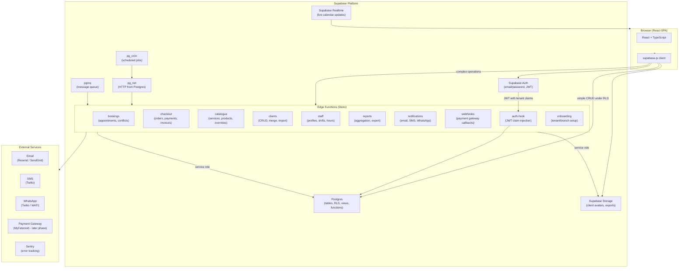
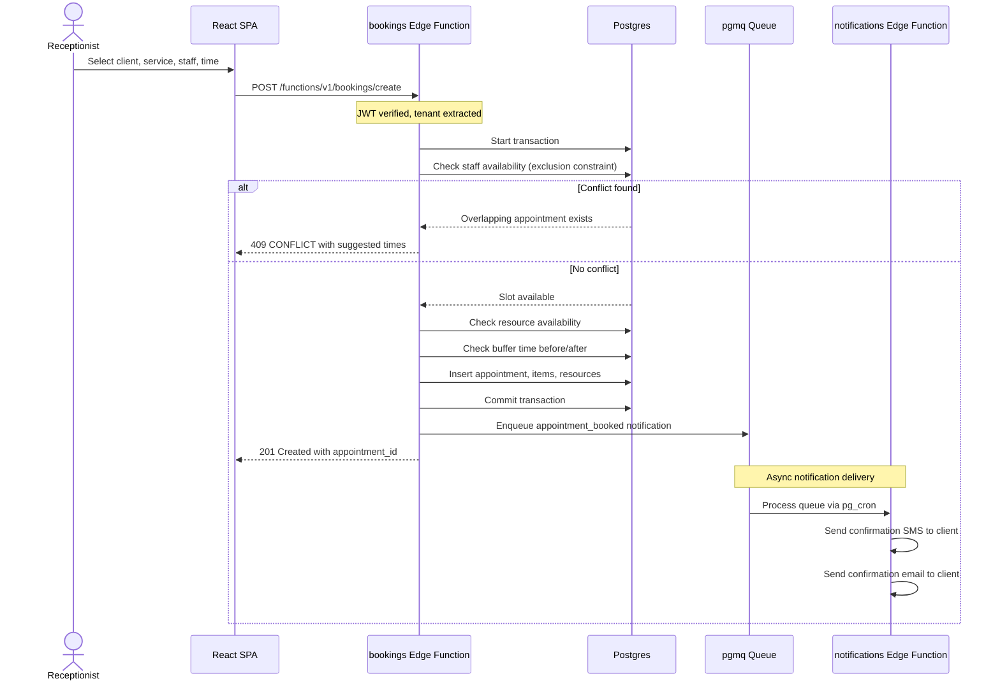
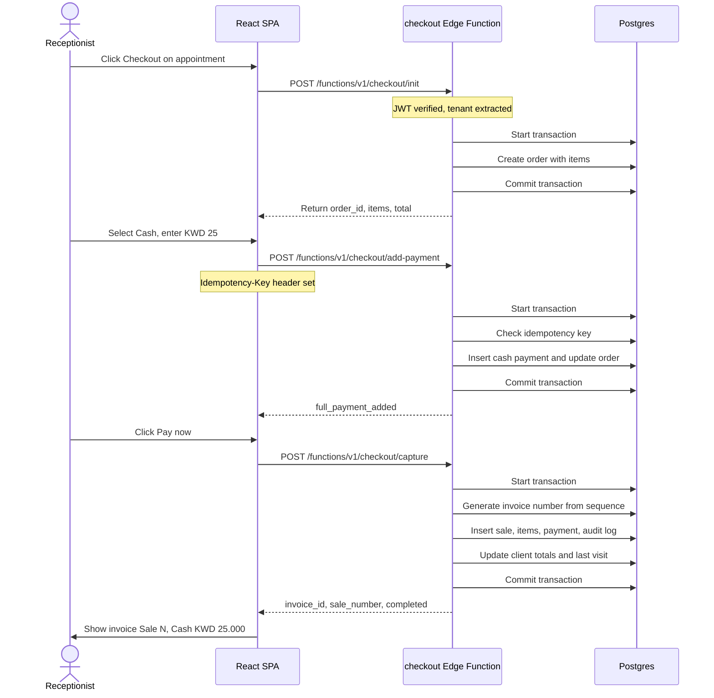

# Backend Architecture: Edge Functions and Conventions

Date: 2026-10-04
Author: linker (dashboard council)
Status: draft for council review

Based on: reverse-engineering reports in /Users/fahad/council/output/ (FINAL_REPORT.md, TECHNICAL_REPORT.md, technical/*.md). Supabase limits verified against https://supabase.com/docs/guides/functions/limits as of 2026-10-04.

---

## 1. Function granularity and isolation

### 1.1 Owner requirement

A failing or redeploying function must not take down the rest of the product. This rules out a monolith or a single router function: if one route throws an uncaught error or the deploy fails, the whole API surface goes down. Per-action functions (one function per endpoint) also fail this requirement at a different extreme: too many functions create operational overhead, and shared behaviour (auth, tenant context, validation, logging) requires code duplication across dozens of tiny functions.

### 1.2 Options considered

| Option | Isolation | Cold starts | Code sharing | Deploy blast radius |
|---|---|---|---|---|
| One router function | None — one crash takes everything | One cold start per deploy | Full sharing | Whole API |
| Per-action function | Best — one action, one function | Per action | Requires shared lib copied into each | Smallest |
| **Per bounded context** | Good — crash isolates a domain | Per context | Shared modules via `_shared/` | One domain |
| Per-tenant function | Poor — shared domain logic across tenants; multi-tenant by design | Per tenant | Duplication or dynamic routing | One tenant |

### 1.3 Proposal: one function per bounded context

Each function owns one business domain. A failing checkout function does not affect the calendar, the client list, or reports. A redeploying booking function does not take down checkout.

**MVP function list (10 functions):**

| Function name | Bounded context | Key operations |
|---|---|---|
| `bookings` | Appointment lifecycle | Create, reschedule, cancel, no-show, conflict check, buffer enforcement |
| `checkout` | Payment collection | Init order, add payments (cash/manual), capture, issue invoice |
| `catalogue` | Services and products | CRUD services, categories, branch overrides, products, suppliers |
| `clients` | Client management | Create, update, merge, search, import |
| `staff` | Team and scheduling | Staff profiles, branch assignments, shifts, working hours |
| `reports` | Reporting | Aggregation queries, export generation |
| `notifications` | Notifications | Send email/SMS/WhatsApp, reminder scheduling |
| `webhooks` | Payment webhooks | Receive gateway callbacks, idempotent processing |
| `auth-hook` | Custom access token | Supabase Auth Hook: inject tenant, branch, role claims into JWT |
| `onboarding` | Tenant and branch setup | Provision new tenant schema, seed defaults |

**Later-phase functions:** `loyalty`, `memberships`, `inventory`, `deals`, `online-booking`, `marketplace`, `pay-runs`, `timesheets`, `gift-cards`, `connect` (messaging).

### 1.4 Supabase limits and how we stay within them

Source: https://supabase.com/docs/guides/functions/limits

| Limit | Value | Impact on design |
|---|---|---|
| Max memory | 256 MB | Keep per-request allocations lean; stream large exports |
| Max duration (wall clock) | 150s free / 400s paid | Background work via queues, not long-running requests |
| Max CPU time | 2s per request | Push heavy computation to DB (views, functions); Edge Function orchestrates |
| Request idle timeout | 150s | All handlers must respond within this window; defer async work |
| Max function size | 20 MB local / 5 MB server-side | `_shared/` code tree must stay under ~5 MB after tree-shaking |
| Functions per project | 100 free / 1000 pro / 2000 team | 10 MVP functions fit easily; later-phase additions still well under limit |
| Log message length | 10,000 chars | Truncate long payloads; log only essential fields |
| Log event threshold | 100 per 10 seconds | Structured single-line logs; no per-request scatter |
| Secrets | 100 per project, 48 KiB each | Bundle related secrets into JSON; keep count under 50 |

### 1.5 Cold start strategy

Edge Functions on Deno start in ~50-200ms. Each bounded-context function handles multiple related endpoints via lightweight internal routing (URL path + method). This means one cold start per domain, not per endpoint. For latency-sensitive flows (booking conflict check), the function's isolate stays warm on the paid plan (400s wall clock, serving multiple requests). The free plan's 150s window is sufficient for development; production runs on a paid plan.

---

## 2. Read/write paths

### 2.1 Decision matrix

| Operation type | Path | Rationale |
|---|---|---|
| Simple single-table CRUD | `supabase-js` from frontend, under RLS | No server round-trip for reads; RLS enforces tenant/branch/role |
| Multi-table atomic writes | Edge Function with service role | RLS cannot enforce cross-table invariants; Postgres transaction needed |
| Reads with business logic | Edge Function | Computed fields, aggregation, permission checks beyond simple RLS |
| Operations with side effects | Edge Function | Notifications, audit logging, external API calls must not be in the browser |
| Operations with secrets | Edge Function | API keys, webhook secrets never reach the frontend |
| Scheduled/background work | pg_cron → Edge Function | No user request context; cron triggers the function |

### 2.2 What the frontend may do directly (supabase-js + RLS)

- List services for a branch (filtered by `branch_id`, `is_active`)
- Read client list (filtered by `tenant_id`)
- Read today's calendar (filtered by `branch_id`, `date`)
- Read own staff profile
- Read appointment details (owned by tenant)
- Read sale history
- Read report views (pre-computed by DB views)

All of these pass through RLS policies that enforce: the user's `tenant_id` (from JWT `app_metadata`), branch scope (for branch-scoped roles), and role capabilities (e.g. receptionist can read clients but not edit services).

### 2.3 What must go through an Edge Function

- **Create appointment**: conflict check against existing appointments, buffer time enforcement, resource availability check — all must run in one serializable transaction
- **Reschedule/cancel appointment**: update appointment + release slot + cancellation reason + notification trigger
- **Checkout**: init order → add payments → capture → create invoice → update sale ledger → update client history → trigger receipt. Multi-step with rollback on failure
- **Refund/void**: reverse a captured payment, update ledgers
- **Create service with branch overrides**: insert service row + insert branch-override rows atomically
- **Client merge**: deduplicate, reassign appointments/sales, archive old record
- **Bulk client import**: validate, transform, insert with error row reporting
- **Send notification**: call external SMS/email API with credentials
- **Generate export**: stream CSV/PDF from aggregated queries
- **Tenant onboarding**: create tenant record, provision defaults

### 2.4 When to use Postgres functions (RPC)

Postgres functions (`create function ... language sql/plpgsql`) are the right tool when atomicity and data locality matter more than external I/O:

- **Conflict check for booking**: exclusion constraints + `btree_gist` on `tstzrange` for staff and resources (see data-model.md section on integrity)
- **Invoice number generation**: `nextval` on a per-tenant, per-branch sequence, gapless within a tenant
- **Report aggregation**: heavy `GROUP BY` / window functions that would be slow to ship raw rows to the Edge Function
- **Audit logging trigger**: a Postgres trigger that writes every mutation to an audit table — no Edge Function involvement, guarantees capture even for direct supabase-js writes

Edge Functions call these via `supabase.rpc('function_name', params)` with the service role client.

---

## 3. Function anatomy

### 3.1 Folder layout

```
supabase/
  functions/
    _shared/               # Shared modules imported by all functions
      auth.ts              # JWT verification, tenant/branch extraction
      db.ts                # Supabase client factory (user vs service role)
      errors.ts            # Error classes, codes, HTTP mapping
      validation.ts        # Zod schemas shared across functions
      logging.ts           # Structured logging helper
      cors.ts              # CORS headers
      idempotency.ts       # Idempotency key validation and storage
      types.ts             # Shared TypeScript types
    bookings/
      index.ts             # Entry point: Deno.serve or withSupabase wrapper
      routes.ts            # Internal routing: POST /create, POST /cancel, etc.
      handlers.ts          # Per-route handler functions
      conflict-check.ts    # Booking conflict logic
      deno.json            # Imports map (npm: specifiers)
    checkout/
      index.ts
      routes.ts
      handlers.ts
      payment-capture.ts
    catalogue/
      ...
    clients/
      ...
    staff/
      ...
    reports/
      ...
    notifications/
      ...
    webhooks/
      ...
    auth-hook/
      index.ts             # Supabase Auth Hook: SQL function that calls Edge Function
    onboarding/
      ...
  migrations/              # SQL migrations (see data-model.md)
  config.toml              # Project config
```

### 3.2 Request handling pattern

Every function follows the same skeleton:

```typescript
// supabase/functions/bookings/index.ts
import { withSupabase } from 'npm:@supabase/server@1'
import { handleRequest } from '../_shared/routes.ts'

export default {
  fetch: withSupabase({ auth: 'user' }, async (req, ctx) => {
    return handleRequest(req, ctx, routes)
  }),
}
```

The `withSupabase` wrapper (from `@supabase/server`):
- `auth: 'user'` — validates the user's JWT, provides `ctx.supabase` (RLS-scoped) and `ctx.supabaseAdmin` (service role)
- `auth: 'secret'` — for cron/webhook callers, validates the secret key, provides `ctx.supabaseAdmin` only
- `auth: 'none'` — for public health checks and external webhooks where we verify the signature ourselves

The `ctx` object provides:
```typescript
{
  supabase: SupabaseClient,        // RLS-scoped to authenticated user
  supabaseAdmin: SupabaseClient,   // Service role, bypasses RLS
  userClaims: { id, email, role }, // From JWT
  jwtClaims: Record<string, any>,  // Full JWT including app_metadata
  authMode: 'user' | 'secret' | 'none'
}
```

### 3.3 Internal routing

Each function handles multiple related endpoints via a lightweight router:

```typescript
// supabase/functions/_shared/routes.ts
type RouteHandler = (req: Request, ctx: SupabaseContext) => Promise<Response>
type Routes = Record<string, Record<string, RouteHandler>>

export async function handleRequest(
  req: Request,
  ctx: SupabaseContext,
  routes: Routes,
): Promise<Response> {
  const url = new URL(req.url)
  const path = url.pathname.replace(/^\/functions\/v1\/\w+/, '')
  const method = req.method.toUpperCase()

  const handler = routes[path]?.[method]
  if (!handler) {
    return jsonError(404, 'NOT_FOUND', `No route for ${method} ${path}`)
  }

  try {
    return await handler(req, ctx)
  } catch (err) {
    return handleError(err)
  }
}
```

### 3.4 Input validation (Zod)

Every handler validates input before touching the database:

```typescript
import { z } from 'npm:zod@3'

const CreateBookingSchema = z.object({
  client_id: z.number().int().positive(),
  service_ids: z.array(z.number().int().positive()).min(1).max(10),
  staff_id: z.number().int().positive(),
  branch_id: z.number().int().positive(),
  start_time: z.string().datetime(),
  notes: z.string().max(2000).optional(),
})

// In handler:
const body = CreateBookingSchema.parse(await req.json())
```

Validation errors return 400 with field-level messages, ready for i18n on the frontend.

### 3.5 Authentication and tenant context

**Critical rule: never trust client-sent `tenant_id` or `branch_id`.** The JWT carries these claims (injected by the Supabase Auth Hook), and the backend reads ONLY from the JWT:

```typescript
// supabase/functions/_shared/auth.ts
interface TenantContext {
  tenantId: number
  branchIds: number[]       // All branches the user can access
  role: 'platform_admin' | 'tenant_owner' | 'branch_manager' | 'receptionist' | 'staff'
  userId: string
}

export function getTenantContext(ctx: SupabaseContext): TenantContext {
  const claims = ctx.jwtClaims.app_metadata
  if (!claims?.tenant_id) {
    throw new AuthError('TENANT_NOT_FOUND', 'No tenant claim in JWT')
  }
  return {
    tenantId: claims.tenant_id,
    branchIds: claims.branch_ids ?? [],
    role: claims.tenant_role ?? 'staff',
    userId: ctx.userClaims.id,
  }
}
```

When the handler needs to write data that includes `tenant_id` or `branch_id`, it uses these extracted values — never the request body. If the user specifies a `branch_id` in the body, the handler cross-checks it against `branchIds` from the JWT.

**User with multiple tenants:** The Supabase Auth Hook queries `memberships` and injects the *active* tenant into the JWT. Switching tenants triggers a token refresh. See the `auth-hook` function.

### 3.6 Database access rules

| Context | Client used | What it can do |
|---|---|---|
| User-facing read | `ctx.supabase` | RLS-scoped reads only |
| User-facing write validation | `ctx.supabaseAdmin` for lookups, `ctx.supabase` for the write | Verify ownership, then write through RLS |
| Multi-table transaction | `ctx.supabaseAdmin` | Atomic writes across tables |
| Cron/webhook | `ctx.supabaseAdmin` only | No user context; full service-role access |

When using `supabaseAdmin`, the handler is responsible for enforcing tenant isolation — it must always include `tenant_id = context.tenantId` in WHERE clauses and INSERT values.

### 3.7 Error model

```typescript
// supabase/functions/_shared/errors.ts
export class AppError extends Error {
  constructor(
    public code: string,       // Stable machine-readable code
    public message: string,    // English message (i18n on frontend)
    public status: number,
    public details?: unknown,  // Field-level errors for validation
  ) {
    super(message)
  }
}

// Error code catalogue
const ErrorCodes = {
  VALIDATION_ERROR:     { status: 400 },
  UNAUTHORIZED:         { status: 401 },
  FORBIDDEN:            { status: 403 },
  NOT_FOUND:            { status: 404 },
  CONFLICT:             { status: 409 },  // Double booking, duplicate
  IDEMPOTENCY_MISMATCH: { status: 422 },
  RATE_LIMITED:         { status: 429 },
  INTERNAL_ERROR:       { status: 500 },
  SERVICE_UNAVAILABLE:  { status: 503 },
} as const
```

Every error response follows this shape:
```json
{
  "error": {
    "code": "CONFLICT",
    "message": "The requested time slot is not available",
    "details": {
      "conflicting_appointment_id": 12345,
      "suggested_times": ["2026-10-05T11:00:00+03:00"]
    }
  }
}
```

### 3.8 Idempotency keys

Mutations that move money (checkout, refund) accept an `Idempotency-Key` header. The function:

1. Extracts the key from the header (client-generated UUID)
2. Checks `idempotency_keys` table: `SELECT status, response FROM idempotency_keys WHERE key = $1 AND tenant_id = $2`
3. If found and `status = 'completed'`, returns the cached response (same status code, body, headers)
4. If found and `status = 'processing'`, returns 409 CONFLICT ("request in progress")
5. If not found, inserts `(key, tenant_id, status='processing')` and proceeds
6. On success, updates to `status='completed'` with the serialized response
7. On failure, updates to `status='failed'` (client may retry with a new key)

This is enforced at the database level with a UNIQUE constraint on `(key, tenant_id)`.

### 3.9 Logging and tracing

```typescript
// supabase/functions/_shared/logging.ts
export function log(event: string, data: Record<string, unknown>) {
  console.log(JSON.stringify({
    ts: new Date().toISOString(),
    event,
    ...data,
  }))
}
```

Every request logs one line: `{ event: 'request', method, path, tenantId, userId, requestId }`. Every error logs: `{ event: 'error', code, message, requestId, stack }`. Request IDs (UUID) are generated on entry and threaded through all logs — they enable tracing across functions when one function calls another.

Supabase Edge Functions do not currently support OpenTelemetry. We log structured JSON and consume it via Supabase Logs. For production, we ship logs to an external service (e.g. Better Stack, Axiom) via the Supabase Log Drains feature.

### 3.10 CORS

```typescript
// supabase/functions/_shared/cors.ts
export const corsHeaders = {
  'Access-Control-Allow-Origin': '*',  // Tighten in production to the frontend origin
  'Access-Control-Allow-Headers': 'authorization, x-client-info, apikey, content-type, idempotency-key',
  'Access-Control-Allow-Methods': 'GET, POST, PUT, DELETE, OPTIONS',
}

export function corsResponse(body: unknown, status = 200): Response {
  return new Response(JSON.stringify(body), {
    status,
    headers: { ...corsHeaders, 'Content-Type': 'application/json' },
  })
}
```

OPTIONS preflight requests are handled at the top of every function entry point.

---

## 4. Async and scheduled work

### 4.1 Architecture

```
pg_cron (Postgres scheduler)
  → pg_net (HTTP client inside Postgres)
    → Edge Function (HTTP request)
      → Business logic (DB writes, external API calls)
```

### 4.2 Notification delivery

**Providers:**

| Channel | Provider | Why |
|---|---|---|
| Email | Resend or SendGrid | Simple API, good deliverability to Gmail/Outlook; SendGrid has a free tier for MVP |
| SMS | Twilio | Global coverage, Kuwait numbers supported, well-documented API |
| WhatsApp | Twilio (WhatsApp Business API) or WATI | WATI has strong Arabic support and is popular in the Gulf region |

**Flow:**

1. An event occurs (appointment booked, reminder due, payment received)
2. A Postgres trigger or Edge Function inserts a row into `notification_queue`
3. `pg_cron` triggers the `notifications` Edge Function every 60 seconds
4. The function reads pending notifications (batch of 50), sends via provider API, marks as sent
5. Failed deliveries are retried with exponential backoff (next_retry_at column)
6. After 5 failures, the notification is marked `failed` and logged for manual review

**Appointment reminders:** A separate cron job (`*/30 * * * *`) finds appointments in the next 72 hours and enqueues reminder notifications. The automations system in later phases will let tenants configure reminder timing.

### 4.3 Queues (pgmq)

For operations that need guaranteed processing with retries:

- **Checkout capture retry:** If the payment gateway times out, the capture request goes to a queue for retry
- **Export generation:** Large CSV/PDF exports are queued and processed asynchronously
- **Client import:** Bulk CSV import is split into chunks and processed via queue

Supabase Queues (built on `pgmq` extension) provides exactly-once delivery with visibility timeouts. An Edge Function reads messages via `supabase.schema('pgmq_public').rpc('read', ...)`, processes each, and archives (deletes) on success. Failed messages become visible again after the visibility timeout.

### 4.4 Scheduled jobs (pg_cron)

| Job | Schedule | Function | Purpose |
|---|---|---|---|
| Notification dispatch | Every 60s | `notifications` | Send queued email/SMS/WhatsApp |
| Reminder enqueue | Every 30 min | `notifications` | Find upcoming appointments, enqueue reminders |
| Report materialisation | Daily at 02:00 tenant local time | `reports` | Refresh materialised views for fast dashboard loads |
| Idempotency key cleanup | Daily at 03:00 UTC | Bookings or checkout | Delete keys older than 30 days |
| Session cleanup | Daily at 04:00 UTC | `auth-hook` | Remove expired sessions from auth tables |
| Payment reconciliation | Daily at 06:00 tenant local | `webhooks` | Cross-check gateway reports against local sales |

### 4.5 Database webhooks vs polling

Supabase Database Webhooks (sending events to Edge Functions on table changes) are available but we prefer `pg_cron` + queue for the MVP because:
- Webhooks fire per-row with no batching; a bulk import of 500 clients fires 500 separate function invocations
- Cron-based polling lets us batch work and control concurrency
- Webhooks are useful in later phases for real-time features (e.g. instant notification on new appointment)

---

## 5. Payments

### 5.1 MVP: manual payments only

The MVP supports cash and manual card payments (recorded, not processed). Checkout flow:

1. Receptionist opens checkout for an appointment or walk-in sale
2. Selects payment method: Cash, Card (manual), or Bank Transfer
3. Enters amount (with support for split payments across methods)
4. Completes the sale → invoice generated, sale recorded

No payment gateway integration in MVP. This matches the brief's scope and avoids the 5-10 business day KYC process blocking launch.

### 5.2 Online payment gateway (later phase)

**Requirement:** KNET support is mandatory for Kuwait. Without KNET, we lose 55-70% of potential online transactions.

**Comparison:**

| Criterion | MyFatoorah | Tap Payments | KNET Direct |
|---|---|---|---|
| KNET fee | ~2.0% | ~2.85% + fixed | ~0.100 KWD flat |
| Card fee | ~3.5% | ~2.85% + fixed | N/A (separate acquirer) |
| KNET approval rate | 93% | 91% | Native (highest) |
| Setup time | 5-10 business days | 3-7 business days | 2-6 weeks (bank) |
| Apple Pay | Yes | Yes | No |
| GCC coverage | KW, KSA, UAE, BH, QA, OM | Full GCC + Egypt | Kuwait only |
| Shopify/WooCommerce app | Yes | Yes | No |
| Marketplace splits | Yes (best in class) | Yes (Tap Connect) | No |
| Arabic invoicing | Built-in | Template-based | No |
| Recurring billing | Yes | Yes | No |
| Refund API | Yes | Yes | Manual |
| Developer docs | Good | Best in market | Sparse |

**Proposal: MyFatoorah for the first online-payment phase.**

Rationale:
- Kuwait is our first market (SpaCorner). MyFatoorah is Kuwait-HQ'd with the lowest KNET fees (~2.0% vs 2.85%) and the highest KNET approval rate (93%).
- Built-in Arabic invoicing and payment links are valuable for a spa/salon where clients may pay via links.
- If we later expand to the full GCC, we can add Tap as a second gateway (their API is clean, multi-country support is strong) rather than switching — the `webhooks` function already abstracts gateway differences behind a common interface.
- For a marketplace scenario (future B2B where salons sell through our platform), MyFatoorah's split-payout feature is the best in the region.

### 5.3 Webhook handling pattern

```typescript
// supabase/functions/webhooks/handlers.ts
// Common interface for all payment gateways
interface PaymentWebhook {
  gateway: 'myfatoorah' | 'tap'
  event: string                    // 'payment.captured', 'payment.failed', 'refund.processed'
  gatewayReference: string         // Gateway's transaction ID
  amount: number
  currency: string
  metadata: { saleId: number }     // Our internal sale ID
  raw: unknown                     // Original webhook body for audit
}

async function handlePaymentWebhook(webhook: PaymentWebhook): Promise<void> {
  // 1. Idempotency: check if this gateway_reference was already processed
  const existing = await db.idempotencyCheck(webhook.gatewayReference)
  if (existing) return // Already processed

  // 2. Find our sale by metadata.saleId
  const sale = await db.findSale(webhook.metadata.saleId)

  // 3. Verify amount and currency match
  if (sale.total !== webhook.amount || sale.currency !== webhook.currency) {
    await db.logDiscrepancy('AMOUNT_MISMATCH', webhook, sale)
    throw new Error('Amount mismatch')
  }

  // 4. Update sale status, create payment record, update ledgers
  await db.capturePayment(sale.id, webhook)

  // 5. Trigger receipt notification
  await db.enqueueNotification('payment_received', sale.client_id, sale.id)
}
```

Gateway-specific verification (MyFatoorah's HMAC signature, Tap's webhook secret) happens before the common handler is called. Each gateway has its own verification function in `webhooks/verification.ts`.

---

## 6. Environments and delivery

### 6.1 Local development

```bash
supabase init            # Creates supabase/ directory
supabase start           # Starts local Postgres, Auth, Storage, Edge Functions runtime
supabase functions serve # Starts local Deno server with hot reload
```

Local development uses Docker for the full Supabase stack. Edge Functions run natively via Deno with file-watch and hot reload. The `supabase functions serve` command exposes functions at `http://localhost:54321/functions/v1/<name>`.

Environment variables for local dev go in `supabase/.env.local` (never committed). Secrets for deployed functions go via `supabase secrets set`.

### 6.2 Branching and preview environments

Supabase supports preview branches linked to Git branches. Each preview branch gets:
- Its own Postgres database (migrated from the branch's migration files)
- Its own Auth instance
- Edge Functions deployed from the branch

We use this for staging: merge to `staging` → preview branch auto-deploys → manual QA → merge to `main` → production deploy.

### 6.3 Secrets management

```
# Set a secret for production
supabase secrets set MYFATOORAH_API_KEY=sk_live_xxx

# Set a secret for a specific branch
supabase secrets set --branch staging MYFATOORAH_API_KEY=sk_test_xxx

# List secrets (values hidden)
supabase secrets list
```

Secrets are encrypted at rest and injected as environment variables into Edge Function isolates. They are never visible in the Supabase Dashboard after being set.

**Secret naming convention:**
- `PROVIDER_API_KEY` for third-party API keys
- `PROVIDER_WEBHOOK_SECRET` for webhook signing secrets
- `PROVIDER_*` prefix groups related secrets
- Bundle related config as JSON when needed: `SMTP_CONFIG='{"host":"...","port":587,"user":"...","pass":"..."}'`

### 6.4 CI/CD pipeline

```yaml
# .github/workflows/ci.yml
name: CI
on:
  pull_request:
    branches: [main, staging]

jobs:
  typecheck:
    runs-on: ubuntu-latest
    steps:
      - uses: actions/checkout@v4
      - uses: denoland/setup-deno@v2
        with:
          deno-version: '2.x'
      - run: deno check supabase/functions/**/*.ts

  lint:
    runs-on: ubuntu-latest
    steps:
      - uses: actions/checkout@v4
      - uses: denoland/setup-deno@v2
      - run: deno lint supabase/functions/

  test:
    runs-on: ubuntu-latest
    steps:
      - uses: actions/checkout@v4
      - uses: supabase/setup-cli@v1
      - run: supabase start
      - run: supabase functions serve &
      - run: deno test --allow-all supabase/functions/

  migration-check:
    runs-on: ubuntu-latest
    steps:
      - uses: actions/checkout@v4
      - uses: supabase/setup-cli@v1
      - run: supabase db lint
      - run: supabase db test  # Runs pgTAP tests against a fresh DB
```

```yaml
# .github/workflows/deploy.yml
name: Deploy
on:
  push:
    branches: [main]

jobs:
  deploy-functions:
    runs-on: ubuntu-latest
    env:
      SUPABASE_ACCESS_TOKEN: ${{ secrets.SUPABASE_ACCESS_TOKEN }}
      SUPABASE_PROJECT_ID: ${{ secrets.SUPABASE_PROJECT_ID }}
    steps:
      - uses: actions/checkout@v4
      - uses: supabase/setup-cli@v1
      - run: supabase functions deploy --use-api --project-ref $SUPABASE_PROJECT_ID

  deploy-migrations:
    runs-on: ubuntu-latest
    env:
      SUPABASE_ACCESS_TOKEN: ${{ secrets.SUPABASE_ACCESS_TOKEN }}
      SUPABASE_PROJECT_ID: ${{ secrets.SUPABASE_PROJECT_ID }}
    steps:
      - uses: actions/checkout@v4
      - uses: supabase/setup-cli@v1
      - run: supabase db push --project-ref $SUPABASE_PROJECT_ID
```

Note: `--use-api` deploys without requiring Docker in CI, and handles concurrent deploys safely (no race condition when deploying multiple functions in parallel). Source: https://github.com/orgs/supabase/discussions/33613

### 6.5 Deploy strategy: per-function

We deploy all functions together (`supabase functions deploy` with no `--slug` flag). Since functions are isolated, a failed deploy for one function leaves the others running. The `--use-api` flag is recommended for CI to avoid Docker overhead.

**Rollback:** Deploying an older commit redeploys all functions with the previous code. Supabase keeps the last few deploys accessible. For targeted rollback, `supabase functions deploy --slug bookings` deploys only one function.

### 6.6 Function API versioning

Edge Functions are accessed at `https://<project>.supabase.co/functions/v1/<name>`. The `/v1/` prefix is fixed by Supabase. We version our API explicitly in the route path:

```
POST /functions/v1/bookings/create           # v1
POST /functions/v1/bookings/v2/create        # v2 (breaking change path)
```

The frontend references the version it was built against. When we make a breaking change:
1. Deploy `v2` route alongside `v1`
2. Update frontend to use `v2`
3. After frontend rollout is complete, remove `v1` route in a subsequent deploy

This avoids the frontend breaking when the backend deploys first, or vice versa.

### 6.7 Backward compatibility with the frontend

The frontend and backend are in the same repository (monorepo). A PR that changes a function's API MUST include the corresponding frontend changes. The CI pipeline typechecks both and runs integration tests. We do not deploy frontend and backend independently — the deploy workflow pushes both together from `main`.

---

## 7. Observability and reliability

### 7.1 Logs

All Edge Function logs appear in the Supabase Dashboard under Logs → Edge Functions. We use structured JSON logging (section 3.9). Key events logged:

| Event | When | Fields |
|---|---|---|
| `request` | Every function invocation | method, path, tenantId, userId, requestId |
| `response` | Every function completion | status, duration_ms, requestId |
| `error` | Unhandled exceptions | code, message, stack, requestId |
| `db_query` | Slow queries (>500ms) | query, duration_ms, requestId |
| `external_api` | Third-party API calls | provider, endpoint, duration_ms, status, requestId |
| `payment` | Payment operations | gateway, event, amount, saleId, requestId |

### 7.2 Error tracking

We use Sentry for error tracking, configured via the `npm:@sentry/deno` package. Source maps are uploaded during deploy so stack traces resolve to the original TypeScript source.

```typescript
import * as Sentry from 'npm:@sentry/deno'

Sentry.init({
  dsn: Deno.env.get('SENTRY_DSN')!,
  environment: Deno.env.get('SUPABASE_BRANCH') ?? Deno.env.get('ENVIRONMENT') ?? 'development',
  tracesSampleRate: 0.1,
})
```

Unhandled exceptions are caught by `withSupabase` and logged. The `handleError` function in `_shared/errors.ts` reports to Sentry for 5xx errors.

### 7.3 Health checks

Each function exposes `GET /health` (auth: 'none'):

```typescript
routes: {
  '/health': {
    'GET': async (_req, ctx) => {
      // Check DB connectivity
      const { error } = await ctx.supabaseAdmin.from('tenants').select('id').limit(1)
      if (error) {
        return corsResponse({ status: 'unhealthy', db: false }, 503)
      }
      return corsResponse({ status: 'healthy', db: true })
    }
  }
}
```

Supabase does not currently offer built-in health-check uptime monitoring for Edge Functions. We set up an external monitor (e.g. Better Stack, Checkly) that pings `/health` on each function every 60 seconds.

### 7.4 Rate limiting and abuse protection

Supabase provides built-in rate limiting on Edge Functions (configurable per function via `supabase/config.toml` or the Dashboard). We set:

```toml
[functions.bookings]
enabled = true

[functions.bookings.rate_limit]
max_concurrent_requests = 20
```

Additionally, we implement per-tenant rate limiting in `_shared/rate-limit.ts` for sensitive endpoints (checkout capture, client import):

```typescript
// Track requests per tenant in Postgres or in-memory
// Return 429 with Retry-After header when exceeded
```

For the MVP, the built-in Supabase rate limiting is sufficient. We add per-tenant limits in the first post-MVP iteration.

### 7.5 Timeouts

Every function handler wraps long operations in a timeout:

```typescript
async function withTimeout<T>(promise: Promise<T>, ms: number): Promise<T> {
  const timeout = new Promise<never>((_, reject) =>
    setTimeout(() => reject(new Error('Operation timed out')), ms)
  )
  return Promise.race([promise, timeout])
}
```

- User-facing handlers: 30s timeout (well under the 150s idle timeout)
- Cron-triggered handlers: 120s timeout (under the 150s idle, but allows batch processing)
- Report export: 5s to start the job, then async queue (see section 4.3)

### 7.6 CPU time management

The 2-second CPU time limit per request is the binding constraint. Strategies:
- Push aggregation and filtering to the database (Postgres is not counted against the Edge Function CPU)
- Stream large responses rather than buffering in memory
- Use `Promise.all` for independent I/O (network calls don't consume CPU time)
- Profile with `Deno.core.metrics()` to find CPU-heavy code paths

---

## 8. Diagrams

### 8.1 Component diagram



### 8.2 Sequence diagram: Book appointment



### 8.3 Sequence diagram: Checkout with cash



---

## 9. Skill draft: supabase-edge-functions

Draft skill file at `/Users/fahad/council/output/plan/skill-drafts/supabase-edge-functions.md`.

### Skill content

```markdown
---
name: supabase-edge-functions
description: Use when creating, editing, or deploying Supabase Edge Functions in this project. Covers file layout, shared modules, request/response conventions, auth and tenant context extraction, input validation, database access rules, idempotency, testing with deno test, local run, and deploy commands.
---

# Supabase Edge Functions

## Quick start: creating a new function

```bash
# 1. Create the function directory (slug must match function name)
mkdir -p supabase/functions/my-function

# 2. Create deno.json with imports
cat > supabase/functions/my-function/deno.json << 'EOF'
{
  "imports": {
    "npm:@supabase/server@1": "npm:@supabase/server@1",
    "npm:zod@3": "npm:zod@3"
  }
}
EOF

# 3. Create index.ts
cat > supabase/functions/my-function/index.ts << 'ENDFUNC'
import { withSupabase } from 'npm:@supabase/server@1'
import { handleRequest } from '../_shared/routes.ts'

const routes = {
  '/health': {
    'GET': async (_req, ctx) => {
      return new Response(JSON.stringify({ status: 'healthy' }), {
        headers: { 'Content-Type': 'application/json' }
      })
    }
  }
}

export default {
  fetch: withSupabase({ auth: 'user' }, async (req, ctx) => {
    return handleRequest(req, ctx, routes)
  }),
}
ENDFUNC

# 4. Run locally
supabase functions serve --env-file supabase/.env.local
```

## File layout

Each function is a directory under `supabase/functions/<name>/` containing:
- `index.ts` — entry point with `withSupabase` wrapper
- `routes.ts` — internal route definitions (path + method → handler)
- `handlers.ts` — per-route handler logic (thin, delegates to services)
- `deno.json` — import map for npm: specifiers

Shared modules live in `supabase/functions/_shared/` and are imported with relative paths:
```typescript
import { getTenantContext } from '../_shared/auth.ts'
import { AppError } from '../_shared/errors.ts'
import { corsResponse } from '../_shared/cors.ts'
```

## Import rules

- Use `npm:` specifiers for third-party packages (zod, @supabase/server, @sentry/deno)
- Use relative imports for `_shared/` modules (do NOT use import maps for them)
- Do NOT import from the frontend (`src/`) — functions have their own types
- Deno standard library: `https://deno.land/std@0.224.0/...` or `jsr:@std/...`
- `deno cache` the deps in CI to speed up cold starts

## Auth modes

| Mode | Use for | Config |
|---|---|---|
| `{ auth: 'user' }` | User-facing endpoints | Default; JWT required |
| `{ auth: 'secret' }` | Cron jobs, other functions, pg_net | `verify_jwt = false` in config.toml |
| `{ auth: 'none' }` | Health checks, external webhooks | `verify_jwt = false` in config.toml |

## Tenant context extraction

ALWAYS extract tenant info from JWT claims, NEVER from the request body:

```typescript
import { getTenantContext } from '../_shared/auth.ts'

async function handler(req: Request, ctx: SupabaseContext) {
  const tenant = getTenantContext(ctx)
  // tenant = { tenantId, branchIds, role, userId }

  // WRONG: const tenantId = body.tenant_id
  // RIGHT: const tenantId = tenant.tenantId
}
```

## Database access

- Use `ctx.supabase` for reads that should go through RLS
- Use `ctx.supabaseAdmin` for writes where you enforce tenant isolation yourself
- When using `supabaseAdmin`, ALWAYS include `.eq('tenant_id', tenant.tenantId)` in every query
- Wrap multi-table writes in a Postgres transaction via `.rpc()` or raw SQL

## Error conventions

Throw `AppError` from `_shared/errors.ts`, never raw strings:

```typescript
throw new AppError('CONFLICT', 'Time slot unavailable', 409, {
  conflicting_appointment_id: 123,
})
```

Available error codes: VALIDATION_ERROR, UNAUTHORIZED, FORBIDDEN, NOT_FOUND, CONFLICT, IDEMPOTENCY_MISMATCH, RATE_LIMITED, INTERNAL_ERROR, SERVICE_UNAVAILABLE.

## Idempotency

Mutations involving money MUST accept an `Idempotency-Key` header. Check the `idempotency_keys` table at the start of the handler:

```typescript
const idempotencyKey = req.headers.get('Idempotency-Key')
if (idempotencyKey) {
  const cached = await ctx.supabaseAdmin
    .from('idempotency_keys')
    .select('status, response')
    .eq('key', idempotencyKey)
    .eq('tenant_id', tenant.tenantId)
    .single()

  if (cached.data?.status === 'completed') {
    return new Response(cached.data.response.body, {
      status: cached.data.response.status,
      headers: cached.data.response.headers,
    })
  }
  // Insert 'processing' record before proceeding
}
```

## Testing with deno test

```typescript
// supabase/functions/bookings/handlers.test.ts
import { assertEquals } from 'https://deno.land/std@0.224.0/assert/mod.ts'

Deno.test('conflict check rejects overlapping booking', async () => {
  // Arrange: insert an existing appointment
  // Act: call conflict check with overlapping time
  // Assert: CONFLICT error returned
})
```

Run: `deno test --allow-all supabase/functions/`

## Local run

```bash
supabase start                      # Start all services
supabase functions serve            # Start Edge Functions runtime
# Functions available at http://localhost:54321/functions/v1/<name>
```

## Deploy

```bash
# Deploy all functions
supabase functions deploy --use-api

# Deploy one function
supabase functions deploy --slug bookings --use-api

# Set secrets before deploy
supabase secrets set --env-file supabase/.env.production
```
```

---

## 10. Proposed decisions

### PD-BACKEND-1: Function granularity — one per bounded context

- **Context:** Owner requires that a failing/redeploying function never takes down the rest of the product. Single-router monolith fails this. Per-action functions create too much duplication.
- **Options considered:** Monolith router (rejected: blast radius too large), per-action (rejected: code duplication, cold-start overhead), per bounded context (chosen).
- **Proposal:** 10 functions for MVP, one per business domain (bookings, checkout, catalogue, clients, staff, reports, notifications, webhooks, auth-hook, onboarding).
- **Consequences:** Shared code lives in `_shared/` and is imported by each function. Deploying one function does not affect others. Cold starts are per-domain (not per-action or per-API-call). Function count stays under the 100 free limit.

### PD-BACKEND-2: Direct supabase-js for simple CRUD, Edge Functions for transactions

- **Context:** Supabase offers RLS + PostgREST for direct database access from the browser. Edge Functions add a server round-trip. Choosing when to use each affects latency, security, and development speed.
- **Options considered:** All-through-Edge-Functions (rejected: every read gets 200ms+ latency from the function hop), all-direct-with-RLS (rejected: cannot enforce cross-table invariants), hybrid (chosen).
- **Proposal:** Simple single-table reads and writes go through supabase-js with RLS. Multi-table transactions, operations with side effects, and anything involving secrets go through Edge Functions.
- **Consequences:** RLS policies must be comprehensive, tested, and audited. Edge Functions must enforce tenant isolation when using service-role access. Frontend developers must understand which path to use for each operation.

### PD-BACKEND-3: Tenant context from JWT claims (never request body)

- **Context:** A multi-tenant app must prevent cross-tenant data access. If the frontend sends `tenant_id` in the request body, a malicious or buggy client can access another tenant's data.
- **Options considered:** Client-sent IDs with backend verification (rejected: too easy to miss a check), JWT claims via Auth Hook (chosen).
- **Proposal:** The `auth-hook` Edge Function injects `tenant_id`, `branch_ids`, and `tenant_role` into the JWT's `app_metadata`. All Edge Functions read these from `ctx.jwtClaims.app_metadata` — never from the request body. RLS policies use `auth.jwt() -> 'app_metadata' ->> 'tenant_id'`.
- **Consequences:** Auth Hook must be deployed and tested before any other function. Token refresh is needed on tenant switch. JWT size must be monitored (adding branch_ids for a user with 50+ branches may bloat the token).

### PD-BACKEND-4: MyFatoorah as first online payment gateway (later phase)

- **Context:** Online payments are not in MVP. When we add them, KNET support is mandatory for Kuwait (55-70% of transactions). We need to choose one gateway for the first phase.
- **Options considered:** Tap Payments (better multi-country API, faster onboarding), MyFatoorah (lower KNET fees, better approval rate, Kuwait HQ, built-in Arabic invoicing), KNET Direct (lowest fees but requires separate card acquirer, 2-6 week bank setup).
- **Proposal:** MyFatoorah. SpaCorner is Kuwait-only. MyFatoorah's ~2.0% KNET fee vs Tap's ~2.85% saves meaningful money at scale. Their 93% KNET approval rate and built-in Arabic invoicing are better for our use case. Tap can be added as a second gateway for GCC expansion.
- **Consequences:** The `webhooks` function must abstract gateway differences behind a common `PaymentWebhook` interface so adding Tap later is a new verification function, not a rewrite. MyFatoorah's documentation is "good" but not "best in market" — expect integration to take 20-27 hours.

### PD-BACKEND-5: Postgres exclusion constraints for double-booking prevention

- **Context:** Booking conflicts must be prevented at the database level. Application-level checks have race conditions.
- **Options considered:** Application-level check with `SELECT ... FOR UPDATE` (acceptable but requires careful locking), Postgres exclusion constraints with `btree_gist` (chosen — strongest guarantee).
- **Proposal:** Use exclusion constraints on `tstzrange` columns for staff and resource availability. `ALTER TABLE appointments ADD CONSTRAINT no_double_book_staff EXCLUDE USING gist (staff_id WITH =, branch_id WITH =, scheduled_range WITH &&) WHERE status NOT IN ('cancelled', 'no_show')`. The booking Edge Function still does a pre-check for a better error message, but the constraint is the final guard.
- **Consequences:** Requires `btree_gist` extension. Exclusion constraints only work within a single Postgres instance — fine for our single-database Supabase setup. The error message from a constraint violation is less user-friendly than application-level errors, so the Edge Function must catch and translate it.

### PD-BACKEND-6: pg_cron + pgmq for async work (not Supabase Database Webhooks)

- **Context:** Notifications, reminders, export generation, and other async work need a reliable trigger mechanism.
- **Options considered:** Supabase Database Webhooks (per-row triggers → HTTP), pg_cron + pgmq (chosen), external queue (overkill for MVP).
- **Proposal:** pg_cron schedules Edge Function invocations via pg_net. pgmq handles queued work with visibility timeouts and retries. Database Webhooks are deferred to later phases for real-time features.
- **Consequences:** Notification delivery has up to 60-second latency (cron interval). This is acceptable for appointment reminders (sent hours/days ahead) and confirmations (seconds don't matter for email/SMS). For real-time in-app notifications, we will use Supabase Realtime (WebSocket) in a later phase.

---

## References

- Supabase Edge Functions limits: https://supabase.com/docs/guides/functions/limits
- Supabase Edge Functions auth: https://supabase.com/docs/guides/functions/auth
- Scheduling functions with pg_cron: https://supabase.com/docs/guides/functions/schedule-functions
- Consuming queues with Edge Functions: https://supabase.com/docs/guides/queues/consuming-messages-with-edge-functions
- Supabase Queues (pgmq): https://supabase.com/docs/guides/queues
- RLS best practices: https://makerkit.dev/blog/tutorials/supabase-rls-best-practices
- Multi-tenant RLS pattern: https://github.com/Tiao553/opencode-harness/blob/main/kb/supabase/patterns/multi-tenant-rls.md
- Deploy to production: https://supabase.com/docs/guides/functions/deploy
- GitHub Actions CI/CD: https://supabase.com/docs/guides/functions/examples/github-actions
- Deploy without Docker (--use-api): https://github.com/orgs/supabase/discussions/33613
- Payment gateway comparison (Kuwait): https://kuwaitdev.com/en/insights/myfatoorah-vs-knet-vs-tap-comparison