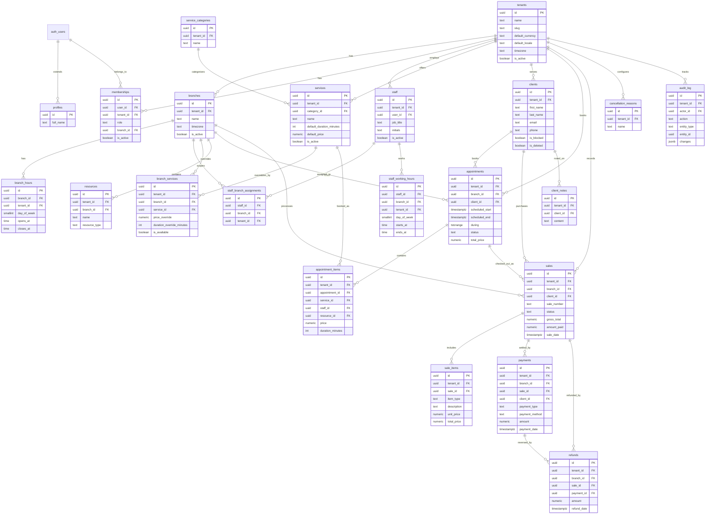
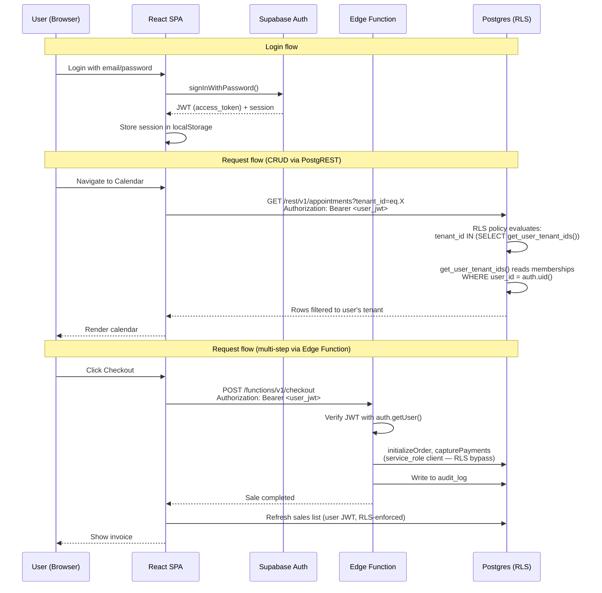

# Data model, multi-tenancy, and database conventions

Author: linker (dashboard council member)
Date: 2026-10-04
Inputs: FINAL_REPORT.md, TECHNICAL_REPORT.md, Supabase docs (auth hooks, RLS, Edge Functions, migrations)

---

## 1. Tenancy model

### 1.1 Core structure

The product is a multi-tenant SaaS where a tenant is a company (e.g. SpaCorner). Each tenant has multiple branches (locations). Users belong to a tenant through a membership that carries a role and optional branch scope.

```
tenant (company)
  └── branches (locations)
       └── staff assignments, services with branch overrides, resources/rooms
  └── memberships (user x tenant x role x branch_scope)
  └── clients (belong to tenant, visit any branch)
```

### 1.2 How tenant_id and branch_id reach Postgres

**Proposal: database-lookup pattern (security definer helper)**

The user's JWT from Supabase Auth carries `auth.uid()`. We do NOT embed `tenant_id` or `branch_id` in JWT claims — that approach has a stale-token problem: removing a user from a tenant would not take effect until their token expires.

Instead, every RLS policy calls a `SECURITY DEFINER` helper function that looks up the user's current tenant and branch scope from the `memberships` table on every query. The helper runs as the function owner (bypassing RLS on memberships itself) and is marked `STABLE` so Postgres caches the result per statement.

**Alternative considered:** JWT claims via Supabase custom access token hook. Rejected because membership changes (offboarding, role change) need immediate effect without forcing token refresh. The lookup adds one indexed query per statement, which is negligible with proper indexes.

**What happens when a user belongs to multiple tenants:** The helper returns all tenant_ids the user belongs to. The frontend maintains an "active tenant" in application state (React context). API calls include `x-tenant-id` header. Edge Functions validate the user belongs to that tenant. RLS policies check `tenant_id IN (SELECT get_user_tenant_ids())`. The frontend provides a tenant switcher.

### 1.3 Branch scoping

A user's membership record may have `branch_id = NULL` (all branches) or a specific `branch_id`. The RLS helper returns both the tenant membership and the branch scope. Branch-scoped roles (e.g. receptionist at Branch A) see only their branch's data.

```sql
-- Returns set of tenant_ids the current user belongs to
CREATE OR REPLACE FUNCTION public.get_user_tenant_ids()
RETURNS SETOF uuid
LANGUAGE sql STABLE SECURITY DEFINER
SET search_path = public
AS $$
  SELECT tenant_id FROM public.memberships
  WHERE user_id = auth.uid();
$$;

-- Returns set of (tenant_id, branch_id) pairs for branch-scoped checks
CREATE OR REPLACE FUNCTION public.get_user_branch_scope()
RETURNS TABLE(tenant_id uuid, branch_id uuid)
LANGUAGE sql STABLE SECURITY DEFINER
SET search_path = public
AS $$
  SELECT tenant_id, branch_id FROM public.memberships
  WHERE user_id = auth.uid();
$$;
```

Source: Supabase RLS docs (https://supabase.com/docs/guides/database/postgres/row-level-security), community pattern (https://supabase.com/docs/guides/auth/auth-hooks/custom-access-token-hook), security definer pattern (https://socialanimal.dev/blog/supabase-rls-multi-tenant-production-schema/).

---

## 2. MVP schema

### 2.1 Naming conventions

- Table names: plural, snake_case (`tenants`, `branches`, `clients`)
- Column names: snake_case, no prefixes (`name`, not `tenant_name`)
- Primary keys: `id uuid PRIMARY KEY DEFAULT gen_random_uuid()`
- Foreign keys: `{entity}_id` referencing `{entity}s(id)`
- Timestamps: `created_at timestamptz NOT NULL DEFAULT now()`, `updated_at timestamptz NOT NULL DEFAULT now()`
- Audit: `created_by uuid REFERENCES auth.users(id)`, `updated_by uuid REFERENCES auth.users(id)`
- Money: `numeric(12,3)` (KWD default, 3 decimal places)
- Tenant key: `tenant_id uuid NOT NULL REFERENCES tenants(id)` on every tenant-scoped table
- Branch key: `branch_id uuid REFERENCES branches(id)` on branch-scoped tables

### 2.2 Tables

#### tenants

| Column | Type | Constraints | Notes |
|--------|------|-------------|-------|
| id | uuid | PK DEFAULT gen_random_uuid() | |
| name | text | NOT NULL, UNIQUE | Company name |
| slug | text | NOT NULL, UNIQUE | URL-safe identifier |
| default_currency | text | NOT NULL DEFAULT 'KWD' | ISO 4217 |
| default_locale | text | NOT NULL DEFAULT 'en' | |
| timezone | text | NOT NULL DEFAULT 'Asia/Kuwait' | IANA timezone |
| is_active | boolean | NOT NULL DEFAULT true | Soft disable |
| settings | jsonb | NOT NULL DEFAULT '{}' | Tenant-wide settings |
| created_at | timestamptz | NOT NULL DEFAULT now() | |
| updated_at | timestamptz | NOT NULL DEFAULT now() | |

Indexes: `idx_tenants_slug` on `(slug)`.

#### branches

| Column | Type | Constraints | Notes |
|--------|------|-------------|-------|
| id | uuid | PK DEFAULT gen_random_uuid() | |
| tenant_id | uuid | NOT NULL FK tenants(id) | |
| name | text | NOT NULL | Branch name |
| address | text | | |
| timezone | text | NOT NULL DEFAULT 'Asia/Kuwait' | IANA |
| phone | text | | |
| email | text | | |
| is_active | boolean | NOT NULL DEFAULT true | |
| settings | jsonb | NOT NULL DEFAULT '{}' | Branch settings (receipt prefix, tax defaults, tipping) |
| created_at | timestamptz | NOT NULL DEFAULT now() | |
| updated_at | timestamptz | NOT NULL DEFAULT now() | |

Indexes: `idx_branches_tenant` on `(tenant_id)`.

#### branch_hours

| Column | Type | Constraints | Notes |
|--------|------|-------------|-------|
| id | uuid | PK DEFAULT gen_random_uuid() | |
| branch_id | uuid | NOT NULL FK branches(id) ON DELETE CASCADE | |
| day_of_week | smallint | NOT NULL CHECK (0-6) | 0=Saturday (Kuwait week start) |
| opens_at | time | | NULL = closed |
| closes_at | time | | NULL = closed |
| tenant_id | uuid | NOT NULL FK tenants(id) | Denormalized for RLS |

UNIQUE on `(branch_id, day_of_week)`.
Indexes: `idx_branch_hours_branch` on `(branch_id)`, `idx_branch_hours_tenant` on `(tenant_id)`.

#### profiles

Extends Supabase `auth.users`. Created by a trigger on `auth.users` insert.

| Column | Type | Constraints | Notes |
|--------|------|-------------|-------|
| id | uuid | PK FK auth.users(id) ON DELETE CASCADE | |
| full_name | text | NOT NULL | |
| avatar_url | text | | |
| phone | text | | |
| locale | text | DEFAULT 'en' | |
| created_at | timestamptz | NOT NULL DEFAULT now() | |
| updated_at | timestamptz | NOT NULL DEFAULT now() | |

#### memberships

Junction: user x tenant x role x branch scope.

| Column | Type | Constraints | Notes |
|--------|------|-------------|-------|
| id | uuid | PK DEFAULT gen_random_uuid() | |
| user_id | uuid | NOT NULL FK auth.users(id) ON DELETE CASCADE | |
| tenant_id | uuid | NOT NULL FK tenants(id) ON DELETE CASCADE | |
| role | text | NOT NULL DEFAULT 'staff' | platform_admin, tenant_owner, branch_manager, receptionist, staff |
| branch_id | uuid | FK branches(id) ON DELETE SET NULL | NULL = all branches |
| is_active | boolean | NOT NULL DEFAULT true | |
| created_at | timestamptz | NOT NULL DEFAULT now() | |
| updated_at | timestamptz | NOT NULL DEFAULT now() | |

UNIQUE on `(user_id, tenant_id)`.
Indexes: `idx_memberships_user` on `(user_id)`, `idx_memberships_tenant` on `(tenant_id)`, `idx_memberships_user_tenant` on `(user_id, tenant_id)` (critical for RLS helper performance).

#### staff

Staff are members with a staff record. One membership can have one staff record (per branch they work at).

| Column | Type | Constraints | Notes |
|--------|------|-------------|-------|
| id | uuid | PK DEFAULT gen_random_uuid() | |
| tenant_id | uuid | NOT NULL FK tenants(id) | |
| user_id | uuid | NOT NULL FK auth.users(id) | |
| job_title | text | | |
| initials | text | | 2-3 chars for calendar column |
| color | text | | Calendar display color |
| is_active | boolean | NOT NULL DEFAULT true | |
| created_at | timestamptz | NOT NULL DEFAULT now() | |
| updated_at | timestamptz | NOT NULL DEFAULT now() | |

Indexes: `idx_staff_tenant` on `(tenant_id)`, `idx_staff_user` on `(user_id)`.

#### staff_branch_assignments

Which branches a staff member works at. Staff may work at multiple branches.

| Column | Type | Constraints | Notes |
|--------|------|-------------|-------|
| id | uuid | PK DEFAULT gen_random_uuid() | |
| staff_id | uuid | NOT NULL FK staff(id) ON DELETE CASCADE | |
| branch_id | uuid | NOT NULL FK branches(id) ON DELETE CASCADE | |
| tenant_id | uuid | NOT NULL FK tenants(id) | Denormalized for RLS |

UNIQUE on `(staff_id, branch_id)`.
Indexes: `idx_sba_staff` on `(staff_id)`, `idx_sba_branch` on `(branch_id)`, `idx_sba_tenant` on `(tenant_id)`.

#### staff_working_hours

Per-staff, per-branch, per-day working hours.

| Column | Type | Constraints | Notes |
|--------|------|-------------|-------|
| id | uuid | PK DEFAULT gen_random_uuid() | |
| staff_id | uuid | NOT NULL FK staff(id) ON DELETE CASCADE | |
| branch_id | uuid | NOT NULL FK branches(id) ON DELETE CASCADE | |
| tenant_id | uuid | NOT NULL FK tenants(id) | Denormalized |
| day_of_week | smallint | NOT NULL CHECK (0-6) | |
| starts_at | time | NOT NULL | |
| ends_at | time | NOT NULL | |
| valid_from | date | NOT NULL DEFAULT CURRENT_DATE | |
| valid_until | date | | NULL = ongoing |

UNIQUE on `(staff_id, branch_id, day_of_week, valid_from)`.
Indexes: `idx_swh_staff` on `(staff_id)`, `idx_swh_branch` on `(branch_id)`, `idx_swh_tenant` on `(tenant_id)`.

#### staff_time_off

| Column | Type | Constraints | Notes |
|--------|------|-------------|-------|
| id | uuid | PK DEFAULT gen_random_uuid() | |
| staff_id | uuid | NOT NULL FK staff(id) ON DELETE CASCADE | |
| tenant_id | uuid | NOT NULL FK tenants(id) | |
| starts_at | timestamptz | NOT NULL | |
| ends_at | timestamptz | NOT NULL | |
| reason | text | | |
| is_paid | boolean | NOT NULL DEFAULT false | |
| created_at | timestamptz | NOT NULL DEFAULT now() | |

CHECK `(ends_at > starts_at)`.
Indexes: `idx_sto_staff` on `(staff_id)`, `idx_sto_tenant` on `(tenant_id)`.

#### service_categories

| Column | Type | Constraints | Notes |
|--------|------|-------------|-------|
| id | uuid | PK DEFAULT gen_random_uuid() | |
| tenant_id | uuid | NOT NULL FK tenants(id) | |
| name | text | NOT NULL | |
| display_order | int | NOT NULL DEFAULT 0 | |
| created_at | timestamptz | NOT NULL DEFAULT now() | |
| updated_at | timestamptz | NOT NULL DEFAULT now() | |

UNIQUE on `(tenant_id, name)`.
Indexes: `idx_sc_tenant` on `(tenant_id)`.

#### services

Base service catalogue at tenant level.

| Column | Type | Constraints | Notes |
|--------|------|-------------|-------|
| id | uuid | PK DEFAULT gen_random_uuid() | |
| tenant_id | uuid | NOT NULL FK tenants(id) | |
| category_id | uuid | NOT NULL FK service_categories(id) | |
| name | text | NOT NULL | |
| description | text | | max ~1000 chars |
| default_duration_minutes | int | NOT NULL CHECK (>0) | |
| default_price | numeric(12,3) | NOT NULL CHECK (>=0) | Tenant-level default |
| color | text | | Calendar display |
| is_active | boolean | NOT NULL DEFAULT true | |
| created_at | timestamptz | NOT NULL DEFAULT now() | |
| updated_at | timestamptz | NOT NULL DEFAULT now() | |

Indexes: `idx_services_tenant` on `(tenant_id)`, `idx_services_category` on `(category_id)`.

#### branch_services

Per-branch overrides for service price, duration, and availability.

| Column | Type | Constraints | Notes |
|--------|------|-------------|-------|
| id | uuid | PK DEFAULT gen_random_uuid() | |
| tenant_id | uuid | NOT NULL FK tenants(id) | |
| branch_id | uuid | NOT NULL FK branches(id) | |
| service_id | uuid | NOT NULL FK services(id) | |
| price_override | numeric(12,3) | | NULL = use service.default_price |
| duration_override_minutes | int | | NULL = use service.default_duration_minutes |
| is_available | boolean | NOT NULL DEFAULT true | |
| created_at | timestamptz | NOT NULL DEFAULT now() | |
| updated_at | timestamptz | NOT NULL DEFAULT now() | |

UNIQUE on `(branch_id, service_id)`.
Indexes: `idx_bs_tenant` on `(tenant_id)`, `idx_bs_branch` on `(branch_id)`, `idx_bs_service` on `(service_id)`.

#### resources

Rooms, equipment, or other bookable resources.

| Column | Type | Constraints | Notes |
|--------|------|-------------|-------|
| id | uuid | PK DEFAULT gen_random_uuid() | |
| tenant_id | uuid | NOT NULL FK tenants(id) | |
| branch_id | uuid | NOT NULL FK branches(id) | |
| name | text | NOT NULL | |
| resource_type | text | NOT NULL DEFAULT 'room' | room, equipment, other |
| is_active | boolean | NOT NULL DEFAULT true | |
| created_at | timestamptz | NOT NULL DEFAULT now() | |
| updated_at | timestamptz | NOT NULL DEFAULT now() | |

Indexes: `idx_resources_tenant` on `(tenant_id)`, `idx_resources_branch` on `(branch_id)`.

#### clients

Clients belong to a tenant and can visit any branch.

| Column | Type | Constraints | Notes |
|--------|------|-------------|-------|
| id | uuid | PK DEFAULT gen_random_uuid() | |
| tenant_id | uuid | NOT NULL FK tenants(id) | |
| first_name | text | NOT NULL | |
| last_name | text | | |
| email | text | | |
| phone | text | | |
| phone_country_code | text | DEFAULT '+965' | |
| birthday | date | | |
| gender | text | | female, male, non_binary, prefer_not_to_say |
| pronouns | text | | |
| source | text | DEFAULT 'walk_in' | walk_in, online, referral, etc. |
| referred_by | text | | |
| preferred_locale | text | DEFAULT 'en' | |
| occupation | text | | |
| country | text | | |
| tags | jsonb | DEFAULT '[]' | Array of tag strings |
| is_blocked | boolean | NOT NULL DEFAULT false | |
| is_deleted | boolean | NOT NULL DEFAULT false | Soft delete |
| created_at | timestamptz | NOT NULL DEFAULT now() | |
| updated_at | timestamptz | NOT NULL DEFAULT now() | |
| created_by | uuid | FK auth.users(id) | |
| updated_by | uuid | FK auth.users(id) | |

UNIQUE partial index on `(tenant_id, email)` WHERE `email IS NOT NULL AND is_deleted = false`.
UNIQUE partial index on `(tenant_id, phone)` WHERE `phone IS NOT NULL AND is_deleted = false`.
Indexes: `idx_clients_tenant` on `(tenant_id)`, `idx_clients_name` on `(tenant_id, first_name, last_name)`, `idx_clients_created` on `(tenant_id, created_at DESC)`.

#### appointments

Core booking entity. Uses `tstzrange` for conflict prevention.

| Column | Type | Constraints | Notes |
|--------|------|-------------|-------|
| id | uuid | PK DEFAULT gen_random_uuid() | |
| tenant_id | uuid | NOT NULL FK tenants(id) | |
| branch_id | uuid | NOT NULL FK branches(id) | |
| client_id | uuid | FK clients(id) | NULL for walk-in |
| ref_number | text | NOT NULL | Human-readable ID, unique per tenant |
| scheduled_start | timestamptz | NOT NULL | |
| scheduled_end | timestamptz | NOT NULL | |
| duration_minutes | int | NOT NULL CHECK (>0) | |
| during | tstzrange | GENERATED ALWAYS AS (tstzrange(scheduled_start, scheduled_end, '[)')) STORED | For exclusion constraint |
| status | text | NOT NULL DEFAULT 'booked' | booked, confirmed, arrived, started, completed, cancelled, no_show |
| total_price | numeric(12,3) | NOT NULL DEFAULT 0 CHECK (>=0) | |
| notes | text | | |
| channel | text | DEFAULT 'offline' | offline, online, marketplace, etc. |
| created_at | timestamptz | NOT NULL DEFAULT now() | |
| updated_at | timestamptz | NOT NULL DEFAULT now() | |
| created_by | uuid | FK auth.users(id) | |
| updated_by | uuid | FK auth.users(id) | |

CHECK `(scheduled_end > scheduled_start)`.
Indexes: `idx_appointments_tenant` on `(tenant_id)`, `idx_appointments_branch` on `(branch_id)`, `idx_appointments_client` on `(client_id)`, `idx_appointments_start` on `(tenant_id, scheduled_start)`.

#### appointment_items

An appointment can have multiple services.

| Column | Type | Constraints | Notes |
|--------|------|-------------|-------|
| id | uuid | PK DEFAULT gen_random_uuid() | |
| tenant_id | uuid | NOT NULL FK tenants(id) | |
| appointment_id | uuid | NOT NULL FK appointments(id) ON DELETE CASCADE | |
| service_id | uuid | NOT NULL FK services(id) | |
| staff_id | uuid | FK staff(id) | Assigned team member |
| resource_id | uuid | FK resources(id) | Room/equipment |
| price | numeric(12,3) | NOT NULL CHECK (>=0) | Snapshot at booking time |
| duration_minutes | int | NOT NULL CHECK (>0) | Snapshot at booking time |
| display_order | int | NOT NULL DEFAULT 0 | |

Indexes: `idx_ai_appointment` on `(appointment_id)`, `idx_ai_tenant` on `(tenant_id)`, `idx_ai_staff` on `(staff_id, scheduled_start)`.

#### sales

Completed transactions (invoices). One sale = one checkout.

| Column | Type | Constraints | Notes |
|--------|------|-------------|-------|
| id | uuid | PK DEFAULT gen_random_uuid() | |
| tenant_id | uuid | NOT NULL FK tenants(id) | |
| branch_id | uuid | NOT NULL FK branches(id) | |
| client_id | uuid | FK clients(id) | NULL = walk-in |
| sale_number | text | NOT NULL | Sequential per tenant+branch |
| status | text | NOT NULL DEFAULT 'completed' | unpaid, part_paid, completed, voided, refunded |
| subtotal | numeric(12,3) | NOT NULL CHECK (>=0) | |
| discount_total | numeric(12,3) | NOT NULL DEFAULT 0 CHECK (>=0) | |
| tax_total | numeric(12,3) | NOT NULL DEFAULT 0 CHECK (>=0) | |
| tip_total | numeric(12,3) | NOT NULL DEFAULT 0 CHECK (>=0) | |
| service_charge_total | numeric(12,3) | NOT NULL DEFAULT 0 CHECK (>=0) | |
| gross_total | numeric(12,3) | NOT NULL CHECK (>=0) | Final total |
| amount_paid | numeric(12,3) | NOT NULL DEFAULT 0 CHECK (>=0) | |
| amount_due | numeric(12,3) | GENERATED ALWAYS AS (gross_total - amount_paid) STORED | |
| sale_date | timestamptz | NOT NULL DEFAULT now() | |
| source_type | text | DEFAULT 'checkout' | checkout, quick_sale, pos |
| created_at | timestamptz | NOT NULL DEFAULT now() | |
| updated_at | timestamptz | NOT NULL DEFAULT now() | |
| created_by | uuid | FK auth.users(id) | |
| updated_by | uuid | FK auth.users(id) | |

Indexes: `idx_sales_tenant` on `(tenant_id)`, `idx_sales_branch` on `(branch_id)`, `idx_sales_client` on `(client_id)`, `idx_sales_date` on `(tenant_id, sale_date DESC)`, `idx_sales_number` UNIQUE on `(tenant_id, sale_number)`.

#### sale_items

Line items on a sale.

| Column | Type | Constraints | Notes |
|--------|------|-------------|-------|
| id | uuid | PK DEFAULT gen_random_uuid() | |
| tenant_id | uuid | NOT NULL FK tenants(id) | |
| sale_id | uuid | NOT NULL FK sales(id) ON DELETE CASCADE | |
| item_type | text | NOT NULL | service, product, package, gift_card |
| item_id | uuid | | Reference to source entity |
| description | text | NOT NULL | Snapshot of item name |
| staff_id | uuid | FK staff(id) | Who performed the service |
| quantity | int | NOT NULL DEFAULT 1 CHECK (>0) | |
| unit_price | numeric(12,3) | NOT NULL CHECK (>=0) | |
| total_price | numeric(12,3) | NOT NULL CHECK (>=0) | |
| discount_amount | numeric(12,3) | NOT NULL DEFAULT 0 CHECK (>=0) | |
| tax_amount | numeric(12,3) | NOT NULL DEFAULT 0 CHECK (>=0) | |
| appointment_id | uuid | FK appointments(id) | If from appointment checkout |
| created_at | timestamptz | NOT NULL DEFAULT now() | |

Indexes: `idx_si_sale` on `(sale_id)`, `idx_si_tenant` on `(tenant_id)`, `idx_si_appointment` on `(appointment_id)`.

#### payments

| Column | Type | Constraints | Notes |
|--------|------|-------------|-------|
| id | uuid | PK DEFAULT gen_random_uuid() | |
| tenant_id | uuid | NOT NULL FK tenants(id) | |
| branch_id | uuid | NOT NULL FK branches(id) | |
| sale_id | uuid | NOT NULL FK sales(id) | |
| client_id | uuid | FK clients(id) | |
| payment_type | text | NOT NULL | sale, refund, prepayment |
| payment_method | text | NOT NULL | cash, other |
| amount | numeric(12,3) | NOT NULL CHECK (>0) | |
| ref_number | text | NOT NULL | Payment reference |
| payment_date | timestamptz | NOT NULL DEFAULT now() | |
| received_by | uuid | FK auth.users(id) | Staff who took payment |
| notes | text | | |
| created_at | timestamptz | NOT NULL DEFAULT now() | |

Indexes: `idx_payments_tenant` on `(tenant_id)`, `idx_payments_sale` on `(sale_id)`, `idx_payments_date` on `(tenant_id, payment_date DESC)`.

#### refunds

| Column | Type | Constraints | Notes |
|--------|------|-------------|-------|
| id | uuid | PK DEFAULT gen_random_uuid() | |
| tenant_id | uuid | NOT NULL FK tenants(id) | |
| branch_id | uuid | NOT NULL FK branches(id) | |
| sale_id | uuid | NOT NULL FK sales(id) | |
| payment_id | uuid | NOT NULL FK payments(id) | Payment being refunded |
| amount | numeric(12,3) | NOT NULL CHECK (>0) | |
| reason | text | | |
| refund_date | timestamptz | NOT NULL DEFAULT now() | |
| created_by | uuid | FK auth.users(id) | |

Indexes: `idx_refunds_tenant` on `(tenant_id)`, `idx_refunds_sale` on `(sale_id)`.

#### invoice_sequences

Per-branch invoice numbering.

| Column | Type | Constraints | Notes |
|--------|------|-------------|-------|
| id | uuid | PK DEFAULT gen_random_uuid() | |
| tenant_id | uuid | NOT NULL FK tenants(id) | |
| branch_id | uuid | NOT NULL FK branches(id) | |
| prefix | text | DEFAULT '' | |
| next_number | int | NOT NULL DEFAULT 1 | |

UNIQUE on `(branch_id)`.
Indexes: `idx_is_tenant` on `(tenant_id)`.

#### cancellation_reasons

Per-tenant list, used in cancel-appointment dialog.

| Column | Type | Constraints | Notes |
|--------|------|-------------|-------|
| id | uuid | PK DEFAULT gen_random_uuid() | |
| tenant_id | uuid | NOT NULL FK tenants(id) | |
| name | text | NOT NULL | "Duplicate appointment", etc. |
| display_order | int | NOT NULL DEFAULT 0 | |
| is_active | boolean | NOT NULL DEFAULT true | |

Indexes: `idx_cr_tenant` on `(tenant_id)`.

#### client_notes

Notes on client records.

| Column | Type | Constraints | Notes |
|--------|------|-------------|-------|
| id | uuid | PK DEFAULT gen_random_uuid() | |
| tenant_id | uuid | NOT NULL FK tenants(id) | |
| client_id | uuid | NOT NULL FK clients(id) ON DELETE CASCADE | |
| content | text | NOT NULL | |
| created_at | timestamptz | NOT NULL DEFAULT now() | |
| created_by | uuid | FK auth.users(id) | |

Indexes: `idx_cn_tenant` on `(tenant_id)`, `idx_cn_client` on `(client_id)`.

#### audit_log

Immutable audit trail for sensitive operations.

| Column | Type | Constraints | Notes |
|--------|------|-------------|-------|
| id | uuid | PK DEFAULT gen_random_uuid() | |
| tenant_id | uuid | NOT NULL FK tenants(id) | |
| actor_id | uuid | NOT NULL FK auth.users(id) | |
| action | text | NOT NULL | create, update, delete, checkout, refund |
| entity_type | text | NOT NULL | appointment, sale, client, payment, etc. |
| entity_id | uuid | NOT NULL | |
| changes | jsonb | | Old/new values diff |
| performed_at | timestamptz | NOT NULL DEFAULT now() | |

Indexes: `idx_audit_tenant` on `(tenant_id)`, `idx_audit_entity` on `(entity_type, entity_id)`, `idx_audit_time` on `(tenant_id, performed_at DESC)`.

#### settings

Key-value settings store, tenant-scoped with optional branch override.

| Column | Type | Constraints | Notes |
|--------|------|-------------|-------|
| id | uuid | PK DEFAULT gen_random_uuid() | |
| tenant_id | uuid | NOT NULL FK tenants(id) | |
| branch_id | uuid | FK branches(id) | NULL = tenant-wide |
| key | text | NOT NULL | |
| value | jsonb | NOT NULL | |
| updated_at | timestamptz | NOT NULL DEFAULT now() | |
| updated_by | uuid | FK auth.users(id) | |

UNIQUE on `(tenant_id, branch_id, key)`.
Indexes: `idx_settings_tenant` on `(tenant_id)`, `idx_settings_branch` on `(branch_id)`.

---

## 3. Integrity constraints

### 3.1 Double-booking prevention (staff and resources)

Use PostgreSQL exclusion constraints with `btree_gist` extension. This prevents two appointments from booking the same staff member or resource at overlapping times, enforced at the database level regardless of concurrency.

```sql
CREATE EXTENSION IF NOT EXISTS btree_gist;

-- Prevent double-booking a staff member
ALTER TABLE appointment_items
  ADD CONSTRAINT appointment_items_staff_no_overlap
  EXCLUDE USING gist (
    staff_id WITH =,
    tstzrange(
      (SELECT scheduled_start FROM appointments WHERE id = appointment_id),
      (SELECT scheduled_end FROM appointments WHERE id = appointment_id),
      '[)'
    ) WITH &&
  )
  WHERE (staff_id IS NOT NULL);

-- Prevent double-booking a resource
ALTER TABLE appointment_items
  ADD CONSTRAINT appointment_items_resource_no_overlap
  EXCLUDE USING gist (
    resource_id WITH =,
    tstzrange(
      (SELECT scheduled_start FROM appointments WHERE id = appointment_id),
      (SELECT scheduled_end FROM appointments WHERE id = appointment_id),
      '[)'
    ) WITH &&
  )
  WHERE (resource_id IS NOT NULL);
```

However, exclusion constraints can't reference other tables directly via subqueries. The practical approach: store `scheduled_start`/`scheduled_end` directly on `appointment_items` as denormalized copies, then apply the constraint. Alternative: use a trigger that checks conflicts on insert/update.

**Decision: use a BEFORE INSERT/UPDATE trigger for double-booking checks** rather than a direct exclusion constraint on appointment_items, because the time range lives on the parent `appointments` table. The trigger approach is more flexible and avoids denormalization. The exclusion constraint goes on `appointments` to prevent the same resource (implicitly the appointment itself) from overlapping:

```sql
-- Prevent overlapping appointments at the same branch (simplified — real check is per staff/resource)
-- This is a conceptual example; the actual prevention is in the trigger.
ALTER TABLE appointments
  ADD CONSTRAINT appointments_no_overlap
  EXCLUDE USING gist (
    branch_id WITH =,
    during WITH &&
  )
  WHERE (status NOT IN ('cancelled', 'no_show'));
```

Source: `btree_gist` + exclusion constraint pattern (https://devsnack.dev/blog/booking-slot-availability-postgres), Supabase community (https://dev.to/ripazocom/preventing-double-bookings-with-postgresql-exclusion-constraints-5efn).

### 3.2 Money type

All monetary values use `numeric(12,3)`:
- 12 total digits, 3 decimal places
- Supports values up to 999,999,999.999 KWD
- Avoids floating-point rounding errors inherent to `float`/`double`
- Currency stored per-tenant in `tenants.default_currency`

### 3.3 Time zones

- All timestamp columns use `timestamptz` (timestamp with time zone)
- Postgres stores `timestamptz` as UTC internally; converts to session timezone on read
- Each branch has a `timezone` field (IANA name, e.g. 'Asia/Kuwait')
- Application layer converts UTC to branch local time for display
- Never store offsets (+03:00) — they change with DST; store the IANA zone name

### 3.4 Soft delete vs hard delete

| Entity | Strategy | Reason |
|--------|----------|--------|
| clients | Soft (`is_deleted`) | Preserve history, sales, appointments |
| services | Soft (`is_active`) | Existing appointments reference them |
| staff | Soft (`is_active`) | Historical appointments and sales reference them |
| appointments | Status-based (`cancelled`, `no_show`) | Never hard-delete; keep history |
| sales | Status-based (`voided`) | Financial records immutable |
| branches | Soft (`is_active`) | Historical data references |
| settings, cancellation_reasons, client_notes | Hard delete allowed | Low impact |

### 3.5 ID strategy

All primary keys: `uuid DEFAULT gen_random_uuid()`. UUIDv4 avoids:
- Sequential ID enumeration attacks
- Merge conflicts in distributed systems
- Predictable ID generation

Human-readable reference numbers (sale_number, appointment ref_number) are sequential per tenant+branch, generated by the application layer using `invoice_sequences`.

### 3.6 Audit columns

Every table that holds business data carries:
- `created_at timestamptz NOT NULL DEFAULT now()`
- `updated_at timestamptz NOT NULL DEFAULT now()`
- `created_by uuid REFERENCES auth.users(id)` — set by application/trigger
- `updated_by uuid REFERENCES auth.users(id)` — set by application/trigger

An `updated_at` trigger function auto-updates the timestamp:

```sql
CREATE OR REPLACE FUNCTION public.set_updated_at()
RETURNS trigger
LANGUAGE plpgsql
AS $$
BEGIN
  NEW.updated_at = now();
  RETURN NEW;
END;
$$;
```

### 3.7 Optimistic concurrency

Application code uses `updated_at` for optimistic locking on update operations:
- Read row, get `updated_at` value
- Send update with `WHERE id = $1 AND updated_at = $2`
- If zero rows affected, the row was modified by another request — retry or reject

---

## 4. Row Level Security

### 4.1 Policy pattern for every table

Every tenant-scoped table follows this pattern:

```sql
ALTER TABLE {table} ENABLE ROW LEVEL SECURITY;

-- SELECT: user must belong to the row's tenant
CREATE POLICY "{table}_select" ON {table}
  FOR SELECT TO authenticated
  USING (tenant_id IN (SELECT public.get_user_tenant_ids()));

-- INSERT: user must belong to the tenant being written to
CREATE POLICY "{table}_insert" ON {table}
  FOR INSERT TO authenticated
  WITH CHECK (tenant_id IN (SELECT public.get_user_tenant_ids()));

-- UPDATE: same as SELECT + tenant ownership
CREATE POLICY "{table}_update" ON {table}
  FOR UPDATE TO authenticated
  USING (tenant_id IN (SELECT public.get_user_tenant_ids()))
  WITH CHECK (tenant_id IN (SELECT public.get_user_tenant_ids()));

-- DELETE: same as SELECT
CREATE POLICY "{table}_delete" ON {table}
  FOR DELETE TO authenticated
  USING (tenant_id IN (SELECT public.get_user_tenant_ids()));
```

### 4.2 Branch-scoped tables

Tables with `branch_id` add branch scope filtering:

```sql
-- Branch-scoped users can only see rows for their assigned branch(es)
CREATE POLICY "{table}_select" ON {table}
  FOR SELECT TO authenticated
  USING (
    tenant_id IN (SELECT public.get_user_tenant_ids())
    AND (
      -- User has all-branch access (branch_id IS NULL in membership)
      EXISTS (
        SELECT 1 FROM public.memberships
        WHERE user_id = auth.uid()
        AND tenant_id = {table}.tenant_id
        AND branch_id IS NULL
      )
      OR
      -- User's branch scope matches the row's branch
      {table}.branch_id IN (
        SELECT m.branch_id FROM public.memberships m
        WHERE m.user_id = auth.uid()
        AND m.tenant_id = {table}.tenant_id
        AND m.branch_id IS NOT NULL
      )
    )
  );
```

### 4.3 Role-based policies

For operations restricted by role (e.g. only tenant_owner and branch_manager can edit services):

```sql
CREATE OR REPLACE FUNCTION public.has_tenant_role(p_tenant_id uuid, VARIADIC p_roles text[])
RETURNS boolean
LANGUAGE sql STABLE SECURITY DEFINER
SET search_path = public
AS $$
  SELECT EXISTS (
    SELECT 1 FROM public.memberships
    WHERE user_id = auth.uid()
    AND tenant_id = p_tenant_id
    AND role = ANY(p_roles)
  );
$$;

-- Only managers+ can update services
CREATE POLICY "services_update" ON services
  FOR UPDATE TO authenticated
  USING (public.has_tenant_role(tenant_id, 'tenant_owner', 'branch_manager'))
  WITH CHECK (public.has_tenant_role(tenant_id, 'tenant_owner', 'branch_manager'));
```

### 4.4 Service-role access from Edge Functions

Edge Functions use the service role key (or its modern equivalent `sb_secret_*`). This bypasses RLS entirely. To constrain what service-role code can do:

1. **Never** use the service role for per-user requests. Forward the user's JWT.
2. Use service role only for: webhooks, scheduled jobs, admin operations.
3. When using service role, validate input rigorously in the Edge Function before touching the database.
4. For sensitive operations, use `SECURITY DEFINER` functions that log to `audit_log`.

Two-client pattern in Edge Functions:

```typescript
// User client — respects RLS
const userClient = createClient(url, anonKey, {
  global: { headers: { Authorization: req.headers.get('Authorization')! } }
});

// Admin client — bypasses RLS, used sparingly
const adminClient = createClient(url, serviceRoleKey);
```

Source: Supabase Edge Functions security (https://devcheolu.com/en/posts/G7Cq8I9XGCzIZqqeXCJv), Supabase RLS docs (https://supabase.com/docs/guides/database/postgres/row-level-security).

### 4.5 RLS testing strategy

RLS is the security boundary. Every policy must be tested. Approach:

1. **pgTAP tests** (https://pgtap.org/) — SQL unit tests that run as different roles.
2. Helper: `rlsautotest` (https://github.com/unitautogen/rlsautotest) auto-generates pgTAP tests from RLS policies.
3. Tests run in CI on every migration.
4. Minimum coverage: per table, per operation (SELECT/INSERT/UPDATE/DELETE), per role (tenant_owner, branch_manager, receptionist, staff, cross-tenant, anon).

Example pgTAP test pattern:

```sql
-- test/rls_appointments.sql
BEGIN;
SELECT plan(4);

-- Set role to a tenant member
SET LOCAL ROLE authenticated;
-- Simulate a specific user (requires helper)
SELECT set_config('request.jwt.claim.sub', 'USER-UUID-HERE', true);

-- Test: can see own tenant's appointments
SELECT results_eq(
  'SELECT count(*) FROM appointments',
  ARRAY[3],
  'Authenticated user sees their tenant appointments'
);

ROLLBACK;
```

---

## 5. Proposed decisions

### PD-DB-1: Tenant isolation via database lookup, not JWT claims
- Context: How tenant_id reaches RLS policies.
- Options considered:
  - A) JWT claims via custom access token hook. Pro: faster (no lookup). Con: stale on membership change until token refresh.
  - B) Database lookup via SECURITY DEFINER helper. Pro: always current. Con: one extra indexed query per statement.
- Proposal: Option B — `get_user_tenant_ids()` helper function.
- Consequences: Must index `memberships(user_id, tenant_id)`. Token refresh interval irrelevant for access control.

### PD-DB-2: UUID primary keys everywhere
- Context: ID strategy for all tables.
- Options considered:
  - A) `bigint GENERATED ALWAYS AS IDENTITY`. Pro: smaller, faster indexes. Con: predictable, enumeration risk, merge conflicts.
  - B) `uuid DEFAULT gen_random_uuid()`. Pro: non-enumerable, no merge conflicts, standard Postgres. Con: slightly larger indexes.
- Proposal: Option B — UUIDv4.
- Consequences: All FK columns are `uuid`. Frontend TypeScript types use `string`. API payloads carry UUID strings.

### PD-DB-3: numeric(12,3) for money
- Context: Store financial amounts (KWD has 3 decimal places).
- Options considered:
  - A) `double precision`. Pro: fast, native. Con: rounding errors — unacceptable for money.
  - B) `numeric(12,3)`. Pro: exact decimal, no rounding. Con: slightly slower, larger storage.
  - C) `integer` (store in fils, 1 KWD = 1000 fils). Pro: fast, exact. Con: non-standard for KWD (3 decimal places = 1/1000), confusing for other currencies.
- Proposal: Option B — `numeric(12,3)`.
- Consequences: Application must use decimal libraries (e.g. `decimal.js` or `Dinero.js`). API serializes as string to avoid float precision loss.

### PD-DB-4: timestamptz with IANA timezone per branch
- Context: How to handle multiple branches in different timezones.
- Options considered:
  - A) `timestamp without time zone` + UTC offset. Pro: simple. Con: DST transitions break stored offsets.
  - B) `timestamptz` + IANA zone per branch. Pro: handles DST correctly, standard. Con: application must convert for display.
- Proposal: Option B — `timestamptz` with `branches.timezone` as IANA name.
- Consequences: Frontend uses `Intl.DateTimeFormat` with the branch's timezone. All comparisons are in UTC.

### PD-DB-5: Soft delete for core entities, status-based for appointments/sales
- Context: How to handle deletion of business records.
- Options considered:
  - A) Hard delete everywhere. Pro: simple. Con: breaks history, reports, audit trails.
  - B) Soft delete everywhere. Pro: preserves history. Con: every query must filter `is_deleted = false`.
  - C) Mixed: soft for clients/services/staff, status-based for appointments/sales. Pro: balances integrity with simplicity.
- Proposal: Option C.
- Consequences: RLS policies include `is_deleted = false` or status filters. Indexes include these columns. Reports query over all rows regardless of delete status.

### PD-DB-6: Edge Functions share code via `_shared` directory, not cross-imports
- Context: How to share utilities between Edge Functions while keeping them independently deployable.
- Options considered:
  - A) Monolithic function. Pro: simple. Con: violates owner requirement (one failing function takes down everything).
  - B) Independent functions with `_shared` directory. Pro: isolated deployment, shared code. Con: shared code changes require redeploying all dependents.
  - C) npm package for shared code. Pro: versioned. Con: overhead for internal sharing, slower iteration.
- Proposal: Option B — `supabase/functions/_shared/` with relative imports. Each function has its own `deno.json`.
- Consequences: Keep `_shared` surface small and stable. Prefer copying over sharing for one-off utilities. Source: Supabase docs (https://supabase.com/docs/guides/functions/dependencies).

### PD-DB-7: Frontend uses Supabase client (PostgREST under RLS) for CRUD; Edge Functions for multi-step operations and webhooks
- Context: When should the frontend call PostgREST directly vs going through an Edge Function?
- Options considered:
  - A) All DB access through Edge Functions. Pro: single entry point, validation. Con: latency, overhead, loses PostgREST's automatic REST/RLS integration.
  - B) Frontend calls PostgREST directly for CRUD; Edge Functions for checkout, payment processing, webhooks. Pro: fast, simple, RLS handles access. Con: business logic split between DB and functions.
- Proposal: Option B — direct PostgREST for CRUD, Edge Functions for orchestrated operations (checkout pipeline, sale finalization, invoice generation).
- Consequences: RLS must be comprehensive. Edge Functions handle the multi-step `initializeOrder -> setTipAmount -> addOrderIntendedTransaction -> capturePayments` pipeline atomically.

---

## 6. Diagrams

### 6.1 MVP schema ER diagram



### 6.2 Tenancy/auth claims flow



---

## 7. Reporting

### 7.1 MVP reports as SQL views

For MVP, basic reports run as PostgreSQL views querying the live tables. Materialized views are not needed initially; the data volume for a single tenant with a few branches is small enough that live queries are fast with proper indexes.

Views for MVP:

| View | Purpose | Key tables |
|------|---------|------------|
| `report_daily_sales` | Per-day sales breakdown | sales, payments |
| `report_sales_list` | Flat sales list with filters | sales, sale_items, clients |
| `report_payment_transactions` | Payment log | payments, sales |
| `report_appointments_list` | Appointment log | appointments, appointment_items, clients, services, staff |
| `report_appointment_summary` | Aggregated appointment stats | appointments |
| `report_top_services` | Service ranking by count/revenue | sale_items, services |
| `report_top_staff` | Staff ranking by revenue/bookings | appointment_items, sale_items, staff |
| `report_client_summary` | Client metrics (new, returning, etc.) | clients, appointments, sales |

All views include `tenant_id` in their SELECT so RLS applies when queried via PostgREST.

### 7.2 Reporting indexes

Additional indexes for report performance:

```sql
-- Sales reports
CREATE INDEX idx_sales_date_tenant ON sales(tenant_id, sale_date DESC);
CREATE INDEX idx_si_type_tenant ON sale_items(tenant_id, item_type);

-- Appointment reports
CREATE INDEX idx_appointments_status_tenant ON appointments(tenant_id, status, scheduled_start);
CREATE INDEX idx_ai_service_tenant ON appointment_items(tenant_id, service_id);

-- Client reports
CREATE INDEX idx_clients_created_tenant ON clients(tenant_id, created_at);

-- Payment reports
CREATE INDEX idx_payments_method_tenant ON payments(tenant_id, payment_method, payment_date);
```

### 7.3 When materialized views are needed

Introduce materialized views when:
- A report aggregates across all tenants for platform admin analytics
- A report requires heavy JOINs over millions of rows and is accessed frequently
- A report data can tolerate a refresh delay (e.g. 5 minutes)

Refresh via `pg_cron` + Edge Function or Supabase's scheduled functions (then `REFRESH MATERIALIZED VIEW CONCURRENTLY`).

---

## 8. Migration plan

### 8.1 Supabase CLI conventions

- Migrations live in `supabase/migrations/` with naming: `<timestamp>_<description>.sql`
- Timestamp format: `YYYYMMDDHHMMSS` (UTC at creation time)
- One migration per logical change group
- Never modify a migration that has been applied to any shared environment
- Schema changes only in migrations; seed data in `supabase/seed.sql`

### 8.2 Migration files

Draft migrations in `/Users/fahad/council/output/plan/sql/`:

1. `000001_enable_extensions.sql` — btree_gist, pgcrypto (for gen_random_uuid)
2. `000002_create_tenants.sql` — tenants, profiles trigger
3. `000003_create_branches.sql` — branches, branch_hours
4. `000004_create_memberships.sql` — memberships, RLS helpers
5. `000005_create_staff.sql` — staff, staff_branch_assignments, staff_working_hours, staff_time_off
6. `000006_create_services.sql` — service_categories, services, branch_services
7. `000007_create_resources.sql` — resources
8. `000008_create_clients.sql` — clients, client_notes
9. `000009_create_appointments.sql` — appointments, appointment_items, triggers
10. `000010_create_sales.sql` — sales, sale_items, payments, refunds, invoice_sequences
11. `000011_create_settings.sql` — cancellation_reasons, settings, audit_log
12. `000012_create_views.sql` — report views
13. `000013_enable_rls.sql` — enable RLS on all tables, create policies