# Architecture and UML: GlowDesk multi-tenant spa/salon SaaS

This document is the single visual reference for the GlowDesk system architecture. Every diagram follows the revised `decisions.md` (52 ADRs), the canonical domain glossary (`spa-domain-glossary`), and the phase-based `IMPLEMENTATION_PLAN.md` (Phases 0-17). Conventions from `CONVENTIONS.md` apply throughout.

---

## 1. System context and containers (C4 level 1 and 2)

### 1.1 C4 Level 1: System context

Who uses GlowDesk and what external systems does it connect to.

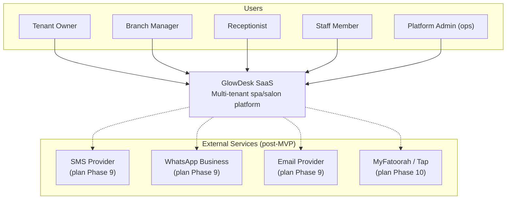
```mermaid
flowchart TB
  subgraph users["Users"]
    OWNER["Tenant Owner"]
    MGR["Branch Manager"]
    RECP["Receptionist"]
    STAFF["Staff Member"]
    PLATFORM["Platform Admin (ops)"]
  end

  GLOWDESK["GlowDesk SaaS\nMulti-tenant spa/salon platform"]

  subgraph external["External Services (post-MVP)"]
    SMS["SMS Provider\n(plan Phase 9)"]
    WHATSAPP["WhatsApp Business\n(plan Phase 9)"]
    EMAIL["Email Provider\n(plan Phase 9)"]
    MYFATOORAH["MyFatoorah / Tap\n(plan Phase 10)"]
  end

  OWNER --> GLOWDESK
  MGR --> GLOWDESK
  RECP --> GLOWDESK
  STAFF --> GLOWDESK
  PLATFORM --> GLOWDESK

  GLOWDESK -.-> SMS
  GLOWDESK -.-> WHATSAPP
  GLOWDESK -.-> EMAIL
  GLOWDESK -.-> MYFATOORAH
```

Context explanation: The system has four in-app roles (`tenant_owner`, `branch_manager`, `receptionist`, `staff`) plus a platform operations path (`platform_admin` via audited impersonation — never a membership role, per ADR-20 rule 9). All notification and payment integrations are post-MVP (plan Phases 9-10); the MVP is back-office only with manual/cash payments (ADR-1, ADR-34). External services are connected through Edge Functions behind provider abstractions so no provider-specific code leaks into the domain model (ADR-34).

### 1.2 C4 Level 2: Container diagram

The runtime containers and their communication paths.

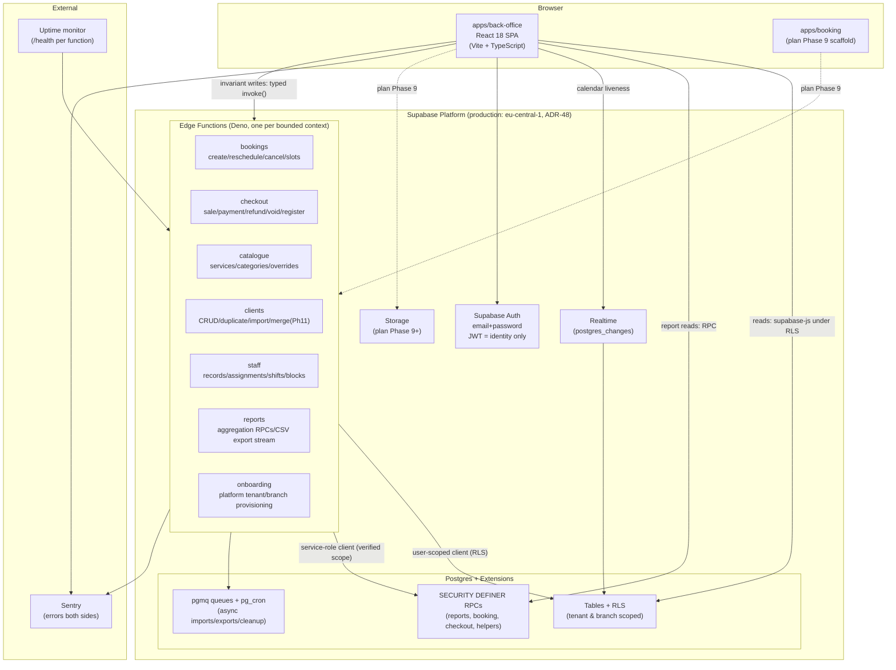
```mermaid
flowchart TB
  subgraph browser["Browser"]
    BO["apps/back-office\nReact 18 SPA\n(Vite + TypeScript)"]
    BK_APP["apps/booking\n(plan Phase 9 scaffold)"]
  end

  subgraph supabase["Supabase Platform (production: eu-central-1, ADR-48)"]
    AUTH["Supabase Auth\nemail+password\nJWT = identity only"]
    
    subgraph edge["Edge Functions (Deno, one per bounded context)"]
      EF_BOOK["bookings\ncreate/reschedule/cancel/slots"]
      EF_CO["checkout\nsale/payment/refund/void/register"]
      EF_CAT["catalogue\nservices/categories/overrides"]
      EF_CL["clients\nCRUD/duplicate/import/merge(Ph11)"]
      EF_STAFF["staff\nrecords/assignments/shifts/blocks"]
      EF_RPT["reports\naggregation RPCs/CSV export stream"]
      EF_ON["onboarding\nplatform tenant/branch provisioning"]
    end

    subgraph data["Postgres + Extensions"]
      PG["Tables + RLS\n(tenant & branch scoped)"]
      RPC["SECURITY DEFINER RPCs\n(reports, booking, checkout, helpers)"]
      Q["pgmq queues + pg_cron\n(async imports/exports/cleanup)"]
    end

    RT["Realtime\n(postgres_changes)"]
    STORAGE["Storage\n(plan Phase 9+)"]
  end

  subgraph external["External"]
    SENTRY["Sentry\n(errors both sides)"]
    UPTIME["Uptime monitor\n(/health per function)"]
  end

  BO -->|"reads: supabase-js under RLS"| PG
  BO -->|"report reads: RPC"| RPC
  BO -->|"invariant writes: typed invoke()"| edge
  BO -->|"calendar liveness"| RT
  BO --> AUTH
  BO -.->|"plan Phase 9"| STORAGE

  edge -->|"user-scoped client (RLS)"| PG
  edge -->|"service-role client (verified scope)"| RPC
  edge --> Q
  RT --> PG

  edge --> SENTRY
  BO --> SENTRY
  UPTIME --> edge

  BK_APP -.->|"plan Phase 9"| edge
```

Container explanation: Three rules define the system (per CONVENTIONS §1): (1) The database is the security boundary — RLS enforces tenant and branch isolation, never application code (ADR-20). (2) The JWT carries identity only — `auth.uid()` is the only trusted input; tenant, role, and branch scope are looked up live from `memberships` on every request (ADR-19). (3) Edge Functions are isolated per bounded context — a failing or redeploying function never takes down another domain (ADR-27, NFR-2). The MVP has seven functions (`bookings`, `checkout`, `catalogue`, `clients`, `staff`, `reports`, `onboarding`); Storage and `apps/booking` are plan Phase 9 (ADR-43). The `_shared/` directory holds shared modules imported by relative path (ADR-32). Async work uses `pg_cron` + `pgmq` with idempotent consumers (ADR-33).

---

## 2. Deployment and environments

### 2.1 Environment topology

```mermaid
flowchart LR
  subgraph local["Local Development"]
    LCLI["Supabase CLI\n(supabase start)"]
    LSERVE["supabase functions serve"]
    LVITE["Vite dev server"]
  end

  subgraph staging["Staging\n(Supabase preview branch)"]
    SDB["Preview-branch Postgres"]
    SEF["Edge Functions"]
    SFE["Frontend deploy"]
  end

  subgraph prod["Production\n(paid plan, ADR-48 region)"]
    PDB["Postgres + PITR\n(daily backups, ADR-49)"]
    PEF["Edge Functions"]
    PFE["Frontend deploy"]
  end

  DEV["Feature branch\n(ephemeral preview DB)"] -->|"PR merge"| staging
  staging -->|"merge to main"| prod

  local -.->|"supabase db push"| DEV
```

Environment explanation: Local development uses the Supabase CLI stack (`supabase start`, `supabase functions serve`, Vite). Feature branches get ephemeral preview-branch databases for migration testing. CI deploys migrations, functions, and the frontend to staging on merges to `staging`, and to production only from `main` (CONVENTIONS §8). Production runs on a paid-plan Supabase project with managed daily backups and PITR (ADR-49). The region defaults to `eu-central-1` as an assumption, with a legal verification gate before Phase 8 go-live (ADR-48).

### 2.2 CI/CD pipeline

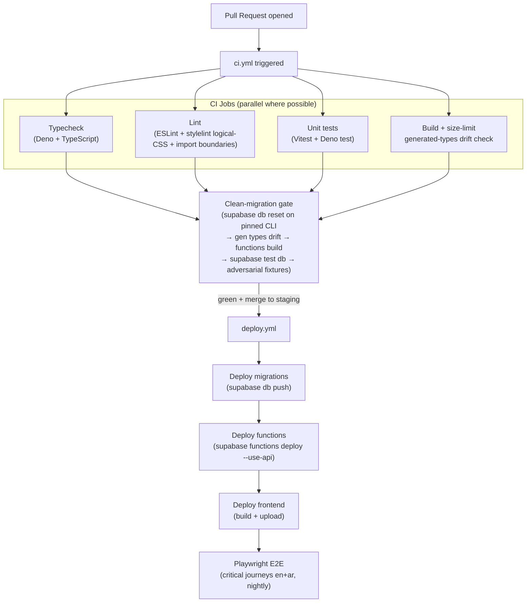
```mermaid
flowchart TB
  PR["Pull Request opened"] --> CI["ci.yml triggered"]

  subgraph ci_jobs["CI Jobs (parallel where possible)"]
    TYPECHECK["Typecheck\n(Deno + TypeScript)"]
    LINT["Lint\n(ESLint + stylelint logical-CSS + import boundaries)"]
    UNIT["Unit tests\n(Vitest + Deno test)"]
    BUILD["Build + size-limit\ngenerated-types drift check"]
  end

  CI --> TYPECHECK
  CI --> LINT
  CI --> UNIT
  CI --> BUILD

  TYPECHECK --> CLEAN_MIG["Clean-migration gate\n(supabase db reset on pinned CLI\n→ gen types drift → functions build\n→ supabase test db → adversarial fixtures)"]

  LINT --> CLEAN_MIG
  UNIT --> CLEAN_MIG
  BUILD --> CLEAN_MIG

  CLEAN_MIG -->|"green + merge to staging"| DEPLOY["deploy.yml"]
  
  DEPLOY --> DEP_MIG["Deploy migrations\n(supabase db push)"]
  DEP_MIG --> DEP_FN["Deploy functions\n(supabase functions deploy --use-api)"]
  DEP_FN --> DEP_FE["Deploy frontend\n(build + upload)"]

  DEP_FE --> E2E["Playwright E2E\n(critical journeys en+ar, nightly)"]
```

Pipeline explanation: CI gates every PR on typecheck, lint, unit tests, and build. The clean-migration gate (`F-verifier-2`) applies the full active migration set to an empty database on the pinned CLI version, regenerates types (drift fails CI), typechecks/builds every function, runs `supabase test db` (pgTAP), and executes the adversarial fixture suite (cross-tenant, cross-branch, money, and booking negatives). The gate fails if anything under `sql/drafts-v1/` is referenced by the active migration path. Frontend and backend deploy from the same commit (monorepo rule, ADR-30). E2E tests run nightly and pre-release.

### 2.3 Edge Function isolation

Each Edge Function is an independent Deno deployable. A failing or redeploying function never takes down another domain because:

- Each function is a separate Supabase Edge Function slug with its own deployment lifecycle (`supabase functions deploy --slug <name>`).
- Internal routing within a function (`/<function>/<action>`, ADR-30) means most code changes touch one function.
- Shared code lives in `_shared/` — a change to `_shared` redeploys all functions in the same CI run (documented blast radius, ADR-32).
- Per-function cold starts (~50-200ms) amortize across actions in the same function; Supabase limits apply per-request (256MB memory, wall-clock CPU caps per ADR-27).
- Each function exposes `/health` for external uptime monitoring.

---

## 3. Domain model

### 3.1 Tenancy and branches

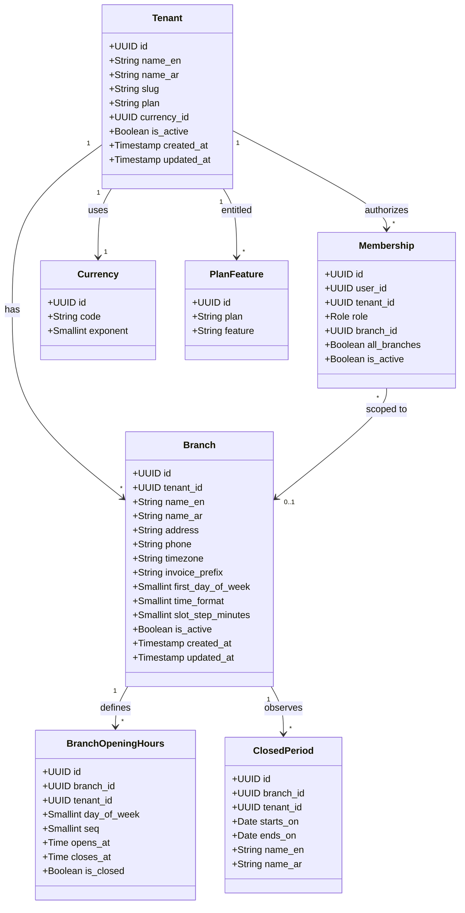
```mermaid
classDiagram
  class Tenant {
    +UUID id
    +String name_en
    +String name_ar
    +String slug
    +String plan
    +UUID currency_id
    +Boolean is_active
    +Timestamp created_at
    +Timestamp updated_at
  }

  class Branch {
    +UUID id
    +UUID tenant_id
    +String name_en
    +String name_ar
    +String address
    +String phone
    +String timezone
    +String invoice_prefix
    +Smallint first_day_of_week
    +Smallint time_format
    +Smallint slot_step_minutes
    +Boolean is_active
    +Timestamp created_at
    +Timestamp updated_at
  }

  class BranchOpeningHours {
    +UUID id
    +UUID branch_id
    +UUID tenant_id
    +Smallint day_of_week
    +Smallint seq
    +Time opens_at
    +Time closes_at
    +Boolean is_closed
  }

  class ClosedPeriod {
    +UUID id
    +UUID branch_id
    +UUID tenant_id
    +Date starts_on
    +Date ends_on
    +String name_en
    +String name_ar
  }

  class Membership {
    +UUID id
    +UUID user_id
    +UUID tenant_id
    +Role role
    +UUID branch_id
    +Boolean all_branches
    +Boolean is_active
  }

  class Currency {
    +UUID id
    +String code
    +Smallint exponent
  }

  class PlanFeature {
    +UUID id
    +String plan
    +String feature
  }

  Tenant "1" --> "*" Branch : has
  Tenant "1" --> "*" Membership : authorizes
  Tenant "1" --> "1" Currency : uses
  Tenant "1" --> "*" PlanFeature : entitled
  Branch "1" --> "*" BranchOpeningHours : defines
  Branch "1" --> "*" ClosedPeriod : observes
  Membership "*" --> "0..1" Branch : scoped to
```

Tenancy ER diagram:

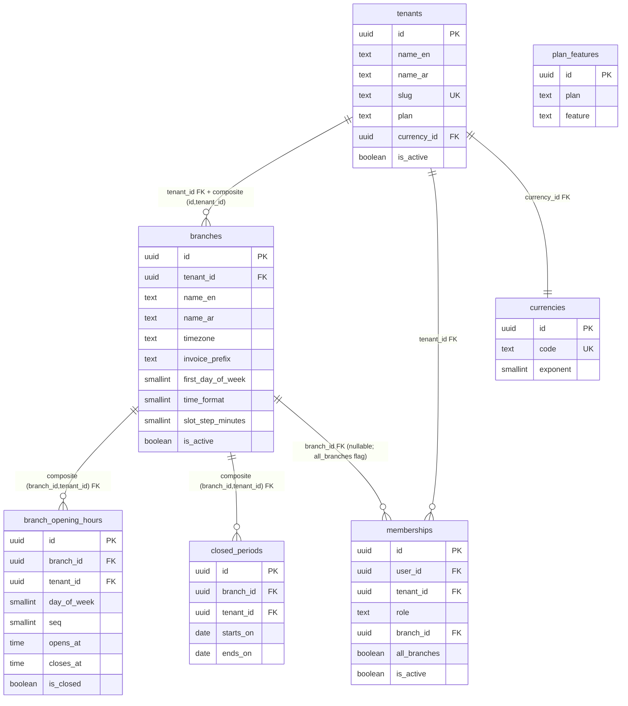
```mermaid
erDiagram
  tenants {
    uuid id PK
    text name_en
    text name_ar
    text slug UK
    text plan
    uuid currency_id FK
    boolean is_active
  }
  branches {
    uuid id PK
    uuid tenant_id FK
    text name_en
    text name_ar
    text timezone
    text invoice_prefix
    smallint first_day_of_week
    smallint time_format
    smallint slot_step_minutes
    boolean is_active
  }
  branch_opening_hours {
    uuid id PK
    uuid branch_id FK
    uuid tenant_id FK
    smallint day_of_week
    smallint seq
    time opens_at
    time closes_at
    boolean is_closed
  }
  closed_periods {
    uuid id PK
    uuid branch_id FK
    uuid tenant_id FK
    date starts_on
    date ends_on
  }
  memberships {
    uuid id PK
    uuid user_id FK
    uuid tenant_id FK
    text role
    uuid branch_id FK
    boolean all_branches
    boolean is_active
  }
  currencies {
    uuid id PK
    text code UK
    smallint exponent
  }
  plan_features {
    uuid id PK
    text plan
    text feature
  }
  tenants ||--o{ branches : "tenant_id FK + composite (id,tenant_id)"
  tenants ||--o{ memberships : "tenant_id FK"
  tenants ||--|| currencies : "currency_id FK"
  branches ||--o{ branch_opening_hours : "composite (branch_id,tenant_id) FK"
  branches ||--o{ closed_periods : "composite (branch_id,tenant_id) FK"
  branches ||--o{ memberships : "branch_id FK (nullable; all_branches flag)"
```

Tenancy explanation: The tenant is the root entity; every other table belongs to a tenant via `tenant_id` and composite foreign keys (ADR-20 rule 5). Branch-scoped roles use `memberships.branch_id` or the `all_branches` flag (nullable `branch_id` + boolean, ADR-20 rule 6 — the sentinel UUID is withdrawn). `platform_admin` is not a membership role; platform ops use audited impersonation (ADR-20 rule 9). Branch calendar preferences (`first_day_of_week`, `time_format`, `slot_step_minutes`) live on `branches` as typed columns, not `settings` keys (ADR-52). Opening hours support overnight (`closes_at <= opens_at`) and split intervals via `seq` (ADR-26).

### 3.2 Staff and shifts

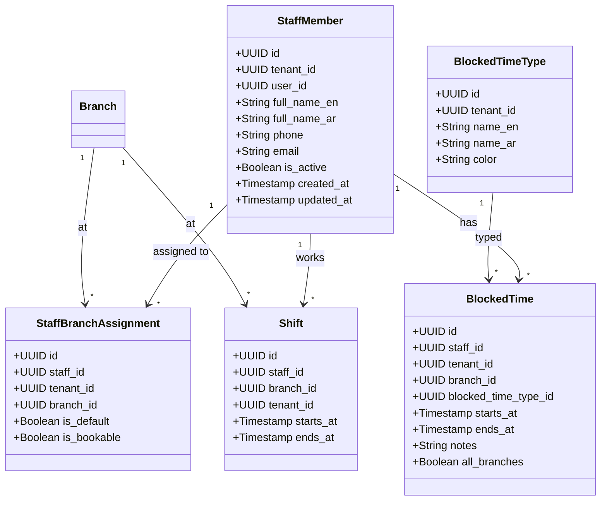
```mermaid
classDiagram
  class StaffMember {
    +UUID id
    +UUID tenant_id
    +UUID user_id
    +String full_name_en
    +String full_name_ar
    +String phone
    +String email
    +Boolean is_active
    +Timestamp created_at
    +Timestamp updated_at
  }

  class StaffBranchAssignment {
    +UUID id
    +UUID staff_id
    +UUID tenant_id
    +UUID branch_id
    +Boolean is_default
    +Boolean is_bookable
  }

  class Shift {
    +UUID id
    +UUID staff_id
    +UUID branch_id
    +UUID tenant_id
    +Timestamp starts_at
    +Timestamp ends_at
  }

  class BlockedTimeType {
    +UUID id
    +UUID tenant_id
    +String name_en
    +String name_ar
    +String color
  }

  class BlockedTime {
    +UUID id
    +UUID staff_id
    +UUID tenant_id
    +UUID branch_id
    +UUID blocked_time_type_id
    +Timestamp starts_at
    +Timestamp ends_at
    +String notes
    +Boolean all_branches
  }

  StaffMember "1" --> "*" StaffBranchAssignment : assigned to
  StaffMember "1" --> "*" Shift : works
  StaffMember "1" --> "*" BlockedTime : has
  Branch "1" --> "*" StaffBranchAssignment : at
  Branch "1" --> "*" Shift : at
  BlockedTimeType "1" --> "*" BlockedTime : typed
```

Staff ER diagram:

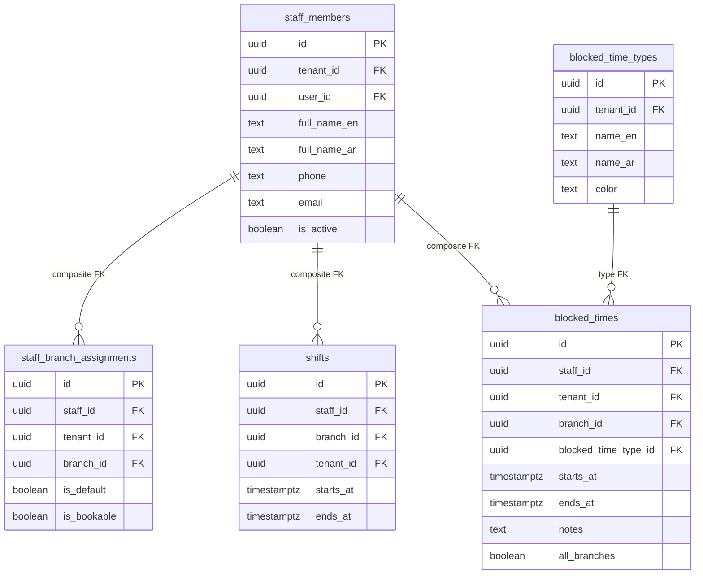
```mermaid
erDiagram
  staff_members {
    uuid id PK
    uuid tenant_id FK
    uuid user_id FK
    text full_name_en
    text full_name_ar
    text phone
    text email
    boolean is_active
  }
  staff_branch_assignments {
    uuid id PK
    uuid staff_id FK
    uuid tenant_id FK
    uuid branch_id FK
    boolean is_default
    boolean is_bookable
  }
  shifts {
    uuid id PK
    uuid staff_id FK
    uuid branch_id FK
    uuid tenant_id FK
    timestamptz starts_at
    timestamptz ends_at
  }
  blocked_time_types {
    uuid id PK
    uuid tenant_id FK
    text name_en
    text name_ar
    text color
  }
  blocked_times {
    uuid id PK
    uuid staff_id FK
    uuid tenant_id FK
    uuid branch_id FK
    uuid blocked_time_type_id FK
    timestamptz starts_at
    timestamptz ends_at
    text notes
    boolean all_branches
  }
  staff_members ||--o{ staff_branch_assignments : "composite FK"
  staff_members ||--o{ shifts : "composite FK"
  staff_members ||--o{ blocked_times : "composite FK"
  blocked_time_types ||--o{ blocked_times : "type FK"
```

Staff explanation: One `staff_members` row per person per tenant; login is optional (`user_id` nullable, ADR-12). A partial unique index `(tenant_id, user_id) WHERE user_id IS NOT NULL` enforces one identity per tenant (ADR-12, F-DB-9). Staff are assigned to branches via `staff_branch_assignments` with a default-branch and bookable flag. The conflict engine checks busy time across all branches a staff member is assigned to (ADR-12, ADR-24). `blocked_times` is not a direct-write table — every write goes through the locked `staff`/blocked-time RPC (advisory lock + cross-entity appointment check, ADR-26, F-DB-6). Time off spanning branches uses `all_branches = true` with `branch_id IS NULL` (ADR-20 rule 6, ADR-26). `shifts` are dated rows (`timestamptz` ranges), not weekly templates; the shift grid materializes a week of rows and supports copy-previous-week.

### 3.3 Service catalogue

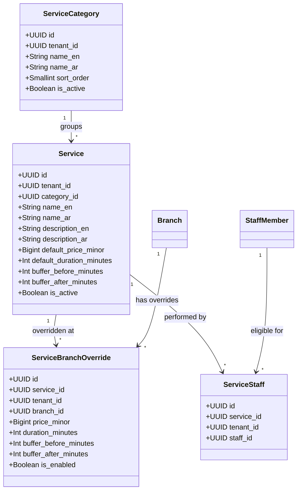
```mermaid
classDiagram
  class ServiceCategory {
    +UUID id
    +UUID tenant_id
    +String name_en
    +String name_ar
    +Smallint sort_order
    +Boolean is_active
  }

  class Service {
    +UUID id
    +UUID tenant_id
    +UUID category_id
    +String name_en
    +String name_ar
    +String description_en
    +String description_ar
    +Bigint default_price_minor
    +Int default_duration_minutes
    +Int buffer_before_minutes
    +Int buffer_after_minutes
    +Boolean is_active
  }

  class ServiceBranchOverride {
    +UUID id
    +UUID service_id
    +UUID tenant_id
    +UUID branch_id
    +Bigint price_minor
    +Int duration_minutes
    +Int buffer_before_minutes
    +Int buffer_after_minutes
    +Boolean is_enabled
  }

  class ServiceStaff {
    +UUID id
    +UUID service_id
    +UUID tenant_id
    +UUID staff_id
  }

  ServiceCategory "1" --> "*" Service : groups
  Service "1" --> "*" ServiceBranchOverride : overridden at
  Service "1" --> "*" ServiceStaff : performed by
  Branch "1" --> "*" ServiceBranchOverride : has overrides
  StaffMember "1" --> "*" ServiceStaff : eligible for
```

Catalogue explanation: Services are defined at tenant level with default price (in minor units, ADR-17), duration, and buffers. `service_branch_overrides` provides per-branch deviations (price, duration, enabled) that fall back to tenant defaults when absent (ADR-13). The effective price/duration is resolved by `resolve_service(branch_id, service_id)` and snapshotted onto `appointment_items` and `sale_items` at booking/checkout time for historical accuracy. Buffers are first-class and included in the busy range but not billable (ADR-25). Staff eligibility per service per branch lives in `service_staff`. A cross-branch reschedule must re-resolve price/duration/buffers via the target branch and re-snapshot (ADR-13 round 2, F-walk-1).

### 3.4 Clients

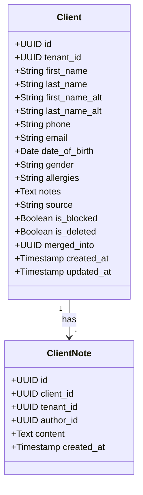
```mermaid
classDiagram
  class Client {
    +UUID id
    +UUID tenant_id
    +String first_name
    +String last_name
    +String first_name_alt
    +String last_name_alt
    +String phone
    +String email
    +Date date_of_birth
    +String gender
    +String allergies
    +Text notes
    +String source
    +Boolean is_blocked
    +Boolean is_deleted
    +UUID merged_into
    +Timestamp created_at
    +Timestamp updated_at
  }

  class ClientNote {
    +UUID id
    +UUID client_id
    +UUID tenant_id
    +UUID author_id
    +Text content
    +Timestamp created_at
  }

  Client "1" --> "*" ClientNote : has
```

Clients explanation: Clients are tenant-scoped (shared across all branches for safety — a therapist at any branch must see allergies, ADR-11). Client financial aggregates are branch-scoped via secured RPCs, never raw client columns (ADR-11). The staff role reads only basic client fields (name, phone, allergy flags) through a column-restricted secured view limited to clients with appointments at their assigned branches, and has no writes to client master data (ADR-11, F-DB-5/F-perm-2). `is_blocked`, `is_deleted`, and `merged_into` are carved out of direct writes — they route through the `clients` Edge Function with role checks and audit (ADR-28, F-4). Duplicate warning on create (name/phone/email match, tenant-wide) with explicit proceed-and-record choice (ADR-9). `clients.source` defaults to `walk-in` or `imported`; source reporting is deferred non-committed (ADR-52).

### 3.5 Appointments and booking

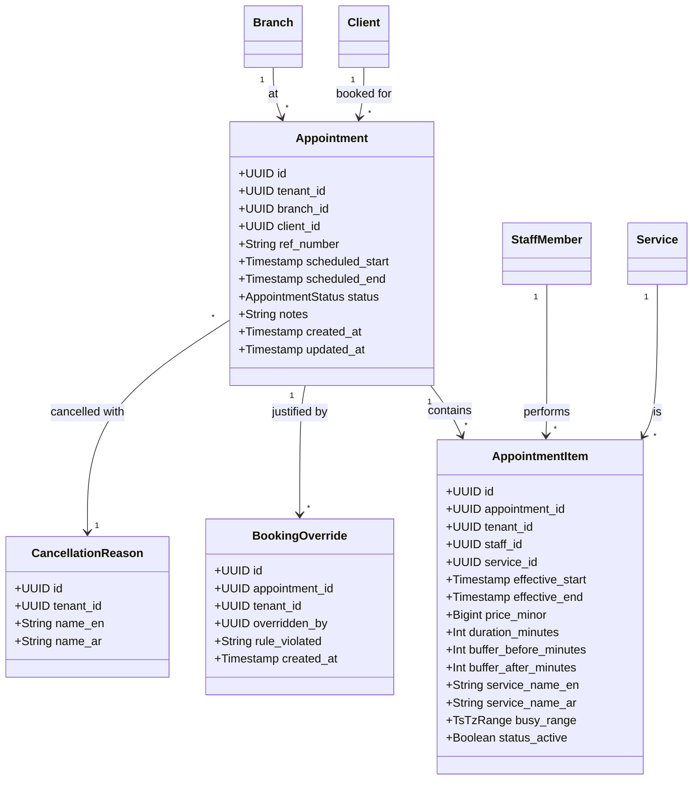
```mermaid
classDiagram
  class Appointment {
    +UUID id
    +UUID tenant_id
    +UUID branch_id
    +UUID client_id
    +String ref_number
    +Timestamp scheduled_start
    +Timestamp scheduled_end
    +AppointmentStatus status
    +String notes
    +Timestamp created_at
    +Timestamp updated_at
  }

  class AppointmentItem {
    +UUID id
    +UUID appointment_id
    +UUID tenant_id
    +UUID staff_id
    +UUID service_id
    +Timestamp effective_start
    +Timestamp effective_end
    +Bigint price_minor
    +Int duration_minutes
    +Int buffer_before_minutes
    +Int buffer_after_minutes
    +String service_name_en
    +String service_name_ar
    +TsTzRange busy_range
    +Boolean status_active
  }

  class BookingOverride {
    +UUID id
    +UUID appointment_id
    +UUID tenant_id
    +UUID overridden_by
    +String rule_violated
    +Timestamp created_at
  }

  class CancellationReason {
    +UUID id
    +UUID tenant_id
    +String name_en
    +String name_ar
  }

  Appointment "1" --> "*" AppointmentItem : contains
  Appointment "1" --> "*" BookingOverride : justified by
  Appointment "*" --> "1" CancellationReason : cancelled with
  Client "1" --> "*" Appointment : booked for
  Branch "1" --> "*" Appointment : at
  StaffMember "1" --> "*" AppointmentItem : performs
  Service "1" --> "*" AppointmentItem : is
```

Appointment ER diagram:

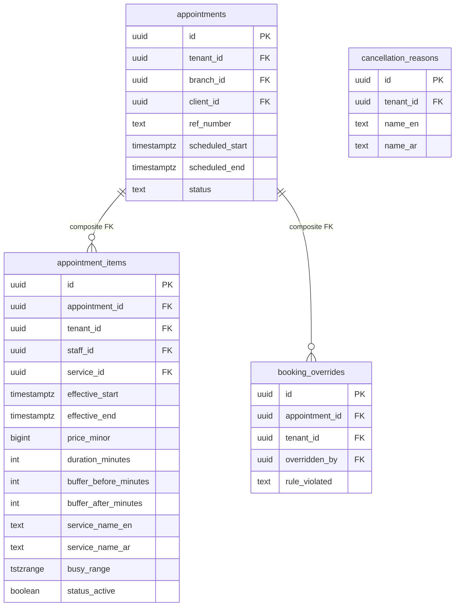
```mermaid
erDiagram
  appointments {
    uuid id PK
    uuid tenant_id FK
    uuid branch_id FK
    uuid client_id FK
    text ref_number
    timestamptz scheduled_start
    timestamptz scheduled_end
    text status
  }
  appointment_items {
    uuid id PK
    uuid appointment_id FK
    uuid tenant_id FK
    uuid staff_id FK
    uuid service_id FK
    timestamptz effective_start
    timestamptz effective_end
    bigint price_minor
    int duration_minutes
    int buffer_before_minutes
    int buffer_after_minutes
    text service_name_en
    text service_name_ar
    tstzrange busy_range
    boolean status_active
  }
  booking_overrides {
    uuid id PK
    uuid appointment_id FK
    uuid tenant_id FK
    uuid overridden_by FK
    text rule_violated
  }
  cancellation_reasons {
    uuid id PK
    uuid tenant_id FK
    text name_en
    text name_ar
  }
  appointments ||--o{ appointment_items : "composite FK"
  appointments ||--o{ booking_overrides : "composite FK"
```

Appointments explanation: An appointment belongs to exactly one branch. `appointment_items` carry their own staff member and time span, enabling multi-service visits (sequential or parallel) inside the appointment envelope (ADR-23). Each item snapshots the resolved price, duration, buffers, and service names at booking time. `busy_range` is a generated `tstzrange` column including buffers (`[effective_start - buffer_before, effective_end + buffer_after)`), protected by an exclusion constraint `EXCLUDE USING gist (staff_id WITH =, busy_range WITH &&) WHERE status_active` (ADR-24). The `status_active` flag is maintained by the appointment state machine — cancelled/no_show items drop out of the constraint. `ref_number` is generated by the booking RPC as `<branch invoice_prefix>-A<seq>` with `UNIQUE (branch_id, ref_number)` (ADR-14, F-DB-7). All appointment/booking_item writes go through the `bookings` Edge Function — never direct supabase-js (ADR-28).

### 3.6 Sales, payments and register

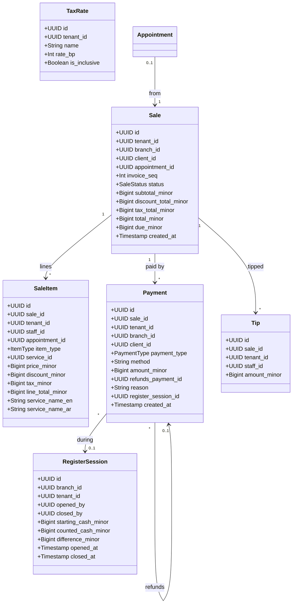
```mermaid
classDiagram
  class Sale {
    +UUID id
    +UUID tenant_id
    +UUID branch_id
    +UUID client_id
    +UUID appointment_id
    +Int invoice_seq
    +SaleStatus status
    +Bigint subtotal_minor
    +Bigint discount_total_minor
    +Bigint tax_total_minor
    +Bigint total_minor
    +Bigint due_minor
    +Timestamp created_at
  }

  class SaleItem {
    +UUID id
    +UUID sale_id
    +UUID tenant_id
    +UUID staff_id
    +UUID appointment_id
    +ItemType item_type
    +UUID service_id
    +Bigint price_minor
    +Bigint discount_minor
    +Bigint tax_minor
    +Bigint line_total_minor
    +String service_name_en
    +String service_name_ar
  }

  class Payment {
    +UUID id
    +UUID sale_id
    +UUID tenant_id
    +UUID branch_id
    +UUID client_id
    +PaymentType payment_type
    +String method
    +Bigint amount_minor
    +UUID refunds_payment_id
    +String reason
    +UUID register_session_id
    +Timestamp created_at
  }

  class Tip {
    +UUID id
    +UUID sale_id
    +UUID tenant_id
    +UUID staff_id
    +Bigint amount_minor
  }

  class RegisterSession {
    +UUID id
    +UUID branch_id
    +UUID tenant_id
    +UUID opened_by
    +UUID closed_by
    +Bigint starting_cash_minor
    +Bigint counted_cash_minor
    +Bigint difference_minor
    +Timestamp opened_at
    +Timestamp closed_at
  }

  class TaxRate {
    +UUID id
    +UUID tenant_id
    +String name
    +Int rate_bp
    +Boolean is_inclusive
  }

  Sale "1" --> "*" SaleItem : lines
  Sale "1" --> "*" Payment : paid by
  Sale "1" --> "*" Tip : tipped
  Payment "*" --> "0..1" Payment : refunds
  Payment "*" --> "0..1" RegisterSession : during
  Appointment "0..1" --> "1" Sale : from
```

Sales ER diagram:

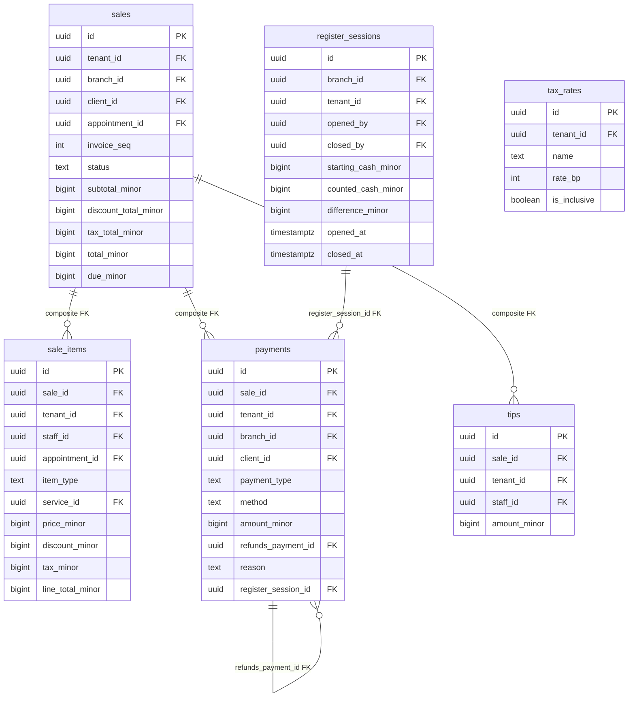
```mermaid
erDiagram
  sales {
    uuid id PK
    uuid tenant_id FK
    uuid branch_id FK
    uuid client_id FK
    uuid appointment_id FK
    int invoice_seq
    text status
    bigint subtotal_minor
    bigint discount_total_minor
    bigint tax_total_minor
    bigint total_minor
    bigint due_minor
  }
  sale_items {
    uuid id PK
    uuid sale_id FK
    uuid tenant_id FK
    uuid staff_id FK
    uuid appointment_id FK
    text item_type
    uuid service_id FK
    bigint price_minor
    bigint discount_minor
    bigint tax_minor
    bigint line_total_minor
  }
  payments {
    uuid id PK
    uuid sale_id FK
    uuid tenant_id FK
    uuid branch_id FK
    uuid client_id FK
    text payment_type
    text method
    bigint amount_minor
    uuid refunds_payment_id FK
    text reason
    uuid register_session_id FK
  }
  tips {
    uuid id PK
    uuid sale_id FK
    uuid tenant_id FK
    uuid staff_id FK
    bigint amount_minor
  }
  register_sessions {
    uuid id PK
    uuid branch_id FK
    uuid tenant_id FK
    uuid opened_by FK
    uuid closed_by FK
    bigint starting_cash_minor
    bigint counted_cash_minor
    bigint difference_minor
    timestamptz opened_at
    timestamptz closed_at
  }
  tax_rates {
    uuid id PK
    uuid tenant_id FK
    text name
    int rate_bp
    boolean is_inclusive
  }
  sales ||--o{ sale_items : "composite FK"
  sales ||--o{ payments : "composite FK"
  sales ||--o{ tips : "composite FK"
  payments ||--o{ payments : "refunds_payment_id FK"
  register_sessions ||--o{ payments : "register_session_id FK"
```

Sales explanation: Every sale belongs to exactly one branch and records its per-branch `invoice_seq` (ADR-14). Totals are derived from line items by the checkout RPC per the deterministic calculation order bound in ADR-51 (line base → line discounts → invoice-level pro-rata allocation → tax → tips → sale total). `due_minor` is a generated column (`total - sum(payments)`). All sale-related writes go through the `checkout` Edge Function — never direct supabase-js (ADR-28). Payments use a single `payments` table with `payment_type ∈ {payment, refund}`; refunds are positive `amount_minor` rows referencing `refunds_payment_id` (ADR-34 — no separate refunds table, no negative amounts). A trigger enforces `sum(refund amounts) ≤ original payment amount`. Refunds and voids are owner/manager-only (ADR-10 round 2, F-perm-1). Register sessions link cash payments and support daily reconciliation (ADR-6). Money is `bigint` minor units (fils for KWD, ADR-17) everywhere.

### 3.7 Settings and audit

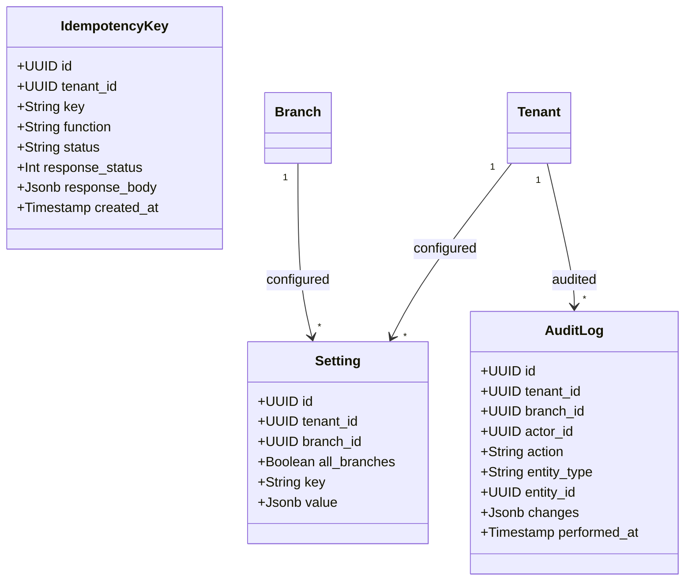
```mermaid
classDiagram
  class Setting {
    +UUID id
    +UUID tenant_id
    +UUID branch_id
    +Boolean all_branches
    +String key
    +Jsonb value
  }

  class AuditLog {
    +UUID id
    +UUID tenant_id
    +UUID branch_id
    +UUID actor_id
    +String action
    +String entity_type
    +UUID entity_id
    +Jsonb changes
    +Timestamp performed_at
  }

  class IdempotencyKey {
    +UUID id
    +UUID tenant_id
    +String key
    +String function
    +String status
    +Int response_status
    +Jsonb response_body
    +Timestamp created_at
  }

  Branch "1" --> "*" Setting : configured
  Tenant "1" --> "*" Setting : configured
  Tenant "1" --> "*" AuditLog : audited
```

Settings explanation: Settings use the same `all_branches` representation: `branch_id NULL` + `all_branches boolean` for tenant-wide rows, with a partial unique index `WHERE branch_id IS NULL` (ADR-20 rule 6). Audit rows are written only by `SECURITY DEFINER` triggers on audited tables and by Edge Function code paths; direct DML is revoked from `anon` and `authenticated` (ADR-22). `idempotency_keys` are unique on `(tenant_id, key)`; money mutations require an `Idempotency-Key` header; replay returns the cached response; 30-day expiry via `pg_cron` (ADR-31).

### 3.8 Full entity-relationship overview

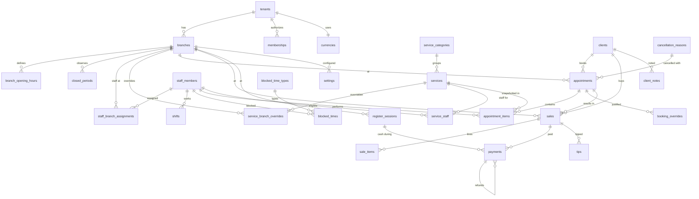
```mermaid
erDiagram
  tenants ||--o{ branches : "has"
  tenants ||--o{ memberships : "authorizes"
  tenants ||--|| currencies : "uses"
  branches ||--o{ branch_opening_hours : "defines"
  branches ||--o{ closed_periods : "observes"
  branches ||--o{ staff_branch_assignments : "staff at"
  branches ||--o{ service_branch_overrides : "overrides"
  branches ||--o{ appointments : "at"
  branches ||--o{ sales : "at"
  branches ||--o{ register_sessions : "at"
  branches ||--o{ settings : "configured"
  
  staff_members ||--o{ staff_branch_assignments : "assigned"
  staff_members ||--o{ shifts : "works"
  staff_members ||--o{ blocked_times : "blocked"
  staff_members ||--o{ appointment_items : "performs"
  staff_members ||--o{ service_staff : "eligible"
  
  service_categories ||--o{ services : "groups"
  services ||--o{ service_branch_overrides : "overridden"
  services ||--o{ service_staff : "staff for"
  services ||--o{ appointment_items : "snapshotted in"
  
  clients ||--o{ appointments : "books"
  clients ||--o{ sales : "buys"
  clients ||--o{ client_notes : "noted"
  
  appointments ||--o{ appointment_items : "contains"
  appointments ||--o{ booking_overrides : "justified"
  appointments ||--o{ sales : "results in"
  
  sales ||--o{ sale_items : "lines"
  sales ||--o{ payments : "paid"
  sales ||--o{ tips : "tipped"
  
  payments ||--o{ payments : "refunds"
  register_sessions ||--o{ payments : "cash during"
  
  blocked_time_types ||--o{ blocked_times : "types"
  cancellation_reasons ||--o{ appointments : "cancelled with"
```

Full ER explanation: Every tenant-owned table carries `tenant_id`, and every foreign key to another tenant-owned table is composite on `(parent_id, tenant_id)` to enforce tenant consistency at the database level (ADR-20 rule 5). Branch-scoped tables add `branch_id`. The `all_branches` representation (`branch_id NULL` + `all_branches boolean` + `CHECK (all_branches = (branch_id IS NULL))`) applies to `memberships`, `settings`, and `blocked_times` (ADR-20 rule 6). Soft deletes: `clients.is_deleted` + `merged_into`; `is_active` on services/staff/branches; status-based retention on appointments/sales; immutable financial rows (ADR-46). All timestamps are `timestamptz` (UTC storage); each branch has an IANA timezone for rendering and day-boundary grouping (ADR-45).

---

## 4. Sequence diagrams

### 4.1 Sign-in and tenant/branch selection

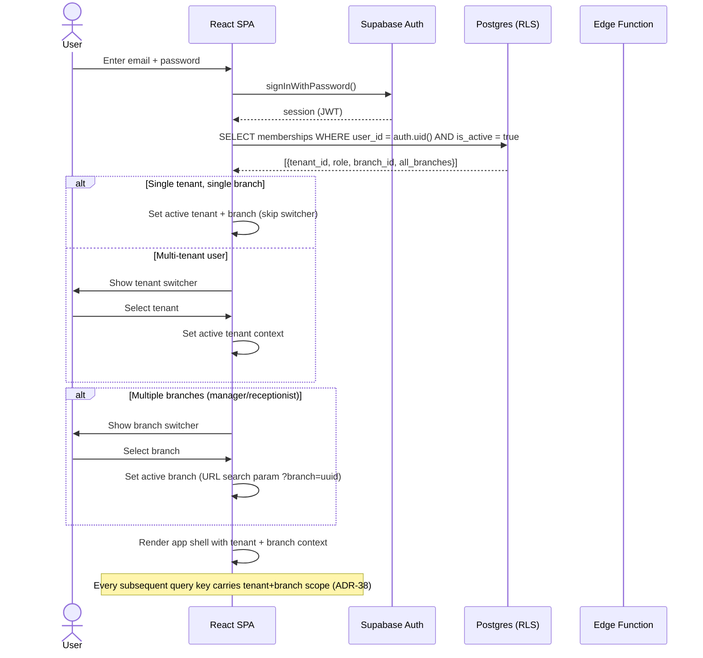
```mermaid
sequenceDiagram
  actor U as User
  participant FE as React SPA
  participant Auth as Supabase Auth
  participant DB as Postgres (RLS)
  participant EF as Edge Function

  U->>FE: Enter email + password
  FE->>Auth: signInWithPassword()
  Auth-->>FE: session (JWT)
  
  FE->>DB: SELECT memberships WHERE user_id = auth.uid() AND is_active = true
  DB-->>FE: [{tenant_id, role, branch_id, all_branches}]

  alt Single tenant, single branch
    FE->>FE: Set active tenant + branch (skip switcher)
  else Multi-tenant user
    FE->>U: Show tenant switcher
    U->>FE: Select tenant
    FE->>FE: Set active tenant context
  end

  alt Multiple branches (manager/receptionist)
    FE->>U: Show branch switcher
    U->>FE: Select branch
    FE->>FE: Set active branch (URL search param ?branch=uuid)
  end

  FE->>FE: Render app shell with tenant + branch context
  Note over FE: Every subsequent query key carries tenant+branch scope (ADR-38)
```

Sign-in explanation: `auth.uid()` from the JWT is the only trusted identity input (ADR-19). Authorization (tenant membership, role, branch scope) is derived on every request from the `memberships` table via `STABLE SECURITY DEFINER` helpers (`current_tenant_ids()`, `current_branch_scope()`, `has_tenant_role()`). The JWT carries no tenant or role claims. Memberships are filtered `is_active = true` — revoking a membership takes effect immediately without waiting for token expiry (ADR-19). A user may hold memberships in multiple tenants and different roles at different branches; the active tenant is application context persisted per user (ADR-37, F-fe-1). Branch context lives in the URL as a search param (`?branch=<uuid>|all`); RLS remains the real security boundary either way (ADR-37).

### 4.2 Creating a booking (double-booking guard)

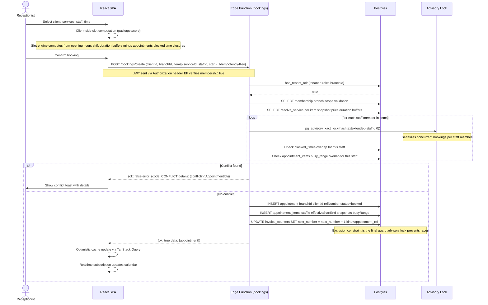
```mermaid
sequenceDiagram
  actor R as Receptionist
  participant FE as React SPA
  participant EF as Edge Function (bookings)
  participant DB as Postgres
  participant Lock as Advisory Lock
  R->>FE: Select client, services, staff, time
  FE->>FE: Client-side slot computation (packages/core)
  Note over FE: Slot engine computes from opening hours shift duration buffers minus appointments blocked time closures
  R->>FE: Confirm booking
  FE->>EF: POST /bookings/create {clientId, branchId, items[{serviceId, staffId, start}], Idempotency-Key}
  Note over FE,EF: JWT sent via Authorization header EF verifies membership live
  EF->>DB: has_tenant_role(tenantId roles branchId)
  DB-->>EF: true
  EF->>DB: SELECT membership branch scope validation
  EF->>DB: SELECT resolve_service per item snapshot price duration buffers
  loop For each staff member in items
    EF->>Lock: pg_advisory_xact_lock(hashtextextended(staffId 0))
    Note over Lock: Serializes concurrent bookings per staff member
    EF->>DB: Check blocked_times overlap for this staff
    EF->>DB: Check appointment_items busy_range overlap for this staff
  end
  alt Conflict found
    EF-->>FE: {ok: false error: {code: CONFLICT details: {conflictingAppointmentId}}}
    FE->>R: Show conflict toast with details
  else No conflict
    EF->>DB: INSERT appointment branchId clientId refNumber status=booked
    EF->>DB: INSERT appointment_items staffId effectiveStartEnd snapshots busyRange
    EF->>DB: UPDATE invoice_counters SET next_number = next_number + 1 kind=appointment_ref
    Note over DB: Exclusion constraint is the final guard advisory lock prevents races
    EF-->>FE: {ok: true data: {appointment}}
    FE->>FE: Optimistic cache update via TanStack Query
    FE->>FE: Realtime subscription updates calendar
  end
```

Booking explanation: The double-booking prevention uses three layers (ADR-24): (1) A database exclusion constraint `EXCLUDE USING gist (staff_id WITH =, busy_range WITH &&) WHERE status_active` on `appointment_items` is the final guard. (2) The booking RPC takes `pg_advisory_xact_lock` per staff member, serializing concurrent bookings and making the check-then-insert race impossible. (3) An RPC pre-check computes conflicts first for good error messages. Cross-entity conflicts (appointment vs blocked time) are checked inside the same locked transaction (ADR-26). The conflict engine checks busy time across all branches the staff member is assigned to (ADR-12). Buffers are included in `busy_range` (ADR-25). All appointment writes go through the `bookings` Edge Function — never direct supabase-js (ADR-28). The `Idempotency-Key` header prevents double-booking on retry (ADR-31).

### 4.3 Rescheduling across branches (price re-resolution)

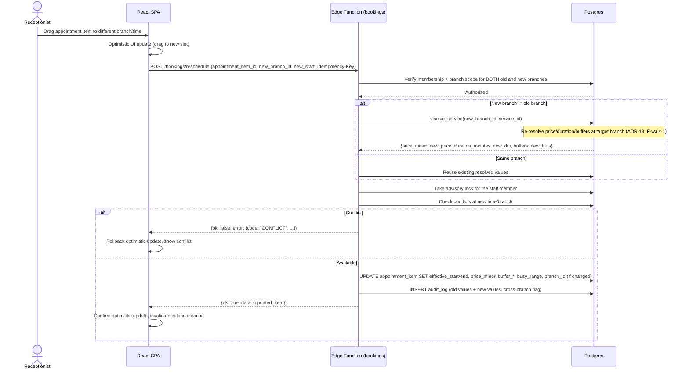
```mermaid
sequenceDiagram
  actor R as Receptionist
  participant FE as React SPA
  participant EF as Edge Function (bookings)
  participant DB as Postgres

  R->>FE: Drag appointment item to different branch/time
  FE->>FE: Optimistic UI update (drag to new slot)
  FE->>EF: POST /bookings/reschedule {appointment_item_id, new_branch_id, new_start, Idempotency-Key}

  EF->>DB: Verify membership + branch scope for BOTH old and new branches
  DB-->>EF: Authorized

  alt New branch != old branch
    EF->>DB: resolve_service(new_branch_id, service_id)
    Note over DB: Re-resolve price/duration/buffers at target branch (ADR-13, F-walk-1)
    DB-->>EF: {price_minor: new_price, duration_minutes: new_dur, buffers: new_bufs}
  else Same branch
    EF->>DB: Reuse existing resolved values
  end

  EF->>DB: Take advisory lock for the staff member
  EF->>DB: Check conflicts at new time/branch
  alt Conflict
    EF-->>FE: {ok: false, error: {code: "CONFLICT", ...}}
    FE->>FE: Rollback optimistic update, show conflict
  else Available
    EF->>DB: UPDATE appointment_item SET effective_start/end, price_minor, buffer_*, busy_range, branch_id (if changed)
    EF->>DB: INSERT audit_log (old values + new values, cross-branch flag)
    EF-->>FE: {ok: true, data: {updated_item}}
    FE->>FE: Confirm optimistic update, invalidate calendar cache
  end
```

Reschedule explanation: A cross-branch reschedule must re-resolve price, duration, and buffers via `resolve_service(target_branch_id, service_id)` — reusing the old branch's snapshot is a billing error (ADR-13, F-walk-1). The audit record carries both old and new resolved values. Direct updates of `scheduled_start/end` or item spans are prohibited — reschedule goes through the same locked RPC path as creation, closing the "reschedule bypasses the trigger" hole (ADR-24).

### 4.4 Check-in and checkout with cash payment

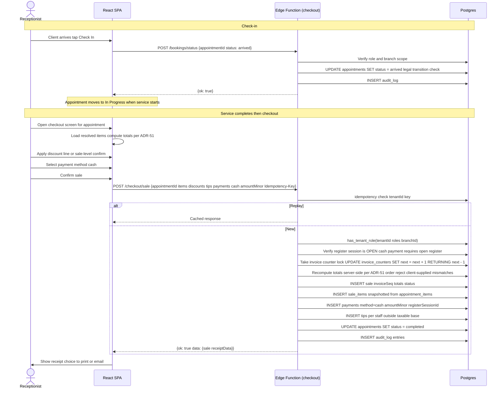
```mermaid
sequenceDiagram
  actor R as Receptionist
  participant FE as React SPA
  participant EF as Edge Function (checkout)
  participant DB as Postgres

  Note over R,DB: Check-in
  R->>FE: Client arrives tap Check In
  FE->>EF: POST /bookings/status {appointmentId status: arrived}
  EF->>DB: Verify role and branch scope
  EF->>DB: UPDATE appointments SET status = arrived legal transition check
  EF->>DB: INSERT audit_log
  EF-->>FE: {ok: true}
  Note over FE: Appointment moves to In Progress when service starts
  Note over R,DB: Service completes then checkout
  R->>FE: Open checkout screen for appointment
  FE->>FE: Load resolved items compute totals per ADR-51
  R->>FE: Apply discount line or sale-level confirm
  R->>FE: Select payment method cash
  R->>FE: Confirm sale
  FE->>EF: POST /checkout/sale {appointmentId items discounts tips payments cash amountMinor Idempotency-Key}
  EF->>DB: idempotency check tenantId key
  alt Replay
    EF-->>FE: Cached response
  else New
    EF->>DB: has_tenant_role(tenantId roles branchId)
    EF->>DB: Verify register session is OPEN cash payment requires open register
    EF->>DB: Take invoice counter lock UPDATE invoice_counters SET next = next + 1 RETURNING next - 1
    EF->>DB: Recompute totals server-side per ADR-51 order reject client-supplied mismatches
    EF->>DB: INSERT sale invoiceSeq totals status
    EF->>DB: INSERT sale_items snapshotted from appointment_items
    EF->>DB: INSERT payments method=cash amountMinor registerSessionId
    EF->>DB: INSERT tips per staff outside taxable base
    EF->>DB: UPDATE appointments SET status = completed
    EF->>DB: INSERT audit_log entries
    EF-->>FE: {ok: true data: {sale receiptData}}
  end
  FE->>R: Show receipt choice to print or email
```

Checkout explanation: The checkout RPC implements the deterministic calculation order from ADR-51: line base → line discounts (fixed then percent) → invoice-level pro-rata allocation → tax extraction → tips (separate) → sale total. Client-supplied totals that differ from the server recomputation are rejected (tampered-total negative test). Cash payments require an open register session (ADR-6). The invoice number is assigned inside the sale transaction via row-locked `UPDATE ... RETURNING` on `invoice_counters` (ADR-14). All money mutations carry an `Idempotency-Key` (ADR-31). All checkout writes go through the `checkout` Edge Function — never direct supabase-js (ADR-28). Receptionists keep checkout, discounts, and tips; refunds and voids are owner/manager-only (ADR-10 round 2, F-perm-1).

### 4.5 Refund by a manager

```mermaid
sequenceDiagram
  actor M as Branch Manager
  participant FE as React SPA
  participant EF as Edge Function (checkout)
  participant DB as Postgres

  M->>FE: Open sale detail tap Refund Payment
  M->>FE: Select payment to refund enter reason
  FE->>EF: POST /checkout/refund {paymentId amountMinor reason Idempotency-Key}
  EF->>DB: has_tenant_role(tenantId managerRoles branchId)
  Note over DB: Receptionist is FORBIDDEN per ADR-10 round 2
  EF->>DB: SELECT payment verify exists branch scope type=payment
  EF->>DB: SELECT sum refunded amounts for this payment
  alt Refund exceeds original
    EF-->>FE: {ok: false error: {code: VALIDATION message: Refund exceeds payment amount}}
  else Valid
    EF->>DB: INSERT payments type=refund refundsPaymentId positive amountMinor reason registerSessionId=NULL if no open session
    Note over DB: Trigger enforces sum refunds <= original out-of-session refunds flagged in audit
    EF->>DB: UPDATE sale SET status and due_minor recalculated
    EF->>DB: INSERT audit_log refund action manager id
    EF-->>FE: {ok: true data: {refund}}
  end
  FE->>M: Refund confirmed daily summary flags out-of-session refunds
```

Refund explanation: Refunds are a `payments` row with `payment_type = 'refund'` and a **positive** `amount_minor` referencing `refunds_payment_id` (ADR-34 round 2, F-PLAN-2). No separate refunds table exists; no negative ledger amounts exist. A trigger enforces `sum(refund amounts) ≤ original payment amount`. Refunds are owner/branch-manager only — receptionists are forbidden (ADR-10 round 2, F-perm-1). Cash refunds executed when the branch has no open register session are allowed (manager-approved) and recorded with `register_session_id IS NULL`, flagged in the daily summary and audit (ADR-6, F-walk-2). The original payment record is never mutated.

### 4.6 End-of-day cash-up

```mermaid
sequenceDiagram
  actor M as Branch Manager
  participant FE as React SPA
  participant EF as Edge Function (checkout)
  participant DB as Postgres

  M->>FE: Open register tap Close Register
  M->>FE: Enter counted cash amount
  FE->>EF: POST /checkout/close-register {registerSessionId countedCashMinor}
  EF->>DB: has_tenant_role(tenantId managerRoles branchId)
  EF->>DB: Verify session is OPEN and belongs to this branch
  EF->>DB: SELECT sum cash payments for this session
  EF->>DB: UPDATE register_sessions SET countedCashMinor differenceMinor closedBy closedAt status=closed
  alt Difference != 0
    EF->>DB: INSERT audit_log cash difference flagged
  end
  EF-->>FE: {ok: true data: {sessionSummary expected counted difference}}
  FE->>M: Show cash-up summary discrepancies flagged
```

Cash-up explanation: One register session per branch at a time (ADR-6). Daily reconciliation: expected = `starting_cash_minor + sum(cash payments during session) − sum(cash refunds)`. Difference = `counted − expected`. Out-of-session cash refunds (with `register_session_id IS NULL`) are flagged in the daily summary and audit (ADR-6, F-walk-2). Register sessions and their close go through the `checkout` Edge Function.

### 4.7 Tenant onboarding

```mermaid
sequenceDiagram
  actor P as Platform Admin
  participant OPS as Ops Script / UI
  participant EF as Edge Function (onboarding)
  participant DB as Postgres (service role)

  P->>OPS: Create tenant: company name, owner email, plan, currency, default branch details
  OPS->>EF: POST /onboarding/provision {tenant, owner_user, branch, plan} (service_role auth)

  EF->>DB: CREATE tenant row (service role — no authenticated insert policy)
  EF->>DB: CREATE or find auth user for owner
  EF->>DB: INSERT profile (trigger on auth.users)
  EF->>DB: INSERT membership (tenant_owner, all_branches=true)
  EF->>DB: INSERT branch (default, timezone='Asia/Kuwait')
  EF->>DB: INSERT branch_opening_hours (default business hours)
  EF->>DB: INSERT invoice_counters (invoice + appointment_ref, starting at 1)
  EF->>DB: INSERT plan_features row
  EF->>DB: INSERT currency or link existing (KWD, exponent=3)
  EF->>DB: SEED cancellation_reasons, blocked_time_types (bilingual defaults)
  EF->>DB: INSERT audit_log entries

  EF-->>OPS: {ok: true, data: {tenant, owner_user_id, branch}}
  OPS->>P: Done. Owner receives credentials.
```

Onboarding explanation: Tenant creation is platform-admin-only through the `onboarding` Edge Function under the service role (ADR-20 rule 3). No `authenticated` insert policy exists on `tenants` (open question 7 ruled). Provisioning is idempotent (re-run safe, ADR-31 pattern). The owner gets `tenant_owner` role with `all_branches = true`. Default seeded data includes bilingual cancellation reasons and blocked time types (ADR-16). Branch defaults use `Asia/Kuwait` timezone, Saturday as first day of week for Arabic-first tenants (ADR-52).

### 4.8 Edge Function call: JWT verification, tenant checks, idempotency, error format

```mermaid
sequenceDiagram
  participant FE as React SPA (packages/api)
  participant EF as Edge Function (_shared/server.ts)
  participant Auth as Supabase Auth
  participant DB as Postgres

  FE->>EF: POST /functions/v1/bookings/create\nAuthorization: Bearer <JWT>\nIdempotency-Key: <UUID>\nBody: {tenant_id, branch_id, ...}

  Note over EF: _shared/server.ts wrapper extracts auth mode = 'user'

  EF->>Auth: supabase.auth.getUser(jwt)
  Auth-->>EF: {user: {id}, session} or error
  alt Invalid/expired JWT
    EF-->>FE: {ok: false, error: {code: "UNAUTHENTICATED", message: "..."}}
  end

  EF->>DB: SELECT memberships WHERE user_id = $1 AND tenant_id = $2 AND is_active = true
  DB-->>EF: [{role, branch_id, all_branches}]
  alt No active membership
    EF-->>FE: {ok: false, error: {code: "FORBIDDEN", message: "..."}}
  end

  EF->>DB: has_tenant_role(tenant_id, required_roles, branch_id)
  DB-->>EF: false
  alt Insufficient role for branch
    EF-->>FE: {ok: false, error: {code: "FORBIDDEN", message: "..."}}
  end

  EF->>DB: idempotency_keys check (tenant_id, key)
  alt status = 'completed'
    EF-->>FE: Cached response (200 with prior body)
  else status = 'processing'
    EF-->>FE: {ok: false, error: {code: "CONFLICT", message: "Request in progress"}}
  else new key
    EF->>DB: INSERT idempotency_keys (status='processing')
    EF->>DB: Execute business logic (book appointment, create sale, etc.)
    alt Success
      EF->>DB: UPDATE idempotency_keys SET status='completed', response_body
      EF-->>FE: {ok: true, data: {...}}
    else Validation error
      EF-->>FE: {ok: false, error: {code: "VALIDATION", message: "...", fieldErrors: {...}}}
    else Internal error
      EF->>DB: UPDATE idempotency_keys SET status='failed'
      EF-->>FE: {ok: false, error: {code: "INTERNAL", message: "..."}}
    end
  end
```

Edge Function explanation: Every function uses the shared `_shared/server.ts` wrapper (ADR-35), which handles JWT verification via `supabase.auth.getUser()`, assembles context (tenant, branch, role from live membership lookup), and emits the versioned envelope `{ok, data}` / `{ok, error: {code, message, fieldErrors?, details?}}` (ADR-29). Authorization is never derived from JWT claims (ADR-19). The `Idempotency-Key` header is required on money mutations; the `idempotency_keys` table caches responses and detects `processing` collisions (ADR-31). The error code catalogue is defined once in `packages/validation` (TS) and mirrored in `_shared/errors.ts` (Deno): `VALIDATION(400)`, `UNAUTHENTICATED(401)`, `FORBIDDEN(403)`, `NOT_FOUND(404)`, `CONFLICT(409)`, `IDEMPOTENCY_MISMATCH(422)`, `RATE_LIMITED(429)`, `INTERNAL(500)`, `UNAVAILABLE(503)` (ADR-29).

---

## 5. State diagrams

### 5.1 Appointment state machine

```mermaid
stateDiagram-v2
  [*] --> booked : Receptionist/Manager\ncreates booking
  booked --> confirmed : Receptionist/Manager\nconfirms (opt)
  confirmed --> arrived : Client arrives\nCheck-in
  booked --> arrived : Client arrives\nCheck-in (skip confirm)
  arrived --> in_progress : Service begins
  in_progress --> completed : Service completes\n→ Checkout flow
  booked --> cancelled : Cancelled with reason\n(any state before completed)
  confirmed --> cancelled : Cancelled with reason
  arrived --> cancelled : Cancelled with reason
  booked --> no_show : Client does not arrive\n(manager action or cron)
  confirmed --> no_show : Client does not arrive
  completed --> [*]
  cancelled --> [*]
  no_show --> [*]

  note right of booked
    Status enum (ADR-7):
    booked, confirmed, arrived,
    in_progress, completed,
    cancelled, no_show
  end note

  note right of cancelled
    appointment_items.status_active
    = false on cancel/no_show
    (drops out of exclusion constraint)
  end note
```

Appointment state explanation: The appointment status enum is fixed: `booked, confirmed, arrived, in_progress, completed, cancelled, no_show` (ADR-7). `in_progress` is the canonical value — `started` is banned. Only legal transitions are allowed; backward moves require manager override and are audit-logged (ADR-7). Custom statuses are deferred non-committed (ADR-7, F-cov-5). When an appointment is cancelled or marked no_show, `appointment_items.status_active` is set to `false`, dropping the item out of the exclusion constraint and freeing the slot (ADR-24). The checkout flow transitions the appointment to `completed` as part of the sale transaction.

### 5.2 Sale state machine

```mermaid
stateDiagram-v2
  [*] --> unpaid : Checkout creates sale
  unpaid --> part_paid : First payment received\n(total > 0, due > 0)
  part_paid --> completed : Final payment\n(due = 0)
  unpaid --> completed : Full payment\nin single transaction
  unpaid --> voided : Manager voids\nsame-day only, reason required
  part_paid --> voided : Manager voids\nsame-day only
  completed --> [*]
  voided --> [*]

  note right of unpaid
    Status enum (ADR-7):
    unpaid, part_paid,
    completed, voided
  end note

  note left of voided
    Void: same-day only,
    reason required,
    sale preserved with
    status = 'voided',
    never deleted (ADR-10)
  end note
```

Sale state explanation: The sale status enum is fixed: `unpaid, part_paid, completed, voided` (ADR-7). `completed` means fully paid and closed. Voids are same-day only with a required reason; the sale record is preserved with status `voided` — never deleted (ADR-10, ADR-46). Refunds do not change the sale status — they are separate `payments` rows of type `refund` (ADR-34). The `due_minor` generated column (`total - sum(payments)`) drives the `unpaid → part_paid → completed` transitions.

### 5.3 Payment and refund state

```mermaid
stateDiagram-v2
  [*] --> payment_recorded : Cash/manual payment\nrecorded at checkout
  
  state payment_recorded {
    [*] --> active : Payment row created\n(type = 'payment')
    active --> fully_refunded : Refund(s) sum = amount
    active --> partially_refunded : Refund(s) sum < amount
  }

  payment_recorded --> [*] : Payment exists in immutable ledger

  note right of payment_recorded
    Payments table (ADR-34):
    - payment_type: payment | refund
    - All amounts positive (bigint _minor)
    - Trigger: sum(refunds) <= original
    - Never mutated or deleted
  end note
```

Payment state explanation: There is no separate refunds table — all money movements are `payments` rows (ADR-34). A refund is a `payments` row with `payment_type = 'refund'` and a **positive** `amount_minor` referencing `refunds_payment_id`. All amounts are `CHECK (amount_minor >= 0)` — no signed ledger columns. A trigger enforces `sum(refund amounts) <= original payment amount`. Financial rows are immutable (ADR-46); corrections are new rows (refunds). Full refunds are in MVP; partial refunds arrive in plan Phase 10 with online payments (ADR-34).

### 5.4 Staff shift lifecycle

```mermaid
stateDiagram-v2
  [*] --> scheduled : Manager creates shift\n(starts_at, ends_at)
  scheduled --> in_progress : Current time >= starts_at
  in_progress --> completed : Current time >= ends_at
  scheduled --> cancelled : Manager cancels shift
  scheduled --> [*]
  in_progress --> [*]
  completed --> [*]
  cancelled --> [*]
```

Shift explanation: Shifts are dated rows (`timestamptz` ranges), not weekly templates (ADR-26). The shift grid materializes a week of rows and supports copy-previous-week. Overnight shifts (`ends_at` next day) are natural with `timestamptz`. Shifts are a soft constraint on booking — booking outside a shift produces a warning with manager override recorded in `booking_overrides` (ADR-26).

### 5.5 Tenant lifecycle

```mermaid
stateDiagram-v2
  [*] --> trial : Platform admin provisions\n(onboarding function)
  trial --> active : Owner completes setup\n(checklist done)
  active --> suspended : Platform admin suspends\n(payment or TOS)
  suspended --> active : Platform admin reactivates
  active --> offboarding : Owner requests offboarding\n(ADR-50)
  
  state offboarding {
    [*] --> export : Full tenant export\n(ADR-43)
    export --> soft_archive : Marked inactive\nmemberships deactivated\n28-day read-only
    soft_archive --> anonymize : Personal fields\nreplaced via RPC
    anonymize --> financial_retention : Financial records\nretained 10 years
    financial_retention --> deleted : Hard delete\nafter retention period
  }

  offboarding --> [*]
```

Tenant lifecycle explanation: Tenants begin as `trial` when provisioned by the platform admin via the `onboarding` Edge Function (ADR-18, ADR-20 rule 3). Setup checklist completion transitions to `active`. The offboarding contract follows ADR-50: export -> 28-day soft archive -> anonymize personal data via the NFR-11 RPC -> retain financials for the Kuwaiti commercial period (default 10 years, legal confirmed at plan Phase 17 scheduling, ADR-50) -> hard delete. The anonymize RPC built in plan Phase 4 is the same machinery used for offboarding. Subscription billing and self-serve signup arrive in plan Phase 17 (ADR-18).

---

## 6. Security model

### 6.1 Roles x actions x enforcement point

| Action | tenant_owner | branch_manager | receptionist | staff | Enforcement point |
|---|---|---|---|---|---|
| View own branch schedule | Yes | Yes | Yes | Yes | RLS (branch-scoped SELECT) |
| View all branches schedule | Yes | Yes (assigned) | No | No | RLS (all_branches + branch scope) |
| Create booking | Yes | Yes | Yes | No | `bookings` Edge Function + RLS roles |
| Reschedule/cancel booking | Yes | Yes | Yes | No | `bookings` Edge Function + RLS roles |
| Check-in + checkout | Yes | Yes | Yes | No | `checkout` Edge Function + RLS roles |
| Apply discounts | Yes | Yes | Yes | No | `checkout` Edge Function + RLS roles |
| Add tips | Yes | Yes | Yes | Yes (own) | `checkout` Edge Function + RLS roles |
| Full refund | Yes | Yes | **FORBIDDEN** | **FORBIDDEN** | `checkout` Edge Function (server-side role check, ADR-10) |
| Void sale | Yes | Yes | **FORBIDDEN** | **FORBIDDEN** | `checkout` Edge Function (server-side role check, ADR-10) |
| Close register | Yes | Yes | No | No | `checkout` Edge Function + RLS roles |
| Create/edit client contact | Yes | Yes | Yes | No | `clients` Edge Function (contact fields) |
| Edit client notes/allergies | Yes | Yes | Yes | No | Direct or `clients` Edge Function |
| View client allergies | Yes | Yes | Yes | **view only** (own-branch clients) | Column-restricted view (ADR-11, F-DB-5) |
| Block/merge/delete client | Yes | Yes | No | No | `clients` Edge Function (carved out, F-4) |
| Import clients CSV | Yes | **FORBIDDEN** | **FORBIDDEN** | **FORBIDDEN** | `clients` Edge Function (owner-only, F-perm-3) |
| Edit service catalogue | Yes | Yes | No | No | Direct supabase-js or `catalogue` Edge Function |
| Edit service pricing | Yes | Yes | No | No | `catalogue` Edge Function (snapshot+audit consistency) |
| Edit staff records | Yes | Yes (own branch) | No | No | `staff` Edge Function |
| Manage shifts | Yes | Yes (own branch) | No | No | Direct supabase-js (manager-gated RLS, ADR-28 allowlist) |
| Create blocked time | Yes | Yes (own branch) | Yes (own branch) | request->approval | `staff` Edge Function (locked RPC, F-DB-6) |
| Edit tenant settings | Yes | No | No | No | Direct supabase-js (role-gated RLS) |
| Edit branch settings | Yes | Yes (own branch) | No | No | Direct supabase-js (role-gated RLS) |
| Manage roles/memberships | Yes | Yes (grant receptionist/staff in own branch) | No | No | `onboarding`/`staff` Edge Function (ADR-20 rule 9) |
| View reports (own branch) | Yes | Yes | Yes | No | `security_invoker` views / `report_*` RPCs |
| View reports (all branches) | Yes | No | No | No | `report_*` RPCs (tenant-wide scope) |
| View own sales (staff) | - | - | - | Yes | `report_own_sales` secured RPC (F-DB-5) |
| Export client contacts | Yes | **FORBIDDEN** | **FORBIDDEN** | **FORBIDDEN** | `reports` Edge Function (owner-only, F-verifier-3) |
| Provision new tenant | No | No | No | No | `onboarding` Edge Function (service role, platform ops, ADR-20 rule 3) |

### 6.2 Tenant isolation attack paths and defences

```mermaid
flowchart TB
  subgraph attacks["Attack paths identified (round 2)"]
    A1["Cross-tenant reads\n(guess UUID of another tenant's row)"]
    A2["Cross-branch reads\n(manager of branch A reads branch B)"]
    A3["Cross-tenant FK injection\n(use tenant A's client_id in tenant B's appointment)"]
    A4["Stale membership\n(revoked user still has valid JWT)"]
    A5["Direct money table writes\n(receptionist inserts refund bypassing role check)"]
    A6["Realtime eavesdropping\n(subscribe to another tenant's postgres_changes)"]
    A7["Service-role escalation\n(function uses service role without scope check)"]
    A8["Composite FK bypass\n(plain UUID FK skips tenant consistency)"]
  end

  subgraph defences["Defences"]
    D1["RLS on every table\n(tenant-scoped USING clause)"]
    D2["Branch-scoped RLS + has_tenant_role()\nwith explicit branch parameter"]
    D3["Composite FKs on every\ntenant-owned parent-child pair"]
    D4["Live membership lookup per request\n(STABLE SECURITY DEFINER, is_active=true)"]
    D5["Direct-write allowlist (ADR-28)\nmoney tables = Edge Function only"]
    D6["Realtime channel authorization tested\nper-table, per-role, per-branch"]
    D7["Every SECURITY DEFINER function\nverifies scope live + SET search_path=public"]
    D8["UNIQUE(id, tenant_id) on every parent\n+ CROSS-TENANT FK attack pgTAP test"]
  end

  A1 --> D1
  A2 --> D2
  A3 --> D3
  A4 --> D4
  A5 --> D5
  A6 --> D6
  A7 --> D7
  A8 --> D8
```

Security explanation: The database is the security boundary — RLS enforces tenant and branch isolation, never application code (ADR-20). Every attack path identified in round 2 has a specific defence tested in CI. The pgTAP harness covers per-table x per-role x per-operation x cross-tenant x cross-branch x anon, plus: revocation-immediacy (deactivating a membership mid-session must block the next request), cross-tenant FK attack inserts must fail, manager of branch A must fail a role check for branch B, and Realtime channel authorization must not leak another tenant's or branch's payloads. `platform_admin` is not a membership role — platform operations use explicit, time-boxed, audit-logged impersonation visible to the tenant owner (ADR-20 rule 9). Every `SECURITY DEFINER` function declares `SET search_path = public` (ADR-20 rule 10); `supabase db lint` enforces this in CI.

---

## 7. Data access map

For every MVP write path: whether it goes through supabase-js (RLS), an SECURITY DEFINER RPC, or an Edge Function, and why.

### 7.1 Direct supabase-js writes (ADR-28 allowlist)

| Entity | Operations allowed directly | Roles | Why direct is safe |
|---|---|---|---|
| `profiles` | UPDATE | Self only | RLS `id = auth.uid()` fully expresses authorization |
| `client_notes` | INSERT, UPDATE, DELETE | receptionist, branch_manager, tenant_owner | Single-table; RLS + role CHECK sufficient |
| `clients` (contact/profile fields only) | INSERT, UPDATE | receptionist, branch_manager, tenant_owner | RLS tenant-scoped; `is_blocked`, `is_deleted`, `merged_into` carved out (F-4); staff role has NO client writes (F-perm-2) |
| `settings` | INSERT, UPDATE, DELETE | tenant_owner (tenant-wide), branch_manager (own branch) | Role-gated RLS; single-key mutations |
| `shifts` | INSERT, UPDATE, DELETE | branch_manager (own branch), tenant_owner | Branch-scoped RLS; dated rows, no cross-entity invariants |

### 7.2 Edge Function / RPC only writes

| Entity | Path | Why Edge Function / RPC is required |
|---|---|---|
| `appointments` + `appointment_items` + `booking_overrides` | `bookings` Edge Function | Conflict engine (exclusion constraint + advisory lock); cross-entity checks (blocked_times); idempotency; ref_number generation; multi-table transaction (ADR-24, ADR-28) |
| `sales` + `sale_items` + `payments` + `tips` | `checkout` Edge Function | Money (ADR-17, ADR-51); invoice number assignment (row-locked counter, ADR-14); tax calculation; register session linking; server-side total recomputation; multi-table transaction; idempotency (ADR-31) |
| `refunds` (payments type=refund) | `checkout` Edge Function | Money; role restriction (owner/manager only, server-side enforced, ADR-10); refund-cap trigger; original payment verification |
| `voids` (sale status=voided) | `checkout` Edge Function | Money; role restriction; same-day validation |
| `register_sessions` | `checkout` Edge Function | Cash reconciliation; one-open-per-branch invariant; multi-table |
| `blocked_times` | `staff` Edge Function (locked RPC) | Cross-entity conflict check (must take advisory lock + check appointments, ADR-24/26, F-DB-6); not a direct-write table |
| `memberships` | `onboarding` / `staff` Edge Function | Role grants (owner-only for owner/manager, ADR-20 rule 9); audit; tenant consistency |
| `tenants` | `onboarding` Edge Function (service role) | No authenticated insert policy (ADR-20 rule 3) |
| `branches` | `onboarding` Edge Function | Multi-table provisioning (branch + hours + counters + seeds) |
| `clients.is_blocked/is_deleted/merged_into` | `clients` Edge Function | Requires role checks + audit; carved out from direct writes (F-4) |
| `service_branch_overrides` (pricing changes) | `catalogue` Edge Function | Snapshot and audit consistency (ADR-13) |
| `invoice_counters` | `checkout` / `bookings` RPC | Row-locked `UPDATE ... RETURNING` must run inside the sale/booking transaction (ADR-14) |
| `audit_log` | Triggers + Edge Function code paths | Direct DML revoked from `anon` and `authenticated` (ADR-22) |

### 7.3 Reads (all direct supabase-js under RLS, except heavy aggregation)

| Entity | Path | Notes |
|---|---|---|
| Lists, details, calendar reads | supabase-js under RLS | Typed via `packages/db`; RLS enforces tenant + branch scope |
| Report views | `security_invoker` views + `GRANT SELECT` | Invoker's RLS applies (ADR-21, F-6) |
| Heavy aggregation reports | `report_*` SECURITY DEFINER RPCs | Internally applies `current_branch_scope()`; staff uses `report_own_sales` only (F-DB-5) |
| Client financial aggregates | Secured RPCs | Branch-scoped per ADR-11; never raw client columns |
| Realtime subscriptions | `useRealtime(entity, tenantId, branchId)` | Channel authorization tested per table/role/branch (ADR-38) |

### 7.4 Data access flow diagram

```mermaid
flowchart TB
  subgraph frontend["Frontend decision: which path?"]
    Q_READ{"Is it a read?"}
    Q_MONEY{"Does it touch money\nor payments?"}
    Q_CONFLICT{"Does it touch\nconflicts or booking?"}
    Q_MULTI{"Multi-table\ntransaction?"}
    Q_ALLOW{"On the direct-write\nallowlist?"}
  end

  Q_READ -->|yes| PATH_READ["supabase-js under RLS\nor report RPC/view"]
  Q_READ -->|no| Q_MONEY
  Q_MONEY -->|yes| PATH_EF["Edge Function\n(bookings/checkout/reports)"]
  Q_MONEY -->|no| Q_CONFLICT
  Q_CONFLICT -->|yes| PATH_EF
  Q_CONFLICT -->|no| Q_MULTI
  Q_MULTI -->|yes| PATH_EF
  Q_MULTI -->|no| Q_ALLOW
  Q_ALLOW -->|yes| PATH_DIRECT["supabase-js direct write\n(profiles, client_notes,\nclient contact fields,\nsettings, shifts)"]
  Q_ALLOW -->|no| PATH_EF

  style PATH_EF fill:#f96,stroke:#333
  style PATH_DIRECT fill:#9f6,stroke:#333
  style PATH_READ fill:#69f,stroke:#333
```

Data access explanation: The decision tree encodes the rules from ADR-28 and CONVENTIONS Section 6. If a write touches money, conflicts, a cross-table transaction, a side effect, or a secret -> Edge Function. If RLS + check constraints fully express the authorization on a single table and nothing else must stay consistent -> direct write is fine (but the table must be on the allowlist). Direct writes still produce audit rows — triggers fire regardless of path (ADR-22). Adding a table to the direct-write allowlist requires a PR showing the RLS policies and constraints that make it safe (ADR-28).

---

## 8. Residual issues

Issues found while producing this document that are not yet resolved in the corpus.

### F-final-arch-1: No active migration set exists

- **Severity**: Major (pre-existing, known)
- **Location**: `sql/` directory
- **Problem**: The 13 draft SQL files are quarantined under `sql/drafts-v1/` with superseded banners (F-1). The active migration set under `supabase/migrations/` has not been written — it is Phase 0/1 build work (Epic 0.2 onward), gated by the CI clean-migration acceptance job (F-verifier-2).
- **Evidence**: `sql/README.md` and `sql/drafts-v1/` contain only quarantined drafts.
- **Fix**: The plan Phase 0 (Epic 0.2) task list names the migration rewrite; the CI gate verifies completeness. No change needed in this round.
- **Affects**: All diagrams in Section 3 reflect the ADR-based canonical schema, not the quarantined drafts. Once real migrations exist, the ER diagrams should be spot-checked against the actual DDL.

### F-final-arch-2: schedule-x verdict not recorded

- **Severity**: Minor (known)
- **Location**: ADR-41
- **Problem**: The Phase 0 spike (schedule-x premium resource scheduler evaluation against NFR-4 render budget, keyboard operation, RTL mirroring, >=8 staff columns) has not yet run. ADR-41 carries a conditional "go" verdict pending the spike outcome; the "no-go" fallback path is scoped but not validated.
- **Evidence**: ADR-41: "Go: buy the license. No-go: fall back to schedule-x core with custom resource columns."
- **Fix**: The spike runs in Phase 0; its outcome is recorded by updating ADR-41. The calendar component surface (`BookingCalendar` wrapper) is designed to abstract either path.
- **Affects**: The architecture assumes a schedule-x-based calendar; the fallback path uses the same wrapper shape.

### F-final-arch-3: Post-MVP sequence diagrams are out of scope

- **Severity**: Minor (by design)
- **Location**: Sections 4, 7
- **Problem**: Sequence diagrams and the data access map cover MVP paths only. Plan Phases 9-17 (online booking, online payments, marketing, retail, packages, resources, payroll, SaaS self-serve) are decision-level only; their detailed interaction flows are not modelled.
- **Evidence**: `IMPLEMENTATION_PLAN.md` timeline note (round 2, F-PLAN-17): "Post-MVP phases are decision-level only; their per-task backlogs are produced at scheduling time."
- **Fix**: Sequence diagrams for online booking, payment webhooks, membership billing, and multi-currency should be added when those phases are scheduled and their backlogs are written.
- **Affects**: The payment flow in Section 4.4 assumes manual/cash methods; online payment redirects and webhooks (plan Phase 10) are not diagrammed.

### F-final-arch-4: Storage and avatars not yet designed

- **Severity**: Minor (known)
- **Location**: ADR-43
- **Problem**: Storage (avatars, receipt PDFs, marketing assets, client forms, document uploads) is an unconditional Phase 9 design task that ships before any upload feature. Its RLS policy design (tenant/branch-prefixed paths, private buckets, scope mirroring) has not been produced.
- **Evidence**: ADR-43: "Plan Phase 9 introduces Storage with tenant/branch-prefixed paths ... designed before any upload feature ships."
- **Fix**: The Storage RLS design task is named in the Phase 9 backlog. The C4 and deployment diagrams note Storage as "plan Phase 9+".
- **Affects**: Sections 1 and 2 show Storage as a dashed (post-MVP) component.

### F-final-arch-5: Data residency region is an assumption, not settled

- **Severity**: Minor (known)
- **Location**: ADR-48
- **Problem**: The production region defaults to `eu-central-1` as a product/legal assumption; no compliance claim is made. A legal verification gate is required before Phase 8 go-live.
- **Evidence**: ADR-48: "recorded as a product/legal assumption, not a compliance claim." The go-live checklist carries the legal confirmation item.
- **Fix**: Legal confirms the PDPA posture before Phase 8; if a different region is required, a Supabase project migration is scheduled.
- **Affects**: The deployment diagram (Section 2.1) shows `eu-central-1` with an ADR-48 citation.

### F-final-arch-6: Realtime authorization testing scope

- **Severity**: Minor
- **Location**: ADR-38, CONVENTIONS Section 7
- **Problem**: Realtime channel authorization testing (subscribing as tenant A/branch A must never receive tenant B or branch B payloads) is required but the detailed test design is left to the Phase 5 implementation. The test must cover `postgres_changes` subscription filtering at the Supabase level.
- **Evidence**: ADR-38: "the test plan includes Realtime channel authorization — subscribing as tenant A/branch A must never receive tenant B or branch B payloads."
- **Fix**: pgTAP-style Realtime authorization test to be written in plan Phase 5 alongside the calendar.
- **Affects**: Security model (Section 6.2) lists this as defence D6 but notes the test is not yet specified in pgTAP form.

---

*Document ends. All diagrams follow the revised `decisions.md` (ADRs 1-52), `IMPLEMENTATION_PLAN.md` (Phases 0-17), `CONVENTIONS.md`, the `spa-domain-glossary` naming authority, and the `supabase-database` skill patterns.*