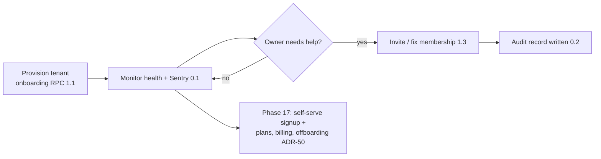
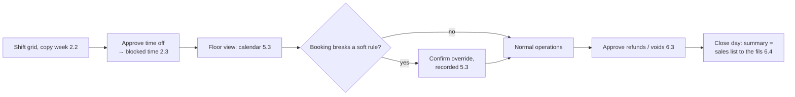
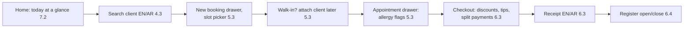
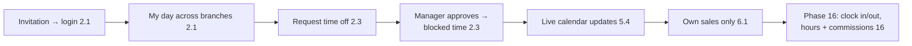
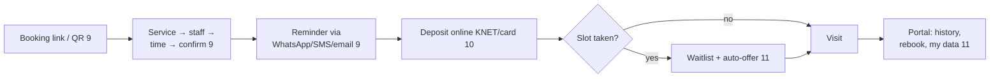

# Fresha parity, extra features and user journeys

Draft for PLAN.md — parity and journeys section. Written by the parity/journeys member (final round).

Evidence keys used in this draft (all under `/Users/fahad/council/output/`):
- `pages.md` — page/feature inventory of the Fresha partner dashboard (§number = section).
- `technical/flows.md` — create/edit flows (§Flow N).
- `technical/settings.md` — settings tree deep pass (§Settings name).
- `technical/reports.md` — reports deep pass (§5 catalogue, §6 families).
- `technical/gaps.md` — resolved UNVERIFIED items, top bar, list-page chrome.
- `TECHNICAL_REPORT.md` — consolidated deep pass (§number).

Phase references use the canonical Phase 0–17 numbering from the revised `IMPLEMENTATION_PLAN.md`. Where round-1 documents say "release Phase 2/3" (the old release-bucket scheme), this draft always restates the canonical number: release "Phase 2" = plan Phases 9–11, release "Phase 3" = plan Phases 12–17 (IMPLEMENTATION_PLAN.md §Phase numbering). Money is KWD minor units (fils), 3 decimals (ADR-17). Names follow the spa-domain glossary ("branch", "staff member", "client", "appointment", "sale" — never location/employee/customer).

---

## 1. Fresha parity matrix

One row per Fresha feature, grouped by area. "Our equivalent" gives the module and phase.subphase from `IMPLEMENTATION_PLAN.md` (epic numbering). "Difference" explains how ours differs or improves, and why — or the row says **not planned** with the reason. Coverage numbers close each area.

Fresha's own model is single-tenant-first with paid add-ons and a consumer marketplace (TECHNICAL_REPORT.md §2.5, §2.3). Ours is multi-tenant B2B SaaS with branch-level isolation (ADR-20), no add-on storefront (plan tiers instead, ADR-18), and no consumer marketplace. Several Fresha features therefore have no equivalent by design, and several of our features (branch scoping, cross-branch conflict, audit log, tenant portability) have no Fresha equivalent — those appear in §2.

### 1.1 Calendar & booking

| Fresha feature | What it does for the business | Evidence | Our equivalent | Difference / why |
|---|---|---|---|---|
| Calendar, day view, per-staff columns | The floor view reception works from | pages.md §2; TECHNICAL_REPORT.md §4.3 | Calendar day view, per-staff columns — 5.3 | Same concept; our conflict engine is cross-branch by construction (ADR-24: the exclusion constraint has no branch dimension), so a staff member booked at branch A cannot be double-booked at branch B. Fresha's per-location workspaces do not give this guarantee across locations. |
| Calendar view modes (day; week via view switch) | Plan the week per branch | pages.md §2 | Week view — 5.3 | Same. Resources/room columns are plan Phase 15 (ADR-4). |
| Date navigation (Today, prev/next, picker) | Move around the calendar | pages.md §2 | 5.3 (calendar UI) | Same; first-day-of-week and 12/24h are per-branch preferences (ADR-52, built 1.2). Arabic-first default Saturday. |
| "Scheduled team" toggle | Filter which staff show as columns | pages.md §2 | Staff filters — 5.3 | Same behaviour; branch switcher drives the column set (ADR-37). |
| Add appointment from calendar | Book a walk-in or phone booking fast | pages.md §2; flows.md §Flow 5 | New-booking drawer: client picker (search, duplicate warning, walk-in), service (eligibility-filtered), slot picker — 5.3 | Walk-in is a first-class flag, never a fake client record (glossary). Blocked clients are rejected (US-CL-8). |
| Appointment drawer (view/edit items, statuses, checkout link) | The single place staff manage a visit | pages.md §39; TECHNICAL_REPORT.md §5.3 | Appointment drawer: items with per-item staff, allergy flags, notes, actions — 5.3 | Ours shows per-item staff and effective spans (ADR-23), not just a service list. Allergy flagging contract defined in 4.3, consumed in 5.3. |
| Reschedule (move/drag) | Change time without re-entering data | TECHNICAL_REPORT.md §4.3 | Drag-to-reschedule with optimistic update + CONFLICT rollback — 5.3 | Cross-branch reschedule re-prices via `resolve_service(target_branch)` with old/new values audited (ADR-13, round-2 F-walk-1). |
| Cancel with reason | Track why appointments die | flows.md §Flow 5 (lifecycle states) | Cancel requires a configurable bilingual reason — 5 (reasons built 1.2) | Reasons are tenant-configurable and bilingual (ADR-16); reason feeds reports. |
| Mark no-show | Feed no-show counts and fees | TECHNICAL_REPORT.md §8.4 | No-show status action — 5.2 | Feeds client no-show count on the profile (5.3) and today's no-show count (US-DASH-1, 7.2). No-show fees are plan Phase 10. |
| Appointment statuses (Booked/Confirmed/…/Completed/Cancelled) | Communicate visit state | flows.md §Flow 5 | Fixed enum incl. `in_progress` — 5.1 (ADR-7) | Same lifecycle shape; legal-transition state machine enforced server-side. Custom statuses: non-committed Phase 12 candidate (F-cov-5). |
| Conflict prevention, buffers, working hours | Never double-book; prep/cleanup time | TECHNICAL_REPORT.md §4.3 | Slot engine + exclusion constraints + advisory locks — 5.1/5.2 (ADR-24/25/26) | Buffers are first-class and snapshotted into the busy range (ADR-25). Hard guarantee is DB-level, race-tested in CI — stronger than a UI-level check. |
| Blocked time (types: lunch, training…) | Keep staff calendars realistic | settings.md §Scheduling (blocked-time-types); TECHNICAL_REPORT.md §6.2 | Blocked time with configurable types — 2.3; types built 1.2 | Ours adds all-branches time off (`all_branches` representation, ADR-20 rule 6) and creation rights: receptionist own-branch, staff request + manager approve (F-DB-6). |
| Closed periods / holidays | Remove availability on holidays | settings.md §Scheduling (closed-periods) | `closed_periods` per branch — 1.2; slot engine subtracts — 5.2 | Per-branch closures, overnight-aware. |
| Repeat / series appointments | "Every Tuesday at 4" | pages.md §39 (repeat field) | Plan Phase 11 — 11 (ADR-8) | Deferred to keep MVP conflict logic simple; per-occurrence edit/cancel when built. |
| Waitlist | Fill cancelled slots | settings.md §Scheduling (waitlist); reports (waitlist detail/summary) | Plan Phase 11 — 11 | Auto-offer freed slots via Phase 9 notifications. |
| Group appointments (several clients, one service) | Bridal parties, couples | TECHNICAL_REPORT.md §3.1 | Plan Phase 15 — 15 | Needs the resource/group machinery; MVP conflicts are staff+time only (ADR-4). |
| Dynamic assignment (auto-assign staff) | Route online bookings automatically | settings.md §Scheduling (dynamic-assignment) | Not planned for MVP; candidate Phase 9 (see F-final-parity-6) | Our "any eligible staff" round-robin (3.3) makes auto-assignment small once online booking exists (9). |
| Appointment reference number | Human-readable number on receipts/lists | pages.md §5 (Ref # column) | Per-branch `ref_number` from the booking RPC counter, `UNIQUE(branch_id, ref_number)` — 5.1 (ADR-14, F-DB-7) | Per-branch like Fresha; concurrency-tested. |
| Resources / bookable resources columns | Rooms and equipment limit capacity | settings.md §Scheduling (resources) | Plan Phase 15 — 15 (ADR-4) | Deliberate MVP deferral; busy-source interface designed for it (ADR-4 consequence). |
| Custom appointment statuses | Tenant-specific statuses | settings.md §Scheduling (appointment-statuses) | Not planned in MVP; non-committed Phase 12 candidate (F-cov-5, ADR-7) | Fixed enum keeps the state machine and reports honest; revisit only if automations need it. |

Coverage: 20 rows — MVP 14, later phases 4 (11: ×2, 15: ×2), candidate-only 2 (dynamic assignment 9, custom statuses 12), not planned 0.

### 1.2 Sales & checkout

| Fresha feature | What it does for the business | Evidence | Our equivalent | Difference / why |
|---|---|---|---|---|
| Checkout (POS) from appointment or walk-in | Take money for the visit | pages.md §39 (Checkout button); TECHNICAL_REPORT.md §8.5 | Checkout drawer: cart from appointment items or manual lines, discounts, tips, split manual payments — 6.3 | Cash + manual/terminal methods only in MVP (ADR-34); online methods land Phase 10 behind a provider abstraction. Part-paid completion supported (US-CO-6). |
| Sale creation | The invoice record | pages.md §6 | Transactional `create_sale` RPC: invoice number, derived totals, idempotency key — 6.1 (ADR-14/31/51) | Totals derive from lines and reconcile at write time; client-supplied totals that disagree are rejected. Calculation order + half-up rounding fixed by ADR-51 golden fixtures. |
| Sales list (Sale #, client, status, tips, gross) | Find any invoice | pages.md §6 | Sales list + sale detail — 6.4 | Same; filters and search by client/number. |
| Sales "Drafts" tab | Park an unfinished cart | pages.md §6 | **Not planned** (see F-final-parity-2) | Sale creation is atomic and idempotent; unpaid/part_paid statuses cover "started but not settled". A draft-cart state adds reconciliation risk at a Kuwait front desk for little value. Revisit if pilots demand it. |
| Appointments list (report-style, exportable) | Tabular list of all appointments | pages.md §5 | Appointments summary report — 7.1 (US-RPT) | Report framework with date presets, branch filter, CSV export (US-SAL-2). |
| Payments transactions list | Audit every money movement | pages.md §7 | Payments list with per-method totals — 6.4 (US-SAL-1) | Ours is a ledger: refunds are positive `payment_type='refund'` rows linked to the original (ADR-34), never mutations of history. |
| Refunds | Give money back | TECHNICAL_REPORT.md §4.4 | Full refund — 6.1/6.3 (ADR-10) | Owner/manager-only (receptionist forbidden, F-perm-1), cap-enforced (total refunds ≤ paid, DB trigger). Out-of-session cash refunds allowed, unlinked, manager-approved, flagged (F-walk-2). Partial refunds Phase 10. |
| Void | Undo an erroneous same-day sale | TECHNICAL_REPORT.md §4.4 | Same-day void with reason, record kept `voided` — 6.1/6.3 (ADR-10) | Same rule. |
| Discounts (line/sale, fixed/percent) | Price flexibility at the desk | TECHNICAL_REPORT.md §4.4 | Line and sale discounts with reason — 6.3 | Reason is recorded; ADR-51 defines discount-then-tax-then-tip order. Promo codes are Phase 12. |
| Tips (per staff) | Kuwait salon reality | settings.md §Sales (tipping) | Tips per staff at checkout — 6.3 (ADR-15) | Feed staff reports (Phase 16 commissions). |
| Register (cash drawer open/close) | Reconcile cash daily | pages.md §4; settings.md §Sales (registers) | Register sessions: open with starting cash, close counted, difference recorded — 6.1/6.4 (ADR-6) | Included in our MVP plan (it is how a salon reconciles cash), one open session per branch. |
| Daily sales summary | Close the day | pages.md §3 | Daily sales summary screen + `report_daily_sales` — 6.4 / 7.1 | Must equal sales-list totals for identical filters (US-SAL-3 reconciliation gate). |
| Receipts (print) | Client-facing proof | settings.md §Sales (receipts) | Print-ready receipt, EN/AR per client language, configurable header/footer — 6.3 | Email receipts Phase 9 (messaging provider needed). |
| Invoice numbering | Sequential invoice numbers | settings.md §Business (location settings) | Per-branch sequential `invoice_seq` from `invoice_counters` — 1.1 / 6.1 (ADR-14) | Per branch, gap-tolerant, unique `(branch_id, invoice_seq)`, concurrency-tested. |
| Taxes (rates, tax-inclusive option) | VAT-ready accounting | settings.md §Sales (tax-rates) | `tax_rates` tenant-level, basis points, ADR-51 extraction rules — 6.1; taxes summary report — 7.1 (F-cov-3) | Kuwait is zero-rated today; the model ships in MVP so a GCC VAT turn-on needs no migration. |
| Service charges | Percentage surcharge at checkout | settings.md §Sales (service-charges) | **Not planned** (see F-final-parity-3) | Tips and manual items cover the desk need; tax machinery (ADR-51) covers percentage math if a tenant ever demands it. |
| Gift cards sold (list) | Track prepaid liabilities | pages.md §8 | Plan Phase 14 — 14 (ADR-3) | Liability-aware accounting required; deliberately after payments/retail. |
| Packages sold (list) | Track session bundles | pages.md §9 | Plan Phase 14 — 14 (ADR-3) | Redemption at checkout; liability tracking; revenue-recognition rules documented. |
| Memberships sold (paid plans) | Recurring revenue | pages.md §10 | Plan Phase 14 — 14 (ADR-3/34) | Recurring billing on tokenized cards only — never KNET recurring (ADR-34); gateway facts re-verified at Phase 10 discovery (binding). |
| Prepayments | Pay ahead of the visit | reports.md §6.4 (prepayment list) | Deposits/prepayments — 10 | Needs online payments. |
| Custom checkout methods | Label the ways a branch takes money | settings.md §Sales (payment-methods) | Checkout-method enablement per branch — 1.2 (ADR-34) | Same idea; methods feed the payments ledger enum. |
| Checkout "pay now" link / online payment at checkout | Card payment from the desk | settings.md §Sales (pay-now) | Plan Phase 10 — settle-online for part-paid sales | MyFatoorah first, Tap adapter interface (ADR-34). |

Coverage: 22 rows — MVP 15, later phases 5 (10: ×2, 14: ×3), not planned 2 (drafts, service charges).

### 1.3 Clients

| Fresha feature | What it does for the business | Evidence | Our equivalent | Difference / why |
|---|---|---|---|---|
| Clients list (CRUD, search, count badge) | The client book | pages.md §11 | Client list + filters + search — 4.3 | Clients belong to the tenant, shared across branches (ADR-11) — a client is one record across all SpaCorner branches, not per-location. |
| Client profile drawer (overview, appointments, sales, details, records, wallet, loyalty, reviews) | 360° client view | flows.md §Flow 1 (detail drawer tabs) | Client profile page — 4.3; appointment history wired 5.3; sales history + balance wired 6.4 | Wallet/loyalty/reviews tabs map to Phases 12/14 and out-of-scope reviews respectively. Records tab: notes + allergies are MVP; forms/files later (see below). |
| Client create dialog (contact, source, referred-by, language, tags, addresses, emergency contacts) | Rich intake | flows.md §Flow 1 | Client editor — 4.3 | Ours keeps the MVP intake lean (US-CL-1..4) but includes `source` (ADR-52), preferred language, tags. Referred-by is not planned (no referral network). |
| Duplicate detection on create | Stop the same person twice | flows.md §Flow 1 (closest-duplicates check API) | Duplicate warning + proceed-and-record — 4.2/4.3 (ADR-9) | Same UX; merge tool is Phase 11. |
| Client merge | Fix accumulated duplicates | pages.md §11 (customers-merge API) | Interactive merge tool, re-points appointments/sales/notes, tombstone — 11 (ADR-9) | MVP warns; merging waits for Phase 11. |
| Notes (rich text, attach files) | Record preferences and history | flows.md §Flow 1 | Timestamped notes with author — 4.3 | Plain notes MVP; file attachments wait for Storage (Phase 9, ADR-43; F-PLAN-16). |
| Allergies / patch tests | Safety flags at the chair | flows.md §Flow 1 (Records tab) | Allergies/alerts with visible flagging contract — 4.3 | MVP covers the safety flag; client forms (consent/intake) are a Phase 11 candidate (F-cov-6). |
| Tags | Cheap segmentation | settings.md §Clients (client-tags) | Client tags — 4.3 (US-CL-3) | Same; segments (saved filters on tags + behaviour) are Phase 12. |
| Client import (CSV) | Migrate the book | pages.md §11 (import banner) | CSV import: template, dry-run validation report, duplicate policy, queued, idempotent — 4.2 (ADR-33); branch/staff/service/shift import software — 8.0 | Ours imports more entity types for go-live and is idempotent per batch (ADR-31). |
| Block a client | Refuse service | TECHNICAL_REPORT.md §3.3 | Block/unblock, manager-only, audited, exposed to booking — 4.2/4.3 | Booking path rejects blocked clients (US-CL-8). |
| Client segments (standard + custom) | Marketing audiences | pages.md §12 | Segments — 12 | Fresha's five standard segments (new, recent, first visit, loyal, lapsed) become seeded saved filters. |
| Client loyalty | Points program | pages.md §13 | Loyalty points — 12 | Liability-aware accounting required. |
| Online reputation / reviews | Collect and respond to reviews | pages.md §14 | **Not planned** | Tied to consumer-marketplace traffic we do not have (requirements §1.3). Revisit only if we build a discovery layer. |
| Two-way client messaging (Fresha Connect) | Chat with clients | pages.md §38 | **Not planned** as a built inbox | WhatsApp is the realistic Kuwait path — reminders are Phase 9; conversational booking is a candidate beyond-Fresha item (§2.2), not a Fresha-clone inbox. |
| Client sources setting | Attribution | settings.md §Clients (client-sources) | `clients.source` nullable with import defaults — 1/4 (ADR-52) | Source segmentation reporting deferred non-committed (ADR-52). |
| Client wallet / prepaid balance | Store credit | flows.md §Flow 1 (wallet tab) | Not planned as a wallet; nearest equivalents: part-paid balance (6.4) and gift cards (14) | A wallet is a marketplace monetization mechanic; we bill by subscription (PD-billing-1). |

Coverage: 16 rows — MVP 10, later phases 3 (11, 12: ×2), not planned 3.

### 1.4 Catalogue & inventory

| Fresha feature | What it does for the business | Evidence | Our equivalent | Difference / why |
|---|---|---|---|---|
| Service menu (categories, services) | What the business sells | pages.md §15; flows.md §Flow 2 | Catalogue hub: categories + services, bilingual, reorder — 3.3 | Same; EN+AR names are first-class (ADR-16). |
| Service pricing & duration (per location) | Prices differ by place | flows.md §Flow 2 (pricing/duration); TECHNICAL_REPORT.md §4.6 | Branch override rows with fallback-to-default + effective-values RPC `resolve_service` — 3.1/3.3 (ADR-13) | Override rows, not per-branch copies: one catalogue, per-branch deviations, snapshots at booking/checkout. Fresha's multi-location pricing exists but our deviation badges make it visible. |
| Service buffers (prep/cleanup) | Realistic scheduling | TECHNICAL_REPORT.md §3.3 | Buffers before/after per service (overridable), snapshotted — 3.1 (ADR-25) | Part of the busy range; hard constraint. |
| Per-service staff assignment | Who can perform what | flows.md §Flow 2 (service tabs) | `service_staff` eligibility per branch + "any eligible staff" round-robin — 3.1/3.3 | Eligibility feeds the booking picker and slot engine. |
| Service extras | Add-ons at booking | TECHNICAL_REPORT.md §3.3 (extras) | **Not planned** | MVP keeps the line model simple (one service = one line); manual item lines (ADR-2) cover ad-hoc add-ons at checkout. Revisit with packages (Phase 14) if demanded. |
| Products (retail catalogue) | Sell retail | pages.md §17; flows.md §Flow 3 | Plan Phase 13 — 13 (ADR-2) | MVP checkout supports a manual item line so retail can be rung up in a pinch (US-CO-5). |
| Stocktakes | Count stock | pages.md §18 | Plan Phase 13 — 13 | With stock levels per branch. |
| Stock orders | Reorder from suppliers | pages.md §19 | Plan Phase 13 — 13 | — |
| Suppliers | Supplier directory | pages.md §20; flows.md §Flow 3 | Plan Phase 13 — 13 | — |

Coverage: 9 rows — MVP 4, later phases 4, not planned 1.

### 1.5 Team

| Fresha feature | What it does for the business | Evidence | Our equivalent | Difference / why |
|---|---|---|---|---|
| Team members (profiles, bookable on/off) | Manage staff | pages.md §31; flows.md §Flow 4 (UNVERIFIED alert) | Staff records: bilingual names, contact, bookable flag, optional login — 2.1 (ADR-12) | One tenant record with per-branch assignments and a per-branch bookable toggle — a person working at two branches appears in both lists. Fresha's team model is per-workspace. |
| Scheduled shifts (weekly grid) | Rostering | pages.md §32 | Shift grid per branch per week, copy-previous-week, overnight shifts — 2.2 (ADR-26) | Shifts are soft constraints: booking outside a shift warns and needs a manager override, recorded (US-CAL-9). |
| Blocked time / time off | Absence and leave | settings.md §Team (time-off types) | Blocked time + all-branches time off; staff request, manager approves — 2.3 (ADR-26, F-DB-6) | Dated rows, exclusion-constraint protected, cross-branch aware. |
| Timesheets / clock in-out | Worked hours | pages.md §33 | Plan Phase 16 — 16 | — |
| Pay runs | Payroll | pages.md §34 | Plan Phase 16 — 16 | — |
| Commissions (per service) | Compensate performers | settings.md §Team (commissions) | Plan Phase 16 — 16 | Tips are captured from MVP (6.3) and feed Phase 16. |
| Permission roles | Who can do what | settings.md §Team (permissions) | Memberships & roles: `tenant_owner`, `branch_manager`, `receptionist`, `staff` with branch scope — 1.3 (ADR-19/20) | Authorization by live membership lookup per request; roles are branch-scoped, revocation immediate. Fresha roles are workspace-scoped; ours must be branch-precise for multi-branch tenants. |
| Team PIN (quick switch / POS PIN) | Fast checkout auth | settings.md §Team (PIN switching) | **Not planned** | Single-tenant, low-headcount desks; login + role gating covers it. Revisit with Phase 16 if payroll demands clock-in identity. |

Coverage: 8 rows — MVP 4, later phases 3, not planned 1.

### 1.6 Reports & analytics

Fresha ships a catalogue of 59 reports (technical/reports.md §5; pages.md §35 lists 58 cards — count discrepancy noted in F-final-parity-5), many gated behind the Premium/Insights add-on (technical/reports.md §3). Our principle (ADR-5, PD-scope-5): the six MVP reports are the desk's daily/monthly contract; every later feature brings its own reports with it; rich comparison dashboards are deferred non-committed (round-2 F-cov-2).

| Fresha report family (member reports) | Evidence | Our equivalent | Difference / why |
|---|---|---|---|
| Dashboards & performance (Performance dashboard/over time/summary, Online presence dashboard, Loyalty dashboard) | reports.md §6.1–6.2 | Home "today at a glance" (today's appointments, sales total/count, no-show count) — 7.2 (US-DASH-1, default post-login route). Rich KPI dashboards: deferred non-committed, separate "dashboards & analytics" workstream after Phase 12 data exists (F-cov-2). | Fresha's dashboards are premium-gated. Our MVP home answers the three questions a Kuwait desk asks daily; branch-comparison KPIs come with the analytics workstream, not ad hoc. |
| Sales (Sales by time period/list/log detail/summary, Daily sales, Discount summary, Service charges, Taxes list/summary, Tips detail/summary) | reports.md §6.3 | `report_sales_summary`, `report_daily_sales`, `report_payments_summary`, taxes summary — 7.1 (ADR-5, F-cov-3); tips detail Phase 16 companion | Metric definitions are the contract (requirements §4.8); fixtures referee every number; branch-local day boundaries (ADR-45). |
| Finance (Cash flow statement/summary, Cash register summary, Finance summary, Liability activity/summary, Prepayment list / by time period, Gift card reports) | reports.md §6.4 | Cash register summary = daily summary + register difference — 6.4/7.1. Liability/prepayment/gift-card reports ship with Phase 14. Full finance/cash-flow statements: deferred analytics workstream (F-cov-2). | Liability reporting is only honest once the liability tables exist (ADR-3). |
| Appointments (Appointments summary/list, cancellations & no-show, Waitlist detail/summary, Attendance summary, Break activity) | reports.md §6.5 | `report_appointments_summary` — 7.1; waitlist reports — 11; attendance/break — 16 | Cancellation reasons and no-shows are first-class MVP metrics. |
| Team (Scheduled shifts, Team time off, Working hours activity/summary, Commission activity/summary, Wages detail/summary, Pay summary) | reports.md §6.6 | `report_shifts`, `report_staff_performance` — 7.1; working-hours/commission/wages/pay — 16 | — |
| Clients (Client list, Client summary, Client insights) | reports.md §6.7 | `report_client_list` — 7.1 (client-contact export owner-only, allergy detail redacted from aggregates — F-verifier-3). Client summary/insights: deferred analytics workstream (F-cov-2) or Phase 11/12 companion. | Fresha's client insights is premium-gated; ours starts with the list and grows with the client-depth phases. |
| Inventory (Stock on hand, Stock movement log/summary, Product list, Ordered stock) | reports.md §6.8 | Ship with Phase 13 — 13 | Reports arrive with their feature (PD-scope-5). |
| Memberships / packages benefits consumption, Loyalty dashboard | reports.md §5 | Ship with Phases 12/14 — 12, 14 | — |
| Export (CSV/Excel/PDF per report) | reports.md §2 (chrome), §5 (formats) | CSV export on every report + entity exports — 7.3 (ADR-43) | CSV (UTF-8 BOM) in MVP; Excel/PDF not planned — CSV opens in Excel; print path is the receipt. Queued + streamed for large jobs. |
| Premium/Insights gating | reports.md §3 | Plan tiers via `plan_features` (ADR-18) | No add-on storefront; higher plan tiers carry the richer analytics when they exist. |

Coverage: 10 rows — MVP 6, later phases 4 (13, 12/14, 17 plan tiers), not planned 0. Two sub-decisions inside rows: Excel/PDF export formats are rejected within the export row (CSV is MVP), and Premium gating is replaced by plan tiers (ADR-18), not omitted.

### 1.7 Marketing & messaging

| Fresha feature | What it does for the business | Evidence | Our equivalent | Difference / why |
|---|---|---|---|---|
| Automated messages (reminders 3d/24h/1h, updates, no-show, thank-you, rebook, birthday, waitlist) | Reduce no-shows, drive rebooking | pages.md §27 | Notification templates + reminder scheduling via pg_cron + pgmq — 9 (ADR-33); broader automation catalog — 12 | Phase 9 ships the reminder/confirmation core (the no-show killers); the full trigger catalog grows in 12. Consent-gated per NFR-11. |
| Blast campaigns (email/SMS) | Reach segments with offers | pages.md §26 | Segments + campaigns — 12 | Built on Phase 9 providers; messaging costs pass through (ADR-18, no wallet). |
| Messages history | Log of everything sent | pages.md §28 | Notification history — 9 | Same. |
| Deals / promo codes | Discount codes, flash sales | pages.md §29 | Deals/promo codes at checkout — 12 | MVP has free-form discounts with reason (6.3); codes come with marketing. |
| Smart/dynamic pricing | Raise/lower prices by demand | pages.md §30 | **Not planned** | Optimization feature; low priority for a single-tenant first release (requirements §1.4). |
| Celebrate milestones (birthday automations) | Delight clients | pages.md §27 (automation cards) | Candidate in 12 (with campaigns) | Needs birthday on the client (MVP field, US-CL) + messaging. Not committed. |

Coverage: 6 rows — MVP 0, later phases 4, candidates 1, not planned 1.

### 1.8 Online booking & presence

| Fresha feature | What it does for the business | Evidence | Our equivalent | Difference / why |
|---|---|---|---|---|
| Online booking (client-facing page) | Let clients self-book | TECHNICAL_REPORT.md §4.7 | Public booking page per branch: service → staff → time → confirm, no account — 9 (ADR-1) | Reuses the MVP slot/conflict engine as a service; public threat model (rate limiting per branch/IP, no PII enumeration) owns the per-tenant limiter design (ADR-47). |
| Booking links / QR builder | Share booking entry points | pages.md §24 | Booking links + QR — 9 | Ships with online booking. |
| Marketplace profile | Discovery traffic | pages.md §21 | **Not planned** | We are not building a consumer marketplace (requirements §1.4); our discovery story is the tenant's own page. |
| Reserve with Google | Channel integration | pages.md §22 | **Not planned** | Marketplace channel; revisit only with embeddable widgets (Phase 15+, non-committed). |
| Facebook/Instagram bookings | Channel integration | pages.md §23 | **Not planned** | Same ruling. |
| Smart Website (hosted site) | Website builder | pages.md §25 | **Not planned** | Separate product; our booking page is embeddable by link/iframe from Phase 9. White-label domain is a beyond-Fresha candidate (§2.2). |
| Client self-service portal | History, rebook, data rights | pages.md §13 area; requirements §1.2 | Client portal — 11 | Privacy right (NFR-11) makes some client-facing surface necessary eventually. |

Coverage: 7 rows — later phases 3 (9: ×2, 11), not planned 4.

### 1.9 Payments & billing

| Fresha feature | What it does for the business | Evidence | Our equivalent | Difference / why |
|---|---|---|---|---|
| Fresha Payments (card processing, terminals) | Card revenue | pages.md §36 (Add-ons: Payments); settings.md §Payments | Online payments via MyFatoorah first (KNET + cards), Tap adapter interface — 10 (ADR-34) | Kuwait-first gateway choice over Fresha's global processors. Gateway facts re-verified against official provider docs at discovery (binding, ADR-34 round 2 / F-DB-12). Physical terminals: not committed. |
| Payment policy (deposits, cancellation fees) | No-show protection | settings.md §Payments (payment-policy) | Deposits, no-show/late-cancellation fees — 10 | Needs online payments. |
| Payment methods configuration | Which methods a branch accepts | settings.md §Payments | Manual methods per branch — 1.2/6.1 (ADR-34); online methods — 10 | — |
| Fresha billing (plans, legal entities, message wallet, add-on invoices) | Fresha's own monetization | settings.md §Billing | Tenant subscription billing + plans via `plan_features` — 17 (ADR-18) | We are the SaaS vendor: subscription per tenant, entitlements by plan, messaging costs pass through (no wallet — PD-billing-1). |

Coverage: 4 rows — MVP 1, later phases 3.

### 1.10 Settings & platform

| Fresha feature | What it does for the business | Evidence | Our equivalent | Difference / why |
|---|---|---|---|---|
| Setup hub / workspace settings | Everything configurable in one place | pages.md §37; settings.md §Settings tree | Settings hub: tenant settings, branch editor (details/hours/closures/invoicing/receipt/tips & methods), reasons & block types, members & roles — 1.2 | One hub IA decided upfront; bilingual text everywhere; per-branch time zone and calendar defaults (ADR-45/52). |
| Business setup, locations management | Identity and places | settings.md §Business | Tenant settings + branch CRUD (archive, never delete) — 1.1/1.2 | "Branch", not "location" (glossary); archive keeps history (invariant §2.5.4). |
| Scheduling settings (availability, booking options, waitlist, resources, statuses, closed periods, reasons, blocked types, dynamic assignment) | Booking behaviour | settings.md §Scheduling | Hours/closures/reasons/block types — 1.2/2.3; booking options — 9; waitlist — 11; resources — 15; custom statuses — candidate 12; dynamic assignment — candidate 9 | See area tables above; each lands with its feature. |
| Onboarding checklist ("Continue setup") | Guide new businesses to value | gaps.md §2 (top bar) | Setup checklist for new owners — 1.2 (US-ON-1) | Same pattern. |
| Global search | Find anything from anywhere | gaps.md §2 | Global search palette: clients + appointments + sales — 7.2 | Narrow MVP scope by decision (requirements §1.1). |
| Notifications / News / help-center drawer | In-product comms | gaps.md §2 | **Not planned** | Standard docs site + in-app help later; not a requirements-level module (requirements §1.4). |
| Add-ons marketplace | Upsell surface | pages.md §36 | **Not planned** | Single product, plan tiers via `plan_features` (ADR-18). |
| Integrations (Xero, QuickBooks, Meta Pixel, Google Ads/Analytics, Data Connector) | Accounting & ad hooks | pages.md §36 | **Not planned** | Post-MVP candidates at best; accounting export (CSV, Phase 7) is the MVP bridge. |
| Referral program ("Invite a business") | Growth loop | pages.md (user menu) | **Not planned** | No consumer network to leverage. |
| Personal profile (public page, portfolio) | Staff public presence | pages.md §40 | **Not planned** | Marketplace mechanic; staff records are internal (Phase 2). |
| Personal settings (personal info, login & security, appearance) | Account management | pages.md §41 | Login/security via Supabase Auth, language switcher — 0.4 | Same essentials; appearance beyond language not planned. |
| Audit log (not Fresha-visible) | Trust for a multi-tenant B2B product | — (absence noted in requirements §1.1) | Append-only audit log, DB-written, viewer — 0.2/1.2 machinery, viewer 7.2 (ADR-22) | Ours exceeds Fresha here: every mutation audited, tenant/branch-scoped viewer, revoked DML. |
| Data export / portability | Leave with your data | reports.md §2 (per-report export) | Full entity CSV exports + tenant offboarding contract (export → soft-archive → anonymize) — 7.3 / 17 (ADR-43/50) | Exceeds Fresha: owner-requested full export is a stated right, not a report-by-report download. |

Coverage: 13 rows — MVP 7, later phases 1 (scheduling pieces land with their features), not planned 5.

### 1.11 Coverage summary

| Area | Rows | MVP | Later phases | Candidates | Not planned |
|---|---|---|---|---|---|
| Calendar & booking | 20 | 14 | 4 | 2 | 0 |
| Sales & checkout | 22 | 15 | 5 | 0 | 2 |
| Clients | 16 | 10 | 3 | 0 | 3 |
| Catalogue & inventory | 9 | 4 | 4 | 0 | 1 |
| Team | 8 | 4 | 3 | 0 | 1 |
| Reports & analytics | 10 | 6 | 4 | 0 | 0 |
| Marketing & messaging | 6 | 0 | 4 | 1 | 1 |
| Online booking & presence | 7 | 0 | 3 | 0 | 4 |
| Payments & billing | 4 | 1 | 3 | 0 | 0 |
| Settings & platform | 13 | 7 | 1 | 0 | 5 |
| **Total** | **115** | **61** | **34** | **3** | **17** |

Reading: every feature a desk needs to run the floor and close the day is MVP (the round-1 guiding rule, requirements §1 placement summary). The 17 "not planned" rows are marketplace mechanics (7), separate products (2: Smart Website, integrations bundle), premature optimizations (dynamic pricing), or deliberate simplifications with recorded reasons (drafts, service charges, extras, PIN, wallet, Excel/PDF, reviews, inbox, referrals, personal profiles, notifications drawer). None blocks SpaCorner go-live. The 3 candidates (dynamic assignment, custom statuses, milestone automations) are recorded with their triggers rather than left silent.

---

## 2. Beyond Fresha

Features Fresha does not have (or does not have in a Kuwait/GCC-usable form) that would make the product better here and more sellable. Sizes are rough engineer-weeks (ew) for the same team as IMPLEMENTATION_PLAN.md. **The MVP scope is unchanged by this section** — nothing below is added to Phases 0–8; items marked "go-live need" would be the only exceptions, and there are none.

### 2.1 Already decided (post-MVP phases carry these) — listed for completeness

These appear in the parity matrix but are worth calling out as beyond-Fresha-in-execution because our target market differs:

| Feature | Problem it solves | Users | Size / deps | Phase |
|---|---|---|---|---|
| Cross-branch staff conflict & scheduling | Fresha's per-workspace model cannot guarantee a staff member is not double-booked across two locations; Kuwait spa chains move staff between branches weekly | Reception, managers | Already in MVP (ADR-12/24) — 0 cost beyond plan | 2/5 |
| Per-branch time zone, Hijri-aware i18n, KWD 3-decimal money | Fresha's GCC localization is thinner; fils math and branch-local day boundaries are accounting-correct in ours | All | Already in MVP (ADR-17/40/45) | 0/1/5 |
| Audit log + tenant offboarding contract | Multi-tenant B2B trust: who changed what, and exit-with-your-data | Owner, platform | Already in MVP (ADR-22/43) + 17 (ADR-50) | 0/1/7/17 |
| KNET + local gateways (MyFatoorah first) | Fresha Payments' local coverage and pricing fit Western markets; Kuwait desks need KNET | Clients paying online | 10 ew + KYC lead time; deps Phase 9 (ADR-34, binding re-verification at discovery) | 10 |
| WhatsApp-first reminders | SMS is ignored in Kuwait; WhatsApp is the default channel. Meta bills per delivered template message, utility category (reminders) is the cheapest tier, and replies inside the 24-hour customer window are free — so reminders are cheap and two-way replies are free (https://business.whatsapp.com / Meta rate card; see also https://setsmart.io/blog/whatsapp-business-api-pricing for the per-message model since July 2025) | Clients | Within Phase 9's 12 ew (provider decision Twilio/WATI re-verified at discovery, IMPLEMENTATION_PLAN Phase 9) | 9 |
| Arabic-first experience | RTL-everything, Arabic search normalization, AR-first training material — a differentiator Fresha cannot retrofit cheaply | All users | Already in MVP (ADR-40); keep as release gate | 0–8 |

### 2.2 New proposals

| # | Feature | Problem it solves | Who uses it | Size | Dependencies | Proposed phase.subphase |
|---|---|---|---|---|---|---|
| B1 | Hijri date display + Kuwait/GCC holiday presets | Arabic-first clients read dates in Hijri (e.g. "14 Ramadan"); national/religious closures are Hijri-determined and drift against the Gregorian calendar every year | Reception (optional display), clients on the booking page (9) | 1–2 ew (Intl `islamic-ua` calendar formatting + a toggle in branch calendar preferences, ADR-52 fields already exist) | ADR-40 formatters; none else | Toggle + internal display: candidate during Phase 8 Arabic review (explicitly optional); client-facing: 9.x with the booking page. **Not a go-live need.** |
| B2 | WhatsApp booking deep links + "book via WhatsApp" entry | Most Kuwait salon bookings start in a WhatsApp chat; a deep link that opens the pre-filled booking page (or the staff's calendar) shortens the path | Clients, staff who share links | 1 ew (link builder extension) | Phase 9 link builder + messaging | 9 (same epic as link builder) |
| B3 | Gender-specific staff & sections | GCC spas commonly run ladies-only sections/days and clients expect gender-matched therapists; Fresha has no notion of this | Reception (filter), clients (online booking filter) | 2–3 ew: `gender` attribute on staff + client preference + filter in pickers; "female-only day" can be modeled as closed-period + booking-option rules | Catalogue (Phase 3 data shape decision — the attribute should be added to `staff_members` before go-live data import even if unused, to avoid a migration) | Data field: decide before Phase 8 import (1-line column, no behavior); behavior: 9 with online booking filters. **Recommend SpaCorner confirm the requirement; not committed.** |
| B4 | Stock transfers between branches | Fresha's inventory is per-location with no inter-branch transfer flow; multi-branch chains leak stock accountability | Managers | 1–2 ew (transfer order + two-sided stock movement rows) | Phase 13 stock ledger | 13 (added epic) |
| B5 | Branch comparison dashboards | Owners of chains want branch-vs-branch performance, not per-branch reports opened side by side | Owner | 3–4 ew | Deferred "dashboards & analytics" workstream (F-cov-2) | Analytics workstream after Phase 12 data exists (non-committed) |
| B6 | Couples / group bookings | Gulf spas take couples massages and bridal-party groups; Fresha's group appointments cover the case thinly | Reception | In Phase 15 scope already | Phase 15 | 15 |
| B7 | Packages & session bundles (spa framing) | GCC spas sell 6-session packages upfront; already planned (ADR-3) — called out because it is a stronger revenue lever here than in Fresha's core markets | Owner, reception | Phase 14 scope | 13/10 | 14 |
| B8 | Corporate / house accounts | Hotels and companies book for employees and want monthly invoicing against a house account instead of per-visit payment | Owner, reception, corporate clients | 3–4 ew (account entity + part-paid balance accumulation + monthly statement) | Phase 6 part-paid machinery (6.1); statement needs Phase 9 email | Candidate 14.x after gift cards; not committed |
| B9 | White-label booking site per tenant | Chains want booking on their own domain with their brand; Fresha only offers the marketplace page or the Smart Website add-on | Tenants (selling point) | 2 ew (custom domain + logo/colors on the 9 booking page) | Phase 9 booking page | 17 (with self-serve) |
| B10 | Client mobile app | Clients expect an app; but a native app is a separate product line | Clients | Recommendation: do NOT build native. Ship the booking page + portal (9/11) as installable PWA (responsive, requirements §7) and revisit only with market evidence | Phase 9 responsive | Post-17 candidate only |
| B11 | Platform admin console | MVP platform ops is a documented CLI runbook (ADR-20 rule 3); as tenant count grows, provisioning/impersonation/health need a UI | Platform admin | 3–4 ew | Audit log (7), onboarding RPCs (1.1) | 17 (before opening self-serve signup) |
| B12 | Tenant self-serve onboarding + subscription billing | Selling to many companies without us in the loop; already planned | New tenants | Phase 17 scope (8 ew) | 8 (single-tenant proof), 10 (payment patterns) | 17 |
| B13 | Client consent & treatment records (patch tests) | GCC regulations and spa practice need recorded consent and patch-test outcomes, not just an allergy flag; Fresha's client forms cover it, ours defers | Staff, managers | 2–3 ew (simple structured record per appointment + retention rules) | Client forms candidate (F-cov-6), retention policy Phase 8 legal gate | 11 candidate (with client portal); consent-specific requirement must come from SpaCorner/legal first |
| B14 | Prayer-time & Ramadan-aware hours | Ramadan operating hours shift wholesale; prayer times affect peak flow | Owner (setup), reception | 0 ew new code — split-interval opening hours (ADR-26) + closed periods already model it; ship a Ramadan hours preset template in the branch editor | None | 1.2 template (content, not code); document in training material for Phase 8 |
| B15 | Waitlist with auto-offer | Already planned — listed because no-show economy in a hot market makes it high-value | Reception, clients | Phase 11 scope | 9 notifications | 11 |
| B16 | Deposits & no-show protection | Deep-link deposits are standard practice for GCC premium spas | Owner, clients | Phase 10 scope | 10 gateway | 10 |
| B17 | Loyalty & gift cards | Already planned (12/14) — listed as beyond-Fresha-in-emphasis: gift cards are a Diwaniya/Eid gift norm in Kuwait | Owner, clients | In-phase | 12/14 | 12 / 14 |

Explicit statement: **none of the above is required for SpaCorner go-live**; Phases 0–8 are unchanged. B3 (gender data field) is the only item with a pre-go-live decision point — adding a nullable column before the Phase 8 data import avoids a later migration; the behavior itself remains post-MVP.

---

## 3. User journeys

Roles per requirements §3: platform admin (ops path), tenant owner, branch manager, receptionist, staff member, and the end client (from Phase 9). Screens are named per the IMPLEMENTATION_PLAN frontend backlogs; each step carries its phase.subphase.

### 3.1 Platform admin

1. Provision SpaCorner (and later tenants) via the ops runbook + `onboarding/provision-tenant` — tenant, owner user, default branch, currency, plan row, seeded defaults (1.1; ADR-20 rule 3).
2. Watch health: uptime monitor + Sentry (0.1); audit log available per tenant on request (0.2 machinery, 7.2 viewer).
3. Support an owner request: grant/repair a membership through `onboarding/invite-user` (1.3); every grant is audit-logged and role-grant rules enforced (ADR-20 rule 9).
4. Phase 17: tenant self-serve signup replaces manual provisioning; admin manages plans/entitlements (`plan_features`), subscription billing, and tenant offboarding (export → 28-day soft-archive → anonymize → financial retention, ADR-50) — 17; platform admin console (B11) — 17.

### 3.2 Tenant owner

1. Log in → setup checklist (1.2; US-ON-1); create branches with hours, closures, receipt text, invoice prefix (1.2).
2. Invite the manager and receptionists with branch-scoped roles (1.3; US-T-4).
3. Build the catalogue with per-branch prices (3.3), import clients via CSV dry-run (4.3; US-CL-7).
4. Watch operations tenant-wide: home "today at a glance" (7.2), reports with branch filter (7.2), audit log viewer (7.2; US-SEC-2).
5. Change money rules: refunds are theirs alone with managers (6.3; ADR-10), currency locked after first sale (1.2/6.1; US-ON-2).
6. Leave with their data: full-tenant CSV export (7.3; ADR-43), and Phase 17 offboarding contract if they ever cancel (ADR-50).

```mermaid
flowchart LR
    A["Setup checklist 1.2"] --> B["Branches, hours,<br/>receipts, invoice prefix 1.2"]
    B --> C["Invite team with<br/>branch-scoped roles 1.3"]
    C --> D["Catalogue + branch<br/>price overrides 3.3"]
    D --> E["CSV client import<br/>dry-run + sign-off 4.3"]
    E --> F["Run the business:<br/>home, reports, audit 7.2"]
    F --> G["Own the money rules:<br/>refunds, currency lock 6.3"]
    G --> H["Export everything 7.3"]
```

### 3.3 Branch manager

1. Open the branch (switcher locks to own branches, 0.4/1.3) → shift grid for the week, copy previous week (2.2).
2. Handle staff time-off requests: approve → becomes all-branches blocked time (2.3; F-DB-6).
3. Run the floor: see the calendar, confirm over-shift bookings with recorded overrides (5.3; US-CAL-9).
4. Approve exception money: refunds and voids are manager-gated (6.3; ADR-10); out-of-session cash refund flagged (F-walk-2).
5. Close the day: daily sales summary equals the sales list to the fils (6.4; US-SAL-3); register difference reviewed.
6. Own-branch reports only — tenant settings and other branches are invisible (7.2 scope tests; ADR-11).

### 3.4 Receptionist

1. Log in → home "today at a glance" (7.2, default route).
2. Client calls: search (Arabic or English, partial phone, 4.3) → duplicate warning honored → new-booking drawer with slot picker (5.3; US-CAL-1).
3. Walk-in arrives: book as walk-in, attach the client later (5.3; US-CAL-11).
4. Client at the chair: appointment drawer shows allergy flags (5.3) → checkout: discounts, tips, split manual payments (6.3) → receipt prints in the client's language (6.3).
5. Cash cycle: open register at start, close counted at end (6.4; ADR-6). Refunds are not theirs — the button is absent (ADR-10).
6. End of day: today's numbers already reconciled on the daily summary (6.4).

### 3.5 Staff member

1. Receive invitation → log in → "my day" view: own assignments across branches, branch-labelled (2.1; ADR-12).
2. Request time off → manager approves → blocked time appears everywhere (2.3).
3. See the day update live as reception books (realtime, 5.4; ADR-38) — no stale printouts.
4. After checkout, see own sales only via `report_own_sales` (6.1; F-DB-5) — colleagues' and totals are invisible.
5. Phase 16: clock in/out on mobile, view worked hours vs shifts and commissions (16).

### 3.6 End client (from Phase 9)

1. Opens the branch booking link/QR (9) → picks service → staff ("any" resolves round-robin, 3.3/9) → time (live slot engine, 5.2 reused) → confirms. No account (9).
2. Receives a WhatsApp/SMS/email reminder before the visit (9; ADR-33) — no-show protection begins here.
3. Pays a deposit online at booking (10; KNET/card via MyFatoorah, ADR-34).
4. If the slot is taken: joins the waitlist, gets an automatic offer when a slot frees (11).
5. Rebooks and manages their data in the client portal (11; NFR-11 privacy right).

---

## 4. Residual issues

Found while building the matrix. Round-2 finding format.

### F-final-parity-1
- **Severity**: minor
- **Location**: `requirements.md` §1.2/§1.3 vs `IMPLEMENTATION_PLAN.md` §Phase numbering
- **Problem**: requirements.md still uses the old release-bucket numbering ("Phase 2" for online presence, "Phase 3" for growth) while the corpus now has canonical Phases 0–17. A PLAN.md reader can mis-map placements.
- **Evidence**: requirements.md lines 52–104; IMPLEMENTATION_PLAN.md §"Phase numbering (round 2, F-PLAN-3/F-3)".
- **Fix**: PLAN.md must restate every placement in canonical numbering (this draft does; requirements.md is superseded by the precedence rule and was deliberately not edited in round 2).
- **Affects**: PLAN.md parity section only.

### F-final-parity-2
- **Severity**: minor
- **Location**: sales module — draft carts
- **Problem**: Fresha's Sales page has a "Drafts" tab (parked carts). No corpus decision places or rejects an equivalent.
- **Evidence**: pages.md §6 ("tabs Sales / Drafts"); technical/reports.md §2 (list-page chrome).
- **Fix**: recommend recording **not planned**: sale creation is atomic and idempotent (ADR-31), unpaid/part_paid statuses express "not settled yet", and a draft state adds reconciliation risk. Revisit only with pilot evidence.
- **Affects**: parity matrix §1.2 (marked not planned pending chair confirmation).

### F-final-parity-3
- **Severity**: minor
- **Location**: sales settings — service charges
- **Problem**: Fresha's service-charge setting (settings.md §Sales) has no explicit placement or rejection in the corpus.
- **Evidence**: technical/settings.md §"Service charges (/setup/sales/service-charges)".
- **Fix**: record **not planned** with reason: tips (ADR-15) and manual items (ADR-2) cover the desk need; percentage math machinery exists in ADR-51 if ever demanded.
- **Affects**: parity matrix §1.2.

### F-final-parity-4
- **Severity**: minor
- **Location**: client records — files, forms, patch tests
- **Problem**: Fresha's client Records tab includes Files, Client forms, and Patch tests. Ours places allergies (MVP) and forms (Phase 11 candidate, F-cov-6), but client file uploads and a patch-test record have no recorded placement. Storage upload capability is conditional on the first upload feature (F-PLAN-16).
- **Evidence**: technical/flows.md §Flow 1 ("Records (Notes, Allergies, Patch tests, Client forms, Files)").
- **Fix**: place client file uploads with the first upload feature after the unconditional ADR-43 storage design (Phase 9); place patch tests with the client-forms candidate in Phase 11 (B13). Neither before Phase 9.
- **Affects**: parity matrix §1.3; PLAN.md beyond-Fresha table (B13).

### F-final-parity-5
- **Severity**: info (UNVERIFIED)
- **Location**: report catalogue count
- **Problem**: technical/reports.md §5 counts 59 reports; pages.md §35 lists 58 report cards. The difference is a listing/naming artifact (e.g. family headings vs individual cards), not a missing feature — but the count is asserted in two places with different values.
- **Evidence**: technical/reports.md §5 (rows 1–59); pages.md §35.
- **Fix**: PLAN.md should cite "the report catalogue (technical/reports.md §5, 59 reports)" as canonical and not repeat the pages.md card count. Marked UNVERIFIED: not every report page was individually opened; export buttons assumed uniform per the shared chrome (reports.md §5 closing note).
- **Affects**: parity matrix §1.6.

### F-final-parity-6
- **Severity**: minor
- **Location**: online booking — dynamic assignment
- **Problem**: Fresha's dynamic assignment (auto-assign staff to online bookings, settings.md §Scheduling) has no placement in the corpus.
- **Evidence**: technical/settings.md §"Dynamic assignment (/setup/dynamic-assignment)".
- **Fix**: record as a Phase 9 candidate: "any eligible staff" round-robin already exists in the MVP slot engine (3.3), so auto-assignment is a small rules layer on top; not committed until online booking exists.
- **Affects**: parity matrix §1.1; Phase 9 scope note in PLAN.md.

### F-final-parity-7
- **Severity**: minor
- **Location**: parity matrix — reviews/inbox "not planned" wording
- **Problem**: requirements.md rules reviews and two-way messaging "out of scope for now" with a revisit trigger (WhatsApp integration as the realistic Phase-3 path). The parity matrix must not read as a permanent never.
- **Evidence**: requirements.md §1.3 (last two rows); ADR corpus has no ADR for either.
- **Fix**: PLAN.md should keep the "not planned (revisit if…)" phrasing with the recorded trigger, as done in §1.3 above; no ADR change needed until the trigger fires.
- **Affects**: PLAN wording only.
