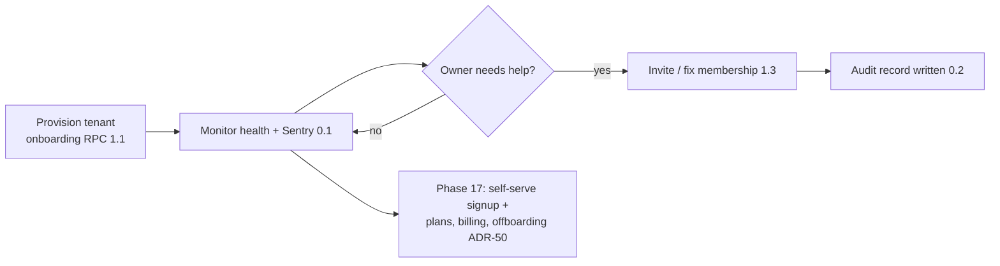
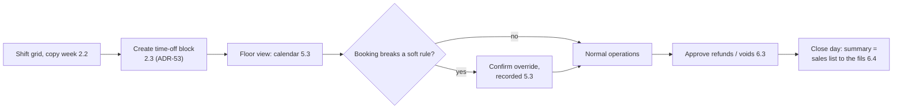
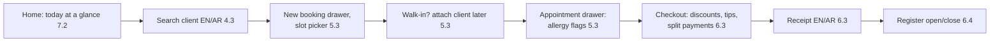
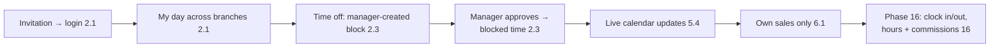
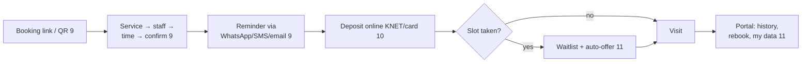

## User journeys

Roles per requirements §3: platform admin (ops path), tenant owner, branch manager, receptionist, staff member, and the end client (from Phase 9). Screens are named per the IMPLEMENTATION_PLAN frontend backlogs; each step carries its phase.subphase.

#### Platform admin

1. Provision SpaCorner (and later tenants) via the ops runbook + `onboarding/provision-tenant` — tenant, owner user, default branch, currency, plan row, seeded defaults (1.1; ADR-20 rule 3).
2. Watch health: uptime monitor + Sentry (0.1); audit log available per tenant on request (0.2 machinery, 7.2 viewer).
3. Support an owner request: grant/repair a membership through `onboarding/invite-user` (1.3); every grant is audit-logged and role-grant rules enforced (ADR-20 rule 9).
4. Phase 17: tenant self-serve signup replaces manual provisioning; admin manages plans/entitlements (`plan_features`), subscription billing, and tenant offboarding (export → 28-day soft-archive → anonymize → financial retention, ADR-50) — 17; platform admin console (B11) — 17.

#### Tenant owner

1. Log in → setup checklist (1.2; US-ON-1); create branches with hours, closures, receipt text, invoice prefix (1.2).
2. Invite the manager and receptionists with branch-scoped roles (1.3; US-T-4).
3. Build the catalogue with per-branch prices (3.3), import clients via CSV dry-run (4.3; US-CL-7).
4. Watch operations tenant-wide: home "today at a glance" (7.2), reports with branch filter (7.2), audit log viewer (7.2; US-SEC-2).
5. Change money rules: refunds are theirs alone with managers (6.3; ADR-10), currency locked after first sale (1.2/6.1; US-ON-2).
6. Leave with their data: full-tenant CSV export (7.3; ADR-43), and Phase 17 offboarding contract if they ever cancel (ADR-50).

```mermaid
flowchart LR
    A["Setup checklist 1.2"] --> B["Branches, hours,<br/>receipts, invoice prefix 1.2"]
    B --> C["Invite team with<br/>branch-scoped roles 1.3"]
    C --> D["Catalogue + branch<br/>price overrides 3.3"]
    D --> E["CSV client import<br/>dry-run + sign-off 4.3"]
    E --> F["Run the business:<br/>home, reports, audit 7.2"]
    F --> G["Own the money rules:<br/>refunds, currency lock 6.3"]
    G --> H["Export everything 7.3"]
```

#### Branch manager

1. Open the branch (switcher locks to own branches, 0.4/1.3) → shift grid for the week, copy previous week (2.2).
2. Create time-off blocks on behalf of staff (MVP has no in-app request flow, ADR-53): the block becomes all-branches blocked time (2.3).
3. Run the floor: see the calendar, confirm over-shift bookings with recorded overrides (5.3; US-CAL-9).
4. Approve exception money: refunds and voids are manager-gated (6.3; ADR-10); out-of-session cash refund flagged (F-walk-2).
5. Close the day: daily sales summary equals the sales list to the fils (6.4; US-SAL-3); register difference reviewed.
6. Own-branch reports only — tenant settings and other branches are invisible (7.2 scope tests; ADR-11).

#### Receptionist

1. Log in → home "today at a glance" (7.2, default route).
2. Client calls: search (Arabic or English, partial phone, 4.3) → duplicate warning honored → new-booking drawer with slot picker (5.3; US-CAL-1).
3. Walk-in arrives: book as walk-in, attach the client later (5.3; US-CAL-11).
4. Client at the chair: appointment drawer shows allergy flags (5.3) → checkout: discounts, tips, split manual payments (6.3) → receipt prints in the client's language (6.3).
5. Cash cycle: open register at start, close counted at end (6.4; ADR-6). Refunds are not theirs — the button is absent (ADR-10).
6. End of day: today's numbers already reconciled on the daily summary (6.4).

#### Staff member

1. Receive invitation → log in → "my day" view: own assignments across branches, branch-labelled (2.1; ADR-12).
2. Ask the manager for time off (in person or by phone); the manager creates the block and it appears on every branch calendar (2.3, ADR-53 — an in-app request flow is a post-MVP candidate).
3. See the day update live as reception books (realtime, 5.4; ADR-38) — no stale printouts.
4. After checkout, see own sales only via `report_own_sales` (6.1; F-DB-5) — colleagues' and totals are invisible.
5. Phase 16: clock in/out on mobile, view worked hours vs shifts and commissions (16).

#### End client (from Phase 9)

1. Opens the branch booking link/QR (9) → picks service → staff ("any" resolves round-robin, 3.3/9) → time (live slot engine, 5.2 reused) → confirms. No account (9).
2. Receives a WhatsApp/SMS/email reminder before the visit (9; ADR-33) — no-show protection begins here.
3. Pays a deposit online at booking (10; KNET/card via MyFatoorah, ADR-34).
4. If the slot is taken: joins the waitlist, gets an automatic offer when a slot frees (11).
5. Rebooks and manages their data in the client portal (11; NFR-11 privacy right).

---

