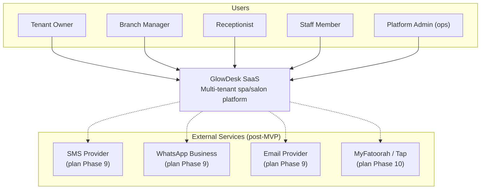
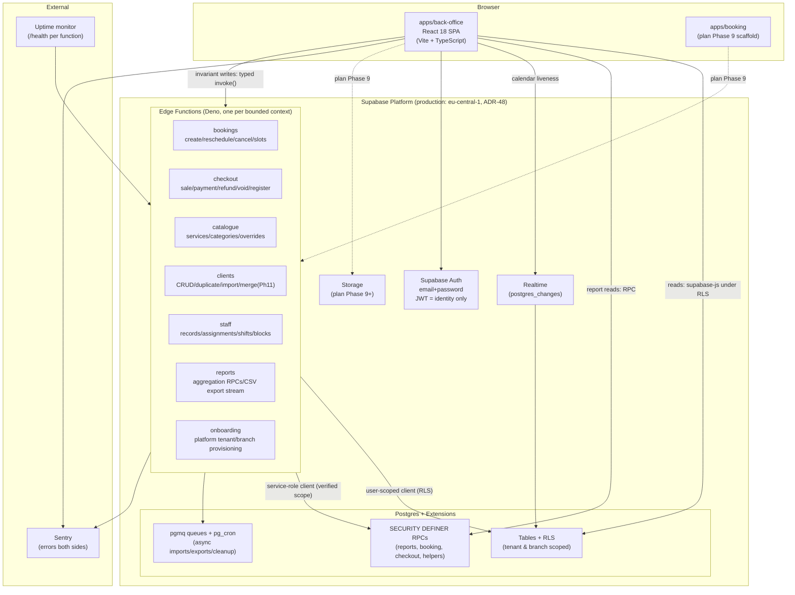
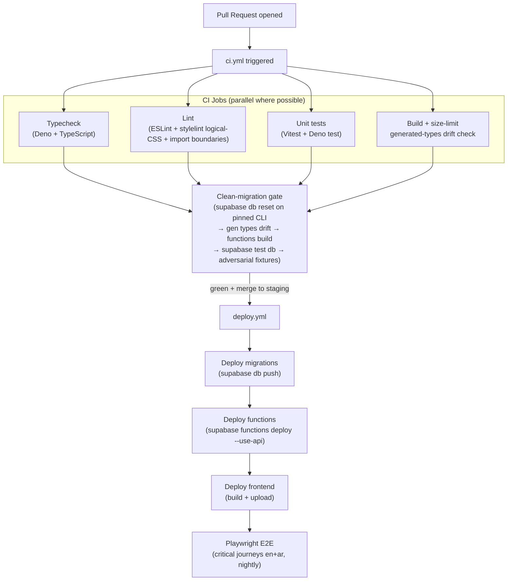

## Architecture

This section covers the system context, the containers, deployment and environments, the CI/CD pipeline, and Edge Function isolation.

#### C4 Level 1: System context

Who uses GlowDesk and what external systems does it connect to.

Context explanation: The system has four in-app roles (`tenant_owner`, `branch_manager`, `receptionist`, `staff`) plus a platform operations path (`platform_admin` via audited impersonation — never a membership role, per ADR-20 rule 9). All notification and payment integrations are post-MVP (plan Phases 9-10); the MVP is back-office only with manual/cash payments (ADR-1, ADR-34). External services are connected through Edge Functions behind provider abstractions so no provider-specific code leaks into the domain model (ADR-34).

#### C4 Level 2: Container diagram

The runtime containers and their communication paths.

Container explanation: Three rules define the system (per CONVENTIONS §1): (1) The database is the security boundary — RLS enforces tenant and branch isolation, never application code (ADR-20). (2) The JWT carries identity only — `auth.uid()` is the only trusted input; tenant, role, and branch scope are looked up live from `memberships` on every request (ADR-19). (3) Edge Functions are isolated per bounded context — a failing or redeploying function never takes down another domain (ADR-27, NFR-2). The MVP has seven functions (`bookings`, `checkout`, `catalogue`, `clients`, `staff`, `reports`, `onboarding`); Storage and `apps/booking` are plan Phase 9 (ADR-43). The `_shared/` directory holds shared modules imported by relative path (ADR-32). Async work uses `pg_cron` + `pgmq` with idempotent consumers (ADR-33).

---

### Deployment and environments

#### Environment topology

```mermaid
flowchart LR
  subgraph local["Local Development"]
    LCLI["Supabase CLI\n(supabase start)"]
    LSERVE["supabase functions serve"]
    LVITE["Vite dev server"]
  end

  subgraph staging["Staging\n(Supabase preview branch)"]
    SDB["Preview-branch Postgres"]
    SEF["Edge Functions"]
    SFE["Frontend deploy"]
  end

  subgraph prod["Production\n(paid plan, ADR-48 region)"]
    PDB["Postgres + PITR\n(daily backups, ADR-49)"]
    PEF["Edge Functions"]
    PFE["Frontend deploy"]
  end

  DEV["Feature branch\n(ephemeral preview DB)"] -->|"PR merge"| staging
  staging -->|"merge to main"| prod

  local -.->|"supabase db push"| DEV
```

Environment explanation: Local development uses the Supabase CLI stack (`supabase start`, `supabase functions serve`, Vite). Feature branches get ephemeral preview-branch databases for migration testing. CI deploys migrations, functions, and the frontend to staging on merges to `staging`, and to production only from `main` (CONVENTIONS §8). Production runs on a paid-plan Supabase project with managed daily backups and PITR (ADR-49). The region defaults to `eu-central-1` as an assumption, with a legal verification gate before Phase 8 go-live (ADR-48).

#### CI/CD pipeline

Pipeline explanation: CI gates every PR on typecheck, lint, unit tests, and build. The clean-migration gate (`F-verifier-2`) applies the full active migration set to an empty database on the pinned CLI version, regenerates types (drift fails CI), typechecks/builds every function, runs `supabase test db` (pgTAP), and executes the adversarial fixture suite (cross-tenant, cross-branch, money, and booking negatives). The gate fails if anything under `sql/drafts-v1/` is referenced by the active migration path. Frontend and backend deploy from the same commit (monorepo rule, ADR-30). E2E tests run nightly and pre-release.

#### Edge Function isolation

Each Edge Function is an independent Deno deployable. A failing or redeploying function never takes down another domain because:

- Each function is a separate Supabase Edge Function slug with its own deployment lifecycle (`supabase functions deploy --slug <name>`).
- Internal routing within a function (`/<function>/<action>`, ADR-30) means most code changes touch one function.
- Shared code lives in `_shared/` — a change to `_shared` redeploys all functions in the same CI run (documented blast radius, ADR-32).
- Per-function cold starts (~50-200ms) amortize across actions in the same function; Supabase limits apply per-request (256MB memory, wall-clock CPU caps per ADR-27).
- Each function exposes `/health` for external uptime monitoring.

---

