## Domain model

#### Tenancy and branches

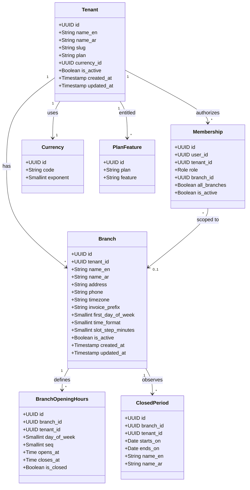

Tenancy ER diagram:

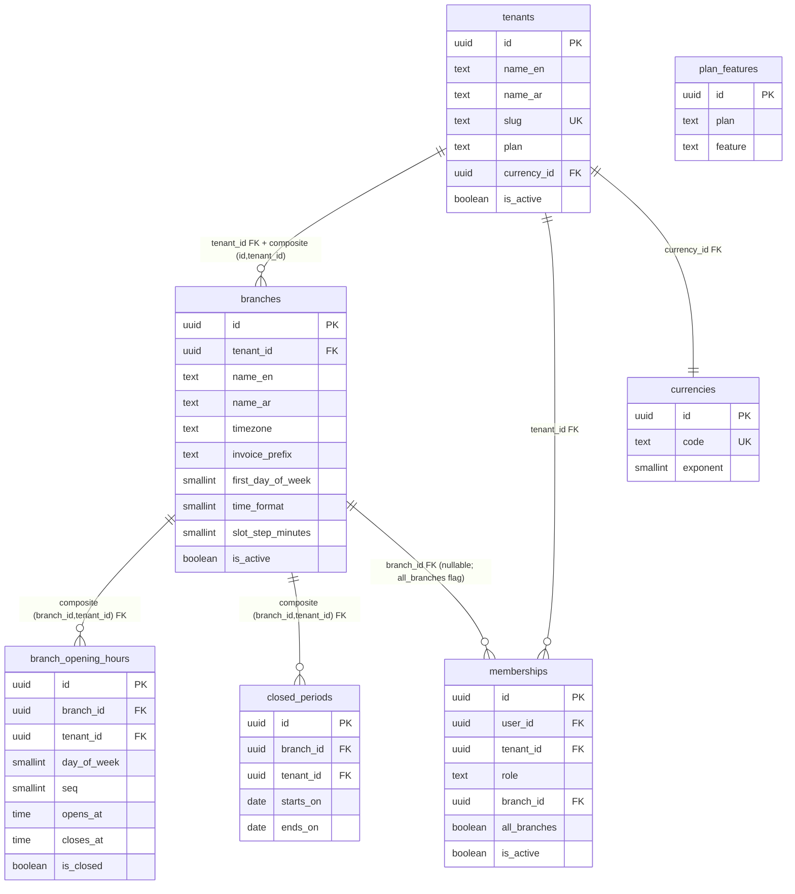

Tenancy explanation: The tenant is the root entity; every other table belongs to a tenant via `tenant_id` and composite foreign keys (ADR-20 rule 5). Branch-scoped roles use `memberships.branch_id` or the `all_branches` flag (nullable `branch_id` + boolean, ADR-20 rule 6 — the sentinel UUID is withdrawn). `platform_admin` is not a membership role; platform ops use audited impersonation (ADR-20 rule 9). Branch calendar preferences (`first_day_of_week`, `time_format`, `slot_step_minutes`) live on `branches` as typed columns, not `settings` keys (ADR-52). Opening hours support overnight (`closes_at < opens_at`) and split intervals via `seq`; `opens_at = closes_at` is rejected by the `boh_nonzero_length` check unless the row is `is_closed` — a zero-length interval is meaningless, a closed day is `is_closed = true`, and a 24-hour day is expressed as 00:00-23:59 (ADR-26, revised in the final round per F-final-db-5).

#### Staff and shifts

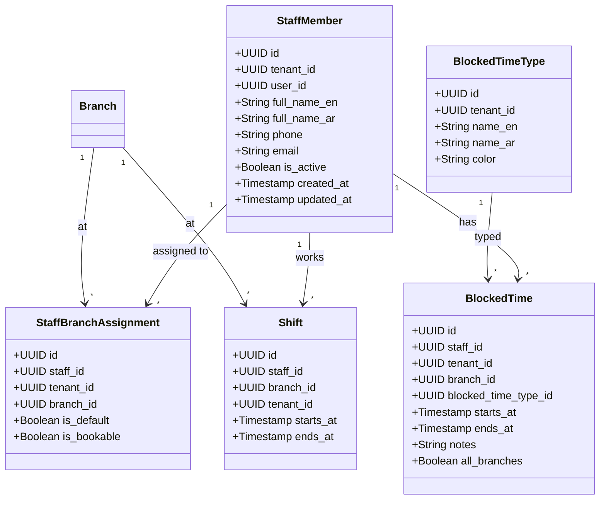

Staff ER diagram:

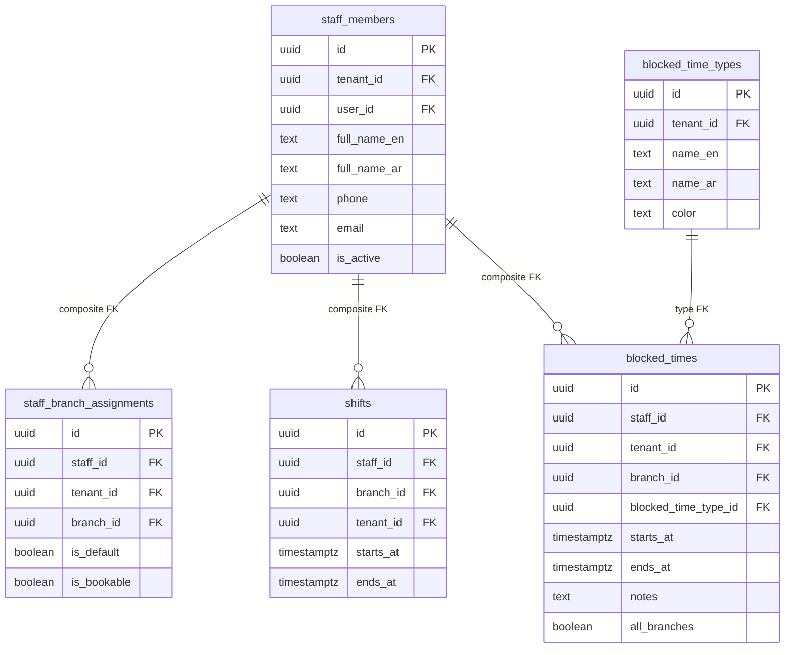

Staff explanation: One `staff_members` row per person per tenant; login is optional (`user_id` nullable, ADR-12). A partial unique index `(tenant_id, user_id) WHERE user_id IS NOT NULL` enforces one identity per tenant (ADR-12, F-DB-9). Staff are assigned to branches via `staff_branch_assignments` with a default-branch and bookable flag. The conflict engine checks busy time across all branches a staff member is assigned to (ADR-12, ADR-24). `blocked_times` is not a direct-write table — every write goes through the locked `staff`/blocked-time RPC (advisory lock + cross-entity appointment check, ADR-26, F-DB-6). Time off spanning branches uses `all_branches = true` with `branch_id IS NULL` (ADR-20 rule 6, ADR-26). `shifts` are dated rows (`timestamptz` ranges), not weekly templates; the shift grid materializes a week of rows and supports copy-previous-week.

#### Service catalogue

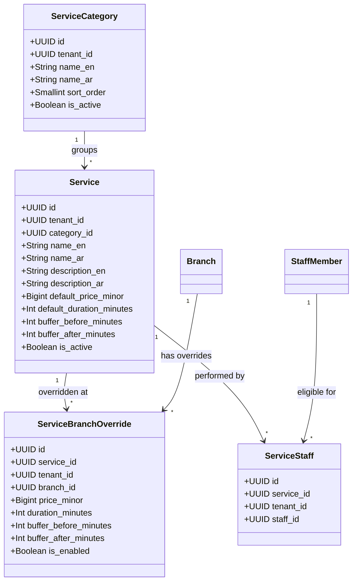

Catalogue explanation: Services are defined at tenant level with default price (in minor units, ADR-17), duration, and buffers. `service_branch_overrides` provides per-branch deviations (price, duration, enabled) that fall back to tenant defaults when absent (ADR-13). The effective price/duration is resolved by `resolve_service(branch_id, service_id)` and snapshotted onto `appointment_items` and `sale_items` at booking/checkout time for historical accuracy. Buffers are first-class and included in the busy range but not billable (ADR-25). Staff eligibility per service per branch lives in `service_staff`. A cross-branch reschedule must re-resolve price/duration/buffers via the target branch and re-snapshot (ADR-13 round 2, F-walk-1).

#### Clients

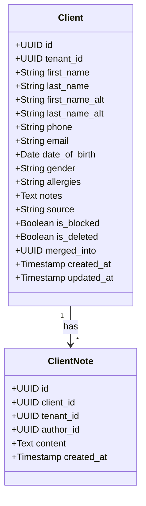

Clients explanation: Clients are tenant-scoped (shared across all branches for safety — a therapist at any branch must see allergies, ADR-11). Client financial aggregates are branch-scoped via secured RPCs, never raw client columns (ADR-11). The staff role reads only basic client fields (name, phone, allergy flags) through a column-restricted secured view limited to clients with appointments at their assigned branches, and has no writes to client master data (ADR-11, F-DB-5/F-perm-2). `is_blocked`, `is_deleted`, and `merged_into` are carved out of direct writes — they route through the `clients` Edge Function with role checks and audit (ADR-28, F-4). Duplicate warning on create (name/phone/email match, tenant-wide) with explicit proceed-and-record choice (ADR-9). `clients.source` defaults to `walk-in` or `imported`; source reporting is deferred non-committed (ADR-52).

#### Appointments and booking

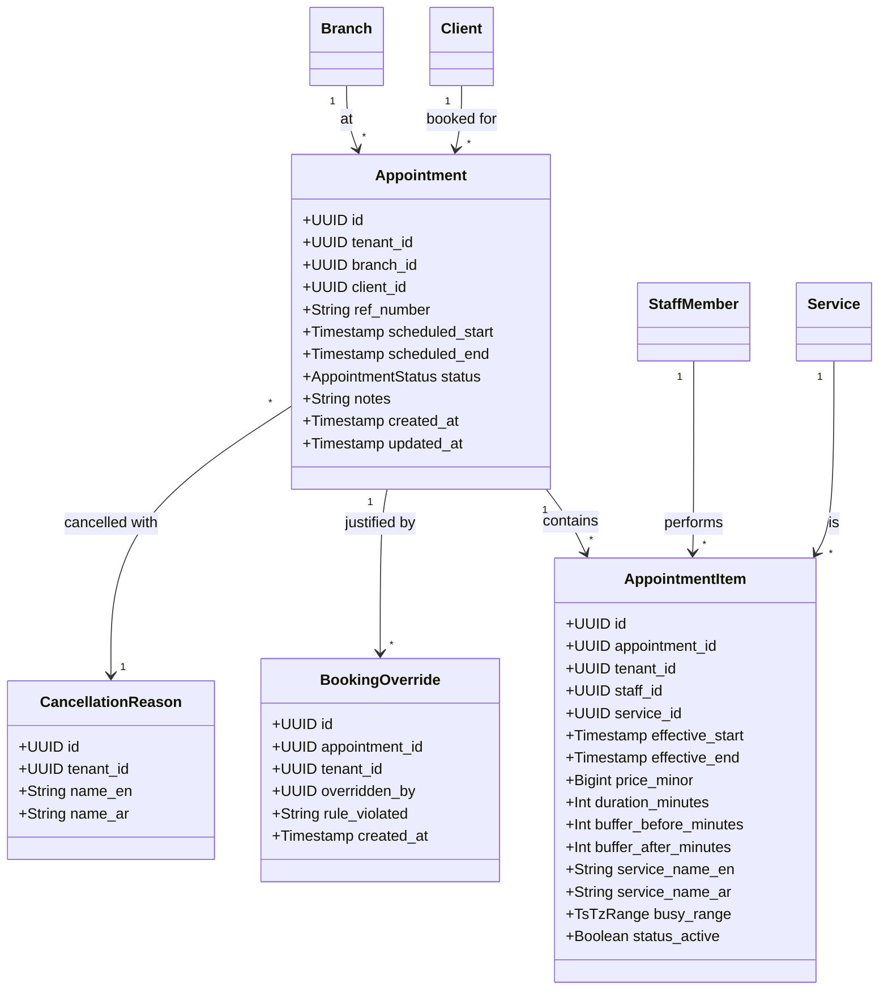

Appointment ER diagram:

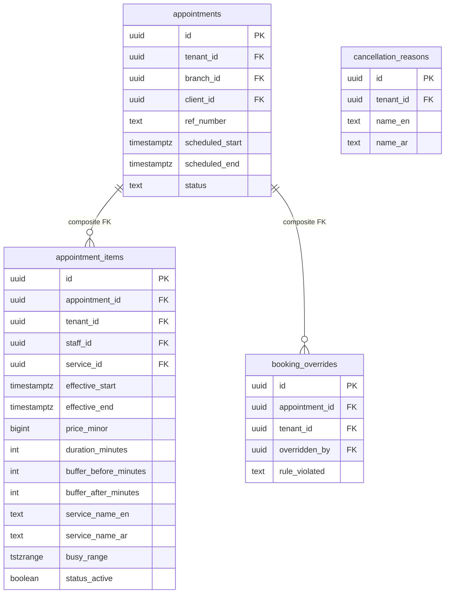

Appointments explanation: An appointment belongs to exactly one branch. `appointment_items` carry their own staff member and time span, enabling multi-service visits (sequential or parallel) inside the appointment envelope (ADR-23). Each item snapshots the resolved price, duration, buffers, and service names at booking time. `busy_range` is a trigger-maintained `tstzrange` column including buffers (BEFORE INSERT/UPDATE triggers in the validated v2 set — PGlite rejects the buffer arithmetic in a generated-column expression; on real Postgres `appointments.during` could return to `GENERATED ALWAYS`, `busy_range` stays trigger-maintained. Final round, F-final-sql-1) (`[effective_start - buffer_before, effective_end + buffer_after)`), protected by an exclusion constraint `EXCLUDE USING gist (staff_id WITH =, busy_range WITH &&) WHERE status_active` (ADR-24). The `status_active` flag is maintained by the appointment state machine — cancelled/no_show items drop out of the constraint. `ref_number` is generated by the booking RPC as `<branch invoice_prefix>-A<seq>` with `UNIQUE (branch_id, ref_number)` (ADR-14, F-DB-7). All appointment/booking_item writes go through the `bookings` Edge Function — never direct supabase-js (ADR-28).

#### Sales, payments and register

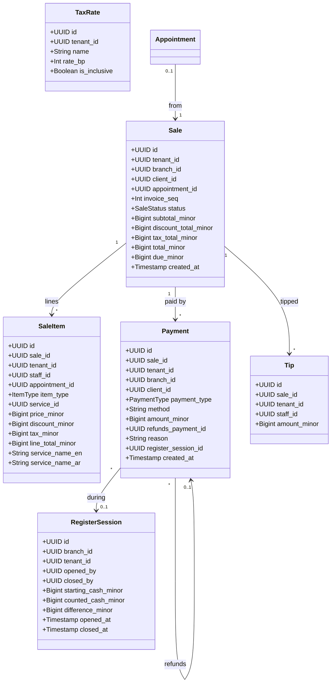

Sales ER diagram:

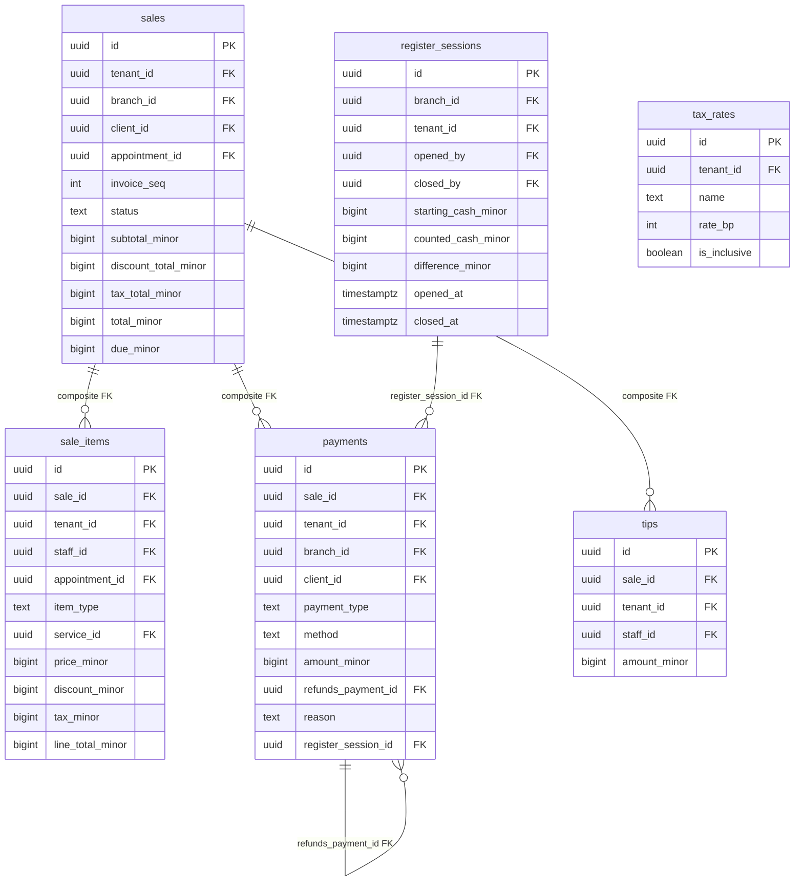

Sales explanation: Every sale belongs to exactly one branch and records its per-branch `invoice_seq` (ADR-14). Totals are derived from line items by the checkout RPC per the deterministic calculation order bound in ADR-51 (line base → line discounts → invoice-level pro-rata allocation → tax → tips → sale total). `due_minor` is derived from lines and payments (`total - sum(payments)`) and never hand-edited; whether it is stored generated or computed at read time is decided by the active migration set (final round, F-final-arch-1). All sale-related writes go through the `checkout` Edge Function — never direct supabase-js (ADR-28). Payments use a single `payments` table with `payment_type ∈ {payment, refund}`; refunds are positive `amount_minor` rows referencing `refunds_payment_id` (ADR-34 — no separate refunds table, no negative amounts). A trigger enforces `sum(refund amounts) ≤ original payment amount`. Refunds and voids are owner/manager-only (ADR-10 round 2, F-perm-1). Register sessions link cash payments and support daily reconciliation (ADR-6). Money is `bigint` minor units (fils for KWD, ADR-17) everywhere.

#### Settings and audit

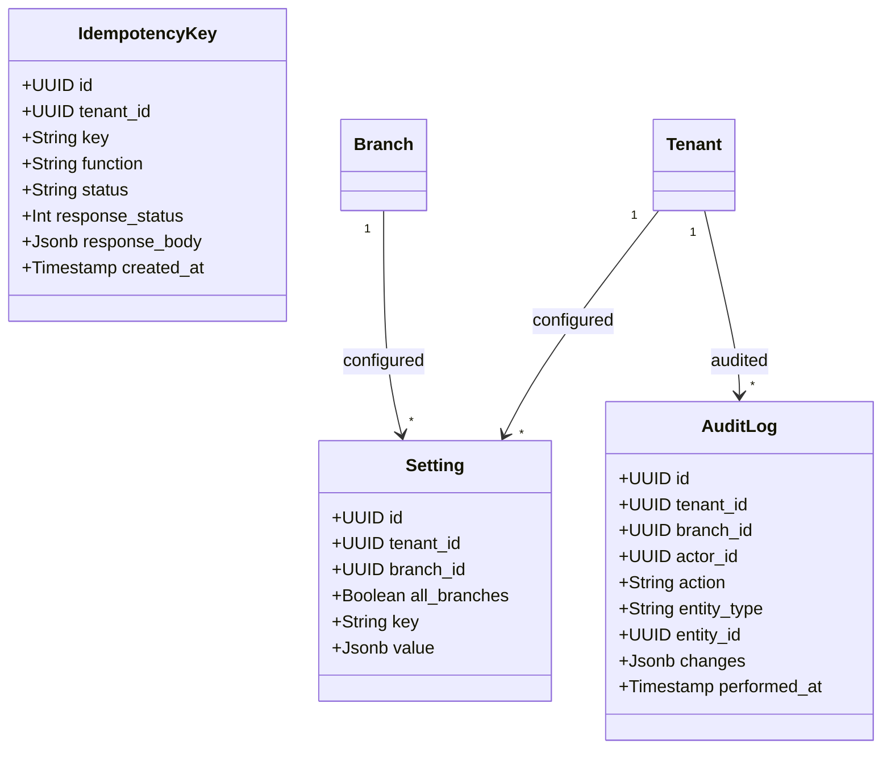

Settings explanation: Settings use the same `all_branches` representation: `branch_id NULL` + `all_branches boolean` for tenant-wide rows, with a partial unique index `WHERE branch_id IS NULL` (ADR-20 rule 6). Audit rows are written only by `SECURITY DEFINER` triggers on audited tables and by Edge Function code paths; direct DML is revoked from `anon` and `authenticated` (ADR-22). `idempotency_keys` are unique on `(tenant_id, key)`; money mutations require an `Idempotency-Key` header; replay returns the cached response; 30-day expiry via `pg_cron` (ADR-31).

#### Full entity-relationship overview

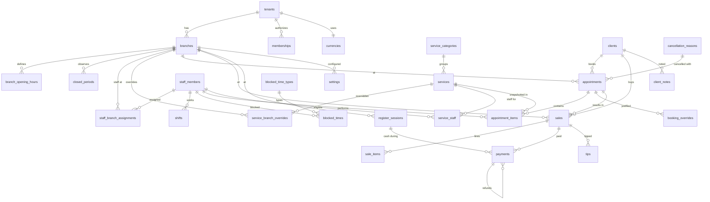

Full ER explanation: Every tenant-owned table carries `tenant_id`, and every foreign key to another tenant-owned table is composite on `(parent_id, tenant_id)` to enforce tenant consistency at the database level (ADR-20 rule 5). Branch-scoped tables add `branch_id`. The `all_branches` representation (`branch_id NULL` + `all_branches boolean` + `CHECK (all_branches = (branch_id IS NULL))`) applies to `memberships`, `settings`, and `blocked_times` (ADR-20 rule 6). Soft deletes: `clients.is_deleted` + `merged_into`; `is_active` on services/staff/branches; status-based retention on appointments/sales; immutable financial rows (ADR-46). All timestamps are `timestamptz` (UTC storage); each branch has an IANA timezone for rendering and day-boundary grouping (ADR-45).

---

### The validated SQL v2 migration set

The schema in the diagrams above is proven by a validation migration set under `sql/v2/` (12 migrations plus 3 test files). It is not yet the active `supabase/migrations/` set — writing that from the ADRs is Phase 0/1 work behind the clean-migration CI gate, and the diagrams must be re-checked against it afterwards (F-final-arch-1). What the validation set contains:

| Migration | Contents |
|---|---|
| `000001_enable_extensions.sql` | `btree_gist`, `pgcrypto`, `citext`, `uuid-ossp`; hosted-form `pg_cron`, `pgmq`, and `pg_net` (added in the final round, F-final-db-1) inside the checker skip block; base grants and schemas |
| `000002_create_tenants.sql` | `tenants`, `currencies`, `plan_features`, `profiles`, and the `handle_new_user` auth trigger (skip-blocked for PGlite, F-final-sql-5) |
| `000003_create_branches.sql` | `branches` (bilingual names, `invoice_prefix`, IANA timezone, calendar preferences per ADR-52), `branch_opening_hours` (seq, overnight, `is_closed`, plus the final-round `boh_nonzero_length` check), `closed_periods` |
| `000004_create_memberships.sql` | `memberships` with the four-role enum, nullable `branch_id` + `all_branches` flag (ADR-20 rules 4/6) |
| `000005_create_staff.sql` | `staff_members` (nullable `user_id`, partial unique per ADR-12), `staff_branch_assignments`, `shifts`, `blocked_time_types`, `blocked_times` (exclusion-constrained range) |
| `000006_create_services.sql` | `service_categories`, `services`, `service_branch_overrides`, `service_staff`, and the `resolve_service` RPC (returns `record` in v2; convert to `RETURNS TABLE` before production, F-final-sql-4) |
| `000007_create_clients.sql` | `clients` (tenant-scoped, soft delete, `merged_into`, `source`, normalized `search_text`), `client_notes` |
| `000008_create_appointments.sql` | `cancellation_reasons`, `appointments`, `appointment_items` (snapshots, trigger-maintained `busy_range`, `status_active`), `booking_overrides`, the partial exclusion constraint (F-final-sql-2/3) |
| `000009_create_sales.sql` | `invoice_counters` (`kind`-discriminated, `UNIQUE (branch_id, kind)`), `tax_rates`, `register_sessions` (one-open-per-branch partial unique index `idx_rs_one_open`), `sales`, `sale_items`, `tips`, `payments` (refund-cap trigger), `idempotency_keys` (`UNIQUE (tenant_id, key, function_name)` since the final round, F-final-db-3) |
| `000010_create_settings.sql` | `settings` (role-gated), `audit_log` (append-only, ADR-22) |
| `000011_create_views.sql` | `security_invoker` report views with explicit grants (ADR-21) |
| `000012_enable_rls.sql` | RLS on every table plus policies, helper functions, and role grants |

Tests: `001_tenant_isolation.sql` (cross-tenant reads/FK attacks/role checks), `002_branch_isolation.sql` (branch scope, payment restrictions, money and sequence races), `003_final_round_fixes.sql` (zero-length opening-hours rejection, overnight acceptance, per-function idempotency scope).

Checker result (`check-sql.mjs`, PGlite): 12 migrations apply cleanly; 33 public tables, 33 with RLS enabled; all three test files pass. One warning is intentional: `public.idempotency_keys` has RLS with no policies (deny-all) because it is a client-inaccessible mutation table with a select-only grant — the replay protocol runs inside Edge Functions under the service role.

Remaining production-validation gates carried from the final round: the partial exclusion constraint syntax and the `handle_new_user` trigger must be re-validated on real Supabase Postgres with the pinned CLI (F-final-sql-2/5); `resolve_service` converts to `RETURNS TABLE` (F-final-sql-4); trigger-maintained ranges need bypass/update coverage tests (F-final-sql-1); cancellation and no-show must flip `status_active` inside the booking RPC contract, with concurrent cancellation/reschedule tests in Phase 5 (F-final-sql-3).

