## Key flows

Sequence and state diagrams for the journeys that carry the product's invariants: sign-in and scope selection, booking with the double-booking guard, cross-branch reschedule, checkout, refund, cash-up, onboarding, and the Edge Function call anatomy; then the appointment, sale, payment, shift, and tenant state machines.

#### Sign-in and tenant/branch selection

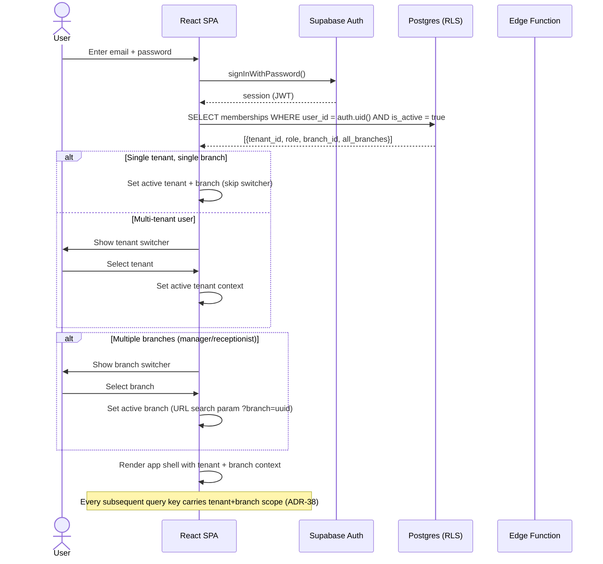

Sign-in explanation: `auth.uid()` from the JWT is the only trusted identity input (ADR-19). Authorization (tenant membership, role, branch scope) is derived on every request from the `memberships` table via `STABLE SECURITY DEFINER` helpers (`current_tenant_ids()`, `current_branch_scope()`, `has_tenant_role()`). The JWT carries no tenant or role claims. Memberships are filtered `is_active = true` — revoking a membership takes effect immediately without waiting for token expiry (ADR-19). A user may hold memberships in multiple tenants and different roles at different branches; the active tenant is application context persisted per user (ADR-37, F-fe-1). Branch context lives in the URL as a search param (`?branch=<uuid>|all`); RLS remains the real security boundary either way (ADR-37).

#### Creating a booking (double-booking guard)

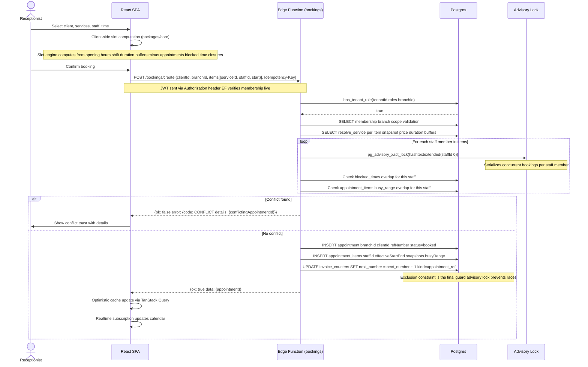

Booking explanation: The double-booking prevention uses three layers (ADR-24): (1) A database exclusion constraint `EXCLUDE USING gist (staff_id WITH =, busy_range WITH &&) WHERE status_active` on `appointment_items` is the final guard. (2) The booking RPC takes `pg_advisory_xact_lock` per staff member, serializing concurrent bookings and making the check-then-insert race impossible. (3) An RPC pre-check computes conflicts first for good error messages. Cross-entity conflicts (appointment vs blocked time) are checked inside the same locked transaction (ADR-26). The conflict engine checks busy time across all branches the staff member is assigned to (ADR-12). Buffers are included in `busy_range` (ADR-25). All appointment writes go through the `bookings` Edge Function — never direct supabase-js (ADR-28). The `Idempotency-Key` header prevents double-booking on retry (ADR-31).

#### Rescheduling across branches (price re-resolution)

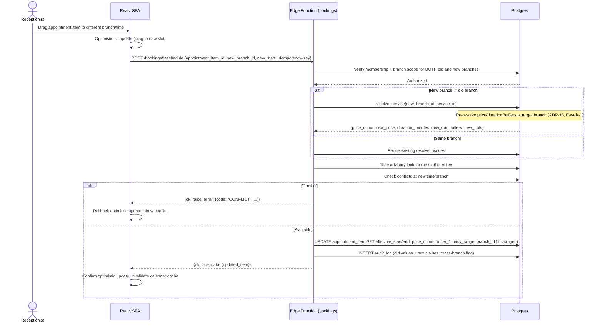

Reschedule explanation: A cross-branch reschedule must re-resolve price, duration, and buffers via `resolve_service(target_branch_id, service_id)` — reusing the old branch's snapshot is a billing error (ADR-13, F-walk-1). The audit record carries both old and new resolved values. Direct updates of `scheduled_start/end` or item spans are prohibited — reschedule goes through the same locked RPC path as creation, closing the "reschedule bypasses the trigger" hole (ADR-24).

#### Check-in and checkout with cash payment

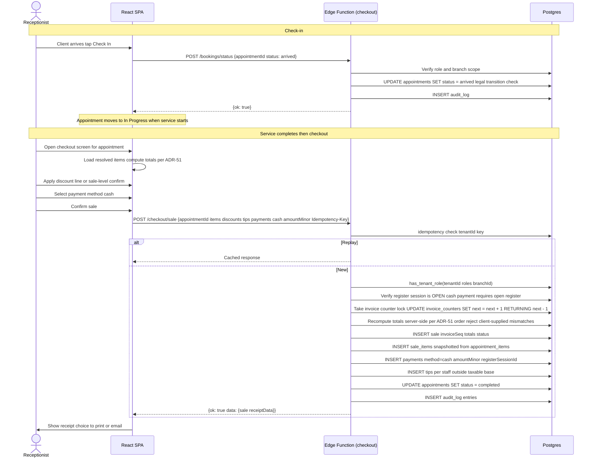

Checkout explanation: The checkout RPC implements the deterministic calculation order from ADR-51: line base → line discounts (fixed then percent) → invoice-level pro-rata allocation → tax extraction → tips (separate) → sale total. Client-supplied totals that differ from the server recomputation are rejected (tampered-total negative test). Cash payments require an open register session (ADR-6). The invoice number is assigned inside the sale transaction via row-locked `UPDATE ... RETURNING` on `invoice_counters` (ADR-14). All money mutations carry an `Idempotency-Key` (ADR-31). All checkout writes go through the `checkout` Edge Function — never direct supabase-js (ADR-28). Receptionists keep checkout, discounts, and tips; refunds and voids are owner/manager-only (ADR-10 round 2, F-perm-1).

#### Refund by a manager

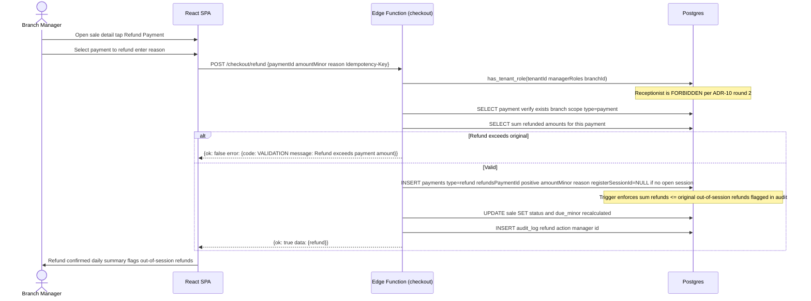

Refund explanation: Refunds are a `payments` row with `payment_type = 'refund'` and a **positive** `amount_minor` referencing `refunds_payment_id` (ADR-34 round 2, F-PLAN-2). No separate refunds table exists; no negative ledger amounts exist. A trigger enforces `sum(refund amounts) ≤ original payment amount`. Refunds are owner/branch-manager only — receptionists are forbidden (ADR-10 round 2, F-perm-1). Cash refunds executed when the branch has no open register session are allowed (manager-approved) and recorded with `register_session_id IS NULL`, flagged in the daily summary and audit (ADR-6, F-walk-2). The original payment record is never mutated.

#### End-of-day cash-up

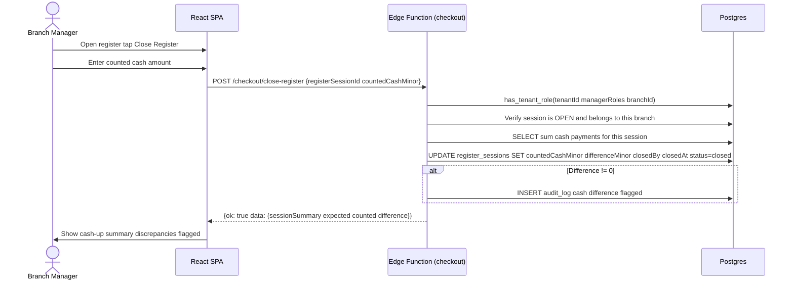

Cash-up explanation: One register session per branch at a time (ADR-6). Daily reconciliation: expected = `starting_cash_minor + sum(cash payments during session) − sum(cash refunds)`. Difference = `counted − expected`. Out-of-session cash refunds (with `register_session_id IS NULL`) are flagged in the daily summary and audit (ADR-6, F-walk-2). Register sessions and their close go through the `checkout` Edge Function.

#### Tenant onboarding

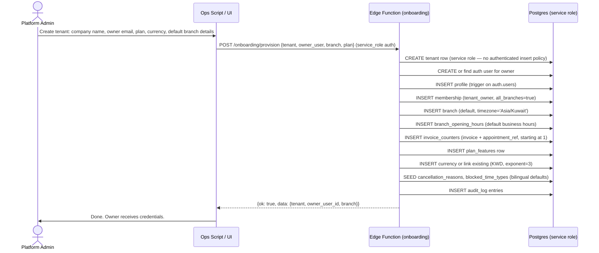

Onboarding explanation: Tenant creation is platform-admin-only through the `onboarding` Edge Function under the service role (ADR-20 rule 3). No `authenticated` insert policy exists on `tenants` (open question 7 ruled). Provisioning is idempotent (re-run safe, ADR-31 pattern). The owner gets `tenant_owner` role with `all_branches = true`. Default seeded data includes bilingual cancellation reasons and blocked time types (ADR-16). Branch defaults use `Asia/Kuwait` timezone, Saturday as first day of week for Arabic-first tenants (ADR-52).

#### Edge Function call: JWT verification, tenant checks, idempotency, error format

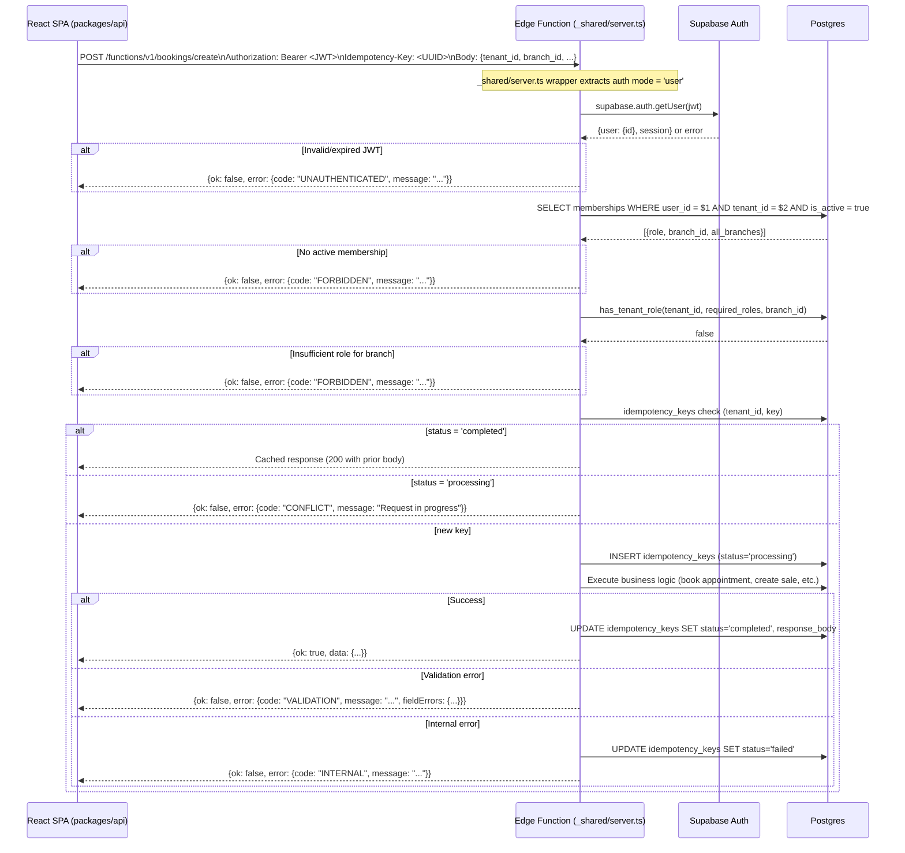

Edge Function explanation: Every function uses the shared `_shared/server.ts` wrapper (ADR-35), which handles JWT verification via `supabase.auth.getUser()`, assembles context (tenant, branch, role from live membership lookup), and emits the versioned envelope `{ok, data}` / `{ok, error: {code, message, fieldErrors?, details?}}` (ADR-29). Authorization is never derived from JWT claims (ADR-19). The `Idempotency-Key` header is required on money mutations; the `idempotency_keys` table caches responses and detects `processing` collisions (ADR-31). The error code catalogue is defined once in `packages/validation` (TS) and mirrored in `_shared/errors.ts` (Deno): `VALIDATION(400)`, `UNAUTHENTICATED(401)`, `FORBIDDEN(403)`, `NOT_FOUND(404)`, `CONFLICT(409)`, `IDEMPOTENCY_MISMATCH(422)`, `RATE_LIMITED(429)`, `INTERNAL(500)`, `UNAVAILABLE(503)` (ADR-29).

---

### State diagrams

#### Appointment state machine

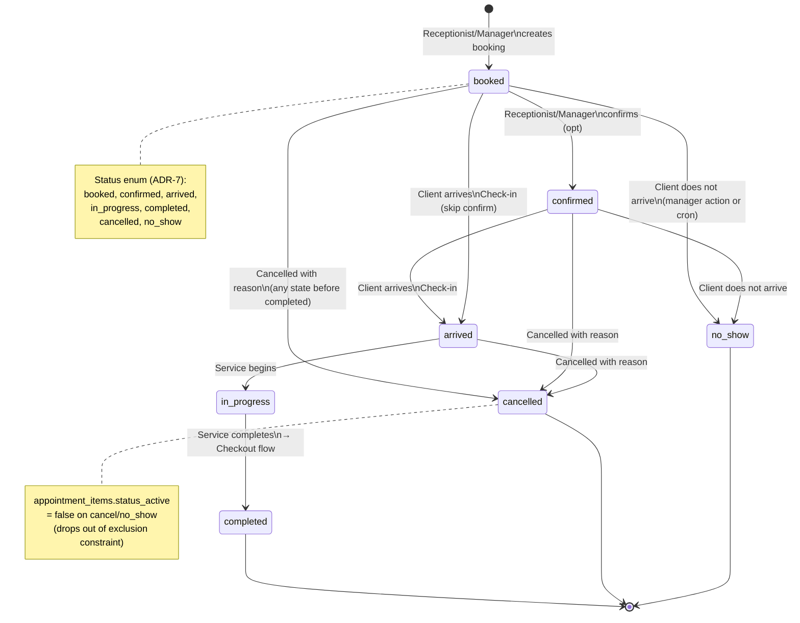

Appointment state explanation: The appointment status enum is fixed: `booked, confirmed, arrived, in_progress, completed, cancelled, no_show` (ADR-7). `in_progress` is the canonical value — `started` is banned. Only legal transitions are allowed; backward moves require manager override and are audit-logged (ADR-7). Custom statuses are deferred non-committed (ADR-7, F-cov-5). When an appointment is cancelled or marked no_show, `appointment_items.status_active` is set to `false`, dropping the item out of the exclusion constraint and freeing the slot (ADR-24). The checkout flow transitions the appointment to `completed` as part of the sale transaction.

#### Sale state machine

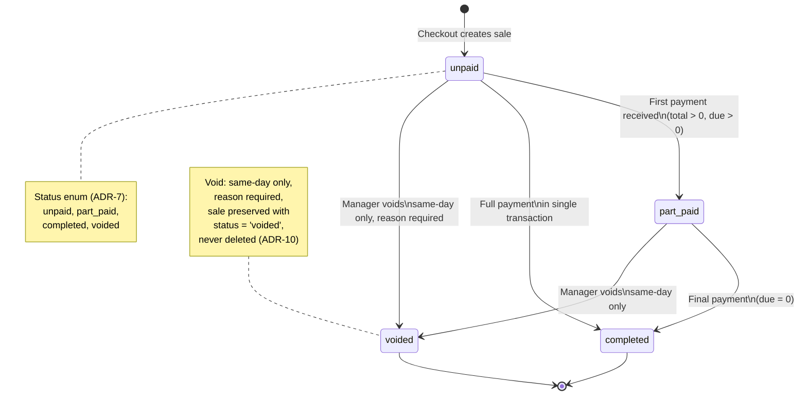

Sale state explanation: The sale status enum is fixed: `unpaid, part_paid, completed, voided` (ADR-7). `completed` means fully paid and closed. Voids are same-day only with a required reason; the sale record is preserved with status `voided` — never deleted (ADR-10, ADR-46). Refunds do not change the sale status — they are separate `payments` rows of type `refund` (ADR-34). The derived `due_minor` value (`total - sum(payments)`, never hand-edited) drives the `unpaid → part_paid → completed` transitions.

#### Payment and refund state

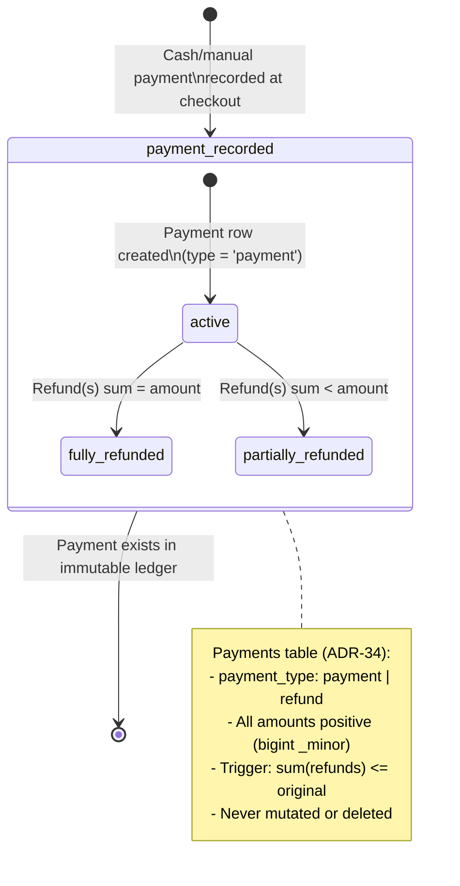

Payment state explanation: There is no separate refunds table — all money movements are `payments` rows (ADR-34). A refund is a `payments` row with `payment_type = 'refund'` and a **positive** `amount_minor` referencing `refunds_payment_id`. All amounts are `CHECK (amount_minor >= 0)` — no signed ledger columns. A trigger enforces `sum(refund amounts) <= original payment amount`. Financial rows are immutable (ADR-46); corrections are new rows (refunds). Full refunds are in MVP; partial refunds arrive in plan Phase 10 with online payments (ADR-34).

#### Staff shift lifecycle

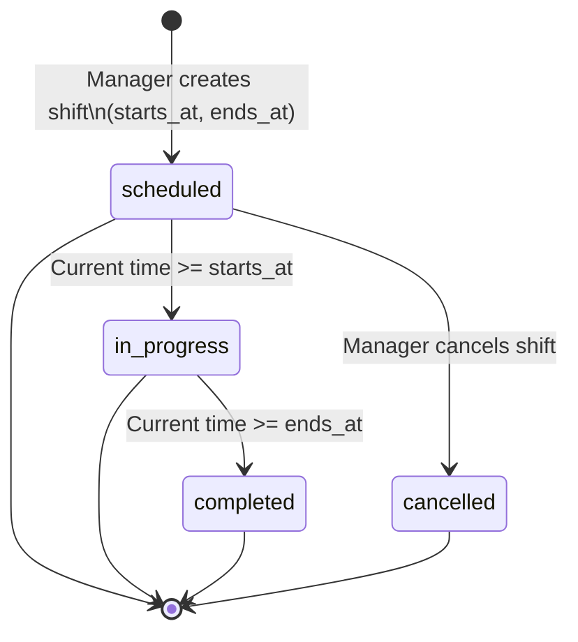

Shift explanation: Shifts are dated rows (`timestamptz` ranges), not weekly templates (ADR-26). The shift grid materializes a week of rows and supports copy-previous-week. Overnight shifts (`ends_at` next day) are natural with `timestamptz`. Shifts are a soft constraint on booking — booking outside a shift produces a warning with manager override recorded in `booking_overrides` (ADR-26).

#### Tenant lifecycle

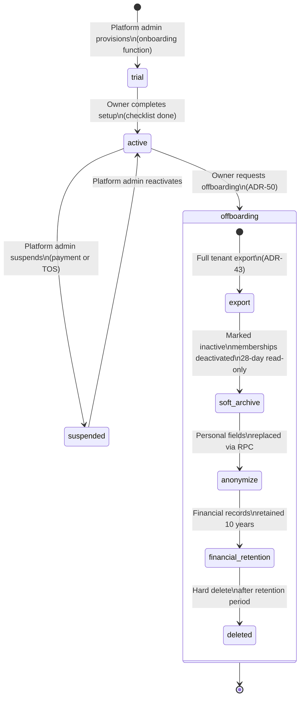

Tenant lifecycle explanation: Tenants begin as `trial` when provisioned by platform operations (the audited impersonation path, ADR-20 rule 9 — not an in-app role) via the `onboarding` Edge Function (ADR-18, ADR-20 rule 3). Setup checklist completion transitions to `active`. The offboarding contract follows ADR-50: export -> 28-day soft archive -> anonymize personal data via the NFR-11 RPC -> retain financials for the Kuwaiti commercial period (default 10 years, legal confirmed at plan Phase 17 scheduling, ADR-50) -> hard delete. The anonymize RPC built in plan Phase 4 is the same machinery used for offboarding. Subscription billing and self-serve signup arrive in plan Phase 17 (ADR-18).

---

