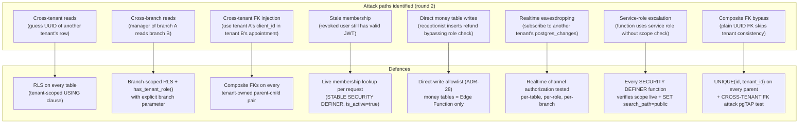
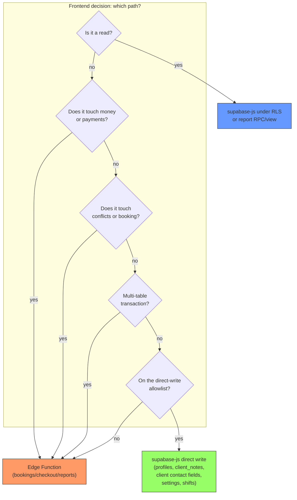

## Security and multi-tenancy

The roles-by-actions-by-enforcement-point matrix, every tenant/branch isolation attack path with its defence, and the data access map (what the frontend may do directly versus what must go through a function or RPC).

### Roles x actions x enforcement point

| Action | tenant_owner | branch_manager | receptionist | staff | Enforcement point |
|---|---|---|---|---|---|
| View own branch schedule | Yes | Yes | Yes | Yes | RLS (branch-scoped SELECT) |
| View all branches schedule | Yes | Yes (assigned) | No | No | RLS (all_branches + branch scope) |
| Create booking | Yes | Yes | Yes | No | `bookings` Edge Function + RLS roles |
| Reschedule/cancel booking | Yes | Yes | Yes | No | `bookings` Edge Function + RLS roles |
| Check-in + checkout | Yes | Yes | Yes | No | `checkout` Edge Function + RLS roles |
| Apply discounts | Yes | Yes | Yes | No | `checkout` Edge Function + RLS roles |
| Add tips | Yes | Yes | Yes | Yes (own) | `checkout` Edge Function + RLS roles |
| Full refund | Yes | Yes | **FORBIDDEN** | **FORBIDDEN** | `checkout` Edge Function (server-side role check, ADR-10) |
| Void sale | Yes | Yes | **FORBIDDEN** | **FORBIDDEN** | `checkout` Edge Function (server-side role check, ADR-10) |
| Close register | Yes | Yes | No | No | `checkout` Edge Function + RLS roles |
| Create/edit client contact | Yes | Yes | Yes | No | `clients` Edge Function (contact fields) |
| Edit client notes/allergies | Yes | Yes | Yes | No | Direct or `clients` Edge Function |
| View client allergies | Yes | Yes | Yes | **view only** (own-branch clients) | Column-restricted view (ADR-11, F-DB-5) |
| Block/merge/delete client | Yes | Yes | No | No | `clients` Edge Function (carved out, F-4) |
| Import clients CSV | Yes | **FORBIDDEN** | **FORBIDDEN** | **FORBIDDEN** | `clients` Edge Function (owner-only, F-perm-3) |
| Edit service catalogue | Yes | Yes | No | No | Direct supabase-js or `catalogue` Edge Function |
| Edit service pricing | Yes | Yes | No | No | `catalogue` Edge Function (snapshot+audit consistency) |
| Edit staff records | Yes | Yes (own branch) | No | No | `staff` Edge Function |
| Manage shifts | Yes | Yes (own branch) | No | No | Direct supabase-js (manager-gated RLS, ADR-28 allowlist) |
| Create blocked time | Yes | Yes (own branch) | Yes (own branch) | request->approval | `staff` Edge Function (locked RPC, F-DB-6) |
| Edit tenant settings | Yes | No | No | No | Direct supabase-js (role-gated RLS) |
| Edit branch settings | Yes | Yes (own branch) | No | No | Direct supabase-js (role-gated RLS) |
| Manage roles/memberships | Yes | Yes (grant receptionist/staff in own branch) | No | No | `onboarding`/`staff` Edge Function (ADR-20 rule 9) |
| View reports (own branch) | Yes | Yes | Yes | No | `security_invoker` views / `report_*` RPCs |
| View reports (all branches) | Yes | No | No | No | `report_*` RPCs (tenant-wide scope) |
| View own sales (staff) | - | - | - | Yes | `report_own_sales` secured RPC (F-DB-5) |
| Export client contacts | Yes | **FORBIDDEN** | **FORBIDDEN** | **FORBIDDEN** | `reports` Edge Function (owner-only, F-verifier-3) |
| Provision new tenant | No | No | No | No | `onboarding` Edge Function (service role, platform ops, ADR-20 rule 3) |

### Tenant isolation attack paths and defences

Security explanation: The database is the security boundary — RLS enforces tenant and branch isolation, never application code (ADR-20). Every attack path identified in round 2 has a specific defence tested in CI. The pgTAP harness covers per-table x per-role x per-operation x cross-tenant x cross-branch x anon, plus: revocation-immediacy (deactivating a membership mid-session must block the next request), cross-tenant FK attack inserts must fail, manager of branch A must fail a role check for branch B, and Realtime channel authorization must not leak another tenant's or branch's payloads. `platform_admin` is not a membership role — platform operations use explicit, time-boxed, audit-logged impersonation visible to the tenant owner (ADR-20 rule 9). Every `SECURITY DEFINER` function declares `SET search_path = public` (ADR-20 rule 10); `supabase db lint` enforces this in CI.

---

### Data access map

For every MVP write path: whether it goes through supabase-js (RLS), an SECURITY DEFINER RPC, or an Edge Function, and why.

### Direct supabase-js writes (ADR-28 allowlist)

| Entity | Operations allowed directly | Roles | Why direct is safe |
|---|---|---|---|
| `profiles` | UPDATE | Self only | RLS `id = auth.uid()` fully expresses authorization |
| `client_notes` | INSERT, UPDATE, DELETE | receptionist, branch_manager, tenant_owner | Single-table; RLS + role CHECK sufficient |
| `clients` (contact/profile fields only) | INSERT, UPDATE | receptionist, branch_manager, tenant_owner | RLS tenant-scoped; `is_blocked`, `is_deleted`, `merged_into` carved out (F-4); staff role has NO client writes (F-perm-2) |
| `settings` | INSERT, UPDATE, DELETE | tenant_owner (tenant-wide), branch_manager (own branch) | Role-gated RLS; single-key mutations |
| `shifts` | INSERT, UPDATE, DELETE | branch_manager (own branch), tenant_owner | Branch-scoped RLS; dated rows, no cross-entity invariants |

### Edge Function / RPC only writes

| Entity | Path | Why Edge Function / RPC is required |
|---|---|---|
| `appointments` + `appointment_items` + `booking_overrides` | `bookings` Edge Function | Conflict engine (exclusion constraint + advisory lock); cross-entity checks (blocked_times); idempotency; ref_number generation; multi-table transaction (ADR-24, ADR-28) |
| `sales` + `sale_items` + `payments` + `tips` | `checkout` Edge Function | Money (ADR-17, ADR-51); invoice number assignment (row-locked counter, ADR-14); tax calculation; register session linking; server-side total recomputation; multi-table transaction; idempotency (ADR-31) |
| `refunds` (payments type=refund) | `checkout` Edge Function | Money; role restriction (owner/manager only, server-side enforced, ADR-10); refund-cap trigger; original payment verification |
| `voids` (sale status=voided) | `checkout` Edge Function | Money; role restriction; same-day validation |
| `register_sessions` | `checkout` Edge Function | Cash reconciliation; one-open-per-branch invariant; multi-table |
| `blocked_times` | `staff` Edge Function (locked RPC) | Cross-entity conflict check (must take advisory lock + check appointments, ADR-24/26, F-DB-6); not a direct-write table |
| `memberships` | `onboarding` / `staff` Edge Function | Role grants (owner-only for owner/manager, ADR-20 rule 9); audit; tenant consistency |
| `tenants` | `onboarding` Edge Function (service role) | No authenticated insert policy (ADR-20 rule 3) |
| `branches` | `onboarding` Edge Function | Multi-table provisioning (branch + hours + counters + seeds) |
| `clients.is_blocked/is_deleted/merged_into` | `clients` Edge Function | Requires role checks + audit; carved out from direct writes (F-4) |
| `service_branch_overrides` (pricing changes) | `catalogue` Edge Function | Snapshot and audit consistency (ADR-13) |
| `invoice_counters` | `checkout` / `bookings` RPC | Row-locked `UPDATE ... RETURNING` must run inside the sale/booking transaction (ADR-14) |
| `audit_log` | Triggers + Edge Function code paths | Direct DML revoked from `anon` and `authenticated` (ADR-22) |

### Reads (all direct supabase-js under RLS, except heavy aggregation)

| Entity | Path | Notes |
|---|---|---|
| Lists, details, calendar reads | supabase-js under RLS | Typed via `packages/db`; RLS enforces tenant + branch scope |
| Report views | `security_invoker` views + `GRANT SELECT` | Invoker's RLS applies (ADR-21, F-6) |
| Heavy aggregation reports | `report_*` SECURITY DEFINER RPCs | Internally applies `current_branch_scope()`; staff uses `report_own_sales` only (F-DB-5) |
| Client financial aggregates | Secured RPCs | Branch-scoped per ADR-11; never raw client columns |
| Realtime subscriptions | `useRealtime(entity, tenantId, branchId)` | Channel authorization tested per table/role/branch (ADR-38) |

### Data access flow diagram

Data access explanation: The decision tree encodes the rules from ADR-28 and CONVENTIONS Section 6. If a write touches money, conflicts, a cross-table transaction, a side effect, or a secret -> Edge Function. If RLS + check constraints fully express the authorization on a single table and nothing else must stay consistent -> direct write is fine (but the table must be on the allowlist). Direct writes still produce audit rows — triggers fire regardless of path (ADR-22). Adding a table to the direct-write allowlist requires a PR showing the RLS policies and constraints that make it safe (ADR-28).

---

### Intentional deny-all tables

`public.idempotency_keys` has RLS enabled with no policies: every direct client path is denied. The replay protocol lives inside Edge Functions under the verified-scope service-role client (ADR-20 rule 7, ADR-31); the `authenticated` role holds a select-only grant for operational debugging. This is deliberate, and the SQL checker reports it as a warning to keep it visible.

