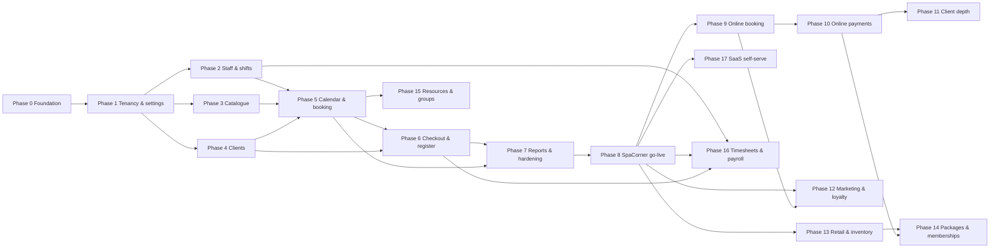
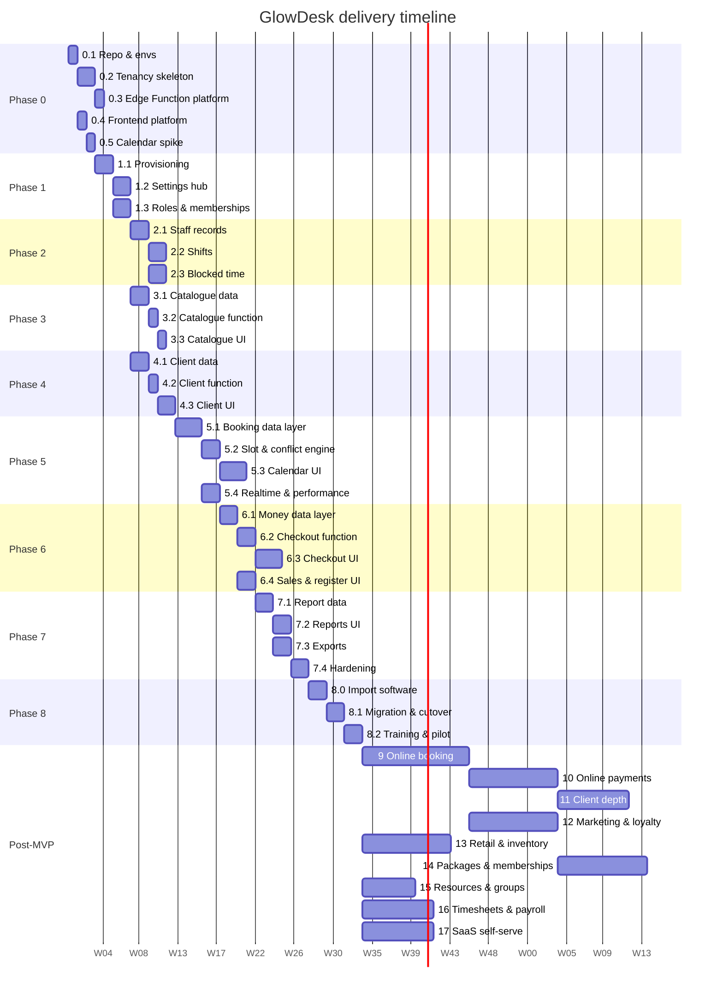

## Delivery plan: phases and subphases

Every phase with its subphases (`<phase>.<n>`): goal, features, database work, Edge Functions, screens, i18n/RTL notes, acceptance criteria, tests, backlog tasks, and dependencies — then the dependency diagrams and the gantt chart. Phases 0-8 are the binding MVP plan (72 engineer-weeks; 22-week critical path plus 20% buffer, about 27 weeks). Phases 9-17 carry expanded detail as scheduling input; their backlogs become binding only when each phase is scheduled (convention F-PLAN-17). The SpaCorner go-live checklist and the program-level risk register are in the next section.

### Phase overview

| Phase | Name | Size | Goal in one line |
|---|---|---|---|
| 0 | Foundation | 6 ew | Repo, environments, CI/CD, auth, tenancy+RLS skeleton, i18n/RTL baseline, design-skill integration, observability |
| 1 | Tenancy, onboarding & settings | 8 ew | Tenant/branch setup, roles, settings hub, audit backbone |
| 2 | Staff & shifts | 7 ew | Staff records, branch assignments, shift grid, blocked time |
| 3 | Service catalogue | 6 ew | Categories, services, branch overrides, staff eligibility |
| 4 | Clients | 7 ew | Client CRUD, notes/allergies/tags, search, duplicate warning, CSV import |
| 5 | Calendar & booking | 14 ew | Slot engine, conflict engine, booking lifecycle, calendar UI, realtime |
| 6 | Checkout, sales & register | 12 ew | POS checkout, discounts/tips, manual payments, refunds/void, register, receipts, invoice numbers |
| 7 | Reports, exports & hardening | 8 ew | Six reports (plus taxes summary), CSV exports, audit viewer, global search, home screen, performance, security test completion |
| 8 | SpaCorner go-live | 4 ew | Data migration, training, pilot, cutover, rollback readiness |
| 9 | Online booking & notifications | 12 ew | Public booking page, links/QR, reminders, WhatsApp |
| 10 | Online payments & deposits | 10 ew | MyFatoorah integration, webhooks, deposits, fees |
| 11 | Client experience depth | 8 ew | Client portal, merge tool, repeating series, waitlist |
| 12 | Marketing & loyalty | 10 ew | Segments, campaigns, deals/promo codes, loyalty points |
| 13 | Retail & inventory | 10 ew | Products, stock, suppliers, stock takes/orders, inter-branch transfers |
| 14 | Packages, gift cards, memberships | 10 ew | Prepaid products and recurring membership billing |
| 15 | Resources & group appointments | 6 ew | Rooms/equipment conflict dimension, group bookings |
| 16 | Timesheets & payroll | 8 ew | Clock in/out, pay runs, commissions |
| 17 | SaaS self-serve & billing | 8 ew | Self-serve tenant signup, subscription billing, multi-currency |

---

### Phase dependency diagram (phase level)

MVP Phases 2, 3, 4 are parallelizable after Phase 1 (different bounded contexts); with a 3-engineer team the gantt below overlaps them.

---

### Subphase dependency diagram (MVP Phases 0–8)

```mermaid
flowchart LR
  subgraph P0["Phase 0"]
    E0_1["0.1 Repo & envs"] --> E0_2["0.2 Tenancy & security skeleton"]
    E0_1 --> E0_4["0.4 Frontend platform"]
    E0_2 --> E0_3["0.3 Edge Function platform"]
    E0_4 --> E0_5["0.5 Calendar library spike"]
  end
  subgraph P1["Phase 1"]
    E1_1["1.1 Provisioning"] --> E1_2["1.2 Settings hub"]
    E1_1 --> E1_3["1.3 Roles & memberships"]
  end
  subgraph P2["Phase 2"]
    E2_1["2.1 Staff records"] --> E2_2["2.2 Shifts"]
    E2_1 --> E2_3["2.3 Blocked time"]
  end
  subgraph P3["Phase 3"]
    E3_1["3.1 Catalogue data"] --> E3_2["3.2 Catalogue function"]
    E3_2 --> E3_3["3.3 Catalogue UI"]
  end
  subgraph P4["Phase 4"]
    E4_1["4.1 Client data"] --> E4_2["4.2 Client function"]
    E4_2 --> E4_3["4.3 Client UI"]
  end
  subgraph P5["Phase 5"]
    E5_1["5.1 Booking data layer"] --> E5_2["5.2 Slot & conflict engine"]
    E5_2 --> E5_3["5.3 Calendar UI"]
    E5_1 --> E5_4["5.4 Realtime & performance"]
  end
  subgraph P6["Phase 6"]
    E6_1["6.1 Money data layer"] --> E6_2["6.2 Checkout function"]
    E6_2 --> E6_3["6.3 Checkout UI"]
    E6_1 --> E6_4["6.4 Sales & register UI"]
  end
  subgraph P7["Phase 7"]
    E7_1["7.1 Report data"] --> E7_2["7.2 Reports UI"]
    E7_1 --> E7_3["7.3 Exports"]
    E7_1 --> E7_4["7.4 Hardening"]
  end
  subgraph P8["Phase 8"]
    E8_0["8.0 Import software"] --> E8_1["8.1 Migration & cutover"]
    E8_1 --> E8_2["8.2 Training & pilot"]
  end
  E0_5 --> E1_1
  E1_2 --> E2_1
  E1_2 --> E3_1
  E1_2 --> E4_1
  E2_3 --> E5_1
  E3_3 --> E5_1
  E4_3 --> E5_1
  E5_4 --> E6_1
  E4_3 --> E6_1
  E6_4 --> E7_1
  E5_4 --> E7_1
  E7_4 --> E8_0
```

### Gantt chart (subphase level)

Post-MVP phases 12–17 assume sequencing by a team that has grown beyond 3 engineers; with the MVP team alone they serialize after Phase 11 in the listed order. Per the round 2 ruling: marketing (12) depends on notifications (Phase 9), retail (13) depends on go-live data (Phase 8) and can run parallel to marketing, payroll (16) depends on Phases 2/6/8, not on resources (15).

---

## MVP phases (full detail)

### Phase 0: Foundation

**Goal**: everything every later phase stands on: repositories, environments, CI/CD, auth, the tenancy/RLS skeleton with its test harness, the i18n/RTL baseline, design-skill integration, and observability. No user-visible features except login.

**Why here**: this is the root — nothing else can start until the skeleton exists.

**What the business can do at the end**: nothing user-visible yet; the team can ship a migration + function + screen through CI to staging in one PR.

**Fresha equivalent**: Fresha's platform layer is invisible to us; we are building our own foundation with Supabase instead of their custom AWS/GCP stack. No direct parity claim.

**Size**: 6 ew. **Dependencies**: none (this is the root). **Risks**: Supabase preview-branch quirks (mitigate: pin CLI version, document reset procedure); schedule-x premium not meeting RTL/perf needs (mitigate: fallback scoped in the spike itself, ADR-41); `_shared` wrapper churn (mitigate: keep surface minimal, ADR-32).

**Exit criteria**: CI is green on a trivial PR touching both a function and a component; deploy pipeline promotes `staging` → `production` with functions and migrations; the clean-migration gate passes end to end from an empty database on the pinned CLI; the spike verdict is recorded in ADR-41 with evidence.

---

#### Subphase 0.1: Repository & environments (1 ew)

**Goal**: the monorepo, Supabase projects, and CI/CD pipeline exist and work end to end.

**Features delivered**
- pnpm monorepo scaffold (ADR-36): `apps/back-office`, `apps/booking` (empty scaffold), six packages, `supabase/`.
- Supabase projects: `dev` (local via CLI), `staging`, `production`; preview branches wired. Paid plan for production (wall-clock limits, ADR-27). Production region per ADR-48 with the legal verification gate tracked for Phase 8.
- CI/CD: `ci.yml` (typecheck Deno + TS, lint, `supabase db lint`, pgTAP via `supabase test db`, Deno tests, Vitest, build, size-limit, generated-types drift check) and `deploy.yml` (migrations then functions `--use-api`, frontend build/deploy from the same commit).
- Clean-migration acceptance gate (round 2, F-verifier-2): CI carries a gate that applies the full active migration set to an empty database on the pinned CLI (`supabase db reset`), `supabase gen types` (drift fails), typecheck/build every function, `supabase test db`, and runs the adversarial fixture suite (cross-tenant/cross-branch/money/booking negatives); the gate fails if anything under `sql/drafts-v1/` is referenced by the active migration path.
- Sentry (frontend + Deno), external uptime monitor pinging `/health`, log-drain wiring.
- Secrets bootstrap (`supabase secrets set`) and naming per CONVENTIONS.

**Database work**: none (migrations come in 0.2).

**Edge Functions**: none (skeleton in 0.3).

**Screens**: none.

**i18n/RTL**: none (baseline in 0.4).

**Acceptance criteria**
- CI is green on a trivial PR touching both a function and a component.
- Deploy pipeline promotes `staging` → `production` with functions and migrations.
- The clean-migration gate passes end to end and fails on any `sql/drafts-v1/` reference.
- Sentry captures an error from a deliberately-broken function; uptime monitor fires on simulated downtime.

**Tests**: CI workflow self-test (green on trunk); deploy workflow dry-run on staging.

**Dependencies**: none.

**Backlog**
- [Ops] Init pnpm monorepo, workspace graph, `pnpm verify` script
- [Ops] Supabase projects (staging/production) + preview branches; pin CLI version; production region per ADR-48 with the legal verification gate tracked for Phase 8
- [Ops] `ci.yml`: typecheck/lint/unit/build/size-limit/gen-types drift
- [Ops] `ci.yml` clean-migration acceptance gate: `supabase db reset` on pinned CLI → `supabase gen types` drift → functions typecheck/build → `supabase test db` → adversarial fixture suite; fails on any `sql/drafts-v1/` reference
- [Ops] `deploy.yml`: migrations, functions (`--use-api`), frontend, same-commit rule
- [Ops] Sentry + uptime monitor + log drain wiring
- [Ops] Secrets bootstrap and naming per CONVENTIONS

---

#### Subphase 0.2: Tenancy & security skeleton (2 ew)

**Goal**: the RLS and authorization backbone every later table inherits, validated with a pgTAP harness.

**Features delivered**
- Auth: Supabase email+password sign-in, session persistence, `onAuthStateChange`, password reset; login screen; route guards skeleton (UX only, ADR-42).
- Tenancy/RLS skeleton: migrations for `tenants, profiles, memberships, settings, currencies, audit_log, idempotency_keys`.
- Helper functions: `current_tenant_ids()`, `current_branch_scope()`, `has_tenant_role()` (explicit branch parameter, no default) and `has_tenant_role_any_branch()` (ADR-19, ADR-20 rule 4 round 2).
- The four-policy pattern + branch-scoped pattern (ADR-20).
- The all-branches representation: `branch_id NULL` + `all_branches` flag + partial unique indexes — the sentinel UUID is withdrawn (ADR-20 rule 6 round 2).
- Audit trigger machinery (ADR-22).
- pgTAP harness with role-switching fixtures (this is the security regression harness every later phase extends).

**Database work**
- Migration: extensions (`btree_gist`, `pgcrypto`, `pg_trgm` plain; `pg_cron` via `CREATE EXTENSION pg_cron WITH SCHEMA pg_catalog;` plus the cron-schema grants per the official install doc; `pgmq` per the Supabase Queues doc — round 2, F-DB-10; `pg_net` per the scheduling-functions doc — pg_cron invokes Edge Functions through pg_net, final round F-final-db-1, ADR-33 revised).
- Migration: `tenants`, `currencies`, `profiles` (+ trigger), `memberships` (nullable `branch_id` + `all_branches` flag, composite uniques — F-DB-1; role CHECK without `platform_admin` — F-DB-4).
- Migration: helpers `current_tenant_ids`, `current_branch_scope`, `has_tenant_role` (explicit branch param, no default), `has_tenant_role_any_branch` — all `SET search_path = public` (F-DB-2, F-DB-13).
- Migration: `settings` (partial unique index for tenant-wide rows `WHERE branch_id IS NULL`), `audit_log` + trigger machinery + revoked DML.
- Migration: `idempotency_keys`.
- Composite `(id, tenant_id)` uniques on tenant-owned parents + composite child FKs per ADR-20 rule 5 enumeration (F-DB-3).
- pgTAP harness: role fixtures + suite v1 (isolation, profiles, tenants, revocation, all-branches representation, branch-A manager fails branch-B role check, cross-tenant FK attack inserts fail).
- RLS policy template docs in `supabase-database` skill validated against real migrations.

**Edge Functions**: `onboarding` (skeleton: platform-admin service-role tenant provisioning path, ADR-20 rule 3) — full features land in Phase 1.

**Screens**: login, password reset, empty app shell (sidebar/topbar placeholders, language switcher stubs), 403/404 pages.

**Acceptance criteria**
- A user with a membership can log in and see the shell in EN and AR with correct `dir`; with no membership they see a "no access" state.
- pgTAP suite proves: cross-tenant reads empty; `profiles` not world-readable; `tenants` not insertable by `authenticated`; revoking a membership cuts access immediately (no token refresh).

**Tests**: pgTAP v1 in CI; Playwright smoke (login → shell → language switch → logout).

**Dependencies**: 0.1 (repo, CI, Supabase projects).

**Backlog**
- [DB] Migration: extensions
- [DB] Migration: `tenants`, `currencies`, `profiles` (+ trigger), `memberships`
- [DB] Migration: helpers `current_tenant_ids`, `current_branch_scope`, `has_tenant_role`, `has_tenant_role_any_branch` — all `SET search_path = public`
- [DB] Migration: `settings`, `audit_log` + trigger machinery
- [DB] Migration: `idempotency_keys`
- [DB] Composite uniques + composite child FKs per ADR-20 rule 5
- [DB] pgTAP harness v1
- [Frontend] Login + password reset screens
- [Frontend] App shell placeholders + language switcher stub

---

#### Subphase 0.3: Edge Function platform (1 ew)

**Goal**: every future Edge Function has a shared foundation: the server wrapper, error envelope, logging, and idempotency helper.

**Features delivered**
- `_shared/server.ts` wrapper (auth modes user/secret/none), envelope, error catalogue.
- `_shared/`: logging (request IDs), cors, idempotency helper.
- `packages/validation` Deno-compatible export path + contract test importing it from Deno.
- Function template + `/health` route + external monitor config.

**Database work**: none.

**Edge Functions**
- `_shared/server.ts` wrapper
- `_shared/logging`, `_shared/cors`, `_shared/idempotency`
- `/health` route template confirmed reachable and logged

**Screens**: none.

**Acceptance criteria**
- A `ping`-style health route deployed to staging returns 200 with a request ID header.
- Sentry captures an unhandled error from a staged function crash.
- `packages/validation` schemas import successfully from Deno (contract test in CI).

**Tests**: Deno tests for each `_shared/` module; contract test for `packages/validation` Deno import; health-route smoke.

**Dependencies**: 0.2 (tenancy skeleton — auth modes need `memberships` lookup).

**Backlog**
- [Edge Function] `_shared/server.ts` wrapper
- [Edge Function] `_shared/`: logging, cors, idempotency helper
- [Edge Function] `packages/validation` Deno-compatible export + contract test
- [Edge Function] Function template + `/health` route + monitor config

---

#### Subphase 0.4: Frontend platform (1 ew)

**Goal**: the React shell, session context, packages bootstrapped, and i18n/RTL baseline — the foundation every screen imports.

**Features delivered**
- App shell: router (TanStack Router with typed search params, ADR-42), `SessionContext` (memberships load), tenant/branch switcher (locked states).
- Login/reset screens via Supabase Auth; deep-link restore.
- `packages/ui` design-skill wrapper primitives: Button, Field, Drawer, DataTable, AsyncBoundary, Toast; token import boundary enforced by lint.
- `packages/i18n`: Lingui setup, `en`/`ar` catalogs, `I18nProvider` setting `dir`/`lang`, stylelint logical-properties rule (using `property-disallowed-list` or `stylelint-use-logical` per round 2, F-PLAN-9), `useFormat()` with money (minor units + currency exponent) and branch-tz date helpers (ADR-40).
- `packages/db`: `createTypedClient`; `packages/api`: `invoke()` + `ApiError`.
- Playwright smoke suite (en + ar).

**Database work**: none (consumes 0.2 migrations).

**Screens**: app shell (sidebar, topbar, tenant/branch switcher stubs), 403/404, language switcher.

**i18n/RTL**
- Lingui ICU setup with `en` and `ar` catalogs
- `I18nProvider` + `dir`/`lang` on `<html>`
- stylelint rule for logical properties enforced in CI
- `useFormat()`: money formatter (minor units, 3 decimals for KWD), date formatter (UTC → branch tz)

**Acceptance criteria**
- Money helper formats 12500 minor units as `KWD 12.500` (en) and the AR equivalent; date helper renders a UTC timestamp in `Asia/Kuwait`.
- Shell renders in both EN and AR with correct `dir`; login screen is the entry point.
- All five packages (`ui`, `db`, `api`, `validation`, `i18n`, `core`) build and pass their Vitest suites.

**Tests**: Vitest for `packages/i18n` formatters and `packages/ui` wrappers; Playwright smoke (login → shell → language switch → logout); CI drift check on `database.types.ts`.

**Dependencies**: 0.1 (repo, CI); 0.2 (auth available).

**Backlog**
- [Frontend] App shell: router, `SessionContext`, tenant/branch switcher
- [Frontend] Login/reset screens via Supabase Auth; deep-link restore
- [Frontend] `packages/ui` design-skill wrapper primitives + `AsyncBoundary`
- [Frontend] `packages/i18n`: Lingui setup, catalogs, `useFormat()`, stylelint rule
- [Frontend] `packages/db`: `createTypedClient`; `packages/api`: `invoke()` + `ApiError`
- [Frontend] Playwright smoke suite (en + ar)

---

#### Subphase 0.5: Calendar library spike (1 ew)

**Goal**: determine whether schedule-x premium resource scheduler passes our NFR-4 render budget, keyboard operation, RTL mirroring, and ≥8 staff columns. Outcome recorded in ADR-41.

**Features delivered**
- schedule-x premium evaluated against acceptance criteria: render ≤ 2s p95 for 30 staff/200 appointments; keyboard-complete new/reschedule/cancel; RTL mirroring correct; ≥ 8 staff columns with resource views.
- Fallback prototype scoped if no-go (core scheduler + custom resource columns).

**Acceptance criteria**
- Spike verdict recorded in ADR-41 with evidence (screenshots, perf trace).
- If no-go: fallback prototype demonstrates the same API surface for the calendar wrapper, with a documented gap list.
- Verdict filed as an ADR update; the rest of the plan references whichever path won.

**Tests**: spike deliverables (perf trace, screenshots, prototype) are the evidence.

**Dependencies**: 0.4 (React shell, packages).

**Backlog**
- [Frontend] schedule-x premium resource scheduler spike vs acceptance criteria; record ADR-41 verdict
- [Frontend] Fallback prototype (core + custom resource columns) if no-go

---

### Phase 1: Tenancy, onboarding & settings

**Goal**: the platform can create a tenant, and the tenant owner can set up the business: branches, hours, roles, cancellation reasons, block types, checkout-method and tip configuration, receipt text — the full settings hub (US-ON-1..6), with the setup checklist experience.

**Why here**: immediately after the foundation — this is the first domain logic and defines the multi-tenant shape of everything that follows.

**What the business can do at the end**: define its company, branches, hours, holidays, who works there in which role, and how receipts/invoices look. No operational data yet.

**Fresha equivalent**: Fresha's Setup module (`/setup` — FINAL_REPORT.md §Setup module) covers location settings, team roles, and business configuration. Our Phase 1 is the self-hosted equivalent with richer programmatic provisioning.

**Size**: 8 ew. **Dependencies**: Phase 0.

**Risks**: settings sprawl (mitigate: one settings hub IA decided upfront, `settings` key-value only for genuinely dynamic keys, typed columns otherwise); onboarding function holding too much power (mitigate: platform-admin secret + audit + no public route).

**Exit criteria**: platform ops script provisions SpaCorner; owner logs in, sees checklist, creates a second branch with overnight hours (18:00→02:00) and a split-interval day, both render correctly in branch-local time. A branch manager sees only their branches; a receptionist cannot write any settings. Archiving a branch hides it from operations and keeps its rows. Changing currency is blocked in the UI once any sale exists. Role change is effective on the target user's next request without re-login.

---

#### Subphase 1.1: Provisioning (2 ew)

**Goal**: platform-admin can provision a tenant, branches, and seeded defaults via the `onboarding` Edge Function.

**Features delivered**
- `onboarding/provision-tenant`: creates tenant + owner user + default branch + currency + plan row + seeded defaults (cancellation reasons, block types) — service role, platform-admin-only, audit-logged, idempotent (ADR-20 rule 3, ADR-18).
- `onboarding/provision-branch`: creates branch + hours + counter + seeds, transactional.
- Platform-admin ops path: documented CLI runbook, secret rotation.
- `plan_features` table + `tenant_has_feature()` helper.

**Database work**
- Migration: `branches` (bilingual names, `invoice_prefix`, timezone, `first_day_of_week`, `time_format`, `slot_step_minutes` — ADR-52), `branch_opening_hours` (overnight/split per ADR-26), `closed_periods`, `invoice_counters`.
- Migration: `plan_features`, `tenants.plan`, `tenant_has_feature()`.
- RLS per ADR-20 (branches: owner-write; settings: role-gated); branch-scoped policies on hours/closures.
- Audit triggers on all settings tables.

**Edge Functions**
- `onboarding/provision-tenant` (tenant + owner + default branch + seeds, idempotent)
- `onboarding/provision-branch` (branch + hours + counter + seeds, transactional)

**Screens**: none (provisioning is ops-side; UI cockpit comes in 1.2).

**Acceptance criteria**
- Platform ops script provisions SpaCorner: owner logs in, sees the app shell with their tenant.
- Re-running the same provision-tenant call is idempotent (no duplicate tenant creation).
- Provision-branch creates a branch with overnight hours (e.g. 18:00→02:00) and a split-interval day; opening-hours fixtures also cover the zero-length rejection case (`opens_at = closes_at` violates `boh_nonzero_length` unless `is_closed`) and a full day expressed as 00:00-23:59 (final round, F-final-db-5).

**Tests**: Deno tests for both provisioning actions (idempotent re-run safety); concurrency test on `invoice_counters` increment.

**Dependencies**: Phase 0 (all of it).

**Backlog**
- [DB] Migration: `branches`, `branch_opening_hours`, `closed_periods`, `invoice_counters` (+ RLS, audit triggers)
- [DB] Migration: `plan_features`, `tenants.plan`, `tenant_has_feature()`
- [Edge Function] `onboarding/provision-tenant`
- [Edge Function] `onboarding/provision-branch`
- [Ops] Platform-admin ops path (documented CLI runbook, secret rotation)

---

#### Subphase 1.2: Settings hub (2 ew)

**Goal**: the tenant owner can configure every aspect of their business — branches, hours, calendar preferences, cancellation reasons, block types, receipt templates, checkout methods, and tips.

**Features delivered**
- Tenant settings: business details, currency lock after first sale (US-ON-2), default language.
- Branch editor: details / hours (overnight + split UI) / closures / invoicing / receipt text EN+AR / tips / checkout methods.
- Branch calendar defaults: `first_day_of_week` (default Saturday for Arabic-first tenants), `time_format` 12/24 (default 24), `slot_step_minutes` 5/10/15/30 (default 15) — ADR-52 (round 2, F-cov-7/F-PLAN-12) — consumed by the Phase 5 slot engine and calendar/shift-grid locale options.
- Cancellation reasons and blocked-time types management (bilingual, ADR-16).
- Setup checklist landing for new owners (US-ON-1).

**Database work**
- Migration: `cancellation_reasons`, `blocked_time_types` (bilingual, RLS, audit).
- Branch calendar defaults fields on `branches`: `first_day_of_week`, `time_format`, `slot_step_minutes` (ADR-52).
- pgTAP extension: settings matrix rows (branch manager cannot touch tenant settings, receptionist cannot write settings).

**Edge Functions**: settings mutations stay single-table and role-gated and go direct per the ADR-28 allowlist. (Round 2, F-PLAN-14: this replaces the round-1 drafting prose.)

**Screens**
- Setup checklist screen
- Tenant settings screen (business details, currency lock, default language)
- Branch editor: details / hours (overnight + split UI) / closures
- Branch editor: invoicing, receipt text EN+AR, tips, checkout methods
- Reasons & block-types editors

**i18n/RTL**: bilingual forms for cancellation reasons, blocked time types, and receipt text (EN+AR fields paired on every editor).

**Acceptance criteria**
- Owner creates a second branch with overnight hours (18:00→02:00) and a split-interval day, both render correctly in branch-local time. A zero-length hours interval (opens = closes, not marked closed) is rejected with a validation error (final round, F-final-db-5).
- Archiving a branch hides it from operations and keeps its rows (invariant 4).
- Changing currency is blocked in the UI once any sale exists (predicate unit-tested here); the DB enforcement trigger ships with `sales` in Phase 6 — cross-phase reference.
- All settings work in EN and AR/RTL.

**Tests**: pgTAP matrix rows for settings/branches; Playwright journey "owner sets up branch end-to-end" in both locales.

**Dependencies**: 1.1 (branches table, plan features).

**Backlog**
- [DB] Migration: `cancellation_reasons`, `blocked_time_types`
- [DB/Frontend] Branch calendar defaults: `first_day_of_week`, `time_format`, `slot_step_minutes` fields + branch-editor UI
- [Frontend] Tenant settings screen
- [Frontend] Branch editor: details / hours / closures / invoicing / receipt / tips / checkout methods
- [Frontend] Reasons & block-types editors
- [Frontend] Setup checklist screen

---

#### Subphase 1.3: Roles & memberships (2 ew)

**Goal**: owner assigns roles to users with branch scope; memberships take effect immediately; invites flow works end to end.

**Features delivered**
- Members & roles screen: assign role + branch scope, invite user flow.
- Branch/tenant switcher final behavior (locked states, persist default branch).
- `onboarding/invite-user`: creates auth user + membership atomically.
- Role-grant enforcement: manager cannot grant owner/manager; nobody can set `platform_admin` (it is not in the enum); owner-only owner grants; all grants audited (ADR-20 rule 9, F-DB-4).
- Membership changes take effect immediately (ADR-19); all changes audited (ADR-22).

**Database work**
- pgTAP: settings/branches matrix rows; immediate-revocation extension.
- pgTAP: role-grant rules — manager cannot grant owner/manager; platform_admin absent from enum; owner-only owner grants; audit on all grants.

**Edge Functions**
- `onboarding/invite-user` (create auth user + membership atomically)
- Role-grant enforcement in `onboarding`/`staff` membership mutations (granter-role checks per ADR-20 rule 9)

**Screens**
- Members & roles screen (assign role + branch scope, invite user flow)
- Branch/tenant switcher final behavior (locked states, persistence)

**Acceptance criteria**
- A branch manager sees only their branches in the switcher and cannot read tenant settings (pgTAP + UI).
- Role change is effective on the target user's next request without re-login (ADR-19 test).
- Inviting a user creates an auth account and membership, sends an invitation email, and is audited.
- Manager attempting to grant an owner role gets `FORBIDDEN`.

**Tests**: pgTAP for role-grant rules; Deno tests for `invite-user`; Playwright: invite flow + switcher interaction.

**Dependencies**: 1.1 (memberships table), 0.4 (switcher shell).

**Backlog**
- [DB] pgTAP: settings/branches matrix rows; immediate-revocation extension
- [DB] pgTAP: role-grant rules
- [Frontend] Members & roles screen
- [Frontend] Branch/tenant switcher final behavior
- [Edge Function] `onboarding/invite-user`
- [Edge Function] Role-grant enforcement in membership mutations

---

### Phase 2: Staff & shifts

**Goal**: staff records with branch assignments, the weekly shift grid, and blocked time — everything the booking engine will constrain against (US-T-1..4).

**Why here**: staff is the first resource type. The booking engine (Phase 5) needs staff and shifts as input; blocked-time rules are locked down here before money is involved.

**What the business can do at the end**: record its whole team, who works where, weekly rosters, and time off. Booking can now be constrained by real data.

**Fresha equivalent**: Fresha's Team module — Team members (`/team/team-members`), Scheduled shifts (`/team/scheduled-shifts`), and Time off management (FINAL_REPORT.md §Team module). Blocked time in Fresha is managed through the calendar. Our Phase 2 matches this plus adds the locked blocked-time RPC and the all-branches time-off model.

**Size**: 7 ew. **Dependencies**: Phase 1 (branches, roles, block types).

**Risks**: shift grid UX complexity (mitigate: form-based editing is the acceptance bar, drag-to-draw is enhancement); exclusion-constraint surprises with `btree_gist` (mitigate: Phase 0 extension migration + spike test early).

**Exit criteria**: a staff member assigned to two branches appears in both staff lists and shift grids; a branch manager of A cannot see branch B's shifts; non-login staff can be created and scheduled; blocked time with a type appears in the calendar data endpoint; overlapping blocks rejected; a block over an existing appointment rejected.

---

#### Subphase 2.1: Staff records (2 ew)

**Goal**: staff CRUD with branch assignments — the bookable resource catalogue.

**Features delivered**
- Staff CRUD: bilingual names, contact, job title, bookable flag, branch assignments with default-branch flag and per-branch bookable toggle (ADR-12).
- Optional login: nullable `user_id` with invitation when a login is wanted.
- Staff list/search per branch; "my day" data endpoints for staff logins (own assignments across branches, labelled).

**Database work**
- Migration: `staff_members` (nullable `user_id`, bilingual names, search normalization column ADR-40, partial unique `(tenant_id, user_id) WHERE user_id IS NOT NULL` — F-DB-9).
- Migration: `staff_branch_assignments` (composite FKs, ADR-20 rule 5).
- RLS: staff/assignments owner+manager(branch)-write, receptionist read (branch), staff self-read.
- Audit triggers.
- pgTAP: matrix rows + cross-branch invisibility tests (manager A cannot read staff of branch B).

**Edge Functions**
- `staff/upsert` (staff + assignments transactional)
- `staff/invite-login` (auth user + link + membership)

**Screens**
- Staff list (branch filter)
- Staff editor (details, assignments, login)
- My-day view for staff logins

**Acceptance criteria**
- A staff member assigned to two branches appears in both branches' staff lists.
- Non-login staff can be created; login staff get an invitation and sign in to see only their own day across their branches.
- Arabic staff names are searchable with normalization (alef variants, diacritics).

**Tests**: pgTAP matrix + cross-branch; Deno tests for invite; Vitest for normalization mapper; Playwright staff CRUD both locales.

**Dependencies**: 1.3 (roles and invite machinery).

**Backlog**
- [DB] Migration: `staff_members` + partial unique, `staff_branch_assignments` (composite FKs, RLS, audit)
- [Edge Function] `staff/upsert`
- [Edge Function] `staff/invite-login`
- [Frontend] Staff list + editor screens
- [Frontend] My-day view (staff login)

---

#### Subphase 2.2: Shifts (2 ew)

**Goal**: the weekly shift grid per branch — the staff's working plan.

**Features delivered**
- Shift grid: per branch, per week, per staff member; draw/edit/delete dated shift rows.
- Copy-previous-week (ADR-26); overnight shifts.
- Shift data endpoint consumed by the Phase 5 slot engine.

**Database work**
- Migration: `shifts` (dated timestamptz rows, RLS branch-scoped, audit).
- pgTAP: cross-branch invisibility.

**Edge Functions**
- `staff/shifts-materialize` (week copy — materializes dated rows, handles overnight shifts and a DST-free Kuwait week plus a synthetic DST-zone branch test, ADR-45).

**Screens**
- Shift grid screen (week per branch, form edit first, drag-to-draw second)
- Copy-previous-week action

**Acceptance criteria**
- Copy-previous-week materializes dated rows correctly across an overnight shift and a DST-free Kuwait week.
- Branch manager of A cannot see branch B's shifts (pgTAP + UI).

**Tests**: Deno tests for shift materialization; Vitest for shift-grid mappers (week ↔ rows, overnight); Playwright shift drawing in both locales.

**Dependencies**: 2.1 (staff records exist).

**Backlog**
- [DB] Migration: `shifts` (RLS branch-scoped, audit)
- [Edge Function] `staff/shifts-materialize` (week copy)
- [Frontend] Shift grid screen (form edit first, drag second)
- [Frontend] Copy-previous-week action

---

#### Subphase 2.3: Blocked time (2 ew)

**Goal**: blocked time management — staff time off, personal blocks, all-branches holidays — with concurrency protection.

**Features delivered**
- Block a staff member's time with a type from the configurable list.
- Branch-scoped blocks and all-branches time off via the `all_branches` representation (ADR-20 rule 6, ADR-26).
- Creation rights: receptionist and manager create own-branch blocks; all-branches blocks are manager+. In MVP, staff time off is created by a manager on the staff member's behalf — there is no in-app request/approval state (ADR-53, final round F-final-product-1); the request/approval flow is a post-MVP candidate that requires revising ADR-53 before it is built.
- Every write goes through the locked staff/blocked-time RPC (advisory lock + cross-entity appointment check, ADR-24) — `blocked_times` is not a direct-write table.

**Database work**
- Migration: `blocked_times` + exclusion constraint on `(staff_id, blocked_range)` (ADR-24, `btree_gist`, `all_branches` representation).
- Locked blocked-time RPC: advisory lock → check appointments + blocks → insert/move/delete. All writes route through it (F-DB-6).
- RLS: `blocked_times` select-only — all mutations through the locked RPC.
- pgTAP: role rows (receptionist own-branch create allowed via RPC, staff direct insert denied, manager+ all-branches allowed — F-PLAN-18).
- Concurrency pgTAP: overlapping blocks rejected; block over an existing appointment rejected.

**Edge Functions**: blocked-time actions are RPC-only (no Edge Function wrapper — the locked inventory lives in the DB).

**Screens**
- Block-time form + list (per staff, per branch) calling the staff/blocked-time RPC — no direct writes.
- Staff see their own blocked time read-only; managers create and remove time-off blocks (ADR-53 — no in-app request flow in MVP).

**Acceptance criteria**
- Blocked time with a type is created and shows in the (upcoming) calendar data endpoint.
- Overlapping blocks for one staff member are rejected by the exclusion constraint (concurrency test).
- A block overlapping an existing appointment is rejected by the locked RPC's cross-entity check.
- Manager creates a time-off block on behalf of a staff member; it appears on the staff member's own schedule; no request/approval state exists in MVP (ADR-53).

**Tests**: pgTAP matrix + role rows; concurrency test on blocked_times exclusion; Deno RPC tests.

**Dependencies**: 2.1 (staff exist), 1.2 (blocked time types defined).

**Backlog**
- [DB] Migration: `blocked_times` + exclusion constraint + `all_branches` representation
- [DB] Locked blocked-time RPC (advisory lock + cross-entity appointment check)
- [DB] Concurrency pgTAP
- [DB] pgTAP role rows
- [Frontend] Block-time form + list calling staff/blocked-time RPC

---

### Phase 3: Service catalogue

**Goal**: the tenant-level catalogue with branch overrides and staff eligibility — the second input to booking (US-CAT-1..4).

**Why here**: services are the product being booked. The booking engine (Phase 5) needs the catalogue as input; overrides and eligibility are resolved here and consumed by booking/checkout.

**What the business can do at the end**: publish its full service menu per branch with correct prices, durations, buffers, and who performs what.

**Fresha equivalent**: Fresha's Catalogue → Service menu (`/catalogue/services` — FINAL_REPORT.md §Catalogue module) with per-service pricing, duration, and category management. Fresha's override model is implicit (location-based pricing); ours is explicit with deviation badges.

**Size**: 6 ew. **Dependencies**: Phase 1.

**Risks**: override UX confusion (mitigate: explicit "inherits default / overrides" badges per branch).

**Exit criteria**: creating a service with EN+AR names, buffers, and a default price makes it bookable-by-default at every branch; disabling it at one branch hides it there only; effective values resolve correctly; only eligible staff appear for a service at a branch; duration enforces 5-minute steps; price stored/edited as fils, displayed with 3 decimals in both locales.

---

#### Subphase 3.1: Catalogue data (2 ew)

**Goal**: the database layer for the service catalogue with effective-value resolution.

**Features delivered**
- Categories and services tables with bilingual names, description, duration (5-min steps), buffers before/after (ADR-25), default price in minor units, display order.
- Branch overrides: price/duration/enabled per branch with fallback-to-default semantics.
- Staff eligibility per service per branch (`service_staff`).
- Effective-values resolution view/RPC (`resolve_service(branch_id, service_id) → price_minor, duration_minutes, buffers, enabled`) used by booking and checkout later; snapshot contract defined here. The v2 validation function returns `record`; production converts it to `RETURNS TABLE` with typed columns to avoid call-site column definitions (final round, F-final-sql-4).

**Database work**
- Migration: `service_categories`, `services` (buffers, `_minor` price, bilingual + search normalization).
- Migration: `service_branch_overrides` (composite FKs; unique `(service_id, branch_id)`).
- Migration: `service_staff`.
- RLS: definitions owner-write (branch manager read), overrides owner + branch-manager(branch)-write, eligibility same as overrides.
- Effective-values view `WITH (security_invoker = true)` (ADR-21).
- Audit triggers; pgTAP: manager A cannot write overrides for branch B; receptionist read-only.

**Edge Functions**: none (direct writes for category/create via allowlist; overrides/eligibility mutations are transactional in 3.2).

**Screens**: none.

**Acceptance criteria**
- Effective values resolve correctly with and without overrides (unit-tested resolver).
- Only eligible staff appear for a service at a branch; "any" resolves round-robin among eligible (pure function in `packages/core`, tested).

**Tests**: pgTAP matrix; Vitest for resolver + round-robin.

**Dependencies**: 1.2 (branches exist).

**Backlog**
- [DB] Migration: `service_categories`, `services` (buffers, minor-unit price, normalization, RLS, audit)
- [DB] Migration: `service_branch_overrides`, `service_staff` (composite FKs, RLS)
- [DB] `resolve_service` RPC + effective-values view (`security_invoker`)
- [DB] pgTAP matrix rows

---

#### Subphase 3.2: Catalogue function (1 ew)

**Goal**: the `catalogue` Edge Function ships transactional mutations for service definitions with overrides and eligibility.

**Features delivered**
- `catalogue/upsert-service` (definition + overrides + eligibility transactional, keeps audit + snapshots consistent — direct writes disallowed for pricing changes, ADR-28).
- `catalogue/reorder`.
- Contract tests (envelope, validation, scope denial).

**Database work**: none (consumes 3.1 tables).

**Edge Functions**
- `catalogue/upsert-service`
- `catalogue/reorder`
- Contract tests

**Screens**: none.

**Acceptance criteria**
- Creating a service with 3 branch overrides and 5 eligible staff members in one call succeeds atomically.
- Manager of branch A cannot write overrides for branch B (scope denial test).

**Tests**: Deno tests for catalogue transactions; contract tests.

**Dependencies**: 3.1 (tables exist).

**Backlog**
- [Edge Function] `catalogue/upsert-service`
- [Edge Function] `catalogue/reorder`
- [Edge Function] Contract tests

---

#### Subphase 3.3: Catalogue UI (1 ew)

**Goal**: the full catalogue management screens with branch-aware views.

**Features delivered**
- Catalogue hub (categories column + services list, branch filter showing effective values).
- Service editor (definition tab, per-branch overrides tab, eligible-staff tab).
- Category editor + reorder UX.
- Deviation badges ("overrides at 2 branches").

**Screens**
- Catalogue hub screen (branch-aware effective values)
- Service editor (definition / overrides / eligibility tabs)
- Category editor + reorder

**i18n/RTL**: bilingual service names, category names, descriptions; RTL-safe reorder UX.

**Acceptance criteria**
- Creating a service with EN+AR names, buffers, and a default price makes it bookable-by-default at every branch; disabling it at one branch hides it there only.
- The UI always shows which branches deviate with badges.
- Duration enforces 5-minute steps; price displayed with 3 decimals in both locales.

**Tests**: Playwright catalogue journey both locales.

**Dependencies**: 3.2 (function available).

**Backlog**
- [Frontend] Catalogue hub screen
- [Frontend] Service editor (definition / overrides / eligibility tabs)
- [Frontend] Category editor + reorder
- [Frontend] Deviation badges

---

### Phase 4: Clients

**Goal**: the client book: CRUD, notes, allergies, tags, search, duplicate warning, block, and CSV import (US-CL-1..8).

**Why here**: clients are the third input to booking (alongside staff and services). The booking engine needs to find clients and check blocks; the checkout needs client records for sales.

**What the business can do at the end**: manage its client book, migrate its existing clients from CSV, and control who can be booked.

**Fresha equivalent**: Fresha's Clients module — Clients list (`/clients/list`), import, search, and profile views with visit history (FINAL_REPORT.md §Clients module). Fresha includes segments and loyalty in the same module; ours defers those to Phase 12.

**Size**: 7 ew. **Dependencies**: Phase 1.

**Risks**: import edge cases (encoding, phone formats — mitigate: strict template + normalization on import, BOM-tolerant parsing); duplicate-warning false positives on shared family phones (mitigate: proceed-and-record is a first-class outcome, not an error).

**Exit criteria**: creating a client whose phone matches an existing one shows the warning with a link; Arabic name search matches regardless of diacritics; importing 1,000-row CSV with 5% bad rows: valid rows import, report lists every bad row with reason, duplicates handled per policy; blocked client flag persists and is exposed to the booking path; allergies render with the flagging contract for the calendar drawer.

---

#### Subphase 4.1: Client data (2 ew)

**Goal**: the client table, notes, search infrastructure, and the staff-privacy view.

**Features delivered**
- Client CRUD with duplicate-warning infrastructure on create (tenant-wide name/phone/email match).
- Profile fields: contact, birthday, gender, preferred language, tags, notes (timestamped, author), allergies/alerts.
- `merged_into` column present (merge tool is Phase 11), `is_blocked`, `is_deleted` (non-direct-write columns — F-4), `source` (nullable, with walk-in/imported defaults — ADR-52/F-cov-8).
- Search: tenant-wide, EN+AR normalization, partial phone (ADR-40).
- Privacy groundwork: anonymize-on-request RPC (NFR-11; reused by the ADR-50 offboarding contract).

**Database work**
- Migration: `clients` (bilingual name columns + `*_alt`, `merged_into`, `is_blocked`, `is_deleted`, `source`, tags jsonb, normalized `search_text` generated column + GIN/trigram index).
- Migration: `client_notes` (allowlist direct-write for receptionist+, RLS, audit).
- Partial unique indexes (ADR-46).
- RLS: tenant-wide read for client-facing roles per matrix (ADR-11); staff role reads only basic fields (name, phone, allergy flags) through a column-restricted secured view limited to clients with appointments at their assigned branches, and has no client/notes writes (ADR-11 round 2, F-perm-2).
- Audit triggers (client + notes); pgTAP: cross-tenant empty, role/column visibility.

**Edge Functions**: none (data layer only).

**Screens**: none.

**Acceptance criteria**
- Staff role can read name/phone/allergy flags for their own-branch-appointment clients only (pgTAP).
- Receptionist has full tenant read; manager full tenant read/write.

**Tests**: pgTAP matrix + column-visibility for staff role; Vitest for search normalization and duplicate-check.

**Dependencies**: 1.2 (branches for staff-branch filtering).

**Backlog**
- [DB] Migration: `clients` (+ `merged_into`, `source`, normalization column/index, partial uniques, RLS, audit)
- [DB] Migration: `client_notes` (allowlist direct-write for receptionist+, RLS, audit)
- [DB] Column-restricted staff client view + pgTAP
- [DB] Anonymize RPC
- [DB] pgTAP: role/column visibility, cross-tenant

---

#### Subphase 4.2: Client function (1 ew)

**Goal**: the `clients` Edge Function — duplicate check, block, import pipeline, anonymize.

**Features delivered**
- `clients/duplicate-check` (tenant-wide name/phone/email match).
- `clients/block` (manager-only, audit-logged, routed through the function — `is_blocked`/`is_deleted`/`merged_into` are not direct-write).
- `clients/import` (producer + pgmq consumer, idempotent batches, dry-run validation, duplicate policy).
- Import validation rules module (shared with dry-run).
- Anonymize RPC wrapper.

**Database work**: none (consumes 4.1).

**Edge Functions**
- `clients/duplicate-check`
- `clients/block` (role + audit)
- `clients/import` (producer + pgmq consumer, idempotent batches)
- Import validation rules module

**Screens**: none.

**Acceptance criteria**
- Importing 1,000-row CSV with 5% bad rows: valid rows import, report lists every bad row with reason, duplicates handled per chosen policy, whole batch audited.
- Re-running the same batch (same idempotency key) does not duplicate.
- Block is manager-only (Deno test denies receptionist).

**Tests**: Deno import consumer tests (chunking, idempotency, failure retry); Deno block role deny.

**Dependencies**: 4.1 (tables exist).

**Backlog**
- [Edge Function] `clients/duplicate-check`
- [Edge Function] `clients/block` (role + audit)
- [Edge Function] `clients/import` (producer + pgmq consumer)
- [Edge Function] Import validation rules module

---

#### Subphase 4.3: Client UI (2 ew)

**Goal**: the full client-management experience — list, editor, profile, import wizard, block, allergies flag.

**Features delivered**
- Client list (filters: tag, blocked, search, branch filter for role-scoped views).
- Client editor + profile page (history sections stubbed with real client data — real data wired in Phases 5.3 and 6.4, F-PLAN-7).
- Duplicate-warning dialog on create (proceed-and-record choice).
- Import wizard: upload → dry-run report → policy choice (skip/merge-later-mark/create) → progress → result.
- Block/unblock dialog (manager-gated).
- Allergies flag component (consumed by Phase 5 appointment drawer).

**Screens**
- Client list + filters + search
- Client editor + profile page (history stubs)
- Duplicate-warning dialog
- Import wizard
- Block/unblock + allergies flag component

**i18n/RTL**: bilingual client name fields; Arabic search across diacritics/alef variants; import CSV template in EN and AR.

**Acceptance criteria**
- Creating a client whose phone matches an existing one shows the warning with a link; proceeding records the choice (audit).
- Arabic name search matches regardless of diacritics/alef variants; partial phone matches in both locales.
- Blocked client flag persists and is exposed to the (upcoming) booking path.
- Allergies render with the flagging contract the calendar drawer will consume.

**Tests**: Playwright import journey + client CRUD both locales.

**Dependencies**: 4.2 (function available).

**Backlog**
- [Frontend] Client list + filters + search
- [Frontend] Client editor + profile page (history stubs)
- [Frontend] Duplicate-warning dialog
- [Frontend] Import wizard (upload/dry-run/policy/progress/result)
- [Frontend] Block/unblock + allergies flag component

---

### Phase 5: Calendar & booking

**Goal**: the heart of the product: the slot engine, the race-free conflict engine, the appointment lifecycle, and the calendar UI with realtime (US-CAL-1..11). The highest-risk phase; sized with 30% contingency inside the 14 ew.

**Why here**: booking is the core value proposition. It needs staff (Phase 2), services (Phase 3), and clients (Phase 4) as inputs. It produces the appointments that checkout (Phase 6) and reports (Phase 7) consume.

**What the business can do at the end**: run the floor — see the whole branch day, book/reschedule/cancel with ironclad double-booking protection, and watch colleagues' changes live.

**Fresha equivalent**: Fresha Calendar (`/calendar?date&view&location_id` — FINAL_REPORT.md §Home and calendar) with day/week views, per-staff columns, drag-to-reschedule, appointment drawer, and realtime updates. The Fresha calendar is the default landing page (Fresha logo → /calendar). Our calendar lives in the back-office SPA with the home/today screen as the default post-login route (Phase 7).

**Size**: 14 ew. **Dependencies**: Phases 2, 3, 4.

**Risks**: conflict-engine correctness under concurrency (mitigate: constraints are the guard, tests are the gate, advisory locks serialize); slot-engine performance (mitigate: SQL-side computation, index tuning, budget in CI); calendar library gaps (mitigate: ADR-41 spike verdict + fallback); realtime leakage (mitigate: channel-auth tests before exit).

**Exit criteria**: US-CAL-2 hard guarantee: two simultaneous create calls — one succeeds, one gets CONFLICT; cross-branch booking protected; buffers block adjacent slots; multi-service visits with different staff work; reschedule into occupied slot fails closed; appointments have unique per-branch ref_number; cancel requires reason and frees slot immediately; status machine rejects illegal transitions; walk-in booking works; day view renders ≤2s p95 for 30 staff/200 appointments; two browser sessions see changes ≤5s; full RTL; realtime channel authorization isolates branches.

---

#### Subphase 5.1: Booking data layer (3 ew)

**Goal**: the appointments schema, exclusion constraints, and the locked booking RPCs — the transactional core of booking.

**Features delivered**
- Appointments envelope: `appointments` table with `ref_number` (generated by booking RPC from per-branch counter), status enum with `in_progress`, branch-scoped RLS select-only.
- Appointment items: per-item staff, `effective_start/end`, trigger-maintained `busy_range` (v2 triggers, final round F-final-sql-1), `status_active` flag for partial exclusion, snapshots (incl. bilingual service names, resolved price/duration/buffers).
- Booking RPCs: `book_appointment`, `reschedule_appointment`, `cancel_appointment`, `set_appointment_status`.
- Conflict engine: exclusion constraints on `appointment_items.busy_range` + per-staff advisory locks in the transaction + pre-check for friendly `CONFLICT` errors (ADR-24).
- `book_appointment` (advisory lock, scope verify, snapshots, override recording, `ref_number` assignment, audit).
- `reschedule_appointment`: locked path; cross-branch moves re-resolve via `resolve_service(target_branch)` and re-snapshot price/duration/buffers, audit records old+new (F-walk-1).
- `set_appointment_status` with state-machine enforcement.
- `booking_overrides` table (soft-rule override recording).

**Database work**
- Migration: `appointments`, `appointment_items` (spans, busy_range, snapshots, status_active).
- Migration: `booking_overrides`.
- Exclusion constraints + indexes: items `(staff_id, effective_start)`, appointments `(tenant_id, branch_id, scheduled_start)`, status partials.
- Audit triggers; RLS: select-only for branch-scoped reads, all mutations via locked RPCs.
- RPC `book_appointment`, `reschedule_appointment`, `cancel_appointment`, `set_appointment_status` — all `SECURITY DEFINER` with `SET search_path = public` (ADR-20 rule 10).
- pgTAP: branch isolation on reads, mutation paths denied direct, constraint behavior.
- Concurrency test suite (same-slot races, block races, reschedule races, and cancellation/no-show races: the booking RPC must flip `status_active` so cancelled and no-show items clear the busy range and cannot keep blocking a slot — final round, F-final-sql-3).

**Edge Functions**: none (RPCs are the data layer; Edge Function wrappers in 5.2).

**Screens**: none.

**Acceptance criteria**
- Two simultaneous `create` calls — one succeeds, one gets `CONFLICT` with the conflicting appointment (concurrency test in CI).
- `ref_number` values unique per branch under concurrency (counter test).
- Status machine rejects `completed → booked` without manager override.
- Cross-branch reschedule re-prices and snapshots correctly.
- Buffers included in exclusion checks (service 60min + 15min after → next start ≥ +75min).

**Tests**: pgTAP for isolation and denied direct writes; concurrency test suite; Deno RPC tests.

**Dependencies**: 2.3 (blocked time RPC pattern), 3.1 (resolve_service), 4.1 (client blocked flag).

**Backlog**
- [DB] Migration: `appointments`, `appointment_items`
- [DB] Migration: `booking_overrides`
- [DB] Exclusion constraints + indexes + audit triggers
- [DB] RPC `book_appointment`
- [DB] RPC `reschedule_appointment` (cross-branch re-snapshot)
- [DB] RPC `cancel_appointment`, `set_appointment_status`
- [DB] pgTAP: isolation, denied direct writes, constraint behavior
- [DB] Concurrency test suite

---

#### Subphase 5.2: Slot & conflict engine (2 ew)

**Goal**: the availability engine and Edge Function wrappers for the booking RPCs.

**Features delivered**
- `packages/core` slot engine pure functions: availability = opening hours ∩ shifts ∩ (duration + buffers) − appointments − blocked time − closed periods, in branch-local time, 5/10/15/30-min steps from branch's `slot_step_minutes` (ADR-52; US-CAL-3); computed, never stored; ≤300ms p95 (NFR-4).
- Edge Function wrappers: `bookings/slots` availability endpoint, `bookings/create|reschedule|cancel|set-status|no-show` over RPCs.
- Conflict pre-check + `CONFLICT` details (conflicting appointment, suggestions).

**Database work**: none (consumes 5.1 RPCs).

**Edge Functions**
- `bookings/slots`
- `bookings/create|reschedule|cancel|set-status|no-show`

**Screens**: none.

**Acceptance criteria**
- Slot engine returns correct free windows for a service+staff+date including: overnight shifts, DST-transition days (synthetic Kuwait + DST-zone branch test), closed periods, blocked time.
- Availability query ≤ 300ms p95 on a branch-day fixture (30 staff, 200 appointments).
- Edge Function wrappers pass contract tests (envelope, scope denial, concurrency replay).

**Tests**: `packages/core` unit tests for slot engine (≥95% coverage, DST + overnight + closed-period cases); Deno function contract tests.

**Dependencies**: 5.1 (RPCs available), 2.2 (shifts), 2.3 (blocked time).

**Backlog**
- [Frontend/core] `packages/core` slot engine pure functions (+ exhaustive unit tests)
- [Edge Function] `bookings/slots` availability endpoint
- [Edge Function] `bookings/create|reschedule|cancel|set-status|no-show` wrappers over RPCs
- [Edge Function] Conflict pre-check + `CONFLICT` details

---

#### Subphase 5.3: Calendar UI (3 ew)

**Goal**: the calendar screen — day/week/my-day views, booking drawer, appointment drawer, drag-to-reschedule.

**Features delivered**
- `BookingCalendar` wrapper (library per ADR-41 verdict) + mappers (UTC ↔ branch-local).
- Day/week/my-day views, filters (staff, category), branch-driven cache keys (ADR-38).
- New-booking drawer: client picker (duplicate warning, walk-in path), service pre-filtered by eligibility, slot picker.
- Appointment drawer: items, allergies flag, statuses, notes, reschedule/cancel actions, later checkout hook.
- Drag-to-reschedule with optimistic update + `CONFLICT` rollback.
- Override-confirm + cancel-with-reason dialogs.
- Client profile appointment history + no-show count (completes the Phase 4 stub — F-PLAN-7).

**Database work**: none.

**Screens**
- Calendar: day/week/my-day views
- New-booking drawer + slot picker
- Appointment drawer (items, statuses, actions)
- Cancel-with-reason dialog
- Override-confirm dialog
- Client profile: cross-branch appointment history + no-show count

**i18n/RTL**: calendar mirrors in RTL; drag works in RTL; Arabic service/client names render and search; calendar first-day-of-week from branch config (Saturday for Arabic-first tenants).

**Acceptance criteria**
- Day view, busy branch fixture (30 staff, 200 appointments, 8h): ≤2s p95 render.
- Multi-service visit: two items, different staff, sequential spans; each staff conflict-checked on their own span (US-CAL-8).
- Walk-in booking works and can attach a client later (US-CL-8); blocked client rejected with clear message.
- Cancel requires a reason; slot frees immediately for others.
- Full RTL calendar; drag works in RTL.

**Tests**: Playwright journeys: create (form + drag), reschedule with conflict rollback, cancel, no-show, override.

**Dependencies**: 5.2 (slot engine, function wrappers), 0.5 (calendar library verdict).

**Backlog**
- [Frontend] `BookingCalendar` wrapper + mappers
- [Frontend] Day/week/my-day views, filters, branch-driven keys
- [Frontend] New-booking drawer: client picker, service, slot picker
- [Frontend] Appointment drawer: items, allergies flag, statuses, actions
- [Frontend] Drag-to-reschedule (optimistic + rollback)
- [Frontend] Override-confirm + cancel-with-reason dialogs
- [Frontend] Client profile: cross-branch appointment history + no-show count

---

#### Subphase 5.4: Realtime & performance (2 ew)

**Goal**: live calendar updates and the performance benchmarks that prove the booking engine is production-ready.

**Features delivered**
- `useRealtime('appointments', tenantId, branchId)` cache patching (canonical signature — ADR-38 round 2 / F-PLAN-8).
- Realtime publication config + channel authorization tests.
- Performance fixture + CI benchmark (30 staff/200 appointments).
- Global search adds appointments.

**Database work**
- Realtime publication config on `appointments`/`appointment_items`.
- Channel authorization tests (branch B session receives no branch A payloads).

**Screens**: global search palette (appointments added).

**Acceptance criteria**
- Two browser sessions see each other's changes ≤5s (NFR-5).
- Realtime channel authorization: a branch B session receives no branch A payloads (CI test).
- Performance fixture benchmark passes in CI: ≤2s p95 render.

**Tests**: channel-auth tests in CI; performance fixture benchmark.

**Dependencies**: 5.3 (calendar UI exists), 5.1 (realtime on appointments).

**Backlog**
- [Frontend] `useRealtime('appointments', tenantId, branchId)` cache patching
- [DB] Realtime publication config + channel authorization tests
- [Ops] Performance fixture + CI benchmark
- [Frontend] Global search adds appointments

---

### Phase 6: Checkout, sales & register

**Goal**: money in: checkout with discounts/tips/manual payments, register open/close, refunds/voids, receipts, invoice numbers, sales & payments lists (US-CO-1..8, US-SAL-1..3).

**Why here**: checkout depends on appointments (Phase 5) and clients (Phase 4). It produces the sales data that reports (Phase 7) consume. Money is the most correctness-sensitive domain and comes after the booking engine is solid.

**What the business can do at the end**: take money at the desk — the full daily cycle from appointment to paid invoice to closed register.

**Fresha equivalent**: Fresha's Sales module — Daily sales summary, Register, Sales list, Payments, Gift cards, Packages sold, Memberships sold (FINAL_REPORT.md §Sales module). Our Phase 6 covers the register and manual-payment checkout; online payments, gift cards, packages, and memberships are post-MVP.

**Size**: 12 ew. **Dependencies**: Phases 4, 5.

**Risks**: money-math bugs (mitigate: integer-only arithmetic, one rounding rule, ADR-51 property-based tests on totals); register-session semantics edge cases (mitigate: explicit branch config + tests); receipt layout in RTL print (mitigate: print-CSS tests early).

**Exit criteria**: checkout of an appointment with 2 items, discount, tips, split payment completes with PREFIX-SEQ, totals reconcile; double-clicking complete (same idempotency key) creates exactly one sale; 20 parallel checkouts produce 20 unique sequential numbers; refund is manager-only with positive amount_minor; cash refund without open register session is flagged; money math matches ADR-51 golden fixtures; void same-day with reason; register open/close with cash difference recorded; part-paid sale shows balance and settles; receipt prints in EN and AR; daily summary equals sales-list totals.

---

#### Subphase 6.1: Money data layer (2 ew)

**Goal**: the sales, payments, tips, register, and tax tables with the transactional sale-creation RPC.

**Features delivered**
- `sales` table: `invoice_seq`, unique `(branch_id, invoice_seq)`, `_minor` totals + `due_minor` generated, status enum (`unpaid/part_paid/completed/voided`), branch-scoped RLS select-only, audit.
- `sale_items`: item_type `service|manual_item`, snapshots, discount/tax columns `_minor`.
- `payments` (canonical ledger): `payment_type payment|refund`, `refunds_payment_id`, **positive `amount_minor`** with `CHECK (amount_minor >= 0)` — ADR-34 round 2, cap trigger, `register_session_id`, method enum, branch RLS select-only.
- `tips`, `register_sessions`, `tax_rates` tables.
- `report_own_sales` secured RPC/view for staff role + pgTAP (staff see own lines only — F-DB-5).
- `create_sale` RPC: transactional — invoice number from `invoice_counters`, totals derived from lines + reconciliation checks per ADR-51, calculation order and rounding exactly per ADR-51 (client-supplied totals that differ are rejected), status machine, links appointment → sale, all audited, idempotent via `Idempotency-Key` (ADR-31).
- `settle_balance`, `refund_payment`, `void_sale`, `open_register`, `close_register` RPCs (all `SET search_path = public`).
- Trigger blocking `tenants.currency` updates when any sale exists + pgTAP (US-ON-2 cross-phase reference from Phase 1 — F-PLAN-4).
- Refund cap trigger: total refunded ≤ paid enforced.

**Database work**
- Migration: `tax_rates`, `sales`, `sale_items` (manual_item, `_minor`, RLS select-only, audit).
- Migration: `payments` (ledger model — positive refund amounts, refund cap trigger, method enum, register link), `tips`.
- Migration: `register_sessions`, `invoice_counters` wiring.
- Trigger blocking `tenants.currency` updates + pgTAP.
- `report_own_sales` secured RPC/view + pgTAP.
- RPCs: all `SECURITY DEFINER`, `SET search_path = public`, scope-verified, idempotent.
- pgTAP: branch isolation, refund cap, refund sign/enum, invoice-sequence race, write denial, out-of-session cash refund flagging. One-open-register concurrency: two simultaneous opens on one branch — exactly one succeeds (enforced by the v2 `idx_rs_one_open` partial unique index; this named test closes F-final-db-2). Counter races cover both `kind` values under `UNIQUE (branch_id, kind)` (F-final-db-4 doc check).

**Edge Functions**: none (data layer only; wrappers in 6.2).

**Screens**: none.

**Acceptance criteria**
- Cash refund outside a session recorded with `register_session_id IS NULL`, manager-approved, flagged in audit.
- Invoice numbers: 20 parallel checkouts produce 20 unique sequential numbers, gaps only from failed transactions.
- Refund: total refunded ≤ paid enforced (trigger test); receptionist gets `FORBIDDEN` on refunds/voids (ADR-10 round 2, F-perm-1).

**Tests**: pgTAP for all races, caps, sign, enum, sequence, write denial; Deno RPC tests.

**Dependencies**: 5.1 (appointments exist to attach to sales), 4.1 (client records), 1.2 (invoice_counters, currency).

**Backlog**
- [DB] Migration: `tax_rates`, `sales`, `sale_items`, `payments`, `tips`, `register_sessions`, `invoice_counters` wiring
- [DB] Trigger blocking `tenants.currency` updates + pgTAP
- [DB] `report_own_sales` secured RPC/view + pgTAP
- [DB] RPC `create_sale` (transactional, ADR-51, idempotent)
- [DB] RPCs `settle_balance`, `refund_payment`, `void_sale`, `open_register`, `close_register`
- [DB] pgTAP: isolation, caps, refund sign/enum, sequence race, write denial, out-of-session cash refund flagging

---

#### Subphase 6.2: Checkout function (2 ew)

**Goal**: the `checkout` Edge Function wraps the sale/register RPCs with validation, idempotency, and scope enforcement.

**Features delivered**
- `checkout/create-sale|settle|refund|void` (+ idempotency).
- `checkout/register-open|register-close`.
- `checkout/receipt` data assembly.
- Contract + replay tests.

**Edge Functions**
- `checkout/create-sale|settle|refund|void`
- `checkout/register-open|register-close`
- `checkout/receipt` data assembly
- Contract + replay tests

**Acceptance criteria**
- Double-clicking complete (same idempotency key) creates exactly one sale (CI test).
- Idempotency replay boundary is per function (`UNIQUE (tenant_id, key, function_name)`): the same key sent to a different function is an independent replay; the same key on the same function returns the cached response (CI test — final round, F-final-db-3).
- Refund: manager-only (receptionist gets `FORBIDDEN` on both refunds and voids) while keeping checkout/discounts/tips access — ADR-10 round 2.

**Tests**: Deno tests per checkout action (envelope, idempotency replay, scope denial).

**Dependencies**: 6.1 (RPCs available).

**Backlog**
- [Edge Function] `checkout/create-sale|settle|refund|void` (+ idempotency)
- [Edge Function] `checkout/register-open|register-close`
- [Edge Function] `checkout/receipt` data assembly
- [Edge Function] Contract + replay tests

---

#### Subphase 6.3: Checkout UI (3 ew)

**Goal**: the checkout flow — cart, discounts, tips, payments, receipt.

**Features delivered**
- Checkout cart from an appointment or walk-in/quick sale: cart from appointment items (or manual service lines), `manual_item` lines (ADR-2), line/sale discounts with reason, tips per staff (ADR-15), tax (tenant rates), split payments across enabled manual methods (ADR-34), part-paid/unpaid completion (US-CO-6).
- Payment split across enabled methods; part-paid/unpaid completion.
- Refund/void dialogs (role-gated: owner/manager-only).
- Receipt print view (print-ready, branch-branded, EN/AR per client language, sequential number, lines/discounts/tips/payments/tax, configurable header/footer — US-CO-8).

**Screens**
- Checkout cart (appointment items, manual lines, add service)
- Discounts (line/sale, reason) + tips (per staff) + tax display
- Payment split across enabled methods
- Refund/void dialogs (role-gated)
- Receipt print view (EN/AR)

**i18n/RTL**: receipt in EN and AR with configurable header/footer; RTL print-CSS tested.

**Acceptance criteria**
- Checkout of an appointment with 2 items, 1 line discount, a tip for each of 2 staff, split cash+KNET-terminal payment: sale completes with `PREFIX-SEQ`, totals reconcile to the fils.
- Money math: checkout totals match ADR-51 golden fixtures; tampered client-supplied total is rejected (negative test).
- Part-paid sale shows balance and settles later.
- Receipt prints correctly in EN and AR with all mandated elements.

**Tests**: Playwright: full checkout journey, refund, void, register day, receipt print — both locales; Vitest money math in `packages/core` (ADR-51 calculation order, half-up rounding, discount/tax/tip golden fixtures) at ≥95%.

**Dependencies**: 6.2 (function available), 5.3 (appointment drawer checkout hook).

**Backlog**
- [Frontend] Checkout cart (appointment items, manual lines, add service)
- [Frontend] Discounts (line/sale, reason) + tips (per staff) + tax display
- [Frontend] Payment split across enabled methods; part-paid/unpaid completion
- [Frontend] Refund/void dialogs (role-gated)
- [Frontend] Receipt print view (EN/AR)

---

#### Subphase 6.4: Sales & register UI (2 ew)

**Goal**: the post-checkout surfaces — sales list, payments list, register management, daily summary, client balance.

**Features delivered**
- Register bar + open/close flow: open with starting cash, close with counted cash, difference recorded; payments during a session link to it; one open session per branch (ADR-6, enforced by the `idx_rs_one_open` partial unique index and named in the 6.1 concurrency tests).
- Sales list (filters, search by client/number), sale detail (lines, payments, history).
- Payments list with per-method totals.
- Daily sales summary screen matching sales-list figures exactly (US-SAL-3 reconciliation).
- Client profile balance section (branch-scoped RPC).
- Client profile: sales history section (branch-labelled — US-CL-2, completes the Phase 4 stub — F-PLAN-7).

**Screens**
- Register bar + open/close flow
- Sales list + sale detail (lines, payments, history)
- Payments list + per-method totals
- Daily sales summary + reconciliation test fixture
- Client profile balance section
- Client profile: sales history section

**Acceptance criteria**
- Register: open 50 KWD → take cash sales → close counted 180 KWD → difference recorded and shown.
- Cash payments outside a session are rejected while a session is required per branch config.
- Daily summary equals sales-list totals for identical filters (US-SAL-3 reconciliation gate).

**Tests**: Playwright: register day cycle, reconciliation fixture comparing summary vs list.

**Dependencies**: 6.3 (checkout UI works), 6.1 (register sessions).

**Backlog**
- [Frontend] Register bar + open/close flow
- [Frontend] Sales list + sale detail (lines, payments, history)
- [Frontend] Payments list + per-method totals
- [Frontend] Daily sales summary + reconciliation test fixture
- [Frontend] Client profile balance section
- [Frontend] Client profile: sales history section

---

### Phase 7: Reports, exports & hardening

**Goal**: the six MVP reports, CSV exports, the audit-log viewer, global search completion, the home/today screen, and the security/performance hardening pass that makes the MVP shippable (US-RPT-1..6, US-SAL-2/3 exports, US-SEC-1..4).

**Why here**: reports depend on sales data (Phase 6) and appointment data (Phase 5). This is the final MVP phase before go-live — the hardening pass ensures quality.

**What the business can do at the end**: close the day and the month with numbers it trusts, export anything, and answer "who changed what when."

**Fresha equivalent**: Fresha Reports (49 standard + 10 premium reports, FINAL_REPORT.md / TECHNICAL_REPORT.md §Reports) plus Dashboard KPIs. Our MVP report set is 7 reports (6 + taxes summary), deliberately narrow and correctness-verified. Fresha's rich analytics and comparison reports are deferred non-committed (post-Phase 12 workstream).

**Size**: 8 ew. **Dependencies**: Phases 5, 6 (data exists to report on); Phase 4 (client report).

**Risks**: report metric disputes (mitigate: requirements §4.8 definitions are the contract, fixtures are the referee); export volume (mitigate: queue + streaming from day one).

**Exit criteria**: home screen shows correct today's numbers scoped by role with branch-local day boundaries; each report matches hand-computed fixtures to the fils on seeded branch data in both locales; branch manager sees only their branches' numbers; exports are BOM-prefixed CSV with role-scoping; audit viewer shows actor/action/entity/branch/time; global search finds clients/appointments/sales; accessibility audit zero serious axe violations; pgTAP matrix complete across every table; backup/restore drill completed.

---

#### Subphase 7.1: Report data (2 ew)

**Goal**: the report views, RPCs, and data fixtures — SQL that produces correct numbers from the transaction tables.

**Features delivered**
- Seven report views/RPCs with `security_invoker` + explicit grants (F-6):
  1. `report_daily_sales` — per-day branch sales/payments breakdown
  2. `report_sales_summary` — sales by service/staff/period
  3. `report_payments_summary` — payments by method/period
  4. `report_appointments_summary` — appointments by status/staff/period
  5. `report_client_list` — client listing (contact export owner-only, allergy redacted from aggregates — F-verifier-3)
  6. `report_staff_performance` — staff sales + appointment counts + no-shows
  7. `report_taxes_summary` — by rate, by period, collected vs refunded (round 2, F-cov-3)
- Plus `report_own_sales` from Phase 6 (staff self-view).
- Branch-local date grouping per ADR-45 boundary semantics.
- Timezone-correct conversions from UTC timestamps to branch IANA zone.
- F-DB-8 corrections applied: top-services joins `sale_items.item_id = services.id AND sale_items.item_type = 'service'` (no `sale_items.service_id` column); client-summary pre-aggregates sales per client.
- View-audit CI check: every view has `security_invoker` and explicit grants.

**Database work**
- Migrations: report views (`security_invoker` + explicit grants) + `report_*` RPCs + indexes.
- Branch-local grouping conversions + fixture reconciliation tests (incl. multi-sale client, midnight-boundary, DST).
- CI view-audit (security_invoker presence).
- pgTAP: per-report scope rows for every role.

**Edge Functions**: none (data layer only).

**Screens**: none.

**Acceptance criteria**
- Each report matches hand-computed fixtures to the fils on a seeded branch dataset, in both locales, with correct branch-local day boundaries (23:30 UTC sale lands on the right Kuwait day).
- Report fixtures include a multi-sale client and a service sold via sale items; client-summary counts and top-services figures match hand computation (F-DB-8).
- Midnight-boundary and DST fixtures pass for every daily metric (ADR-45 round 2, F-verifier-4).
- Branch manager sees only their branches' numbers; receptionist sees only daily summary.

**Tests**: SQL fixture-based report reconciliation tests.

**Dependencies**: 6.1 (sales/payments data), 5.1 (appointments data).

**Backlog**
- [DB] Migrations: report views (`security_invoker` + explicit grants) + `report_*` RPCs + indexes
- [DB] Taxes summary report view/RPC
- [DB] F-DB-8 corrections: top-services joins, client-summary pre-aggregation
- [DB] Branch-local grouping conversions + fixture reconciliation tests
- [DB] CI view-audit
- [DB] pgTAP: per-report scope rows for every role

---

#### Subphase 7.2: Reports UI (2 ew)

**Goal**: the home/today screen, report framework, and all seven report screens.

**Features delivered**
- Home/today screen (US-DASH-1, requirements §1.1, reduced — added in round 2, F-PLAN-1/F-cov-1): today's appointments (branch-scoped, links to calendar), today's sales total and count, no-show count; role-scoped (receptionist: operational only); branch-local day boundaries per ADR-45. This screen is the **default post-login route** of `apps/back-office`.
- Report framework: date presets, branch filter (role-scoped), CSV export button, EN/AR labels, RTL, generic filter bar.
- Seven report screens: daily sales, sales summary, payments summary, appointments summary, client list, staff performance, taxes summary (table + chart where design skill provides one).
- Audit log viewer: owner tenant-wide, manager branch-scoped (US-SEC-2), searchable by actor/action/entity.
- Global search palette: clients + appointments + sales (narrow MVP scope — requirements §1.1).

**Screens**
- Home/today screen — default post-login route
- Reports hub + seven report screens (+ taxes summary)
- Audit log screen
- Global search palette

**i18n/RTL**: all reports in EN and AR; RTL-safe table/chart layouts; branch-local date formatting.

**Acceptance criteria**
- Home screen shows correct today's numbers for the seeded fixture in both locales; scopes by role; uses branch-local day boundaries.
- Each report screen matches the underlying view data (UI reconciliation test).
- Audit viewer shows actor/action/entity/branch/time; rows immutable (no UI path, revoked DML).
- Global search finds a client by Arabic name, an appointment by ref, a sale by invoice number.

**Tests**: Playwright: home screen role-scoping, each report rendering, audit viewer, global search — all in both locales.

**Dependencies**: 7.1 (report views/RPCs available).

**Backlog**
- [Frontend] Home/today screen — default post-login route
- [Frontend] Report framework (filters, presets, branch scope, export button)
- [Frontend] Six report screens + taxes summary screen
- [Frontend] Audit log viewer
- [Frontend] Global search palette

---

#### Subphase 7.3: Exports (2 ew)

**Goal**: every core entity CSV export, role-scoped and audited.

**Features delivered**
- `reports/export` queued CSV generation (UTF-8 BOM, streaming, audit).
- Full-tenant export as a chunked, resumable queued job (final round, F-final-backend-1): pgmq messages per data slice (e.g. 10k clients each), every invocation well under the Edge Function wall-clock limit (150 s free / 400 s paid), slice files assembled into the final download; the ≤10-minute benchmark for the 100k-client/1M-appointment fixture measures end-to-end job completion, never a single invocation (NFR-10).
- Export progress + download UX.
- Role-scoping: owner tenant-wide incl. contacts; manager own-branch operational only; client-contact export owner-only; allergy detail redacted from aggregate exports (ADR-11/43 round 2, F-verifier-3).
- All exports audited.

**Database work**: none (consumes 7.1 views).

**Edge Functions**
- `reports/export` queued CSV generation (BOM, streaming, audit)
- Full-tenant export job

**Screens**: export progress + download UX.

**Acceptance criteria**
- BOM-prefixed CSV opens correctly in Excel with Arabic.
- Owner full-tenant export of the benchmark fixture completes end-to-end in ≤10 min as a queued chunked job; no single invocation exceeds the wall-clock limit; killing the job mid-run resumes from the last completed chunk (pgmq visibility timeouts + idempotent consumers).
- Every export writes an audit record.
- Manager attempting a contacts export gets `FORBIDDEN`; aggregate reports contain no allergy detail.

**Tests**: benchmark suite (export volume, report latency, NFR-4/5 re-run).

**Dependencies**: 7.1 (report views), 7.2 (export button wiring).

**Backlog**
- [Edge Function] `reports/export` queued CSV generation
- [Edge Function] Full-tenant export job (chunked/resumable via pgmq; ≤10-min end-to-end benchmark)
- [Frontend] Export progress + download UX

---

#### Subphase 7.4: Hardening (2 ew)

**Goal**: the quality sweep — pgTAP completion, accessibility, performance benchmarks, backup drill, security review.

**Features delivered**
- pgTAP matrix completion across every table/operation/role (no uncovered cells).
- Realtime authorization sweep (every channel, every branch).
- NFR performance benchmarks on production-like data (re-run Phase 5/6 fixtures).
- WCAG 2.1 AA audit (axe + manual keyboard passes) on all MVP screens; zero serious axe violations.
- Rate limiting review: verify platform/Auth limits against current Supabase docs; confirm no fictional config keys (ADR-47, round 2 G-1).
- Dependency audit in CI (npm audit + supabase packages).
- Backup/restore drill (NFR-14) with documented runbook; PITR configuration verified on production project per ADR-49 (RPO ≤ 24h, RTO ≤ 4h, retention ≥ 7 days + cutover snapshots).

**Database work**: pgTAP matrix completion sweep.

**Screens**: none (all existing screens get the WCAG pass).

**Acceptance criteria**
- pgTAP matrix has no uncovered table/operation/role cells; CI enforces.
- Accessibility audit: zero serious axe violations on MVP screens; keyboard-complete calendar and checkout.
- Backup/restore drill completed within RTO (≤4h) on a production snapshot (timed).
- Performance benchmarks re-pass NFR-4/5.

**Tests**: full-matrix pgTAP; axe Playwright integration; benchmark suite; load test on checkout+booking paths.

**Dependencies**: 7.1–7.3 (all features exist).

**Backlog**
- [Ops] NFR benchmark suite in CI (perf fixtures)
- [Ops] Backup/restore drill + runbook
- [DB] pgTAP matrix completion sweep
- [Frontend] WCAG audit + fixes; RTL visual sweep
- [Ops] Dependency audit + rate-limit review
- [Ops] Backup/PITR configuration verified on production project

---

### Phase 8: SpaCorner go-live

**Goal**: real data, real staff, real clients — live operation with a rollback path.

**Why here**: the MVP is feature-complete and hardened (Phase 7). This phase moves SpaCorner from theory to live operation with safety nets at every step.

**What the business can do at the end**: run its entire daily operation — roster, book, serve, charge, refund, close the register, report, export — in Arabic or English.

**Fresha equivalent**: Fresha provides an onboarding/activation path per location. Our go-live is the manual equivalent for a single tenant, with a rollout that Fresha's self-serve model doesn't expose.

**Size**: 4 ew. **Dependencies**: Phase 7 (MVP complete).

**Risks**: data quality in source CSVs (mitigate: dry-run reports + owner sign-off gate); user adoption at the desk (mitigate: pilot branch first, Arabic-first training, quick-reference cards); live-load surprises (mitigate: Phase 7 benchmarks + monitoring + on-call).

**Exit criteria**: all SpaCorner branches operating one full week with: zero reconciliation deltas, no P1 issues, NFR-4/5 observed under real load, owner signs the go-live report.

---

#### Subphase 8.0: Import software (2 ew)

**Goal**: the import functions Phase 8 executes — built before go-live, not as a runbook-only plan (round 2, F-PLAN-6).

**Features delivered**
- `onboarding/import-branches`, `import-staff`, `import-services` (incl. per-branch overrides), `import-shifts` (service-role ops path): template validation, dry-run report (row + reason), idempotent batches keyed per ADR-31, audit-logged.
- Staff.csv roles create memberships under the ADR-20 rule 9 grant discipline.
- Import staging/validation RPCs shared with the clients-import pattern (ADR-33 queue).
- Staging rehearsal of all five imports (branches → staff → services → clients → shifts) before the freeze window.

**Database work**: import staging/validation RPCs.

**Edge Functions**
- `onboarding/import-branches`, `import-staff`, `import-services`, `import-shifts`

**Screens**: none (ops-side execution).

**Acceptance criteria**
- All five imports run on staging with the client import dry-run report pattern; owner signs off row counts and spot checks.
- Re-running an import batch with the same idempotency key does not duplicate.
- Staff imports create memberships respecting ADR-20 rule 9 (manager cannot be granted owner).

**Tests**: Deno tests for each import function (validation, idempotency, audit); staging rehearsal with real SpaCorner CSVs.

**Dependencies**: 1.1 (provisioning pattern), 4.2 (client import pattern, pgmq).

**Backlog**
- [Edge Function] `onboarding/import-branches`, `import-staff`, `import-services` (incl. overrides), `import-shifts`
- [DB] Import staging/validation RPCs
- [Ops] Staging rehearsal of all five imports

---

#### Subphase 8.1: Migration & cutover (2 ew)

**Goal**: SpaCorner's real data lands in production; cutover checklist executed per branch.

**Features delivered**
- CSV collection + template validation with owner.
- Staging dry-run + sign-off record.
- Production import runbook (freeze window, sequence: tenant → branches → staff → services → clients → shift grid; idempotent re-run).
- Snapshot + restore drill (timed, documented) on production.
- Legal/privacy sign-off + Arabic content review coordination (F-PLAN-11).
- Per-branch cutover checklist execution.

**Go-live checklist**: the full per-branch cutover checklist is in the "Go-live checklist and risk register" section of this document; every item must be green before each branch cutover.

**Database work**: none.

**Screens**: none.

**Acceptance criteria**: the go-live checklist is fully green before each branch cutover; rollback is per-branch (branch stops using GlowDesk, resumes old process, data stays intact).

**Tests**: restore drill (timed RTO ≤4h); staging rehearsal of every checklist item.

**Dependencies**: 8.0 (import software exists).

**Backlog**
- [Ops] CSV collection + template validation with owner
- [Ops] Staging dry-run + sign-off record
- [Edge Function] Production import runbook execution documentation
- [Ops] Snapshot + restore drill
- [Ops] Legal/privacy sign-off + Arabic content review coordination
- [Ops] Per-branch cutover checklist execution

---

#### Subphase 8.2: Training & pilot (2 ew)

**Goal**: SpaCorner's team is trained; one branch runs a full pilot week with zero reconciliation deltas.

**Features delivered**
- In-app setup checklist polish from pilot feedback.
- Training material (AR-first) + role-based sessions: owner (settings/roles/reports), manager (shifts/overrides/refunds/reports), receptionist (calendar/checkout/clients/register).
- Printed quick-reference for checkout and register; superuser list for the pilot branch.
- Manager training explicitly states that client records/allergies/notes are tenant-visible by design while operational and financial data are branch-scoped (round 2, F-walk-3).
- Pilot week: daily reconciliation of sales totals and register differences; issue triage each evening.
- Go-live report + owner sign-off.

**Acceptance criteria**
- Pilot branch runs one full business week with: two consecutive days of zero reconciliation deltas and no P1 issues.
- All remaining branches onboarded one at a time (import + training + 2-day parallel run).
- Old system moves to read-only archive.
- Owner signs the go-live report.

**Tests**: pilot week daily reconciliation log; triage log; go-live report.

**Dependencies**: 8.1 (data migrated, checklist green).

**Backlog**
- [Frontend] In-app setup checklist polish from pilot feedback
- [Ops] Training material (AR-first) + sessions
- [Ops] Pilot week: daily reconciliation + triage log
- [Ops] Go-live report + owner sign-off

---

## Post-MVP phases (expanded to full detail)

Post-MVP phases are expanded here to match the MVP phase depth. Each phase was previously specified to decision level only in the revised `IMPLEMENTATION_PLAN.md`; this section gives every post-MVP phase the same structure: goal, why here, what the business can do, Fresha equivalent, size, dependencies, risks, exit criteria, subphases with detailed backlog tasks. The team assumption for post-MVP is the same 3-engineer base unless noted; some phases assume team growth.

**Binding status (final round, F-PLAN-17 / R-final-phases-5):** the subphase detail and backlogs in Phases 9-17 below are illustrative, scheduling-ready material — not binding task commitments. Per the recorded convention, binding per-task backlogs are produced when each phase is scheduled. The MVP Phases 0-8 backlogs above ARE binding.

### Phase 9: Online booking & notifications

**Goal**: clients book themselves; reminders reduce no-shows. WhatsApp messaging joins the notification channels.

**Why here**: online booking is the highest-demand post-MVP feature (ADR-1). It follows go-live because the back-office booking engine must be proven at real scale before exposing it to public traffic. Notifications need a real client base and real appointments to be valuable.

**What the business can do at the end**: clients visit a public booking page per branch, select service/staff/time, confirm without an account, and receive confirmations and reminders by email, SMS, and WhatsApp. The business shares booking links and QR codes. Client self-service data access meets the privacy right requirement (NFR-11).

**Fresha equivalent**: Fresha's online booking channels — Marketplace profile, Smart Website, booking links/QR, Google/Facebook/Instagram integrations (FINAL_REPORT.md §Fresha module). Fresha also includes Connect (two-way messaging — FINAL_REPORT.md §Global navigation). Our Phase 9 adds the public booking page and notifications; WhatsApp is a differentiator.

**Size**: 12 ew. **Dependencies**: Phase 8 (SpaCorner live and proven).

**Risks**: public traffic hardening (mitigate: threat-model review gate before launch); Storage design complexity (mitigate: ADR-43 design task ships first, unconditionally — F-PLAN-16); WhatsApp provider reliability (mitigate: provider abstraction, Twilio/WATI discovery).

**Exit criteria**: public booking page serves correct slots from the live slot engine; booking confirmation and reminder emails/SMS arrive within 2 minutes; WhatsApp notifications work end to end; threat model is reviewed and signed off; Storage design is documented and CI-tested.

---

#### Subphase 9.1: Storage & public booking threat model (2 ew)

**Goal**: the Storage design and the public-booking security model — infrastructure that gates all upload and public-booking features.

**Features delivered**
- Storage design task per ADR-43: tenant/branch-prefixed paths, bucket policies mirroring RLS, private buckets. This task is **unconditional** and ships before any upload feature (round 2, F-PLAN-16).
- Public-booking threat model: rate limiting per tenant/branch/IP, abuse prevention, no PII enumeration (ADR-1 verifier requirement). This model **owns the per-tenant application rate-limiter design** (endpoint coverage, quotas, failure mode) per ADR-47 (round 2, G-1).
- Storage bucket config in Supabase; RLS-mirroring policy tests in CI.

**Database work**: none (Storage buckets are infrastructure).

**Edge Functions**: none (Storage is infrastructure).

**Screens**: none.

**Acceptance criteria**
- Storage design document is complete and CI-testable (bucket-policy tests prove RLS mirroring).
- Threat model is reviewed and signed off; rate-limiter design covers all public endpoints with documented quotas.

**Tests**: Storage bucket-policy tests; threat-model review gate.

**Dependencies**: 8.1 (production infrastructure exists).

**Backlog**
- [Ops] Supabase Storage bucket config + RLS-mirroring policies
- [Ops] Storage bucket-policy CI tests
- [Ops] Public-booking threat model document + review gate
- [Ops] Per-tenant rate-limiter design (endpoint coverage, quotas, failure mode)

---

#### Subphase 9.2: Public booking page (4 ew)

**Goal**: the `apps/booking` public SPA — clients can book without an account.

**Features delivered**
- `apps/booking` Vite app: service → staff → time → confirm flow, no account required.
- Reuses the MVP slot/conflict engine as a service (ADR-1 consequence).
- Booking links/QR per branch; shareable.
- Public-booking rate limiting applied (per 9.1 threat model).
- No PII enumeration (cannot probe client data through public booking).

**Database work**: none (consumes Phase 5 engine).

**Edge Functions**
- `online-booking` function: `slots` (public, rate-limited), `public-create` (rate-limited, CAPTCHA/anti-bot), `confirm` (with notification trigger).

**Screens**: `apps/booking` public SPA (per-branch, responsive, EN+AR).

**i18n/RTL**: full RTL booking flow; Arabic service/staff names from catalogue.

**Acceptance criteria**
- Public booking flow completes end to end; appointment appears in the back-office calendar.
- Rate limiting rejects a burst of 100 requests/minute from the same IP (test).
- Cannot enumerate clients or appointments through public endpoints.

**Tests**: Playwright: public booking journey both locales; rate-limit tests; PII-enumeration negative tests.

**Dependencies**: 9.1 (threat model, rate limiter design).

**Backlog**
- [Frontend] `apps/booking` Vite app scaffold + booking flow
- [Frontend] Booking links/QR generation UX
- [Edge Function] `online-booking/slots` (public, rate-limited)
- [Edge Function] `online-booking/public-create` (rate-limited, anti-bot)
- [Edge Function] `online-booking/confirm` (with notification trigger)
- [Ops] CAPTCHA/anti-bot integration
- [Frontend] Full RTL booking flow

---

#### Subphase 9.3: Notifications (4 ew)

**Goal**: email, SMS, and WhatsApp reminders reduce no-shows; notification infrastructure for all post-MVP phases.

**Features delivered**
- `notifications` function + pgmq (ADR-33): email (Resend/SendGrid), SMS (Twilio), WhatsApp (Twilio/WATI — provider decided at discovery).
- Reminder scheduling via pg_cron (configurable X hours before appointment).
- Notification history screen (sent, delivered, failed).
- Email receipts (sent from checkout — Phase 6 integration).
- Client self-service data access (privacy right, NFR-11) — data-export request flow.
- WhatsApp business number verification and template approval (discovery + ops).

**Database work**
- `notification_log` table (type, channel, recipient, status, sent_at).
- pg_cron jobs for reminder scheduling.

**Edge Functions**
- `notifications` function: `send`, `schedule-reminder`, `status-check`, `export-request`.
- WhatsApp provider adapter (behind notification abstraction).
- pgmq consumer for notification dispatch.

**Screens**: notification history; WhatsApp connection/setup screen; client data-export request page.

**Acceptance criteria**
- Appointment confirmation email and SMS arrive within 2 minutes of booking.
- Reminder fires at the configured interval; failure is retried and logged.
- WhatsApp notification sent to a test number through the connected business number.
- Notification history shows sent/delivered/failed with retry info.
- Client data export request generates and emails a CSV within 24 hours (queued).

**Tests**: pg_cron scheduling tests; notification dispatch integration tests (all channels); Deno pgmq consumer tests; WhatsApp sandbox test.

**Dependencies**: 9.2 (appointment creation triggers notifications), 7.3 (export pipeline for client data).

**Backlog**
- [DB] `notification_log` table + pg_cron reminder jobs
- [Edge Function] `notifications`: `send`, `schedule-reminder`, `status-check`
- [Edge Function] WhatsApp provider adapter
- [Edge Function] pgmq consumer for notification dispatch
- [Edge Function] `notifications/export-request`
- [Frontend] Notification history screen
- [Frontend] WhatsApp connection/setup screen
- [Frontend] Client data-export request page
- [Ops] WhatsApp business number verification + template approval
- [Ops] Email/SMS provider configuration (Resend/SendGrid, Twilio)

---

#### Subphase 9.4: Booking-site polish & avatars (2 ew)

**Goal**: upload capabilities (avatars, booking-site assets) land now that Storage is designed and the booking engine is proved.

**Features delivered**
- Staff and client avatars (upload to Storage tenant/branch-prefixed paths, served through Storage).
- Booking-site branding (business logo, cover image).
- Public booking performance tuning (CDN caching, slot-engine cache layer).
- Booking analytics (views, conversion rate) — basic metrics, not the deferred rich dashboards.

**Database work**: avatar/logo URL columns on relevant tables (lightweight).

**Screens**: avatar upload in staff/client editors; booking-site branding editor.

**Acceptance criteria**
- Staff avatar uploads successfully and displays on the calendar and booking site.
- Booking-site logo and cover image are configurable per branch.
- Public booking page serves ≤2s p95 with caching.

**Tests**: Storage upload tests; Playwright booking-site branding journey; performance benchmark.

**Dependencies**: 9.1 (Storage), 9.2 (booking site).

**Backlog**
- [Frontend] Avatar upload in staff/client editors
- [Frontend] Booking-site branding editor (logo, cover image)
- [DB] Avatar/logo URL columns
- [Ops] CDN caching configuration for booking site
- [Frontend] Basic booking analytics dashboard## Phase 10: Online payments & deposits

**Goal**: KNET + cards online at booking and checkout; deposits and no-show fees.

**Why here**: online booking (Phase 9) is live and proven; paying online is the natural next step. The Phase 6 cash/manual payment ledger is the foundation.

**What the business can do at the end**: clients pay online at booking (deposit or full amount); settle remaining balance online at checkout; no-show/late-cancellation fees are charged automatically; partial refunds are processed through the gateway.

**Fresha equivalent**: Fresha's payment processing (TECHNICAL_REPORT.md §Payments/Finance) with wallet, finance accounts, and payment transactions. Fresha uses an integrated payment system with its own wallet abstraction. We use MyFatoorah first with a provider abstraction, keeping wallet concepts out of MVP.

**Size**: 10 ew + merchant KYC lead time. **Dependencies**: Phase 9 (booking-time payment context); Phase 6 (ledger).

**Risks**: gateway sandbox quirks (mitigate: contract tests against recorded fixtures); KNET recurring constraint (mitigate: labeled as provider-specific assumption, re-verified at discovery — ADR-34 round 2, F-DB-12); KYC delays (mitigate: merchant onboarding started before code freeze).

**Exit criteria**: online booking flow accepts KNET payment; webhook handles successful and failed payments; deposit charges and refunds appear in the audit; payment reconciliation passes daily with zero delta.

---

#### Subphase 10.1: Payment gateway discovery & abstraction (2 ew)

**Goal**: confirm MyFatoorah API facts, design the provider abstraction, and start merchant KYC.

**Features delivered**
- **Gateway facts re-verified against official provider docs at discovery (binding)** — including the KNET-no-recurring constraint (ADR-34 round 2, F-DB-12).
- Provider abstraction interface: `createIntent → redirect → webhook → capture → refund` with MyFatoorah as the first adapter; Tap adapter interface defined.
- Tokenized-card storage design (for Phase 14 memberships).
- Merchant onboarding started (CR, IBAN) — KYC pipeline documented.

**Database work**: none.

**Edge Functions**
- `payments/provider-interface` (Deno module — abstraction contract).
- MyFatoorah adapter (intent creation, webhook signature verification, capture, refund).

**Screens**: none (backend work).

**Acceptance criteria**
- MyFatoorah sandbox: create intent → redirect → webhook → capture completes end to end in a CI test.
- Provider interface is documented and tested with MyFatoorah fixtures.

**Tests**: MyFatoorah sandbox contract tests; webhook signature verification tests.

**Dependencies**: 6.1 (payments ledger model).

**Backlog**
- [Ops] Merchant KYC pipeline started (CR, IBAN documentation)
- [Edge Function] `payments/provider-interface` (abstraction contract)
- [Edge Function] MyFatoorah adapter (intent, webhook, capture, refund)
- [Edge Function] Webhook signature verification
- [Ops] MyFatoorah sandbox configuration

---

#### Subphase 10.2: Payment at booking & deposits (3 ew)

**Goal**: online payment flow integrated with the public booking page.

**Features delivered**
- Online payment at booking: deposit (configurable % or fixed amount) or full payment.
- Tokenized card storage for future use (memberships, Phase 14).
- Webhook handler: signature verification, idempotent processing keyed by gateway reference, amount/currency reconciliation.
- No-show/late-cancellation fee charging via the gateway.
- Payment status sync (pending → completed/failed) with retry logic.

**Database work**: tokenized-card storage table (encrypted); webhook event log; payment status transitions.

**Edge Functions**
- `webhooks` function (signature verification, idempotent processing keyed by gateway reference).
- `payments/create-intent`, `payments/capture`, `payments/refund` wrappers.
- Online-payment integration in `online-booking/confirm` (from 9.2).

**Screens**: payment step in public booking flow; payment status display.

**Acceptance criteria**
- Online booking with KNET deposit: redirect to MyFatoorah → payment → webhook → appointment confirmed.
- Failed payment: slot released, user sees error, appointment not created.
- No-show fee charged automatically through the gateway after status change.

**Tests**: Playwright: end-to-end online booking with payment; webhook replay tests; no-show fee charging test.

**Dependencies**: 10.1 (provider abstraction), 9.2 (online booking), 6.2 (checkout settle).

**Backlog**
- [DB] Tokenized-card storage (encrypted)
- [DB] Webhook event log
- [Edge Function] `webhooks` function (signature verification, idempotent)
- [Edge Function] `payments/create-intent`, `payments/capture`, `payments/refund`
- [Edge Function] Online-payment integration in `online-booking/confirm`
- [Frontend] Payment step in public booking flow
- [Frontend] Payment status display

---

#### Subphase 10.3: Checkout online & partial refunds (3 ew)

**Goal**: online payments at the back-office checkout, partial refunds, settle-online.

**Features delivered**
- Settle-online for part-paid sales (back-office checkout accepts online payment methods).
- Partial refunds (unlocked by the ledger model, ADR-10 — discount/tax reallocation per ADR-51 step 7).
- Payment gateway fees tracking (per transaction).
- Merchant settlement reconciliation (daily matching of gateway reports to ledger).

**Database work**: payment fees columns; reconciliation run table.

**Edge Functions**
- `checkout/settle-online` (reuses payment intent machinery from 10.2).
- `payments/partial-refund` (recalculation per ADR-51, gateway refund call).
- Reconciliation job (daily, pg_cron).

**Screens**: online payment option in checkout cart; partial refund dialog; reconciliation report screen.

**Acceptance criteria**
- Part-paid sale settled with KNET online: payment completes, sale status → `completed`.
- Partial refund of KWD 10 on a KWD 40 sale: gateway refunds KWD 10, ledger shows refund row, totals recalculate correctly.
- Daily reconciliation: gateway report totals match ledger totals for the day (zero delta).

**Tests**: Playwright: checkout-online journey, partial refund; reconciliation fixture tests.

**Dependencies**: 10.2 (payment intents), 6.3 (checkout UI).

**Backlog**
- [DB] Payment fees columns + reconciliation run table
- [Edge Function] `checkout/settle-online`
- [Edge Function] `payments/partial-refund` (ADR-51 recalculation)
- [Edge Function] Reconciliation job (pg_cron)
- [Frontend] Online payment option in checkout cart
- [Frontend] Partial refund dialog
- [Frontend] Reconciliation report screen

---

#### Subphase 10.4: Payment hardening (2 ew)

**Goal**: payment resilience — idempotency, retry, monitoring, and go-live transition.

**Features delivered**
- Payment gateway monitoring dashboard (success rate, latency, error breakdown).
- Automated retry for transient gateway failures (exponential backoff, max 3 retries).
- Live gateway switch (MyFatoorah production, not sandbox) with monitored cutover.
- Payment fraud rules (velocity checks, amount thresholds, geo anomalies — Phase 10 scope).

**Database work**: none.

**Acceptance criteria**
- Payment success rate ≥ 99.5% over a 7-day monitoring window.
- Transient failure retry recovers within 60 seconds; 3 unsuccessful retries result in a logged failure + client-facing error.
- Live gateway cutover completes with zero double-charges (idempotency verification).

**Tests**: chaos engineering (simulated gateway failure and retry); cutover replay tests.

**Dependencies**: 10.3 (all payment features live).

**Backlog**
- [Ops] Payment gateway monitoring dashboard
- [Edge Function] Automated retry logic (exponential backoff, max 3)
- [Ops] Live gateway cutover runbook
- [Edge Function] Payment fraud rules (velocity, thresholds, geo)
- [Ops] Payment monitoring runbook

---

### Phase 11: Client experience depth

**Goal**: client portal, interactive merge tool, repeating appointment series, waitlist.

**Why here**: clients have been building up data through online booking (Phase 9) and payments (Phase 10). Now they get a self-service portal, and the business gets tools to manage complex client scenarios.

**What the business can do at the end**: clients view their history and rebook from a portal; the business merges duplicate clients without data loss; repeating appointments are set up once; waitlisted clients are auto-offered freed slots.

**Fresha equivalent**: Fresha's Client management (including client portal/self-service, segments, and loyalty). Fresha includes a client merge feature and waitlist capabilities. Client forms (consent/intake) are a non-committed candidate for this phase (round 2, F-cov-6).

**Size**: 8 ew. **Dependencies**: Phases 9–10 (notifications, payment context for portal).

**Risks**: merge-tool data integrity (mitigate: tombstone pattern via `merged_into`, never hard-delete, full audit trail); waitlist fairness (mitigate: FIFO with explicit time-out).

**Exit criteria**: client portal shows appointment and sales history correctly; merge tool re-points all related records without data loss; repeating series generates occurrences correctly; waitlist auto-offers work within 5 minutes of slot freeing.

---

#### Subphase 11.1: Client portal (3 ew)

**Goal**: clients can see their history, rebook, and manage their data — all self-service.

**Features delivered**
- Client portal (accessible from a link in booking confirmation emails/SMS): appointment history, sales history, upcoming appointments with rebook/cancel, data management (export, anonymize request, communication preferences).
- Client login via magic link (no password — sent to their registered email/phone).
- Rebook flow reuses the public booking engine (Phase 9).

**Database work**: client portal views (same RLS-scoped reads as back-office, filtered to self).

**Edge Functions**
- `clients/portal` function: magic-link auth, history, rebook, data-export-request, communication-prefs.

**Screens**: client portal (responsive, EN+AR); rebook flow; data management page.

**Acceptance criteria**
- Client receives booking confirmation with a link to their portal; clicks through, sees upcoming appointment, rebooks for next week.
- Client requests data export; CSV is generated and emailed within 24 hours.
- Client anonymize request triggers the ADR-50 flow (export → archive → anonymize).

**Tests**: Playwright: client portal journey (magic link, rebook, export request); Deno magic-link tests.

**Dependencies**: 9.3 (notifications), 7.3 (export pipeline), 4.1 (anonymize RPC).

**Backlog**
- [Edge Function] `clients/portal` (magic-link auth, history, rebook, data-export, prefs)
- [Frontend] Client portal (responsive, EN+AR)
- [Frontend] Rebook flow
- [Frontend] Data management page

---

#### Subphase 11.2: Client merge tool (2 ew)

**Goal**: resolve duplicates by merging client records with full referential integrity.

**Features delivered**
- Interactive merge tool: side-by-side comparison of two client profiles, select which fields to keep, merge target preview.
- Tombstone pattern: surviving client's `merged_into` stays NULL; merged client's `merged_into` → surviving client ID; all appointments, sales, notes, and tags re-point to the surviving client.
- Merge is audited and reversible (undo via audit log replay — ops path, not UI).

**Database work**: merge RPC (re-point FKs, set `merged_into`, audit both records).

**Edge Functions**
- `clients/merge` (transactional, idempotent, audit-logged).

**Screens**: merge tool (side-by-side, field selection, preview, confirm).

**Acceptance criteria**
- Merging client A (3 appointments, 2 sales, 4 notes) into client B: all 3 appointments, 2 sales, and 4 notes now belong to B; A has `merged_into = B.id`; both records audited.
- Merge cannot be undone from the UI; ops can reverse via audit log replay.

**Tests**: pgTAP: merge referential integrity; Deno: merge transaction + audit; Playwright: merge journey.

**Dependencies**: 4.1 (clients table, `merged_into` column).

**Backlog**
- [DB] Merge RPC (re-point FKs, `merged_into`, audit)
- [Edge Function] `clients/merge`
- [Frontend] Merge tool: side-by-side, field selection, preview, confirm

---

#### Subphase 11.3: Repeating series & waitlist (3 ew)

**Goal**: recurring appointments and waitlist management.

**Features delivered**
- Repeating appointment series: `appointment_series` table (frequency, interval, end date/occurrences), generate occurrences via pg_cron, per-occurrence edit/cancel with series-update options (this occurrence / this and future / all), ADR-8.
- Waitlist: client requests a slot for a service+staff+date window; when a slot becomes available (cancellation), the system auto-offers it via notification; client has configurable time window (default 2 hours) to accept before it offers to the next person; FIFO ordering.
- Waitlist management screen: view queue, manually offer, remove.

**Database work**
- `appointment_series` table (RRULE parameters, next_generation cursor).
- `waitlist` table (client, service, staff, date range, position, offered_at, expires_at).
- pg_cron jobs: series generation, waitlist offer processor.

**Edge Functions**
- `bookings/series-create|edit|cancel` (with occurrence options).
- `bookings/waitlist-join`, `bookings/waitlist-offer` (triggered by cancellation).

**Screens**: repeating-series setup in booking flow; waitlist management screen; client waitlist status in portal.

**Acceptance criteria**
- "Every Saturday at 10:00 for 12 weeks" generates 12 occurrences; editing the 3rd occurrence only changes that one.
- Client cancels a fully-booked slot; waitlisted client receives an offer within 5 minutes; accepting books it; declining offers to the next in queue.

**Tests**: pg_cron generation tests; Deno series/waitlist tests; Playwright: waitlist journey.

**Dependencies**: 9.3 (notifications for waitlist offers), 5.1 (booking RPCs).

**Backlog**
- [DB] `appointment_series` table + pg_cron generator
- [DB] `waitlist` table + pg_cron offer processor
- [Edge Function] `bookings/series-create|edit|cancel`
- [Edge Function] `bookings/waitlist-join`, `bookings/waitlist-offer`
- [Frontend] Repeating-series setup in booking flow
- [Frontend] Waitlist management screen
- [Frontend] Client waitlist status in portal

---

### Phase 12: Marketing & loyalty

**Goal**: client segments, blast campaigns, deals/promo codes, loyalty points, and basic marketing automation.

**Why here**: the business needs to grow. This phase follows go-live (Phase 8) and notifications (Phase 9) because it needs a real client base and messaging channels. It can run parallel to Phases 10–11 post-Phase 9.

**What the business can do at the end**: create dynamic client segments, run email/SMS blast campaigns, offer deals and promo codes at checkout, run a loyalty points program with earn/redeem rules and liability-aware accounting.

**Fresha equivalent**: Fresha's Marketing module — Blast campaigns, Automations (triggered messages), Deals, Messages history (FINAL_REPORT.md §Marketing module). Fresha also includes Client segments, Loyalty, and Smart pricing. Our Phase 12 matches this scope. Rich KPI/comparison dashboards remain deferred non-committed (post-Phase 12 analytics workstream — F-cov-2).

**Size**: 10 ew. **Dependencies**: Phase 8 (data), Phase 9 (messaging). Note: messaging costs are pass-through per ADR-18.

**Risks**: segment computation cost on large data (mitigate: pg_cron materialization, not live queries); loyalty liability accounting errors (mitigate: ADR-17 integer math, liability-reduction tests); campaign consent violations (mitigate: consent gate per NFR-11, unsubscribe mandatory).

**Exit criteria**: segment filter creates a list that matches hand-counted data; blast campaign sends to all segment members with delivery tracking; deal/promo reduces checkout total correctly and prevents double-use; loyalty points earn on a sale and redeem on the next one with correct liability tracking.

---

#### Subphase 12.1: Client segments (2 ew)

**Goal**: saved filters on client attributes and behavior — the audience for campaigns.

**Features delivered**
- Client segments: standard segments (new clients, recent clients, first visit, loyal clients, lapsed clients) plus custom segments built from filter combinations (tags, visit count, last visit date, total spent, source).
- Segment materialization via pg_cron (computed nightly, not live queries).
- Segment preview (count, sample members) before saving.

**Database work**: `client_segments` table (filter JSON, materialized count, last computed); pg_cron materialization job.

**Screens**: segments list + editor; filter builder UI; segment preview.

**Acceptance criteria**
- "Clients with tag 'VIP', visited in last 30 days, spent ≥ KWD 100" segment produces a count that matches a hand-computed query.
- Segment materializes nightly; count is accurate within 24 hours.

**Tests**: pg_cron materialization tests; Playwright: segment creation + preview.

**Dependencies**: 4.1 (clients, tags), 6.1 (sales for spend filtering).

**Backlog**
- [DB] `client_segments` table + pg_cron materialization
- [Frontend] Segments list + editor + filter builder
- [Frontend] Segment preview

---

#### Subphase 12.2: Blast campaigns (3 ew)

**Goal**: email/SMS campaigns to client segments with delivery tracking.

**Features delivered**
- Campaign builder: subject, body (EN+AR, template variables — client name, business name), select segment(s), schedule or send now.
- Delivery via Phase 9 notification channels (email, SMS, WhatsApp — consent-gated per NFR-11).
- Campaign analytics: sent, delivered, opened, clicked, bounced, unsubscribed.
- Unsubscribe link mandatory in every campaign; auto-exclusion on unsubscribe.
- Campaign history + drafts.

**Database work**: `campaigns` table (subject, body JSON EN+AR, segment refs, scheduled_at, status); `campaign_deliveries` (client, channel, status, tracking events).

**Edge Functions**
- `marketing/campaign-create|schedule|send|cancel`.
- Campaign dispatch via pgmq consumer (chunked sends, rate-limited per provider).

**Screens**: campaign builder (subject, body EN+AR, segment picker, schedule); campaign list + analytics; drafts.

**Acceptance criteria**
- Campaign to "VIP" segment (50 clients): all 50 receive within 5 minutes of schedule; delivery analytics show 50 sent, tracked opens and clicks.
- Unsubscribed client is excluded from all future campaigns; re-subscription requires explicit opt-in.
- Campaign body renders Arabic and English correctly per client preference.

**Tests**: Deno campaign dispatch tests (chunking, rate limiting, failure retry); Playwright: campaign builder journey.

**Dependencies**: 12.1 (segments), 9.3 (notifications channels).

**Backlog**
- [DB] `campaigns`, `campaign_deliveries` tables
- [Edge Function] `marketing/campaign-create|schedule|send|cancel`
- [Edge Function] Campaign dispatch pgmq consumer
- [Frontend] Campaign builder (EN+AR, segment picker, schedule)
- [Frontend] Campaign list + analytics
- [Frontend] Drafts

---

#### Subphase 12.3: Deals & promo codes (3 ew)

**Goal**: promotional offers and promo codes at checkout.

**Features delivered**
- Deals: fixed-amount or percentage discount, per service/category/all, validity dates, usage limit, client eligibility (segments or specific clients).
- Promo codes: unique codes with same parameters as deals, generated in bulk, single-use or multi-use.
- Deal/promo application at checkout: automatic for deals (client-eligible), code entry for promos.
- Double-use prevention: deal applied once per client, promo code validated server-side.
- Deal analytics: redemption count, revenue impact.

**Database work**: `deals` table (type, value, scope, dates, segment ref, usage limit); `promo_codes` (code, deal ref, used_count, max_uses); `sale_deals` (sale, deal, discount _minor).

**Edge Functions**
- `marketing/deal-create|update|deactivate`.
- `marketing/promo-generate|validate`.
- Checkout integration: `checkout/apply-deal`, `checkout/apply-promo` (recalculate totals per ADR-51).

**Screens**: deals list + editor; promo code generator; deal/promo application in checkout cart; deal analytics.

**Acceptance criteria**
- 10% deal on all services for "Lapsed clients" segment: lapsed client at checkout sees automatic 10% discount; non-lapsed client does not.
- Promo code "WELCOME10" (100 single-use codes): client A applies code → 10% off; client B tries same code → "already used" error.
- Deal applied once, not double-applied across two separate checkouts.

**Tests**: ADR-51 checkout recalculation tests with deals; Deno deal validation tests; Playwright: deal + promo checkout journey.

**Dependencies**: 12.1 (segments), 6.3 (checkout UI).

**Backlog**
- [DB] `deals`, `promo_codes`, `sale_deals` tables
- [Edge Function] `marketing/deal-create|update|deactivate`
- [Edge Function] `marketing/promo-generate|validate`
- [Edge Function] Checkout: `apply-deal`, `apply-promo`
- [Frontend] Deals list + editor
- [Frontend] Promo code generator
- [Frontend] Deal/promo application in checkout cart
- [Frontend] Deal analytics

---

#### Subphase 12.4: Loyalty points (2 ew)

**Goal**: earn-and-redeem loyalty program with liability-aware accounting.

**Features delivered**
- Loyalty rules: earn X points per KWD spent (configurable per branch/tenant), redeem Y points = Z KWD discount.
- Points tracking per client: earned, redeemed, expired, current balance.
- Loyalty redemption at checkout (client chooses to use points).
- Liability accounting: points issued → liability recognized; points redeemed → liability reduced; points expired → liability released. All tracked in separate ledger entries.
- Loyalty management screen: rules editor, points ledger, client balances.

**Database work**: `loyalty_rules` table; `client_points` (balance, lifetime earned/redeemed/expired); `points_transactions` (earn/redeem/expire/adjust, _minor liability); liability release job (pg_cron for expired points).

**Edge Functions**
- `marketing/loyalty-rules`, `marketing/loyalty-redeem` (checkout integration).
- Expiry job (pg_cron + pgmq).

**Screens**: loyalty rules editor; client points display (checkout, client profile); liability report.

**Acceptance criteria**
- Rule "1 point per KWD spent, 100 points = KWD 1 off": client spends KWD 50 → earns 50 points; next visit redeems 100 points for KWD 1 discount; points ledger shows correct balances.
- Points set to expire after 12 months: pg_cron job expires them; liability is released.
- Redemption cannot exceed available points (rejected server-side).

**Tests**: liability accounting tests (earn → liability, redeem → reduction, expire → release); Deno rules/redeem tests; Playwright: loyalty redemption journey.

**Dependencies**: 6.1 (sales ledger for earn triggers), 6.3 (checkout UI).

**Backlog**
- [DB] `loyalty_rules`, `client_points`, `points_transactions` (liability columns)
- [DB] Expiry job (pg_cron)
- [Edge Function] `marketing/loyalty-rules`
- [Edge Function] `marketing/loyalty-redeem`
- [Frontend] Loyalty rules editor
- [Frontend] Client points display (checkout, client profile)
- [Frontend] Liability report

---

### Phase 13: Retail & inventory

**Goal**: products catalogue, stock management per branch, suppliers, stock takes, stock orders, and inter-branch transfers.

**Why here**: SpaCorner is services-first, but retail grows naturally. This phase follows go-live (Phase 8) because it needs stable checkout and branch infrastructure. It can run parallel to Phases 9–12.

**What the business can do at the end**: sell products at checkout with automatic stock decrement, manage stock levels per branch, count and adjust stock via takes, order from suppliers, and transfer stock between branches.

**Fresha equivalent**: Fresha's Catalogue module — Products, Stocktakes, Stock orders, Suppliers (FINAL_REPORT.md §Catalogue module). Our Phase 13 matches this scope and adds inter-branch transfers as a differentiator.

**Size**: 10 ew. **Dependencies**: Phase 6 (checkout), Phase 8 (live branch data for stock locations).

**Risks**: stock-counting errors (mitigate: stock-take approval workflow, audit trail, reconciliation); transfer complexity (mitigate: transfer = stock-out at source + stock-in at destination, transactional, audited).

**Exit criteria**: product sale at checkout decrements stock correctly; stock take creates a verified adjustment; stock order received updates stock; inter-branch transfer moves stock atomically between two branches with full audit.

---

#### Subphase 13.1: Products catalogue (3 ew)

**Goal**: the product catalogue — SKUs, brands, retail prices, sale integration.

**Features delivered**
- Products CRUD: SKU, brand, bilingual name, retail price `_minor`, active flag, category/tags.
- `sale_items.item_type += product` — products sellable at checkout.
- Stock decrement in the sale RPC (atomic with sale creation).
- Low-stock alerts per branch (configurable threshold).

**Database work**: `products` table (SKU, brand, `_minor` price, bilingual, active); `product_categories`; `sale_items.item_type` extended to include `product`; sale RPC stock decrement.

**Edge Functions**: `catalogue` function extended with product mutations.

**Screens**: products list + editor; product categories; product selection in checkout cart.

**Acceptance criteria**
- Product "Shampoo" (SKU SH-001, retail KWD 5.500): added to checkout cart, sale completes, stock decrements by 1.
- Low-stock alert fires when stock falls below threshold; notification logged.

**Tests**: Deno product CRUD tests; Playwright: product sale journey; stock decrement concurrency test.

**Dependencies**: 6.1 (sale RPC for stock decrement), 6.3 (checkout UI).

**Backlog**
- [DB] Migration: `products`, `product_categories`
- [DB] Sale RPC stock decrement logic
- [DB] Low-stock alert trigger
- [Edge Function] `catalogue` product mutations
- [Frontend] Products list + editor
- [Frontend] Product categories
- [Frontend] Product selection in checkout cart

---

#### Subphase 13.2: Stock management (3 ew)

**Goal**: per-branch stock levels, stock takes, and adjustments.

**Features delivered**
- Stock levels per branch: `branch_stock` table (product, branch, quantity, last_updated).
- Stock takes: count sheet per branch, submit count, variance report, approve and apply adjustment.
- Stock-take approval workflow (manager approves, audit-logged).
- Manual stock adjustment with reason (for shrinkage, damage, loss).
- Stock history view (every change: sale, transfer, take, adjustment).

**Database work**: `branch_stock`, `stock_adjustments`, `stock_take_sessions` tables; stock-level triggers (sale decrement, transfer, adjustment).

**Edge Functions**
- `inventory/stock-take-start|submit|approve`.
- `inventory/stock-adjust`.

**Screens**: stock levels dashboard per branch; stock-take wizard (count sheet → submit → approve); stock history; adjustment form.

**Acceptance criteria**
- Stock take: count 15 units, system says 18 → variance -3 → manager approves → stock corrected to 15; audit shows the adjustment.
- Manual adjustment "2 damaged" with reason: stock decrements, audit logged.
- Stock history shows the full timeline for a product at a branch.

**Tests**: Deno stock-take lifecycle tests; Playwright: stock-take journey.

**Dependencies**: 13.1 (products, branch_stock).

**Backlog**
- [DB] Migration: `branch_stock`, `stock_adjustments`, `stock_take_sessions`
- [DB] Stock-level triggers
- [Edge Function] `inventory/stock-take-start|submit|approve`
- [Edge Function] `inventory/stock-adjust`
- [Frontend] Stock levels dashboard per branch
- [Frontend] Stock-take wizard
- [Frontend] Stock history
- [Frontend] Adjustment form

---

#### Subphase 13.3: Suppliers & stock orders (2 ew)

**Goal**: supplier directory and purchase orders.

**Features delivered**
- Suppliers CRUD: name, contact, products supplied, lead time.
- Stock orders: create order (supplier, products, quantities, expected cost), send (email/print), receive (stock-in, actual cost, variance).
- Order history and status tracking (draft → sent → partially received → received).
- Supplier performance: on-time delivery %, order accuracy.

**Database work**: `suppliers`, `stock_orders`, `stock_order_items` tables.

**Edge Functions**
- `inventory/order-create|send|receive`.

**Screens**: suppliers list + editor; stock orders list + detail (create, send, receive); supplier performance.

**Acceptance criteria**
- Order 50 units from Supplier X → receive 48 → stock-in 48 at actual cost; variance (2 missing) recorded.
- Supplier on-time delivery % updates after each received order.

**Tests**: Deno order lifecycle tests; Playwright: order journey.

**Dependencies**: 13.1 (products), 13.2 (branch_stock for receive).

**Backlog**
- [DB] Migration: `suppliers`, `stock_orders`, `stock_order_items`
- [Edge Function] `inventory/order-create|send|receive`
- [Frontend] Suppliers list + editor
- [Frontend] Stock orders list + detail
- [Frontend] Supplier performance dashboard

---

#### Subphase 13.4: Inter-branch transfers (2 ew)

**Goal**: move stock between branches with full audit trail.

**Features delivered**
- Transfer request: source branch, destination branch, products, quantities.
- Transfer approval (source manager or owner).
- Transfer execution: stock-out at source, stock-in at destination, transactional.
- Transfer history + audit trail.

**Database work**: `stock_transfers` table; transfer RPC (atomic stock-out/in).

**Edge Functions**
- `inventory/transfer-request|approve|execute`.

**Screens**: transfer request form; transfer list (pending, in-transit, completed); transfer detail.

**Acceptance criteria**
- Transfer 10 units from Branch A to Branch B: execute → Branch A stock -10, Branch B stock +10, transaction atomic; audit records both sides.
- Pending transfer can be rejected by source manager with reason recorded.

**Tests**: Deno transfer atomicity tests (failure at destination = rollback); Playwright: transfer journey.

**Dependencies**: 13.2 (branch_stock).

**Backlog**
- [DB] Migration: `stock_transfers`
- [DB] Transfer RPC (atomic stock-out/in)
- [Edge Function] `inventory/transfer-request|approve|execute`
- [Frontend] Transfer request form + list + detail

---

### Phase 14: Packages, gift cards, memberships

**Goal**: prepaid product bundles (packages), stored-value cards (gift cards), and recurring membership plans.

**Why here**: this is the highest accounting-care phase and requires the online payments tokenization (Phase 10). Packages and gift cards need the sales ledger (Phase 6) and inventory (Phase 13) for product-based packages.

**What the business can do at the end**: sell session bundles that clients redeem over time; issue and redeem gift cards as a payment method; offer recurring membership plans with auto-billing.

**Fresha equivalent**: Fresha's Packages (`/catalogue/packages`), Gift cards (`/sales/gift-cards`), and Memberships (`/sales/memberships`) — FINAL_REPORT.md §Sales and Catalogue modules. Our Phase 14 matches this scope with liability-first accounting.

**Size**: 10 ew. **Dependencies**: Phase 10 (tokenization), Phase 13 (inventory — optional for product-based packages).

**Risks**: liability accounting errors (mitigate: every redemption touches a liability ledger, reconciled daily); gift-card fraud (mitigate: code generation with sufficient entropy, rate-limited redemption); membership billing failures (mitigate: retry with dunning, clear failure communication, never hard-delete membership).

**Exit criteria**: package sale creates liability, each redemption reduces it, unused sessions tracked; gift card purchase funds recorded, redemption reduces balance, zero-balance cards deactivated; membership billing succeeds monthly, failed payments trigger dunning flow.

---

#### Subphase 14.1: Packages (4 ew)

**Goal**: sellable bundles of services/products with session-based redemption.

**Features delivered**
- Package definition: services/products included, session count, total price, validity period, branch applicability.
- Package sale at checkout (`sale_items.item_type += package`): creates liability entry, attaches sessions to client.
- Redemption at booking/checkout: client selects a package session, system decrements remaining sessions.
- Package tracking per client: total purchased, sessions used, sessions remaining, expiry status.
- Liability accounting: package sale → deferred revenue; session redeemed → earned revenue; expired session → revenue recognized.
- `report_deferred_revenue` view.

**Database work**: `packages` table (definition); `client_packages` (sessions_total, sessions_used, expires_at); `package_redemptions` (sale_item ref, liability _minor); liability trigger.

**Edge Functions**
- `catalogue/package-create|update`.
- `checkout/redeem-package` (integrated with sale RPC).

**Screens**: packages list + editor (in catalogue); package selection in checkout; client package dashboard; liability report.

**Acceptance criteria**
- "5-session massage package" sold for KWD 100: KWD 100 deferred revenue; client redeems session 1 → KWD 20 earned revenue, 4 remaining.
- Expired session after package validity period: remaining sessions revenue-recognized, client notified.
- Package prevents redemption beyond purchased sessions (rejected server-side).

**Tests**: liability accounting tests (sale → defer, redeem → earn, expire → recognize); Deno package/redemption tests; Playwright: package sale + redemption journey.

**Dependencies**: 6.1 (sale RPC), 6.3 (checkout UI), 3.1 (services for package composition).

**Backlog**
- [DB] Migration: `packages`, `client_packages`, `package_redemptions`
- [DB] Liability trigger
- [DB] `report_deferred_revenue` view
- [Edge Function] `catalogue/package-create|update`
- [Edge Function] `checkout/redeem-package`
- [Frontend] Packages list + editor (catalogue)
- [Frontend] Package selection in checkout
- [Frontend] Client package dashboard
- [Frontend] Liability report

---

#### Subphase 14.2: Gift cards (3 ew)

**Goal**: stored-value cards redeemable as a payment method.

**Features delivered**
- Gift card issuance: generate unique code, assign value `_minor`, optional expiry, sell at checkout (`sale_items.item_type += gift_card`).
- Gift card redemption: tender as payment method at checkout; balance decrements; zero-balance cards deactivated.
- Gift card balance inquiry (by code, in checkout).
- Gift card sales list (from Phase 6 sales list, filtered by item_type).
- Liability: gift card sold → deferred revenue; redeemed → earned revenue; expired → revenue recognized.
- `report_gift_card_liability` view.

**Database work**: `gift_cards` table (code, value_minor, balance_minor, expires_at, status); redemption trigger; liability view.

**Edge Functions**
- `checkout/issue-gift-card` (generate code with entropy, issue in sale transaction).
- `checkout/redeem-gift-card` (validate code, decrement balance, tender as payment).

**Screens**: gift card issue in checkout; gift card balance inquiry; gift cards sold list; liability report.

**Acceptance criteria**
- KWD 50 gift card purchased: sale includes gift_card item, card created with KWD 50 balance.
- Client redeems KWD 20 of gift card at checkout: payment tender shows KWD 20 from gift card, balance KWD 30 remaining.
- Redemption beyond balance rejected; redemption of expired card rejected.

**Tests**: code-entropy tests; Deno issue/redeem tests (balance, expiry, fraud attempts); Playwright: gift card sale + redemption journey.

**Dependencies**: 6.1 (payment methods), 6.3 (checkout UI).

**Backlog**
- [DB] Migration: `gift_cards` + liability view
- [Edge Function] `checkout/issue-gift-card`
- [Edge Function] `checkout/redeem-gift-card`
- [Frontend] Gift card issue in checkout
- [Frontend] Gift card balance inquiry
- [Frontend] Gift cards sold list
- [Frontend] Liability report

---

#### Subphase 14.3: Memberships (3 ew)

**Goal**: recurring membership plans with auto-billing on tokenized cards.

**Features delivered**
- Membership plan definition: name, price `_minor`, billing interval (monthly, quarterly, annual), benefits (discounts, free services, priority booking).
- Membership sale at checkout: client subscribes, immediate payment, plan attached to client.
- Auto-renewal billing via tokenized card from Phase 10 (never KNET recurring — ADR-3/34).
- Billing lifecycle: upcoming charge notification → charge attempt → success/failure → dunning on failure.
- Membership management: upgrade, downgrade, cancel (scheduled end-of-period), pause.
- Liability + revenue: deferred revenue for paid periods, recognized monthly.
- `report_membership_revenue` view.

**Database work**: `membership_plans` table; `client_memberships` (plan, start, next_billing, status); `membership_billing_log`; liability views.

**Edge Functions**
- `memberships/plan-create|update`.
- `checkout/subscribe-membership` (initial payment + tokenize).
- `memberships/billing-job` (pg_cron: charge tokenized cards, dunning flow).
- `memberships/cancel|upgrade|downgrade`.

**Screens**: membership plans editor; membership selection in checkout; client membership dashboard; billing history; dunning management.

**Acceptance criteria**
- Monthly KWD 30 membership: client subscribes, charged KWD 30 immediately, next billing scheduled 30 days later.
- Auto-renewal succeeds: card charged, membership extended, client notified.
- Payment failure: retry in 3 days, retry in 7 days, then membership paused, client notified.
- Cancel: membership stops at end of current period; no further charges.

**Tests**: billing-cycle simulation tests; Deno dunning flow tests; Playwright: membership subscribe + manage journey.

**Dependencies**: 10.2 (tokenized cards), 6.1 (payment ledger), 9.3 (notifications for billing).

**Backlog**
- [DB] Migration: `membership_plans`, `client_memberships`, `membership_billing_log`
- [DB] Liability views
- [Edge Function] `memberships/plan-create|update`
- [Edge Function] `checkout/subscribe-membership`
- [Edge Function] `memberships/billing-job` (pg_cron)
- [Edge Function] `memberships/cancel|upgrade|downgrade`
- [Frontend] Membership plans editor
- [Frontend] Membership selection in checkout
- [Frontend] Client membership dashboard
- [Frontend] Billing history
- [Frontend] Dunning management

---

### Phase 15: Resources & group appointments

**Goal**: rooms and equipment as bookable resources with their own conflict dimension; group appointments (one service, multiple clients).

**Why here**: the booking engine (Phase 5) was designed with the interface to add resource dimensions later (ADR-4). This phase follows once the core booking engine is proven at scale.

**What the business can do at the end**: book rooms/equipment alongside staff for appointments that need specific spaces; run group classes/workshops with multiple clients in one appointment.

**Fresha equivalent**: Fresha's Calendar supports resource booking and group appointments (TECHNICAL_REPORT.md §Calendar — resource columns and multi-client booking). Our Phase 15 matches this.

**Size**: 6 ew. **Dependencies**: Phase 5 engine interfaces.

**Risks**: resource conflict complexity (mitigate: same exclusion-constraint pattern as staff, proven in Phase 5); group appointment UX (mitigate: reuse the multi-item visit pattern from Phase 5).

**Exit criteria**: booking an appointment requires both a staff member and room to be free — booking fails if either is occupied; group appointment for 10 clients in a workshop room occupies the room and the instructor.

---

#### Subphase 15.1: Resources (3 ew)

**Goal**: rooms and equipment as bookable entities.

**Features delivered**
- Resources CRUD: name, type (room/equipment), per-branch availability, bookable flag.
- Resource assignment at booking: service can require resources; booking checks resource availability alongside staff.
- Resource conflict dimension added to the busy-source interface (ADR-4 consequence).
- Resource columns in calendar (toggle per branch).

**Database work**: `resources` table; `appointment_resource_links`; `busy_resource_ranges`; exclusion constraint on resources; resource availability in slot engine.

**Edge Functions**: `catalogue/resource-create|update`; `bookings/slots` extended for resource dimension.

**Screens**: resources list + editor (in catalogue); resource columns in calendar; resource filter in slot picker.

**Acceptance criteria**
- Massage room booked 10:00–11:00: cannot book another appointment in the same room at 10:30.
- Service "Facial" requires "Facial Room": slot engine only shows times when both a staff member and the room are free.
- Resource columns toggle correctly on the calendar; resource booking appears in the appointment drawer.

**Tests**: resource exclusion constraint tests; slot engine resource-dimension tests; Playwright: resource booking journey.

**Dependencies**: 5.2 (slot engine busy-source interface), 5.3 (calendar UI).

**Backlog**
- [DB] Migration: `resources`, `appointment_resource_links`, `busy_resource_ranges`
- [DB] Resource exclusion constraint
- [Edge Function] `catalogue/resource-create|update`
- [Edge Function] `bookings/slots` extended for resources
- [Frontend] Resources list + editor
- [Frontend] Resource columns in calendar
- [Frontend] Resource filter in slot picker

---

#### Subphase 15.2: Group appointments (3 ew)

**Goal**: one service, multiple clients, one appointment.

**Features delivered**
- Group appointment: one service, one or more staff, one or more rooms, multiple clients.
- Group booking flow: select service → select clients (from segment or individually) → assign staff/resources → confirm.
- Group appointment view: client list, attendance tracking (check-in per client), waitlist for full groups.
- Group capacity: service can define max clients per group.
- Group waitlist: auto-promote when a client cancels.

**Database work**: `appointment_clients` table (appointment, client, status: booked/checked_in/no_show/cancelled); group-capacity on services; group booking RPCs.

**Edge Functions**: `bookings/group-create|add-client|remove-client|check-in`.

**Screens**: group booking wizard; group appointment view (client grid); group check-in.

**Acceptance criteria**
- "Yoga class" (max 15 clients): book 12 clients in one appointment; 3 slots remaining.
- Client cancels from a full class: first waitlisted client auto-promoted.
- Check-in per client: 10 checked in, 2 no-show — each tracked individually.

**Tests**: Deno group booking tests (capacity, waitlist); Playwright: group booking + check-in journey.

**Dependencies**: 15.1 (resources for room-based groups), 5.1 (booking RPCs), 11.3 (waitlist pattern for group waitlist).

**Backlog**
- [DB] Migration: `appointment_clients`, group-capacity on services
- [DB] Group booking RPCs
- [Edge Function] `bookings/group-create|add-client|remove-client|check-in`
- [Frontend] Group booking wizard
- [Frontend] Group appointment view
- [Frontend] Group check-in screen

---

### Phase 16: Timesheets & payroll

**Goal**: clock in/out, worked-hours vs shifts, pay runs, per-service commissions.

**Why here**: staff have been booking and selling (Phases 5, 6) and have shifts (Phase 2). This phase follows go-live (Phase 8) to avoid overloading the team during MVP.

**What the business can do at the end**: staff clock in and out from a mobile-friendly view; managers compare worked hours against shifts; run a pay period that calculates base pay + commissions; export pay-run data.

**Fresha equivalent**: Fresha's Team module — Timesheets (`/team/timesheets`), Pay runs (`/team/payrun/overview`) — FINAL_REPORT.md §Team module. Our Phase 16 matches this with mobile-friendly clock-in views.

**Size**: 8 ew. **Dependencies**: Phases 2 (staff, shifts), 6 (sales, tips, commissions).

**Risks**: clock-in/out accuracy (mitigate: server-timestamped, no client-clock trust); commission disputes (mitigate: per-sale commission tracking, staff-visible breakdown, manager override with reason).

**Exit criteria**: staff clocks in, shift matches, clock out, worked hours calculated; pay run sums base pay + commissions for a pay period; pay-run export produces a CSV the accountant can use.

---

#### Subphase 16.1: Clock in/out (3 ew)

**Goal**: time tracking with shift comparison.

**Features delivered**
- Clock in/out: staff-facing, mobile-responsive, server-timestamped (no client-clock trust).
- Clock-in validation: only when scheduled (shift exists), or override by manager.
- Break tracking (optional, configurable per branch).
- Worked-hours calculation: clock-out − clock-in − breaks.
- Shift comparison: worked vs scheduled, flagged discrepancies (late, early, overtime).
- Clock-in/out history per staff.

**Database work**: `clock_entries` table (staff, branch, clock_in, clock_out, breaks JSON, status); worked-hours view; discrepancy flags.

**Edge Functions**: `timesheets/clock-in|clock-out|start-break|end-break`.

**Screens**: staff clock-in view (responsive, mobile-friendly); clock history; manager timesheet view (discrepancy flags).

**Acceptance criteria**
- Staff clocks in at 08:55, shift is 09:00–17:00: flagged as early, worked hours correct.
- Staff forgets to clock out: manager can correct with reason (audit-logged).
- Break tracking: start break, end break, break duration deducted from worked hours.

**Tests**: Deno clock-entry tests (timestamp trust, discrepancy detection); Playwright: clock-in/out journey (mobile viewport).

**Dependencies**: 2.2 (shifts for comparison), 1.2 (branch config for break tracking).

**Backlog**
- [DB] Migration: `clock_entries`, worked-hours view
- [Edge Function] `timesheets/clock-in|clock-out|start-break|end-break`
- [Frontend] Staff clock-in view (mobile-friendly)
- [Frontend] Clock history
- [Frontend] Manager timesheet view

---

#### Subphase 16.2: Commissions (2 ew)

**Goal**: per-service commissions tracked and visible.

**Features delivered**
- Commission rules: per-staff, per-service, % of service price or flat amount, configurable per branch.
- Commission calculation on sale completion (from `sale_items` with staff assignment).
- `report_commissions` view per staff per period.
- Commission adjustment by manager (with reason, audit-logged).

**Database work**: `commission_rules` table; commission calculation trigger on sale completion; `report_commissions` view.

**Edge Functions**: `timesheets/commission-rules`; commission override RPC.

**Screens**: commission rules editor; staff commission dashboard (my commissions); commissions report.

**Acceptance criteria**
- Staff member with 10% commission on "Haircut (KWD 10)": sale of 2 haircuts → KWD 2 commission recorded.
- Manager adjusts commission for a specific sale: reason required, audit-logged, staff sees adjustment.

**Tests**: Deno commission calculation tests; Playwright: commission visibility journey.

**Dependencies**: 6.1 (sale_items with staff ref), 2.1 (staff records).

**Backlog**
- [DB] Migration: `commission_rules`, `report_commissions` view
- [DB] Commission calculation trigger
- [Edge Function] `timesheets/commission-rules`
- [Edge Function] Commission override RPC
- [Frontend] Commission rules editor
- [Frontend] Staff commission dashboard
- [Frontend] Commissions report

---

#### Subphase 16.3: Pay runs (3 ew)

**Goal**: end-to-end pay period processing.

**Features delivered**
- Pay period: define period (weekly, bi-weekly, monthly), branch scope.
- Pay-run generation: base pay (from staff rate × worked hours) + commissions + tips − adjustments.
- Pay-run review: manager reviews, adjusts (with reason), approves.
- Pay-run export: CSV/PDF with per-staff breakdown, suitable for bank transfer.
- Pay-run history + archive (never delete, ADR-46).
- `report_payroll_summary` view.

**Database work**: `pay_periods`, `pay_runs`, `pay_run_items` tables; pay-run generation RPC; export RPC.

**Edge Functions**: `timesheets/pay-run-generate|review|approve|export`.

**Screens**: pay-run list + period selection; pay-run review screen (per-staff breakdown); pay-run export; payroll summary report.

**Acceptance criteria**
- Pay period Jan 1–15: generates a pay run with worked hours, commissions, tips for each staff member during that period.
- Manager adjusts one staff's pay "overtime correction +KWD 20": adjustment with reason, audit-logged, total recalculated.
- Approved pay run exported to CSV; amounts match the review screen exactly.

**Tests**: Deno pay-run generation tests (period boundaries, timezone-correct); Playwright: pay-run review + export journey.

**Dependencies**: 16.1 (clock entries), 16.2 (commissions), 6.1 (tips).

**Backlog**
- [DB] Migration: `pay_periods`, `pay_runs`, `pay_run_items`, `report_payroll_summary`
- [DB] Pay-run generation RPC
- [Edge Function] `timesheets/pay-run-generate|review|approve|export`
- [Frontend] Pay-run list + period selection
- [Frontend] Pay-run review screen
- [Frontend] Pay-run export
- [Frontend] Payroll summary report

---

### Phase 17: SaaS self-serve & billing

**Goal**: sellable to other companies without us in the loop. Self-serve tenant signup, subscription billing, multi-currency activation, tenant offboarding.

**Why here**: the product is proven at SpaCorner (Phase 8) and has a full feature set (Phases 9–16). Now it becomes a platform anyone can sign up for.

**What the business can do at the end**: a new company finds the marketing site, signs up, provisions their own tenant, picks a plan, pays by card, and is operational without platform-admin involvement. Existing tenants are billed automatically. Offboarded tenants have their data exported, archived, and anonymized per the ADR-50 contract.

**Fresha equivalent**: Fresha's self-serve model (signup, plan selection, payment). Fresha's onboarding is fully automated with activation screens per add-on. Our Phase 17 is the equivalent with the addition of the full tenant lifecycle (offboarding).

**Size**: 8 ew. **Dependencies**: Phase 8 (single-tenant proof), Phase 10 (payment machinery patterns).

**Risks**: public onboarding abuse (mitigate: rate limiting, CAPTCHA, email verification, fraud checks); subscription billing complexity (mitigate: reuse Phase 14 tokenized-card billing pattern); multi-currency errors (mitigate: the `currencies` exponent table was built for this in Phase 0).

**Exit criteria**: a new tenant signs up, pays, and provisions without platform-admin; monthly subscription billing succeeds for all active tenants; offboarding exports data, archives, anonymizes, and retains financial records per ADR-50.

---

#### Subphase 17.1: Public signup & marketing site (3 ew)

**Goal**: a public-facing site where companies learn about the product and sign up.

**Features delivered**
- Public marketing site: features, pricing, FAQ, contact — separate from `apps/back-office` and `apps/booking`.
- Self-serve signup: company name → owner email → password → tenant provisioned automatically (hardened public onboarding path — replaces the platform-admin-only MVP path, keeping provisioning internals from ADR-20 rule 3).
- Email verification + CAPTCHA; fraud checks (velocity, domain reputation).
- Post-signup: owner lands in the setup checklist (Phase 1.2), same experience as SpaCorner.

**Database work**: public-signup RPC (provision tenant + owner + defaults, service-role, rate-limited).

**Edge Functions**
- `onboarding/public-signup` (rate-limited, CAPTCHA-verified, idempotent).
- Public marketing site is a static site (deployed alongside `apps/booking`).

**Screens**: public marketing site; signup page; email verification; post-signup redirect to back-office.

**i18n/RTL**: marketing site in EN and AR; signup flow bilingual.

**Acceptance criteria**
- New company signs up with email "owner@newspa.com": tenant created, owner logs in, sees setup checklist, SpaCorner data is invisible.
- Burst of 100 signups from same IP: rate limiter rejects after threshold.
- Signup with existing tenant name: "already exists" error.

**Tests**: Deno signup tests (rate limit, idempotency, tenant isolation); Playwright: signup journey both locales.

**Dependencies**: 1.1 (provisioning internals), 1.2 (setup checklist).

**Backlog**
- [Frontend] Public marketing site (static, EN+AR)
- [Frontend] Signup page + email verification
- [Edge Function] `onboarding/public-signup` (rate-limited, CAPTCHA, idempotent)
- [Ops] CAPTCHA integration
- [Ops] Fraud checks (velocity, domain reputation)

---

#### Subphase 17.2: Plan management & entitlement (2 ew)

**Goal**: plan tiers, feature gating via `plan_features`, plan upgrade/downgrade.

**Features delivered**
- Plan tiers defined in `plan_features` (already seeded in Phase 1.1): features gated by plan (e.g. "max_branches", "online_booking", "reports_premium", "whatsapp").
- Plan management UI: view current plan, compare plans, upgrade/downgrade.
- Feature gating enforced: plan check on relevant features (server-side, `tenant_has_feature()`).
- Grace period on plan downgrade (features stay until end of billing period).

**Database work**: plan comparison views; grace-period logic.

**Edge Functions**: `billing/plan-upgrade|downgrade` (with grace-period handling).

**Screens**: plan management page (current plan, usage, compare plans, upgrade/downgrade); feature-gated UI elements (hidden/disabled with "upgrade" prompt).

**Acceptance criteria**
- Tenant on "Starter" plan (max 3 branches): adding a 4th branch is blocked with "upgrade to Pro" message.
- Tenant upgrades to "Pro": features unlocked immediately; billing pro-rated.
- Tenant downgrades to "Starter": features remain until end of billing period, then locked.

**Tests**: Deno plan-gating tests (feature toggles, grace period); Playwright: plan upgrade/downgrade journey.

**Dependencies**: 1.1 (plan_features table), 17.1 (new tenants sign up with default plan).

**Backlog**
- [DB] Plan comparison views + grace-period logic
- [Edge Function] `billing/plan-upgrade|downgrade`
- [Frontend] Plan management page
- [Frontend] Feature-gated UI elements

---

#### Subphase 17.3: Subscription billing (2 ew)

**Goal**: automatic monthly billing for all tenants.

**Features delivered**
- Subscription billing: charge tenant's tokenized card monthly (reuse Phase 14 membership billing pattern) or use a billing provider (Stripe/Paddle — decide at plan time).
- Billing lifecycle: invoice generated, payment attempted, success/failure, dunning on failure.
- Billing history per tenant (invoices, payments, credits).
- `report_platform_revenue` view (aggregate across tenants — platform-admin only).
- Multi-currency activation: the `currencies` exponent table already supports it (ADR-17); tenants can choose their billing currency; amounts stored in minor units per currency.

**Database work**: `tenant_billing` table (plan, next_billing, status, invoices); billing job (pg_cron); `report_platform_revenue` view.

**Edge Functions**
- `billing/invoice-generate|charge|dunning`.
- `billing/currency-update`.

**Screens**: tenant billing page (invoices, payment method, history); platform revenue dashboard (platform-admin only).

**Acceptance criteria**
- Monthly billing for "Pro" plan: invoice generated, card charged, payment recorded, tenant notified.
- Failed payment: retry in 3 days, retry in 7 days, then tenant restricted to read-only (data intact).
- Billing in KWD for Kuwait tenants, USD for others: amounts correct per currency exponent.

**Tests**: billing-cycle simulation tests; multi-currency calculation tests; Deno billing/dunning tests.

**Dependencies**: 17.2 (plan tiers), 10.2 (tokenized cards), 14.3 (membership billing pattern).

**Backlog**
- [DB] Migration: `tenant_billing`, `report_platform_revenue` view
- [DB] Billing job (pg_cron)
- [Edge Function] `billing/invoice-generate|charge|dunning`
- [Edge Function] `billing/currency-update`
- [Frontend] Tenant billing page
- [Frontend] Platform revenue dashboard (platform-admin)

---

#### Subphase 17.4: Tenant offboarding (1 ew)

**Goal**: the full ADR-50 contract — export, archive, anonymize, financial retention.

**Features delivered**
- Offboarding trigger (tenant owner requests, or platform-admin initiates for non-payment after dunning).
- Offboarding flow: export all tenant data → 28-day soft-archive (recoverable) → anonymize personal data → retain financial records (10-year default assumption, legal confirms at Phase 17 scheduling — ADR-50).
- Offboarding audit trail + certificate of data destruction.
- Offboarding status page for the tenant and platform-admin.

**Database work**: `tenant_offboarding` table (status, stages, timestamps); anonymize job (pg_cron after 28-day soft-archive); financial retention marker.

**Edge Functions**: `billing/offboard-request|execute-anonymize|generate-certificate`.

**Screens**: offboarding request page (tenant owner); offboarding status tracker; platform-admin offboarding dashboard.

**Acceptance criteria**
- Tenant requests offboarding: export generated and delivered, 28-day countdown starts, tenant data still recoverable.
- After 28 days: personal data anonymized (names, emails, phones replaced with placeholders), financial data retained.
- Certificate of destruction generated with timestamps and audit references.

**Tests**: offboarding lifecycle simulation tests; anonymize verification tests; Deno offboarding job tests.

**Dependencies**: 4.1 (anonymize RPC), 7.3 (export pipeline), 17.3 (billing for final invoice).

**Backlog**
- [DB] Migration: `tenant_offboarding`
- [DB] Anonymize job (pg_cron)
- [Edge Function] `billing/offboard-request|execute-anonymize|generate-certificate`
- [Frontend] Offboarding request page
- [Frontend] Offboarding status tracker
- [Frontend] Platform-admin offboarding dashboard
