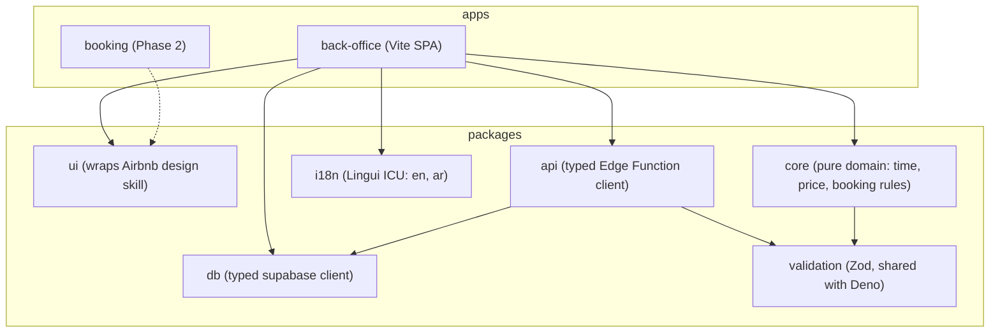
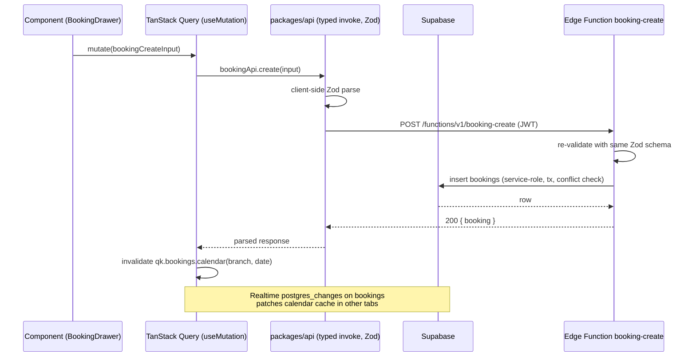

# Frontend architecture, i18n and RTL conventions

Author: cartographer. Scope: everything in `plan/briefs/frontend.md`. Visual design (colours, typography, spacing, component look) is owned by the owner's separate "Airbnb" design skill — this document deliberately defines no visual style, only how the frontend consumes that skill.

References used for currency checks (retrieved 2026-10-04):
- Supabase type generation: https://supabase.com/docs/guides/api/generating-types
- Edge Function limits/isolation: https://supabase.com/docs/guides/functions (limits table; independent measurement at https://erfi.dev/reference/supabase-edge-function-limits)
- TanStack Query v5: https://tanstack.com/query/latest
- schedule-x resource views: https://schedule-x.dev/docs/calendar/resource-scheduler and https://schedule-x.dev/docs/calendar/time-grid-resource-view
- FullCalendar Premium licensing: https://fullcalendar.io/license, https://fullcalendar.io/docs/premium
- Lingui vs react-intl (ICU): https://lingui.dev/misc/react-intl, https://tolgee.io/blog/react-i18n-libraries-comparison

---

## 1. App shape and repository layout

### PD-FE-1: pnpm monorepo with two apps and shared packages

- Context: We need a back-office app now and a client-facing booking app later, sharing domain types, validation schemas, i18n catalogs, and the Supabase/Edge-Function client. Duplicating that in two repos guarantees drift.
- Options considered:
  1. Single repo, single app, booking as a route (`/book/...`). Cheap now, but the booking app has different auth (public), different bundle, different SEO/hosting needs; coupling it to the back-office bundle slows both.
  2. pnpm monorepo, `apps/*` + `packages/*` (recommended). Shared code lives in packages with real import boundaries; each app builds and deploys independently.
  3. Fully separate repos + published npm packages. Maximum isolation, maximum overhead; publishing private packages for a small team is ceremony without benefit.
- Proposal: pnpm workspaces monorepo:

```
repo/
  apps/
    back-office/          # React + TS + Vite, staff/manager/owner app (MVP)
    booking/              # client-facing online booking app (Phase 2, scaffolded only)
  packages/
    ui/                   # design-system layer wrapping the Airbnb design skill primitives
    db/                   # generated database.types.ts + typed supabase client factory
    api/                  # typed Edge Function client (invoke wrappers) + shared DTO types
    validation/          # Zod schemas shared frontend/Edge Functions
    i18n/                 # ICU message catalogs (en, ar), locale utils, formatters
    core/                 # pure domain logic: booking rules, time math, price math (no React)
  supabase/
    migrations/          # supabase CLI migration files
    functions/           # Edge Functions (Deno), one folder per function
    config.toml
```

  Package manager: **pnpm** (workspace protocol, fast, strict by default). Node >= 20. All apps Vite + React 18 + TypeScript `strict` (plus `noUncheckedIndexedAccess`).
- Consequences: backend worker's Edge Function decisions must keep shared DTO types in `packages/api` importable from Deno (use TS path imports, no Node-only APIs there). CI runs per-app and per-package checks with `pnpm -r --filter`.

### App shell

One SPA per app, no framework meta-layer (no Next.js): the back-office is an authenticated tool behind no SEO requirement, and Supabase Auth + RLS fit a Vite SPA cleanly. `apps/back-office` entry: `main.tsx` → providers (QueryClient, i18n, Theme, Toast) → `AppRouter`.

---

## 2. Routing, tenant/branch context, auth

Router: **TanStack Router** (typed routes, first-class search-param validation, loader support) — recommended over React Router because calendar/report filters live in URL search params and TanStack Router types them.

### PD-FE-2: tenant/branch context lives in the session + URL, not the path

- Context: Every list/calendar/report is scoped to a branch (or all branches for owner/manager). Staff may work at several branches; the user switches branches constantly.
- Options considered:
  1. Path segments `/t/:tenant/b/:branch/calendar` — multi-tenant URLs, but tenant is fixed per login (one tenant per user), making the tenant segment pure noise, and branch in the path breaks deep links when the user switches branch mid-flow.
  2. Branch as a **URL search param** (`/calendar?branch=...&date=...&view=...`) with tenant from the authenticated session (recommended). Search params are exactly the right place for "view of the same page"; deep links survive branch switches; back button works.
- Proposal: after Supabase Auth sign-in, load the user's `tenant_id` + role + accessible `branch_ids` once (Edge Function `profile-context` or a Postgres view under RLS) into a `SessionContext`. A global **branch switcher** in the top bar writes `?branch=` (or `all` for multi-branch roles) via TanStack Router search-param setters; every query key includes the branch scope. Default branch persisted in `localStorage` per user. Branch-scoped roles (receptionist) have the switcher disabled to their single branch — enforced server-side by RLS regardless.
- Consequences: query keys must always include branch scope (see §3). URL normalization: shareable links must include branch + date + view.

### Route guards

- Route tree with layout routes: `(auth)/login`, `(app)/` shell with sidebar.
- Guards are declarative in route definitions: `beforeLoad` checks the session context and redirects to `/login` (unauthenticated) or a 403 page (wrong role). Roles: `platform_admin`, `tenant_owner`, `branch_manager`, `receptionist`, `staff`. Guards are UX only — the source of truth is RLS; the frontend never assumes a guard is the security boundary.
- Auth flows: email+password via Supabase Auth (`signInWithPassword`), session persisted by supabase-js, `onAuthStateChange` drives the context. Password reset via `resetPasswordForEmail`. MFA and magic links: deferred (not MVP).
- Deep-link handling: protected routes stash the intended URL and restore after login.

---

## 3. Data access

### PD-FE-3: supabase-js (PostgREST/RPC) for reads, Edge Functions for writes with invariants

- Context: The brief fixes all server logic in Edge Functions but asks when the frontend may talk to the database directly. Bandwidth, cold starts, and developer velocity all argue for not routing trivial reads through functions.
- Options considered:
  1. All reads and writes through Edge Functions (BFF style). One seam, but every list screen pays a cold-start-capable hop and function invocations for traffic RLS already answers safely.
  2. Reads via supabase-js under RLS + security-definer RPC; writes that must enforce cross-table invariants (booking conflicts, checkout, shifts) via Edge Functions; simple single-table writes via supabase-js under RLS (recommended).
- Proposal: rule of thumb written into the `react-frontend` skill:
  - **Read**: supabase-js `.select()` against tables/views, always with generated types, always under RLS. Complex read aggregations (report queries) call named Postgres functions (RPC) under RLS — one round trip, SQL-speed.
  - **Write, simple**: `insert/update/delete` via supabase-js on single tables where RLS + a check constraint fully express the rule (e.g. rename a client note).
  - **Write, invariant-bearing**: Edge Function (e.g. `booking-create`, `booking-reschedule`, `checkout`, `shift-schedule`) — anything needing conflict detection across resources, service duration math, or multi-table transactions. The function re-validates input with the **same Zod schemas from `packages/validation`** and runs against Postgres transactionally.
  - Realtime (calendar) subscribes directly with supabase-js channels; payloads trigger cache updates, never direct state writes.
- Consequences: Edge Functions must authenticate the caller (JWT) and re-derive tenant/branch from the DB, never from the request body. Function granularity decisions belong to the backend worker; the frontend only consumes the typed client.

### Typed clients

- `packages/db`: `supabase gen types typescript` output committed as `database.types.ts`, regenerated in CI with a drift check (fail if diff). Typed client factory:

```ts
import { createClient } from '@supabase/supabase-js'
import type { Database } from './database.types'
export const createTypedClient = (url: string, key: string) =>
  createClient<Database>(url, key)
```

- `packages/api`: for every Edge Function, a function-name-scoped invoke wrapper with Zod-validated input/output types:

```ts
export const bookingApi = {
  create: (input: BookingCreateInput) =>
    invoke('booking-create', input, bookingCreateResponseSchema),
}
```

  `invoke` centralizes: auth header, error envelope normalization, retries only for 5xx/network, and maps Supabase function errors to typed `ApiError` (code, message, fieldErrors).

### PD-FE-4: TanStack Query with hierarchical key factories, branch-scoped keys

- Context: Server state needs caching, invalidation, and optimistic updates; the calendar needs cross-tab liveness. Client-side copies of server data (Redux/Zustand mirrors) are a known footgun.
- Options considered:
  1. Redux Toolkit Query — extra conceptual surface, weaker TS inference for our patterns.
  2. TanStack Query v5 (recommended) — the de-facto standard, `queryOptions` co-location, prefix invalidation, suspense support.
- Proposal (rules, encoded in the `react-frontend` skill):
  - **Key factories only** (`packages/api` or per-feature `queries.ts`); never inline arrays:

```ts
export const qk = {
  clients: {
    all: () => ['clients'] as const,
    list: (branchId: string, f: ClientFilters) => ['clients', 'list', branchId, f] as const,
    detail: (id: string) => ['clients', 'detail', id] as const,
  },
  bookings: {
    calendar: (branchId: string, date: string) => ['bookings', 'calendar', branchId, date] as const,
  },
}
```

  - Branch scope is always a key segment so switching branch never serves stale cross-branch data.
  - Queries defined with `queryOptions` next to the fetch function; components only import options.
  - Mutations invalidate via factory prefixes (`qk.clients.list(branchId, ...)`) — never bare `invalidateQueries()`. Optimistic updates only where latency matters (drag-to-reschedule, status toggles): `onMutate` → `cancelQueries` → snapshot → `setQueryData`; `onError` → rollback; `onSettled` → targeted revalidation.
  - staleTime defaults: 30 s lists, 60 s reference data (services, staff), 0 for anything money-related on reports. `retry`: 2 for queries, 0 for mutations (show the error instead).
  - **Realtime → cache**: one `useRealtime` hook per entity type subscribes to `postgres_changes` for the branch's bookings; on INSERT/UPDATE/DELETE it patches the matching cache keys via `queryClient.setQueriesData` and invalidates the affected calendar day key. The calendar never holds its own copy of bookings outside the cache.
- Consequences: no global state library for server data. Local UI state stays in React (see §4).

### Error surfacing

- One `ApiError` class with `code` (`NETWORK | UNAUTHENTICATED | FORBIDDEN | VALIDATION | CONFLICT | NOT_FOUND | INTERNAL`).
- Global handler: toast for recoverable errors, redirect for `UNAUTHENTICATED`, inline field errors for `VALIDATION`. Every screen renders loading/empty/error states via shared `<AsyncBoundary>`; "no data" and "query failed" are never conflated.

---

## 4. State, forms, validation

### PD-FE-5: React Hook Form + Zod, schemas shared with Edge Functions

- Context: The back-office is form-heavy (client, service, staff, shifts, checkout). Edge Functions must re-validate anyway; two validation layers drift.
- Options considered:
  1. Formik — slower, legacy API.
  2. React Hook Form (RHF) + Zod resolver (recommended) — uncontrolled, minimal re-renders, Zod schema is the single source of truth, resolvers give field-level errors.
  3. TanStack Form — newer, smaller ecosystem.
- Proposal: `packages/validation` holds one Zod schema per operation (e.g. `bookingCreateSchema`, `serviceUpsertSchema`). The form uses `zodResolver(schema)`; the Edge Function imports the **same schema** (Deno-compatible Zod is pure JS). DTO types are `z.infer` of the schemas, shared via `packages/api`.
- Client state rules (small and explicit):
  - Server state → TanStack Query. UI state (modals, drawers, selected day) → React `useState`/`useReducer` in feature. Cross-feature ephemeral state (open appointment drawer id) → URL search params first, tiny Zustand store only for truly non-URL ephemera (e.g. unsaved-drawer warning flag). No Redux.
  - All money/duration values stored as minor units (fils) / minutes as integers; formatting only at render (§5).

---

## 5. i18n and RTL

### PD-FE-6: Lingui (ICU) + logical CSS properties + `dir`-driven mirroring

- Context: English + Arabic with full RTL from day one. Arabic needs proper pluralisation (ICU `plural` with `zero/one/two/few/many/other`) and translators need an industry-standard format.
- Options considered:
  1. react-i18next — own non-standard plural format; ICU only via all-or-nothing plugin (see https://tolgee.io/blog/react-i18n-libraries-comparison).
  2. react-intl/FormatJS — ICU, runtime parsing unless pre-compiled.
  3. **Lingui** (recommended) — ICU MessageFormat via macros (`<Trans>`, `Plural`), build-time compiled catalogs (≈4 kB runtime), PO catalogs translators can open, `lingui extract` merges catalogs (see https://lingui.dev/misc/react-intl).
- Proposal:
  - Message keys: auto-generated from source text (Lingui macro default) with explicit `id` allowed; catalogs at `packages/i18n/locales/{en,ar}/messages.po`. Never concatenate translated fragments; full sentences with interpolation.
  - `<I18nProvider>` sets `document.documentElement.lang` and `dir`; locale preference per user, persisted, default `en`, SpaCorner users likely `ar`.
  - **RTL**: only logical CSS properties (`margin-inline-start`, `padding-inline-end`, `inset-inline-start`, `text-align: start`), flexbox/grid natural direction flow, `:dir()` for rare exceptions. No `left/right`, no `margin-left`. Mirrored icons: directional icons (arrows, chevrons, back) flip via `transform: scaleX(-1)` under `[dir='rtl']` or use auto-flipping SVG (`<svg>` with `direction: rtl`); non-directional icons never mirrored. A lint rule (stylelint `declaration-property-value-disallowed-list` for `*-left/right`) enforces this.
  - **Formatting** — all via `Intl`, centralized in `packages/i18n`:
    - Currency: `Intl.NumberFormat(locale, { style: 'currency', currency: 'KWD', currencyDisplay: 'narrowSymbol', minimumFractionDigits: 3, maximumFractionDigits: 3 })` → "KWD 12.500" / "د.ك ١٢٫٥٠٠" (Arabic-Indic digits come from `ar` locale numbering system; keep consistent within a locale). Other tenant currencies use the tenant's ISO code with its standard minor units.
    - Dates/times: `Intl.DateTimeFormat` with the **branch's time zone** (`timeZone: branch.ianaTz`, default `Asia/Kuwait`). All timestamps over the wire are UTC ISO 8601 (or `timestamptz`); the UI renders in branch tz, and every timestamp near inputs shows the tz context ("Asia/Kuwait") where ambiguity is possible. Date pickers operate in branch-local time; conversion happens in `packages/core` (pure functions, tested).
    - Relative times ("in 2 hours") via `Intl.RelativeTimeFormat` + `Intl.PluralRules`.
  - Calendar localization: schedule-x ships locale packs (`@schedule-x/translations`); Arabic locale registered alongside our Lingui catalog.
- Consequences: components never call `toLocaleString` inline; they use `useFormat()` from `packages/i18n`. Screenshot/E2E tests run in both `en`/LTR and `ar`/RTL.

---

## 6. The calendar

### PD-FE-7: schedule-x core + premium resource views, wrapped in our `<BookingCalendar>`

- Context: The calendar is the hardest screen: day + week views, one column per staff member (resource view), drag-to-reschedule, RTL, and performance with tens of staff × hundreds of bookings per week. Building this in-house is a multi-month trap.
- Options considered:
  1. **Build from scratch** — total control, but drag/drop hit-testing, snapping, virtualization, and RTL are each week-long problems; rejected.
  2. **FullCalendar** — mature, RTL support, but resource views are Premium plugins with a commercial license requirement for closed-source for-profit use (https://fullcalendar.io/license, https://fullcalendar.io/docs/premium); v7 moved premium to AGPLv3/commercial.
  3. **schedule-x** (recommended) — modern calendar built for i18n, has first-class React bindings and custom component injection, drag & drop + resize plugins, locale packs. Resource views (people-as-columns) are in the premium `@sx-premium/*` packages (https://schedule-x.dev/docs/calendar/resource-scheduler, https://schedule-x.dev/docs/calendar/time-grid-resource-view); license cost is a line item the chair should approve. Fallback if the premium license is rejected: schedule-x core week view with per-staff filtering + custom resource columns via its custom-view API, or renegotiate.
- Proposal:
  - Wrap schedule-x in a feature-owned `<BookingCalendar>` component; the library never leaks outside `features/calendar`.
  - Views: day (resource scheduler: one column per working staff member for the selected branch, honouring shifts), week, and a compact "my day" for single staff logins. Resources = staff; rooms/resources overlay comes later (post-MVP).
  - Event model mapping: `Booking` (start/end `timestamptz`, `staffId`, `serviceIds[]`, `status`, `clientId`) → schedule-x event `{ id, start, end, resourceId: staffId, ... }` via a mapper in `features/calendar/mappers.ts`. All-day/pending distinction via status colors from the design skill tokens.
  - Drag-to-reschedule: schedule-x drag-and-drop plugin fires the moved event locally; our handler calls `bookingApi.reschedule` via mutation with **optimistic cache update** (the drag itself is the optimistic UI); server conflict (409 `CONFLICT`) rolls the event back with a toast explaining the clash (overlaps another booking / outside shift).
  - Click empty slot → pre-filled "new booking" drawer (client, service pre-filtered by staff skills and slot duration). Click event → booking drawer (edit status/services, checkout).
  - Data: `qk.bookings.calendar(branchId, date)` prefetches the visible week; `onLazyLoad`-style hooks fetch adjacent days. Realtime patches the same keys (§3).
  - Time zone: calendar renders in branch tz; schedule-x consumes local datetimes produced by our mapper (UTC → branch-local), so the library never sees tz math.
  - Performance: virtualize staff columns beyond ~8 (horizontal scroll with lazy column render), cap week prefetch at branch + date, memoized event components.
- Consequences: premium dependency must be added to the license budget; conflict semantics live in the `booking-reschedule` Edge Function (backend worker's scope).

---

## 7. Component architecture

### Consuming the Airbnb design skill

- `packages/ui` is the only layer allowed to import design-skill primitives/tokens. Feature code imports from `@repo/ui` (`<Button>`, `<Drawer>`, `<DataTable>`, `<Field>`, ...), never raw tokens or skill classes. When the design skill updates, only `packages/ui` changes.
- Component naming: components PascalCase files matching component name; hooks `useX.ts`; one component per file plus co-located `*.module.css` or styled tokens per design-skill mechanics; feature-internal components stay in the feature folder, only shared ones promote to `packages/ui`.

### Folder structure per feature

```
features/calendar/
  routes/            # route definitions (TanStack Router)
  components/        # BookingCalendar, BookingDrawer, SlotPicker...
  queries.ts         # queryOptions + key usage
  mutations.ts       # useCreateBooking, useRescheduleBooking...
  mappers.ts         # Booking <-> schedule-x event
  validation.ts      # re-exports from @repo/validation, form-specific refinements
  index.ts           # public exports (the only import path for other features)
```

Features import each other only through `index.ts`; cyclical feature imports fail lint.

### Accessibility rules

- Keyboard: every flow operable by keyboard; the calendar gets documented key bindings (arrows to navigate days, Enter to open slot). Focus visible per design skill; drawers/modals trap focus and return focus on close (design-skill primitives implement this once).
- ARIA: tables use real `<table>` semantics via `DataTable`; icon-only buttons have `aria-label`; toasts `role="status"`/`role="alert"`; form fields bind `<label>`; errors are announced (`aria-describedby` + `aria-live` region).
- Contrast/zoom: enforce design-skill tokens (no ad-hoc colors), respect `prefers-reduced-motion` for drag animations; E2E a11y assertions via axe-core on main flows.

### Loading / empty / error states

- Every async screen uses `<AsyncBoundary query={...}>` giving standard skeleton/empty/error. Empty states are actionable ("No clients yet — Add client"). Errors are human sentences, never raw messages.

### Responsive behaviour

- Back-office targets desktop-first but must work on front-desk tablets (1024–1366px): sidebar collapses to icons, calendar columns compress then horizontally scroll, drawers become full-width under 768px. Touch targets ≥ 44px. The staff personal view is usable on phones for shift/time checking (post-MVP).

---

## 8. Testing and quality

- **Unit**: Vitest + React Testing Library. Coverage targets: `packages/core` (time/price math) ≥ 95%, features ≥ 70% on logic (queries/mutations/mappers). No snapshot tests except design-skill wrappers.
- **E2E**: Playwright, one suite per critical journey: login, create booking (drag + form), reschedule drag with conflict rollback, checkout cash sale, client CRUD, branch switch, RTL smoke suite (`ar` locale on calendar + checkout). Runs against local Supabase (`supabase start`) with seeded fixtures per test.
- **Lint/format**: ESLint (typescript-eslint strict, react, jsx-a11y, import boundaries via `eslint-plugin-boundaries`), stylelint with the RTL logical-property rule, Prettier. `pnpm verify` = typecheck + lint + unit + build; CI runs it on the diff graph and E2E nightly + pre-release.
- **Type strictness**: `strict`, `noUncheckedIndexedAccess`, `exactOptionalPropertyTypes` in packages, generated Supabase types committed, `ApiError` discriminated. `any` fails lint (`@typescript-eslint/no-explicit-any: error`).
- **Performance budgets** (per app, enforced by `size-limit` in CI): initial JS ≤ 250 kB gzip (back-office), route-level chunks ≤ 80 kB, calendar chunk ≤ 150 kB; interaction budgets: calendar drag frame ≤ 16ms, booking drawer open ≤ 100ms p75; query budgets: calendar week load ≤ 500ms p75 server time (depends on backend indexes).

---

## 9. Diagrams

### Frontend module structure



### Data flow: component → Supabase / Edge Function



---

## Proposed decisions

### PD-FE-1: pnpm monorepo, two apps, six packages
- Context: back-office now, booking app later, shared types/i18n/validation.
- Options: single app with booking routes (couples bundles) / monorepo (chosen) / multi-repo published packages (overhead).
- Proposal: pnpm workspaces; `apps/back-office`, `apps/booking` (scaffold), `packages/{ui,db,api,validation,i18n,core}`, `supabase/`.
- Consequences: shared packages must stay Deno-importable where Edge Functions use them (`validation`); CI filtered per workspace.

### PD-FE-2: branch context in URL search param, tenant from session
- Context: branch switching is constant; deep links must survive it.
- Options: path segments (breaks on switch, tenant noise) / search param + session (chosen) / session only (unshareable).
- Proposal: `?branch=` search param + branch switcher; session loads role + accessible branches; RLS is the real boundary.
- Consequences: every query key carries the branch scope; shareable URLs must serialize branch/date/view.

### PD-FE-3: reads via supabase-js/RPC under RLS; invariant writes via Edge Functions
- Context: brief requires Edge Functions for server logic but asks where direct client access is justified.
- Options: all-through-functions (cold-start + invocation cost) / hybrid (chosen) / all-direct (cannot express multi-table invariants).
- Proposal: reads and simple single-table writes direct under RLS; anything with conflicts/transactions/money calls a typed Edge Function that re-validates with shared Zod.
- Consequences: backend worker defines function granularity; frontend consumes only `packages/api` wrappers.

### PD-FE-4: TanStack Query v5, factory keys, branch-scoped, realtime→cache
- Context: server-state caching, optimistic drags, cross-tab calendar updates.
- Options: RTK Query / TanStack Query (chosen) / hand-rolled cache.
- Proposal: hierarchical key factories with branch segment; queryOptions co-location; optimistic updates only for drags/toggles; Realtime writes into the cache.
- Consequences: no server-data mirror in any state library; skill codifies invalidation scope rules.

### PD-FE-5: React Hook Form + Zod schemas shared with Edge Functions
- Context: form-heavy app; double validation drifts.
- Options: Formik / RHF+Zod (chosen) / TanStack Form.
- Proposal: one Zod schema per operation in `packages/validation`; forms use zodResolver; functions import the same schema.
- Consequences: Zod must remain Deno-compatible (it is, pure JS); DTOs are `z.infer` types.

### PD-FE-6: Lingui ICU i18n; logical CSS only; Intl formatting per branch tz
- Context: en + ar full RTL day one; KWD 3-decimal; per-branch time zones.
- Options: react-i18next (non-ICU plurals) / react-intl (runtime parsing) / Lingui (chosen: ICU macros, build-time compile, PO catalogs).
- Proposal: Lingui macros + compiled catalogs; `dir` on `<html>`; logical properties enforced by stylelint; mirrored directional icons only; money/dates via centralized `Intl` helpers in branch tz.
- Consequences: E2E in both locales; components never format inline.

### PD-FE-7: schedule-x (+ premium resource views) wrapped in feature-owned BookingCalendar
- Context: hardest screen: day/week, per-staff columns, drag reschedule, RTL, performance.
- Options: build in-house (months) / FullCalendar premium (commercial license, older model) / schedule-x + premium (chosen).
- Proposal: schedule-x React bindings; resources = staff; drag = optimistic mutation + server conflict rollback; mapper isolates the library; branch-tz rendering via local datetimes.
- Consequences: premium license line item for chair approval; fallback documented (custom resource columns via schedule-x custom views).

### PD-FE-8: TanStack Router with typed search params
- Context: filters/date/view belong in URLs; guards per role.
- Options: React Router (weaker search-param typing) / TanStack Router (chosen).
- Proposal: typed route tree; `beforeLoad` guards (UX only, RLS is truth); login/reset flows via Supabase Auth JS.
- Consequences: route definitions colocated in features; deep links restore post-login.
