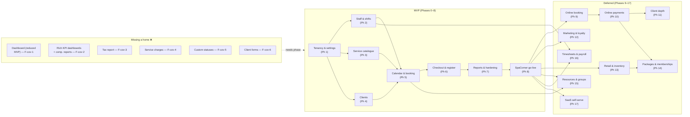

# Coverage and product audit — Round 2 adversarial review

Auditor: linker (coverage brief). Files read: all 12 plan deliverables, 3 skills, 6 reverse-engineering evidence files, plus decisions.md and IMPLEMENTATION_PLAN.md for phase/ADR citations.
Validated: `node /Users/fahad/council/check-skills.mjs /Users/fahad/council/output/plan/skills` — OK (7 skills, .cursor and .claude copies identical).
Cross-area alert: the SQL drafts under `sql/` contain 18 `numeric(12,3)` money columns violating ADR-17 (`bigint _minor`). The parent's binding-corrections already ordered the fix; this audit notes one new column (`service_charge_total numeric`) that is also a feature-coverage issue (F-cov-4).

Note on phase names: this report uses the IMPLEMENTATION_PLAN phases (0–17). Where "Phase 2" / "Phase 3" appear from requirements.md they are the three release buckets (MVP / Phase 2 = online presence / Phase 3 = growth); the parity table maps each to the concrete implementation phase.

---

## 1. Feature parity map

### 1.1 Pages and features

Every page/feature from FINAL_REPORT and pages.json, mapped to plan coverage. "❌" = missing or no home. Phase numbers are from IMPLEMENTATION_PLAN.

| Fresha page / feature | Where covered in the plan | Status |
|---|---|---|
| Dashboard / home | requirements §1.1 lists MVP (reduced: today's apps, sales, no-show count) | ❌ F-cov-1: no story, screen, or phase |
| Calendar (day/week grid) | Phase 5 (calendar & booking), ADR-41 schedule-x | MVP |
| Appointment create/edit | Phase 5 (booking lifecycle) | MVP |
| Appointment drawer | Phase 5 (appointment drawer UI) | MVP |
| Appointment statuses | ADR-7 fixed enum; custom statuses Phase 3 (ADR-7) | MVP / Phase? |
| Conflicts, buffers, hours | Phase 5 conflict engine, ADR-24/25/26 | MVP |
| Reschedule / cancel / no-show | US-CAL-4/5/6, Phase 5 | MVP — but cross-branch reschedule pricing ❌ F-walk-1 |
| Blocked time | Phase 2 (blocked_times), US-T-3 | MVP |
| Closed periods / holidays | Phase 1 (closed_periods), US-ON-4 | MVP |
| Staff records (team members) | Phase 2 (staff CRUD + assignments), ADR-12 | MVP |
| Scheduled shifts | Phase 2 (shifts), US-T-2 | MVP |
| Clients list + profile | Phase 4 (clients), US-CL-1..8 | MVP |
| Client notes | Phase 4 (client_notes), US-CL-3 | MVP |
| Client allergies/alerts | Phase 4, US-CL-4 | MVP |
| Client tags | Phase 4, US-CL-5 | MVP |
| Client search | Phase 4 + Phase 7 global search, US-CL-6 | MVP |
| Client import (CSV) | Phase 4, US-CL-7 | MVP |
| Client segments | Phase 12 (marketing & loyalty) | Deferred |
| Client loyalty | Phase 12 (loyalty points) | Deferred |
| Online reputation / reviews | Explicitly out of scope (requirements §1.4) | Out of scope |
| Service menu (services + categories) | Phase 3 (catalogue), US-CAT-1..4 | MVP |
| Branch overrides | Phase 3 (overrides), ADR-13 | MVP |
| Packages | Phase 14 (packages & memberships) | Deferred |
| Products / retail | Phase 13 (retail & inventory) | Deferred |
| Stocktakes | Phase 13 | Deferred |
| Stock orders | Phase 13 | Deferred |
| Suppliers | Phase 13 | Deferred |
| Sales list (invoices) | Phase 6 (sales list + detail), US-SAL-1 | MVP |
| Checkout / POS | Phase 6 (checkout), US-CO-1..8 | MVP |
| Discounts | Phase 6, US-CO-2 | MVP |
| Tips | Phase 6 (tips), US-CO-3 | MVP |
| Refunds / voids | Phase 6, ADR-10 — permission ❌ F-perm-1 | MVP |
| Payments list | Phase 6/7, US-SAL-2 | MVP |
| Daily sales summary | Phase 6/7, US-SAL-3 | MVP |
| Register (POS) | Phase 6 (register), ADR-6, US-CO-7 | MVP |
| Invoice numbering | Phase 1/6, ADR-14 | MVP |
| Receipts (print) | Phase 6 (receipt), US-CO-8 | MVP |
| Taxes | Phase 6 (tax_rates) — but no tax report ❌ F-cov-3 | MVP (model) / ❌ (report) |
| Gift cards sold | Phase 14 | Deferred |
| Packages sold | Phase 14 | Deferred |
| Memberships sold | Phase 14 | Deferred |
| Draft sales (cart park) | Not in plan (sale is atomic at checkout) | Not covered (minor) |
| Online booking (client-facing) | Phase 9 (online booking), ADR-1 | Deferred |
| Booking link builder / QR | Phase 9 | Deferred |
| Reminders / notifications | Phase 9 (notifications) | Deferred |
| Notification history | Phase 9 | Deferred |
| Online payments (KNET/cards) | Phase 10 (online payments), ADR-34 | Deferred |
| Deposits / prepayments | Phase 10 | Deferred |
| No-show / late-cancel fees | Phase 10 | Deferred |
| Client self-service portal | Phase 11 (client depth) | Deferred |
| Blast campaigns | Phase 12 (marketing) | Deferred |
| Automations (event messages) | Phase 9 (notifications) | Deferred |
| Messages history | Phase 9 | Deferred |
| Deals / promo codes | Phase 12 | Deferred |
| Smart pricing | Out of scope (requirements §1.4) | Out of scope |
| Marketplace profile | Out of scope (§1.4) | Out of scope |
| Reserve with Google | Out of scope (§1.4) | Out of scope |
| Facebook / Instagram bookings | Out of scope (§1.4) | Out of scope |
| Smart Website | Out of scope (§1.4) | Out of scope |
| Team members (staff) | Phase 2 | MVP |
| Timesheets | Phase 16 (timesheets & payroll) | Deferred |
| Pay runs | Phase 16 | Deferred |
| Reports (59 report catalogue) | Phase 7 (six MVP reports) | See §1.3 |
| Add-ons marketplace | Out of scope (§1.4) | Out of scope |
| Setup / settings hub | Phase 1 (tenancy & settings) | MVP |
| Fresha Connect (messaging) | Out of scope (§1.3) | Out of scope |
| My profile / personal settings | Not included; platform-account pages | Out of scope (unstated) |
| Global search | Phase 7 (global search palette) | MVP |
| Audit trail viewer | Phase 7 (audit viewer), US-SEC-2 | MVP |
| Data export (CSV) | Phase 7 (exports), US-SEC-3 | MVP |
| Branch switcher | Phase 1 (switcher wired), US-SEC-4 | MVP |
| Language switcher | Phase 0 (i18n baseline) | MVP |
| Continue setup / checklist | Phase 1 (setup checklist), US-ON-1 | MVP |
| Performance insights drawer | requirements Phase 3 — ❌ F-cov-2 | Missing phase |
| Notifications drawer (in-app) | Not covered (reminders = outbound, not in-app feed) | Missing (minor) |
| User menu (logout, profile) | Phase 0 (login/logout) | MVP |

### 1.2 Settings parity

Each settings area from technical/settings.md mapped to plan. "—" = not covered.

| Fresha setting | Phase | Notes |
|---|---|---|
| Business details (name, currency, language, links) | Phase 1 | Covered. Links to external social/website not in plan (minor). |
| Business types per location | — | Marketplace-facing; out of scope but unstated. |
| Locations -> address + map | Phase 1 | Address covered; embedded map not specified. |
| Location opening hours | Phase 1 | Covered. |
| Location sales: receipt sequencing, tax defaults, tipping | Phase 1 | Covered. |
| Time and calendar: timezone, time format, first day of week | Phase 0/1 | TZ covered; first-day-of-week + 12/24h ❌ F-cov-7. |
| Waitlist | Phase 9/11 | Deferred. |
| Blocked time types | Phase 1/2 | Covered. |
| Resources (rooms/equipment) | Phase 15 | Deferred. |
| Cancellation reasons | Phase 1 | Covered. |
| Appointment statuses (custom) | — ❌ F-cov-5 | Deferred "Phase 3" but no phase. |
| Closed periods | Phase 1 | Covered. |
| Dynamic assignment (availability-based) | Phase 9 | Deferred. |
| Availability: booking window, slot increments | Phase 5/9 | Slot increments MVP; booking window deferred. |
| Booking options (group, gender, profiles) | Phase 9/15 | Deferred. |
| Pay now (one-tap) | Phase 10 | Deferred. |
| Tax rates | Phase 6 | Covered. |
| Receipt design | Phase 1/6 | Covered. |
| Registers | Phase 6 | Covered. |
| Tipping defaults | Phase 1 | Covered. |
| Service charges | — ❌ F-cov-4 | Feature absent; schema has it; uses numeric. |
| Gift cards | Phase 14 | Deferred. |
| Custom checkout methods | Phase 1 | Covered. |
| Client sources | — ❌ F-cov-8 | Absent. |
| Client tags | Phase 4 | Covered. |
| Client Connect settings | Out of scope (§1.3) | Covered (out of scope). |
| Billing (legal entities, comms balance, fees) | Phase 17 (self-serve billing) | Deferred. |
| Permission roles | Phase 1 (memberships UI) | Covered. |
| Time off types | Phase 2 (blocked_time_types) | Covered. |
| Timesheets settings | Phase 16 | Deferred. |
| Shifts settings | Phase 2 | Covered. |
| Pay runs / commissions | Phase 16 | Deferred. |
| PIN switching | — | Not covered; unstated out-of-scope (minor). |
| Form templates | — ❌ F-cov-6 | "Phase 3" but no phase. |
| Payment policy (prepay, fees) | Phase 10 | Deferred. |
| Payment methods (card) | Phase 10 | Deferred. |
| Personal info, login & security, appearance | — | Out of scope (user-account). |

### 1.3 Reports parity

59 Fresha reports (TECHNICAL_REPORT §7.3), each mapped. The six MVP reports are US-RPT-1..6 (Phase 7). Other reports land with their feature phases or are out of scope.

| # | Report | Coverage |
|---|---|---|
| 1 | Performance dashboard | ❌ F-cov-2 (no phase for rich KPI dashboards) |
| 2 | Online presence dashboard | Out of scope (marketplace/channel-dependent) |
| 3 | Loyalty dashboard | Phase 12 (loyalty program) |
| 4 | Performance summary (premium) | ❌ F-cov-2 |
| 5 | Performance over time (premium) | ❌ F-cov-2 |
| 6 | Sales summary | US-RPT-1 MVP |
| 7 | Sales by time period (premium) | ❌ F-cov-2 (comparison/time-bucket reporting) |
| 8 | Sales list | US-SAL-1 + Phase 7 (additive) |
| 9 | Sales log detail | Additive with Phase 7+ (line-level detail) |
| 10–11 | Gift card reports | Phase 14 |
| 12–14 | Memberships reports | Phase 14 |
| 15–17 | Packages reports | Phase 14 |
| 18 | Cash register summary | Folded into US-RPT-1 daily-summary register movements |
| 19 | Discount summary | Folded into US-RPT-1 (discounts aggregate) |
| 20 | Taxes summary | ❌ F-cov-3 (taxes modeled but no report) |
| 21 | Finance summary | Not in MVP six; no later phase (deferred with liability/ledger) |
| 22 | Payments summary | US-RPT-2 MVP |
| 23 | Payment transactions | US-SAL-2 MVP |
| 24–25 | Cash flow summary/statement | Out of scope (wallet-based; not our model) |
| 26 | Service charges | ❌ F-cov-4 (feature absent) |
| 27–28 | Liability reports | Phase 14 (packages/gift-cards/memberships) |
| 29–30 | Prepayment/deposit reports | Phase 10 (deposits) |
| 31 | Taxes list | ❌ F-cov-3 |
| 32 | Appointments summary | US-RPT-3 MVP |
| 33 | Appointments list | Calendar + US-RPT-3 (summary covers it; list is additive) |
| 34 | Cancellations & no-show summary | US-RPT-3 MVP (covers rates; by-reason is US-CAL-5) |
| 35–36 | Waitlist reports | Phase 11 (waitlist) |
| 37–47 | Working hours, breaks, attendance, wages, fees, pay, shifts, time off, tips | Phase 16 (timesheets/payroll) for 37–47; US-RPT-6 shifts MVP; tips in US-RPT-5 |
| 48–49 | Tips detail/summary | Partially in US-RPT-5 (staff performance includes tips); dedicated tips report not in six |
| 50–51 | Commission reports | Phase 16 (commissions) |
| 52 | Client summary (premium) | Not in MVP six; Phase 12 (client segments/reporting) |
| 53 | Client list | US-RPT-4 MVP |
| 54 | Client insights (premium) | Not in MVP; Phase 12 |
| 55–59 | Stock/inventory reports | Phase 13 (retail & inventory) |

---

## 2. MVP completeness

Checked per MVP area (brief §2): stories, acceptance criteria, screens, permissions, and tests must agree against each other. AC must be testable. The six MVP report metric definitions (§4.8) are testable and agree with US-SAL reconciliation gate (Phase 6/7 AC).

**Area-by-area status:**

| Area | Stories | AC testable | Screens in plan | Permissions aligned | Tests defined | Issues |
|---|---|---|---|---|---|---|
| Tenants & branches | US-ON-1..6 | ✓ | Phase 1 | ✓ (matrix rows cover) | Phase 1 pgTAP + Playwright | First-day-of-week missing (F-cov-7) |
| Staff & shifts | US-T-1..4 | ✓ | Phase 2 | ⚠ F-perm-2 | Phase 2 pgTAP + Vitest | Staff client access contradictory |
| Services per branch | US-CAT-1..4 | ✓ | Phase 3 | ✓ | Phase 3 pgTAP + Vitest | — |
| Clients | US-CL-1..8 | ✓ | Phase 4 | ⚠ F-perm-2/3 | Phase 4 pgTAP + Vitest + Playwright | Client source missing (F-cov-8) |
| Calendar & booking | US-CAL-1..11 | ✓ | Phase 5 | ⚠ F-perm-1 (cancel) | Phase 5 concurrency + Playwright | Cross-branch repricing (F-walk-1) |
| Checkout & register | US-CO-1..8, US-SAL-1..3 | ✓ | Phase 6 | ❌ F-perm-1 (refund/void) | Phase 6 pgTAP + Vitest + Playwright | Service-charges in schema (F-cov-4) |
| Basic reports | US-RPT-1..6 | ✓ | Phase 7 | ✓ | Phase 7 pgTAP + fixture | Tax report missing (F-cov-3) |

**Cross-cutting MVP gaps:**
- Dashboard claimed MVP has no story/screen/phase (F-cov-1).
- Status term "Started" in requirements §1.1 line 25 versus ADR-7 "in_progress" (F-term-1).
- Register-refund interaction when session closed (F-walk-2).
- No "first day of week" / 12-vs-24h branch preference (F-cov-7).
- No client source/attribution field (F-cov-8).

---

## 3. SpaCorner walkthrough

Simulating a realistic week at a multi-branch Kuwait spa through the plan as written, step by step.

| Step | Verdict | Notes |
|---|---|---|
| 1. Onboard SpaCorner tenant | ✓ | Phase 8 migration, Phase 1 onboarding; imports per §6. |
| 2. Two branches, different hours, same timezone | ✓ | Per-branch hours + tz (ADR-45). Walkthrough says "same tz" (fine). |
| 3. Therapist works at both branches | ✓ | ADR-12 cross-branch assignments, conflict check cross-branch. |
| 4. Service priced differently per branch | ✓ | ADR-13 overrides; resolve_service. |
| 5. Walk-in booking | ✓ | US-CAL-11; auto-created clientless, attach client later. |
| 6. Booking moved between branches | ❌ F-walk-1 | Reschedule to new branch MUST re-resolve price/duration/buffer from target override. Plan does not state it. If snapshot is reused, billing is wrong (the walkthrough combines this with step 4). |
| 7. No-show | ✓ | US-CAL-6; status only (fees in Phase 10). |
| 8. Cancellation with reason | ✓ | US-CAL-5; reasons from config (Phase 1). |
| 9. Refund a cash sale | ✓ (but ❌ F-perm-1) | US-CO-4 full refund, manager-only per story/ADR. But the matrix (F-perm-1) gives receptionist refund ability — the wrong permission would be enforced if matrix wins. Also: cash refund when register closed (next day) unspecified (F-walk-2). |
| 10. Client shared across branches | ✓ | ADR-11 tenant-scoped clients; visit history per branch. |
| 11. End-of-day cash-up | ✓ | US-CO-7 register open/close; difference recorded. |
| 12. Manager only sees own branch | ✓ (ops) / note F-walk-3 | Ops/financials: ALL branch-scoped (RLS). But clients ARE tenant-wide visible (intentional). The walkthrough intuition of "only see my branch" must exclude client records. |
| 13. Arabic-speaking receptionist | ✓ | ADR-40 full RTL + Arabic UI; receipt per client language. |

No step is completely impossible. The two gaps (F-walk-1, F-perm-1) produce wrong billing or wrong authorization if not corrected.

---

## 4. Roles and permissions

Checked the requirements §3 matrix against stories, RLS/allowlist (CONVENTIONS §6), Phase ACLs, and glossary definitions.

### Coverage: every MVP action

| Action | Matrix row | Story | RLS/Phase notes | OK? |
|---|---|---|---|---|
| Tenant settings | Owner T (platform via support) | US-ON-2 | Phase 1 owner-write | ✓ |
| Create/archive branch | Owner T | US-ON-3 | Phase 1 onboarding/provision-branch | ✓ |
| Branch settings | Owner T / manager B | — | Phase 1 settings allowlist, branch-scoped | ✓ |
| Service definitions | Owner T | US-CAT-1 | Phase 3 definitions owner-write | ✓ |
| Service overrides | Owner T / manager B | US-CAT-2 | Phase 3 overrides role-gated per branch | ✓ |
| Staff records | Owner T / manager B | US-T-1 | Phase 2 staff/manage + transactional | ✓ |
| Assign roles | Owner T | US-T-4 | Phase 1 memberships + invite function | ✓ |
| Shifts view/edit | Owner T / manager B; recept B view; staff S view | US-T-2 | Phase 2 shifts | ✓ |
| Blocked time | Owner T / manager B / recept B (create) / staff S (req) | US-T-3 | Phase 2 allowlist + manager writes | ✓ |
| Clients CRUD+notes+allergies | ⚠ F-perm-2 | US-CL-1..4 | Phase 4: staff "basic fields only" column grants | ❌ See F-perm-2 |
| Clients export | Owner T (manager —) | US-SEC-3 | Phase 7 export role-gated | ✓ |
| Client delete | Owner T | — | Phase 4 owner-only delete | ✓ |
| Client import (CSV) | — (F-perm-3) | US-CL-7 owner-run | Phase 4 owner-only import | ❌ Missing row |
| Calendar: create/reschedule | Owner T / manager B / recept B / staff B (own) | US-CAL-1/4 | Phase 5 booking RPC | ✓ |
| Cancel / no-show | Owner T / manager B / recept B / staff S (own) | US-CAL-5/6 | Phase 5 cancel RPC | ✓ |
| Checkout, discounts, tips | Owner T / manager B / recept B | US-CO-1/2/3/5/6/8 | Phase 6 checkout | ✓ |
| **Refunds / voids** | **❌ F-perm-1** | US-CO-4 (manager) | Phase 6: manager-only, FORBIDDEN for recept | ❌ Contradiction |
| Register open/close | Owner T / manager B / recept B | US-CO-7 | Phase 6 register | ✓ |
| Sales/invoices view | Owner T / manager B / recept B | US-SAL-1 | Phase 6 sales list | ✓ |
| Reports: operational | Owner T / manager B / recept B (daily) / staff S (own) | US-RPT | Phase 7 views role-scoped | ✓ |
| Reports: financial | Owner T / manager B / recept B (daily) | US-RPT-1/2 | Phase 7 role-scoped | ✓ |
| Audit log view | Owner T / manager B | US-SEC-2 | Phase 7 audit viewer | ✓ |
| Data export | Owner T / manager B (own-branch ops) | US-SEC-3 | Phase 7 exports | ✓ |

---

## 5. Frontend and RTL

### 5.1 Routing, tenant/branch context
- PD-FE-2 / ADR-37: branch in `?branch=` search param ✓.
- BUT: PD-FE-2 states "one tenant per user" while CONVENTIONS §5 + react-frontend reference describe multi-tenant switchers (F-fe-1). The session model supports multi-tenant; the text is stale.
- Platform_admin listed as frontend role ≠ "not a membership role" per glossary (F-perm-4).

### 5.2 Offline / flaky network
- No offline handling specified for the front desk. NFR-5 covers staleness via polling fallback; idempotency keys protect money writes on retry. But the UX for "network dropped mid-checkout" — spinner, reconnection banner, safety of re-submission — is unspecified (F-fe-3).

### 5.3 Arabic numerals, dates, mixed-direction text
- Currency: Intl.NumberFormat with KWD 3 decimals ✓.
- Dates in branch tz via Intl.DateTimeFormat ✓.
- Mixed-direction: no `<bdi>`/`dir="auto"`/unicode-isolate guidance for Arabic names containing Latin phone numbers/emails. Receipts, client lists, appointment cards will mis-render LTR runs inside RTL (F-i18n-1).

### 5.4 Calendar in RTL
- schedule-x locale packs + mirroring per ADR-41 ✓.
- But: first-day-of-week not configurable per branch (F-cov-7); Arabic weeks start Saturday.

### 5.5 Printing receipts both languages
- reference.md covers print CSS in both directions ✓.
- No thermal-printer integration specified; browser print only (acceptable for MVP).

### 5.6 Visual design: no overreach
- CONVENTIONS §1: "visual design not defined here" and ADR-36: packages/ui wraps design skill ✓.
- BUT: frontend.md §5 PD-FE-6 suggests `scaleX(-1) under [dir='rtl']` for icon mirroring, while i18n-rtl skill forbids hand-writing scaleX(-1) (use `@repo/ui` flipOnRtl). Contradiction (F-i18n-2).

---

## 6. Skills

Three skills audited: react-frontend, i18n-rtl, spa-domain-glossary (both .cursor and .claude copies — identical, validated by check-skills OK).

### react-frontend
- Well-structured with concrete examples from the project domain.
- Key factory mismatch with frontend.md: clients.list keyed `(branchId, f)` in frontend.md vs `(tenantId, f)` in the skill, and skill's `clients.detail(id)` omits tenant (F-fe-2, shared with frontend.md finding).
- Rule 3 says "always include tenant and branch scope" but detail keys omit both — the rule is over-broad.
- Good: money-as-integers rule 8 ✓, ApiError rule 7 ✓, optimistic-update guard ✓, realtime cache-patching rule 9 ✓.

### i18n-rtl
- Comprehensive catalog workflow, format helpers, Arabic plural categories, RTL icon checklist.
- Missing: no `<bdi>` isolation guidance for mixed text (F-i18n-1).
- Missing: no first-day-of-week / time-format branch preference (F-cov-7, affects calendar locale setup).
- Good: search normalization ✓, logical-CSS enforcement ✓, receipt print directions ✓.
- Minor ambiguity: §5 RTL icons lists mirror/no-mirror, but actual icon implementation paths cross-reference `@repo/ui` flipOnRtl (correct) vs frontend.md §5 scaleX(-1) (wrong).

### spa-domain-glossary
- Comprehensive terms (clients, walk-in, appointments, sales, payments, refunds, registers, etc.) with AR labels ✓.
- Missing terms: "Tax rate" / "Currency" (both referenced in ADR-17 + CONVENTIONS §3.2; F-skill-1).
- Banned-words list is correct and matches SQL+TS naming decisions ✓.
- "Refund ... Manager-only" — one of the documents that correctly contradicts the matrix (F-perm-1) ✓.
- "Status values (appointment) ... `in_progress`" — correctly bans "started", contradicting requirements §1.1 line 25 (F-term-1) ✓.

---

## 7. Findings (full format)

### F-perm-1: Refund and void permission matrix contradicts stories, ADR, Phase 6 AC

- Severity: **BLOCKER**
- Location: requirements §3 matrix line 188 vs US-CO-4, ADR-10, glossary "Refund", IMPLEMENTATION_PLAN Phase 6 AC
- Problem: The matrix grants receptionist B (own-branch) for refunds and voids (lumped with checkout/discounts/tips). Every other document (US-CO-4 "As manager I refund", Phase 6 AC "Refund ... manager-only (receptionist gets FORBIDDEN)", glossary "Refund ... Manager-only") restricts refunds to managers. If RLS is constructed from the matrix, receptionists can reverse cash — a money-control error.
- Evidence: Matrix line 188 "Checkout, discounts, tips, refunds, voids ... Receptionist B". US-CO-4: "As manager I refund a completed sale's payment (cash out) or void an erroneous sale same-day." Phase 6 AC: "Refund of a cash payment: manager-only (receptionist gets FORBIDDEN)." Glossary: "Refund ... Manager-only."
- Fix: Split the cell — keep receptionist B for checkout/discounts/tips; move refunds + voids to a separate row (owner T / manager B / receptionist —). Mirror in Phase 6, ADR-10, and CONVENTIONS §6 allowlist (payments must use function; function enforces role-gating).
- Affects: requirements §3, US-CO-4 (unchanged, already manager), Phase 6 AC (unchanged), CONVENTIONS §6.

### F-perm-2: Staff client access is contradicted across three documents

- Severity: **MAJOR**
- Location: requirements §3 line 183 vs §2.4 vs IMPLEMENTATION_PLAN Phase 4 DB/PgTAP
- Problem: (a) Clients are tenant-scoped (ADR-11), so "B" (own-branch) scope on the staff matrix cell is meaningless. (b) Matrix grants staff create/edit/notes/allergies; §2.4 grants "basic profiles (contact + notes)" — read scope; Phase 4 says "staff role sees only basic profile fields policy (column grants or view)" — limited read. Three incompatible answers. "B" has no meaning for a tenant-scoped entity, making the permission un-implementable as written.
- Evidence: Matrix line 183: "Clients (create/edit/notes/allergies) ... Staff B". §2.4: "Staff ... their clients' basic profiles (contact + notes needed to serve them), no financial data except their own tips." Phase 4: "staff role sees only basic profile fields policy (column grants or view)."
- Fix: Define staff = read basic profile (name, phone, allergies, notes) + write client_notes and allergy flags ONLY; no client master-data create/edit. Model this as column-level grants (already partially in Phase 4) and update the matrix to a new row "Clients: read basic profile" = staff S (own served clients — redefine with served-by-client filter) and "Clients: create/edit master data" = owner T / manager T / recept T. Update §2.4 wording to match.
- Affects: requirements §3, §2.4, Phase 4 DB policy, CONVENTIONS §6 allowlist (client_notes already listed).

### F-cov-1: MVP Dashboard has no user story, acceptance criteria, screen, or phase

- Severity: **MAJOR**
- Location: requirements §1.1 line 23, §4 (no US-DASH story), IMPLEMENTATION_PLAN (0 matches for "dashboard")
- Problem: The reduced MVP Dashboard ("today's appointments, today's sales, no-show count") is listed as MVP in §1.1 but has zero buildable spec: no US-* user story, no acceptance criteria, no screen in any phase backlog, no route. The implementation plan contains no reference to a dashboard screen (verified via grep: zero occurrences of "dashboard").
- Evidence: requirements §1.1 "Dashboard / home … MVP (reduced) … today-at-a-glance: today's appointments, today's sales, no-show count." §4 stories: US-ON, US-T, US-CAT, US-CL, US-CAL, US-CO, US-SAL, US-RPT, US-SEC — no dashboard story. IMPLEMENTATION_PLAN §0–7 backlogs — no dashboard screen or dashboard epic.
- Fix: Either (a) add US-DASH-1 "Today-at-a-glance" with AC and a backlog item in Phase 7 (it consumes report views), or (b) downgrade the features catalogue row: "Dashboard — Phase 3 rich dashboards; MVP has no standalone dashboard (calendar is home)." Option (b) is simpler and matches the plan's moment (calendar is the primary login target).
- Affects: requirements §1.1, IMPLEMENTATION_PLAN Phase 7 or Phase overview.

### F-cov-2: Rich KPI dashboards and comparison-period reports placed in "Phase 3" but unassigned to any implementation phase

- Severity: **MAJOR**
- Location: requirements §1.2 line 68, IMPLEMENTATION_PLAN Phase overview 9–17
- Problem: requirements places "Performance dashboards (rich KPIs) … Phase 3" and the Fresha "Performance insights" drawer as a Phase 3 feature. The IMPLEMENTATION_PLAN has no phase (9–17) that adds a dashboard/KPI/comparison-reporting engine. The performance dashboard, performance-summary, performance-over-time, and sales-by-time-period reports have no home.
- Evidence: requirements §1.2: "Performance dashboards (rich KPIs) | Sales/appointment KPIs with comparison periods | Phase 3 | See 1.4." IMPLEMENTATION_PLAN phases: 9 booking, 10 payments, 11 client depth, 12 marketing/loyalty, 13 retail, 14 packages/memberships, 15 resources/groups, 16 timesheets/payroll, 17 self-serve — none cover KPI dashboards or comparison-period reporting. The "Performance insights" top-bar drawer has no phase.
- Fix: Insert a "Dashboards & analytics" phase after Phase 9 (or split from Phase 7 extended-hardening), or revert the requirements placement and mark rich dashboards/comparison reporting as out-of-scope (deferred without commitment). Either way, the 59-report parity must land the performance-family reports somewhere.
- Affects: requirements §1.2, IMPLEMENTATION_PLAN overview + gantt, ADR-5.

### F-walk-1: Cross-branch reschedule must re-resolve and re-snapshot price/duration from target branch

- Severity: **MAJOR**
- Location: US-CAL-4, ADR-13, IMPLEMENTATION_PLAN Phase 5 reschedule path
- Problem: A booking moved between branches (as the walkthrough exercises — step 6 with step 4 "service priced differently per branch") uses the old branch's snapshotted price/duration instead of re-resolving from the target branch's override. The plan says "reschedule to another branch-date" (US-CAL-4) and "snapshot at booking time" (ADR-13), but does not state that the reschedule RPC must re-run `resolve_service` for the new branch and re-snapshot. If an implementation reuses the existing snapshot, a cross-branch move would bill the wrong price — a money error.
- Evidence: US-CAL-4: "As front desk I move an appointment to another time/staff/branch-date." ADR-13: "bookings snapshot the resolved values at booking time (historical accuracy)." No clause requiring re-resolution on cross-branch reschedule. Walkthrough steps 4+6 combine the exact scenario.
- Fix: Add explicit AC to US-CAL-4 and Phase 5 reschedule RPC: "Rescheduling across branches re-resolves price, duration, and buffers from the target branch's override via resolve_service(target_branch, service_id) and re-snapshots the new values. The audit records both old and new values."
- Affects: US-CAL-4, Phase 5 `reschedule_appointment` RPC, ADR-13.

### F-cov-3: Tax report is absent though tax model is MVP and applied at checkout

- Severity: **MINOR**
- Location: requirements §4.8 (six reports), IMPLEMENTATION_PLAN Phase 6 (tax_rates) / Phase 7 (reports)
- Problem: Taxes are modeled in MVP (tenant tax_rates, applied at checkout, "sellable to GCC tenant turns on without a migration"), and Phase 6 builds tax_rates + checkout tax application. Yet no "taxes summary/list" report exists among the six or any later phase. A GCC tenant that turns on VAT cannot file without collecting tax totals by period/rate. Fresha ships taxes-summary (report 20) and taxes-list (report 31).
- Evidence: requirements §1.1: "Taxes | Tax rates applied at checkout; retail-prices-include-tax option | MVP." Phase 6: "tax (tenant rates, Kuwait zero-rated today — model ready)." Six reports: none is a tax report.
- Fix: Add a "Taxes summary" report (by rate, by period, collected vs refunded) to Phase 7 (additive after the six), or note it as deferred to the payment/liability finance phase (Phase 14+). At minimum state it explicitly.
- Affects: requirements §4.8, IMPLEMENTATION_PLAN Phase 7.

### F-cov-4: Service charges feature is absent from release placement but present in draft schema (also numeric money type)

- Severity: **MINOR**
- Location: requirements §1 (no row), sql/000010_create_sales.sql:32, data-model.md:393
- Problem: Fresha has "service charges" (auto % added to service lines, with setup/settings/reports). Our requirements never place it (not MVP, no later phase, not explicitly out of scope). The draft sales migration has `service_charge_total numeric(12,3)` — a) a feature with no requirements home, and b) a money column using banned `numeric` type (ADR-17 requires `bigint _minor`). The parent's binding corrections flagged all numeric money columns for rewrite; this column is one of 18 still-present numeric columns in the SQL drafts and additionally represents a requirements gap.
- Evidence: sql/000010_create_sales.sql line 32: "service_charge_total numeric(12,3) NOT NULL DEFAULT 0". No service-charge row in requirements §1.1-1.4. Fresha settings.md documents /setup/sales/service-charges and reports.md lists report 26 "Service charges".
- Fix: (a) Add an explicit "out of scope" or deferred phase row to requirements §1, and (b) DROP service_charge_total from the MVP migration OR rename it to `service_charge_total_minor bigint` and assign the feature to a phase. The 18 numeric columns (60% of the money table column count) are a data-backend fix per the parent's binding correction.
- Affects: requirements §1, sql/000010, data-model.md (cross-area: data-backend brief owns the numeric sweep).

### F-cov-5: Custom appointment statuses deferred "Phase 3" but no phase builds them

- Severity: **MINOR**
- Location: requirements §1.1 (ADR-7/PD-scope-7), IMPLEMENTATION_PLAN phases 9–17
- Problem: PD-scope-7 and ADR-7 place custom statuses in "Phase 3 (config, only matter with automations)". No phase from 9–17 adds custom-appointment-statuses. Automations land in Phase 9 (event-driven messages) and Phase 12 (marketing); status config could fit either but is not listed.
- Evidence: ADR-7: "fixed enum in MVP … custom statuses become Phase 3 config (they only matter with automations)." IMPLEMENTATION_PLAN: automation phases list notification triggers, not status config.
- Fix: Add custom-status config to Phase 12 backlog (marketing & automations) or state it as non-committed unless a specific automation demands it.
- Affects: requirements §1.1, ADR-7, IMPLEMENTATION_PLAN Phase 12 backlog.

### F-cov-6: Client forms (consent/intake) deferred "Phase 3" but no phase builds them

- Severity: **MINOR**
- Location: requirements §1.3 line 87, IMPLEMENTATION_PLAN
- Problem: requirements lists "Client forms (consent/intake)" as Phase 3 ("full forms later; a simple allergy field is MVP"). IMPLEMENTATION_PLAN has no forms phase. Allergy field exists (US-CL-4); form templates do not.
- Evidence: requirements §1.3: "Client forms (consent/intake) … Phase 3". Zero occurrences of "form template" or "consent" in IMPLEMENTATION_PLAN backlog epics.
- Fix: Assign form templates to an existing phase (Phase 11 client depth or Phase 12) or mark as non-committed until a specific privacy/consent requirement emerges.
- Affects: requirements §1.3, IMPLEMENTATION_PLAN.

### F-cov-7: First day of week and 12/24h time-format branch settings are absent

- Severity: **MINOR**
- Location: requirements §2.1, frontend.md §5, i18n-rtl
- Problem: Fresha exposes per-location "first day of week" (Saturday in the captured workspace) and "time format" (24h). Our plan has per-branch IANA tz but no week-start or 12/24h preference. Gulf weeks start Saturday; Intl default (Sun/Mon) would misalign the calendar and shift grid for Arabic users. The calendar library and shift grid need this setting for correct locale rendering.
- Evidence: technical/settings.md: "/setup/scheduling/time-and-calendar: Time zone (GMT+03 Kuwait), Time format (24 hours), First day of week (Saturday)." Neither in our branch settings (§2.1) nor in any Phase 1 backlog.
- Fix: Add `first_day_of_week` (PG weekday int, default Saturday = 6 in Arabic-speaking tenants) and `time_format` (12/24) to `branches` or `branch_settings` in Phase 1. Thread into calendar/shift-grid locale options and i18n-rtl.
- Affects: requirements §2.1, data-model branches (cross-area), frontend calendar, i18n-rtl.

### F-cov-8: Client source/attribution field is absent

- Severity: **MINOR**
- Location: requirements §4.4 / US-CL-1, §6 (clients.csv), settings parity
- Problem: Fresha tracks "client source" (walk-in, Instagram, imported, referral link, Google, etc.) per client at creation and reports on it. Our client model has no source field. Salons routinely segment by source; this is inexpensive to add now (nullable text/enum) but costly to backfill later.
- Evidence: technical/settings.md: "/setup/clients/client-sources … Walk-In, Instagram, Imported, Google, Fresha Marketplace, Facebook, Book Now Link, Referral Link, Contact page (all Active)." US-CL-1 fields list: no source. clients.csv §6: no source column.
- Fix: Add nullable `source` (text/varchar) to `clients` with defaults walk-in|imported for MVP, or explicitly defer it with a report note for Phase 12 (client segmentation).
- Affects: data-model clients, US-CL-1, §6 clients.csv.

### F-perm-3: Client CSV import has no permissions matrix row

- Severity: **MINOR**
- Location: requirements §3 (no import row), §6 / US-CL-7 (owner-run)
- Solution: Add "Clients import (CSV)" row — owner T only. The import is expensive (pgmq queue) and owner-restricted per US-CL-7.
- Affects: requirements §3.

### F-perm-4: `platform_admin` listed as frontend route-guard role but glossary says it is not a membership role

- Severity: **MINOR**
- Location: frontend.md §2 roles list, glossary ADR-15 role definition
- Problem: frontend route guards enumerate `platform_admin` as a role alongside owner/manager/receptionist/staff. The glossary explicitly says "platform admin is an ops path, not a membership role." An impersonation-based ops access doesn't map to a static route guard, and no impersonation-mode UI (banner, audit-indicator, time-boxing) is modeled in the frontend.
- Evidence: frontend.md line 69: "Roles: platform_admin, tenant_owner, branch_manager, receptionist, staff." Glossary: "platform admin is an ops path, not a membership role." NFR-1: "Any impersonation is explicit, time-boxed, audit-logged, and visible to the tenant owner."
- Fix: Remove `platform_admin` from the frontend role enum. Model impersonation as a SessionContext flag: when set, show a persistent "Impersonating [Tenant]" banner and route all actions through `beforeLoad` that injects the impersonation-audit-required pattern.
- Affects: frontend.md §2, react-frontend skill rule 10.

### F-fe-1: PD-FE-2 claims "one tenant per user" while model supports multi-tenant users

- Severity: **MINOR**
- Location: frontend.md §2 PD-FE-2, vs CONVENTIONS §5, react-frontend reference Tenant-and-branch-context
- Problem: PD-FE-2 rationale says "tenant from authenticated session (one tenant per user)". But `memberships` supports user × tenant × role, and the react-frontend reference.md describes a multi-tenant switcher ("switching tenant clears the query cache"). The one-tenant assumption is wrong; a staff member could hold memberships at multiple SaaS tenants.
- Evidence: frontend.md line 62: "tenant from the authenticated session (one tenant per user)." CONVENTIONS §5: "memberships(user_id, tenant_id, role, branch_id)." react-frontend reference: "multi-tenant users get a tenant switcher."
- Fix: Reword PD-FE-2: "tenant from the user's active membership context; a user may hold memberships across multiple tenants; the session resolves the active tenant via a switcher (default persisted); server-side RLS re-derives tenant scope on every request regardless."
- Affects: frontend.md §2, ADR-37.

### F-fe-2: Client query keys keyed by branch vs tenant, and "always branch scope" rule contradicted by detail key

- Severity: **MINOR**
- Location: frontend.md §3 PD-FE-4 (qk.clients.list keyed by branchId), react-frontend skill rule 3 example (clients keyed by tenantId), both detail(id) examples
- Problem: Clients are tenant-scoped (ADR-11), yet frontend.md keys `clients.list(branchId, f)`. The react-frontend skill keys `clients.list(tenantId, f)` and `date.appointments.calendar(tenantId, branchId, date)` — different shapes for the same query. And the "Branch scope is always a key segment" rule in PD-FE-4 is false: `detail(id)` does not include branch or tenant. The rule needs a qualifier ("for branch-scoped queries") and the examples need reconciliation.
- Evidence: frontend.md line 122-131 key factory. react-frontend SKILL.md line 18-27 key factory. ADR-11: clients tenant-scoped, not branch-scoped.
- Fix: Key client list/detail by tenantId only (id is globally unique); state the rule as "tenant scope is always a key segment; branch scope is a key segment for branch-scoped entities." Reconcile the two key factories to one canonical example.
- Affects: frontend.md §3, react-frontend skill rule 3 + example.

### F-fe-3: No offline or degraded-network UX handling at the front desk

- Severity: **MINOR**
- Location: frontend.md §4, CONVENTIONS §7, NFR-5/NFR-6
- Problem: The plan assumes always-connected. NFR-5 covers staleness via polling fallback, and idempotency keys (ADR-31) protect money mutations on retry, but the UX for "connection lost during checkout/booking" — spinner state, reconnection banner, safety of re-submission after a timeout, and any read-cache offline fallback — is completely unspecified. A tablet-WiFi front desk losing network mid-checkout is a daily reality.
- Evidence: frontend.md: no mention of network-loss, reconnection, or offline mode. Only NFR-5/6 mention availability targets (99.5%, staleness ≤5s). ADR-31 idempotency keys make re-submission safe but the UX to guide the user after a network error is missing.
- Fix: Add a short rule: "Mutations that time out on the network surface a 'Reconnecting…' banner; the idempotency key ensures a retry never duplicates the charge. Queries show stale cache + a 'trying again in N seconds' indicator. No offline-first writes in MVP — a clear network error message is acceptable; full offline is a later decision."
- Affects: frontend.md §4, react-frontend skill rule 9 (AsyncBoundary).

### F-i18n-1: No bidi-isolation guidance for mixed-direction text (Arabic name + phone/email) in RTL

- Severity: **MINOR**
- Location: i18n-rtl SKILL.md (absent), reference.md, NFR-7
- Problem: Arabic names with embedded Latin phone numbers or email addresses (e.g., "أحمد +965 1234 5678") render unpredictably without bidirectional isolation in RTL. The plan has no `<bdi>`/`dir="auto"`/`unicode-bidi: isolate` rule. NFR-7 names "mixed-direction" as a requirement; i18n-rtl gives no implementation rule. Receipts, client lists, appointment cards hit this constantly.
- Evidence: NFR-7: "Arabic-Indic digits optional … client and staff names stored in both scripts … mixed-direction text." i18n-rtl: no bidi rule. reference.md: normalizes Arabic text for search but does not address display isolation.
- Fix: Add to i18n-rtl: "Wrap phone/email/numeric fields in `<bdi>` (or set `dir='auto'` with `unicode-bidi: isolate` in CSS) so Latin runs do not reorder inside RTL. Add a Vitest/RTL-screenshot case for Arabic name + Western phone number."
- Affects: i18n-rtl SKILL.md, NFR-7.

### F-i18n-2: frontend.md §5 suggests hand-writing `scaleX(-1)` for icon mirroring, contradicting i18n-rtl skill

- Severity: **MINOR**
- Location: frontend.md §5 line 176 (PD-FE-6), i18n-rtl reference.md
- Problem: frontend.md PD-FE-6 says "Mirrored icons: directional icons (arrows, chevrons, back) flip via transform: scaleX(-1) under [dir='rtl']." The i18n-rtl reference says "never hand-write scaleX(-1) in feature code — auto-flipping SVG components in @repo/ui take a flipOnRtl prop." The frontend proposal suggests a raw CSS transform across all directional icons; the skill's rule (one layer to control mirroring) contradicts it.
- Evidence: frontend.md line 176. i18n-rtl reference.md: "Implementation: auto-flipping SVG components in @repo/ui take a flipOnRtl prop - never hand-write scaleX(-1) in feature code."
- Fix: Align frontend.md to the skill: "Directional icons flip via @repo/ui auto-flipping primitives (flipOnRtl); non-directional icons never mirror."
- Affects: frontend.md §5, i18n-rtl (keep).

### F-term-1: Requirements §1.1 uses "Started" status (banned by ADR-7)

- Severity: **MINOR**
- Location: requirements §1.1 line 25, ADR-7, glossary
- Problem: §1.1 row "Appointment statuses" lists "Booked → Confirmed → Arrived → Started → Completed / Cancelled / No-show" using the banned term "Started". ADR-7 and PD-scope-7 define the canonical value `in_progress`, and the glossary explicitly bans `started`. The same document's US-CAL-7 (line 279) correctly uses "In progress".
- Evidence: requirements.md line 25: "Started". ADR-7: "canonical value is `in_progress`." Glossary: "started as an appointment status (use `in_progress`)."
- Fix: Change line 25 to "In progress".
- Affects: requirements §1.1.

### F-skill-1: Glossary missing "Tax" / "Tax rate" / "Currency" canonical terms

- Severity: **MINOR**
- Location: spa-domain-glossary (no Tax or Currency entries), ADR-17, CONVENTIONS §3.2
- Problem: The glossary (ADR-15 naming authority) defines 34+ terms but omits "Tax rate" (implemented as `tax_rates` in Phase 6) and "Currency" (implemented as `currencies` with ISO-4217 code + minor-unit exponent, ADR-17, Phase 1). An engineer building from the glossary would invent ad hoc names.
- Evidence: Glossary terms list: no tax/currency. CONVENTIONS §3.2: "Money: bigint counting minor units, column name ends `_minor`." ADR-17: "integer minor units (fils) everywhere, exponent per currency from a small ISO-4217 table." Phase 6: tax_rates. Phase 1: currencies table.
- Fix: Add terms: "Tax rate" (`tax_rates` / `TaxRate`, tenant-level % applied at checkout, with retail-prices-include-tax flag) and "Currency" (`currencies` / `Currency`, ISO 4217 code + minor-unit exponent, one per tenant in MVP).
- Affects: spa-domain-glossary.

### F-walk-2: Cash refund when the day's register session is closed is unspecified

- Severity: **MINOR**
- Location: US-CO-4, US-CO-7/ADR-6, Phase 6
- Problem: Refunding a cash sale after the register is closed (next-day refund) is a daily salon reality. The plan doesn't specify: which register session the negative cash row links to, or whether it's blocked without an open session. Phase 6 AC says "cash payments outside a session are rejected" — by symmetry, would refund-cash-outside-session be rejected too?
- Evidence: US-CO-7: "As front desk I open the day's register … and close it." US-CO-4: "As manager I refund a completed sale's payment (cash out)." No clause about register-closed refund behaviour.
- Fix: Specify: "Cash refunds executed outside an open register session are recorded against the sale without a session link, manager-approved, and flagged in the register/daily summary for audit." Or "Cash refund requires an open register session." Document the choice.
- Affects: US-CO-4, Phase 6 refund RPC, ADR-6.

### F-walk-3: Branch manager "only sees their branch" intuition clashes with tenant-shared client records

- Severity: **MINOR**
- Location: requirements §2.4, §2.3/ADR-11
- Problem: The walkthrough expects a branch manager to "only see their branch." For ops/financials this is enforced by RLS, but client records ARE tenant-visible (including allergies/notes from other branches — intentional per ADR-11 for safety). The plan never states this caveat, so a manager or a tester would report a "data leak" that is actually designed.
- Evidence: §2.4: "Branch manager … clients (tenant-wide visibility is required to book them, but export is restricted — see US-SEC-3)." US-SEC-3: "Branch managers can export only their branch's operational data; client contact exports are owner-only (privacy)." No explicit "manager sees clients from other branches, this is deliberate" note.
- Fix: Add a note to §2.4: "Branch isolation applies to appointments, sales, payments, shifts, and reports; client records (and their allergies/notes) are visible tenant-wide by design — a therapist at branch B must know allergies recorded at branch A."
- Affects: requirements §2.4, Phase 8 training material.

---

## 8. Summary table

| ID | Severity | Title |
|---|---|---|
| F-perm-1 | BLOCKER | Refund/void matrix gives receptionist permission; every other doc says manager-only |
| F-perm-2 | MAJOR | Staff client access is contradicted across matrix, prose, and DB policy |
| F-cov-1 | MAJOR | MVP Dashboard has no user story, screen, or implementation phase |
| F-cov-2 | MAJOR | Rich KPI dashboards + comparison reporting placed "Phase 3" but unassigned to any phase |
| F-walk-1 | MAJOR | Cross-branch reschedule must re-resolve price/duration from target branch (not stated) |
| F-cov-3 | MINOR | Tax report absent (taxes modeled, charged, no report) |
| F-cov-4 | MINOR | Service charges absent from release placement but present in SQL draft (numeric money type) |
| F-cov-5 | MINOR | Custom appointment statuses deferred "Phase 3" with no phase |
| F-cov-6 | MINOR | Client forms deferred "Phase 3" with no phase |
| F-cov-7 | MINOR | First day of week + 12/24h time-format branch settings absent |
| F-cov-8 | MINOR | Client source/attribution field absent |
| F-perm-3 | MINOR | Client CSV import has no permission matrix row |
| F-perm-4 | MINOR | `platform_admin` listed as frontend route-guard role but is ops path, not membership role |
| F-fe-1 | MINOR | PD-FE-2 "one tenant per user" contradicts multi-tenant model |
| F-fe-2 | MINOR | Client query keys keyed by branch vs tenant; "always branch" rule contradicted |
| F-fe-3 | MINOR | No offline/degraded-network UX handling at front desk |
| F-i18n-1 | MINOR | No bidi-isolation for mixed Arabic+LTR text |
| F-i18n-2 | MINOR | frontend.md scaleX(-1) contradicts i18n-rtl flipOnRtl rule |
| F-term-1 | MINOR | §1.1 uses "Started" status (banned; canon is `in_progress`) |
| F-skill-1 | MINOR | Glossary missing "Tax" / "Tax rate" / "Currency" terms |
| F-walk-2 | MINOR | Cash refund when register closed is unspecified |
| F-walk-3 | MINOR | Manager branch isolation intuition clashes with tenant-shared clients (undocumented) |

**Counts:** 1 blocker · 4 major · 17 minor = **22 findings**

---

## 9. Feature graph (Mermaid)

---

## 10. Cross-area notes for other reviewers

- **Data-backend brief** (`data-backend.md`): the SQL drafts contain 18 `numeric(12,3)` columns across 3 files (000006, 000009, 000010). The parent's binding correction says "money columns to bigint _minor" — 18 still need the sweep. The `service_charge_total` column additionally raises F-cov-4 (feature absent from requirements but present in schema).
- **Decisions auditor** (`decisions-audit.md`): ADR-7 (status `in_progress`) conflicts with requirements §1.1 ("Started"). ADR-10 (refunds) lacks the manager-only qualifier that stories, glossary, and Phase 6 agree on.
- **Chair**: The `platform_admin` role in frontend.md route guards contradicts the "ops path not a membership role" glossary rule. The cross-branch reschedule margin is thin but a money-correctness edge (F-walk-1).