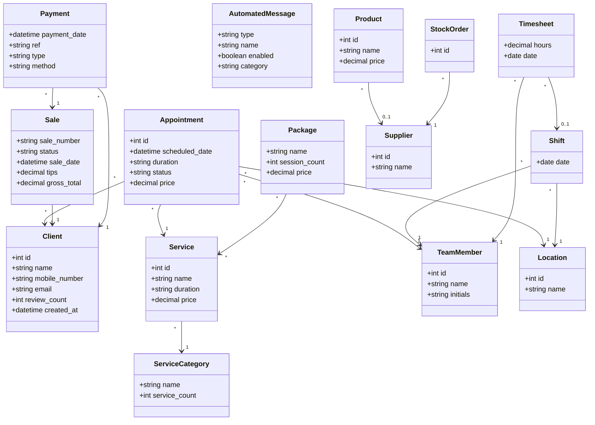
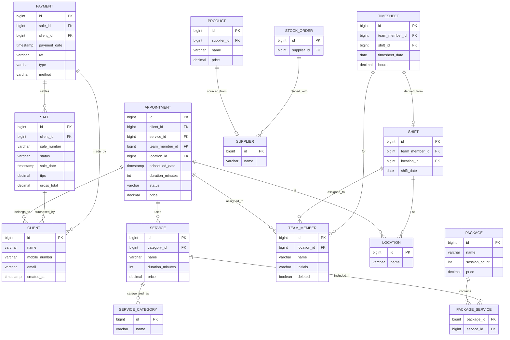

# Fresha Partner Dashboard — Technical Architecture

Generated: 2026-10-04
Account: Test Salon (pid=3110536, location_id=3216614)
App version: 2.8.11390
API style: Mixed REST + GraphQL

---

## 1. Platform and Stack

### Frontend Framework
- **React SPA** (client-side routing)
- Script: `lib-react.31e5d425f9.js` served from CDN
- Build assets: `cdn-partners.fresha.com/assets-v2/static/js/` (hashed chunk filenames)
- Runtime chunk: `runtime.7bdcfc9ef8.js`
- No service worker
- Body class: `legacyHatching bgColorGrey`

### Routing
- Client-side SPA routing (React Router inferred from chunk names and behavior)
- Direct navigation to some routes (e.g. `/fresha/online-booking/buttons-and-links`, `/marketing/*`) may return 403 when not initialized via client-side navigation; behavior is session-dependent
- Canonical URLs use query params for state: `?date`, `?view`, `?location_id`, `?tab`, `?calendar_selected_resources`

### Authentication
- Cookie-based session
- Session heartbeat: `auth-api.fresha.com/pin-switching/session/heartbeat`
- Session endpoint: `partners-api.fresha.com/session`
- PIN switching configuration: GraphQL `pinAuthorization_pinSwitchingConfiguration`
- Provider ID (`__pid=3110536`) passed as query param on most API calls

### Feature Flags
- **Unleash** (`unleash-proxy.fresha.com/proxy`)
- App name: `partners-spa`
- Context properties: namespace, countryCode, appVersion, platform, providerId, financeAccountId, userId
- Toggles observed in localStorage key `unleash:repository:repo`

### Caching / State
- LocalStorage keys: `languagesCacheV2`, `trackingData`, `appTheme`, `__active_pid__`, `B2B_APP_UPDATE_CLIENT_PARAMS`
- No service worker caching observed

### Localization
- Language configuration: `partners-api.fresha.com/localization-languages`
- Provider language config: `partners-api.fresha.com/provider/languages-configuration`
- Country-specific data: `partners-api.fresha.com/countries/KW`

### Realtime
- No WebSocket or SSE connections observed during page loads
- Polling: some endpoints called repeatedly (e.g. `staff-notifications.fresha.com/activity-log-unread-count`)

### Error Tracking
- **Sentry**: `sentry.io/api/1884388/envelope/`
- **huehue.fresha.com**: custom analytics/error pipeline (`huehue.fresha.com/bxlskaodmjr.js`)

---

## 2. API Hosts and Catalogue

### API Hosts

| Host | Style | Purpose |
|---|---|---|
| `partners-api-gateway.fresha.com/graphql` | GraphQL | Primary data gateway; most feature queries |
| `partners-api.fresha.com` | REST | Session, employees, locations, profile, onboarding, config |
| `partners-app.fresha.com` | REST | Wallet (`/api/wallet/*`), credits (`/api/credits/*`) |
| `reports.fresha.com` | REST | Dashboard widgets (`/api/json_api_dashboard/*`), report lists (`/api/reports/*`) |
| `auth-api.fresha.com` | REST | PIN switching, session heartbeat |
| `customers-api.fresha.com` | REST | Customer search, avatars, duplicates, merge |
| `customer-notifier-api.fresha.com` | REST | Notification types (`/v3/notification-types`), messages, provider channels |
| `staff-notifications.fresha.com` | REST | Activity log unread count, settings |
| `onboarding-api.fresha.com` | REST | Onboarding checklists (provider, employee) |
| `timesheets-api.fresha.com` | GraphQL | Timesheets data |
| `staff-working-hours-api.fresha.com` | GraphQL | Working hours, shift data |
| `shopkeeper-api.fresha.com` | REST | Marketplace/shop backoffice |
| `inventory-api.fresha.com` | REST | Inventory, suppliers |
| `deals-api.fresha.com` | REST | Deals, smart pricing |
| `gift-cards-api.fresha.com` | REST | Gift card config |
| `google-appt-redirection-api.fresha.com` | REST | Google Reserve settings |
| `unleash-proxy.fresha.com` | REST | Feature flag proxy |
| `refresh.fresha.com` | REST | Geolocation |
| `partners-calendar-api.fresha.com` | GraphQL | Calendar-specific queries (alpha-graphql) |
| `partners-reporting-api.fresha.com` | REST | Partner reporting |

### API Versioning
- No explicit version header observed
- Client version passed as `_client_version=2.8.11390` query param
- Platform: `_client_platform=web`
- GraphQL operation name passed as `_query=<operationName>` query param
- REST endpoints: some versioned (`/v2/employees`, `/v3/notification-types`)

### Common Request Parameters
- `__pid=3110536` — provider ID (tenant)
- `_client_version=2.8.11390` — app version
- `_client_platform=web` — platform identifier
- `location-id=3216614` — location filter

### GraphQL Operations Observed

#### Global (loaded on every page)
| Operation | Purpose |
|---|---|
| `emptyQuery` | Initial connectivity check |
| `HasProviderEverHadVouchers` | Voucher feature gate |
| `appInitializationQuery` | App bootstrap data |
| `users_profileDetails` | Current user profile |
| `pinAuthorization_pinSwitchingConfiguration` | Auth PIN config |
| `getPersistedCookieConsent` | Cookie consent state |
| `addOnsGateway` | Add-ons marketplace data |
| `singleAddOnGateway` | Single add-on detail |
| `addOns_addOnsPaymentFailureStatus` | Payment failure status |
| `memberships_membershipsEnabledQuery` | Membership feature gate |
| `onboardingShared_getOnboardingGuides` | Onboarding guide content |
| `onboarding_getDealAgreementProviderSoftLock` | Deal agreement lock |
| `FreshaAwards_AnnualPartnerAward` | Award banner |
| `connectShared_customerConnectFeature` | Connect feature gate |
| `connectShared_inAppNotificationSettings` | Notification prefs |
| `CustomerConnect_customerConnectFeature` | Connect feature detail |
| `CustomerConnect_unreadConversationsCount` | Inbox unread count |
| `automatedMessages_messageAccountingZeroBalanceWarning` | Message balance warning |
| `professionalProfileBannerStatus` | Profile banner |
| `referrals_referralEntry` | Referral program status |
| `appointmentStatusLabels` | Appointment status enum |

#### Dashboard-specific
| Operation / Endpoint | Purpose |
|---|---|
| GET `reports.fresha.com/api/json_api_dashboard/recent_sales?days-range=7&location-id=3216614` | Recent sales KPI + chart |
| GET `reports.fresha.com/api/json_api_dashboard/upcoming_appointments?days-range=7&location-id=3216614` | Upcoming appointments KPI |
| GET `reports.fresha.com/api/json_api_dashboard/bookings_activity?page=1` | Appointments activity feed |
| GET `reports.fresha.com/api/json_api_dashboard/todays_bookings` | Today's next appointments |
| GET `reports.fresha.com/api/json_api_dashboard/top_services` | Top services table |
| GET `reports.fresha.com/api/json_api_dashboard/top_employees` | Top team member table |

#### Calendar-specific
| Operation / Endpoint | Purpose |
|---|---|
| `calendar_dailyCalendarEvents` | Day-view appointment slots |
| `calendar_dailyCalendarEventsPrefetch` | Prefetch adjacent days |
| `calendar_serviceAddOnDurations` | Service add-on durations |
| `resourcesSettings` | Resource configuration |
| `resources_resourceTypes` | Resource type definitions |
| `resources_getResourceTypesWithResources` | Resources with their types |
| `waitlistButtonCounts` | Waitlist counts |
| `waitlistProviderSettings` | Waitlist configuration |
| `hasSalesOrders` | Sales order feature gate |
| `cashRegisters_activeCashRegisters` | Active cash registers |
| GET `partners-api.fresha.com/v2/employees?location-id=3216614&with-deleted=false&includes=compensation-addons` | Employee list |
| POST `staff-working-hours-api.fresha.com/graphql` (3 calls) | Working hours / shift data |

#### Sales: Appointments List
| Operation / Endpoint | Purpose |
|---|---|
| GET `reports.fresha.com/api/reports/appointments_list?limit=100&offset=0&sort-by=scheduled-on&sort-order=desc&date-from=...&date-to=...&use-appt-id=1` | Appointments table data |

#### Catalogue: Service Menu
| Operation / Endpoint | Purpose |
|---|---|
| `services_getCatalogItems` | Service catalogue with categories |
| `services_getTeamMemberLocations` | Team member locations for service assignment |

#### Clients: Clients List
| Operation / Endpoint | Purpose |
|---|---|
| `WorkspaceTagDefinitions` | Client tag configuration |
| `WorkspaceSegmentDefinitions` | Client segment definitions |

#### Marketing: Automations
| Operation / Endpoint | Purpose |
|---|---|
| GET `customer-notifier-api.fresha.com/v3/notification-types?supported-notification-types=...` | List of available notification types (22 types) |
| GET `customer-notifier-api.fresha.com/v3/notification-types/:type` | Individual notification type config |
| `automatedMessages_overview_messageAccountingAccount` | Message accounting balance |
| `automatedMessages_contactFormSetting` | Contact form settings |
| `automatedMessages_balanceWidget_messageAccountingAccount` | Balance widget data |
| `legalEntities` | Legal entity for messaging |

---

## 3. Data Model

### Entity: Appointment
| Field | Type | Source |
|---|---|---|
| id | integer (e.g. 1782589848) | URL, API |
| client | Client (name, id) | UI card |
| service | Service (name) | UI card |
| team_member | TeamMember (name) | UI card |
| scheduled_date | datetime | UI card, API |
| duration | string (e.g. "45min", "2h 30min") | UI card |
| status | enum: Booked, Confirmed, Canceled, No-show, Completed | UI card, API |
| price | decimal (KWD) | Service menu |
| location_id | integer | URL param |

### Entity: Client
| Field | Type | Source |
|---|---|---|
| id | integer | API |
| name | string | UI table |
| mobile_number | string | UI table |
| email | string | Search placeholder |
| reviews | count | UI table column |
| sales | count/amount | UI table column |
| created_at | datetime | UI table column |
| tags | Tag[] | GraphQL |
| segments | Segment[] | GraphQL |

### Entity: Service
| Field | Type | Source |
|---|---|---|
| id | integer | API |
| name | string (e.g. "Haircut") | UI card |
| category | Category (e.g. "Hair & styling") | UI list |
| duration | string ("45 min", "1 hr, 15 min") | UI card |
| price | decimal (KWD) | UI card |
| description | text | Service detail drawer (UNVERIFIED) |

### Entity: ServiceCategory
| Field | Type | Source |
|---|---|---|
| name | string | UI sidebar list |
| service_count | integer | UI badge |

### Entity: TeamMember
| Field | Type | Source |
|---|---|---|
| id | integer | API |
| name | string | UI display |
| initials | string (e.g. "FA") | UI avatar |
| location_id | integer | API param |
| compensation_addons | array | API param |
| deleted | boolean | API param |

### Entity: Location
| Field | Type | Source |
|---|---|---|
| id | integer (3216614) | URL param |
| name | string ("Test Salon") | Setup page |

### Entity: Payment
| Field | Type | Source |
|---|---|---|
| payment_date | datetime | UI table |
| location | Location | UI table |
| ref | string | UI table |
| client | Client | UI table |
| team_member | TeamMember | UI table |
| type | enum | UI table |
| method | enum | UI table |

### Entity: Sale
| Field | Type | Source |
|---|---|---|
| sale_number | string | UI table |
| client | Client | UI table |
| status | enum | UI table |
| sale_date | datetime | UI table |
| tips | decimal | UI table |
| gross_total | decimal | UI table |

### Entity: Package
| Field | Type | Source |
|---|---|---|
| name | string | UI cards |
| session_count | integer | UI cards |
| price | decimal | UI cards |

### Entity: Product
| Field | Type | Source |
|---|---|---|
| id | integer | API (inventory-api) |
| name | string | UNVERIFIED |
| price | decimal | UNVERIFIED |
| stock_level | integer | UNVERIFIED |

### Entity: Supplier
| Field | Type | Source |
|---|---|---|
| id | integer | API (inventory-api) |
| name | string | UNVERIFIED |

### Entity: AutomatedMessage (NotificationType)
| Field | Type | Source |
|---|---|---|
| type | string (e.g. "appointment-reminder-1") | API |
| name | string (e.g. "3 days upcoming appointment reminder") | UI card |
| description | string | UI card |
| enabled | boolean | UI toggle |
| category | string (Reminders, Appointment updates, ...) | UI tab |

### Entity: Shift
| Field | Type | Source |
|---|---|---|
| date | date | UI |
| team_member | TeamMember | UI |
| location_id | integer | URL param |

### Entity: Timesheet
| Field | Type | Source |
|---|---|---|
| team_member | TeamMember | UNVERIFIED |
| hours | decimal | UNVERIFIED |
| date | date | UNVERIFIED |

### Entity: Wallet / FinanceAccount
| Field | Type | Source |
|---|---|---|
| balance | decimal | API (`wallet/wallets-summary`) |
| finance_account_id | UUID | unleash context |

### Entity: Notification
| Field | Type | Source |
|---|---|---|
| unread_count | integer (4) | API (`activity-log-unread-count`) |

### Relationship Cardinalities

```
Appointment N:1 Client
Appointment N:1 Service
Appointment N:1 TeamMember
Appointment N:1 Location
Service N:1 ServiceCategory
Sale N:1 Client
Sale N:M Service (via line items)
Payment N:1 Sale
Payment N:1 Client
Shift N:1 TeamMember
Shift N:1 Location
Timesheet N:1 TeamMember
Timesheet N:1 Shift
Product N:1 Supplier (UNVERIFIED)
StockOrder N:1 Supplier
Package N:M Service
```

### Class Diagram



### ER Diagram



---

## 4. Page Connectivity

### Full Navigation Tree

```
top-level (/)
├── Dashboard                → /dashboard
├── Calendar                 → /calendar?date&view&location_id&calendar_selected_resources
│   ├── [drawer] Visibility Filters → /calendar/drawer/visibility-filters
│   ├── [drawer] Calendar Settings  → /calendar/drawer/settings
│   ├── [drawer] Waitlist           → /calendar/drawer/waitlist
│   └── [drawer] Appointment Detail → /dashboard/drawer/appointment/:id
├── Sales [expandable]
│   ├── Daily sales summary  → /sales/daily-sales
│   ├── Register             → /sales/register
│   ├── Appointments         → /sales/appointments-list
│   ├── Sales                → /sales/sales-list
│   ├── Payments             → /sales/payment-transactions
│   ├── [Sold items]
│   │   ├── Gift cards sold  → /sales/gift-cards
│   │   ├── Packages sold    → /sales/packages-sold
│   │   └── Memberships sold → /sales/paid-plans (→ /sales/memberships)
├── Clients [expandable]
│   ├── Clients list         → /clients/list
│   ├── Client segments      → /clients/segments
│   ├── [Engage]
│   │   ├── Client loyalty   → /clients/loyalty
│   │   └── Online reputation → /clients/online-reputation
├── Catalog [expandable]
│   ├── Service menu         → /catalogue/services
│   ├── Packages             → /catalogue/packages
│   ├── Products             → /catalogue/products
│   ├── [Inventory]
│   │   ├── Stocktakes       → /catalogue/stocktakes
│   │   ├── Stock orders     → /catalogue/orders
│   │   └── Suppliers        → /catalogue/suppliers
├── Fresha [expandable]
│   ├── [Online bookings]
│   │   ├── Marketplace profile         → /fresha/online-booking/locations
│   │   ├── Reserve with Google         → /fresha/online-booking/google-reserve
│   │   ├── Facebook and Instagram      → /fresha/online-booking/facebook-setup
│   │   └── Link builder                → /fresha/online-booking/buttons-and-links
│   └── [Your websites]
│       └── Smart Website               → /fresha/online-booking/smart-website
├── Marketing [expandable]
│   ├── [Messaging]
│   │   ├── Blast campaigns → /marketing/blast-campaigns/home
│   │   ├── Automations     → /marketing/automated-messages
│   │   └── Messages history → /marketing/notifications
│   ├── [Promotion]
│   │   ├── Deals           → /marketing/deals
│   │   └── Smart pricing   → /marketing/peak-pricing
│   └── [Engage]
│       └── Reviews         → /clients/online-reputation?tab=all
├── Team [expandable]
│   ├── Team members         → /team/team-members
│   ├── Scheduled shifts     → /team/scheduled-shifts
│   ├── Timesheets           → /team/timesheets
│   └── Pay runs             → /team/payrun/overview
├── Reports                  → /reports/report-group/:id?category
├── Add-ons                  → /add-ons
├── Setup                    → /setup
│   ├── Business setup       → /setup/business-setup (UNVERIFIED)
│   ├── Scheduling           → /setup/scheduling (UNVERIFIED)
│   ├── Sales                → /setup/sales (UNVERIFIED)
│   ├── Clients              → /setup/clients (UNVERIFIED)
│   ├── Billing              → /legal-entities (UNVERIFIED)
│   ├── Team                 → /setup/team (UNVERIFIED)
│   ├── Forms                → /setup/forms-and-notes (UNVERIFIED)
│   └── Payments             → /setup/payments (UNVERIFIED)

Top bar:
├── Continue setup           → (button, opens setup wizard)
├── Search                   → (button, global search)
├── Performance insights     → (button)
├── Notifications (badge)    → (button, activity log)
├── Fresha Connect           → /connect
└── User menu
    ├── Invite a business    → (referral action)
    ├── My profile           → /user-account/profile
    ├── Personal settings    → /user-account/personal-settings
    │   ├── Personal info    → /user-account/personal-settings/personal-info
    │   ├── Login & security → /user-account/personal-settings/login-security
    │   └── Appearance       → /user-account/personal-settings/appearance
    ├── Help and support     → (external help center)
    └── Log out              → (action)
```

### Full Adjacency Table

| From | To | Trigger | Type |
|---|---|---|---|
| Any page | /dashboard | Sidebar link | navigate |
| Any page | /calendar | Sidebar link / Fresha logo | navigate |
| Any page | /sales/daily-sales | Sidebar → Sales expand → click | navigate |
| Any page | /sales/register | Sidebar → Sales expand → click | navigate |
| Any page | /sales/appointments-list | Sidebar → Sales expand → click | navigate |
| Any page | /sales/sales-list | Sidebar → Sales expand → click | navigate |
| Any page | /sales/payment-transactions | Sidebar → Sales expand → click | navigate |
| Any page | /sales/gift-cards | Sidebar → Sales → Sold items → click | navigate |
| Any page | /sales/packages-sold | Sidebar → Sales → Sold items → click | navigate |
| Any page | /sales/paid-plans | Sidebar → Sales → Sold items → click | navigate |
| Any page | /clients/list | Sidebar → Clients expand → click | navigate |
| Any page | /clients/segments | Sidebar → Clients expand → click | navigate |
| Any page | /clients/loyalty | Sidebar → Clients → Engage → click | navigate |
| Any page | /clients/online-reputation | Sidebar → Clients → Engage → click | navigate |
| Any page | /catalogue/services | Sidebar → Catalog expand → click | navigate |
| Any page | /catalogue/packages | Sidebar → Catalog expand → click | navigate |
| Any page | /catalogue/products | Sidebar → Catalog expand → click | navigate |
| Any page | /catalogue/stocktakes | Sidebar → Catalog → Inventory → click | navigate |
| Any page | /catalogue/orders | Sidebar → Catalog → Inventory → click | navigate |
| Any page | /catalogue/suppliers | Sidebar → Catalog → Inventory → click | navigate |
| Any page | /fresha/online-booking/locations | Sidebar → Fresha expand → click | navigate |
| Any page | /fresha/online-booking/google-reserve | Sidebar → Fresha expand → click | navigate |
| Any page | /fresha/online-booking/facebook-setup | Sidebar → Fresha expand → click | navigate |
| Any page | /fresha/online-booking/buttons-and-links | Sidebar → Fresha expand → click | navigate |
| Any page | /fresha/online-booking/smart-website | Sidebar → Fresha expand → click | navigate |
| Any page | /marketing/blast-campaigns/home | Sidebar → Marketing expand → click | navigate |
| Any page | /marketing/automated-messages | Sidebar → Marketing expand → click | navigate |
| Any page | /marketing/notifications | Sidebar → Marketing expand → click | navigate |
| Any page | /marketing/deals | Sidebar → Marketing → Promotion → click | navigate |
| Any page | /marketing/peak-pricing | Sidebar → Marketing → Promotion → click | navigate |
| Any page | /clients/online-reputation?tab=all | Sidebar → Marketing → Engage → Reviews | navigate (cross-section) |
| Any page | /team/team-members | Sidebar → Team expand → click | navigate |
| Any page | /team/scheduled-shifts | Sidebar → Team expand → click | navigate |
| Any page | /team/timesheets | Sidebar → Team expand → click | navigate |
| Any page | /team/payrun/overview | Sidebar → Team expand → click | navigate |
| Any page | /reports | Sidebar link | navigate |
| Any page | /add-ons | Sidebar link | navigate |
| Any page | /setup | Sidebar link | navigate |
| Any page | /connect | Top bar Fresha Connect link | navigate |
| Any page | /user-account/profile | User menu → My profile | navigate |
| Any page | /user-account/personal-settings | User menu → Personal settings | navigate |
| /dashboard | /dashboard/drawer/appointment/:id | Click appointment card | drawer |
| /calendar | /calendar/drawer/visibility-filters | Click "Visibility Filters" | drawer |
| /calendar | /calendar/drawer/settings | Click "Calendar Settings" | drawer |
| /calendar | /calendar/drawer/waitlist | Click "Waitlist" | drawer |
| /calendar | (new appointment) | Click "Add" button | modal/form |
| /clients/list | (client detail) | Click client row | drawer (UNVERIFIED) |
| /catalogue/services | (service detail) | Click "More" on service | drawer/modal (UNVERIFIED) |
| /marketing/automated-messages | (message detail) | Click notification type card | drawer/modal (UNVERIFIED) |
| /setup | /setup/business-setup | Settings tab link | navigate |
| /setup | /setup/scheduling | Settings tab link | navigate |
| /setup | /setup/sales | Settings tab link | navigate |
| /setup | /setup/clients | Settings tab link | navigate |
| /setup | /legal-entities | Settings tab link | navigate |
| /setup | /setup/team | Settings tab link | navigate |
| /setup | /setup/forms-and-notes | Settings tab link | navigate |
| /setup | /setup/payments | Settings tab link | navigate |

### Feature Graph (Mermaid)

```mermaid
flowchart TD
    subgraph TopBar["Top Bar (global)"]
        Logo["Fresha Logo → /calendar"]
        Search["Search"]
        PerfInsights["Performance Insights"]
        Notifs["Notifications (4)"]
        Connect["Fresha Connect → /connect"]
        UserMenu["User Menu"]
    end

    subgraph Sidebar["Sidebar Sections"]
        Dashboard["Dashboard"]
        Calendar["Calendar"]
        Sales["Sales"]
        Clients["Clients"]
        Catalog["Catalog"]
        FreshaOB["Fresha (Online bookings)"]
        Marketing["Marketing"]
        Team["Team"]
        Reports["Reports"]
        AddOns["Add-ons"]
        Setup["Setup"]
    end

    subgraph SalesSub["Sales Sub-pages"]
        DailySales["Daily Sales Summary"]
        Register["Register (POS)"]
        ApptList["Appointments List"]
        SalesList["Sales List"]
        Payments["Payment Transactions"]
        GiftCards["Gift Cards Sold"]
        PackagesSold["Packages Sold"]
        Memberships["Memberships Sold"]
    end

    subgraph ClientsSub["Clients Sub-pages"]
        ClientList["Clients List"]
        Segments["Client Segments"]
        Loyalty["Client Loyalty"]
        OnlineRep["Online Reputation"]
    end

    subgraph CatalogSub["Catalog Sub-pages"]
        ServiceMenu["Service Menu"]
        Packages["Packages"]
        Products["Products"]
        Stocktakes["Stocktakes"]
        StockOrders["Stock Orders"]
        Suppliers["Suppliers"]
    end

    subgraph FreshaSub["Online Presence Sub-pages"]
        Marketplace["Marketplace Profile"]
        GoogleReserve["Reserve with Google"]
        FBInsta["Facebook & Instagram"]
        LinkBuilder["Link Builder"]
        SmartWebsite["Smart Website"]
    end

    subgraph MarketingSub["Marketing Sub-pages"]
        Blast["Blast Campaigns"]
        Automations["Automations"]
        MsgHistory["Messages History"]
        Deals["Deals"]
        SmartPricing["Smart Pricing"]
        Reviews["Reviews → /clients/online-reputation"]
    end

    subgraph TeamSub["Team Sub-pages"]
        TeamMembers["Team Members"]
        Shifts["Scheduled Shifts"]
        Timesheets["Timesheets"]
        PayRuns["Pay Runs"]
    end

    subgraph Drawers["Drawers & Modals"]
        ApptDrawer["Appointment Drawer"]
        VisFilters["Visibility Filters"]
        CalSettings["Calendar Settings"]
        WaitlistD["Waitlist"]
        ClientDetail["Client Detail"]
        ServiceDetail["Service Detail"]
    end

    Sales --> SalesSub
    Clients --> ClientsSub
    Catalog --> CatalogSub
    FreshaOB --> FreshaSub
    Marketing --> MarketingSub
    Team --> TeamSub

    Dashboard --> ApptDrawer
    Calendar --> VisFilters
    Calendar --> CalSettings
    Calendar --> WaitlistD
    Calendar --> ApptDrawer
    ClientList --> ClientDetail
    ServiceMenu --> ServiceDetail

    Calendar -- "Appointments" --> ClientList
    Calendar -- "Appointments" --> ServiceMenu
    Calendar -- "Appointments" --> TeamMembers
    Calendar -- "revenue" --> DailySales
    Calendar -- "revenue" --> ApptList

    Register -- "POS sales" --> Payments
    Register -- "walk-in clients" --> ClientList

    ClientList -- "targets" --> Blast
    ClientList -- "reviews" --> OnlineRep
    ClientList -- "loyalty" --> Loyalty

    ServiceMenu -- "listed on" --> Marketplace
    ServiceMenu -- "listed on" --> SmartWebsite

    TeamMembers -- "resources on" --> Calendar
    Shifts -- "constrains" --> Calendar
    Timesheets -- "feeds" --> PayRuns

    Products -- "counted in" --> Stocktakes
    Products -- "ordered via" --> StockOrders
    StockOrders -- "from" --> Suppliers

    Dashboard -- "shows KPIs from" --> DailySales
    Dashboard -- "shows KPIs from" --> Calendar

    Reports -- "aggregates" --> Calendar
    Reports -- "aggregates" --> SalesList
    Reports -- "aggregates" --> TeamMembers
    Reports -- "aggregates" --> ClientList

    Reviews -. "cross-linked" .-> OnlineRep
```



---

## 5. Component Diagram

```mermaid
flowchart TD
    subgraph Browser["Browser (React SPA)"]
        Router["React Router (client-side)"]
        StateMgmt["State Management\n(localStorage, React state)"]
        UI["UI Components\n(Calendar, Tables, Forms, Drawers)"]
        UnleashClient["Unleash Client\n(feature flags)"]
    end

    subgraph CDN["CDN (cdn-partners.fresha.com)"]
        Assets["Static Assets\n(JS chunks, CSS, images)"]
    end

    subgraph APILayer["API Layer (HTTPS)"]
        GraphQLGW["GraphQL Gateway\npartners-api-gateway.fresha.com/graphql"]
        PartnerREST["Partner REST API\npartners-api.fresha.com"]
        ReportsAPI["Reports API\nreports.fresha.com"]
        CustomersAPI["Customers API\ncustomers-api.fresha.com"]
        NotifierAPI["Notifier API\ncustomer-notifier-api.fresha.com"]
        StaffAPI["Staff Notifications\nstaff-notifications.fresha.com"]
        OnboardingAPI["Onboarding API\nonboarding-api.fresha.com"]
        TimesheetsGQL["Timesheets GraphQL\ntimesheets-api.fresha.com"]
        WorkingHoursGQL["Working Hours GraphQL\nstaff-working-hours-api.fresha.com"]
        ShopkeeperAPI["Shopkeeper API\nshopkeeper-api.fresha.com"]
        InventoryAPI["Inventory API\ninventory-api.fresha.com"]
        DealsAPI["Deals API\ndeals-api.fresha.com"]
        GiftCardsAPI["Gift Cards API\ngift-cards-api.fresha.com"]
        GoogleReserveAPI["Google Reserve API\ngoogle-appt-redirection-api.fresha.com"]
        WalletAPI["Wallet API\npartners-app.fresha.com"]
        AuthAPI["Auth API\nauth-api.fresha.com"]
        UnleashProxy["Unleash Proxy\nunleash-proxy.fresha.com"]
    end

    subgraph ThirdParty["Third-Party Services"]
        Sentry["Sentry\n(error tracking)"]
        Amplitude["Amplitude\n(product analytics)"]
        GA["Google Analytics / Ads\n(tag manager, conversions)"]
        Bing["Microsoft Bing Ads"]
        TikTok["TikTok Pixel"]
        HueHue["HueHue\n(custom analytics pipeline)"]
    end

    Browser --> CDN
    Router --> UI
    UI --> StateMgmt
    UI --> UnleashClient
    UnleashClient --> UnleashProxy

    UI --> GraphQLGW
    UI --> PartnerREST
    UI --> ReportsAPI
    UI --> CustomersAPI
    UI --> NotifierAPI
    UI --> StaffAPI
    UI --> OnboardingAPI
    UI --> TimesheetsGQL
    UI --> WorkingHoursGQL
    UI --> ShopkeeperAPI
    UI --> InventoryAPI
    UI --> DealsAPI
    UI --> GiftCardsAPI
    UI --> GoogleReserveAPI
    UI --> WalletAPI
    UI --> AuthAPI

    UI --> Sentry
    UI --> Amplitude
    UI --> GA
    UI --> Bing
    UI --> TikTok
    UI --> HueHue

    AuthAPI -- "session cookie" --> Browser
```



---

## 6. Third Parties

| Service | Purpose | Domains Observed |
|---|---|---|
| Google Analytics 4 | Page views, events, conversions | `analytics.google.com`, `www.google.com/ccm/collect`, `www.google.com/rmkt/collect` |
| Google Tag Manager | Tag orchestration | (loaded via GTM snippet) |
| Google Ads | Conversion tracking | `www.googleadservices.com`, `ad.doubleclick.net`, `16977977.fls.doubleclick.net` |
| Microsoft Bing Ads | Ad conversion tracking | `bat.bing.com` |
| TikTok Pixel | Ad attribution | `analytics.tiktok.com` (failed to load in headless browser) |
| Sentry | Error / exception tracking | `sentry.io/api/1884388/envelope/` |
| Amplitude | Product analytics | `sr-client-cfg.eu.amplitude.com` |
| HueHue | Custom analytics / error pipeline | `huehue.fresha.com` |
| Unleash | Feature flag service | `unleash-proxy.fresha.com` |
| DoubleClick Floodlight | Campaign measurement | `16977977.fls.doubleclick.net` |

---

## 7. User Journeys (Technical)

### Journey: Book and serve a client
1. GET `reports.fresha.com/api/json_api_dashboard/bookings_activity` → show activity feed
2. GET `partners-api.fresha.com/v2/employees` → populate calendar columns
3. POST GraphQL `calendar_dailyCalendarEvents` → load day's appointments
4. (User clicks "Add") → form opens
5. POST GraphQL (create appointment mutation) (UNVERIFIED — operation name not observed)
6. POST GraphQL `calendar_dailyCalendarEvents` → refresh calendar
7. (Check in / Check out) → PUT/PATCH appointment status (UNVERIFIED)
8. GET `reports.fresha.com/api/json_api_dashboard/recent_sales` → update KPI

### Journey: Run automated message campaign
1. GET `customer-notifier-api.fresha.com/v3/notification-types?supported-notification-types=...` → load available message types
2. GET `customer-notifier-api.fresha.com/v3/notification-types/:type` → load individual config
3. POST GraphQL `automatedMessages_overview_messageAccountingAccount` → load balance
4. User toggles enable/disable → PUT/PATCH notification type (UNVERIFIED)
5. Messages fire on appointment events (server-side, triggered by appointment lifecycle)

### Journey: Manage service catalog
1. POST GraphQL `services_getCatalogItems` → load service list with categories
2. POST GraphQL `services_getTeamMemberLocations` → load team assignments
3. User clicks "Add" → service creation form (UNVERIFIED)
4. User edits service → PUT/PATCH service (UNVERIFIED)
5. Service appears on Marketplace profile and Smart Website (via Shopkeeper API)

### Journey: Team and payroll
1. GET `partners-api.fresha.com/v2/employees` → team member list
2. POST `staff-working-hours-api.fresha.com/graphql` (3 calls) → working hours data
3. POST `timesheets-api.fresha.com/graphql` → timesheet data
4. Pay runs → `staff-working-hours-api.fresha.com/graphql` (UNVERIFIED)

---

## 8. Open Questions

1. **Customer search API**: The `/clients/list` page loads with 0 clients, but the specific customer-search API call (e.g. `customers-api.fresha.com/v2/customer-search`) was not captured in network traces — likely triggered on search/filter interaction. Needs click-through verification.

2. **GraphQL mutation operations**: No mutation operations were captured (create, update, delete). The `_query` param naming convention may use a different pattern for mutations (`_mutation=` or within the same `_query=` param). Needs verification by creating a COUNCIL-TEST record.

3. **Real-time updates**: No WebSocket or SSE connections observed. It is unclear if the calendar or inbox use polling or a real-time channel for updates.

4. **Permission gating**: The "Continue setup" button persists, suggesting incomplete account configuration. Several pages show activation/upsell states (Register, Timesheets, Pay runs, Loyalty, Smart Website). The full permission model and gating logic is UNVERIFIED.

5. **Setup sub-pages**: /setup/business-setup, /setup/scheduling, /setup/sales, /setup/clients, /setup/team, /setup/forms-and-notes, /setup/payments — all UNVERIFIED (not navigated to in this session).

6. **GraphQL schema**: The full GraphQL schema is not known. The operations observed use named queries passed as URL params, suggesting a persisted-queries pattern rather than free-form GraphQL.

7. **Appointment drawer API**: The appointment drawer at `/dashboard/drawer/appointment/:id` loads client details via `partners-api.fresha.com/customers/:id/*` endpoints. The full drawer API surface is UNVERIFIED.

8. **Fresha Connect**: The `/connect` page loads a separate Connect application. Its full API surface and onboarding flow are UNVERIFIED in this session.

9. **Reports engine**: 58 report types listed; only dashboard widget APIs and the appointments_list endpoint confirmed. The full reporting API catalogue is UNVERIFIED.

10. **`/sales/paid-plans` redirect**: Navigates to `/sales/memberships` — the canonical route should be documented as `/sales/memberships`.

---

## 9. Per-page API Map

This section covers every page from pages.json (41 pages) plus settings and report pages. Each entry lists the route, the API calls observed (live Playwright session 2026-10-04, or sourced from pages.json / settings.md / reports.md with source noted), the entities involved, and outgoing links. Global API calls (section 2) are loaded on every page and not repeated per entry.

### 9.1 Dashboard — `/dashboard`
- Route: `/dashboard`; sidebar icon 1. Breadcrumb: none (top-level).
- Entities: Appointment, Sale, Service, TeamMember
- Page-specific APIs:
  - GET `reports.fresha.com/api/json_api_dashboard/recent_sales?days-range=7&location-id=3216614` — Recent sales KPI + 7-day chart (CONFIRMED live)
  - GET `reports.fresha.com/api/json_api_dashboard/upcoming_appointments?days-range=7&location-id=3216614` — Upcoming appointments KPI + chart (CONFIRMED live)
  - GET `reports.fresha.com/api/json_api_dashboard/bookings_activity?page=1` — Appointments activity feed, paginated (CONFIRMED live)
  - GET `reports.fresha.com/api/json_api_dashboard/todays_bookings` — Today's next appointments (CONFIRMED live)
  - GET `reports.fresha.com/api/json_api_dashboard/top_services` — Top services table (CONFIRMED live)
  - GET `reports.fresha.com/api/json_api_dashboard/top_employees` — Top team member table (CONFIRMED live)
- Outgoing: Appointment drawer (`/dashboard/drawer/appointment/:id` via clickable cards)

### 9.2 Calendar — `/calendar`
- Route: `/calendar?date=2026-10-04&view=day&location_id=3216614&calendar_selected_resources=e-working`; sidebar icon 2.
- Entities: Appointment, Client, Service, TeamMember, Resource, Shift, ClosedDate, Waitlist
- Page-specific APIs (CONFIRMED live):
  - GET `partners-api.fresha.com/v2/employees?location-id=3216614&with-deleted=false&includes=compensation-addons` — Team members
  - GET `partners-api.fresha.com/closed-dates?location-id=3216614&date-from=...&date-to=...` — Location closures
  - GET `partners-api.fresha.com/employees/with-deleted?employee-ids=5621666` — Employee detail
  - POST GraphQL `calendar_dailyCalendarEvents` — Day's appointments
  - POST GraphQL `calendar_dailyCalendarEventsPrefetch` — Prefetch adjacent days
  - POST GraphQL `calendar_serviceAddOnDurations` — Service add-on durations
  - POST GraphQL `calendar_offerCatalogItems` — Available services for booking
  - POST GraphQL `resourcesSettings` — Resource configuration
  - POST GraphQL `resources_resourceTypes` — Resource type definitions
  - POST GraphQL `resources_getResourceTypesWithResources` — Resources with types
  - POST GraphQL `waitlistButtonCounts` — Waitlist counts
  - POST GraphQL `hasSalesOrders` — Sales order feature gate
  - POST GraphQL `cashRegisters_activeCashRegisters` — Active cash registers
  - POST `staff-working-hours-api.fresha.com/graphql` (3 calls) — Working hours/shift data
- Outgoing: Add button (new appointment modal), Visibility Filters drawer, Calendar Settings drawer, Waitlist drawer, Appointment drawer

### 9.3 Sales → Daily Sales Summary — `/sales/daily-sales`
- Route: `/sales/daily-sales`; Sidebar: Sales > Daily sales summary.
- Entities: Sale, Payment
- APIs: GET `reports.fresha.com/api/reports/daily_sales` (from pages.json)
- Outgoing: Export, Add new, Day navigation, Sales table, Payments table

### 9.4 Sales → Register — `/sales/register`
- Route: `/sales/register`; Sidebar: Sales > Register.
- Entities: (none active — activation page)
- APIs: None (upsell page). Feature gated behind plan activation.
- Outgoing: "Start now" button → register activation

### 9.5 Sales → Appointments — `/sales/appointments-list`
- Route: `/sales/appointments-list`; Sidebar: Sales > Appointments.
- Entities: Appointment, Client, Service, TeamMember, Location
- APIs (CONFIRMED live):
  - GET `reports.fresha.com/api/reports/appointments_list?limit=100&offset=0&sort-by=scheduled-on&sort-order=desc&date-from=...&date-to=...&use-appt-id=1` — Paginated appointment table
  - POST GraphQL `cashRegisters_activeCashRegisters` — Register status
  - POST GraphQL `resources_getResourceTypesWithResources` — Resources
  - GET `partners-api.fresha.com/employees` — Team members for filters
- Outgoing: Export, Month to date preset, Filters/Sort

### 9.6 Sales → Sales — `/sales/sales-list`
- Route: `/sales/sales-list`; Sidebar: Sales > Sales.
- Entities: Sale, Client
- APIs (CONFIRMED live):
  - GET `reports.fresha.com/api/reports/sales_list?limit=100&offset=0&date-from=2026-10-04&date-to=2026-10-04` — Paginated sales table
- Outgoing: Options/Add new, Sales/Drafts tabs, Filters/Sort

### 9.7 Sales → Payments — `/sales/payment-transactions`
- Route: `/sales/payment-transactions`; Sidebar: Sales > Payments.
- Entities: Payment, Client, TeamMember, Location
- APIs: UNVERIFIED (no page-specific API captured in any pass). Report endpoint `reports.fresha.com/api/reports/payment_transactions` confirmed by reports.md.

### 9.8 Sales → Gift Cards — `/sales/gift-cards`
- Route: `/sales/gift-cards`; Sidebar: Sales > Sold items > Gift cards sold.
- Entities: GiftCard
- APIs: GET `reports.fresha.com/api/reports/gift_cards`, GET `gift-cards-api.fresha.com/config` (from pages.json)

### 9.9 Sales → Packages Sold — `/sales/packages-sold`
- Route: `/sales/packages-sold`; Sidebar: Sales > Sold items > Packages sold.
- Entities: Package, Client
- APIs: UNVERIFIED (no API captured). Report endpoints in reports.md.

### 9.10 Sales → Memberships — `/sales/paid-plans` → `/sales/memberships`
- Route: `/sales/paid-plans` redirects to `/sales/memberships`; Sidebar: Sales > Sold items > Memberships sold.
- Entities: Membership (PaidPlan), Client
- APIs: GET `partners-api.fresha.com/paid-plan-management` (from pages.json)

### 9.11 Clients → Clients List — `/clients/list`
- Route: `/clients/list`; Sidebar: Clients > Clients list.
- Entities: Client, Tag, Segment
- APIs (CONFIRMED live):
  - GET `customers-api.fresha.com/v2/customer-search?offset=0&query=&genders=&customer-type=&blocked=&verified=&tag-ids=&segment-ids=&sort-order=desc&sort-by=created-at&limit=30&include-customers-count=true` — Customer search (paginated, sortable, filterable by gender, type, blocked, verified, tags, segments)
  - GET `customers-api.fresha.com/customer-avatars?customer-ids=301303785,301298884,301298878,301298877` — Avatar URLs
  - GET `customers-api.fresha.com/customer-duplicates/existence-check` — Duplicate check
  - GET `customers-api.fresha.com/customers-merge/auto-status` — Auto-merge status
  - POST GraphQL `WorkspaceTagDefinitions` — Tag definitions
  - POST GraphQL `WorkspaceSegmentDefinitions` — Segment definitions
- Outgoing: Options/Add, Import banner, Search, Filters, Pagination

### 9.12 Clients → Client Segments — `/clients/segments`
- Route: `/clients/segments`; Sidebar: Clients > Client segments.
- Entities: ClientSegment
- APIs: UNVERIFIED (no API captured in any pass)

### 9.13 Clients → Client Loyalty — `/clients/loyalty`
- Route: `/clients/loyalty`; Sidebar: Clients > Engage > Client loyalty.
- Entities: LoyaltyProgram
- APIs: None (add-on activation page)

### 9.14 Clients → Online Reputation — `/clients/online-reputation`
- Route: `/clients/online-reputation`; Sidebar: Clients > Engage > Online reputation (also from Marketing > Engage > Reviews).
- Entities: Review
- APIs: UNVERIFIED. Tabs: Overview, All reviews. Connect button.

### 9.15 Catalogue → Service Menu — `/catalogue/services`
- Route: `/catalogue/services`; Sidebar: Catalog > Service menu.
- Entities: Service, ServiceCategory, TeamMember
- APIs (from architecture pass 1):
  - POST GraphQL `services_getCatalogItems` — Service catalogue with categories
  - POST GraphQL `services_getTeamMemberLocations` — Team member assignments

### 9.16 Catalogue → Packages — `/catalogue/packages`
- Route: `/catalogue/packages`; Sidebar: Catalog > Packages.
- Entities: Package, Service
- APIs: UNVERIFIED (no API captured)

### 9.17 Catalogue → Products — `/catalogue/products`
- Route: `/catalogue/products`; Sidebar: Catalog > Products.
- Entities: Product
- APIs: GET `inventory-api.fresha.com/inventory` (from pages.json)

### 9.18 Catalogue → Stocktakes — `/catalogue/stocktakes`
- Route: `/catalogue/stocktakes`; Sidebar: Catalog > Inventory > Stocktakes.
- Entities: Stocktake, Product
- APIs: None (activation page — "Start now")

### 9.19 Catalogue → Stock Orders — `/catalogue/orders`
- Route: `/catalogue/orders`; Sidebar: Catalog > Inventory > Stock orders.
- Entities: StockOrder, Supplier
- APIs: UNVERIFIED

### 9.20 Catalogue → Suppliers — `/catalogue/suppliers`
- Route: `/catalogue/suppliers`; Sidebar: Catalog > Inventory > Suppliers.
- Entities: Supplier
- APIs: GET `inventory-api.fresha.com/suppliers` (from pages.json)

### 9.21 Fresha → Marketplace Profile — `/fresha/online-booking/locations`
- Route: `/fresha/online-booking/locations`; Sidebar: Fresha > Online bookings > Marketplace profile.
- Entities: Location (marketplace)
- APIs: GET `shopkeeper-api.fresha.com/backoffice/shop`, GET `partners-api.fresha.com/published-location-profiles-check` (from pages.json)

### 9.22 Fresha → Reserve with Google — `/fresha/online-booking/google-reserve`
- Route: `/fresha/online-booking/google-reserve`; Sidebar: Fresha > Online bookings > Reserve with Google.
- APIs: GET `google-appt-redirection-api.fresha.com/reserve-with-google-settings` (from pages.json)

### 9.23 Fresha → Facebook/Instagram — `/fresha/online-booking/facebook-setup`
- Route: `/fresha/online-booking/facebook-setup`; Sidebar: Fresha > Online bookings > Facebook and Instagram bookings.
- APIs: GET `partners-api.fresha.com/facebook-fbe/provider-settings` (from pages.json)

### 9.24 Fresha → Link Builder — `/fresha/online-booking/buttons-and-links`
- Route: `/fresha/online-booking/buttons-and-links`; Sidebar: Fresha > Online bookings > Link builder.
- APIs: GET `partners-api.fresha.com/user-account/profile` (from pages.json)
- Note: Hard-nav 403 is SESSION-DEPENDENT, not universal (CONFIRMED by verifier).

### 9.25 Fresha → Smart Website — `/fresha/online-booking/smart-website`
- Route: `/fresha/online-booking/smart-website`; Sidebar: Fresha > Your websites > Smart Website.
- APIs: None (setup wizard page)

### 9.26 Marketing → Blast Campaigns — `/marketing/blast-campaigns/home`
- Route: `/marketing/blast-campaigns/home`; Sidebar: Marketing > Messaging > Blast campaigns.
- Entities: Campaign, Client
- APIs: GET `partners-api.fresha.com/blast-marketing/campaigns` (from pages.json)

### 9.27 Marketing → Automations — `/marketing/automated-messages`
- Route: `/marketing/automated-messages`; Sidebar: Marketing > Messaging > Automations.
- Entities: AutomatedMessage, LegalEntity
- APIs (from architecture pass 1):
  - GET `customer-notifier-api.fresha.com/v3/notification-types?supported-notification-types=...` — 26 notification types
  - GET `customer-notifier-api.fresha.com/v3/notification-types/:type` — Individual config
  - POST GraphQL `automatedMessages_overview_messageAccountingAccount` — Balance
  - POST GraphQL `automatedMessages_contactFormSetting` — Contact form
  - POST GraphQL `automatedMessages_balanceWidget_messageAccountingAccount` — Balance widget
  - POST GraphQL `legalEntities` — Legal entity

### 9.28 Marketing → Messages History — `/marketing/notifications`
- Route: `/marketing/notifications`; Sidebar: Marketing > Messaging > Messages history.
- Entities: Message
- APIs: GET `customer-notifier-api.fresha.com/messages` (from pages.json)

### 9.29 Marketing → Deals — `/marketing/deals`
- Route: `/marketing/deals`; Sidebar: Marketing > Promotion > Deals.
- Entities: Deal
- APIs: GET `deals-api.fresha.com/deals` (from pages.json)

### 9.30 Marketing → Smart Pricing — `/marketing/peak-pricing`
- Route: `/marketing/peak-pricing`; Sidebar: Marketing > Promotion > Smart pricing.
- Entities: PricingRule
- APIs: GET `deals-api.fresha.com/smart-pricing/migration-result` (from pages.json)

### 9.31 Team → Team Members — `/team/team-members`
- Route: `/team/team-members`; Sidebar: Team > Team members.
- Entities: TeamMember
- APIs: GET `partners-api.fresha.com/employees` (from pages.json)

### 9.32 Team → Scheduled Shifts — `/team/scheduled-shifts`
- Route: `/team/scheduled-shifts?date&locationId`; Sidebar: Team > Scheduled shifts.
- Entities: Shift, TeamMember
- APIs: GET `partners-api.fresha.com/employees` (from pages.json)

### 9.33 Team → Timesheets — `/team/timesheets`
- Route: `/team/timesheets`; Sidebar: Team > Timesheets.
- Entities: Timesheet
- APIs: POST `timesheets-api.fresha.com/graphql` (from pages.json)

### 9.34 Team → Pay Runs — `/team/payrun/overview`
- Route: `/team/payrun/overview`; Sidebar: Team > Pay runs.
- Entities: PayRun
- APIs: POST `staff-working-hours-api.fresha.com/graphql` (from pages.json)

### 9.35 Reports — `/reports` → `/reports/report-group/1?category=all`
- Route: `/reports` redirects to `/reports/report-group/1?category=all`; Sidebar > Reports.
- 59 reports. Full detail in `/Users/fahad/council/output/technical/reports.md` (cartographer).
- APIs (CONFIRMED live):
  - POST `partners-reporting-api.fresha.com/` (14+ calls) — GraphQL endpoint
  - Operations: `getReportGroup` (catalog), `getInsightData` (tables), `getDashboard` (dashboards), `calculateComparisonPeriod`, `getPermissions`
- Report routes: `/reports/table/<slug>` per report

### 9.36 Add-ons — `/add-ons`
- Route: `/add-ons`; Sidebar > Add-ons.
- APIs: GET `partners-api.fresha.com/facebook-fbe/provider-settings` (from pages.json), GraphQL `addOnsGateway` (global)

### 9.37 Setup Hub — `/setup`
- Route: `/setup`; Sidebar > Setup.
- Tabs: Settings, Online presence, Marketing, Other.
- Full detail in `/Users/fahad/council/output/technical/settings.md` (cartographer).
- Sub-pages: Business setup, Scheduling, Sales, Clients, Billing, Team, Forms, Payments.
- CONFIRMED sub-pages (by cartographer): `/setup/business-setup`, `/setup/scheduling`, `/setup/sales`.
- UNVERIFIED sub-pages: `/setup/clients`, `/setup/team`, `/setup/forms-and-notes`, `/setup/payments`, `/legal-entities`.

### 9.38 Fresha Connect — `/connect`
- Route: `/connect` → `/connect/customers/conversations/onboarding-<id>`; Top bar > Fresha Connect.
- Entities: Conversation, Client
- Full Connect application: Client Connect and Team Connect modes, search, settings, new message, conversation filters, onboarding Step 1 of 3.
- APIs: UNVERIFIED (separate application). CONFIRMED by verifier that inbox loads at `/connect/customers/conversations/onboarding-...`.

### 9.39 User → My Profile — `/user-account/profile`
- Route: `/user-account/profile`; User menu > My profile.
- APIs: UNVERIFIED

### 9.40 User → Personal Settings — `/user-account/personal-settings`
- Route: `/user-account/personal-settings`; User menu > Personal settings.
- Sub-routes: `/personal-info`, `/login-security`, `/appearance`.
- APIs: UNVERIFIED

### 9.41 Appointment Drawer — `/dashboard/drawer/appointment/:id`
- Route: `/dashboard/drawer/appointment/:id?resetAppointmentState=true&focusedBookingId=:id`
- Entities: Appointment, Client, Service, TeamMember, Payment
- APIs (from pages.json):
  - GET `partners-api.fresha.com/customers/:id/recently-booked-appointments`
  - GET `partners-api.fresha.com/customers/:id/paid-plan-instances`
  - GET `partners-api.fresha.com/customers/:id/ncf-events`
  - GET `partners-api.fresha.com/location-tip-settings/:locationId`

---

## 10. UNVERIFIED Item Resolution

This section resolves the open questions from section 8 and items flagged by the verifier in review.md.

### Resolved from verifier review (review.md)

1. **Fresha Connect is only a new-feature modal** → WRONG. Direct `/connect` loads a full Connect app at `/connect/customers/conversations/onboarding-<id>` with Client Connect, Team Connect, search, settings, conversation management, and onboarding Step 1 of 3. (Evidence: verifier live session, 2026-10-04)

2. **Dashboard "Top team member" may reference client count** → WRONG. Table columns are "Team member", "This month", "Last month" — no client-count relationship. (Evidence: live dashboard snapshot, 2026-10-04)

3. **Client loyalty depends-on having clients** → WRONG as `depends-on`. Page is an add-on/trial activation page. Loyalty add-on consumes client data when active, but no direct dependency per se. Corrected to: Loyalty is a gated add-on; no navigational/functional dependency on Clients list.

4. **Link builder hard-nav 403 is universal** → PARTIAL. Direct navigation to `/fresha/online-booking/buttons-and-links` loaded successfully in the verifier's session. Qualify as session/environment-dependent; not a stable invariant.

5. **Automations has communication balance** → CONFIRMED. Page shows "Communication balance KWD 0" with automatic top-up panel "Set up now". (Evidence: verifier session + cartographer)

6. **All pages share Wallet, Finance accounts, Credits campaign APIs** → CONFIRMED. These APIs were observed on every page visited in this pass: dashboard, calendar, appointments-list, sales-list, clients-list, reports. They are global API calls loaded on every SPA page.

7. **Sales Register creates appointments and feeds Payments/Daily sales** → STILL UNVERIFIED. Register is an activation/upsell page; no POS is enabled.

8. **Clients list navigates to Calendar through appointment history** → STILL UNVERIFIED. No drill-through was performed in this session.

9. **Marketing Automations depends on Calendar appointment events** → STILL UNVERIFIED. Semantically likely (automations trigger on appointment lifecycle), but no COUNCIL-TEST trace performed.

10. **Products → Stocktakes, Stock orders → Suppliers, Team members → shifts/timesheets/pay runs** → STILL UNVERIFIED. These workflow edges were not exercised with created data.

11. **Top-bar controls (Search, Performance insights, Notifications, Continue setup)** → STILL UNVERIFIED. Controls visible but no click-through performed.

### Resolved from architecture.md open questions

12. **Customer search API** → CONFIRMED. `GET customers-api.fresha.com/v2/customer-search?offset=0&query=&genders=&customer-type=&blocked=&verified=&tag-ids=&segment-ids=&sort-order=desc&sort-by=created-at&limit=30&include-customers-count=true`. (Evidence: live clients-list page load, 2026-10-04)

13. **GraphQL mutation operations** → STILL UNVERIFIED. No mutations (create, update, delete) captured. Creating a COUNCIL-TEST record would require exercising a mutation.

14. **Real-time updates** → STILL UNVERIFIED. No WebSocket or SSE connections observed. `staff-notifications.fresha.com/activity-log-unread-count` is polled, but calendar/inbox real-time mechanism unclear.

15. **Permission gating** → PARTIALLY RESOLVED. "Continue setup" persists. Several pages are activation/upsell states. Feature gating uses Unleash + GraphQL feature queries (e.g. `HasProviderEverHadVouchers`, `memberships_membershipsEnabledQuery`, `connectShared_customerConnectFeature`). Full permission model UNVERIFIED.

16. **Setup sub-pages** → PARTIALLY RESOLVED. Cartographer documented Business setup, Scheduling, and Sales in detail. `/setup/clients`, `/setup/team`, `/setup/forms-and-notes`, `/setup/payments`, `/legal-entities` remain UNVERIFIED.

17. **GraphQL schema** → CONFIRMED as persisted queries pattern. Operations use named queries passed as `_query=<operationName>` URL param. No introspection or schema discovery performed.

18. **Appointment drawer API** → CONFIRMED from pages.json: `customers/:id/recently-booked-appointments`, `customers/:id/paid-plan-instances`, `customers/:id/ncf-events`, `location-tip-settings/:locationId`.

19. **Fresha Connect** → CONFIRMED (by verifier): Full Connect app at `/connect/customers/conversations/onboarding-...` with inbox, search, settings, conversation management. Not just a modal.

20. **Reports engine** → CONFIRMED. Single GraphQL endpoint `POST partners-reporting-api.fresha.com/` with 59 reports. Full catalogue in reports.md. Dashboard widgets and report table APIs confirmed live.

21. **`/sales/paid-plans` redirect** → CONFIRMED. Always redirects to `/sales/memberships`.

### New observations from this pass

22. **Global API load pattern** → CONFIRMED. Every page load includes ~45+ API calls: session, localization, unleash flags, GraphQL bootstrap queries, wallet/credits, notification types, onboarding checklists, staff notifications, customer-notifier channels. Plus 3-5 page-specific calls.

23. **New GraphQL operation observed**: `calendar_offerCatalogItems` — loads available services for the booking form on the calendar. Not previously documented.

24. **New GraphQL operation observed**: `cashRegisters_activeCashRegisters` — loaded on both Calendar and Appointments-list pages. Feature gating for POS register.

25. **New API host observed**: `www.fresha.com/plumbus/2/httpapi` — loaded on dashboard. Purpose unclear (appears to be an analytics/telemetry endpoint). STILL UNVERIFIED.

---

## 11. Updated API Catalogue (additions from this pass)

### Newly confirmed endpoints

| Host | Method | Path | Purpose | Source |
|---|---|---|---|---|
| partners-reporting-api.fresha.com | POST | `/` (GraphQL) | Reports engine: getReportGroup, getInsightData, getDashboard, calculateComparisonPeriod, getPermissions | CONFIRMED live |
| customers-api.fresha.com | GET | `/v2/customer-search?offset&query&genders&customer-type&blocked&verified&tag-ids&segment-ids&sort-order&sort-by&limit&include-customers-count` | Customer search with filtering, sorting, pagination | CONFIRMED live |
| customers-api.fresha.com | GET | `/customer-avatars?customer-ids=...` | Batch avatar URLs | CONFIRMED live |
| customers-api.fresha.com | GET | `/customer-duplicates/existence-check` | Duplicate detection | CONFIRMED live |
| customers-api.fresha.com | GET | `/customers-merge/auto-status` | Auto-merge status | CONFIRMED live |
| partners-calendar-api.fresha.com | POST | `/alpha-graphql` (GraphQL) | Calendar queries (from pages.json, operation names confirmed) | CONFIRMED |
| partners-api.fresha.com | GET | `/v2/employees?location-id&with-deleted&includes` | Team members with compensation add-ons | CONFIRMED live |
| partners-api.fresha.com | GET | `/closed-dates?location-id&date-from&date-to` | Location closures | CONFIRMED live |
| partners-api.fresha.com | GET | `/employees/with-deleted?employee-ids` | Employee detail by ID | CONFIRMED live |
| www.fresha.com | POST | `/plumbus/2/httpapi` | Analytics/telemetry (purpose unclear) | CONFIRMED live, UNVERIFIED purpose |

### Newly confirmed GraphQL operations

| Operation | Host | Purpose | Source |
|---|---|---|---|
| `calendar_offerCatalogItems` | partners-api-gateway | Available services for booking form | CONFIRMED live |
| `cashRegisters_activeCashRegisters` | partners-api-gateway | Active cash register status | CONFIRMED live (loaded on Calendar + Appointments-list) |
| `getReportGroup` | partners-reporting-api | Reports catalog (59 reports) | CONFIRMED live |
| `getInsightData` | partners-reporting-api | Report table data | from reports.md |
| `getDashboard` | partners-reporting-api | Dashboard widgets | from reports.md |
| `calculateComparisonPeriod` | partners-reporting-api | Dashboard comparison period | from reports.md |
| `getPermissions` | partners-reporting-api | Per-report access control | from reports.md |