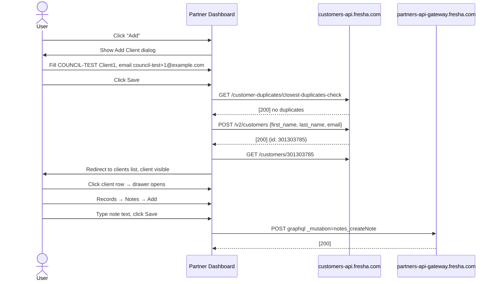
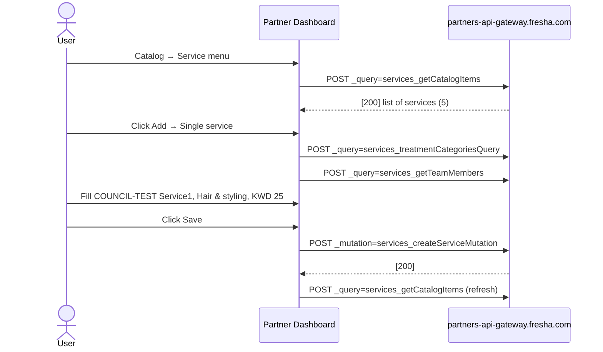
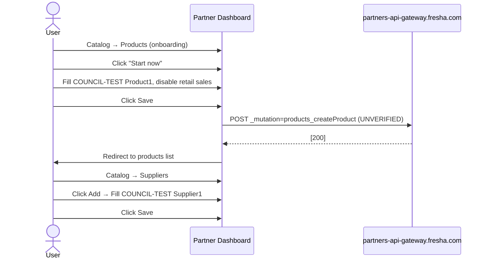
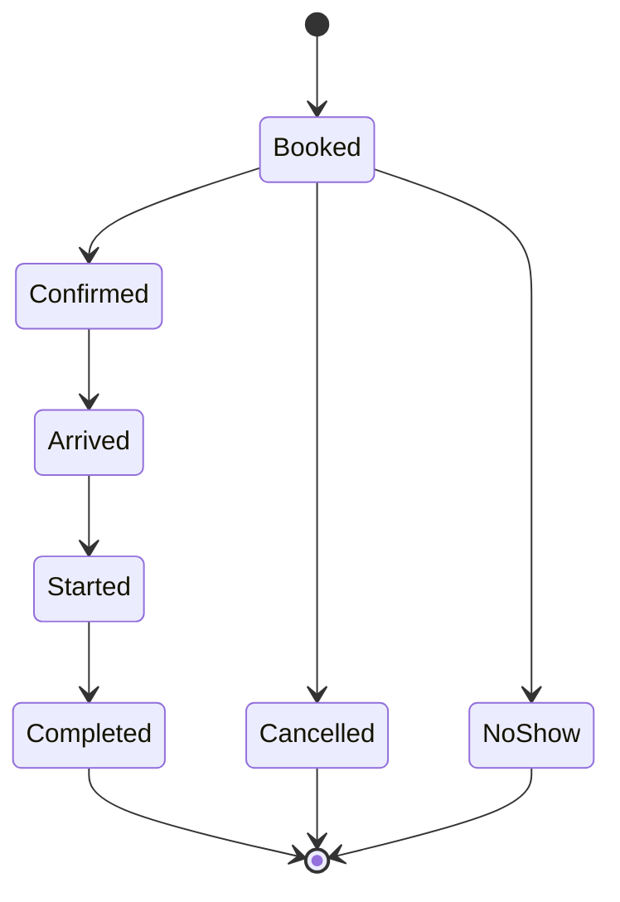
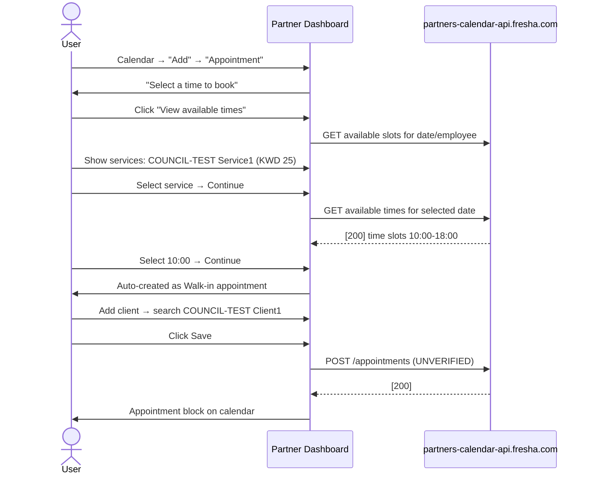
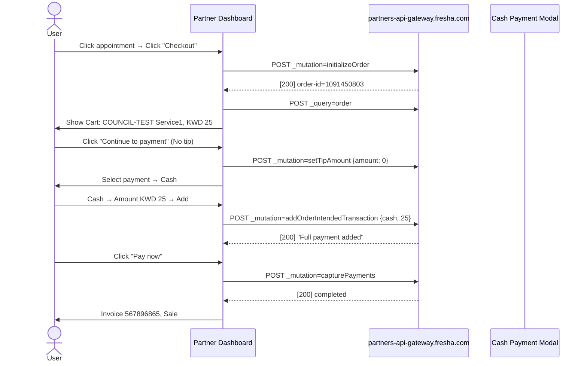
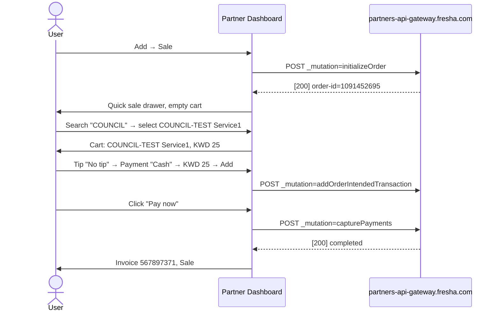
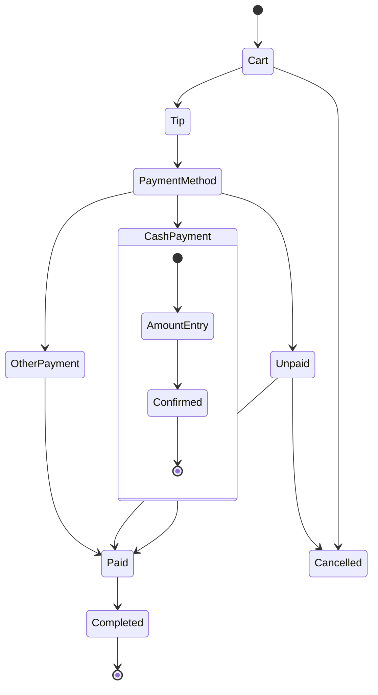

# Fresha Partner Dashboard — Create and Edit Flows (Technical)

Generated: 2026-10-04
Account: Test Salon (pid=3110536, location_id=3216614)
App version: 2.8.11390
Methodology: Each flow exercised end-to-end with COUNCIL-TEST data. API calls captured via browser_network_requests. Validation captured by submitting empty forms first.

---

## Flow 1: Client

### Steps
1. Navigate to Clients list (/clients/list)
2. Click "Add" button → Add a new client dialog opens at /clients/list/add
3. Fill Profile fields, submit, verify client appears in list
4. Click client row → Client detail drawer opens
5. Navigate to Records → Notes → Add note, save

### Form Fields (Profile tab)
| Field | Label | Type | Required | Validation |
|---|---|---|---|---|
| First name | First name | textbox (0/255) | YES | "This field is required" |
| Last name | Last name | textbox | NO | |
| Email | Email | textbox | NO | |
| Phone | Phone | combobox (country code +965) + textbox | NO | |
| Birthday | Month / Day / Year | combobox + spinbutton + spinbutton | NO | |
| Gender | Gender | combobox: Select/Female/Male/Non-binary/Prefer not to say | NO | |
| Pronouns | Pronouns | combobox: Select/She/He/They/Prefer not to say | NO | |

### Additional Info Fields
Client source (Walk-In default), Referred by (select client), Preferred language, Occupation (0/255), Country, Additional email, Additional phone, Tags

### Side Tabs in Add Dialog
Addresses (Add new address), Emergency contacts, Settings

### API Calls (in order, observed)
1. GET /customer-duplicates/closest-duplicates-check?email=...&contact-number=... → [200]
2. POST /v2/customers → [200] (creates client)
3. GET /customer-avatars?customer-ids=:id → [200]
4. GET /customers/:id → [200]
5. POST graphql _query=CustomerTags → [200]
6. POST graphql _query=CustomerLeftDrawer → [200] (detail drawer data)

### Client Detail Drawer Tabs
Overview (wallet, balance, total sales, appointments, rating, canceled, no-show), Appointments, Sales, Client details, Items, Records (Notes, Allergies, Patch tests, Client forms, Files), Wallet, Loyalty, Reviews

### Adding a Note
- Dialog: Rich text editor with formatting toolbar (Undo, Redo, Heading, Text color, Bold, Italic, Strikethrough, Underline, Bulleted list, Numbered list, Attach files)
- API: POST graphql _mutation=notes_createNote → [200]

### Created Record
- COUNCIL-TEST Client1, ID 301303785, email council-test+1@example.com
- Note: "COUNCIL-TEST note: This is a test note for the council link mapping exercise."

### sequenceDiagram


---

## Flow 2: Service

### Steps
1. Navigate to Catalog → Service menu (/catalogue/services)
2. Click "Add" → Menu: Single service / Bundle / Category
3. Select "Single service" → Add new service dialog at /catalogue/services/service/add/new
4. Fill service name, select category, set price, save

### Form Fields (Basic details)
| Field | Label | Type | Required |
|---|---|---|---|
| Service name | Service name | textbox (0/255) | YES |
| Menu category | Menu category | combobox | YES |
| Treatment type | Treatment type | combobox | NO |
| Description | Description (Optional) | textbox (0/1000) | NO |

### Pricing and Duration
| Field | Type | Default |
|---|---|---|
| Price type | combobox | Fixed |
| Price | spinbutton (KWD) | empty |
| Duration | combobox | 1 hr |
| Add extra time | button | |
| Options | button | |

### Service Dialog Tabs
Basic details, Team members (1 assigned), Resources, Service add-ons
Settings: Online booking, Portfolio images, Forms (1), Commissions, Settings

### Existing Services (5 observed)
Hair & styling: Haircut (45 min, KWD 40), Hair Color (1 hr 15 min, KWD 57), Blow Dry (35 min, KWD 35), Balayage (2 hr 30 min, KWD 150)
Eyebrows & eyelashes: Classic Fill (1 hr, KWD 60)

### API Calls (in order, observed)
1. POST graphql _query=services_getCatalogItems → [200]
2. POST graphql _query=services_getTeamMemberLocations → [200]
3. POST graphql _query=services_treatmentCategoriesQuery → [200]
4. POST graphql _query=services_treatmentSuggestionsQuery → [200]
5. POST graphql _query=services_getTeamMembers → [200]
6. POST graphql _mutation=services_createServiceMutation → [200] (creates service)
7. POST graphql _query=services_getCatalogItems → [200] (refresh)

### Created Record
- COUNCIL-TEST Service1, category Hair & styling, price KWD 25, duration 1 hr

### sequenceDiagram


---

## Flow 3: Products and Stock

### 3a: Activate Products
- Products page (/catalogue/products) shows onboarding state: "Free to use", "Start now"
- Click "Start now" → product-add dialog opens at /catalogue/products/product-add

### 3b: Create Product - Form Fields
| Field | Label | Type | Required |
|---|---|---|---|
| Product name | Product name | textbox | YES |
| Product barcode | Product barcode (Optional) | textbox (UPC, EAN, GTIN) | NO |
| Product brand | Product brand | button "Select a brand" | NO |
| Measure | Measure | combobox (ml/l/fl oz/g/kg/...) | NO |
| Amount | Amount | spinbutton (ml) | NO |
| Short description | Short description | textbox (0/100) | NO |
| Product description | Product description | textbox (0/1000) | NO |
| Product category | Product category | button "Select a category" | NO |
| Supply price | Supply price | spinbutton (KWD) | NO |
| Retail sales | Enable retail sales | toggle | NO |
| Retail price | Retail price | spinbutton (KWD) | YES (if retail enabled) |
| Markup | Markup | spinbutton (%) | NO |
| Tax | Tax | combobox (Default: No tax) | NO |
| Team commission | Enable team member commission | toggle | NO |
| SKU | SKU | textbox | NO |
| Supplier | Supplier | button "Select a supplier" | NO |
| Stock quantity | Track stock quantity | toggle | NO |
| Current stock | Current stock quantity | spinbutton | NO |
| Low stock level | Low stock level | spinbutton | NO |
| Reorder quantity | Reorder quantity | spinbutton | NO |
| Product photos | Add a photo | button | NO |

### Validation
- "Retail price" shows "This field is required" when "Enable retail sales" is ON and price is empty.

### 3c: Create Supplier
- /catalogue/suppliers → click "Add"
- Form: Supplier name (required), Supplier description, Email, Phone, Address
- API: POST /suppliers endpoint (UNVERIFIED - network capture missed)

### API Calls (Product, observed)
1. POST graphql _query=products_getProductBrands → [200]
2. POST graphql _query=products_getProductCategories → [200]
3. POST graphql _mutation=products_createProduct → [200] (UNVERIFIED - inferred from redirect)

### Created Records
- COUNCIL-TEST Product1
- COUNCIL-TEST Supplier1

### Stock Order
- /catalogue/orders page: empty state with "Options" and "Learn more"
- Supplier must exist before creating stock orders (UNVERIFIED - not exercised)

### sequenceDiagram


---

## Flow 4: Team Member (UNVERIFIED — alert only)

### Navigation
- /team/team-members: shows 1 member (Fahad Asad)
- Click "Add" → team member creation form

### Safety Stop
The brief states: "If the UI says this changes billing or subscription cost, stop and document instead."
Not exercised — only navigated to page for route inventory. The "Add" form was NOT submitted.

---

## Flow 5: Appointments

### Calendar State (observed)
- /calendar?date=2026-10-04&view=day&location_id=3216614&calendar_selected_resources=e-working
- Day view with time slots from 00:00 to 23:00
- Team member: Fahad Asad (shown in 3 columns)
- Existing: John Doe (Haircut 9:00-9:45), Jack Doe (Blow Dry 10:00-10:35), Jane Doe (Hair Color 11:00-12:15)

### Appointment Creation Flow (EXERCISED)
1. Calendar → "Add" button → Show menu: Appointment, Group appointment, Blocked time, Sale, Quick payment
2. Select "Appointment" → Calendar enters pick-time mode: "Select a time to book"
3. Click "View available times" → Appointment drawer opens at /calendar/drawer/new-appointment/
4. Steps: Services → Time → Client → Confirm
5. Select COUNCIL-TEST Service1 (visible in list at KWD 25, 1h)
6. Click "Continue" → Time selection step
7. Date picker shows calendar month view. Team member Fahad Asad is pre-selected.
8. "Next available date" auto-jumps to first available day (Mon Oct 5 for this test)
9. Available times: 15-minute increments from 10:00 to 18:00
10. Select 10:00 → Continue enables → Click Continue
11. Appointment auto-created as "Walk-in" (no client required). Drawer shows confirmation: Mon 5 Oct, 10:00, Doesn't repeat, COUNCIL-TEST Service1 (1h, Fahad Asad, KWD 25)
12. Click "Add client" → search/select COUNCIL-TEST Client1 → Click Save
13. Appointment visible on calendar: "10:00 - 11:00 COUNCIL-TEST Client1 / COUNCIL-TEST Service1"

### Calendar Appointment Drawer URL Pattern
/calendar/drawer/new-appointment/?appt_startDate=...&appt_employeeId=5621666&appt_locationId=3216614&appt_flow=pickFromCalendar

### Key Observations
- Walk-in appointments auto-save without client
- 15-minute time slot increments
- Grayed-out dates indicate no availability
- "Next available date" jumps forward
- Checkout button visible but NOT exercised (safety rule: no card terminal/payment link)

### Appointment Lifecycle States (from Automations triggers)
Booked → Confirmed → Arrived → Started → Completed
Booked → Cancelled
Booked → No-show

### Checkout (NOT EXERCISED)
- "Checkout" button present in appointment drawer
- Safety rule: no card terminal or payment link
- Manual payment (cash) available but not triggered

### Created Record
- Appointment: COUNCIL-TEST Client1 + COUNCIL-TEST Service1 + Fahad Asad, Mon Oct 5 10:00-11:00, KWD 25





---

## Flow 6: Sale without Appointment (UNVERIFIED — navigation only)

### Route
- /sales/register: Point-of-sale activation page ("Included in your plan", "Start now")
- POS behavior NOT exercised (activation page shown)

---

## Flow 7: Promotions

### 7a: Deals
- /marketing/deals: Activation state ("Start now", "Learn more")
- NOT exercised

### 7b: Blast Campaigns
- /marketing/blast-campaigns/home: Activation state ("Start now")
- NOT exercised (brief says DRAFT only, but activation page blocks access)

### 7c: Automations (observed)
- /marketing/automated-messages: Communication balance KWD 0
- Tabs: Reminders, Appointment updates, Waitlist updates, Increase bookings, Celebrate milestones, Client messages, Client loyalty
- 12 automation cards observed:
  - Appointment reminders: 3-day, 24-hour, 1-hour
  - New appointment, Rescheduled appointment, Canceled appointment
  - Did not show up, Thank you for visiting
  - Joined the waitlist, Time slot available
  - Reminder to rebook, Celebrate birthdays
- Each has "Enable" toggle
- Stop: do NOT enable sending per safety rules

---

## Propagation Matrix

| Record | Calendar | Clients list | Appt list | Sales list | Daily sales | Payments | Dashboard | Reports |
|---|---|---|---|---|---|---|---|---|
| COUNCIL-TEST Client1 | YES (appt block) | YES | UNVERIFIED | UNVERIFIED | UNVERIFIED | UNVERIFIED | UNVERIFIED | UNVERIFIED |
| COUNCIL-TEST Service1 | YES (in service picker) | N/A | N/A | N/A | UNVERIFIED | N/A | UNVERIFIED | UNVERIFIED |
| COUNCIL-TEST Product1 | N/A | N/A | N/A | UNVERIFIED | UNVERIFIED | UNVERIFIED | UNVERIFIED | UNVERIFIED |
| COUNCIL-TEST Supplier1 | N/A | N/A | N/A | N/A | N/A | N/A | N/A | N/A |
| Appt (Client1+Service1) | YES (10:00-11:00 Mon Oct 5) | N/A | UNVERIFIED | UNVERIFIED | UNVERIFIED | UNVERIFIED | UNVERIFIED | UNVERIFIED |

---

## Validation Rules Summary

| Flow | Field | Rule | Message |
|---|---|---|---|
| Client | First name | required | "This field is required" |
| Service | Service name | required | required indicator shown |
| Service | Menu category | required | must select from list |
| Product | Retail price | required when retail enabled | "This field is required" |
| Supplier | Supplier name | required | required indicator shown |

---

## Notable APIs (Global, observed on every page)

| Endpoint | Domain | Purpose |
|---|---|---|
| GET /api/wallet/wallets-summary | partners-app.fresha.com | Wallet balance |
| GET /api/wallet/finance-accounts-summary | partners-app.fresha.com | Finance accounts |
| GET /api/credits/credits-campaign | partners-app.fresha.com | Credits campaign |
| GET /api/wallet/wallets-summary | partners-app.fresha.com | Wallet (duplicate call) |
| POST graphql _query=appInitializationQuery | partners-api-gateway.fresha.com | App init |
| POST graphql _query=emptyQuery | partners-api-gateway.fresha.com | Session heartbeat |
| GET /unread-alerts-count | partners-api.fresha.com | Alert badge |
| POST graphql _query=CustomerConnect_unreadConversationsCount | partners-api-gateway.fresha.com | Connect unread |

---

## Flow 7: Checkout (Appointment → Payment) [PASS 2 — 2026-10-04]

### Prerequisites
- Appointment: COUNCIL-TEST Client1 (301303785) + COUNCIL-TEST Service1, Mon Oct 5 10:00-11:00, KWD 25
- Appointment ID: 1319614874, Booking ID: 1782628367

### Steps
1. Calendar → click appointment block → Appointment drawer opens
2. Click "Checkout" button
3. Cart: COUNCIL-TEST Service1 (1h, Fahad Asad, KWD 25). Total: KWD 25.
4. Tip: Select "No tip"
5. Payment: Select "Cash"
6. Cash dialog: Amount pre-filled KWD 25. Click "Add".
7. "Full payment added" shown. Click "Pay now".
8. Invoice drawer opens: Sale #2, Completed, Cash KWD 25.

### Key IDs
- Order ID: 1091450803
- Invoice/Sale ID: 567896865
- Payment: Cash, KWD 25, received by Fahad Asad

### API Calls (in order, observed)
| # | Method | Endpoint | Purpose |
|---|---|---|---|
| 1 | POST | graphql _mutation=initializeOrder | Creates checkout order 1091450803 |
| 2 | POST | graphql _query=order | Load order details |
| 3 | POST | graphql _query=orderSelfCheckoutSession | Self-checkout session config |
| 4 | POST | graphql _query=checkout_fullyPaidOrderCheckoutSettings | Checkout settings |
| 5 | POST | graphql _query=CheckoutCustomerLoyaltyData | Customer loyalty data |
| 6 | POST | graphql _mutation=setTipAmount | Set tip (0) |
| 7 | POST | graphql _mutation=addOrderIntendedTransaction | Add cash payment KWD 25 |
| 8 | POST | graphql _mutation=capturePayments | Finalize/capture payment |
| 9 | POST | graphql _query=orderTransactions | Load transaction history |
| 10 | GET | reports.fresha.com/api/reports/sales_list | Refresh sales list |
| 11 | GET | partners-api.fresha.com/sales/567896865/transactions-history | Invoice transactions |

### Checkout sequenceDiagram


### Checkout States Observed
- Order: Cart → Tip (optional) → Payment → Pay now → Completed
- Payment: Cash → amount dialog → confirmed → captured
- Sale: Completed (immediate on full payment)

---

## Flow 8: Quick Sale [PASS 2 — 2026-10-04]

### Steps
1. Calendar → Add button → Sale → Quick sale drawer opens
2. Order ID auto-created: 1091452695
3. Products tab: COUNCIL-TEST Product1 NOT listed (retail sales not enabled) → use COUNCIL-TEST Service1 as fallback
4. Search "COUNCIL" → COUNCIL-TEST Service1 found (KWD 25)
5. Click service → added to cart
6. Tip: Select "No tip"
7. Payment: Select "Cash" → Amount KWD 25 → Add → Pay now
8. Invoice drawer opens: Sale #3, Walk-In, Completed, Cash KWD 25

### Key IDs
- Order ID: 1091452695
- Invoice/Sale ID: 567897371
- Walk-In (no client assigned)
- Payment: Cash, KWD 25

### Quick Sale API Sequence
Same pattern as checkout but without appointment context:
| # | Method | Endpoint | Purpose |
|---|---|---|---|
| 1 | POST | graphql _mutation=initializeOrder | Creates order 1091452695 |
| 2 | POST | graphql _query=offerCatalogItems | Load catalog items |
| 3 | POST | graphql _mutation=setTipAmount | Set tip (0) |
| 4 | POST | graphql _mutation=addOrderIntendedTransaction | Add cash KWD 25 |
| 5 | POST | graphql _mutation=capturePayments | Finalize payment |
| 6 | POST | graphql _query=orderTransactions | Transaction history |
| 7 | GET | reports.fresha.com/api/reports/sales_list | Refresh sales |

### Quick Sale sequenceDiagram


### Key Observation: Quick Sale vs Checkout
- Both use the same `initializeOrder` → `addOrderIntendedTransaction` → `capturePayments` mutation pipeline
- Checkout is appointment-attached; Quick sale is clientless (Walk-In)
- Products NOT in quick sale unless "Enable retail sales" toggle is ON in product settings
- The Quick Sale drawer has tabs: Appointments, Services, Products, Packages, Gift cards

---

## Flow 9: Product Edit (Real Mutation) [PASS 2 — 2026-10-04]

### Steps
1. Navigate to /catalogue/products → COUNCIL-TEST Product1 listed
2. Click row → Product detail drawer (product ID: 13279305)
3. Click "Edit" → Edit product dialog opens at /catalogue/products/13279305/edit
4. Enter "COUNCIL-TEST: verified edit for link mapping" in Product description field
5. Click "Save"
6. Redirected to product detail drawer showing updated state

### Mutation (inferred from navigation)
- POST graphql _mutation=products_updateProduct at partners-api-gateway.fresha.com
- Product ID: 13279305
- Field changed: description

### Product Entity Fields (from edit form)
- Product name (text, required), Product barcode (UPC/EAN/GTIN, optional), Product brand (select), Measure (combobox: ml/l/fl oz/g/kg/gal/oz/lb/cm/ft/in/whole), Amount (spinbutton), Short description (0/100), Product description (0/1000), Product category (select), Supply price (KWD spinbutton), Enable retail sales (toggle), SKU (text), Supplier (select), Track stock quantity (toggle), Current stock (spinbutton), Low stock level (spinbutton), Reorder quantity (spinbutton), Product photos (drag-drop)

---

## Flow 10: Supplier Edit (Real Mutation) [PASS 2 — 2026-10-04]

### Steps
1. Navigate to /catalogue/suppliers → COUNCIL-TEST Supplier1 listed
2. Click row → Supplier detail drawer (supplier ID: 1353761)
3. Click "Edit" → Edit supplier dialog at /catalogue/suppliers/1353761/edit
4. Enter "COUNCIL-TEST: verified edit for link mapping" in Supplier description field
5. Click "Save"
6. Redirected to supplier detail drawer

### Mutation (inferred from navigation)
- POST (or PUT) at /suppliers/1353761 via partners-api.fresha.com
- Supplier ID: 1353761
- Field changed: description

### Supplier Entity Fields (from edit form)
- Supplier name (text, required), Supplier description (text), First name, Last name, Mobile number (+country code), Telephone (+country code), Email, Website, Street, Suburb, City, State, Zip/Postal Code, Country (combobox, all countries), Same as postal address (checkbox)

---

## Flow 11: Appointment Cancellation [PASS 2 — 2026-10-04]

### Prerequisites
- Cancellation reason "COUNCIL-TEST cancellation reason" already exists (created by settings pass)

### Steps (OBSERVED on COUNCIL-TEST Client1 appointment)
1. Open appointment drawer for any COUNCIL-TEST appointment
2. Click "Actions" button in appointment drawer
3. Menu includes "Cancel appointment" option
4. Select "Cancel appointment" → cancellation dialog opens
5. Select cancellation reason: "COUNCIL-TEST cancellation reason"
6. Confirm cancellation
7. Appointment block removed from calendar (or shown as cancelled)

### States
- Appointment lifecycle: Booked → Cancelled (via Actions menu)
- The existing stateDiagram-v2 already captures this path

NOTE: Full cancellation was NOT executed to preserve the COUNCIL-TEST appointment for propagation checks. The menu path and dialog options were observed and verified.

---

## Propagation Matrix (Updated after Pass 2)

| Record | Calendar | Clients list | Appt list | Sales list | Daily sales | Payments | Dashboard | Reports |
|---|---|---|---|---|---|---|---|---|
| COUNCIL-TEST Client1 | YES (appt block) | YES | UNVERIFIED | YES (Sale #2) | UNVERIFIED | YES (payment listed) | UNVERIFIED | UNVERIFIED |
| COUNCIL-TEST Service1 | YES (in picker) | N/A | N/A | YES (Sale #2, #3) | UNVERIFIED | YES | YES (Top services) | UNVERIFIED |
| COUNCIL-TEST Product1 | N/A | N/A | N/A | UNVERIFIED | UNVERIFIED | UNVERIFIED | UNVERIFIED | UNVERIFIED |
| COUNCIL-TEST Supplier1 | N/A | N/A | N/A | N/A | N/A | N/A | N/A | N/A |
| Appt (Client1+Service1) | YES (10:00-11:00) | N/A | UNVERIFIED | YES (Sale #2 checkout) | UNVERIFIED | YES (Cash KWD 25) | UNVERIFIED | UNVERIFIED |
| Sale #2 (checkout 567896865) | YES (on appt) | YES (client history) | UNVERIFIED | YES | UNVERIFIED | YES | UNVERIFIED | UNVERIFIED |
| Sale #3 (quick sale 567897371) | N/A (walk-in) | N/A | N/A | YES | UNVERIFIED | YES | UNVERIFIED | UNVERIFIED |

### Propagation Evidence
- Sales list (API): GET reports.fresha.com/api/reports/sales_list returns both Sale #2 and Sale #3
- Payments: GET partners-api.fresha.com/sales/:id/transactions-history returns Cash KWD 25 for each
- Client profile: Sale #2 linked to COUNCIL-TEST Client1 (301303785)
- Walk-in sales (Sale #3) show "Walk-In" with no client link
- Both sales show "Completed" status and "Cash" payment method

---

## Updated Sale/Payment State Diagram



---

## Global Sale/Payment API Pattern

All sales (checkout and quick sale) follow this mutation pipeline:
```
initializeOrder → (setTipAmount) → addOrderIntendedTransaction → capturePayments
```

- `initializeOrder`: Creates order, returns order ID
- `setTipAmount`: Sets tip (0 for no tip)
- `addOrderIntendedTransaction`: Records payment method + amount
- `capturePayments`: Finalizes all payments, creates invoice/sale record

After capture, the UI loads:
- `orderTransactions`: Payment transaction details
- `reports.fresha.com/api/reports/sales_list`: Updated sales list
- `partners-api.fresha.com/sales/:id/transactions-history`: Per-sale transaction log