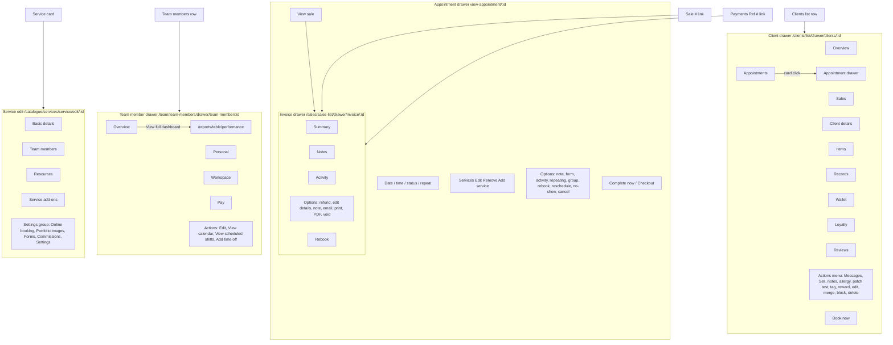

# Gaps from the first survey — resolved (cartographer, deep technical pass)

Date: 2026-10-04. Environment: staging, Test Salon, location 3216614, workspace 3110536, currency KWD, app version 2.8.11390. Authenticated session live.

Evidence key: snapshot files (g-s*.yml), screenshots (g-p*.png), network logs (g-net-*.txt) in the cartographer workspace /Users/fahad/.hermes/kanban/workspaces/t_98a9f324. Routes normalized.

## 1. Resolved items table

Items from review.md / FINAL_REPORT.md "Coverage gaps" re-checked live.

| Item | Previous status | New ruling | Evidence |
|---|---|---|---|
| Top-bar Search click-through | UNVERIFIED | CONFIRMED — opens a modal search palette (dialog "Search", data-qa="global-search-palette"), searches workspace data via GraphQL `partnerSearch` and offers help-center search and support chat | g-s02, g-s03, g-net-search.txt |
| Top-bar Performance insights click-through | UNVERIFIED | CONFIRMED — opens a drawer at /dashboard/drawer/performance-insights/, not the Insights add-on gate; contains KPI sections with View links into /reports/table/* | g-s06, g-p02 |
| Top-bar Notifications click-through | UNVERIFIED | CONFIRMED — opens drawer at /dashboard/drawer/notifications/ with tabs Appointments (4 unread), Reviews, Tips, Online sales, Actions, plus a Notification settings link | g-s07c, g-p03 |
| Top-bar Continue setup click-through | UNVERIFIED | CONFIRMED — opens drawer at /dashboard/drawer/resources/onboarding-guides/ ("Setup Superstar" checklist with BASICS / ESSENTIALS / BOOKING_BOSS guide tracks), not Setup | g-s09c, g-p04 |
| News control | listed by Cartographer, not exposed | CONFIRMED — News is not a top-bar button in this session; it is a tab inside the Continue-setup drawer rail (drawer route /dashboard/drawer/resources/news/), alongside Help (/dashboard/drawer/resources/support/) and Guides (/dashboard/drawer/resources/onboarding-guides/) | g-s10, g-s11 |
| User-menu referral item | UNVERIFIED | CONFIRMED (relabeled) — referral is a banner inside the user menu: "Invite a business to Fresha, and you both get up to KWD 60", not a separate route; no referral page was reached from it in this pass | g-s12c |
| User-menu Help and support | UNVERIFIED | CONFIRMED — links to /dashboard/drawer/resources/support/ (same Help drawer as the Guides rail); drawer offers Email (typical response 2 days), Live chat (2 minutes), Premium support trial banner (7 days left), Help Center external link | g-s12c, g-s11 |
| User-menu Log out / language | UNVERIFIED | CONFIRMED present — "Log out" listitem and a language item "English (US)". Not clicked (safety: logout). | g-s12c |
| Link builder hard-nav 403 | PARTIAL (session-dependent) | STILL UNVERIFIED as an invariant — not re-tested this pass; previous sessions both loaded it and got 403 | n/a this run |
| Reports exact card count 58 | PARTIAL | Not recounted this pass — STILL PARTIAL | n/a |
| Wallet/finance-accounts/credits API calls | UNVERIFIED as functional links | Confirmed as recurring background calls on /dashboard and the insights drawer: GET partners-app.fresha.com/api/wallet/wallets-summary, /api/wallet/finance-accounts-summary, /api/credits/credits-campaign. Recorded as observed traffic (200), still not proven functional links | g-net-insights2.txt |
| Appointment drawer content/actions | Confirmed at high level | EXPANDED below in Detail views | g-s13+ |
| Client profile tabs | UNVERIFIED | CONFIRMED — see Detail views | below |
| Connect onboarding Step 1 of 3 | 0.65 confidence | Not re-walked this pass; previous live observation stands | n/a |

## 2. Global top bar

The top bar (observed on /dashboard, refs e6-e25 of g-s01) contains, left to right: Fresha logo (link -> /calendar), Continue setup button, Search button, Performance insights button, Notifications button (unread badge "4"), Fresha Connect link (/connect), user menu button (avatar initials "FA").

### 2.1 Search
- Route: overlay dialog on any page (data-qa="global-search-palette"); no URL change. Placeholder "Search anything in Test Salon".
- Controls: search textbox; Clear search; "Filter by category" button.
- Behavior: typing "jack" returned two category chips with counts (Clients 1, Appointments 2), result cards for client "Jack Doe" (link /dashboard/drawer/clients/:clientId -> /dashboard/drawer/clients/301298884, a client drawer route) and appointment results (link /dashboard/drawer/view-appointment/:id?resetAppointmentState=true) showing service, ref #, price, status "Unconfirmed". Matched text is highlighted (mark). Footer: "Search \"jack\" in help center" and "Chat with support".
- Filter by category list: Clients, Appointments, Sales, Team, Service menu, Products, Stock orders, Gift cards, Packages, Client packages, Navigation, Actions, Settings (14 categories). Evidence g-s04.
- API: POST https://partners-search-gql.fresha.com/graphql, operationName `partnerSearch`, variables {query, first:30, include:[...]}; query returns filters (entity, recordCount) and edges with typed nodes: CustomerHit (firstName, lastName, email, phones, isBlocked, avatarUrl), TeamMemberHit (firstName, lastName, email, jobTitle), AppointmentHit (date, refNumber, serviceNames, customerName, teamMembers, price{value,currency}, status), SaleHit (refNumber, customerName, saleDate, teamMember, total, saleStatus), ServiceHit (name, pricingLevels{name,duration,price,priceType}), BundleHit, ProductHit, StockOrderHit (referenceNumber, createdAt, sourceLocationName, locationName, supplierName), GiftCardHit (refNumber, customerName, buyerName, usedValue, issuedValue), PackageHit, PackageOwnedHit. Status 200. No tokens recorded.
- Screenshot: g-p01-search.png.

### 2.2 Performance insights
- Route: /dashboard/drawer/performance-insights/ (drawer over current page).
- Controls: time-range buttons Yesterday / Today / Week / Month (both in header and body); Close Drawer.
- Sections:
  - "Today's summary" (compared with this time last week): Total sales (KWD 190, 0%) with sparkline and a "View" link -> /reports/table/sales-summary?navigationSource=insights-drawer&dateFrom=...&dateTo=...&shortcut=custom; Sales by channel (Offline KWD 190, Book now link, Fresha Marketplace, Social, Marketing all KWD 0); KPI row Appointments / Avg. sale (KWD 190.000) / New clients / Returning clients, each with % delta.
  - "Team" section with View link -> /reports/table/sales-summary?groupBy=employee_name&... — rendered an error state ("Something went wrong / There was a problem fetching your data. Please try again") with a Retry button at capture time.
  - "Clients" section with View -> /reports/table/client-summary?...; Clients served sparkline; Clients by type (New/Returning); New clients by source (Fresha Marketplace, Book now link, Offline, Social, Marketing).
  - "Fresha Marketplace" section: cumulative lifetime clients acquired from marketplace, View -> /reports/table/online-presence?...; charts and totals (Total new online clients, Total online appointment value, Total new marketplace clients, Total appointment value from marketplace clients, Return on investment).
  - "Next 7 days" section: View -> /reports/table/appointment-summary?dateFrom=...&dateTo=...; Scheduled appointments (1, KWD 190 value) sparkline; Appointments by channel (Offline 1, others 0).
- API observed: reports.fresha.com/api/json_api_dashboard/* endpoints (recent_sales?days-range=7&location-id=..., upcoming_appointments?days-range=7&location-id=..., bookings_activity?page=1, todays_bookings, top_services, top_employees) plus partners-app wallet/credits calls; all 200. (g-net-insights2.txt)
- Screenshot: g-p02-insights.png.

### 2.3 Notifications
- Route: /dashboard/drawer/notifications/ (drawer). Heading "Appointments", "Unread" label.
- Tabs (left rail inside drawer): Appointments (badge 4), Reviews, Tips, Online sales, Actions.
- Notification rows show actor avatar initial, event title ("Jack rescheduled online", "New appointment (DEMO)"), relative time, detail line ("Blow Dry rescheduled to 10:00 today with you"), and a per-row options button.
- "Notification settings" button -> /user-account/workspaces/:workspaceId/settings/edit-workspace-notifications-modal/ which opens the "Notification preferences" modal on the user-account workspace settings page (see 2.5).
- API: not individually captured this pass (drawer reuses dashboard session); UNVERIFIED which endpoint feeds the list.
- Screenshot: g-p03-notifications.png.

### 2.4 Continue setup / Guides / News / Help
- Continue setup button -> drawer /dashboard/drawer/resources/onboarding-guides/. Titled "Setup Superstar — Get ready to take client bookings". Guide-track tabs: BASICS, ESSENTIALS, BOOKING_BOSS. BASICS checklist items: "Set up your service menu", "Set your working hours", "Set up your client list", "Set up your product list", plus "Skip this guide" and a Help-center card with external link https://www.fresha.com/help-center/knowledge-base.
- Drawer left rail tabs: News (/dashboard/drawer/resources/news/), Help (/dashboard/drawer/resources/support/), Guides (/dashboard/drawer/resources/onboarding-guides/).
- News drawer: article cards "Welcome to Fresha!", "Follow @fresha on Instagram", "Watch real business stories on YouTube" with external links (instagram.com/fresha, youtube.com list). Timestamps "2 hours ago".
- Help drawer ("Hey Fahad, how can we help?"): support channels Email (typical response 2 days), Live chat (typical response 2 minutes); "Premium support — Welcome to your new account — You have 7 days left of premium support"; "Need more help? Visit our Help Center" -> https://www.fresha.com/help-center.
- Screenshot: g-p04-continue-setup.png, g-p05-news.png.

### 2.5 User menu
- Opened from avatar button "Open user menu". Contents (g-s12c):
  - Header: avatar "FA", "Fahad Asad", "No reviews yet", and a referral banner: "Invite a business to Fresha, and you both get up to KWD 60" (with a button, not clicked further; no dedicated referral route observed).
  - Links: My profile (/user-account/profile), Personal settings (/user-account/personal-settings), Help and support (/dashboard/drawer/resources/support/), language item "English (US)", Log out (button; not clicked per safety rules).
- The Notification settings flow also revealed the user-account area: /user-account/workspaces/:workspaceId/settings with its own left sidebar "Your account": Back, My profile, Portfolio, Reviews, Pay runs, Workspaces, Personal settings — additional routes not in the first survey. The workspace settings page shows "Linked calendars" (link "Link a calendar" -> /user-account/workspaces/3110536/settings/calendar-sync?wz-src=settings) and "Workspace notifications" (Manage button; 23 notification settings on).
- Notification preferences modal fields (all checkboxes per channel Email / Push / In-app): Locations scope (All locations); sections Appointments (On; client activity: New appointment, Appointment confirmed, Appointment reschedules, Appointment cancellations, Waitlist entries; team member activity: New appointments, Appointment reschedules, Appointment cancellations, Appointment no-shows, Appointment status updates (with Edit), Waitlist entries; "Notify me about" combobox = Activity concerning all team members), Sales (On; Online product sales, Online membership and package sales, Tips (with Edit)), Reviews (On; New review received (with Edit)), Messaging (On; Client Connect: New client message; Team Connect: Direct messages, Mentions, Thread replies, Channel message), Inventory (On; Low stock alerts, Low stock summary (with Edit)), Insights (On; Daily/Weekly/Monthly summary via Email). Header buttons: Close, Save. No changes saved this pass.

## 3. List page actions (Add / Options / bulk / filters / export)

### 3.1 Clients list (/clients/list)
- Header: heading "Clients list" with count badge (4 in this session: John, Jack, Jane Doe + a sibling member's COUNCIL-TEST Client1, id 301303785); Options; Add.
- Options menu: Import clients, Merge clients, Export group (Excel, CSV). Evidence g-s13c.
- Import banner: "Import your client list — Takes a few minutes and prevents new client fees for existing clients who book online" with Start import + Learn more; banner has its own Close.
- Search box "Name, email or phone"; Filters button; sort "Created at (newest first)"; sortable columns Client name / Reviews / Sales / Created at; select-all checkbox per row; pagination footer "Viewing 1 - 4 of 4 results".
- Bulk bar after selecting a row: "N selected" + Deselect + Bulk edit + Delete. Bulk edit menu: Block clients, Add tags. (Delete not executed; selection was deselected afterwards.) Evidence g-s13d, g-s13f.
- Add client dialog (route /clients/list/add?data=): left rail Personal: Profile, Addresses, Emergency contacts, Settings. Profile fields: First name, Last name, Email, Phone (country code default +965), Birthday (Month select, day, Year), Gender (Female/Male/Non-binary/Prefer not to say), Pronouns (She/Her, He/Him, They/Them, Prefer not to say). Additional info: Client source (Walk-In), Referred by (client picker + Add), Preferred language, Occupation (0/255), Country, Additional email, Additional phone, Tags ("Select or create a tag", managed in client settings). Settings section: Client notifications checkboxes (Send email / text / WhatsApp notifications), Marketing messages checkboxes (Send email / text / WhatsApp messages). Header Close/Save. Not saved. Evidence g-s14, g-s15.

### 3.2 Sales list (/sales/sales-list)
- Tabs Sales / Drafts; Search "Search by Sale or Client"; "Today" shortcut; Filters; Sort by; columns Sale # (link), Client, Status, Sale date, Tips, Gross total; footer Viewing 1 - 1.
- Options menu: Sales settings; Export: PDF, CSV, Excel. Evidence g-s22.
- Row at capture: Sale #1, Walk-In, Completed, 4 Oct 2026 09:02, Tips KWD 0.000, Gross KWD 190.000.

### 3.3 Appointments list (/sales/appointments-list)
- Header: "Appointments — View, filter and export appointments booked by your clients."; Export button; Search "Search by Reference or Client"; "Month to date" preset; Filters; sort "Scheduled Date (newest first)".
- Columns: Ref # (link -> appointment drawer), Client (link -> client drawer), Service, Created by, Created Date, Scheduled Date, Duration, Team member, Price, Status. 3 rows at capture.
- Filters modal (route variant /sales/appointments-list/filters-report): Team member combobox (All team members / Fahad Asad), Channel combobox (All channels, All online channels, Marketplace - Fresha, Book now link, Facebook, Instagram, Marketplace - Google Reserve, Marketing - Automations, Marketing - Blast messages, Offline), Status combobox (Booked, Confirmed, Arrived, Started, Completed, Canceled, No-show); Clear filters / Apply. Evidence g-s26.

### 3.4 Payments (/sales/payment-transactions)
- Header Options; Search "Search by Sale or Client"; date-range button ("Sep 4, 2026 - Oct 4, 2026"); Filters.
- Columns: Payment date, Location, Ref # (link -> /sales/payment-transactions/drawer/invoice/:invoiceId), Client, Team member (link -> /sales/payment-transactions/drawer/team-member/:teamMemberId/), Type (Sale), Method (Cash), Amount; totals summary row; per-row Actions menu: View Sale, Refund. Evidence g-s27, g-s28.

### 3.5 Team members (/team/team-members)
- Count badge (1); Options; Add; "Activate plan" banner ("free trial ends in 7 days" — not clicked, billing-gated); Search "Search team members"; Filters; "Custom order" sort.
- Table columns: select checkbox, Name, Contact (mailto + tel links), Permission role ("Workspace owner"), per-row Actions button. Evidence g-s29.

### 3.6 Catalogue > Service menu (/catalogue/services)
- Options; Add; Search "Search service name"; Filters; "Manage order".
- Categories sidebar: All categories (6), Hair & styling (5), Eyebrows & eyelashes (1), "Add category"; per-category Actions button.
- Service cards show name, duration, price and a "More" kebab; 6 services observed incl. a sibling member's COUNCIL-TEST Service1. The first survey could not capture these rows — now CONFIRMED. Evidence g-s32b.

### 3.7 Catalogue > Suppliers (/catalogue/suppliers)
- Count (1: sibling member's COUNCIL-TEST Supplier1); Add -> "Add a new supplier" dialog (route /catalogue/suppliers/new): Supplier name, Supplier description; contact First name / Last name / Mobile number (+965) / Telephone / Email / Website; address Street, Suburb, City, State, Zip / Postal Code, Country combobox. Close/Save. Not saved. Evidence g-s35.
- Table columns: Supplier name, Phone, Email, Products, Updated at; search "Search by supplier name"; sort "Updated (newest first)".

## 4. Detail views

### 4.1 Client profile drawer (was UNVERIFIED)
- Route: /clients/list/drawer/clients/:clientId (client row click). Also reachable from global Search results (/dashboard/drawer/clients/:clientId) and Sales > Appointments list client links (/sales/appointments-list/filters-report/drawer/clients/:clientId).
- Header: avatar, name, email button, "First visit" chip, "Add tag" chip, Actions menu, "Book now" button. Inline "Add pronouns" (/clients/list/:id/edit?focus=pronoun) and "Add date of birth" (?focus=birthday) links; "Created Oct 4, 2026".
- Tabs: Overview, Appointments (2), Sales, Client details, Items, Records, Wallet, Loyalty, Reviews. Evidence g-s16.
- Overview: Wallet card (Balance KWD 0, "View wallet" -> /clients/list/drawer/clients/:id/wallet?); Summary (Total sales, Appointments, Rating, Canceled, No show); Upcoming appointment card with service lines and Checkout button.
- Appointments tab (/clients/list/drawer/clients/:id/appointments): status tabs All / Booked / Confirmed / More; groups Upcoming / month; per-appointment card opens /clients/list/drawer/view-appointment/:appointmentId?focusedBookingId=:bookingId. CONFIRMS the previously UNVERIFIED client -> appointment drill-through. Evidence g-s18.
- Actions menu: Messages; Sell; Add staff alert; Add simple note; Add allergy; Add patch test; Add tag; Add reward; Edit client details; Merge profiles; Block client; Delete client. Evidence g-s17.

### 4.2 Appointment drawer (expanded)
- Routes observed: /clients/list/drawer/view-appointment/:appointmentId?focusedBookingId=:bookingId (clients context), /sales/appointments-list/filters-report/drawer/view-appointment/:id?resetAppointmentState=true (sales context). Top: Close Drawer, Focus appointment.
- Client header identical to client drawer plus "View profile".
- Body: date ("Tue 6 Oct"), status ("Booked"), time ("14:00"), repeat ("Doesn't repeat"); Services list with per-service Edit / Remove, "Add service", total duration; Total (KWD 190), Payments (- KWD 190), Sale total toggle; Options; View sale; Complete now. Evidence g-s19.
- Options menu: Add a note; Add a form; View appointment activity; Set as repeating; Add to group appointment; Rebook; Reschedule; No-show; Cancel. (None executed.) Evidence g-s20.

### 4.3 Sale / invoice drawer (previously undocumented)
- Route: /sales/sales-list/drawer/invoice/:invoiceId/details (also /sales/payment-transactions/drawer/invoice/:invoiceId from Payments). Tabs: Summary, Notes, Activity. Header buttons Rebook, Open options.
- Summary: status Completed, client Walk-In, Sale #1 + date, item lines (service, time, duration, team member, price), Subtotal / Total (KWD 190), Payment (Cash, timestamp, amount). Evidence g-s23.
- Open options menu: Refund sale; Edit sale details; Add a note; Email; Print; Download PDF; Void sale. (None executed.) Evidence g-s24. Screenshot g-p07-invoice.png.

### 4.4 Team member drawer (was UNVERIFIED)
- Route: /team/team-members/drawer/team-member/:teamMemberId/. Tabs: Overview, Personal, Workspace, Pay.
- Overview: Performance dashboard card, "View full dashboard" -> /reports/table/performance?employee_id=:id&shortcut=week_to_date, "Week to date" toggle. Evidence g-s30b.
- Actions menu: Edit; View calendar; View scheduled shifts; Add time off. Evidence g-s31. Screenshot g-p08-teammember.png.

### 4.5 Service detail / edit dialog (was UNVERIFIED)
- Route: /catalogue/services/service/edit/:serviceId. Tabs: Basic details, Team members (1), Resources, Service add-ons; Settings group: Online booking, Portfolio images, Forms (1), Commissions, Settings.
- Basic details: Service name (x/255), Menu category combobox, Treatment type combobox ("Used to help clients find your service on the Fresha marketplace"), Description (Optional, 0/1000) with "Generate with AI" button; Pricing and duration: Price type (Fixed), Price (KWD spinbutton), Duration combobox, "Add extra time", Options. Close/Save. No edits saved. Evidence g-s33.

## 5. Gated features (add-on / plan gates)

### 5.1 Add-ons marketplace (/add-ons) — gate hub
- Tabs: Add-ons, Integrations.
- Add-on cards with descriptions and View buttons. Statuses observed: Premium Support "On free trial"; Client Connect "Active". Others show no status chip (not activated).
- Add-ons: Payments ("Get paid by clients online and in-store with low cost, safe and simple payments integrated directly to your workspace"), Premium Support, Insights ("Unlock additional reports and create your own unique reports which you can share with your team"), Google Rating Boost, Client Loyalty, Data Connector, Client Connect (Active), Smart Website, Team Connect, Bookable Resources ("Manage resources like rooms and equipment...").
- Integrations: Xero Accounting, QuickBooks Accounting, Facebook and Instagram bookings, Meta Pixel Ads, Google Analytics, Google Ads. Evidence g-s36.

### 5.2 Client Loyalty gate screen (/add-ons/add-on/loyalty/intro, reached via Client Loyalty View)
- Modal gate: "Client Loyalty add-on — Turn all clients into regulars"; pitch bullets (points/tiers/referrals; exclusive offers and discounts; clients track progress and redeem rewards online).
- Pricing shown: "KWD 32.95 per location, per month" with "Try it FREE for 7 days!".
- Actions: Continue (NOT clicked — would start a trial activation, stop-rule), Learn more -> help-center client-loyalty-overview article. Evidence g-s37, screenshot g-p09-loyalty-gate.png.
- Other activation gates seen this pass (from first survey, unchanged): Register "Included in your plan / Start now", Packages "Included in your plan / Start now", Timesheets / Pay runs / Blast campaigns / Deals / Smart pricing "Start now / Learn more", Team members "Activate plan" banner (trial ends in 7 days). Pricing was shown only on the Loyalty gate this pass; other gates' pricing UNVERIFIED.

## 6. Diagrams

### 6.1 Global navigation flowchart (top bar + sidebar + user menu)

```mermaid
flowchart TD
    L["Fresha logo"] -->|"href /calendar"| CAL["Calendar"]
    TB["Top bar"]
    TB --> CS["Continue setup"]
    TB --> SE["Search"]
    TB --> PI["Performance insights"]
    TB --> NO["Notifications"]
    TB --> CO["Fresha Connect"]
    TB --> UM["User menu"]
    SB["Sidebar"]
    SB --> D["Dashboard"]
    SB --> CAL
    SB --> SA["Sales"]
    SB --> CL["Clients"]
    SB --> CA["Catalogue"]
    SB --> FR["Fresha / Online bookings"]
    SB --> MK["Marketing"]
    SB --> TE["Team"]
    SB --> RE["Reports"]
    SB --> AD["Add-ons"]
    SB --> ST["Setup"]
    CS -->|"drawer"| OG["Guides drawer onboarding-guides"]
    OG --> NW["News drawer"]
    OG --> HE["Help drawer"]
    SE -->|"palette"| SEP["partnerSearch results"]
    SEP -->|"client hit"| CD["Client drawer"]
    SEP -->|"appointment hit"| APD["Appointment drawer"]
    PI -->|"drawer"| PID["performance-insights drawer"]
    PID -->|"View links"| RT["/reports/table/* reports"]
    NO -->|"drawer"| NOD["notifications drawer"]
    NOD -->|"Notification settings"| NS["user-account workspace settings + preferences modal"]
    CO -->|"href /connect"| CON["Connect app"]
    UM --> PR["My profile /user-account/profile"]
    UM --> PS["Personal settings /user-account/personal-settings"]
    UM --> HS["Help and support -> Help drawer"]
    UM --> LA["Language English (US)"]
    UM --> LO["Log out"]
    UM --> REF["Referral banner KWD 60"]
```

### 6.2 Detail-view tabs and actions

## 7. Notes and remaining UNVERIFIED

- Reports exact card count, Link-builder hard-nav 403, Register/POS data flows, automation triggers, inventory chain (products -> stocktakes -> stock orders -> suppliers), payroll chain, and Google Reserve post-first-visit content remain unexercised/UNVERIFIED, per the stop-rules and read-only discipline.
- New routes found this pass that were absent from the first survey's inventory: /dashboard/drawer/performance-insights/, /dashboard/drawer/notifications/, /dashboard/drawer/resources/{news,support,onboarding-guides}/, /user-account/workspaces/:workspaceId/settings (plus /settings/calendar-sync, /settings/edit-workspace-notifications-modal/), client drawer context routes (/clients/list/drawer/clients/:id, /clients/list/drawer/clients/:id/appointments, /clients/list/drawer/view-appointment/:id), sales drawer (/sales/sales-list/drawer/invoice/:id), payments drawers (/sales/payment-transactions/drawer/{invoice,team-member}/:id), team member drawer (/team/team-members/drawer/team-member/:id/), service edit (/catalogue/services/service/edit/:id), client add (/clients/list/add), supplier add (/catalogue/suppliers/new), add-on intro (/add-ons/add-on/loyalty/intro).
- COUNCIL-TEST records observed but created by sibling members, not by this pass: client 301303785 (council-test+1@example.com), service "COUNCIL-TEST Service1", supplier "COUNCIL-TEST Supplier1". This pass created and modified nothing in the workspace (all dialogs closed without saving; no destructive or bulk action executed).

