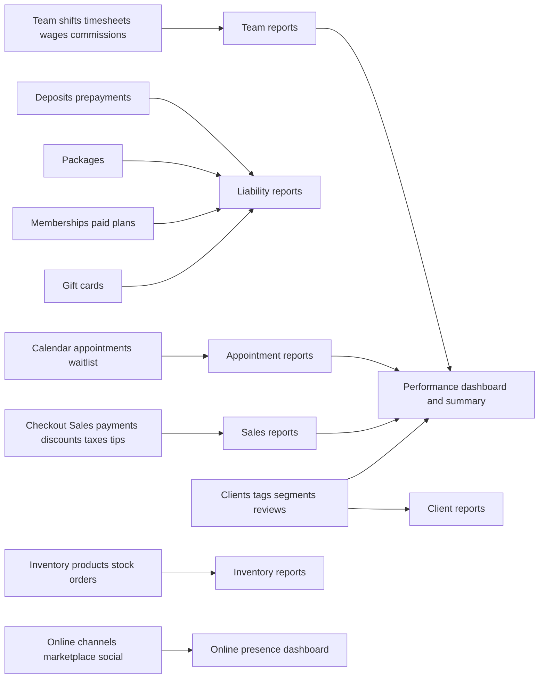
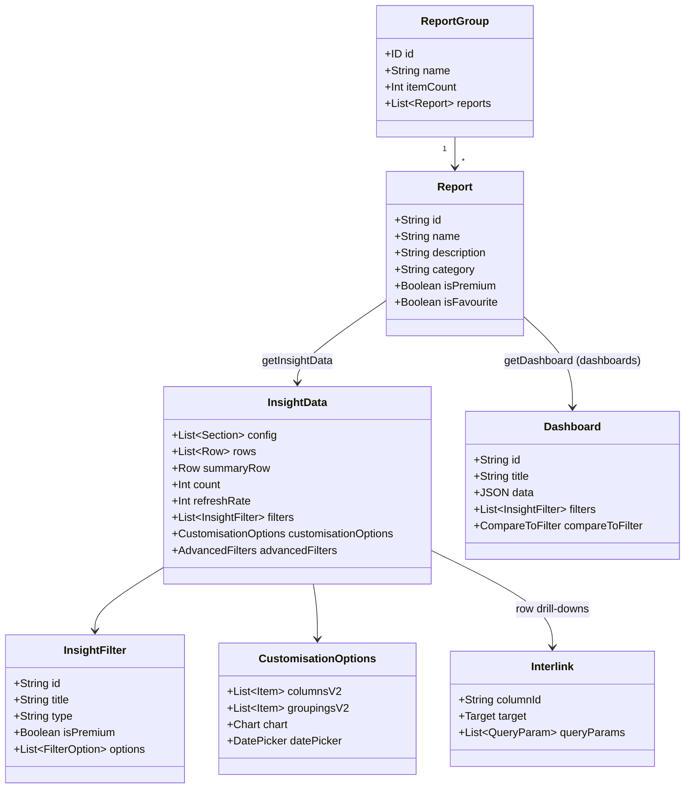

# Reports — deep technical pass (Fresha partner dashboard)

Author: cartographer. Scope: the Reports area at `https://partners.fresha.com/reports`. Evidence: live Playwright session on the staging/test account, 2026-10-04; API payloads captured via browser_network_request and same-session GraphQL fetches. Baseline first survey: `/Users/fahad/council/output/pages.md` section 35.

## 1. Area map and routes

- Reports home: `/reports` -> redirects to `/reports/report-group/1?category=all` (report catalog). Left rail: **All reports (59) / Favourites (0) / Dashboards (3) / Standard (49) / Premium (10) / Custom (0) / Folders (Add folder) / Data connector**.
- Every report opens at `/reports/table/<slug>` (e.g. `/reports/table/sales-summary`). Dashboards use the same route shape (`/reports/table/performance`).
- Catalog API returns per report: `id` (slug = route segment), `name`, `description`, `isFavourite`, `isPremium`, `category`, `updatedAt`, `createdBy`.
- Categories (query param `category`): `all`, Sales, Finance, Appointments, Team, Clients, Inventory, Other. Internal category ids: `dashboards`, `performance`, `salesPerformance`, `finances`, `appointments`, `team`, `clients`, `inventory`.
- Catalog also has **Search** (searchInput) and **Created by** filter, plus sort. "Add" button navigates to `/add-ons/add-on/fresha-insights/intro` (paid Insights add-on — see gating).
- Screenshot: `technical/screenshots/r-reports-catalog.png`; baseline `output/screenshots/p-reports.png`.

## 2. Shared report-page chrome (applies to every report page)

Observed on `/reports/table/sales-summary` (evidence: page innerText + Options menu snapshot):

- Breadcrumb: Back > All reports > [category] > [report name]. "Add to favorites" button on every card/page.
- **Options** menu: **Duplicate**, **Add to favorites**, **Export** with formats **CSV, Excel, PDF**. (No email/scheduling option exists in the report UI — UNVERIFIED whether any exists behind the Insights add-on; none observed.)
- **Type** (date picker): shortcut options like Month to date, Last 30 days etc.; per-report default and type come from `customisationOptions.datePicker` (types: `dateRange`, `singleDate`; e.g. Stock on hand is `singleDate=today, disabled`).
- **Filters** (dropdown multi-selects), **Advanced filters** (tree of rules/predicates — `advancedFilters` with FilterRule/FilterPredicate nodes), **Customize** (show/hide columns via `customisationOptions.columnsV2`, groupings, chart toggle).
- Data freshness label "Data from X mins ago" + `refreshRate` (30s for tables, 80s for dashboards). Pagination: "Viewing 1 - N of M results" (limit/offset based).

## 3. Gating (Premium / Insights add-on)

- 10 of 59 reports are flagged `isPremium` (see catalogue). Premium filters exist too (e.g. Appointments list filter `cancellation_reason_id` "Cancellation reason" is premium).
- The "Add" button (custom reports) and Premium reports are gated by the **Insights add-on**: `/add-ons/add-on/fresha-insights/intro` shows "Enhance your reports with rich data... Get access to additional premium reports / Create custom reports / Control which reports each team member can access — KWD 27 per location, per month. Try it FREE for 7 days!" Not activated (safety rule).
- Premium report pages still render on this account (badge "Premium" shown); the API returned full data for premium reports, so the test account appears to have trial/premium access. Whether production gating blocks data is UNVERIFIED.
- `getPermissions` query (resourceType `fresha/reports_report`, resourceId = report slug) is issued on every report page — the per-report access-control check (team-member report access control is an Insights feature).

## 4. API — reporting backend

Single GraphQL endpoint for everything: `POST https://partners-reporting-api.fresha.com/?__pid=<accountId>&_client_version=2.8.11390&_client_platform=web` (session cookies; no tokens recorded). Operations observed:

- **getReportGroup**($groupId=1, $searchInput, $sort, $category, $createdBy, $performanceOverTimeEnabled, $appVersion) -> `{id, name, description, itemCount, hideCategoryPills, header, reports{id name description isFavourite isPremium category updatedAt createdBy}}` — the 59-report catalog.
- **getInsightData**($id: String!, $filters: [FilterType]!, $limit, $offset, $sort, $dimensions, $groupBy, $dateRange, $predefinedReportCustomisation, $advancedFiltersCode) -> `{config{sections{columns{id title type isIndented isHidden textAlign url}}}, rows (raw JSON per report), summaryRow, count, lastUpdated, refreshRate, widgets{id title mainValue tooltip}, filters{id title options{value label description image} inputType isPremium enabledIfGroupByIsOneOf type}, selectedFilters, filterRedirects, customisationOptions{columns, columnsV2{shownItems{id title type} hiddenItems}, groupings, groupingsV2, filters, chart{enabled chartType axisY}, datePicker{datePickerType datePickerDefaultValue isDisabled}}, advancedFilters{rootNodeId nodes(FilterRule|FilterPredicate{id field operator value childrenIds})}}` — used by all 56 non-dashboard reports. Rows contain an `interlinks` array for drill-downs: `{columnId, target{type, value}, queryParams[]}` with target types observed: `REPORT` (cross-report drill with groupBy + filter params), `INVOICE_DRAWER`, `TEAM_MEMBER_DRAWER`.
- **getDashboard**($id, $filters, $dateRange, $compareTo, $useUpdatedVersion, $useNewGraphTimeRanges) -> `{id title subTitle lastUpdated refreshRate data compareToLabel compareTo selectedFilters filters compareToFilter{options{label value dateFrom dateTo} defaultValue selectedValue}}` — used by the 3 dashboards. `data` is a bag of statboxes and `*_breakdown` series (30 buckets) + `*_metadata`.
- **calculateComparisonPeriod**($compareTo, $dateRange{dateFrom dateTo shortcut}) — resolves comparison period for dashboard "Compare to" (Previous period / Previous year / No comparison).
- **getPermissions**($resourceId, $resourceType) — per-report permission check.

## 5. Report catalogue (59)

| # | Report | Slug / route | Category | Premium | Export |
|---|--------|-------------|----------|---------|--------|
| 1 | Performance dashboard | `/reports/table/performance` | Dashboards | Standard | CSV, Excel, PDF |
| 2 | Online presence dashboard | `/reports/table/online-presence` | Dashboards | Standard | CSV, Excel, PDF |
| 3 | Loyalty dashboard | `/reports/table/loyalty_dashboard` | Dashboards | Standard | CSV, Excel, PDF |
| 4 | Performance summary | `/reports/table/performance-summary` | Performance | **Premium** | CSV, Excel, PDF |
| 5 | Performance over time | `/reports/table/performance-over-time` | Performance | **Premium** | CSV, Excel, PDF |
| 6 | Sales summary | `/reports/table/sales-summary` | Sales | Standard | CSV, Excel, PDF |
| 7 | Sales by time period | `/reports/table/sales-by-time-period` | Sales | **Premium** | CSV, Excel, PDF |
| 8 | Sales list | `/reports/table/sales-list` | Sales | Standard | CSV, Excel, PDF |
| 9 | Sales log detail | `/reports/table/sales-log-detail` | Sales | Standard | CSV, Excel, PDF |
| 10 | Gift card by time period | `/reports/table/gift-card-by-time-period` | Sales | **Premium** | CSV, Excel, PDF |
| 11 | Gift card list | `/reports/table/gift-card-list` | Sales | Standard | CSV, Excel, PDF |
| 12 | Memberships list | `/reports/table/membership-list-v2` | Sales | Standard | CSV, Excel, PDF |
| 13 | Memberships summary | `/reports/table/membership-summary-v2` | Sales | Standard | CSV, Excel, PDF |
| 14 | Memberships benefits consumption | `/reports/table/memberships-benefits-consumption` | Sales | **Premium** | CSV, Excel, PDF |
| 15 | Packages list | `/reports/table/packages-list` | Sales | Standard | CSV, Excel, PDF |
| 16 | Packages summary | `/reports/table/packages-summary` | Sales | Standard | CSV, Excel, PDF |
| 17 | Packages benefits consumption | `/reports/table/packages-benefits-consumption` | Sales | **Premium** | CSV, Excel, PDF |
| 18 | Cash register summary | `/reports/table/cash-register-summary` | Sales | Standard | CSV, Excel, PDF |
| 19 | Discount summary | `/reports/table/discount-summary` | Sales | Standard | CSV, Excel, PDF |
| 20 | Taxes summary | `/reports/table/taxes-summary` | Sales | Standard | CSV, Excel, PDF |
| 21 | Finance summary | `/reports/table/finance-summary` | Finance | Standard | CSV, Excel, PDF |
| 22 | Payments summary | `/reports/table/payments-summary` | Finance | Standard | CSV, Excel, PDF |
| 23 | Payment transactions | `/reports/table/payment-transactions` | Finance | Standard | CSV, Excel, PDF |
| 24 | Cash flow summary | `/reports/table/cash-flow-summary` | Finance | Standard | CSV, Excel, PDF |
| 25 | Cash flow statement | `/reports/table/cash-flow-statement` | Finance | Standard | CSV, Excel, PDF |
| 26 | Service charges | `/reports/table/service-charges` | Finance | Standard | CSV, Excel, PDF |
| 27 | Liability summary | `/reports/table/liability-summary` | Finance | Standard | CSV, Excel, PDF |
| 28 | Liability activity | `/reports/table/liability-activity` | Finance | Standard | CSV, Excel, PDF |
| 29 | Prepayments by time period | `/reports/table/deposits-by-time-period` | Finance | **Premium** | CSV, Excel, PDF |
| 30 | Prepayment list | `/reports/table/deposit-list` | Finance | Standard | CSV, Excel, PDF |
| 31 | Taxes list | `/reports/table/taxes-list` | Finance | Standard | CSV, Excel, PDF |
| 32 | Appointments summary | `/reports/table/appointment-summary` | Appointments | Standard | CSV, Excel, PDF |
| 33 | Appointments list | `/reports/table/appointment-list` | Appointments | Standard | CSV, Excel, PDF |
| 34 | Appointments cancellations & no-show summary | `/reports/table/appointment-cns-ns-summary` | Appointments | Standard | CSV, Excel, PDF |
| 35 | Waitlist detail | `/reports/table/waitlist-detail` | Appointments | Standard | CSV, Excel, PDF |
| 36 | Waitlist summary | `/reports/table/waitlist-summary` | Appointments | **Premium** | CSV, Excel, PDF |
| 37 | Working hours activity | `/reports/table/working-hours-activity` | Team | Standard | CSV, Excel, PDF |
| 38 | Break activity | `/reports/table/break-activity` | Team | Standard | CSV, Excel, PDF |
| 39 | Attendance summary | `/reports/table/attendance-summary` | Team | Standard | CSV, Excel, PDF |
| 40 | Wages detail | `/reports/table/wages-detail` | Team | Standard | CSV, Excel, PDF |
| 41 | Wages summary | `/reports/table/wages-summary` | Team | Standard | CSV, Excel, PDF |
| 42 | Fee deduction activity | `/reports/table/fee-deduction-activity` | Team | Standard | CSV, Excel, PDF |
| 43 | Fee deduction summary | `/reports/table/fee-deduction-summary` | Team | Standard | CSV, Excel, PDF |
| 44 | Pay summary | `/reports/table/pay-summary` | Team | Standard | CSV, Excel, PDF |
| 45 | Scheduled shifts | `/reports/table/scheduled-shifts` | Team | Standard | CSV, Excel, PDF |
| 46 | Working hours summary | `/reports/table/working-hours-summary` | Team | Standard | CSV, Excel, PDF |
| 47 | Team time off report | `/reports/table/team-time-off-report` | Team | Standard | CSV, Excel, PDF |
| 48 | Tips summary | `/reports/table/tips-summary` | Team | Standard | CSV, Excel, PDF |
| 49 | Tips detail | `/reports/table/tips-detail` | Team | Standard | CSV, Excel, PDF |
| 50 | Commission activity | `/reports/table/advanced-commission-activity` | Team | Standard | CSV, Excel, PDF |
| 51 | Commission summary | `/reports/table/advanced-commission-summary` | Team | Standard | CSV, Excel, PDF |
| 52 | Client summary | `/reports/table/client-summary` | Clients | **Premium** | CSV, Excel, PDF |
| 53 | Client list | `/reports/table/client-list` | Clients | Standard | CSV, Excel, PDF |
| 54 | Client insights | `/reports/table/client-insights` | Clients | **Premium** | CSV, Excel, PDF |
| 55 | Stock on hand | `/reports/table/stock-on-hand` | Inventory | Standard | CSV, Excel, PDF |
| 56 | Stock movement summary | `/reports/table/stock-movement-summary` | Inventory | Standard | CSV, Excel, PDF |
| 57 | Stock movement log | `/reports/table/stock-movement` | Inventory | Standard | CSV, Excel, PDF |
| 58 | Product list | `/reports/table/product-list` | Inventory | Standard | CSV, Excel, PDF |
| 59 | Ordered stock | `/reports/table/ordered-stock` | Inventory | Standard | CSV, Excel, PDF |

All exports observed once in the Options menu of a table report; assumed uniform (standard Fresha chrome) — marked UNVERIFIED for reports not individually opened in the UI.

## 6. Per-report detail

### 6.1 Dashboards

#### 1. Performance dashboard
- Route: `/reports/table/performance`. Reached from: Reports home card (Performance dashboard); category filter Dashboards.
- Purpose: Dashboard of your business performance.
- Gated: Standard
- Source entities/features: Calendar bookings, checkout/sales, clients, marketplace/online channels, reviews
- API: `getDashboard` id=`performance`, default date range Last 30 days, compare-to default `previous_period` (options: Previous period, Previous year, No comparison); refresh 80s.
- Filters: location_id (Location, multi-select-v2, 2 options e.g. ['All locations', 'Test Salon']); employee_id (Team member, multi-select-v2, 2 options e.g. ['All team members', 'Fahad Asad'])
- Widgets/charts (from `data` keys): appointments_statbox, appointments_statbox_breakdown, appointments_statbox_breakdown_metadata, average_sale_value_statbox, bottom_five_team_members_breakdown, occupancy_rate_statbox, occupancy_rate_statbox_breakdown, occupancy_rate_statbox_breakdown_metadata, online_sales_statbox, retention_rate_statbox, retention_rate_statbox_breakdown, retention_rate_statbox_breakdown_metadata, sales_by_channel_statbox_breakdown, sales_by_channel_statbox_breakdown_metadata, top_five_team_members_breakdown, total_sales_over_time_breakdown, total_sales_over_time_breakdown_metadata, total_sales_statbox
- Statboxes: Total sales (with services/service add-ons/products/no-shows/cancellations/memberships/packages/shipping split), Average sale value, Online sales, Appointments, Occupancy rate, Returning client rate, Sales by channel (fresha_marketplace, book_now_link, social, marketing, offline), Appointments breakdown (completed/not completed/no shows/cancelled), Top/Bottom five team members. Time series: `total_sales_over_time_breakdown` (30 columns with compare period). "View report" links drill into Sales summary / Appointments summary etc.
- Evidence: getInsightData/getDashboard payload for id `performance` captured this session.

#### 2. Online presence dashboard
- Route: `/reports/table/online-presence`. Reached from: Reports home card (Online presence dashboard); category filter Dashboards.
- Purpose: Online sales and online client performance
- Gated: Standard
- Source entities/features: Fresha marketplace, book-now link, social/Google channels, online reviews, clients
- API: `getDashboard` id=`online-presence`, default date range Last 30 days, compare-to default `previous_period` (options: Previous period, Previous year, No comparison); refresh 80s.
- Filters: location_id (Location, multi-select-v2, 2 options e.g. ['All locations', 'Test Salon'])
- Widgets/charts (from `data` keys): average_online_ratings_overtime, average_online_ratings_overtime_metadata, clients_by_channel, clients_by_channel_metadata, lifetime_marketplace_clients, lifetime_marketplace_new_client_fees, lifetime_marketplace_sales, lifetime_sales_from_marketplace_clients_overtime, lifetime_sales_from_marketplace_clients_overtime_metadata, marketplace_audience_mix, marketplace_booking_funnel, marketplace_profile_views, marketplace_profile_views_geo_heatmap, marketplace_profile_views_top_areas, marketplace_roi, marketplace_search_impressions, marketplace_search_rank, marketplace_search_rank_overtime, marketplace_search_rank_overtime_metadata, marketplace_search_top_10_rate, online_appointment_value, online_appointments, online_appointments_overtime, online_appointments_overtime_metadata, online_average_sale_value, online_average_sale_value_overtime, online_average_sale_value_overtime_metadata, online_cancellation_overtime, online_cancellation_overtime_metadata, online_clients, online_clients_by_channel_overtime, online_clients_by_channel_overtime_metadata, online_new_clients, online_new_clients_overtime, online_new_clients_overtime_metadata, online_new_returning_clients_overtime, online_new_returning_clients_overtime_metadata, online_no_shows, online_no_shows_overtime, online_no_shows_overtime_metadata, online_ratings, online_retention_rate, online_retention_rate_overtime, online_retention_rate_overtime_metadata, online_reviews_count, online_reviews_overtime, online_reviews_overtime_metadata, peak_search_times, sales_by_channel, sales_by_channel_metadata, total_appointment_value, total_clients, total_new_clients
- Statboxes: lifetime marketplace sales, online new clients, sales/clients by channel, online appointments, online average sale value, online retention rate, online ratings & reviews, online no-shows/cancellations; marketplace SEO block: search rank, top-10 rate, impressions, profile views, booking funnel, peak search times, audience mix, profile-views geo heatmap + top areas, marketplace ROI, lifetime marketplace new-client fees.
- Evidence: getInsightData/getDashboard payload for id `online-presence` captured this session.

#### 3. Loyalty dashboard
- Route: `/reports/table/loyalty_dashboard`. Reached from: Reports home card (Loyalty dashboard); category filter Dashboards.
- Purpose: Dashboard of your loyalty program performance.
- Gated: Standard
- Source entities/features: Loyalty program (points/rewards); errors out on account with no loyalty program
- API: `getDashboard` id=`loyalty_dashboard` -> **[{"message": "Cannot read properties of undefined (reading '0')", "locations": [{"line": 1, "column": 175}], "path": ["getDashboard"], "extensions": {"code": "INTERNAL_SERVER_ERROR"}}]** — UNVERIFIED content (test account has no loyalty program data).
- Evidence: getInsightData/getDashboard payload for id `loyalty_dashboard` captured this session.

### 6.2 Performance

#### 4. Performance summary
- Route: `/reports/table/performance-summary`. Reached from: Reports home card (Performance summary); category filter Performance.
- Purpose: Overview of business performance by team or location
- Gated: Premium (Insights add-on)
- Source entities/features: Calendar bookings, checkout/sales, clients, reviews
- Date picker: dateRange (default: month_to_date); refresh 80s.
- Filters: location_id (Location, multi-select-v2, 2 options e.g. ['All locations', 'Test Salon']); employee_id (Team member, multi-select-v2, 2 options e.g. ['All team members', 'Fahad Asad'])
- Group by: employee_name, location_name
- Columns/metrics: single-row metric set (78 metrics, e.g. service_sales, service_add_on_sales, product_sales, package_sales, membership_sales, shipping_sales, late_cancellation_fee_sales, no_show_fee_sales, total_sales_performance, gift_card_sales, ...)
- Chart: none; widgets: none; drill-downs (interlinks): none observed
- Evidence: getInsightData/getDashboard payload for id `performance-summary` captured this session.

#### 5. Performance over time
- Route: `/reports/table/performance-over-time`. Reached from: Reports home card (Performance over time); category filter Performance.
- Purpose: View of key business metrics by Location or Team Member over time
- Gated: Premium (Insights add-on)
- Source entities/features: Calendar bookings, checkout/sales, clients (time series)
- Date picker: dateRange (default: month_to_date); refresh Nones.
- Filters: location_id (Location, multi-select-v2, 2 options e.g. ['All locations', 'Test Salon']); employee_id (Team member, multi-select-v2, 2 options e.g. ['All team members', 'Fahad Asad'])
- Group by: none
- Columns/metrics: single-row metric set (6 metrics, e.g. employee_name, total_sales_performance, 2026-10-01, 2026-10-02, 2026-10-03, 2026-10-04, ...)
- Chart: {"enabled": true, "chartType": "bar", "axisY": "metric", "__typename": "ChartConfigType"}; widgets: none; drill-downs (interlinks): none observed
- Evidence: getInsightData/getDashboard payload for id `performance-over-time` captured this session.

### 6.3 Sales

#### 6. Sales summary
- Route: `/reports/table/sales-summary`. Reached from: Reports home card (Sales summary); category filter Sales.
- Purpose: Sales quantities and value, excluding tips and gift card sales.
- Gated: Standard
- Source entities/features: Checkout/sales invoices and line items
- Date picker: dateRange (default: month_to_date); refresh 30s.
- Filters: location_id (Location, multi-select-v2, 2 options e.g. ['All locations', 'Test Salon']); employee_id (Team member, multi-select-v2, 2 options e.g. ['All team members', 'Fahad Asad']); invoice_status_name (Status, multi-select-v2, 6 options e.g. ['All statuses', 'Unpaid', 'Part paid']); appointment_channel_name (Channel, multi-select-v2, 10 options e.g. ['All channels', 'All online channels', 'Marketplace - Fresha']); item_type (Type, multi-select-v2, 9 options e.g. ['All item types', 'Services', 'Service add-ons']); loyalty_type (Loyalty sales, multi-select-v2, 6 options e.g. ['All loyalty sales', 'Points reward redeemed', 'Tiers reward redeemed']); customer_tag_id (Client tags, multi-select-v2, 1 options e.g. ['All tags']); customer_segment_id (Client segments, multi-select-v2, 12 options e.g. ['All segments', 'Upcoming birthdays', 'First visit']); customer_gender (Client gender, multi-select-v2, PREMIUM, 6 options e.g. ['All genders', 'Male', 'Female']); customer_retention (Client retention, multi-select-v2, PREMIUM, 4 options e.g. ['All types', 'Walk-ins', 'Returning clients']); product_supplier_id (Supplier, multi-select-v2, PREMIUM, 1 options e.g. ['All suppliers']); product_brand_id (Brand, multi-select-v2, PREMIUM, 1 options e.g. ['All brands']); product_category_id (Product category, multi-select-v2, PREMIUM, 1 options e.g. ['All categories']); service_category_id (Service category, multi-select-v2, PREMIUM, 3 options e.g. ['All categories', 'Eyebrows & eyelashes', 'Hair & styling'])
- Group by: item_type, category_name, item_name, employee_name, customer_name, loyalty_type, appointment_channel_name, location_name, tag_name, segment_name, customer_source, customer_gender, customer_retention, invoice_date_hour, invoice_date_day, invoice_date_week, invoice_date_month, invoice_date_quarter, invoice_date_year
- Columns/metrics: Sales qty [INTEGER, sales_qty], Items sold [INTEGER, items_sold], Gross sales [MONEY, gross_sales], Total discounts [MONEY, discounts], Refunds [MONEY, refunds], Net sales [MONEY, net_sales], Taxes [MONEY, taxes], Total sales [MONEY, total_sales] (+17 hideable via Customize)
- Chart: none; widgets: none; drill-downs (interlinks): REPORT:['sales-summary']
- Evidence: getInsightData/getDashboard payload for id `sales-summary` captured this session.

#### 7. Sales by time period
- Route: `/reports/table/sales-by-time-period`. Reached from: Reports home card (Sales by time period); category filter Sales.
- Purpose: Detailed sales data based on selected time periods.
- Gated: Premium (Insights add-on)
- Source entities/features: Checkout/sales invoices bucketed by time period
- Date picker: dateRange (default: month_to_date); refresh 30s.
- Filters: appointment_channel_name (Channel, multi-select-v2, 10 options e.g. ['All channels', 'All online channels', 'Marketplace - Fresha']); item_type (Type, multi-select-v2, 9 options e.g. ['All item types', 'Services', 'Service add-ons']); customer_gender (Client gender, multi-select-v2, PREMIUM, 6 options e.g. ['All genders', 'Male', 'Female']); customer_retention (Client retention, multi-select-v2, PREMIUM, 4 options e.g. ['All types', 'Walk-ins', 'Returning clients']); location_id (Location, multi-select-v2, 2 options e.g. ['All locations', 'Test Salon']); employee_id (Team member, multi-select-v2, 2 options e.g. ['All team members', 'Fahad Asad']); customer_tag_id (Client tags, multi-select-v2, 1 options e.g. ['All tags']); customer_segment_id (Client segments, multi-select-v2, 12 options e.g. ['All segments', 'Upcoming birthdays', 'First visit'])
- Group by: invoice_date_hour, invoice_date_day, invoice_date_month, invoice_date_quarter, invoice_date_year
- Columns/metrics: Sales qty [INTEGER, sales_qty], Items sold [INTEGER, items_sold], Gross sales [MONEY, gross_sales], Discounts [MONEY, discounts], Refunds [MONEY, refunds], Net sales [MONEY, net_sales], Taxes [MONEY, taxes], Total sales [MONEY, total_sales]
- Chart: {"enabled": true, "chartType": "bar", "axisY": "total_sales", "__typename": "ChartConfigType"}; widgets: none; drill-downs (interlinks): none observed
- Evidence: getInsightData/getDashboard payload for id `sales-by-time-period` captured this session.

#### 8. Sales list
- Route: `/reports/table/sales-list`. Reached from: Reports home card (Sales list); category filter Sales.
- Purpose: Complete listing of all sales transactions.
- Gated: Standard
- Source entities/features: Checkout/sales invoices
- Date picker: dateRange (default: month_to_date); refresh 30s.
- Filters: invoice_status_name (Status, multi-select-v2, 6 options e.g. ['All statuses', 'Unpaid', 'Part paid']); location_id (Location, multi-select-v2, 2 options e.g. ['All locations', 'Test Salon']); appointment_channel_name (Channel, multi-select-v2, 10 options e.g. ['All channels', 'All online channels', 'Marketplace - Fresha']); customer_gender (Client gender, multi-select-v2, 6 options e.g. ['All genders', 'Male', 'Female']); customer_retention (Client retention, multi-select-v2, 4 options e.g. ['All types', 'Walk-ins', 'Returning clients']); service_charge_type_id (Service charge, multi-select-v2, 1 options e.g. ['All service charges']); total_sales (Total sales); total_amount_due (Amount due); customer_tag_id (Client tags, multi-select-v2, 1 options e.g. ['All tags']); customer_segment_id (Client segments, multi-select-v2, 12 options e.g. ['All segments', 'Upcoming birthdays', 'First visit'])
- Group by: none
- Columns/metrics: Sale no. [LINK, invoice_number], Sale date [DATE, invoice_timestamp], Sale status [TEXT, invoice_status_name], Location [TEXT, location_name], Client [LINK, customer_name], Channel [TEXT, appointment_channel_name], Items sold [INTEGER, items_sold], Total sales [MONEY, total_sales], Gift card [MONEY, gift_card], Service charges [MONEY, total_service_charges], Amount due [MONEY, total_amount_due] (+50 hideable via Customize)
- Chart: none; widgets: none; drill-downs (interlinks): INVOICE_DRAWER, TEAM_MEMBER_DRAWER
- Evidence: getInsightData/getDashboard payload for id `sales-list` captured this session.

#### 9. Sales log detail
- Route: `/reports/table/sales-log-detail`. Reached from: Reports home card (Sales log detail); category filter Sales.
- Purpose: In-depth view into each sale transaction.
- Gated: Standard
- Source entities/features: Checkout/sales invoices incl. payments, discounts, taxes, service charges
- Date picker: dateRange (default: month_to_date); refresh 30s.
- Filters: location_id (Location, multi-select-v2, 2 options e.g. ['All locations', 'Test Salon']); item_type_voucher (Type, multi-select-v2, 10 options e.g. ['All item types', 'Services', 'Service add-ons']); employee_id (Team member, multi-select-v2, 2 options e.g. ['All team members', 'Fahad Asad']); appointment_channel_name (Channel, multi-select-v2, 10 options e.g. ['All channels', 'All online channels', 'Marketplace - Fresha']); customer_gender (Client gender, multi-select-v2, 6 options e.g. ['All genders', 'Male', 'Female']); customer_retention (Client retention, multi-select-v2, 4 options e.g. ['All types', 'Walk-ins', 'Returning clients']); discount_category_name (Discount category, multi-select-v2, 22 options e.g. ['All discount categories', 'Blast Marketing', 'Discount']); discount_type_id (Discount type, multi-select-v2, 2 options e.g. ['All discount types', 'Discount - Multiple']); customer_tag_id (Client tags, multi-select-v2, 1 options e.g. ['All tags']); customer_segment_id (Client segments, multi-select-v2, 12 options e.g. ['All segments', 'Upcoming birthdays', 'First visit'])
- Group by: none
- Columns/metrics: Date [DATE, invoice_timestamp], Sale no. [LINK, invoice_number], Location [TEXT, location_name], Type [TEXT, item_type], Item [LINK, item_name], Category [TEXT, category_name], Client [LINK, customer_name], Team member [LINK, employee_name], Channel [TEXT, appointment_channel_name], Gross sales [MONEY, gross_sales], Item discounts [MONEY, item_discounts], Cart discounts [MONEY, global_discounts], Total discounts [MONEY, discounts], Refunds [MONEY, refunds], Net sales [MONEY, net_sales], Taxes on net sales [MONEY, taxes], Total sales [MONEY, total_sales] (+33 hideable via Customize)
- Chart: none; widgets: none; drill-downs (interlinks): APPOINTMENT_DRAWER, INVOICE_DRAWER, TEAM_MEMBER_DRAWER
- Evidence: getInsightData/getDashboard payload for id `sales-log-detail` captured this session.

#### 10. Gift card by time period
- Route: `/reports/table/gift-card-by-time-period`. Reached from: Reports home card (Gift card by time period); category filter Sales.
- Purpose: Gift card sales and usage data based on selected time periods.
- Gated: Premium (Insights add-on)
- Source entities/features: Gift cards (sales and redemptions)
- Date picker: dateRange (default: month_to_date); refresh 30s.
- Filters: location_id (Location, multi-select-v2, 2 options e.g. ['All locations', 'Test Salon'])
- Group by: day, week, month, quarter, year
- Columns/metrics: Opening balance [MONEY, opening_balance], Issued value [MONEY, issued_amount], Sold value [MONEY, total_sales_amount], Expired value [MONEY, expired_amount], Redeemed value [MONEY, redeemed_amount], Refunded value [MONEY, refunded_amount], Closing balance [MONEY, closing_balance]
- Chart: {"enabled": true, "chartType": "bar", "axisY": "closing_balance", "__typename": "ChartConfigType"}; widgets: none; drill-downs (interlinks): none observed
- Evidence: getInsightData/getDashboard payload for id `gift-card-by-time-period` captured this session.

#### 11. Gift card list
- Route: `/reports/table/gift-card-list`. Reached from: Reports home card (Gift card list); category filter Sales.
- Purpose: Full list of issued and outstanding gift cards.
- Gated: Standard
- Source entities/features: Gift cards (issued/outstanding/redeemed)
- Date picker: dateRange (default: month_to_date); refresh 30s.
- Filters: location_id (Location, multi-select-v2, 2 options e.g. ['All locations', 'Test Salon']); employee_id (Team member, multi-select-v2, 2 options e.g. ['All team members', 'Fahad Asad']); redemption_date (Redeemed, 3 options e.g. ['All', 'Yes', 'No']); status_name (Status, multi-select-v2, 8 options e.g. ['All statuses', 'Active', 'Unpaid'])
- Group by: none
- Columns/metrics: Code [LINK, gift_card_code], Sale no. [LINK, invoice_number], Purchased by [LINK, customer_name], Status [TEXT, status_name], Issue date [DATE, created_at], Expiry date [DATE, expiration_date], Issued value [MONEY, issue_value], Discount [MONEY, discounts], Total sales [MONEY, total_sales], Redemptions [MONEY, redeemed_value], Expirations [MONEY, expired_value], Closing balance [MONEY, balance_value]
- Chart: none; widgets: none; drill-downs (interlinks): none observed
- Evidence: getInsightData/getDashboard payload for id `gift-card-list` captured this session.

#### 12. Memberships list
- Route: `/reports/table/membership-list-v2`. Reached from: Reports home card (Memberships list); category filter Sales.
- Purpose: Operational details of your memberships including benefits and financials.
- Gated: Standard
- Source entities/features: Memberships (paid plans) sold and their benefits
- Date picker: dateRange (default: all_time); refresh 30s.
- Filters: location_id (Location, multi-select-v2, 2 options e.g. ['All locations', 'Test Salon']); membership_status_name (Status, multi-select-v2, 10 options e.g. ['All statuses', 'Pending', 'Trialing']); service_id (Service, multi-select-v2, 6 options e.g. ['All services', 'Balayage', 'Blow Dry']); membership_id (Membership ID, multi-select-v2); membership_name_id (Membership name, multi-select-v2); membership_template_id (Membership name); client_id (Client, multi-select-v2); billing_cadence_unit (Payment frequency, multi-select-v2); sale_value (Sale value)
- Group by: none
- Columns/metrics: Name [TEXT, membership_name], Sold location [TEXT, sold_location_name], Client [LINK, client_name], Status [TEXT, status], Sale date [DATE, membership_sale_date], Start date [DATE, membership_start_date], End date [DATE, membership_end_date], Days to expiry [INTEGER, days_to_expiry], # Benefits included [TEXT, num_benefits_included], # Benefits redeemed [INTEGER, num_benefits_redeemed], # Benefits reserved [INTEGER, num_benefits_reserved], # Benefits unused [INTEGER, num_benefits_unused], Sale value [MONEY, sale_value], Advertised sale value [MONEY, advertised_sale_value], Act. value of benefits [MONEY, actual_value_of_benefits_redeemed], Act. sale discount [PERCENTAGE, actual_sale_discount_percentage] (+41 hideable via Customize)
- Chart: none; widgets: none; drill-downs (interlinks): none observed
- Evidence: getInsightData/getDashboard payload for id `membership-list-v2` captured this session.

#### 13. Memberships summary
- Route: `/reports/table/membership-summary-v2`. Reached from: Reports home card (Memberships summary); category filter Sales.
- Purpose: Membership performance including benefits and financials.
- Gated: Standard
- Source entities/features: Memberships (paid plans) performance
- Date picker: dateRange (default: all_time); refresh 30s.
- Filters: location_id (Location, multi-select-v2, 2 options e.g. ['All locations', 'Test Salon']); membership_status_name (Status, multi-select-v2, 10 options e.g. ['All statuses', 'Pending', 'Trialing']); membership_name_id (Membership name, multi-select-v2); client_id (Client, multi-select-v2)
- Group by: sold_location_name
- Columns/metrics: Sold Location [TEXT, sold_location_name], # Memberships [INTEGER, num_memberships], # Active [INTEGER, num_memberships_active], # Cancellation in Progress [INTEGER, num_memberships_pending_cancellation], # Cancelled [INTEGER, num_memberships_cancelled], Unique # Buyers [INTEGER, num_unique_buyers], Unique # Clients [INTEGER, num_unique_clients], # Benefits Renewals Due [INTEGER, num_benefit_renewals_due], # Benefits Renewals Completed [INTEGER, num_benefit_renewals_completed], Benefit Renewal Rate [PERCENTAGE, benefit_renewal_rate], # Benefits Included [TEXT, num_benefits_included], # Benefits Redeemed [INTEGER, num_benefits_redeemed], # Benefits Expired [INTEGER, num_benefits_expired], # Benefits Unused [TEXT, num_benefits_unused], Service benefits Included [TEXT, num_service_benefits_included], Service benefits Redeemed [INTEGER, num_service_benefits_redeemed], Service benefits Expired [INTEGER, num_service_benefits_expired], Service benefits Unused [TEXT, num_service_benefits_unused], Product benefits Included [TEXT, num_product_benefits_included], Product benefits Redeemed [INTEGER, num_product_benefits_redeemed], Product benefits Expired [INTEGER, num_product_benefits_expired], Product benefits Unused [TEXT, num_product_benefits_unused], Discount benefits Included [TEXT, num_discount_benefits_included], Discount benefits Redeemed [INTEGER, num_discount_benefits_redeemed], Discount benefits Expired [INTEGER, num_discount_benefits_expired], Discount benefits Unused [TEXT, num_discount_benefits_unused], Loyalty Points [INTEGER, loyalty_points_included], Gift Card value [MONEY, gift_card_value_included], Sale Value [MONEY, sale_value], Est. value of benefits [MONEY, estimated_value_of_benefits_included], Est. Sale Discount [PERCENTAGE, estimated_sale_discount_percentage], Act. value of benefits [MONEY, actual_value_of_benefits_redeemed], Act. Sale Discount [PERCENTAGE, actual_sale_discount_percentage]
- Chart: none; widgets: none; drill-downs (interlinks): none observed
- Evidence: getInsightData/getDashboard payload for id `membership-summary-v2` captured this session.

#### 14. Memberships benefits consumption
- Route: `/reports/table/memberships-benefits-consumption`. Reached from: Reports home card (Memberships benefits consumption); category filter Sales.
- Purpose: Benefit-level membership redemptions and recognized revenue.
- Gated: Premium (Insights add-on)
- Source entities/features: Membership benefit redemptions
- Date picker: dateRange (default: all_time); refresh 30s.
- Filters: location_id (Location, multi-select-v2, 2 options e.g. ['All locations', 'Test Salon']); redemption_location_id (Redemption location, multi-select-v2, 2 options e.g. ['All locations', 'Test Salon']); membership_status (Membership Status, multi-select-v2, 8 options e.g. ['Pending', 'Trialing', 'Active']); membership_id (Membership ID, multi-select-v2); benefit_type (Benefit type, multi-select-v2, 2 options e.g. ['Fixed', 'Unlimited']); benefit_status (Benefit status, multi-select-v2, 3 options e.g. ['Redeemed', 'Unused', 'Expired']); redemption_type (Redemption type, multi-select-v2, 2 options e.g. ['Single Location', 'Multi Location']); recognized_revenue (Recognized revenue); deferred_revenue (Deferred revenue)
- Group by: none
- Columns/metrics: Membership ID [TEXT, membership_id], Membership name [LINK, membership_name], Redemption sale ID [LINK, redemption_sale_id], Benefit name [TEXT, benefit_name], Membership Status [TEXT, status], Sale date [DATE, sale_date], Start date [DATE, start_date], End date [DATE, end_date], Sold location [TEXT, sold_location_name], Redemption location [TEXT, redemption_location_name], Benefit type [TEXT, benefit_type], Benefit status [TEXT, benefit_status], Redemption type [TEXT, redemption_type], Redemption date [DATE, redemption_date], Membership duration [INTEGER, duration_days], Membership sale price [MONEY, membership_sale_price], Est. membership benefit price [MONEY, est_membership_benefit_price], Recognized revenue [MONEY, recognized_revenue], Deferred revenue [MONEY, deferred_revenue]
- Chart: none; widgets: none; drill-downs (interlinks): INVOICE_DRAWER, MEMBERSHIP_DRAWER
- Evidence: getInsightData/getDashboard payload for id `memberships-benefits-consumption` captured this session.

#### 15. Packages list
- Route: `/reports/table/packages-list`. Reached from: Reports home card (Packages list); category filter Sales.
- Purpose: Operational details of your packages including benefits and financials.
- Gated: Standard
- Source entities/features: Packages sold (catalogue packages + sales)
- Date picker: dateRange (default: all_time); refresh 30s.
- Filters: location_id (Location, multi-select-v2, 2 options e.g. ['All locations', 'Test Salon']); status (Status, multi-select-v2, 6 options e.g. ['All statuses', 'Active', 'Pending']); package_name_id (Package name, multi-select-v2); package_template_id (Package name); sale_value (Sale value)
- Group by: none
- Columns/metrics: Name [LINK, package_name], Client [LINK, client_name], Sold location [TEXT, sold_location_name], Sale date [DATE, package_sale_date], Status [TEXT, status], Days to expiry [INTEGER, days_to_expiry], # Benefits included [TEXT, num_benefits_included], # Benefits redeemed [INTEGER, num_benefits_redeemed], # Benefits reserved [INTEGER, num_benefits_reserved], # Benefits unused [TEXT, num_benefits_unused], Sale value [MONEY, sale_value], Advertised sale value [MONEY, advertised_sale_value], Est. value of benefits [MONEY, estimated_value_of_benefits_included], Est. sale discount [PERCENTAGE, estimated_sale_discount_percentage], Act. value of benefits [MONEY, actual_value_of_benefits_redeemed], Act. sale discount [PERCENTAGE, actual_sale_discount_percentage] (+14 hideable via Customize)
- Chart: none; widgets: none; drill-downs (interlinks): none observed
- Evidence: getInsightData/getDashboard payload for id `packages-list` captured this session.

#### 16. Packages summary
- Route: `/reports/table/packages-summary`. Reached from: Reports home card (Packages summary); category filter Sales.
- Purpose: Aggregated view of packages performance.
- Gated: Standard
- Source entities/features: Packages performance
- Date picker: dateRange (default: all_time); refresh 30s.
- Filters: location_id (Location, multi-select-v2, 2 options e.g. ['All locations', 'Test Salon']); status (Status, multi-select-v2, 6 options e.g. ['All statuses', 'Active', 'Pending']); package_name (Package name, multi-select-v2); has_unlimited_benefits (Benefits, multi-select-v2, 1 options e.g. ['Exclude unlimited'])
- Group by: package_sale_date_day, package_sale_date_week, package_sale_date_month, package_sale_date_quarter, package_sale_date_year, sold_location_name, client_name, package_current_name
- Columns/metrics: # Packages [INTEGER, num_packages], # Active [INTEGER, num_active], # Expired [INTEGER, num_expired], Unique # clients [INTEGER, unique_clients], # Benefits included [TEXT, num_benefits_included], # Benefits redeemed [INTEGER, num_benefits_redeemed], # Benefits reserved [INTEGER, num_benefits_reserved], # Benefits unused [TEXT, num_benefits_unused], Sale value [MONEY, sale_value], Advertised sale value [MONEY, advertised_sale_value], Est. value of benefits [MONEY, estimated_value_of_benefits_included], Est. sale discount [PERCENTAGE, estimated_sale_discount_percentage], Act. value of benefits [MONEY, actual_value_of_benefits_redeemed], Act. sale discount [PERCENTAGE, actual_sale_discount_percentage] (+9 hideable via Customize)
- Chart: none; widgets: none; drill-downs (interlinks): none observed
- Evidence: getInsightData/getDashboard payload for id `packages-summary` captured this session.

#### 17. Packages benefits consumption
- Route: `/reports/table/packages-benefits-consumption`. Reached from: Reports home card (Packages benefits consumption); category filter Sales.
- Purpose: Benefit-level package redemptions and recognized revenue, for packages accounting. Unlimited packages are recognized by duration rather than per benefit.
- Gated: Premium (Insights add-on)
- Source entities/features: Package benefit redemptions
- Date picker: dateRange (default: all_time); refresh 30s.
- Filters: location_id (Location, multi-select-v2, 2 options e.g. ['All locations', 'Test Salon']); redemption_location_id (Redemption location, multi-select-v2, 2 options e.g. ['All locations', 'Test Salon']); status (Status, multi-select-v2, 6 options e.g. ['All statuses', 'Active', 'Pending']); package_name_id (Package name, multi-select-v2); benefit_type (Benefit type, multi-select-v2, 3 options e.g. ['All types', 'Fixed', 'Unlimited']); benefit_status (Benefit status, multi-select-v2, 4 options e.g. ['All statuses', 'Redeemed', 'Unused']); redemption_type (Redemption type, multi-select-v2, 3 options e.g. ['All types', 'Single Location', 'Multi Location']); recognized_revenue (Recognized revenue); deferred_revenue (Deferred revenue)
- Group by: none
- Columns/metrics: Package name [LINK, package_name], Redemption sale ID [LINK, redemption_sale_id], Benefit name [TEXT, benefit_name], Package status [TEXT, status], Package sale date [DATE, package_sale_date], Package expiration date [DATE, package_expiration_date], Sold location [TEXT, sold_location_name], Redemption location [TEXT, redemption_location_name], Benefit type [TEXT, benefit_type], Benefit status [TEXT, benefit_status], Redemption type [TEXT, redemption_type], Redemption date [DATE, redemption_date], Package duration [INTEGER, package_duration_days], Days active [INTEGER, days_active], Days to expiration [INTEGER, days_to_expiration], Daily revenue recognition [MONEY, daily_revenue_recognition], Package sale price [MONEY, package_sale_price], Est. package benefit price [MONEY, est_package_benefit_price], Recognized revenue [MONEY, recognized_revenue], Deferred revenue [MONEY, deferred_revenue]
- Chart: none; widgets: none; drill-downs (interlinks): INVOICE_DRAWER, PACKAGE_DRAWER
- Evidence: getInsightData/getDashboard payload for id `packages-benefits-consumption` captured this session.

#### 18. Cash register summary
- Route: `/reports/table/cash-register-summary`. Reached from: Reports home card (Cash register summary); category filter Sales.
- Purpose: Overview of register activities. Excludes online purchases.
- Gated: Standard
- Source entities/features: Cash register (Sales > Register) activity
- Date picker: dateRange (default: month_to_date); refresh 30s.
- Filters: location_id (Location, multi-select-v2, 2 options e.g. ['All locations', 'Test Salon']); cash_register_id (Register, multi-select-v2, 1 options e.g. ['All registers']); opened_by_employee_id (Opened by, multi-select-v2, 2 options e.g. ['All team members', 'Fahad Asad'])
- Group by: none
- Columns/metrics: Date [LINK, period], Register [TEXT, register_name], Opening by [LINK, opened_by_name], Fresha terminals [MONEY, terminals_expected], Fresha online [MONEY, fresha_online_expected], Redemptions [MONEY, redemptions_expected], Custom methods [MONEY, custom_expected], Cash opening float [MONEY, cash_opening_float], Cash payments [MONEY, cash_payments], Cash in [MONEY, cash_in], Cash out [MONEY, cash_out], Cash total [MONEY, cash_expected], Cash counted [MONEY, cash_counted], Cash difference [MONEY, cash_difference], Custom methods difference [MONEY, custom_difference], Total balance [MONEY, total_expected], Of which tips [MONEY, tips_expected], Closed by [LINK, closed_by_name], Counted [MONEY, total_counted], Cash to bank [MONEY, cash_to_bank], Cash closing float [MONEY, cash_closing_float] (+1 hideable via Customize)
- Chart: none; widgets: none; drill-downs (interlinks): none observed
- Evidence: getInsightData/getDashboard payload for id `cash-register-summary` captured this session.

#### 19. Discount summary
- Route: `/reports/table/discount-summary`. Reached from: Reports home card (Discount summary); category filter Sales.
- Purpose: Overview of discounts granted and their impact on sales.
- Gated: Standard
- Source entities/features: Discounts applied at checkout
- Date picker: dateRange (default: month_to_date); refresh 30s.
- Filters: item_type (Type, multi-select-v2, 9 options e.g. ['All item types', 'Services', 'Service add-ons']); discount_category_name (Discount category, multi-select-v2, 22 options e.g. ['All discount categories', 'Blast Marketing', 'Discount']); discount_type_id (Discount type, multi-select-v2, 2 options e.g. ['All discount types', 'Discount - Multiple']); location_id (Location, multi-select-v2, 2 options e.g. ['All locations', 'Test Salon']); employee_id (Team member, multi-select-v2, 2 options e.g. ['All team members', 'Fahad Asad']); customer_gender (Client gender, multi-select-v2, 6 options e.g. ['All genders', 'Male', 'Female']); customer_retention (Client retention, multi-select-v2, 4 options e.g. ['All types', 'Walk-ins', 'Returning clients']); exclude_global_discount (Cart discounts, 2 options e.g. ['Include cart discounts', 'Exclude cart discounts ']); customer_tag_id (Client tags, multi-select-v2, 1 options e.g. ['All tags']); customer_segment_id (Client segments, multi-select-v2, 12 options e.g. ['All segments', 'Upcoming birthdays', 'First visit'])
- Group by: discount_category_name, discount_type, item_type, category_name, item_name, location_name, customer_name, employee_name
- Columns/metrics: Items discounted [INTEGER, items_discounted], Gross sales [MONEY, gross_sales], Item discounts [MONEY, item_discounts], Cart discounts [MONEY, global_discounts], Total discounts [MONEY, discounts], Total discount % [PERCENTAGE, discount_percentage] (+21 hideable via Customize)
- Chart: none; widgets: none; drill-downs (interlinks): none observed
- Evidence: getInsightData/getDashboard payload for id `discount-summary` captured this session.

#### 20. Taxes summary
- Route: `/reports/table/taxes-summary`. Reached from: Reports home card (Taxes summary); category filter Sales.
- Purpose: Summary of all tax-related transactions.
- Gated: Standard
- Source entities/features: Taxes on sales transactions
- Date picker: dateRange (default: month_to_date); refresh 30s.
- Filters: location_id (Location, multi-select-v2, 2 options e.g. ['All locations', 'Test Salon']); appointment_channel_name (Channel, multi-select-v2, 10 options e.g. ['All channels', 'All online channels', 'Marketplace - Fresha']); customer_gender (Client gender, multi-select-v2, PREMIUM, 6 options e.g. ['All genders', 'Male', 'Female']); customer_retention (Client retention, multi-select-v2, 4 options e.g. ['All types', 'Walk-ins', 'Returning clients'])
- Group by: none
- Columns/metrics: Tax type [TEXT, tax_name], Location [TEXT, location_name], Tax rate [PERCENTAGE, tax_rate], Items sold [INTEGER, items_sold], Taxes on net sales [MONEY, taxes_on_sales], Tax on service charges [MONEY, taxes_on_service_charges], Total tax [MONEY, total_tax]
- Chart: none; widgets: none; drill-downs (interlinks): none observed
- Evidence: getInsightData/getDashboard payload for id `taxes-summary` captured this session.

### 6.4 Finance

#### 21. Finance summary
- Route: `/reports/table/finance-summary`. Reached from: Reports home card (Finance summary); category filter Finance.
- Purpose: High-level summary of sales, payments and liabilities
- Gated: Standard
- Source entities/features: Sales, payments, liabilities (gift cards, deposits/prepayments, memberships, packages)
- Date picker: dateRange (default: last_6_months); refresh 30s.
- Filters: location_id (Location, multi-select-v2, 2 options e.g. ['All locations', 'Test Salon'])
- Group by: day, week, month, quarter, year
- Columns/metrics: single-row metric set (30 metrics, e.g. deposit_redemption, discounts, gift_card_redemption, gift_card_sales, gift_card_taxes, gross_sales, membership_sales, net_other_sales, net_sales, paid_sales, ...)
- Chart: none; widgets: none; drill-downs (interlinks): none observed
- Evidence: getInsightData/getDashboard payload for id `finance-summary` captured this session.

#### 22. Payments summary
- Route: `/reports/table/payments-summary`. Reached from: Reports home card (Payments summary); category filter Finance.
- Purpose: Payments split by payment methods.
- Gated: Standard
- Source entities/features: Payments by method (checkout)
- Date picker: dateRange (default: month_to_date); refresh 30s.
- Filters: location_id (Location, multi-select-v2, 2 options e.g. ['All locations', 'Test Salon']); employee_id (Team member, multi-select-v2, 2 options e.g. ['All team members', 'Fahad Asad']); payment_type_name (Type, multi-select-v2, 3 options e.g. ['All types', 'Sale', 'Prepayment'])
- Group by: payment_method_name
- Columns/metrics: No. of payments [INTEGER, num_payments], Payment amount [MONEY, amount_paid], No. of refunds [INTEGER, num_refunds], Refunds [MONEY, amount_refunded], Net payments [MONEY, amount] (+1 hideable via Customize)
- Chart: none; widgets: none; drill-downs (interlinks): none observed
- Evidence: getInsightData/getDashboard payload for id `payments-summary` captured this session.

#### 23. Payment transactions
- Route: `/reports/table/payment-transactions`. Reached from: Reports home card (Payment transactions); category filter Finance.
- Purpose: Detailed view of all payment transactions.
- Gated: Standard
- Source entities/features: Payment transactions (Sales > Payment transactions)
- Date picker: dateRange (default: month_to_date); refresh 30s.
- Filters: location_id (Location, multi-select-v2, 2 options e.g. ['All locations', 'Test Salon']); employee_id (Team member, multi-select-v2, 2 options e.g. ['All team members', 'Fahad Asad']); transaction_type_name (Type, multi-select-v2, 4 options e.g. ['All types', 'Sale', 'Refund']); payment_method_id (Payment method, multi-select-v2, 3 options e.g. ['All methods', 'Cash', 'Other']); amount (Payment amount); f_gift_card_redemption (Gift cards, multi-select-v2, 2 options e.g. ['Include gift card redemptions', 'Exclude gift card redemptions']); f_deposit_redemption (Deposits, multi-select-v2, 2 options e.g. ['Include prepayment redemptions', 'Exclude prepayment redemptions'])
- Group by: none
- Columns/metrics: Payment date [DATE, payment_timestamp], Payment no. [TEXT, payment_no], Sale date [DATE, invoice_timestamp], Sale no. [LINK, invoice_number], Appt. ref. [LINK, appointment_ref_num], Client [LINK, customer_name], Location [TEXT, location_name], Team member [LINK, employee_name], Transaction type [TEXT, transaction_type_name], Payment method [TEXT, payment_method_name], Payment amount [MONEY, amount] (+14 hideable via Customize)
- Chart: none; widgets: none; drill-downs (interlinks): APPOINTMENT_DRAWER, INVOICE_DRAWER, TEAM_MEMBER_DRAWER
- Evidence: getInsightData/getDashboard payload for id `payment-transactions` captured this session.

#### 24. Cash flow summary
- Route: `/reports/table/cash-flow-summary`. Reached from: Reports home card (Cash flow summary); category filter Finance.
- Purpose: Overview of funds inflow and outflows.
- Gated: Standard
- Source entities/features: Funds in/out incl. refunds, fees
- Date picker: dateRange (default: month_to_date); refresh 80s.
- Filters: wallet_id (Location, multi-select-v2, 1 options e.g. ['All locations'])
- Group by: none
- Columns/metrics: Type [LINK, type], Location [LINK, wallet_name], Opening balance [MONEY, opening_balance], Total inflows [MONEY, total_inflows], Total outflows [MONEY, total_outflows], Closing balance [MONEY, closing_balance]
- Chart: none; widgets: none; drill-downs (interlinks): none observed
- Evidence: getInsightData/getDashboard payload for id `cash-flow-summary` captured this session.

#### 25. Cash flow statement
- Route: `/reports/table/cash-flow-statement`. Reached from: Reports home card (Cash flow statement); category filter Finance.
- Purpose: Detailed record of cash flow over a selected period.
- Gated: Standard
- Source entities/features: Cash flow ledger over period
- Date picker: dateRange (default: month_to_date); refresh 80s.
- Filters: entry_type_name (Transaction type, multi-select-v2, 40 options e.g. ['All', 'Account Top Up', 'Add On Purchase']); wallet_id (Location, multi-select-v2, 1 options e.g. ['All locations']); employee_id (Team member, multi-select-v2, 2 options e.g. ['All team members', 'Fahad Asad']); processed_by_employee_id (Processed by, multi-select-v2, 2 options e.g. ['All team members', 'Fahad Asad'])
- Group by: none
- Columns/metrics: Payment date [DATE, created_at], Transaction ref. [LINK, wallet_entry_id], Transaction type [TEXT, entry_type_name], Location [TEXT, wallet_name], Team member [TEXT, employee_name], Client [LINK, customer_name], Processed by [TEXT, processed_by_employee_name], From [TEXT, payer_details], To [TEXT, recipient_details], Opening balance [MONEY, opening_balance], Inflows [MONEY, inflow_amount], Outflows [MONEY, outflow_amount], Closing balance [MONEY, closing_balance]
- Chart: none; widgets: none; drill-downs (interlinks): none observed
- Evidence: getInsightData/getDashboard payload for id `cash-flow-statement` captured this session.

#### 26. Service charges
- Route: `/reports/table/service-charges`. Reached from: Reports home card (Service charges); category filter Finance.
- Purpose: Breakdown of service charge revenue.
- Gated: Standard
- Source entities/features: Service charges configured per location
- Date picker: dateRange (default: month_to_date); refresh 30s.
- Filters: service_charge_type_id (Service charge, multi-select-v2, 1 options e.g. ['All service charges']); location_id (Location, multi-select-v2, 2 options e.g. ['All locations', 'Test Salon']); employee_id (Team member, multi-select-v2, 2 options e.g. ['All team members', 'Fahad Asad'])
- Group by: none
- Columns/metrics: Service charge [TEXT, service_charge_name], Location [TEXT, location_name], Sales qty [INTEGER, sales_qty], Rate [MONEY, service_charge_flat_rate], Rate % [PERCENTAGE, service_charge_percentage_rate], Net amount [MONEY, net_amount], Tax [MONEY, tax], Total [MONEY, total_amount]
- Chart: none; widgets: none; drill-downs (interlinks): none observed
- Evidence: getInsightData/getDashboard payload for id `service-charges` captured this session.

#### 27. Liability summary
- Route: `/reports/table/liability-summary`. Reached from: Reports home card (Liability summary); category filter Finance.
- Purpose: Overview of company liabilities by type. This report excludes unpaid and voided gift cards.
- Gated: Standard
- Source entities/features: Gift cards, deposits, memberships, packages liabilities
- Date picker: dateRange (default: month_to_date); refresh 30s.
- Filters: location_id (Location, multi-select-v2, 2 options e.g. ['All locations', 'Test Salon'])
- Group by: none
- Columns/metrics: Liability type [LINK, liability_type], Opening balance [MONEY, opening_balance], Collections [MONEY, collected_amount], Redemptions [MONEY, redeemed_amount], Expirations [MONEY, expired_amount], Refunds [MONEY, refunded_amount], Closing balance [MONEY, closing_balance], Net change [MONEY, net_change_amount]
- Chart: none; widgets: none; drill-downs (interlinks): none observed
- Evidence: getInsightData/getDashboard payload for id `liability-summary` captured this session.

#### 28. Liability activity
- Route: `/reports/table/liability-activity`. Reached from: Reports home card (Liability activity); category filter Finance.
- Purpose: Detailed view of liability-related transactions.
- Gated: Standard
- Source entities/features: Liability-affecting transactions
- Date picker: dateRange (default: month_to_date); refresh 30s.
- Filters: location_id (Location, multi-select-v2, 2 options e.g. ['All locations', 'Test Salon']); liability_type (Liability type, multi-select-v2, 3 options e.g. ['All', 'Prepayment', 'Gift card']); activity_type (Activity, multi-select-v2, 6 options e.g. ['All', 'Issue', 'Redemption'])
- Group by: none
- Columns/metrics: Date [DATE, activity_timestamp], Ref [TEXT, reference], Liability type [TEXT, liability_type], Client [LINK, customer_name], Sale no. [LINK, sale_no], Location [TEXT, location_name], Activity [TEXT, activity_type], Amount [MONEY, amount]
- Chart: none; widgets: none; drill-downs (interlinks): none observed
- Evidence: getInsightData/getDashboard payload for id `liability-activity` captured this session.

#### 29. Prepayments by time period
- Route: `/reports/table/deposits-by-time-period`. Reached from: Reports home card (Prepayments by time period); category filter Finance.
- Purpose: Analysis of prepayments over a selected time period.
- Gated: Premium (Insights add-on)
- Source entities/features: Deposits/prepayments over time
- Date picker: dateRange (default: month_to_date); refresh 30s.
- Filters: location_id (Location, multi-select-v2, 2 options e.g. ['All locations', 'Test Salon']); customer_tag_id (Client tags, multi-select-v2, 1 options e.g. ['All tags']); customer_segment_id (Client segments, multi-select-v2, 12 options e.g. ['All segments', 'Upcoming birthdays', 'First visit'])
- Group by: day, week, month, quarter, year
- Columns/metrics: Opening balance [MONEY, opening_balance], Collections [MONEY, collected_amount], Redemptions [MONEY, redeemed_amount], Refunds [MONEY, refunded_amount], Closing balance [MONEY, closing_balance]
- Chart: {"enabled": true, "chartType": "bar", "axisY": "closing_balance", "__typename": "ChartConfigType"}; widgets: none; drill-downs (interlinks): none observed
- Evidence: getInsightData/getDashboard payload for id `deposits-by-time-period` captured this session.

#### 30. Prepayment list
- Route: `/reports/table/deposit-list`. Reached from: Reports home card (Prepayment list); category filter Finance.
- Purpose: Complete record of all prepayments.
- Gated: Standard
- Source entities/features: Deposits/prepayments (Sales)
- Date picker: dateRange (default: month_to_date); refresh 30s.
- Filters: location_id (Location, multi-select-v2, 2 options e.g. ['All locations', 'Test Salon']); deposit_status (Redemption status, multi-select-v2, 2 options e.g. ['Include fully redeemed prepayments', 'Exclude fully redeemed prepayments']); customer_tag_id (Client tags, multi-select-v2, 1 options e.g. ['All tags']); customer_segment_id (Client segments, multi-select-v2, 12 options e.g. ['All segments', 'Upcoming birthdays', 'First visit'])
- Group by: none
- Columns/metrics: Appt. ref. [LINK, appointment_ref_num], Date [DATE, collection_timestamp], Client [LINK, customer_name], Collections [MONEY, collected_amount], Redemptions [MONEY, redeemed_amount], Refunds [MONEY, refunded_amount], Closing balance [MONEY, closing_balance], Status [TEXT, deposit_status]
- Chart: none; widgets: none; drill-downs (interlinks): none observed
- Evidence: getInsightData/getDashboard payload for id `deposit-list` captured this session.

#### 31. Taxes list
- Route: `/reports/table/taxes-list`. Reached from: Reports home card (Taxes list); category filter Finance.
- Purpose: Complete listing of all taxes transactions.
- Gated: Standard
- Source entities/features: Tax transactions
- Date picker: dateRange (default: month_to_date); refresh 30s.
- Filters: location_id (Location, multi-select-v2, 2 options e.g. ['All locations', 'Test Salon']); employee_id (Team member, multi-select-v2, 2 options e.g. ['All team members', 'Fahad Asad']); invoice_status_name (Status, multi-select-v2, 6 options e.g. ['All statuses', 'Unpaid', 'Part paid']); tax_rate_id (Tax name, multi-select-v2, 1 options e.g. ['All tax names'])
- Group by: none
- Columns/metrics: Sale no. [LINK, invoice_number], Sale date [DATE, invoice_timestamp], Status [TEXT, invoice_status_name], Location [TEXT, location_name], Type [TEXT, item_type_name], Item [TEXT, item_name], Category [TEXT, category_name], Team member [LINK, employee_name], Client [LINK, customer_name], Items sold [INTEGER, quantity], Payment method [TEXT, payment_method_name], Net sales [MONEY, net_sales], Tax name [TEXT, tax_name], Tax rate [PERCENTAGE, tax_rate], Tax on net sales [MONEY, tax_on_net_sales] (+18 hideable via Customize)
- Chart: none; widgets: none; drill-downs (interlinks): none observed
- Evidence: getInsightData/getDashboard payload for id `taxes-list` captured this session.

### 6.5 Appointments

#### 32. Appointments summary
- Route: `/reports/table/appointment-summary`. Reached from: Reports home card (Appointments summary); category filter Appointments.
- Purpose: General overview of appointment trends and patterns, including cancellations and no-shows.
- Gated: Standard
- Source entities/features: Calendar appointments (incl. cancellations/no-shows)
- Date picker: dateRange (default: month_to_date); refresh 30s.
- Filters: location_id (Location, multi-select-v2, 2 options e.g. ['All locations', 'Test Salon']); employee_id (Team member, multi-select-v2, 2 options e.g. ['All team members', 'Fahad Asad']); service_category_id (Category, multi-select-v2, 3 options e.g. ['All categories', 'Eyebrows & eyelashes', 'Hair & styling']); appointment_channel_name (Channel, multi-select-v2, 10 options e.g. ['All channels', 'All online channels', 'Marketplace - Fresha']); customer_first_appointment (Appointment type, 2 options e.g. ['All appointments', 'First ever appointments']); service_id (Service, multi-select-v2, 6 options e.g. ['All services', 'Balayage', 'Blow Dry']); appointment_status (Appointment status, multi-select, 8 options e.g. ['All statuses', 'Arrived', 'Cancelled']); customer_tag_id (Client tags, multi-select-v2, 1 options e.g. ['All tags']); customer_segment_id (Client segments, multi-select-v2, 12 options e.g. ['All segments', 'Upcoming birthdays', 'First visit'])
- Group by: location_name, employee_name, service_name, appointment_channel_name, booking_status_name, tag_name, segment_name, appointment_creation_day, appointment_creation_week, appointment_creation_month, appointment_creation_quarter, appointment_creation_year
- Columns/metrics: Appointments [None, appointment_id], Services [INTEGER, num_services], % requested [PERCENTAGE, requested_percentage], Total appt. value [MONEY, total_value], Average appt. value [MONEY, avg_value_per_appointment], % online [PERCENTAGE, online_percentage], % cancelled [PERCENTAGE, cancelled_percentage], % no show [PERCENTAGE, no_show_percentage], Total clients [INTEGER, clients], New clients [INTEGER, new_clients], % new clients [PERCENTAGE, new_clients_percentage], % returning clients [PERCENTAGE, returning_clients_percentage], % rebooked clients [None, rebooked_clients_percentage] (+40 hideable via Customize)
- Chart: none; widgets: none; drill-downs (interlinks): none observed
- Evidence: getInsightData/getDashboard payload for id `appointment-summary` captured this session.

#### 33. Appointments list
- Route: `/reports/table/appointment-list`. Reached from: Reports home card (Appointments list); category filter Appointments.
- Purpose: Full list of scheduled appointments.
- Gated: Standard
- Source entities/features: Calendar appointments
- Date picker: dateRange (default: last_30_days); refresh 30s.
- Filters: location_id (Location, multi-select-v2, 2 options e.g. ['All locations', 'Test Salon']); employee_id (Team member, multi-select-v2, 2 options e.g. ['All team members', 'Fahad Asad']); service_category_id (Category, multi-select-v2, 3 options e.g. ['All categories', 'Eyebrows & eyelashes', 'Hair & styling']); service_id (Service, multi-select-v2, 6 options e.g. ['All services', 'Balayage', 'Blow Dry']); appointment_channel_name (Channel, multi-select-v2, 10 options e.g. ['All channels', 'All online channels', 'Marketplace - Fresha']); customer_first_appointment (Appointment type, 2 options e.g. ['All appointments', 'First ever appointments']); cancellation_reason_id (Cancellation reason, multi-select-v2, PREMIUM, 6 options e.g. ['All reasons', 'Appointment made by mistake', 'Cancelled - No reason provided']); appointment_status (Appointment status, multi-select, 8 options e.g. ['All statuses', 'Arrived', 'Cancelled']); customer_tag_id (Client tags, multi-select-v2, 1 options e.g. ['All tags']); customer_segment_id (Client segments, multi-select-v2, 12 options e.g. ['All segments', 'Upcoming birthdays', 'First visit'])
- Group by: none
- Columns/metrics: Appt. ref. [LINK, appointment_ref_num], Client [LINK, customer_name], Team member [LINK, employee_name], Status [TEXT, booking_status_name], Created date [DATE, created_at], Scheduled date [DATE, scheduled_time], Cancelled date [DATE, cancelled_at], Category [TEXT, category_name], Service [LINK, service], Duration (mins) [TEXT, duration_minutes], Appt. slot [SLOT, appointment_slot], Created by [LINK, created_by_name], Cancelled by [LINK, cancelled_by_name], Location [TEXT, location_name], Net sales [MONEY, net_sale], Cancellation reason [TEXT, cancellation_reason_name], Fees charged [MONEY, cns_charge], Prepayments [MONEY, deposit_collected] (+26 hideable via Customize)
- Chart: none; widgets: none; drill-downs (interlinks): none observed
- Evidence: getInsightData/getDashboard payload for id `appointment-list` captured this session.

#### 34. Appointments cancellations & no-show summary
- Route: `/reports/table/appointment-cns-ns-summary`. Reached from: Reports home card (Appointments cancellations & no-show summary); category filter Appointments.
- Purpose: Insight into appointment cancellations and no-shows.
- Gated: Standard
- Source entities/features: Cancelled and no-show appointments
- Date picker: dateRange (default: last_30_days); refresh 30s.
- Filters: employee_id (Team member, multi-select-v2, 2 options e.g. ['All team members', 'Fahad Asad']); location_id (Location, multi-select-v2, 2 options e.g. ['All locations', 'Test Salon']); appointment_channel_name (Channel, multi-select-v2, 10 options e.g. ['All channels', 'All online channels', 'Marketplace - Fresha']); customer_first_appointment (Appointment type, 2 options e.g. ['All appointments', 'First ever appointments']); customer_tag_id (Client tags, multi-select-v2, 1 options e.g. ['All tags']); customer_segment_id (Client segments, multi-select-v2, 12 options e.g. ['All segments', 'Upcoming birthdays', 'First visit'])
- Group by: none
- Columns/metrics: Reason [LINK, reason_name], No. of appointments [INTEGER, num_appointments], Value [MONEY, net_sale], Fees charged [MONEY, cns_charge]
- Chart: none; widgets: none; drill-downs (interlinks): none observed
- Evidence: getInsightData/getDashboard payload for id `appointment-cns-ns-summary` captured this session.

#### 35. Waitlist detail
- Route: `/reports/table/waitlist-detail`. Reached from: Reports home card (Waitlist detail); category filter Appointments.
- Purpose: Detailed view of waitlist entries
- Gated: Standard
- Source entities/features: Waitlist entries (calendar waitlist)
- Date picker: dateRange (default: month_to_date); refresh 30s.
- Filters: location_id (Location, multi-select-v2, 2 options e.g. ['All locations', 'Test Salon']); employee_id (Team member, multi-select-v2, 2 options e.g. ['All team members', 'Fahad Asad']); appointment_channel_name (Channel, multi-select-v2, 10 options e.g. ['All channels', 'All online channels', 'Marketplace - Fresha']); service_id (Service, multi-select-v2, 6 options e.g. ['All services', 'Balayage', 'Blow Dry']); service_category_id (Service category, multi-select-v2, 3 options e.g. ['All categories', 'Eyebrows & eyelashes', 'Hair & styling']); report_status_id (Status, multi-select-v2, 5 options e.g. ['All statuses', 'Waiting', 'Booked']); customer_tag_id (Client tags, multi-select-v2, 1 options e.g. ['All tags']); customer_segment_id (Client segments, multi-select-v2, 12 options e.g. ['All segments', 'Upcoming birthdays', 'First visit'])
- Group by: none
- Columns/metrics: Waitlist ref. [LINK, waitlist_entry_reference], Location [TEXT, location_name], Client [LINK, customer_name], Mobile number [PHONE, customer_phone_number], From date [DATE, from_date], To date [DATE, to_date], From time [TEXT, from_time], To time [TEXT, to_time], Team member [LINK, team_member], Service [TEXT, service_name], Service duration [TIME_MINUTES, duration], Price [MONEY, service_price], Status [TEXT, report_status], Appt. ref [LINK, appointment_ref_num], Created date [DATE, created_at_local], Created by [LINK, created_by], Notes [TEXT, note] (+4 hideable via Customize)
- Chart: none; widgets: none; drill-downs (interlinks): none observed
- Evidence: getInsightData/getDashboard payload for id `waitlist-detail` captured this session.

#### 36. Waitlist summary
- Route: `/reports/table/waitlist-summary`. Reached from: Reports home card (Waitlist summary); category filter Appointments.
- Purpose: Overview of waitlist trends and patterns, including appointments booked and expired waitlist entries
- Gated: Premium (Insights add-on)
- Source entities/features: Waitlist entries, booked/expired
- Date picker: dateRange (default: month_to_date); refresh 30s.
- Filters: location_id (Location, multi-select-v2, 2 options e.g. ['All locations', 'Test Salon']); employee_id (Team member, multi-select-v2, 2 options e.g. ['All team members', 'Fahad Asad']); service_category_id (Service category, multi-select-v2, 3 options e.g. ['All categories', 'Eyebrows & eyelashes', 'Hair & styling']); appointment_channel_name (Channel, multi-select-v2, 10 options e.g. ['All channels', 'All online channels', 'Marketplace - Fresha']); service_id (Service, multi-select-v2, 6 options e.g. ['All services', 'Balayage', 'Blow Dry']); report_status_id (Status, multi-select-v2, 5 options e.g. ['All statuses', 'Waiting', 'Booked']); customer_tag_id (Client tags, multi-select-v2, 1 options e.g. ['All tags']); customer_segment_id (Client segments, multi-select-v2, 12 options e.g. ['All segments', 'Upcoming birthdays', 'First visit'])
- Group by: location_name, appointment_channel_name, employee_name, service_name, category_name, first_preferred_date_day, first_preferred_date_week, first_preferred_date_month, first_preferred_date_quarter, first_preferred_date_year
- Columns/metrics: Total waitlist entries [INTEGER, total_waitlist_entries], Total clients [INTEGER, total_clients], Appointments booked [INTEGER, appointments_booked], Waiting waitlist entries [INTEGER, waiting_waitlist_entries], Expired waitlist entries [INTEGER, expired_waitlist_entries], % appointments booked [PERCENTAGE, percent_appointments_booked], % entries expired [PERCENTAGE, percent_entries_expired], Total waitlist entry value [MONEY, total_waitlist_entry_value], Total appointment value [MONEY, total_appointment_value], Total expired value [MONEY, total_expired_value] (+10 hideable via Customize)
- Chart: none; widgets: none; drill-downs (interlinks): none observed
- Evidence: getInsightData/getDashboard payload for id `waitlist-summary` captured this session.

### 6.6 Team

#### 37. Working hours activity
- Route: `/reports/table/working-hours-activity`. Reached from: Reports home card (Working hours activity); category filter Team.
- Purpose: Detailed view of team members worked hours, shifts, and timesheets
- Gated: Standard
- Source entities/features: Team clock in/out (timesheets)
- Date picker: dateRange (default: month_to_date); refresh 30s.
- Filters: employee_id (Team member, multi-select-v2, 2 options e.g. ['All team members', 'Fahad Asad']); location_id (Location, multi-select-v2, 2 options e.g. ['All locations', 'Test Salon']); source_type_shifts_id (Source type, multi-select-v2, 3 options e.g. ['All sources', 'Shift', 'Unscheduled']); clock_in_type_id (Clock in type, multi-select-v2, 6 options e.g. ['All types', 'Auto', 'Early']); clock_out_type_id (Clock out type, multi-select-v2, 6 options e.g. ['All types', 'Auto', 'Early'])
- Group by: none
- Columns/metrics: Team member [LINK, employee_name], Location [TEXT, location_name], Date [DATE, daterange_date], Source [TEXT, source_type_report], Expected start [DATE_HOUR_WITH_DIFF, scheduled_start_timestamp], Clock in [DATE_HOUR_WITH_DIFF, rounded_start_timestamp], Clock in type [TEXT, clock_in_type], Clock in deviation [TIME_MINUTES, clock_in_diff], Expected end [DATE_HOUR_WITH_DIFF, scheduled_end_timestamp], Clock out [DATE_HOUR_WITH_DIFF, rounded_end_timestamp], Clock out type [TEXT, clock_out_type], Clock out deviation [TIME_MINUTES, clock_out_diff], Scheduled [TIME_HOURS, hours_scheduled], Worked [TIME_HOURS, hours_worked], Paid breaks [TIME_HOURS, hours_paid_breaks], Unpaid breaks [TIME_HOURS, hours_unpaid_breaks], Total paid hours [TIME_HOURS, hours_total_paid] (+3 hideable via Customize)
- Chart: none; widgets: none; drill-downs (interlinks): none observed
- Evidence: getInsightData/getDashboard payload for id `working-hours-activity` captured this session.

#### 38. Break activity
- Route: `/reports/table/break-activity`. Reached from: Reports home card (Break activity); category filter Team.
- Purpose: Detailed view of team members' breaks
- Gated: Standard
- Source entities/features: Team breaks (timesheets)
- Date picker: dateRange (default: month_to_date); refresh 30s.
- Filters: employee_id (Team member, multi-select-v2, 2 options e.g. ['All team members', 'Fahad Asad']); location_id (Location, multi-select-v2, 2 options e.g. ['All locations', 'Test Salon']); source_type_breaks_id (Source type, multi-select-v2, 3 options e.g. ['All sources', 'Blocked Time', 'Unscheduled']); compensation_type_id (Compensation, multi-select-v2, 3 options e.g. ['All', 'Paid', 'Unpaid'])
- Group by: none
- Columns/metrics: Team member [LINK, employee_name], Location [TEXT, location_name], Date [DATE, daterange_date], Source [TEXT, source_type_report], Type [TEXT, break_type], Compensation [TEXT, compensation_type_report], Expected start [DATE_HOUR_WITH_DIFF, scheduled_start_timestamp], Actual start [DATE_HOUR_WITH_DIFF, rounded_start_timestamp], Expected end [DATE_HOUR_WITH_DIFF, scheduled_end_timestamp], Actual end [DATE_HOUR_WITH_DIFF, rounded_end_timestamp], Expected duration [TIME_MINUTES_WITH_NULLS, scheduled_duration_minutes], Actual duration [TIME_MINUTES_WITH_NULLS, actual_duration] (+2 hideable via Customize)
- Chart: none; widgets: none; drill-downs (interlinks): none observed
- Evidence: getInsightData/getDashboard payload for id `break-activity` captured this session.

#### 39. Attendance summary
- Route: `/reports/table/attendance-summary`. Reached from: Reports home card (Attendance summary); category filter Team.
- Purpose: Overview of team members' punctuality and attendance for their shifts
- Gated: Standard
- Source entities/features: Shift punctuality/attendance (scheduled shifts + timesheets)
- Date picker: dateRange (default: month_to_date); refresh 30s.
- Filters: employee_id (Team member, multi-select-v2, 2 options e.g. ['All team members', 'Fahad Asad']); location_id (Location, multi-select-v2, 2 options e.g. ['All locations', 'Test Salon'])
- Group by: employee_name, location_name
- Columns/metrics: Scheduled shifts [SUMMARY_INTEGER, scheduled_shifts], On time clock ins [SUMMARY_INTEGER, on_time_clock_ins], Early clock ins [SUMMARY_INTEGER, early_clock_ins], Late clock ins [SUMMARY_INTEGER, late_clock_ins], On time clock outs [SUMMARY_INTEGER, on_time_clock_outs], Early clock outs [SUMMARY_INTEGER, early_clock_outs], Late clock outs [SUMMARY_INTEGER, late_clock_outs], Punctuality [SUMMARY_PERCENTAGE, punctuality], Missed shifts [SUMMARY_INTEGER, missed_shifts], Attendance [SUMMARY_PERCENTAGE, attendance]
- Chart: none; widgets: none; drill-downs (interlinks): none observed
- Evidence: getInsightData/getDashboard payload for id `attendance-summary` captured this session.

#### 40. Wages detail
- Route: `/reports/table/wages-detail`. Reached from: Reports home card (Wages detail); category filter Team.
- Purpose: Detailed view of wages earned by team members across locations
- Gated: Standard
- Source entities/features: Wages per team member (pay runs / timesheets)
- Date picker: dateRange (default: month_to_date); refresh 30s.
- Filters: employee_id (Team member, multi-select-v2, 2 options e.g. ['All team members', 'Fahad Asad']); location_id (Location, multi-select-v2, 2 options e.g. ['All locations', 'Test Salon'])
- Group by: daterange_date_day, daterange_date_week, daterange_date_month, daterange_date_year
- Columns/metrics: Team member [LINK, employee_name], Location [TEXT, location_name], Hours worked [INTEGER, hours_worked], Paid breaks [INTEGER, paid_break_hours], Unpaid breaks [INTEGER, unpaid_break_hours], Regular paid hours [INTEGER, regular_paid_hours], Overtime paid hours [INTEGER, overtime_paid_hours], Total paid hours [INTEGER, total_paid_hours], Regular rate [MONEY, regular_rate], Overtime rate [MONEY, overtime_rate], Total wages [MONEY, total_wages]
- Chart: none; widgets: none; drill-downs (interlinks): none observed
- Evidence: getInsightData/getDashboard payload for id `wages-detail` captured this session.

#### 41. Wages summary
- Route: `/reports/table/wages-summary`. Reached from: Reports home card (Wages summary); category filter Team.
- Purpose: Overview of wages earned by team members
- Gated: Standard
- Source entities/features: Wages per team member
- Date picker: dateRange (default: month_to_date); refresh 30s.
- Filters: employee_id (Team member, multi-select-v2, 2 options e.g. ['All team members', 'Fahad Asad']); location_id (Location, multi-select-v2, 2 options e.g. ['All locations', 'Test Salon'])
- Group by: employee_name, location_name, daterange_date
- Columns/metrics: Hours worked [INTEGER, hours_worked], Paid breaks [INTEGER, paid_break_hours], Unpaid breaks [INTEGER, unpaid_break_hours], Regular paid hours [INTEGER, regular_paid_hours], Overtime paid hours [INTEGER, overtime_paid_hours], Total paid hours [INTEGER, total_paid_hours], Regular rate [MONEY, regular_rate], Overtime rate [MONEY, overtime_rate], Total wages [MONEY, total_wages]
- Chart: none; widgets: none; drill-downs (interlinks): none observed
- Evidence: getInsightData/getDashboard payload for id `wages-summary` captured this session.

#### 42. Fee deduction activity
- Route: `/reports/table/fee-deduction-activity`. Reached from: Reports home card (Fee deduction activity); category filter Team.
- Purpose: Complete list of fees applied to team member earnings
- Gated: Standard
- Source entities/features: Fees deducted from team member earnings
- Date picker: dateRange (default: month_to_date); refresh 30s.
- Filters: employee_id (Team member, multi-select-v2, 2 options e.g. ['All team members', 'Fahad Asad']); location_id (Location, multi-select-v2, 2 options e.g. ['All locations', 'Test Salon']); deduction_type_id (Deduction type, multi-select-v2, 3 options e.g. ['All types', 'New Client Fees', 'Payment Processing Fees']); detailed_fee_type_id (Detailed fee type, multi-select-v2, 19 options e.g. ['All types', 'Afterpay Transaction', 'Book Now Link Appointments'])
- Group by: none
- Columns/metrics: Appt. Ref [LINK, appointment_ref_num], Sale no. [LINK, invoice_number], Date [DATE, daterange_timestamp], Team member [LINK, employee_name], Location [TEXT, location_name], Deduction type [TEXT, deduction_type], Detailed fee type [TEXT, detailed_fee_type], Client [LINK, customer_name], Fee amount [MONEY, fee_amount], Fee portion [PERCENTAGE, fee_portion], Fee deduction [MONEY, fee_deduction]
- Chart: none; widgets: none; drill-downs (interlinks): none observed
- Evidence: getInsightData/getDashboard payload for id `fee-deduction-activity` captured this session.

#### 43. Fee deduction summary
- Route: `/reports/table/fee-deduction-summary`. Reached from: Reports home card (Fee deduction summary); category filter Team.
- Purpose: Overview of fees applied to earnings by team member, locations and sale items
- Gated: Standard
- Source entities/features: Fees deducted from earnings
- Date picker: dateRange (default: month_to_date); refresh 30s.
- Filters: employee_id (Team member, multi-select-v2, 2 options e.g. ['All team members', 'Fahad Asad']); location_id (Location, multi-select-v2, 2 options e.g. ['All locations', 'Test Salon']); deduction_type_id (Deduction type, multi-select-v2, 3 options e.g. ['All types', 'New Client Fees', 'Payment Processing Fees'])
- Group by: employee_name, location_name, deduction_type
- Columns/metrics: Payment processing fees [MONEY, payment_processing_fees], New client fees [MONEY, new_client_fees], Total fees [MONEY, total_fees]
- Chart: none; widgets: none; drill-downs (interlinks): none observed
- Evidence: getInsightData/getDashboard payload for id `fee-deduction-summary` captured this session.

#### 44. Pay summary
- Route: `/reports/table/pay-summary`. Reached from: Reports home card (Pay summary); category filter Team.
- Purpose: Overview of team member compensation
- Gated: Standard
- Source entities/features: Team member compensation (wages, fees, tips, commissions)
- Date picker: dateRange (default: month_to_date); refresh 80s.
- Filters: employee_id (Team member, multi-select-v2, 2 options e.g. ['All team members', 'Fahad Asad']); location_id (Location, multi-select-v2, 2 options e.g. ['All locations', 'Test Salon'])
- Group by: employee_name, location_name
- Columns/metrics: Earnings [MONEY, overview_earnings], Commissions [MONEY, overview_commissions], Wages [MONEY, overview_wages], Tips [MONEY, overview_tips], Earning adjustments [MONEY, overview_earning_adjustments], Other [MONEY, overview_other], Payment processing fee deductions [MONEY, overview_deductions_payment_processing_fee], New client fee deductions [MONEY, overview_deductions_new_client_fee], Booking fee deductions [MONEY, overview_deductions_booking_fee], Other additions [MONEY, overview_adjustments_other_additions], Other deductions [MONEY, overview_adjustments_other_deductions], Total compensation [SUMMARY, overview_total_compensation], Services commissions [MONEY, commissions_value_services], Sales [MONEY, commissions_gross_sales_services], Refunds [MONEY, commissions_refunds_services], Costs [MONEY, commissions_cost_services], Discounts [MONEY, commissions_discounts_services], Commission base [MONEY, commissions_base_services], % Commission [PERCENTAGE, commissions_avg_rate_services], Service add-ons commissions [MONEY, commissions_value_service_add_ons], Sales [MONEY, commissions_gross_sales_service_add_ons], Refunds [MONEY, commissions_refunds_service_add_ons], Costs [MONEY, commissions_cost_service_add_ons], Discounts [MONEY, commissions_discounts_service_add_ons], Commission base [MONEY, commissions_base_service_add_ons], % Commission [PERCENTAGE, commissions_avg_rate_service_add_ons], Product commissions [MONEY, commissions_value_products], Sales [MONEY, commissions_gross_sales_products], Refunds [MONEY, commissions_refunds_products], Costs [MONEY, commissions_cost_products], Discounts [MONEY, commissions_discounts_products], Commission base [MONEY, commissions_base_products], % Commission [PERCENTAGE, commissions_avg_rate_products], Membership commissions [MONEY, commissions_value_memberships], Sales [MONEY, commissions_gross_sales_memberships], Refunds [MONEY, commissions_refunds_memberships], Discounts [MONEY, commissions_discounts_memberships], Commission base [MONEY, commissions_base_memberships], % Commission [PERCENTAGE, commissions_avg_rate_memberships], Package commissions [MONEY, commissions_value_packages], Sales [MONEY, commissions_gross_sales_packages], Refunds [MONEY, commissions_refunds_packages], Discounts [MONEY, commissions_discounts_packages], Commission base [MONEY, commissions_base_packages], % Commission [PERCENTAGE, commissions_avg_rate_packages], Gift card commissions [MONEY, commissions_value_giftcards], Sales [MONEY, commissions_gross_sales_giftcards], Refunds [MONEY, commissions_refunds_giftcards], Discounts [MONEY, commissions_discounts_giftcards], Commission base [MONEY, commissions_base_giftcards], % Commission [PERCENTAGE, commissions_avg_rate_giftcards], Cancellation commissions [MONEY, commissions_value_cns], Sales [MONEY, commissions_gross_sales_cns], Refunds [MONEY, commissions_refunds_cns], Discounts [MONEY, commissions_discounts_cns], Commission base [MONEY, commissions_base_cns], % Commission [PERCENTAGE, commissions_avg_rate_cns], Total commissions [SUMMARY, commissions_value_total], Hourly pay [MONEY, wages_standard_wage_amount], Hourly rate [MONEY, hourly_rate], Regular paid hours [INTEGER, regular_paid_hours], Overtime pay [MONEY, wages_overtime_wage_amount], Overtime rate [MONEY, overtime_rate], Overtime paid hours [INTEGER, overtime_paid_hours], Total paid hours worked [INTEGER, total_paid_hours_worked], Total wages [SUMMARY, wages_total_amount], Sale checkout [MONEY, tips_at_checkout], Pay by app [MONEY, tips_pay_by_app], Online tips [MONEY, tips_after_checkout], Terminal [MONEY, tips_terminal], Refunds [MONEY, tips_refunded], Total tips [SUMMARY, tips_total], Commissions [MONEY, adjustments_commissions], Wages [MONEY, adjustments_wages], Tips [MONEY, adjustments_tips], Total earning adjustments [SUMMARY, adjustments_earnings], Payment processing fee deductions [MONEY, deductions_payment_processing_fee], New client fee deductions [MONEY, deductions_new_client_fee], Booking fee deductions [MONEY, deductions_booking_fee], Other additions [MONEY, adjustments_other_additions], Other deductions [MONEY, adjustments_other_deductions], Total other [SUMMARY, other_total_amount], Payments [MONEY, payments_total], Wallet payment [MONEY, payments_wallet_payment], Bank transfer [MONEY, payments_bank_transfer], Offline payment [MONEY, payments_offline_payment], Offline request [MONEY, payments_offline_request]
- Chart: none; widgets: none; drill-downs (interlinks): none observed
- Evidence: getInsightData/getDashboard payload for id `pay-summary` captured this session.

#### 45. Scheduled shifts
- Route: `/reports/table/scheduled-shifts`. Reached from: Reports home card (Scheduled shifts); category filter Team.
- Purpose: Detailed view of team members scheduled shifts
- Gated: Standard
- Source entities/features: Team scheduled shifts (Team > Scheduled shifts)
- Date picker: dateRange (default: month_to_date); refresh 30s.
- Filters: employee_id (Team member, multi-select-v2, 2 options e.g. ['All team members', 'Fahad Asad']); location_id (Location, multi-select-v2, 2 options e.g. ['All locations', 'Test Salon'])
- Group by: none
- Columns/metrics: Team member [LINK, employee_name], Location [TEXT, location_name], Day of the week [DATE_DAY, day_of_week], Date [DATE, daterange_date], Expected start [DATE_HOUR_WITH_DIFF, scheduled_start_timestamp], Expected end [DATE_HOUR_WITH_DIFF, scheduled_end_timestamp], Duration [TIME_HOURS, hours_scheduled]
- Chart: none; widgets: none; drill-downs (interlinks): none observed
- Evidence: getInsightData/getDashboard payload for id `scheduled-shifts` captured this session.

#### 46. Working hours summary
- Route: `/reports/table/working-hours-summary`. Reached from: Reports home card (Working hours summary); category filter Team.
- Purpose: Overview of operational hours and productivity
- Gated: Standard
- Source entities/features: Operational hours and productivity (timesheets)
- Date picker: dateRange (default: last_30_days); refresh 80s.
- Filters: location_id (Location, multi-select-v2, 2 options e.g. ['All locations', 'Test Salon']); employee_id (Team member, multi-select-v2, 2 options e.g. ['All team members', 'Fahad Asad'])
- Group by: employee_name, location_name
- Columns/metrics: Scheduled [TIME_MINUTES, shift_minutes], Time off [TIME_MINUTES, time_off_minutes], Blocked [TIME_MINUTES, blocked_minutes], Available [TIME_MINUTES, available_minutes], Booked [TIME_MINUTES, booked_minutes], Unbooked [TIME_MINUTES, unbooked_minutes], % Occupancy [PERCENTAGE, occupancy_rate]
- Chart: none; widgets: none; drill-downs (interlinks): none observed
- Evidence: getInsightData/getDashboard payload for id `working-hours-summary` captured this session.

#### 47. Team time off report
- Route: `/reports/table/team-time-off-report`. Reached from: Reports home card (Team time off report); category filter Team.
- Purpose: Detailed view of team time off.
- Gated: Standard
- Source entities/features: Team time off
- Date picker: dateRange (default: last_30_days); refresh 30s.
- Filters: location_id (Location, multi-select-v2, 2 options e.g. ['All locations', 'Test Salon']); employee_id (Team member, multi-select-v2, 2 options e.g. ['All team members', 'Fahad Asad']); status_name (Status, multi-select-v2, 3 options e.g. ['All statuses', 'Approved', 'Not approved'])
- Group by: none
- Columns/metrics: Team member [TEXT, employee_name], Start date [DATE, start_date], End date [DATE, end_date], Start time [DATE_HOUR, start_time], End time [DATE_HOUR, end_time], Duration (hrs) [TEXT, duration_minutes], Type [TEXT, time_off_type], Status [TEXT, status_name]
- Chart: none; widgets: none; drill-downs (interlinks): none observed
- Evidence: getInsightData/getDashboard payload for id `team-time-off-report` captured this session.

#### 48. Tips summary
- Route: `/reports/table/tips-summary`. Reached from: Reports home card (Tips summary); category filter Team.
- Purpose: Analysis of gratuity income.
- Gated: Standard
- Source entities/features: Tips received at checkout
- Date picker: dateRange (default: month_to_date); refresh 30s.
- Filters: location_id (Location, multi-select-v2, 2 options e.g. ['All locations', 'Test Salon']); employee_id (Team member, multi-select-v2, 2 options e.g. ['All team members', 'Fahad Asad']); tip_channel_name (Tip channel, multi-select-v2, 5 options e.g. ['All', 'Sale Checkout', 'Pay By App']); customer_retention (Client retention, multi-select-v2, 4 options e.g. ['All types', 'Walk-ins', 'Returning clients']); customer_gender (Client gender, multi-select-v2, 6 options e.g. ['All genders', 'Male', 'Female']); customer_tag_id (Client tags, multi-select-v2, 1 options e.g. ['All tags']); customer_segment_id (Client segments, multi-select-v2, 12 options e.g. ['All segments', 'Upcoming birthdays', 'First visit'])
- Group by: employee_name, customer_name, customer_gender, customer_retention, tip_channel_name, location_name, payment_method_name
- Columns/metrics: Tips collected [MONEY, tips_collected], Tips refunded [MONEY, tips_refunded], Total tips [MONEY, total_tips] (+1 hideable via Customize)
- Chart: none; widgets: none; drill-downs (interlinks): none observed
- Evidence: getInsightData/getDashboard payload for id `tips-summary` captured this session.

#### 49. Tips detail
- Route: `/reports/table/tips-detail`. Reached from: Reports home card (Tips detail); category filter Team.
- Purpose: Comprehensive breakdown of all tips received.
- Gated: Standard
- Source entities/features: Tips per transaction
- Date picker: dateRange (default: month_to_date); refresh 30s.
- Filters: tip_channel_name (Tip channel, multi-select-v2, 5 options e.g. ['All', 'Sale Checkout', 'Pay By App']); location_id (Location, multi-select-v2, 2 options e.g. ['All locations', 'Test Salon']); employee_id (Team member, multi-select-v2, 2 options e.g. ['All team members', 'Fahad Asad']); customer_tag_id (Client tags, multi-select-v2, 1 options e.g. ['All tags']); customer_segment_id (Client segments, multi-select-v2, 12 options e.g. ['All segments', 'Upcoming birthdays', 'First visit'])
- Group by: none
- Columns/metrics: Sale no. [LINK, invoice_number], Sale date [DATE, tip_date], Team member [LINK, employee_name], Client [LINK, customer_name], Location [TEXT, location_name_log], Transaction type [TEXT, transaction_type_name], Channel [TEXT, tip_channel_name], Payment method [TEXT, payment_method_name], Tips collected [MONEY, amount] (+11 hideable via Customize)
- Chart: none; widgets: none; drill-downs (interlinks): none observed
- Evidence: getInsightData/getDashboard payload for id `tips-detail` captured this session.

#### 50. Commission activity
- Route: `/reports/table/advanced-commission-activity`. Reached from: Reports home card (Commission activity); category filter Team.
- Purpose: Full list of all sales with commissions payable.
- Gated: Standard
- Source entities/features: Sales with commissions (team commission rules)
- Date picker: dateRange (default: month_to_date); refresh 30s.
- Filters: employee_id (Team member, multi-select-v2, 2 options e.g. ['All team members', 'Fahad Asad']); location_id (Location, multi-select-v2, 2 options e.g. ['All locations', 'Test Salon']); item_type_name (Type, multi-select-v2, 9 options e.g. ['All item types', 'Services', 'Service add-ons']); service_category_id (Service category, multi-select-v2, 3 options e.g. ['All categories', 'Eyebrows & eyelashes', 'Hair & styling']); commission_activity_item_name (Item, multi-select-v2, 1 options e.g. ['All items']); commission_campaign_id (Campaign, multi-select-v2, 1 options e.g. ['All campaigns'])
- Group by: none
- Columns/metrics: Sale no. [LINK, invoice_number], Sale date [DATE, invoice_timestamp], Client [LINK, customer_name_log], Campaign [TEXT, campaign_name], Type [TEXT, item_type_name], Item [TEXT, item_name_log], Team member [LINK, employee_name_log], Location [TEXT, location_name_log], Gross sales [MONEY, gross_sales], Tax [MONEY, taxes], Discounts [MONEY, discounts], Cost [MONEY, cost], Commission base [MONEY, commission_base], Commission [MONEY, commission_value], % Commission [PERCENTAGE, commission_percent] (+1 hideable via Customize)
- Chart: none; widgets: none; drill-downs (interlinks): none observed
- Evidence: getInsightData/getDashboard payload for id `advanced-commission-activity` captured this session.

#### 51. Commission summary
- Route: `/reports/table/advanced-commission-summary`. Reached from: Reports home card (Commission summary); category filter Team.
- Purpose: Overview of commission earned by team members, locations and sale items.
- Gated: Standard
- Source entities/features: Commission earned (team commission rules)
- Date picker: dateRange (default: month_to_date); refresh 30s.
- Filters: employee_id (Team member, multi-select-v2, 2 options e.g. ['All team members', 'Fahad Asad']); location_id (Location, multi-select-v2, 2 options e.g. ['All locations', 'Test Salon']); item_type_name (Type, multi-select, 9 options e.g. ['All item types', 'Services', 'Service add-ons']); service_category_id (Service category, multi-select-v2, 3 options e.g. ['All categories', 'Eyebrows & eyelashes', 'Hair & styling']); commission_summary_item_name (Item, multi-select-v2, 1 options e.g. ['All items']); commission_campaign_id (Campaign, multi-select-v2, 1 options e.g. ['All campaigns'])
- Group by: employee_name, location_name, item_type_name, category_name, item_name
- Columns/metrics: Sales qty [INTEGER, sales_qty], Items solds [INTEGER, quantity], Gross sales [MONEY, gross_sales], Refunds [MONEY, refunds], Tax [MONEY, taxes], Discounts [MONEY, discounts], Costs [MONEY, cost], Commission base [MONEY, commission_base], Commission [MONEY, commission_value], % Commission [PERCENTAGE, commission_percent]
- Chart: none; widgets: none; drill-downs (interlinks): none observed
- Evidence: getInsightData/getDashboard payload for id `advanced-commission-summary` captured this session.

### 6.7 Clients

#### 52. Client summary
- Route: `/reports/table/client-summary`. Reached from: Reports home card (Client summary); category filter Clients.
- Purpose: Overview of new, returning and walk-in clients with appointments in the chosen timeframe
- Gated: Premium (Insights add-on)
- Source entities/features: Clients with appointments (new/returning/walk-in)
- Date picker: dateRange (default: last_30_days); refresh 30s.
- Filters: customer_gender (Client gender, multi-select-v2, PREMIUM, 6 options e.g. ['All genders', 'Male', 'Female']); location_id (Location, multi-select-v2, 2 options e.g. ['All locations', 'Test Salon']); appointment_channel_name (Channel, multi-select-v2, 10 options e.g. ['All channels', 'All online channels', 'Marketplace - Fresha']); customer_tag_id (Client tags, multi-select-v2, 1 options e.g. ['All tags']); customer_segment_id (Client segments, multi-select-v2, 12 options e.g. ['All segments', 'Upcoming birthdays', 'First visit'])
- Group by: location_name, employee_name, customer_gender, appointment_channel_name, appointment_creation_day, appointment_creation_week, appointment_creation_month, appointment_creation_quarter, appointment_creation_year
- Columns/metrics: Total clients [INTEGER, num_clients], New clients [INTEGER, new_clients], % new [PERCENTAGE, new_clients_percentage], Returning clients [INTEGER, returning_clients], % returning [PERCENTAGE, returning_clients_percentage], Walk-in clients [INTEGER, walk_ins], % walk-ins [PERCENTAGE, walk_in_clients_percentage], Rebooked [None, rebooked_clients], % rebooked [None, rebooked_clients_percentage]
- Chart: none; widgets: none; drill-downs (interlinks): none observed
- Evidence: getInsightData/getDashboard payload for id `client-summary` captured this session.

#### 53. Client list
- Route: `/reports/table/client-list`. Reached from: Reports home card (Client list); category filter Clients.
- Purpose: Comprehensive list of all active clients.
- Gated: Standard
- Source entities/features: Clients (active client records)
- Date picker: dateRange (default: last_30_days); refresh 30s.
- Filters: gender (Client gender, multi-select-v2, 6 options e.g. ['All genders', 'Male', 'Female']); last_location_id (Location, multi-select-v2, 2 options e.g. ['All locations', 'Test Salon']); blocked (Blocked clients, 3 options e.g. ['All clients', 'Include blocked clients', 'Exclude blocked clients']); customer_tag_id (Client tags, multi-select-v2, 1 options e.g. ['All tags']); customer_segment_id (Client segments, multi-select-v2, 12 options e.g. ['All segments', 'Upcoming birthdays', 'First visit'])
- Group by: none
- Columns/metrics: Client [LINK, full_name], Gender [TEXT, gender], Age [INTEGER, age], Mobile number [PHONE, phone_number], Email [TEXT, email], Added on [DATE, signup_date], First appt. [DATE, first_appointment_date], Last appt. [DATE, last_appointment_date], Loyalty points balance [INTEGER, loyalty_points_balance], Loyalty tier [TEXT, loyalty_tier_name], Client source [TEXT, referral_source], Referred by [LINK, referred_by_customer_full_name] (+9 hideable via Customize)
- Chart: none; widgets: none; drill-downs (interlinks): none observed
- Evidence: getInsightData/getDashboard payload for id `client-list` captured this session.

#### 54. Client insights
- Route: `/reports/table/client-insights`. Reached from: Reports home card (Client insights); category filter Clients.
- Purpose: Deep dive into individual client behaviour and preferences.
- Gated: Premium (Insights add-on)
- Source entities/features: Client records: behaviour, preferences, reviews, referrals
- Date picker: dateRange (default: last_30_days); refresh 30s.
- Filters: rebooked (Rebooked, 3 options e.g. ['All', 'True', 'False']); gender (Client gender, multi-select-v2, 6 options e.g. ['All genders', 'Male', 'Female']); last_location_id (Location, multi-select-v2, 2 options e.g. ['All locations', 'Test Salon']); blocked (Blocked clients, 3 options e.g. ['All clients', 'Include blocked clients', 'Exclude blocked clients']); customer_tag_id (Client tags, multi-select-v2, 1 options e.g. ['All tags']); customer_segment_id (Client segments, multi-select-v2, 12 options e.g. ['All segments', 'Upcoming birthdays', 'First visit'])
- Group by: none
- Columns/metrics: Client [LINK, full_name], Gender [TEXT, gender], Age [INTEGER, age], Mobile number [PHONE, phone_number], Email [TEXT, email], Added on [DATE, signup_date], First appt. [DATE, first_appointment_date], Last appt. [DATE, last_appointment_date], Rebooked [TEXT, rebooked], Client source [TEXT, referral_source], Referred by [LINK, referred_by_customer_full_name], Total appts. [INTEGER, total_appointments], Total appt. value [MONEY, total_appointment_value], Reviews [TEXT, num_reviews] (+3 hideable via Customize)
- Chart: none; widgets: none; drill-downs (interlinks): CUSTOMER_DRAWER
- Evidence: getInsightData/getDashboard payload for id `client-insights` captured this session.

### 6.8 Inventory

#### 55. Stock on hand
- Route: `/reports/table/stock-on-hand`. Reached from: Reports home card (Stock on hand); category filter Inventory.
- Purpose: Current status and quantity of stock items.
- Gated: Standard
- Source entities/features: Inventory stock levels
- Date picker: singleDate (default: today, disabled); refresh 30s.
- Filters: product_brand_id (Brand, multi-select-v2, 1 options e.g. ['All brands']); location_id (Location, multi-select-v2, 2 options e.g. ['All locations', 'Test Salon']); product_category_id (Product category, multi-select-v2, 1 options e.g. ['All categories']); product_supplier_id (Supplier, multi-select-v2, 1 options e.g. ['All suppliers']); product_id (Product, multi-select-v2, 1 options e.g. ['All products'])
- Group by: none
- Columns/metrics: Brand [TEXT, brand_name], Primary SKU [TEXT, sku], Product [LINK, product_name], Location [TEXT, location_name], Stock on hand [INTEGER, stock_on_hand], Total cost [MONEY, total_cost], Avg. cost [MONEY, average_cost], Retail price [MONEY, retail_price], Retail value [MONEY, retail_value], Supply Price [MONEY, supply_price], Supply Value [MONEY, supply_value], % margin [PERCENTAGE, margin], Low stock level [INTEGER, low_stock_level], Reorder qty. [INTEGER, reorder_quantity] (+2 hideable via Customize)
- Chart: none; widgets: none; drill-downs (interlinks): none observed
- Evidence: getInsightData/getDashboard payload for id `stock-on-hand` captured this session.

#### 56. Stock movement summary
- Route: `/reports/table/stock-movement-summary`. Reached from: Reports home card (Stock movement summary); category filter Inventory.
- Purpose: Summary of stock inflow and outflow.
- Gated: Standard
- Source entities/features: Inventory movements (in/out)
- Date picker: dateRange (default: last_30_days); refresh 30s.
- Filters: location_id (Location, multi-select-v2, 2 options e.g. ['All locations', 'Test Salon']); product_brand_id (Brand, multi-select-v2, 1 options e.g. ['All brands']); product_supplier_id (Supplier, multi-select-v2, 1 options e.g. ['All suppliers']); product_category_id (Product category, multi-select-v2, 1 options e.g. ['All categories']); product_id (Product, multi-select-v2, 1 options e.g. ['All products'])
- Group by: none
- Columns/metrics: Brand [TEXT, brand_name], Primary SKU [TEXT, sku], Product [LINK, product_name], Start stock [INTEGER, start_stock], Received [INTEGER, received], Sold [INTEGER, sold], Adjusted [INTEGER, adjusted], End stock [INTEGER, end_stock], Ordered stock [INTEGER, ordered_stock] (+2 hideable via Customize)
- Chart: none; widgets: none; drill-downs (interlinks): none observed
- Evidence: getInsightData/getDashboard payload for id `stock-movement-summary` captured this session.

#### 57. Stock movement log
- Route: `/reports/table/stock-movement`. Reached from: Reports home card (Stock movement log); category filter Inventory.
- Purpose: Detailed record of all stock movements.
- Gated: Standard
- Source entities/features: Inventory movement log
- Date picker: dateRange (default: last_30_days); refresh 30s.
- Filters: adjustment_reason_name (Adjustment reason, multi-select-v2, 20 options e.g. ['All reasons', 'Stocktake Rollback', 'Deleted Location']); product_brand_id (Brand, multi-select-v2, 1 options e.g. ['All brands']); location_id (Location, multi-select-v2, 2 options e.g. ['All locations', 'Test Salon']); product_category_id (Product category, multi-select-v2, 1 options e.g. ['All categories']); product_supplier_id (Supplier, multi-select-v2, 1 options e.g. ['All suppliers']); product_id (Product, multi-select-v2, 1 options e.g. ['All products'])
- Group by: none
- Columns/metrics: Date [DATE, created_at], Brand [TEXT, brand_name], Primary SKU [TEXT, sku], Product [LINK, product_name], Location [TEXT, location_name], Adj. reason [TEXT, adjustment_reason_name], Adj. ref. [LINK, adjustment_reference], Qty. [INTEGER, amount], Cost [MONEY, total_cost], Avg. cost [MONEY, cost_price] (+2 hideable via Customize)
- Chart: none; widgets: none; drill-downs (interlinks): none observed
- Evidence: getInsightData/getDashboard payload for id `stock-movement` captured this session.

#### 58. Product list
- Route: `/reports/table/product-list`. Reached from: Reports home card (Product list); category filter Inventory.
- Purpose: Comprehensive list of all products.
- Gated: Standard
- Source entities/features: Catalogue products
- Date picker: dateRange (default: last_30_days); refresh 30s.
- Filters: product_brand_id (Brand, multi-select-v2, 1 options e.g. ['All brands']); product_category_id (Product category, multi-select-v2, 1 options e.g. ['All categories']); product_supplier_id (Supplier, multi-select-v2, 1 options e.g. ['All suppliers']); product_id (Product, multi-select-v2, 1 options e.g. ['All products'])
- Group by: none
- Columns/metrics: Primary SKU [TEXT, sku], Product [LINK, product_name], Category [TEXT, category_name], Brand [TEXT, brand_name], Barcode [TEXT, barcode], Supplier [TEXT, supplier_name], Has description [BOOLEAN, has_description], Has image [BOOLEAN, has_image], Units [INTEGER, measure_value], UoM [TEXT, measure_type_name], Retail price [MONEY, full_price]
- Chart: none; widgets: none; drill-downs (interlinks): none observed
- Evidence: getInsightData/getDashboard payload for id `product-list` captured this session.

#### 59. Ordered stock
- Route: `/reports/table/ordered-stock`. Reached from: Reports home card (Ordered stock); category filter Inventory.
- Purpose: Detailed record of all stock orders.
- Gated: Standard
- Source entities/features: Stock orders (Catalogue > Orders / suppliers)
- Date picker: dateRange (default: last_30_days); refresh 30s.
- Filters: status_name (Status, multi-select-v2, 6 options e.g. ['All statuses', 'Draft', 'Cancelled']); product_brand_id (Brand, multi-select-v2, 1 options e.g. ['All brands']); location_id (Location, multi-select-v2, 2 options e.g. ['All locations', 'Test Salon']); product_category_id (Product category, multi-select-v2, 1 options e.g. ['All categories']); product_supplier_id (Supplier, multi-select-v2, 1 options e.g. ['All suppliers']); processed_by_employee_id (Ordered by, multi-select-v2, 2 options e.g. ['All team members', 'Fahad Asad']); product_id (Product, multi-select-v2, 1 options e.g. ['All products'])
- Group by: none
- Columns/metrics: Ordered [DATE, ordered_at], Expected [DATE, expected_date], Received [DATE, received_at], Reference [TEXT, reference_number], Product [LINK, product_name], Location [TEXT, location_name], Supplier [TEXT, supplier_name], Order qty. [INTEGER, ordered_quantity], Received qty. [INTEGER, received_quantity], Cancelled qty. [INTEGER, cancelled_quantity], Pending stock [INTEGER, pending_quantity], Total cost [MONEY, total_cost], Avg. unit cost [MONEY, cost_price], Status [TEXT, status_name] (+1 hideable via Customize)
- Chart: none; widgets: none; drill-downs (interlinks): none observed
- Evidence: getInsightData/getDashboard payload for id `ordered-stock` captured this session.

## 7. Data lineage (feature -> report)

- **Checkout / Sales (invoices, payments, discounts, taxes, service charges, tips)** -> sales-summary, sales-by-time-period, sales-list, sales-log-detail, discount-summary, taxes-summary, taxes-list, payments-summary, payment-transactions, cash-register-summary, service-charges, tips-summary, tips-detail, cash-flow-summary, cash-flow-statement, finance-summary, performance, performance-summary, performance-over-time
- **Gift cards** -> gift-card-by-time-period, gift-card-list, liability-summary, liability-activity
- **Memberships (paid plans)** -> membership-list-v2, membership-summary-v2, memberships-benefits-consumption, liability-summary, liability-activity
- **Packages (catalogue + sales)** -> packages-list, packages-summary, packages-benefits-consumption, liability-summary, liability-activity
- **Deposits / prepayments** -> deposits-by-time-period, deposit-list, liability-summary, liability-activity
- **Calendar (appointments, waitlist, cancellations/no-shows)** -> appointment-summary, appointment-list, appointment-cns-ns-summary, waitlist-detail, waitlist-summary, performance, performance-summary, client-summary
- **Team (shifts, timesheets/clock-in, wages, commissions, time off, breaks)** -> working-hours-activity, working-hours-summary, break-activity, attendance-summary, scheduled-shifts, team-time-off-report, wages-detail, wages-summary, fee-deduction-activity, fee-deduction-summary, pay-summary, advanced-commission-activity, advanced-commission-summary
- **Clients (records, tags, segments, reviews, referrals)** -> client-summary, client-list, client-insights, loyalty_dashboard
- **Inventory (products, stock, orders)** -> stock-on-hand, stock-movement-summary, stock-movement, product-list, ordered-stock
- **Online channels (marketplace, book-now, social, Google)** -> online-presence, performance

## 8. Diagrams

## 9. UNVERIFIED / open items

- Loyalty dashboard returns GraphQL INTERNAL_SERVER_ERROR on this account (no loyalty program) — content UNVERIFIED.
- Export UI was opened only on Sales summary; CSV/Excel/PDF on other reports inferred from shared chrome.
- No email/scheduling of reports found anywhere in the UI (checked Options menu); may exist behind the Insights add-on — UNVERIFIED.
- "Data connector" left-rail item did not navigate when clicked (possibly inert without the Insights add-on) — UNVERIFIED.
- Premium gating of data was not observable because this account returns data for premium reports (likely trial).
- Drill-down interlinks were sampled from the first data row of each report; other rows may offer additional link types (e.g. client drawer).
- test-records.md: no records or settings were created or changed during this pass (read-only); nothing to log.

