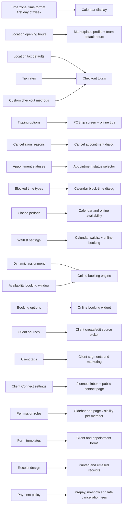

# Setup and Settings — deep technical pass (cartographer)

Baseline: first survey /Users/fahad/council/output (read-only). This file: deep pass over /setup and all settings sub-pages at https://partners.fresha.com.
Money values in workspace: KWD. Session OK as of 2026-10-04.

API note: every /setup page loads the same app-wide call set (session, provider, locations, onboarding-api onboarding-checklist, staff-notifications settings/activity-log-unread-count, customer-notifier-api v3/notification-types + provider-available-channels, partners-app wallet/credits summaries, partners-api-gateway GraphQL appInitializationQuery and feature-flag queries — full list in baseline pages.md). Only page-specific calls are listed per section below. GraphQL mutations for most Edit dialogs were not captured because dialogs were opened read-only or not at all; the one create payload captured (cancellation reasons) is JSON:API over partners-api.fresha.com REST.

## Settings tree

/setup — hub "Workspace settings" (Manage settings for Test Salon). Tabs: Settings, Online presence, Marketing, Other. The four tab groups render as one page with section headings; "Online presence", "Marketing", "Other" cards are buttons (client-side nav), main settings cards are links:

- Settings tab cards (links): Business setup /setup/business-setup; Scheduling /setup/scheduling; Sales /setup/sales; Clients /setup/clients; Billing /legal-entities; Team /setup/team; Forms /setup/forms-and-notes; Payments /setup/payments
- Online presence section: Marketplace profile; Reserve with Google; Book with Facebook and Instagram; Link builder (buttons "View")
- Marketing section: Blast marketing; Automations; Deals; Smart pricing; Sent messages; Ratings and reviews
- Other section: Add-ons; Integrations

(All sections complete; evidence files: snapshots and network captures in the task workspace; screenshots copied to technical/screenshots/.)

## Business setup — /setup/business-setup (hub)

Left sidebar: Business details, Locations links + non-link items (Service menu, Product list, Memberships, Packages, Clients list — buttons that navigate to catalogue areas, UNVERIFIED targets). Breadcrumb: Workspace settings -> Business setup.

### Business details — /setup/business-setup/business-details
- Purpose: business name, tax/language prefs, external links. Help link: help-center 101236-update-your-business-details.
- Read-only card "Business Info" with Edit button (opens edit view): Business name (Test Salon), Country (Kuwait), Currency (KWD), Tax calculation ("Retail prices include tax"), Team default language (English US), Client default language (English US).
- "External links" section: Facebook, X (Twitter), Instagram (each with "Add" link -> /setup/business-setup/business-details/edit/?field=facebookPage|twitterPage|instagramPage), Website (set).
- Screenshot: s-business-setup.png. Evidence: snap-business-setup.yml.

### Locations — /setup/business-setup/location-details
- Purpose: manage locations. Help 244-create-and-manage-business-locations.
- Row per location: name, review count, address, "Actions" button; row links to /setup/location/:locationId. Toolbar: Options, Add (create location).
- Screenshot: s-locations.png.

### Location detail — /setup/location/:locationId (redirects to /business-details)
- Header: location name, open/closed status + address, Options button. Breadcrumb: Workspace settings -> Locations -> <name>.
- Sub-nav: Business details (/business-details), Business location (/business-location), Opening hours (/opening-hours), Sales (/sales); separate buttons: "Marketplace profile settings", "Manage billing profiles".
- Business details page: Location details (Name, Email, Phone; Edit -> /basic-info/edit/), Business types (Main: Hair Salon; Additional: Nails, Beauty Salon, Eyebrows & Lashes; Edit -> /business-types/edit/).
- Opening hours: per-day hours (Sat 10:00-17:00, Sun Closed, Mon-Thu 10:00-19:00, Fri 10:00-19:00 observed); Edit -> /opening-hours/edit/; links to closed-periods in /setup/scheduling/closed-periods for holiday closures.
- Sales (location-level): Receipt sequencing (Receipt No. Prefix "-", Next receipt number 2; Edit -> /sales/receipt-sequencing/edit/), Tax defaults for services/products ("No tax", "using workspace defaults"; Edit -> /sales/tax-defaults/edit/), Tipping (options "All options enabled", defaults 10%/18%/25%, calculation "All items included", "using workspace defaults"; Edit -> /sales/edit-tipping/), Receipt details (Company name, Address, Receipt note; Edit -> /sales/edit-receipt-details/).
- Screenshots: s-location-detail.png, s-opening-hours.png, s-location-sales.png.
- Business location page (/setup/location/:locationId/business-location): Business address card (Edit -> /address/edit/) + embedded Google Map w/ "Open this area in Google Maps" external link. Evidence: snap-business-location.yml.

## Scheduling — /setup/scheduling (redirects to /time-and-calendar)

Sidebar sub-nav: Time and calendar (/time-and-calendar), Waitlist appointments (/waitlist), Blocked time types (/blocked-time-types), Resources (/resources), Cancellation reasons (/cancellation-reasons), Appointment statuses (/appointment-statuses), Closed periods (/closed-periods); "Online booking" group: Dynamic assignment (/dynamic-assignment), Availability (/availability), Booking options (/booking-options). Extra sidebar buttons: Marketplace profile, Service menu, Scheduled shifts.

### Time and calendar
- Date and time settings (Edit): Time zone (GMT+03 Kuwait), Time format (24 hours), First day of week (Saturday). Note: DST auto-applies from timezone.
- Calendar settings (Edit): Appointment color source (Category), Display processing time (Enabled), Display blocked time (Enabled). Help 486.

### Waitlist appointments (/waitlist)
- Settings (Edit): Waitlist type (Automatically book), Waitlist priority (First in line), Waitlist for online bookings (Active • Request any preferred time). Help 259.
- Links to automated messages (/marketing/automated-messages) for client notifications. Affects: calendar waitlist and online booking flow.

### Blocked time types (/blocked-time-types)
- Cards: emoji icon, name, duration + Paid/Unpaid. Existing: Lunch 30 min Unpaid, Training 1 hr Paid, Meeting 1 hr Paid. Add button. Actions per card (edit/delete, UNVERIFIED contents). Help 18. Affects: calendar "block time" dialog type options.

### Resources (/resources)
- Shows activation/upsell card "Included in your plan" — Manage your resources, rooms and equipment: assign resources to services, book appointments with no team members, resource utilization reporting. Buttons: Start now, Learn more (help 101215). Suggested types: Chair, Table, Bed, Room, Equipment. No resource list yet (feature not activated in this workspace).
- API: POST partners-api-gateway/graphql _query=resourcesSettings (200). Evidence: net-resources.txt.

### Cancellation reasons (/cancellation-reasons)
- List of reasons team picks when cancelling appointments (default: Duplicate appointment, Appointment made by mistake, Client not available). Toolbar: Options, Add. Row Actions menu (UNVERIFIED contents). Help 286.
- Add dialog: single field Name (placeholder "e.g. Local promotion", required), Add/Close buttons. URL /setup/scheduling/cancellation-reasons/edit/.
- API: GET/POST partners-api.fresha.com/cancellation-reasons. Create payload (observed, COUNCIL-TEST): {"data":{"attributes":{"name":"..."},"type":"cancellation-reasons"}} — JSON:API shape, 200.
- Affects: cancellation dialog in calendar/appointment drawer (reason list). Confirmed created reason appears in this list; consumer dialog not opened (UNVERIFIED).

### Appointment statuses (/appointment-statuses)
- System statuses: Booked, Confirmed, Arrived (Actions), Started (Actions), Completed, Canceled, No-show. Add button for custom statuses. Help 600. Affects: appointment status selector in calendar.

### Closed periods (/closed-periods)
- Empty state: "No upcoming closed periods" + Add. Help 20. Affects: calendar availability, linked from Opening hours page.

### Dynamic assignment (/dynamic-assignment)
- New appointment assignment (Edit): "Assign the team member with most availability on the day booked".
- Booked appointment reassignment (Edit): online-booked appointments can be reassigned, up to 15 minutes before start (observed values). Help 101218, 101735. Affects: online booking engine assignment.

### Availability (/availability)
- Booking window (Edit): book from 12 months in advance until immediately before start; cancel/reschedule anytime (observed).
- Schedule optimization (Edit): time options in 15-minute increments; clients can book any available time. Help 101218. Affects: online booking slots.

### Booking options (/booking-options)
- Team members (Edit): can book specific team members, view profiles/portfolio/star ratings; cannot book by gender (observed).
- Service menu (Edit): display images within services, featured services, service names in reviews.
- Group booking (Edit): clients can book group appointments.
- Upselling: disabled while online bookings not enabled; "Set up" link -> /fresha/online-booking/locations.
- Important info (Add): display key details before booking/purchase.
- Email notifications (Edit): send emails to specific addresses on online book/reschedule/cancel (one address configured).
- Help 101218. Affects: online booking widget behaviour.

## Sales — /setup/sales (redirects to /pay-now)

Sidebar sub-nav: Pay now (/pay-now), Tax rates (/tax-rates), Receipts (/receipts), Registers (/registers), Tipping (/tipping), Service charges (/service-charges), Gift cards (/gift-cards), Custom checkout methods (/payment-methods); separate button: Payment settings. Screenshot: s-sales-hub.png.

### Pay now (/setup/sales/pay-now)
- "Collect payment in one tap from the appointment panel, skipping the checkout flow entirely" (help 101717). Page shows a toggle (unnamed switch button) and a Fresha payments promo card: "Payments — Low cost, safe and simple payments with Fresha" with link "View Fresha payments" -> /fresha/card-processing/payment-processing.

### Tax rates (/setup/sales/tax-rates)
- Empty state "No tax rates" (workspace uses no tax); "Add tax" button opens dialog at /create/ with fields: Tax name (text), Tax rate (spinbutton, %). Note in dialog: applying to products/services is via tax defaults settings. Help 359.
- Affects: checkout totals in Sales/POS, service/product tax defaults, location Tax defaults page.

### Receipts (/setup/sales/receipts)
- Receipt design (Edit): Client mobile and email (Shown on receipt), Client address (Shown on receipt), Receipt title ("Sale"), Receipt custom line 1/2 (Add -> /edit/?field=saleCustomHeader1|saleCustomHeader2), Receipt footer (Add -> /edit/?field=receiptMessage). Help 133.
- Receipt sequencing card with Manage button (per-location, cf. location Sales page).

### Registers (/setup/sales/registers) — "Cash registers"
- Activation card "Included in your plan": daily opening/closing, track cash movements, petty cash and float balances. Buttons: Set up now, Learn more (help 104057). Not yet activated in this workspace.

### Tipping (/setup/sales/tipping)
- Tipping options: checkbox "Display a tip option screen at the Point of Sale" (checked); Default values 10% • 18% • 25% (Edit); Tip calculation "All items included" (Edit); "Advanced options" expander (contents UNVERIFIED). Help 352.
- Affects: POS tip screen and online checkout tips.

### Service charges (/setup/sales/service-charges)
- Empty state "No service charges"; Add button. Help 360. Affects: checkout extra charges (auto/manual).

### Gift cards (/setup/sales/gift-cards)
- Inactive state: "Gift cards inactive" + Set up button; Options toolbar button. Help 72. Affects: gift-cards-api sales, online store.

### Custom checkout methods (/setup/sales/payment-methods)
- List of manual payment methods: Cash (Active), Other (Active, Actions menu). Toolbar: Options, Add. Help 126.
- Affects: payment method choices at checkout (Sales page).

## Clients — /setup/clients (redirects to /client-sources)

Sidebar: Client sources (/client-sources), Client tags (/client-tags), Client Connect (/messages); extra buttons: Clients list, Client segments, Client loyalty.

### Client sources (/setup/clients/client-sources)
- Purpose: track how clients found the business. Toolbar: Options, Add. Help 15.
- Existing sources (all Active): Contact page, Referral Link, Walk-In, Instagram, Imported, Google, Fresha Marketplace, Facebook, Book Now Link.
- Affects: "source" picker when creating/editing a client, client reports.

### Client tags (/setup/clients/client-tags)
- Empty state "Set up client tags" + Add/Add tag. Help 100679. Affects: client profile tagging, segments/marketing filters.

### Client Connect (/setup/clients/messages)
- Feature banner "Included in your plan" — two-way messaging inbox; link "View inbox" -> /connect/customers. Dismissible banner. Help 101840.
- Messaging settings (Edit): client messaging enabled; clients can start new conversations; read receipts visible; typing indicators visible. Help 101842.
- Instant replies (Edit): currently not sending.
- Contact page settings (Edit): enabled, public link fresha.com/q/:slug; buttons Copy link, Generate QR, Preview.
- Affects: Client Connect inbox (/connect), public contact page.

## Billing — /legal-entities (redirects to /new-legal-entity/settings)

Breadcrumb: Workspace settings -> Billing. Sidebar buttons: Billing, Payment methods, Communication balance, Invoices and fees; Subscriptions; link to Locations (/setup/business-setup/location-details).
- "Billing details" card: "These details are used for invoices issued to you from Fresha, and for collecting payments." Empty state "Add your billing details" + Set up now (help: billing-and-fees). No legal entity configured in this workspace.
- NOTE: Subscriptions/payment-method/billing-detail setup dialogs are plan/billing-sensitive per safety rules and were not opened. UNVERIFIED contents.
- Screenshot: s-legal.png.

## Team — /setup/team (redirects to /permissions)

Sidebar: Permission roles (/permissions), Time off types (/time-off), Timesheets (/timesheets), Shifts (/shifts), Pay runs (/pay-runs), Commissions (/comissions — note Fresha's own URL misspelling), PIN switching (/pin-switching); extra buttons: Team members, Scheduled shifts.

### Permission roles (/setup/team/permissions)
- Purpose: what areas each role can access. Toolbar: Options, Add. Help 100687. Actions menu per role (UNVERIFIED contents — did not open to avoid role changes).
- Roles observed: Basic (partial: Calendar, Sales, Reports), Low (partial: +Clients, Online profile, Marketing, Team, Workspace), Medium (partial: +Catalog), High (full: Clients, Online profile, Marketing, Workspace; partial: Calendar, Sales, Catalog, Team, Reports, Payments and wallet).
- "Other": Workspace owner (Full access to all areas, current user), No access (no workspace features).
- Affects: every sidebar/page visibility per team member.

### Other team pages (visited via sidebar links; content UNVERIFIED in depth): time-off types, timesheets, shifts, pay runs, commissions, PIN switching. Routes recorded above.

## Forms — /setup/forms-and-notes (redirects to /form-templates)
- Form templates: create/manage templates added to clients or appointments. Add button. Existing: "COVID 19" (Inactive) with Actions menu. Help 61. Affects: client/appointment forms (attachment prompt in calendar/clients).

## Payments — /setup/payments (redirects to /payment-policy)

Sidebar: Payment policy (/payment-policy), Payment methods (/payment-methods); extra button: Sales settings (presumably back to /setup/sales).

### Payment policy (/setup/payments/payment-policy)
- "Choose if clients prepay for appointments and manage no-show and late cancellation fees." Gated: only a Fresha Payments promo card is shown (Get paid online, save cards on file, protect against no-shows, payouts to bank) with "Start now" -> /fresha/card-processing/payment-processing and Learn more. Help payments#payment-policies. No policy configurable until card processing activated (UNVERIFIED beyond promo).

### Payment methods (/setup/payments/payment-methods)
- Same Fresha Payments activation promo (Start now / Learn more). Gated.

## Personal (user account) settings — /user-account/personal-settings

Tabs/routes: Personal info (/personal-info), Login & security (/login-security), Appearance (/appearance). Breadcrumb: Account settings.

### Personal info (/user-account/personal-settings/personal-info)
- Contact card (Edit): Legal Name, Mobile number (masked), Email address (masked).
- Online profile visibility: "Hide profile" button (hides professional marketplace profile).
- Note: identity-verification details cannot be edited.

### Login & security (/user-account/personal-settings/login-security)
- Login details: Password (masked, Change password button), Google (Not connected, Connect), Apple (Not connected, Connect).
- Trusted devices (can skip 2FA): list with Revoke per device, Revoke all devices.
- Active sessions: list with Sign Out per session, Sign Out of All Devices.
- Delete account: "Delete your account" button (NOT triggered per safety rules).

### Appearance (/user-account/personal-settings/appearance)
- Theme radiogroup: Light / Dark / System (System checked).

## Safe edits performed
- Created cancellation reason "COUNCIL-TEST cancellation reason" (see technical/test-records.md for the exact POST payload). Confirmed it appears in the list on /setup/scheduling/cancellation-reasons. No toggles flipped; no other data changed.

## Gated / unavailable settings (this workspace)
- Resources (/setup/scheduling/resources): not activated — "Start now" activation card.
- Cash registers (/setup/sales/registers): not activated — "Set up now" card.
- Gift cards (/setup/sales/gift-cards): inactive — "Set up" card.
- Billing details (/legal-entities): not configured — "Set up now" card.
- Payment policy + Payment methods (/setup/payments/*): gated behind Fresha card-processing activation.
- Upselling (booking options): disabled until online bookings enabled.
- Fresha payments promo surfaces on /setup/sales/pay-now and both /setup/payments pages.

## Diagrams

### Settings tree

```mermaid
flowchart TD
  H["/setup Workspace settings hub"] --> BS["/setup/business-setup"]
  H --> SC["/setup/scheduling"]
  H --> SA["/setup/sales"]
  H --> CL["/setup/clients"]
  H --> LE["/legal-entities Billing"]
  H --> TM["/setup/team"]
  H --> FO["/setup/forms-and-notes"]
  H --> PA["/setup/payments"]
  H --> OP["Online presence cards"]
  H --> MK["Marketing cards"]
  H --> OT["Other: Add-ons, Integrations"]
  BS --> BSD["Business details"]
  BS --> LOC["Locations list"]
  LOC --> LD["/setup/location/:id"]
  LD --> LDB["Business details"]
  LD --> LBL["Business location + map"]
  LD --> LOH["Opening hours"]
  LD --> LDS["Location sales"]
  SC --> TAC["Time and calendar"]
  SC --> WL["Waitlist"]
  SC --> BTT["Blocked time types"]
  SC --> RES["Resources gated"]
  SC --> CR["Cancellation reasons"]
  SC --> AS["Appointment statuses"]
  SC --> CP["Closed periods"]
  SC --> DA["Dynamic assignment"]
  SC --> AV["Availability"]
  SC --> BO["Booking options"]
  SA --> PN["Pay now"]
  SA --> TR["Tax rates"]
  SA --> RC["Receipts"]
  SA --> RG["Registers gated"]
  SA --> TP["Tipping"]
  SA --> SVC["Service charges"]
  SA --> GC["Gift cards gated"]
  SA --> CCM["Custom checkout methods"]
  CL --> CS["Client sources"]
  CL --> CT["Client tags"]
  CL --> CC["Client Connect"]
  TM --> PR["Permission roles"]
  TM --> TO["Time off, Timesheets, Shifts, Pay runs, Commissions, PIN switching"]
  FO --> FT["Form templates"]
  PA --> PP["Payment policy gated"]
  PA --> PM["Payment methods gated"]
  U["/user-account/personal-settings"] --> PI["Personal info"]
  U --> LS["Login and security"]
  U --> AP["Appearance"]
```

### Settings -> affected features

